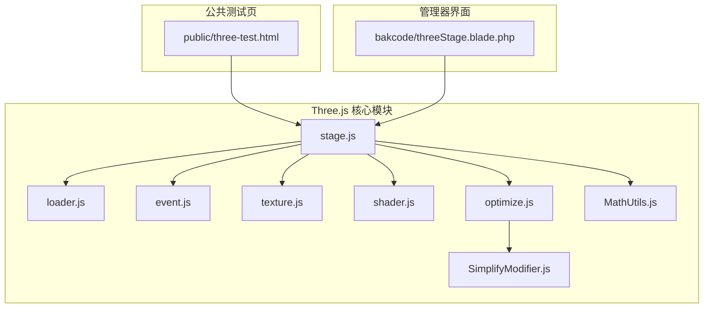
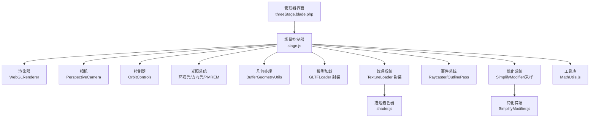
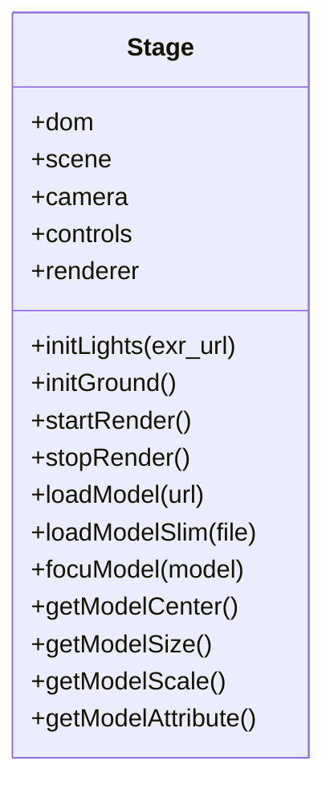
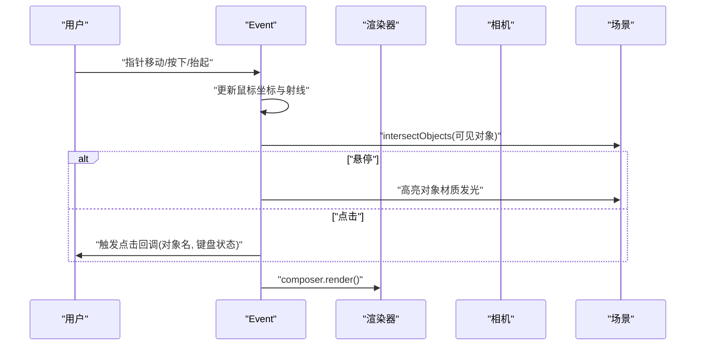
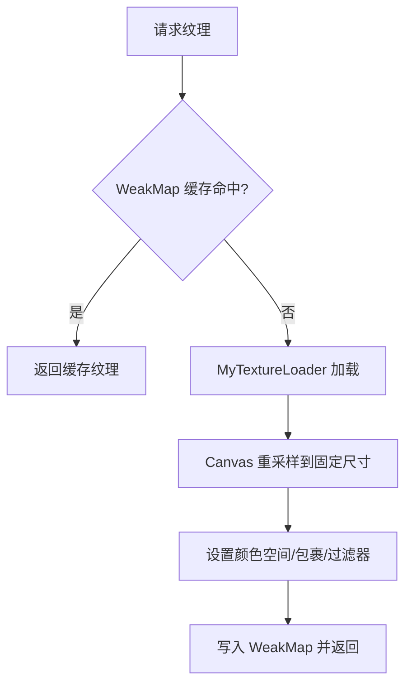
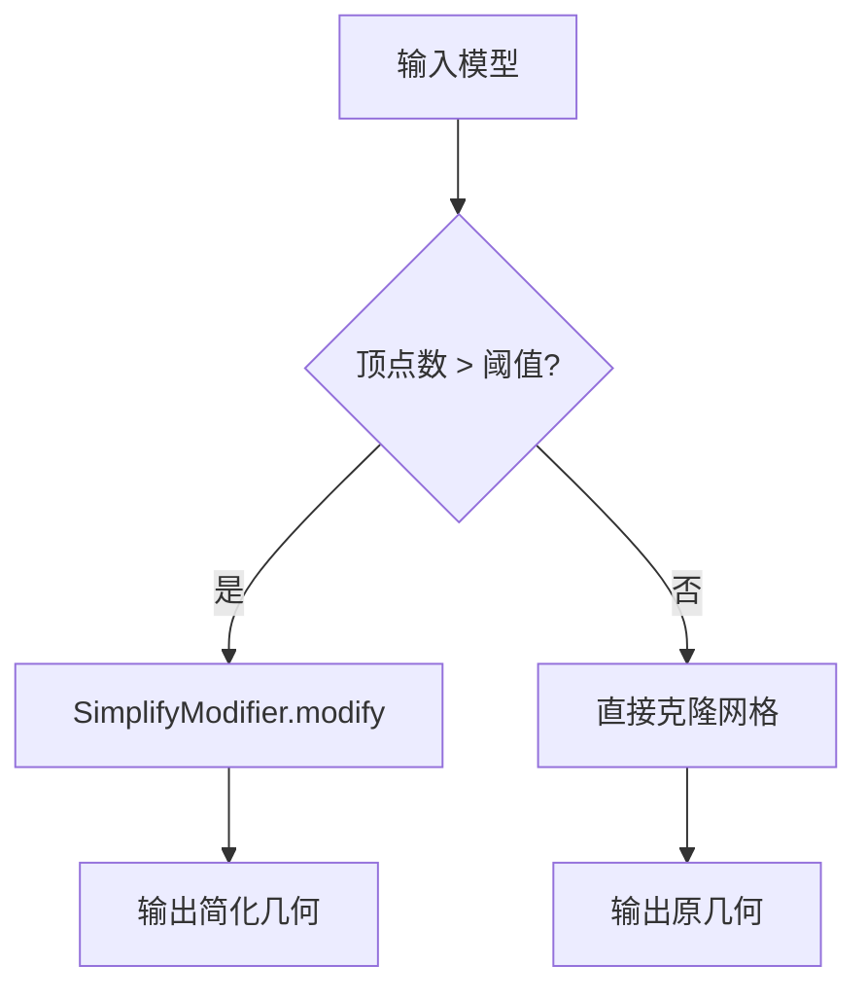
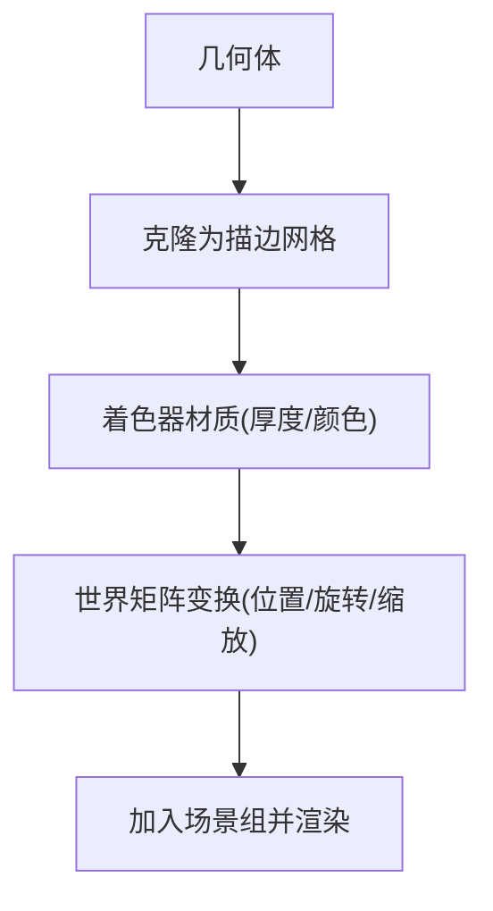
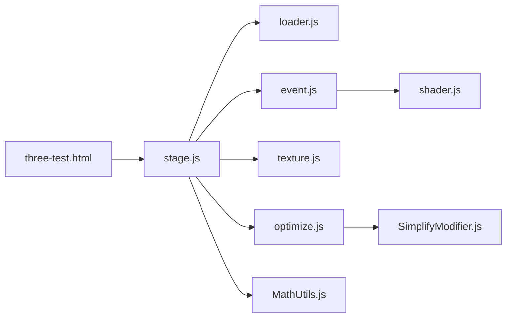

# 3D可视化系统

<cite>
**本文档引用的文件**
- [three-test.html](file://public/three-test.html)
- [threeStage.blade.php](file://bakcode/threeStage.blade.php)
- [stage.js](file://bakcode/modules/three/stage.js)
- [loader.js](file://bakcode/modules/three/loader.js)
- [event.js](file://bakcode/modules/three/event.js)
- [optimize.js](file://bakcode/modules/three/optimize.js)
- [texture.js](file://bakcode/modules/three/texture.js)
- [shader.js](file://bakcode/modules/three/shader.js)
- [MathUtils.js](file://bakcode/modules/three/MathUtils.js)
- [SimplifyModifier.js](file://bakcode/modules/three/SimplifyModifier.js)
</cite>

## 目录
1. [简介](#简介)
2. [项目结构](#项目结构)
3. [核心组件](#核心组件)
4. [架构总览](#架构总览)
5. [详细组件分析](#详细组件分析)
6. [依赖关系分析](#依赖关系分析)
7. [性能考量](#性能考量)
8. [故障排查指南](#故障排查指南)
9. [结论](#结论)
10. [附录](#附录)

## 简介
本系统基于 Three.js 0.171.0 与 Tween.js 18.6.4，为芸众商城提供商品3D展示能力。系统涵盖场景管理、相机控制、光照系统、材质与纹理映射、交互拾取、模型优化（减面、简化）、导出与检测等功能，并提供完整的前端工作流与后端服务对接能力。

## 项目结构
围绕3D可视化的核心代码位于 bakcode/modules/three 目录，配套的 Blade 视图模板用于管理器界面，public 目录提供本地测试页面以验证 Three.js 与 Tween.js 的引入与运行状态。

**图表来源**
- [three-test.html:1-57](file://public/three-test.html#L1-L57)
- [threeStage.blade.php:1-800](file://bakcode/threeStage.blade.php#L1-L800)
- [stage.js:1-800](file://bakcode/modules/three/stage.js#L1-L800)
- [loader.js:1-48](file://bakcode/modules/three/loader.js#L1-L48)
- [event.js:1-378](file://bakcode/modules/three/event.js#L1-L378)
- [optimize.js:1-87](file://bakcode/modules/three/optimize.js#L1-L87)
- [SimplifyModifier.js:1-800](file://bakcode/modules/three/SimplifyModifier.js#L1-L800)
- [texture.js:1-59](file://bakcode/modules/three/texture.js#L1-L59)
- [shader.js:1-23](file://bakcode/modules/three/shader.js#L1-L23)
- [MathUtils.js:1-364](file://bakcode/modules/three/MathUtils.js#L1-L364)

**章节来源**
- [three-test.html:1-57](file://public/three-test.html#L1-L57)
- [threeStage.blade.php:1-800](file://bakcode/threeStage.blade.php#L1-L800)

## 核心组件
- 场景管理与渲染循环：初始化场景、相机、渲染器、阴影与色调映射；提供窗口自适应与渲染循环控制。
- 相机控制：基于 OrbitControls 提供轨道旋转、平移、缩放与距离限制。
- 光照系统：支持环境光、方向光与基于房间环境的 PMREM 环境贴图；可切换 EXR 环境贴图。
- 事件与交互：Raycaster 拾取、悬停高亮、部件选择、键盘修饰键组合操作。
- 模型加载与处理：GLTF 加载器封装、文件读取加载、模型遍历与材质白化、透明度排序、包围盒与尺寸计算。
- 材质与纹理：纹理加载、尺寸适配、Mipmap 与各向异性过滤、Repeat 包裹模式。
- 几何优化：简化算法（SimplifyModifier）、顶点合并、几何清理与采样简化。
- 导出与检测：GLTF/DRACO 导出器、模型检测（坐标归零、贴地、尺寸、顶点属性、缩放）。

**章节来源**
- [stage.js:111-282](file://bakcode/modules/three/stage.js#L111-L282)
- [stage.js:287-435](file://bakcode/modules/three/stage.js#L287-L435)
- [stage.js:487-775](file://bakcode/modules/three/stage.js#L487-L775)
- [event.js:26-140](file://bakcode/modules/three/event.js#L26-L140)
- [loader.js:1-48](file://bakcode/modules/three/loader.js#L1-L48)
- [texture.js:1-59](file://bakcode/modules/three/texture.js#L1-L59)
- [optimize.js:1-87](file://bakcode/modules/three/optimize.js#L1-L87)
- [SimplifyModifier.js:21-229](file://bakcode/modules/three/SimplifyModifier.js#L21-L229)

## 架构总览
系统采用模块化分层设计：视图层（Blade 模板）负责管理器 UI；逻辑层（stage.js）封装 Three.js 场景生命周期；交互层（event.js）负责拾取与渲染管线；资源层（loader.js、texture.js）负责模型与纹理加载；优化层（optimize.js、SimplifyModifier.js）负责几何简化与采样；工具层（MathUtils.js、shader.js）提供数学运算与着色器定义。

**图表来源**
- [threeStage.blade.php:1-800](file://bakcode/threeStage.blade.php#L1-L800)
- [stage.js:1-800](file://bakcode/modules/three/stage.js#L1-L800)
- [event.js:1-378](file://bakcode/modules/three/event.js#L1-L378)
- [loader.js:1-48](file://bakcode/modules/three/loader.js#L1-L48)
- [texture.js:1-59](file://bakcode/modules/three/texture.js#L1-L59)
- [optimize.js:1-87](file://bakcode/modules/three/optimize.js#L1-L87)
- [SimplifyModifier.js:1-800](file://bakcode/modules/three/SimplifyModifier.js#L1-L800)
- [shader.js:1-23](file://bakcode/modules/three/shader.js#L1-L23)
- [MathUtils.js:1-364](file://bakcode/modules/three/MathUtils.js#L1-L364)

## 详细组件分析

### 场景与渲染管理（Stage）
- 初始化：创建 Scene、PerspectiveCamera、WebGLRenderer（抗锯齿、多重采样、阴影、色调映射），绑定窗口 resize 事件。
- 相机控制：OrbitControls，设置最大/最小距离，监听 change/end 回调。
- 光源：支持多套光照方案（环境光+多方向光、PMREM 房间环境、EXR 环境贴图）。
- 地面：环形平面接收阴影，作为投影基础。
- 渲染循环：Stats 性能监控，每帧刷新控制器与事件系统。
- 模型加载：GLTFLoader 封装，遍历模型节点进行材质白化、双面渲染、透明排序、纹理参数设置与包围盒计算。
- 模型检测：计算中心、尺寸、缩放、顶点属性存在性，支持贴地校验与尺寸对比。

**图表来源**
- [stage.js:69-172](file://bakcode/modules/three/stage.js#L69-L172)
- [stage.js:237-435](file://bakcode/modules/three/stage.js#L237-L435)
- [stage.js:487-775](file://bakcode/modules/three/stage.js#L487-L775)

**章节来源**
- [stage.js:111-282](file://bakcode/modules/three/stage.js#L111-L282)
- [stage.js:287-435](file://bakcode/modules/three/stage.js#L287-L435)
- [stage.js:487-775](file://bakcode/modules/three/stage.js#L487-L775)

### 事件与交互（Event）
- 拾取：Raycaster + mouse 二维坐标到三维世界射线，交集对象集合按可见性过滤。
- 高亮与选中：悬停高亮（OutlinePass）、部件选中（自定义描边着色器），支持键盘修饰键组合（Ctrl/Shift）。
- 后处理：EffectComposer + RenderPass + OutlinePass + GammaCorrectionShader。
- 生命周期：绑定/解绑事件、清理着色器与渲染目标、释放资源。

**图表来源**
- [event.js:26-140](file://bakcode/modules/three/event.js#L26-L140)
- [event.js:225-340](file://bakcode/modules/three/event.js#L225-L340)

**章节来源**
- [event.js:26-140](file://bakcode/modules/three/event.js#L26-L140)
- [event.js:225-340](file://bakcode/modules/three/event.js#L225-L340)

### 模型加载与纹理（Loader/Texture）
- Loader 封装：统一 Promise 包装 GLTFLoader、TextureLoader、EXRLoader，提供进度回调与错误处理。
- Texture：纹理加载、Canvas 重采样至固定尺寸、SRGB 颜色空间、Repeat 包裹、Mipmap 与各向异性过滤缓存复用。

**图表来源**
- [loader.js:1-48](file://bakcode/modules/three/loader.js#L1-L48)
- [texture.js:21-43](file://bakcode/modules/three/texture.js#L21-L43)

**章节来源**
- [loader.js:1-48](file://bakcode/modules/three/loader.js#L1-L48)
- [texture.js:1-59](file://bakcode/modules/three/texture.js#L1-L59)

### 几何优化与简化（Optimize/SimplifyModifier）
- 采样简化：按顶点数量阈值决定是否简化，保留 position/normal/uv 属性。
- 顶点合并：使用 BufferGeometryUtils.mergeVertices 清理重复顶点。
- 简化算法：SimplifyModifier 基于边折叠的成本函数，支持同步与异步执行，中间插入主线程让渡以避免阻塞。

**图表来源**
- [optimize.js:10-31](file://bakcode/modules/three/optimize.js#L10-L31)
- [SimplifyModifier.js:29-229](file://bakcode/modules/three/SimplifyModifier.js#L29-L229)

**章节来源**
- [optimize.js:1-87](file://bakcode/modules/three/optimize.js#L1-L87)
- [SimplifyModifier.js:21-229](file://bakcode/modules/three/SimplifyModifier.js#L21-L229)

### 着色器与描边（Shader）
- 自定义描边着色器：通过法线偏移实现外轮廓描边，支持厚度与颜色参数，BackSide 用于内部轮廓。

**图表来源**
- [shader.js:1-23](file://bakcode/modules/three/shader.js#L1-L23)
- [event.js:189-221](file://bakcode/modules/three/event.js#L189-L221)

**章节来源**
- [shader.js:1-23](file://bakcode/modules/three/shader.js#L1-L23)
- [event.js:189-221](file://bakcode/modules/three/event.js#L189-L221)

### 数学工具与实用函数（MathUtils）
- 提供常用数学函数：角度弧度转换、插值、阻尼、平滑曲线、随机数、幂次判断与对数上取整/下取整、四元数欧拉角设置、归一化/反归一化等。

**章节来源**
- [MathUtils.js:1-364](file://bakcode/modules/three/MathUtils.js#L1-L364)

## 依赖关系分析
- 模块耦合：stage.js 作为中枢，依赖 loader.js、event.js、texture.js、optimize.js、MathUtils.js；event.js 依赖 shader.js 与后处理库；optimize.js 依赖 SimplifyModifier.js。
- 外部依赖：Three.js 0.171.0（核心）、Tween.js 18.6.4（动画库）、浏览器原生 FileReader/Blob 用于本地模型加载。
- 资源路径：通过 importmap 在测试页中指向静态资源目录，确保模块化加载。

**图表来源**
- [stage.js:1-800](file://bakcode/modules/three/stage.js#L1-L800)
- [loader.js:1-48](file://bakcode/modules/three/loader.js#L1-L48)
- [event.js:1-378](file://bakcode/modules/three/event.js#L1-L378)
- [optimize.js:1-87](file://bakcode/modules/three/optimize.js#L1-L87)
- [SimplifyModifier.js:1-800](file://bakcode/modules/three/SimplifyModifier.js#L1-L800)
- [shader.js:1-23](file://bakcode/modules/three/shader.js#L1-L23)
- [MathUtils.js:1-364](file://bakcode/modules/three/MathUtils.js#L1-L364)
- [three-test.html:43-51](file://public/three-test.html#L43-L51)

**章节来源**
- [stage.js:1-800](file://bakcode/modules/three/stage.js#L1-L800)
- [three-test.html:43-51](file://public/three-test.html#L43-L51)

## 性能考量
- 渲染性能
  - 抗锯齿与多重采样：开启 antialias 与 WebGL2 MSAA（若设备支持），提升边缘质量但增加带宽消耗。
  - 阴影与色调映射：PCF 软阴影与 NeutralToneMapping 平衡真实感与性能。
  - 渲染顺序：半透明对象后渲染（renderOrder=2），减少混合开销。
- 几何与纹理
  - Mipmap 与各向异性过滤：降低远距离采样伪影，提升视觉质量。
  - 纹理尺寸：统一重采样至固定尺寸，平衡内存占用与清晰度。
  - 顶点合并与简化：减少冗余顶点与面数，显著降低 GPU 负担。
- 交互与动画
  - Stats 监控帧率与内存使用，定位瓶颈。
  - 控制器更新与事件刷新分离，避免不必要的重绘。
- 导出与检测
  - GLTF/DRACO 导出器配合简化结果，保证导出模型质量与体积可控。
  - 模型检测报告辅助规范模型数据，减少运行时异常。

[本节为通用性能建议，无需特定文件引用]

## 故障排查指南
- 模型加载失败
  - 检查 GLTF 路径与跨域访问，确认 Loader 回调中的错误日志。
  - 使用本地文件读取方式（FileReader + Blob）验证模型完整性。
- 交互无响应
  - 确认 Event 组件已绑定指针事件与键盘事件，检查可见对象列表。
  - 检查 Raycaster 射线与 intersectObjects 的过滤条件。
- 性能问题
  - 关注 Stats 输出，优先优化几何复杂度与纹理尺寸。
  - 适当降低阴影贴图分辨率或关闭软阴影。
- 导出异常
  - 确认 DRACO 编码模块已正确注入，简化后再导出。
  - 检查模型是否存在缺失顶点属性（position/normal/uv）。

**章节来源**
- [loader.js:10-27](file://bakcode/modules/three/loader.js#L10-L27)
- [event.js:225-340](file://bakcode/modules/three/event.js#L225-L340)
- [stage.js:487-552](file://bakcode/modules/three/stage.js#L487-L552)

## 结论
该3D可视化系统以模块化方式整合了场景管理、光照、交互、纹理与几何优化等核心能力，结合管理器界面与检测导出功能，形成完整的商品3D展示解决方案。通过合理的性能策略与严格的模型规范，可在保证视觉质量的同时满足线上性能要求。

## 附录
- 本地测试：three-test.html 通过 importmap 引入 Three.js 与 Tween.js，验证模块化加载与运行。
- 界面管理器：threeStage.blade.php 提供模型上传、部件管理、材质贴图、减面与检测报告等完整工作流。

**章节来源**
- [three-test.html:1-57](file://public/three-test.html#L1-L57)
- [threeStage.blade.php:1-800](file://bakcode/threeStage.blade.php#L1-L800)