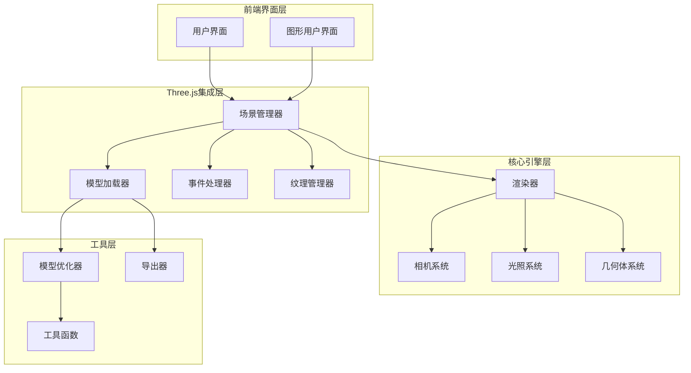
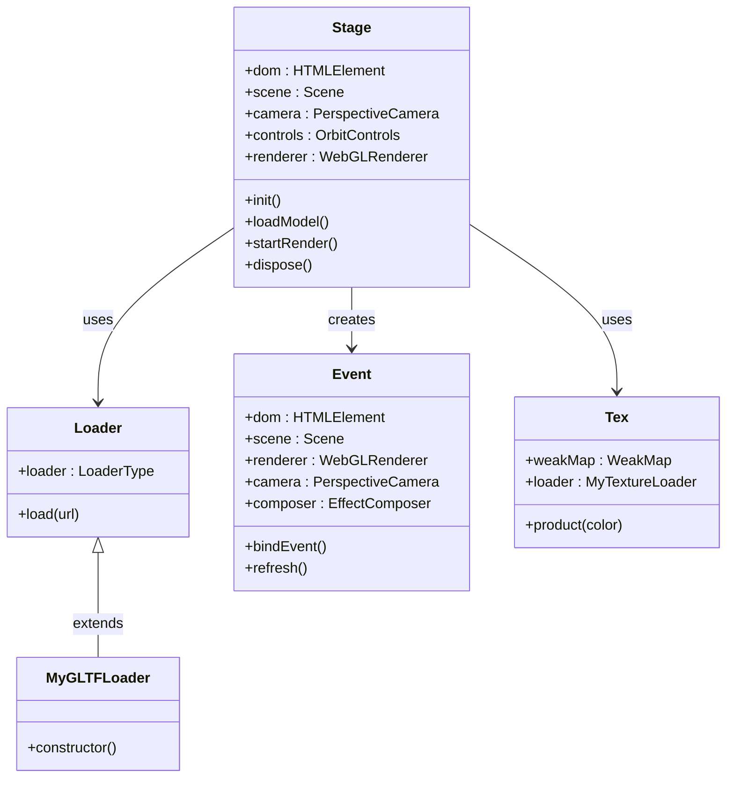
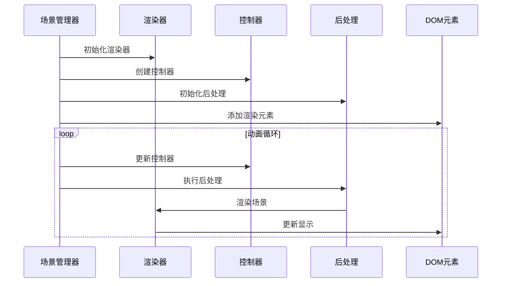
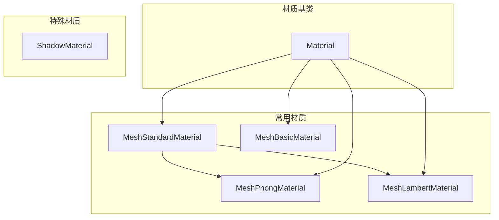
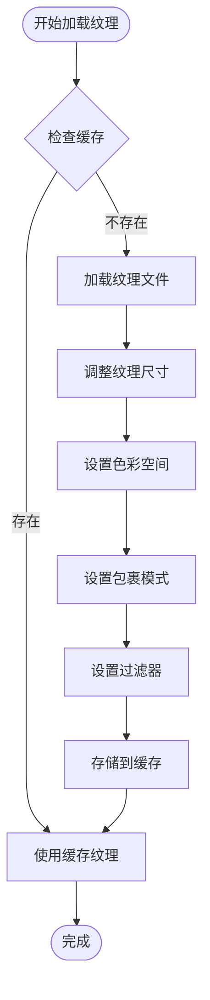
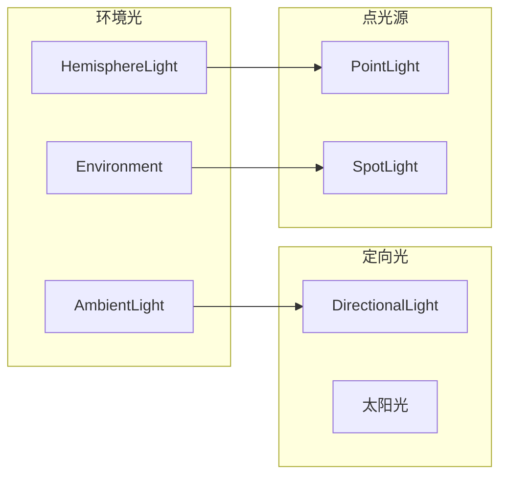
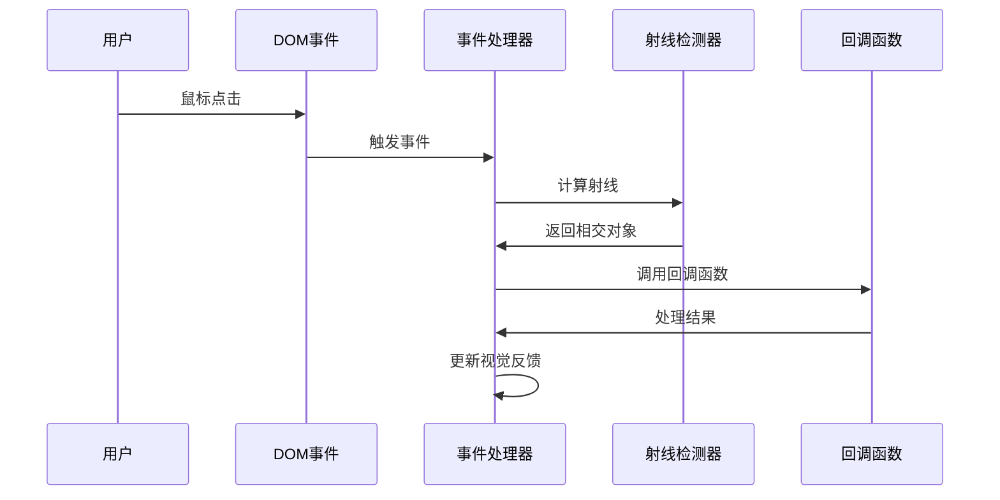
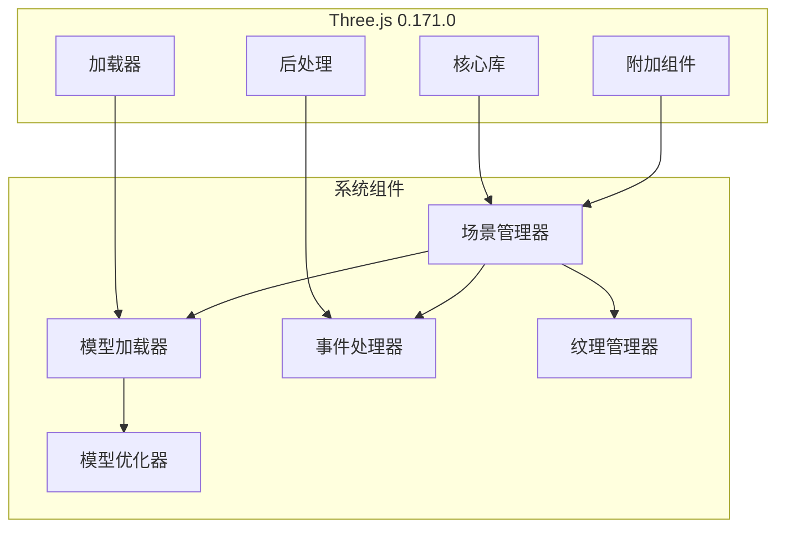

# Three.js集成架构

<cite>
**本文档引用的文件**
- [stage.js](file://bakcode/modules/three/stage.js)
- [loader.js](file://bakcode/modules/three/loader.js)
- [event.js](file://bakcode/modules/three/event.js)
- [shader.js](file://bakcode/modules/three/shader.js)
- [texture.js](file://bakcode/modules/three/texture.js)
- [optimize.js](file://bakcode/modules/three/optimize.js)
- [MathUtils.js](file://bakcode/modules/three/MathUtils.js)
- [BufferGeometryUtils.js](file://bakcode/modules/three/BufferGeometryUtils.js)
- [SimplifyModifier.js](file://bakcode/modules/three/SimplifyModifier.js)
- [DRACOExporter.js](file://bakcode/modules/three/DRACOExporter.js)
- [threeStage.blade.php](file://bakcode/threeStage.blade.php)
- [three-test.html](file://public/three-test.html)
- [three-test.js](file://static/threejs/js/three-test.js)
- [package-lock.json](file://package-lock.json)
- [index.html](file://addons/yun_shop/index.html)
</cite>

## 目录
1. [引言](#引言)
2. [项目结构](#项目结构)
3. [核心组件](#核心组件)
4. [架构概览](#架构概览)
5. [详细组件分析](#详细组件分析)
6. [依赖关系分析](#依赖关系分析)
7. [性能考虑](#性能考虑)
8. [故障排除指南](#故障排除指南)
9. [结论](#结论)

## 引言

芸众商城项目集成了Three.js 0.171.0版本，构建了一个完整的3D商品展示系统。该系统不仅实现了基础的3D渲染功能，还提供了高级的材质管理、光照系统、交互控制和模型优化等专业级特性。

本项目采用模块化设计，将Three.js的核心功能封装为独立的组件，包括场景管理、模型加载、材质处理、光照控制、事件处理等。通过这种架构设计，系统能够支持复杂的3D商品展示需求，包括模型加载、缩放旋转、视角切换、材质更换等功能。

## 项目结构

项目采用分层架构设计，主要分为以下几个层次：

**图表来源**
- [stage.js:1-172](file://bakcode/modules/three/stage.js#L1-L172)
- [loader.js:1-48](file://bakcode/modules/three/loader.js#L1-L48)
- [event.js:1-76](file://bakcode/modules/three/event.js#L1-L76)

**章节来源**
- [stage.js:1-172](file://bakcode/modules/three/stage.js#L1-L172)
- [threeStage.blade.php:1-800](file://bakcode/threeStage.blade.php#L1-L800)

## 核心组件

### 场景管理器（Stage）

场景管理器是整个Three.js集成的核心组件，负责协调各个子系统的运行。它继承了Three.js的Scene类，扩展了以下功能：

- **初始化配置**：设置场景背景、相机参数、渲染器选项
- **模型管理**：加载、显示、控制3D模型
- **光照系统**：管理环境光、方向光、点光源等
- **交互控制**：处理用户输入和鼠标事件
- **资源清理**：提供完整的资源释放机制

### 模型加载器（Loader）

模型加载器提供了统一的模型加载接口，支持多种格式：

- **GLTF格式**：现代3D模型标准格式
- **纹理贴图**：支持各种图像格式
- **EXR环境贴图**：用于高级光照效果
- **进度跟踪**：实时显示加载进度

### 事件处理器（Event）

事件处理器实现了完整的3D交互系统：

- **鼠标事件**：点击、悬停、拖拽操作
- **键盘控制**：快捷键支持
- **射线检测**：精确的对象选择
- **视觉反馈**：高亮显示和轮廓描边

### 纹理管理器（Texture）

纹理管理器提供了高效的纹理处理能力：

- **纹理缓存**：避免重复加载
- **尺寸调整**：自动适配屏幕分辨率
- **颜色空间**：支持sRGB色彩空间
- **过滤优化**：智能纹理过滤算法

**章节来源**
- [stage.js:69-172](file://bakcode/modules/three/stage.js#L69-L172)
- [loader.js:5-48](file://bakcode/modules/three/loader.js#L5-L48)
- [event.js:26-76](file://bakcode/modules/three/event.js#L26-L76)
- [texture.js:9-59](file://bakcode/modules/three/texture.js#L9-L59)

## 架构概览

系统采用分层架构设计，确保各组件之间的松耦合和高内聚：

**图表来源**
- [stage.js:69-172](file://bakcode/modules/three/stage.js#L69-L172)
- [loader.js:5-48](file://bakcode/modules/three/loader.js#L5-L48)
- [event.js:26-76](file://bakcode/modules/three/event.js#L26-L76)
- [texture.js:9-59](file://bakcode/modules/three/texture.js#L9-L59)

## 详细组件分析

### 渲染管线分析

Three.js的渲染管线在系统中得到了完整实现，包括以下关键阶段：

**图表来源**
- [stage.js:455-475](file://bakcode/modules/three/stage.js#L455-L475)
- [event.js:225-227](file://bakcode/modules/three/event.js#L225-L227)

### 几何体创建与管理

系统支持多种几何体类型，并提供了统一的创建接口：

| 几何体类型 | 参数配置 | 应用场景 |
|------------|----------|----------|
| BoxGeometry | 宽、高、深 | 箱体模型、包装盒 |
| SphereGeometry | 半径、分段数 | 球形物体、装饰元素 |
| CylinderGeometry | 底半径、顶半径、高 | 柱状物体、管道 |
| PlaneGeometry | 宽、高、分段 | 平面、地面、墙面 |
| TorusGeometry | 半径、管半径、分段 | 环形物体、轮胎 |

### 材质系统架构

材质系统提供了丰富的材质类型和属性控制：

**图表来源**
- [stage.js:504-551](file://bakcode/modules/three/stage.js#L504-L551)

### 纹理处理机制

纹理处理系统实现了完整的纹理生命周期管理：

**图表来源**
- [texture.js:21-43](file://bakcode/modules/three/texture.js#L21-L43)

### 相机控制系统

系统实现了完整的相机控制功能，支持多种控制模式：

| 控制模式 | 特性描述 | 适用场景 |
|----------|----------|----------|
| OrbitControls | 轨道控制器 | 360度全方位观察 |
| FirstPersonControls | 第一人称控制 | 漫游体验 |
| PointerLockControls | 指针锁定控制 | 游戏式交互 |
| TrackballControls | 轨道球控制 | 精细旋转操作 |

### 光源系统设计

光照系统提供了多种光源类型，满足不同的渲染需求：

**图表来源**
- [stage.js:287-435](file://bakcode/modules/three/stage.js#L287-L435)

### 事件处理系统

事件处理系统实现了完整的3D交互功能：

**图表来源**
- [event.js:250-300](file://bakcode/modules/three/event.js#L250-L300)

**章节来源**
- [stage.js:287-435](file://bakcode/modules/three/stage.js#L287-L435)
- [event.js:250-300](file://bakcode/modules/three/event.js#L250-L300)
- [texture.js:21-43](file://bakcode/modules/three/texture.js#L21-L43)

## 依赖关系分析

系统对外部依赖进行了精心管理，确保版本兼容性和功能完整性：

**图表来源**
- [package-lock.json:8388-8392](file://package-lock.json#L8388-L8392)
- [stage.js:1-67](file://bakcode/modules/three/stage.js#L1-L67)

**章节来源**
- [package-lock.json:8388-8392](file://package-lock.json#L8388-L8392)
- [stage.js:1-67](file://bakcode/modules/three/stage.js#L1-L67)

## 性能考虑

系统在设计时充分考虑了性能优化，采用了多种优化策略：

### 渲染性能优化

- **多重采样抗锯齿**：在支持的设备上启用MSAA
- **阴影映射优化**：合理设置阴影贴图分辨率
- **视锥体裁剪**：只渲染可见对象
- **实例化渲染**：大量相似对象的高效渲染

### 内存管理优化

- **纹理缓存**：避免重复加载相同纹理
- **几何体复用**：共享几何体数据
- **垃圾回收**：及时释放不再使用的资源
- **弱引用**：使用WeakMap管理缓存

### 加载性能优化

- **异步加载**：避免阻塞主线程
- **进度反馈**：实时显示加载状态
- **错误处理**：优雅处理加载失败
- **缓存策略**：合理利用浏览器缓存

## 故障排除指南

### 常见问题及解决方案

| 问题类型 | 症状描述 | 解决方案 |
|----------|----------|----------|
| 渲染异常 | 场景无法显示或显示异常 | 检查WebGL支持和权限 |
| 模型加载失败 | 模型文件无法加载 | 验证文件路径和格式 |
| 性能问题 | 渲染帧率低 | 优化几何体复杂度和纹理大小 |
| 交互无响应 | 鼠标事件失效 | 检查事件绑定和层级关系 |

### 调试工具使用

系统提供了完善的调试功能：

- **性能监控**：实时显示渲染性能指标
- **场景检查**：验证场景结构和对象状态
- **内存泄漏检测**：监控内存使用情况
- **错误日志**：详细的错误信息记录

**章节来源**
- [stage.js:251-282](file://bakcode/modules/three/stage.js#L251-L282)

## 结论

芸众商城的Three.js集成架构展现了现代Web 3D应用的最佳实践。通过模块化设计、完善的资源管理和高性能优化，系统成功实现了复杂的3D商品展示功能。

该架构的主要优势包括：

1. **模块化设计**：清晰的组件分离，便于维护和扩展
2. **性能优化**：多层面的性能优化策略
3. **用户体验**：流畅的交互体验和丰富的视觉效果
4. **技术先进性**：采用最新的Three.js 0.171.0版本
5. **可扩展性**：良好的架构设计支持功能扩展

未来可以进一步优化的方向包括：

- 实现更高级的物理渲染（PBR）
- 集成WebXR技术支持VR/AR
- 优化移动端性能表现
- 增强实时协作功能

这个Three.js集成架构为其他电商项目的3D展示功能提供了优秀的参考模板。