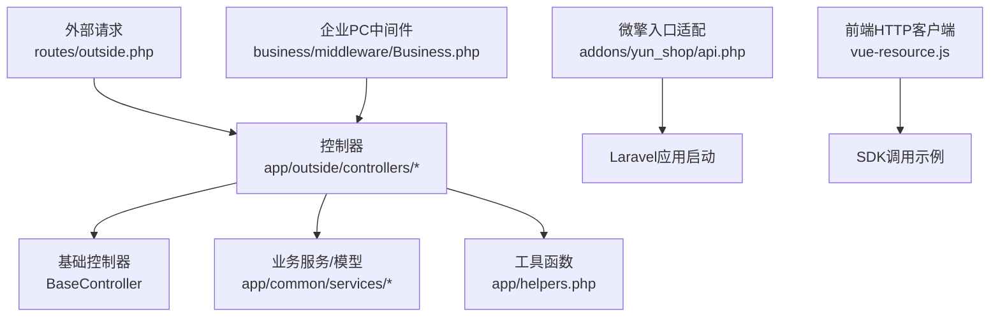
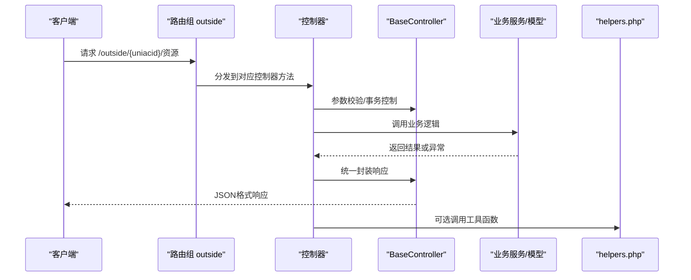
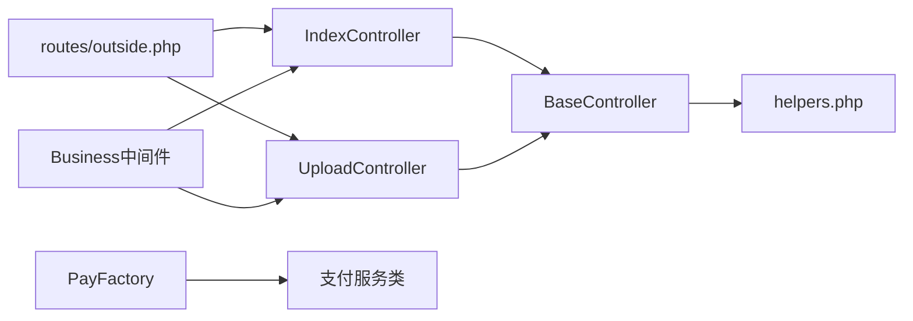

# API参考文档

<cite>
**本文档引用的文件**
- [routes/outside.php](file://routes/outside.php)
- [addons/yun_shop/api.php](file://addons/yun_shop/api.php)
- [app/outside/controllers/IndexController.php](file://app/outside/controllers/IndexController.php)
- [app/outside/controllers/UploadController.php](file://app/outside/controllers/UploadController.php)
- [app/common/services/PayFactory.php](file://app/common/services/PayFactory.php)
- [app/common/components/BaseController.php](file://app/common/components/BaseController.php)
- [app/helpers.php](file://app/helpers.php)
- [business/middleware/Business.php](file://business/middleware/Business.php)
- [static/yunshop/vue/js/vue-resource.js](file://static/yunshop/vue/js/vue-resource.js)
</cite>

## 目录
1. [简介](#简介)
2. [项目结构](#项目结构)
3. [核心组件](#核心组件)
4. [架构总览](#架构总览)
5. [详细组件分析](#详细组件分析)
6. [依赖关系分析](#依赖关系分析)
7. [性能考量](#性能考量)
8. [故障排查指南](#故障排查指南)
9. [结论](#结论)
10. [附录](#附录)

## 简介
本文件为“芸众商城”的API参考文档，覆盖以下内容：
- 外部接口（outside）的RESTful API清单与使用说明
- 微擎兼容入口与框架加载机制
- 支付相关能力与支付工厂的扩展点
- 外部接口设计理念：数据格式、认证方式、版本控制策略
- curl与SDK调用示例路径与错误处理指引
- 性能优化建议与最佳实践
- API版本管理与向后兼容性设计思路

## 项目结构
围绕API相关的关键目录与文件如下：
- 路由定义：routes/outside.php 提供外部接口前缀与资源映射
- 入口适配：addons/yun_shop/api.php 适配微擎环境并引导Laravel启动
- 控制器层：app/outside/controllers 下承载具体业务接口
- 支付能力：app/common/services/PayFactory.php 统一支付渠道工厂
- 基础能力：app/common/components/BaseController.php 提供统一返回与校验
- 工具函数：app/helpers.php 提供通用工具与JSON封装
- 企业侧中间件：business/middleware/Business.php 提供企业PC端鉴权
- 前端HTTP客户端：static/yunshop/vue/js/vue-resource.js 提供JSON/表单拦截与请求封装

图表来源
- [routes/outside.php:6-39](file://routes/outside.php#L6-L39)
- [addons/yun_shop/api.php:12-22](file://addons/yun_shop/api.php#L12-L22)
- [app/common/components/BaseController.php:38-172](file://app/common/components/BaseController.php#L38-L172)
- [business/middleware/Business.php:23-59](file://business/middleware/Business.php#L23-L59)
- [static/yunshop/vue/js/vue-resource.js:1374-1441](file://static/yunshop/vue/js/vue-resource.js#L1374-L1441)

章节来源
- [routes/outside.php:6-39](file://routes/outside.php#L6-L39)
- [addons/yun_shop/api.php:12-22](file://addons/yun_shop/api.php#L12-L22)
- [app/common/components/BaseController.php:38-172](file://app/common/components/BaseController.php#L38-L172)
- [business/middleware/Business.php:23-59](file://business/middleware/Business.php#L23-L59)
- [static/yunshop/vue/js/vue-resource.js:1374-1441](file://static/yunshop/vue/js/vue-resource.js#L1374-L1441)

## 核心组件
- 外部接口路由组：以“/outside/{uniacid}”为前缀，按模块划分资源路径
- 控制器基类：提供统一的参数校验、事务控制、错误与成功响应封装
- 支付工厂：集中管理多种支付渠道常量与实例化逻辑
- 微擎适配入口：在非微擎环境下加载bootstrap.inc.php并引导Laravel
- 企业PC中间件：对特定场景进行登录态与业务开关校验
- 前端HTTP客户端：内置JSON/表单拦截器，统一Content-Type与响应解析

章节来源
- [routes/outside.php:6-39](file://routes/outside.php#L6-L39)
- [app/common/components/BaseController.php:96-172](file://app/common/components/BaseController.php#L96-L172)
- [app/common/services/PayFactory.php:141-308](file://app/common/services/PayFactory.php#L141-L308)
- [addons/yun_shop/api.php:12-22](file://addons/yun_shop/api.php#L12-L22)
- [business/middleware/Business.php:23-59](file://business/middleware/Business.php#L23-L59)
- [static/yunshop/vue/js/vue-resource.js:1374-1441](file://static/yunshop/vue/js/vue-resource.js#L1374-L1441)

## 架构总览
外部接口通过路由组统一接入，控制器负责参数解析与业务编排，基础控制器提供统一的返回格式与校验；支付相关能力通过支付工厂抽象不同渠道；微擎入口适配确保在不同运行环境中正确初始化。

图表来源
- [routes/outside.php:6-39](file://routes/outside.php#L6-L39)
- [app/common/components/BaseController.php:96-172](file://app/common/components/BaseController.php#L96-L172)
- [app/helpers.php:956-977](file://app/helpers.php#L956-L977)

## 详细组件分析

### 外部接口路由与资源清单
- 路由前缀：/outside/{uniacid}
- 资源与方法：
  - GET /outside/{uniacid}/index
  - GET /outside/{uniacid}/address
  - ANY /outside/{uniacid}/upload
  - GET /outside/{uniacid}/member/level
  - GET /outside/{uniacid}/member/info/query
  - GET /outside/{uniacid}/member/info/detail
  - GET /outside/{uniacid}/member/address
  - POST /outside/{uniacid}/member/info/update
  - POST /outside/{uniacid}/member/create
  - GET /outside/{uniacid}/goods/goods/index
  - GET /outside/{uniacid}/goods/list
  - POST /outside/{uniacid}/order/buy
  - ANY /outside/{uniacid}/order/list
  - GET /outside/{uniacid}/order/page
  - POST /outside/{uniacid}/order/create
  - GET /outside/{uniacid}/coupon/list
  - POST /outside/{uniacid}/coupon/send
  - POST /outside/{uniacid}/coupon/receive
  - POST /outside/{uniacid}/assets/pointChange
  - POST /outside/{uniacid}/assets/balanceChange

章节来源
- [routes/outside.php:6-39](file://routes/outside.php#L6-L39)

### 控制器基类与统一返回
- 统一校验：validate() 方法基于Laravel验证器进行参数校验
- 事务支持：通过 transactionActions 与 needTransaction 判定是否包裹事务
- 登录跳转：jumpUrl() 根据客户端类型返回登录态提示与跳转地址
- 成功/错误封装：通过JsonTrait提供的successJson/errorJson统一输出

章节来源
- [app/common/components/BaseController.php:96-172](file://app/common/components/BaseController.php#L96-L172)

### 支付工厂与支付渠道
- 支付常量：涵盖微信/支付宝/人脸/扫码/JSAPI/H5/聚合/分账/小票等多种支付类型
- 插件校验：针对特定支付类型检查插件是否启用与配置开关
- 实例化：根据支付类型返回对应的支付服务类实例

章节来源
- [app/common/services/PayFactory.php:141-308](file://app/common/services/PayFactory.php#L141-L308)
- [app/common/services/PayFactory.php:608-645](file://app/common/services/PayFactory.php#L608-L645)

### 微擎兼容入口
- 环境检测：通过.env文件判断是否为yun_shop框架
- 引导启动：在非yun_shop环境下加载bootstrap.inc.php并引入Laravel引导文件

章节来源
- [addons/yun_shop/api.php:3-22](file://addons/yun_shop/api.php#L3-L22)

### 企业PC端中间件
- 场景开关：校验business-pc插件与开关状态
- 登录态：校验前端登录态与企业选择状态
- 统一错误：未满足条件时返回统一JSON错误

章节来源
- [business/middleware/Business.php:23-59](file://business/middleware/Business.php#L23-L59)

### 前端HTTP客户端（SDK）
- 内置拦截器：before/method/jsonp/json/form/header/cors
- 默认头：POST/PUT/PATCH默认Content-Type为application/json
- JSON解析：自动识别application/json并解析响应体
- 表单处理：对FormData与emulateJSON进行Content-Type调整

章节来源
- [static/yunshop/vue/js/vue-resource.js:1374-1441](file://static/yunshop/vue/js/vue-resource.js#L1374-L1441)
- [static/yunshop/vue/js/vue-resource.js:847-909](file://static/yunshop/vue/js/vue-resource.js#L847-L909)

### 示例：控制器与上传接口
- IndexController：演示如何构造ClientService并发起请求（用于联调与测试）
- UploadController：转发至前台上传控制器，并捕获异常返回统一错误

章节来源
- [app/outside/controllers/IndexController.php:20-38](file://app/outside/controllers/IndexController.php#L20-L38)
- [app/outside/controllers/UploadController.php:14-24](file://app/outside/controllers/UploadController.php#L14-L24)

## 依赖关系分析
- 外部接口依赖路由组与控制器层，控制器依赖基础控制器与业务服务
- 支付工厂被业务层调用，依据配置与插件状态决定支付通道
- 微擎入口适配影响应用启动流程，确保在不同框架下一致行为
- 企业PC中间件在特定场景下拦截请求，保证登录态与业务开关一致性

图表来源
- [routes/outside.php:6-39](file://routes/outside.php#L6-L39)
- [app/outside/controllers/IndexController.php:20-38](file://app/outside/controllers/IndexController.php#L20-L38)
- [app/outside/controllers/UploadController.php:14-24](file://app/outside/controllers/UploadController.php#L14-L24)
- [app/common/components/BaseController.php:38-172](file://app/common/components/BaseController.php#L38-L172)
- [app/helpers.php:956-977](file://app/helpers.php#L956-L977)
- [app/common/services/PayFactory.php:141-308](file://app/common/services/PayFactory.php#L141-L308)
- [business/middleware/Business.php:23-59](file://business/middleware/Business.php#L23-L59)

## 性能考量
- 合理使用事务：仅在必要操作上启用事务，避免长事务阻塞
- 参数校验前置：尽早失败，减少无效计算
- 统一返回封装：减少重复序列化与格式化开销
- 支付渠道选择：优先启用稳定插件，避免频繁切换导致的初始化成本
- 前端SDK：复用拦截器与默认头，减少重复设置

## 故障排查指南
- 统一错误格式：遵循BaseController封装的错误返回字段
- 登录态问题：检查jumpUrl返回的登录状态与跳转链接
- 支付异常：确认插件开关与支付类型常量匹配，查看工厂抛出的异常信息
- 上传异常：UploadController已捕获异常并返回统一错误

章节来源
- [app/common/components/BaseController.php:147-172](file://app/common/components/BaseController.php#L147-L172)
- [app/outside/controllers/UploadController.php:18-23](file://app/outside/controllers/UploadController.php#L18-L23)
- [app/common/services/PayFactory.php:608-645](file://app/common/services/PayFactory.php#L608-L645)

## 结论
本文档梳理了芸众商城外部接口的路由、控制器、支付工厂与微擎适配机制，给出了统一的返回格式、错误处理与SDK使用建议，并提供了性能优化与版本兼容性设计思路。实际对接时请以路由清单为准，结合控制器基类与工具函数完成参数校验与响应封装。

## 附录

### 外部接口清单与规范
- 基础信息
  - 基础URL：/outside/{uniacid}
  - 请求方式：GET/POST/ANY（详见各接口）
  - 数据格式：JSON；表单提交时Content-Type为application/x-www-form-urlencoded
  - 认证方式：按业务场景可能需要登录态或企业PC端授权
  - 版本控制：当前未见显式版本号参数，建议在请求头或查询参数中约定

- 接口列表
  - GET /outside/{uniacid}/index
    - 用途：健康检查或示例入口
    - 请求参数：无
    - 响应：统一JSON
  - GET /outside/{uniacid}/address
    - 用途：获取地址相关数据
    - 请求参数：无
    - 响应：统一JSON
  - ANY /outside/{uniacid}/upload
    - 用途：文件上传
    - 请求参数：multipart/form-data
    - 响应：统一JSON
  - GET /outside/{uniacid}/member/level
    - 用途：查询会员等级
    - 请求参数：无
    - 响应：统一JSON
  - GET /outside/{uniacid}/member/info/query
    - 用途：查询会员信息
    - 请求参数：无
    - 响应：统一JSON
  - GET /outside/{uniacid}/member/info/detail
    - 用途：获取会员详情
    - 请求参数：无
    - 响应：统一JSON
  - GET /outside/{uniacid}/member/address
    - 用途：获取会员地址
    - 请求参数：无
    - 响应：统一JSON
  - POST /outside/{uniacid}/member/info/update
    - 用途：更新会员信息
    - 请求参数：按业务定义
    - 响应：统一JSON
  - POST /outside/{uniacid}/member/create
    - 用途：创建会员
    - 请求参数：按业务定义
    - 响应：统一JSON
  - GET /outside/{uniacid}/goods/goods/index
    - 用途：商品索引
    - 请求参数：无
    - 响应：统一JSON
  - GET /outside/{uniacid}/goods/list
    - 用途：商品列表
    - 请求参数：无
    - 响应：统一JSON
  - POST /outside/{uniacid}/order/buy
    - 用途：购买下单
    - 请求参数：按业务定义
    - 响应：统一JSON
  - ANY /outside/{uniacid}/order/list
    - 用途：订单列表
    - 请求参数：按业务定义
    - 响应：统一JSON
  - GET /outside/{uniacid}/order/page
    - 用途：订单分页
    - 请求参数：无
    - 响应：统一JSON
  - POST /outside/{uniacid}/order/create
    - 用途：第三方下单（可能拆单）
    - 请求参数：按业务定义
    - 响应：统一JSON
  - GET /outside/{uniacid}/coupon/list
    - 用途：优惠券列表
    - 请求参数：无
    - 响应：统一JSON
  - POST /outside/{uniacid}/coupon/send
    - 用途：发放优惠券
    - 请求参数：按业务定义
    - 响应：统一JSON
  - POST /outside/{uniacid}/coupon/receive
    - 用途：领取优惠券
    - 请求参数：按业务定义
    - 响应：统一JSON
  - POST /outside/{uniacid}/assets/pointChange
    - 用途：积分变动
    - 请求参数：按业务定义
    - 响应：统一JSON
  - POST /outside/{uniacid}/assets/balanceChange
    - 用途：余额变动
    - 请求参数：按业务定义
    - 响应：统一JSON

章节来源
- [routes/outside.php:6-39](file://routes/outside.php#L6-L39)

### curl示例（路径指引）
- 健康检查
  - curl -i "http://your-host/outside/{uniacid}/index"
- 文件上传
  - curl -i -X POST "http://your-host/outside/{uniacid}/upload" -F "file=@/path/to/image.jpg"
- 获取会员详情
  - curl -i "http://your-host/outside/{uniacid}/member/info/detail"
- 创建会员
  - curl -i -X POST "http://your-host/outside/{uniacid}/member/create" -H "Content-Type: application/json" -d '{"field":"value"}'

### SDK调用示例（路径指引）
- Vue资源封装
  - 使用Http/Resource进行请求与拦截
  - 默认JSON头与表单拦截器已在SDK中配置
- 参考位置
  - [static/yunshop/vue/js/vue-resource.js:1374-1441](file://static/yunshop/vue/js/vue-resource.js#L1374-L1441)

### 错误处理最佳实践
- 使用BaseController的统一返回
- 对登录态缺失场景，遵循jumpUrl返回的登录提示
- 对支付异常，先检查插件开关再定位具体支付类型

章节来源
- [app/common/components/BaseController.php:147-172](file://app/common/components/BaseController.php#L147-L172)
- [business/middleware/Business.php:45-47](file://business/middleware/Business.php#L45-L47)

### 版本管理与向后兼容
- 当前未发现显式API版本参数
- 建议在请求头添加版本字段（如X-API-Version），并在路由或中间件中进行兼容性判定
- 对于新增字段，采用可选参数与默认值，避免破坏既有调用方