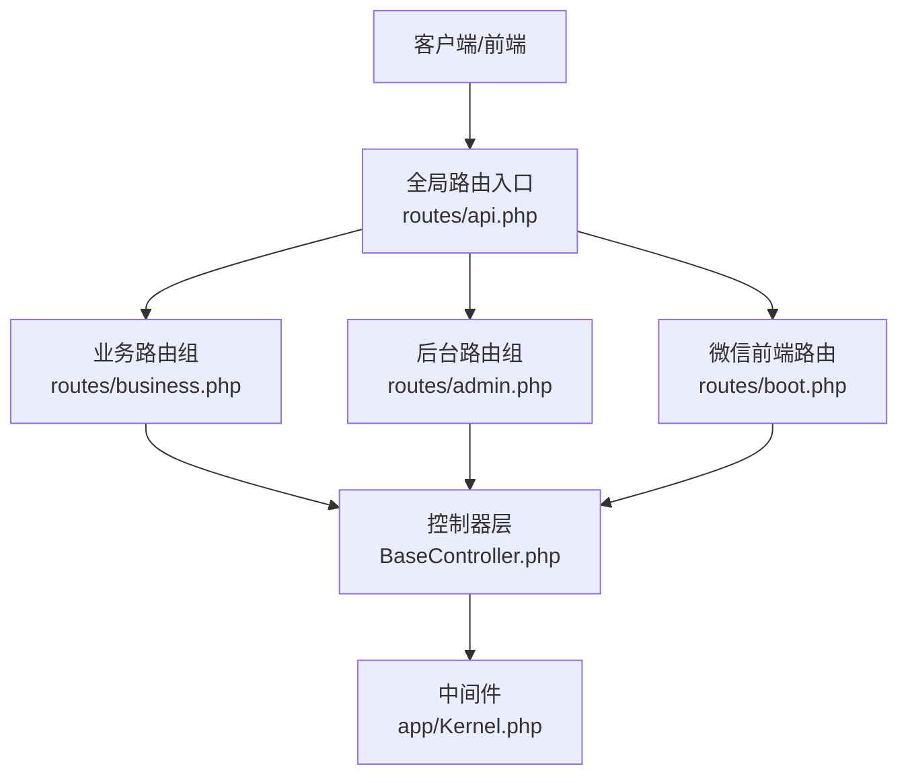
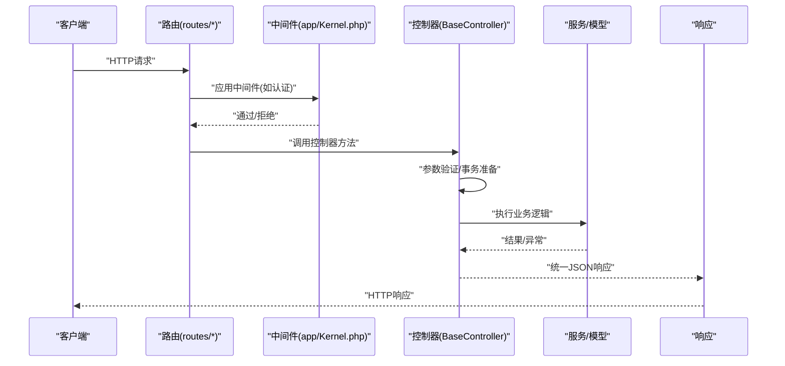
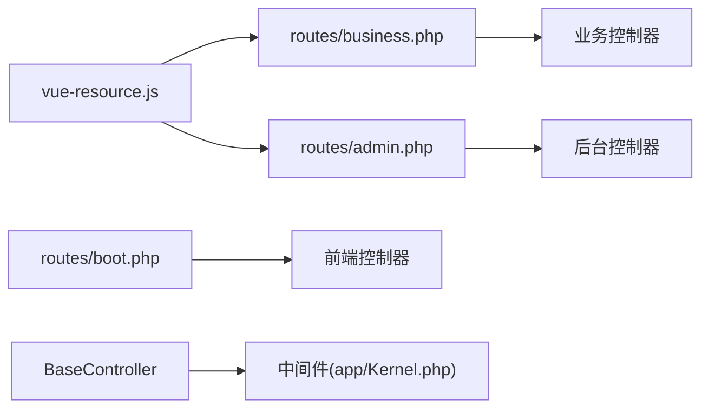

# RESTful API接口

<cite>
**本文引用的文件**
- [routes/api.php](file://routes/api.php)
- [routes/business.php](file://routes/business.php)
- [routes/admin.php](file://routes/admin.php)
- [routes/boot.php](file://routes/boot.php)
- [app/Kernel.php](file://app/Kernel.php)
- [app/common/components/BaseController.php](file://app/common/components/BaseController.php)
- [app/backend/controllers/FrontendVersionController.php](file://app/backend/controllers/FrontendVersionController.php)
- [addons/yun_shop/api.php](file://addons/yun_shop/api.php)
- [api.php](file://api.php)
- [app/backend/controllers/CornController.php](file://app/backend/controllers/CornController.php)
- [static/yunshop/vue/js/vue-resource.js](file://static/yunshop/vue/js/vue-resource.js)
</cite>

## 目录
1. [简介](#简介)
2. [项目结构](#项目结构)
3. [核心组件](#核心组件)
4. [架构总览](#架构总览)
5. [详细组件分析](#详细组件分析)
6. [依赖关系分析](#依赖关系分析)
7. [性能考量](#性能考量)
8. [故障排查指南](#故障排查指南)
9. [结论](#结论)
10. [附录](#附录)

## 简介
本文件面向前端与集成开发者，系统化梳理后端RESTful API接口的HTTP方法、URL模式、请求参数与响应格式；明确认证机制、权限控制与数据验证规则；提供分页、排序与过滤的通用约定；给出错误码定义与错误处理指南；并总结性能优化建议与版本控制策略。

## 项目结构
- 路由入口与分发
  - 全局路由入口位于 routes/api.php，当前仅返回健康探测占位。
  - 业务域路由集中于 routes/business.php，包含大量以“business/模块前缀”开头的API组。
  - 后台管理路由集中在 routes/admin.php，含图片上传、平台用户管理、Python导入工具等。
  - 微信前端路由在 routes/boot.php 中注册。
- 控制器与中间件
  - 控制器基类为 app/common/components/BaseController.php，统一了验证、事务、消息与JSON响应封装。
  - 中间件注册于 app/Kernel.php，包括前端认证、业务域登录等。
- 前端接入
  - 前端版本查询接口位于 app/backend/controllers/FrontendVersionController.php。
  - 前端通过 static/yunshop/vue/js/vue-resource.js 统一发送JSON请求头。

图表来源
- [routes/api.php:1-7](file://routes/api.php#L1-L7)
- [routes/business.php:176-429](file://routes/business.php#L176-L429)
- [routes/admin.php:230-266](file://routes/admin.php#L230-L266)
- [routes/boot.php:1-4](file://routes/boot.php#L1-L4)
- [app/Kernel.php:25-77](file://app/Kernel.php#L25-L77)
- [app/common/components/BaseController.php:1-172](file://app/common/components/BaseController.php#L1-L172)

章节来源
- [routes/api.php:1-7](file://routes/api.php#L1-L7)
- [routes/business.php:176-429](file://routes/business.php#L176-L429)
- [routes/admin.php:230-266](file://routes/admin.php#L230-L266)
- [routes/boot.php:1-4](file://routes/boot.php#L1-L4)
- [app/Kernel.php:25-77](file://app/Kernel.php#L25-L77)
- [app/common/components/BaseController.php:1-172](file://app/common/components/BaseController.php#L1-L172)

## 核心组件
- 控制器基类 BaseController
  - 统一验证：支持基于规则的输入验证与异常抛出。
  - 事务封装：可声明动作进入数据库事务，失败自动回滚。
  - 响应规范：提供统一的成功/失败JSON响应封装。
  - 登录跳转：根据客户端类型返回登录态或登录链接。
- 中间件
  - 前端认证 AuthenticateFrontend
  - 业务域登录 businessLogin
  - 访问节流 throttle（API组）
- 前端版本管理
  - 提供前端版本查询与变更接口，便于灰度与兼容性管理。

章节来源
- [app/common/components/BaseController.php:86-172](file://app/common/components/BaseController.php#L86-L172)
- [app/Kernel.php:25-77](file://app/Kernel.php#L25-L77)
- [app/backend/controllers/FrontendVersionController.php:1-39](file://app/backend/controllers/FrontendVersionController.php#L1-L39)

## 架构总览
- 请求生命周期
  - 客户端发起HTTP请求至对应路由。
  - 路由匹配到控制器方法，按需应用中间件（如认证）。
  - 控制器调用服务层完成业务逻辑，使用BaseController进行验证与事务处理。
  - 返回统一JSON响应。
- 数据与安全
  - 所有API默认返回JSON。
  - 前端通过统一拦截器设置Content-Type为application/json。
  - 部分后台任务路由采用安全密钥校验。

图表来源
- [app/common/components/BaseController.php:86-172](file://app/common/components/BaseController.php#L86-L172)
- [app/Kernel.php:25-77](file://app/Kernel.php#L25-L77)

## 详细组件分析

### 业务API（business/模块前缀）
- 活动相关
  - GET/POST business/activityDetail
  - GET/POST business/activityAdd
  - GET/POST business/activityEdit
  - GET/POST business/activityClose
  - GET/POST business/activityCount
  - GET/POST business/activityCode
  - GET/POST business/searchTag
  - GET/POST business/searchCoupon
- 统计与海报
  - GET/POST business/memberList
  - GET/POST business/activityAnalysis
  - GET/POST business/posterList
  - GET/POST business/posterDelete
  - GET/POST business/posterRefresh
  - GET/POST business/deleteManyPoster
- 电子合同V2
  - GET/POST business/ShopEsignV2/getSet
  - GET/POST business/ShopEsignV2/storeSet
  - GET/POST business/ShopEsignV2/getLevel
  - GET/POST business/ShopEsignV2/getScene
  - GET/POST business/ShopEsignV2/getTemplateList
  - GET/POST business/ShopEsignV2/getByTid
  - GET/POST business/ShopEsignV2/addScene
  - GET/POST business/ShopEsignV2/editShow
  - GET/POST business/ShopEsignV2/editScene
  - GET/POST business/ShopEsignV2/searchContract
  - GET/POST business/ShopEsignV2/downloadContract
- 客户管理
  - 动态加载插件菜单路由，支持导入模板、行业/进展/来源列表维护等。
- 员工审批
  - GET/POST business/StaffAudit/getSetting
  - GET/POST business/StaffAudit/saveSetting
  - GET/POST business/StaffAudit/getAuditLog
  - GET/POST business/StaffAudit/getAuditLogDepartmentList
  - GET/POST business/StaffAudit/getRewardLog
  - GET/POST business/StaffAudit/getRewardLogDepartmentList
- 商机管理
  - GET/POST business/opportunityManagement/getStatus
- 地区与授权
  - GET/POST business/setAuth
  - GET/POST business/getApplicationList
  - GET/POST business/getArea
  - GET/POST business/streetSet
  - GET/POST business/intArea

请求与响应约定
- 方法：多数接口同时支持GET/POST，具体以各接口实现为准。
- 参数：遵循REST风格路径参数与查询参数；复杂对象以JSON体传递。
- 响应：统一JSON结构，包含状态码、消息与数据体；成功时状态码通常为0或语义化标识，失败时包含错误信息与可选的错误码。

章节来源
- [routes/business.php:176-429](file://routes/business.php#L176-L429)
- [routes/business.php:528-553](file://routes/business.php#L528-L553)

### 后台管理API（admin前缀）
- 图片上传与管理
  - POST admin/all/upload/
  - ANY admin/all/list/
  - ANY admin/all/delImg/
- 平台用户管理
  - ANY admin/appuser/
  - ANY admin/appuser/add
  - GET admin/appuser/delete
  - ANY admin/appuser/checkname
- Python导入工具（无需鉴权）
  - GET admin/importGoods/progress
  - POST admin/importGoods/submit
  - GET admin/importApi/ping
  - POST admin/importApi/upload
  - POST admin/importApi/importGoods
  - GET admin/importApi/checkGoods

请求与响应约定
- 图片上传：表单上传，返回文件访问路径与元信息。
- 用户管理：支持列表、新增、删除、搜索等操作。
- 导入工具：提交任务、查询进度、上传文件、执行导入、校验商品。

章节来源
- [routes/admin.php:230-266](file://routes/admin.php#L230-L266)

### 微信前端路由
- 微信入口
  - ANY wechat -> frontend\modules\wechat\controllers\IndexController@index

章节来源
- [routes/boot.php:1-4](file://routes/boot.php#L1-L4)

### 前端版本管理
- 查询前端版本
  - GET admin/version/getVersion
- 变更前端版本
  - POST admin/version/change

响应示例（结构）
- 成功：{"errno":0,"msg":"ok","data":{"version":"X.Y.Z"}}
- 失败：{"errno":非0,"msg":"错误信息","data":null}

章节来源
- [app/backend/controllers/FrontendVersionController.php:1-39](file://app/backend/controllers/FrontendVersionController.php#L1-L39)

### 健康检查与定时任务
- 健康检查
  - GET routes/api.php 根路径返回true，用于探测存活。
- 定时任务触发
  - 通过带安全密钥的GET请求触发，若密钥缺失或不合法则返回404。

章节来源
- [routes/api.php:1-7](file://routes/api.php#L1-L7)
- [app/backend/controllers/CornController.php:1-49](file://app/backend/controllers/CornController.php#L1-L49)

## 依赖关系分析
- 路由到控制器
  - routes/business.php 将 business/* 映射到各模块控制器。
  - routes/admin.php 将 admin/* 映射到后台控制器。
  - routes/boot.php 将 wechat 映射到前端微信控制器。
- 控制器到中间件
  - BaseController 在调用流程中可结合中间件实现认证与权限校验。
- 前端请求
  - vue-resource.js 设置统一JSON头，并对响应进行拦截处理。

图表来源
- [routes/business.php:176-429](file://routes/business.php#L176-L429)
- [routes/admin.php:230-266](file://routes/admin.php#L230-L266)
- [routes/boot.php:1-4](file://routes/boot.php#L1-L4)
- [app/common/components/BaseController.php:1-172](file://app/common/components/BaseController.php#L1-L172)
- [app/Kernel.php:25-77](file://app/Kernel.php#L25-L77)
- [static/yunshop/vue/js/vue-resource.js:1344-1441](file://static/yunshop/vue/js/vue-resource.js#L1344-L1441)

## 性能考量
- 节流与并发
  - API组已启用每分钟60次的节流限制，避免突发流量冲击。
- 事务与一致性
  - 对写操作使用事务包裹，减少部分失败导致的数据不一致风险。
- 前端请求
  - 统一JSON头与拦截器，减少重复配置开销。
- 建议
  - 对高频读取接口增加缓存层；
  - 对批量导入等耗时任务采用异步队列；
  - 对分页接口严格限制每页最大条数，防止资源滥用。

章节来源
- [app/Kernel.php:47-49](file://app/Kernel.php#L47-L49)
- [app/common/components/BaseController.php:70-83](file://app/common/components/BaseController.php#L70-L83)

## 故障排查指南
- 常见错误与定位
  - 参数验证失败：检查BaseController.validate使用的规则与请求体结构。
  - 登录态缺失：根据jumpUrl返回的login_status与login_url进行重定向。
  - 定时任务404：确认安全密钥是否正确传入且为字母数字。
- 错误响应结构
  - 统一包含错误码、消息与可选数据；前端可据此提示用户或重试。
- 日志与调试
  - 关注CornController中的日志输出，定位密钥校验问题。

章节来源
- [app/common/components/BaseController.php:96-106](file://app/common/components/BaseController.php#L96-L106)
- [app/common/components/BaseController.php:147-169](file://app/common/components/BaseController.php#L147-L169)
- [app/backend/controllers/CornController.php:18-46](file://app/backend/controllers/CornController.php#L18-L46)

## 结论
本项目API以Laravel/Lumen框架为基础，采用统一的控制器基类与中间件体系，确保了接口的一致性与安全性。业务域路由清晰、职责明确；前端通过统一的JSON请求头与拦截器对接后端。建议在生产环境中配合缓存、限流与异步任务进一步提升性能与稳定性。

## 附录

### 接口清单与示例（按模块）

- 业务活动
  - GET/POST business/activityDetail
  - GET/POST business/activityAdd
  - GET/POST business/activityEdit
  - GET/POST business/activityClose
  - GET/POST business/activityCount
  - GET/POST business/activityCode
  - GET/POST business/searchTag
  - GET/POST business/searchCoupon
- 海报与统计
  - GET/POST business/memberList
  - GET/POST business/activityAnalysis
  - GET/POST business/posterList
  - GET/POST business/posterDelete
  - GET/POST business/posterRefresh
  - GET/POST business/deleteManyPoster
- 电子合同V2
  - GET/POST business/ShopEsignV2/getSet
  - GET/POST business/ShopEsignV2/storeSet
  - GET/POST business/ShopEsignV2/getLevel
  - GET/POST business/ShopEsignV2/getScene
  - GET/POST business/ShopEsignV2/getTemplateList
  - GET/POST business/ShopEsignV2/getByTid
  - GET/POST business/ShopEsignV2/addScene
  - GET/POST business/ShopEsignV2/editShow
  - GET/POST business/ShopEsignV2/editScene
  - GET/POST business/ShopEsignV2/searchContract
  - GET/POST business/ShopEsignV2/downloadContract
- 客户管理
  - 动态路由（插件启用时），常见：
    - POST business/CustomerManage/importTemplate
    - POST business/CustomerManage/getIndustryList
    - POST business/CustomerManage/saveIndustry
    - POST business/CustomerManage/delIndustry
    - POST business/CustomerManage/getProgressList
    - POST business/CustomerManage/saveProgress
    - POST business/CustomerManage/delProgress
    - POST business/CustomerManage/getSourceList
    - POST business/CustomerManage/saveSource
    - POST business/CustomerManage/delSource
- 员工审批
  - GET/POST business/StaffAudit/getSetting
  - GET/POST business/StaffAudit/saveSetting
  - GET/POST business/StaffAudit/getAuditLog
  - GET/POST business/StaffAudit/getAuditLogDepartmentList
  - GET/POST business/StaffAudit/getRewardLog
  - GET/POST business/StaffAudit/getRewardLogDepartmentList
- 商机管理
  - GET/POST business/opportunityManagement/getStatus
- 地区与授权
  - GET/POST business/setAuth
  - GET/POST business/getApplicationList
  - GET/POST business/getArea
  - GET/POST business/streetSet
  - GET/POST business/intArea

- 后台管理
  - 图片上传与管理
    - POST admin/all/upload/
    - ANY admin/all/list/
    - ANY admin/all/delImg/
  - 平台用户管理
    - ANY admin/appuser/
    - ANY admin/appuser/add
    - GET admin/appuser/delete
    - ANY admin/appuser/checkname
  - Python导入工具（无需鉴权）
    - GET admin/importGoods/progress
    - POST admin/importGoods/submit
    - GET admin/importApi/ping
    - POST admin/importApi/upload
    - POST admin/importApi/importGoods
    - GET admin/importApi/checkGoods

- 微信前端
  - ANY wechat

- 前端版本
  - GET admin/version/getVersion
  - POST admin/version/change

请求与响应示例（结构）
- 成功响应：{"errno":0,"msg":"ok","data":{}}
- 失败响应：{"errno":非0,"msg":"错误信息","data":null}
- 登录态缺失：{"errno":错误码,"msg":"请登录","data":{"login_status":0或1,"login_url":...}}

章节来源
- [routes/business.php:176-429](file://routes/business.php#L176-L429)
- [routes/business.php:528-553](file://routes/business.php#L528-L553)
- [routes/admin.php:230-266](file://routes/admin.php#L230-L266)
- [routes/boot.php:1-4](file://routes/boot.php#L1-L4)
- [app/backend/controllers/FrontendVersionController.php:16-38](file://app/backend/controllers/FrontendVersionController.php#L16-L38)

### 认证与权限控制
- 认证中间件
  - AuthenticateFrontend：前端认证。
  - businessLogin：业务域登录。
- 权限控制
  - 基于控制器与中间件组合实现；具体权限规则由各模块控制器内部判断。
- 前端请求头
  - Content-Type: application/json；Accept: application/json, text/plain, */*

章节来源
- [app/Kernel.php:66-76](file://app/Kernel.php#L66-L76)
- [static/yunshop/vue/js/vue-resource.js:1371-1372](file://static/yunshop/vue/js/vue-resource.js#L1371-L1372)

### 数据验证规则
- 使用BaseController.validate进行参数验证，失败抛出异常并返回错误信息。
- 规则定义在各控制器方法内，遵循框架验证器语法。

章节来源
- [app/common/components/BaseController.php:96-106](file://app/common/components/BaseController.php#L96-L106)

### 分页、排序与过滤
- 分页
  - 建议统一使用page与size参数；服务端限制最大size以保护性能。
- 排序
  - 建议使用sort与order参数（升序/降序）。
- 过滤
  - 建议使用filter[key]=value形式；复杂条件使用JSON体传递。

[本节为通用设计建议，不直接分析具体文件]

### 错误码定义与错误处理
- 统一响应结构包含errno、msg、data字段。
- errno为0表示成功；非0表示失败，前端据此处理。
- 登录态缺失时返回login_status与login_url，引导用户登录。

章节来源
- [app/common/components/BaseController.php:147-169](file://app/common/components/BaseController.php#L147-L169)

### 版本控制与废弃接口迁移
- 前端版本
  - 通过admin/version/getVersion查询当前版本；通过admin/version/change更新版本配置。
- 迁移建议
  - 新增版本时先灰度发布，逐步替换旧版本调用方；
  - 对废弃接口保留过渡期并提供替代方案与迁移指引。

章节来源
- [app/backend/controllers/FrontendVersionController.php:16-38](file://app/backend/controllers/FrontendVersionController.php#L16-L38)

### 健康检查与运维
- 健康检查
  - GET routes/api.php 根路径返回true。
- 定时任务
  - 通过带安全密钥的GET请求触发；密钥来自配置项，必须为字母数字。

章节来源
- [routes/api.php:1-7](file://routes/api.php#L1-L7)
- [app/backend/controllers/CornController.php:18-46](file://app/backend/controllers/CornController.php#L18-L46)