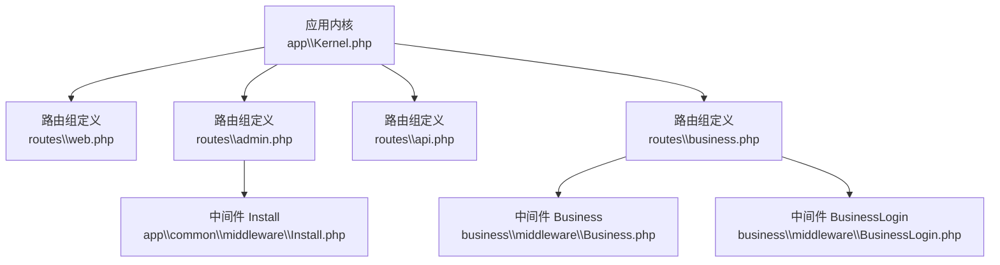
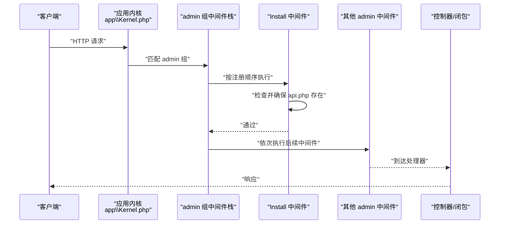
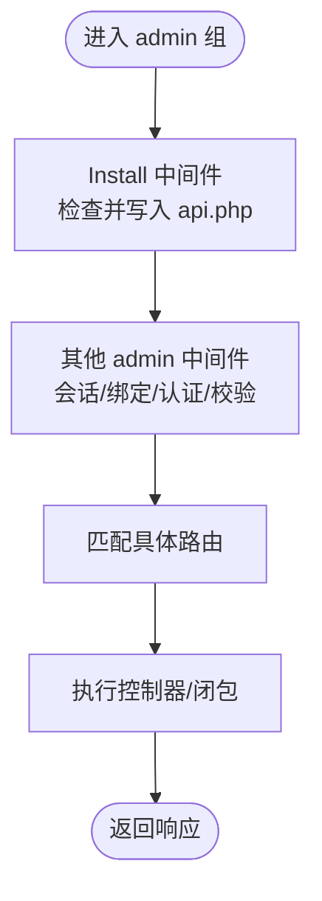
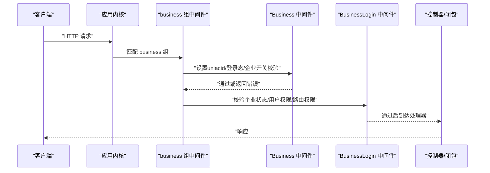
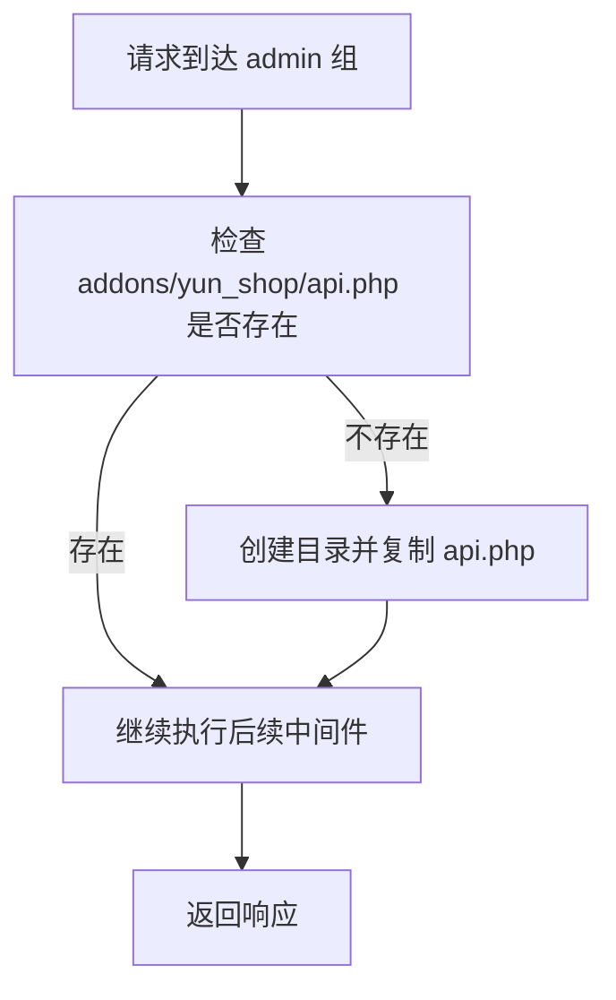
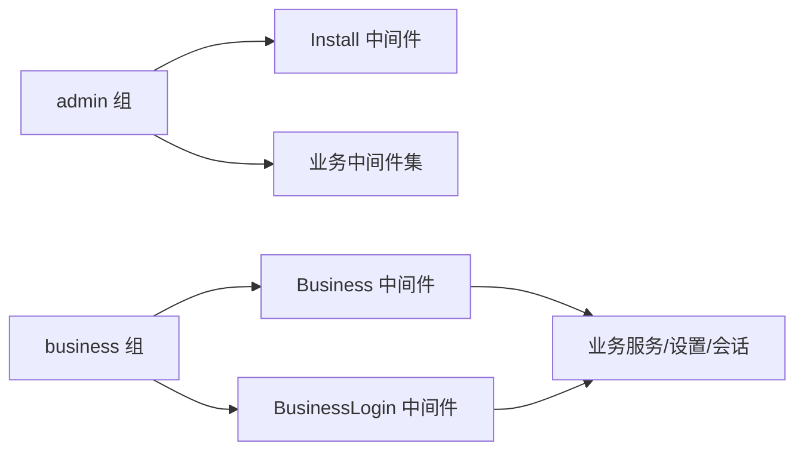

# 中间件组

<cite>
**本文引用的文件**
- [app\Kernel.php](file://app\Kernel.php)
- [routes\web.php](file://routes\web.php)
- [routes\admin.php](file://routes\admin.php)
- [routes\api.php](file://routes\api.php)
- [routes\business.php](file://routes\business.php)
- [business\middleware\Business.php](file://business\middleware\Business.php)
- [business\middleware\BusinessLogin.php](file://business\middleware\BusinessLogin.php)
- [app\common\middleware\Install.php](file://app\common\middleware\Install.php)
</cite>

## 目录
1. [简介](#简介)
2. [项目结构](#项目结构)
3. [核心组件](#核心组件)
4. [架构总览](#架构总览)
5. [详细组件分析](#详细组件分析)
6. [依赖分析](#依赖分析)
7. [性能考虑](#性能考虑)
8. [故障排查指南](#故障排查指南)
9. [结论](#结论)
10. [附录](#附录)

## 简介
本文件系统性梳理并说明本项目的中间件组：web、admin、api、business 四个组的功能定位、包含的中间件、执行顺序与控制流，并重点解析 Install 中间件在安装流程中的特殊处理。同时给出中间件组的配置方式、继承关系、自定义配置方法与最佳实践，以及不同路由组的使用示例与性能考量。

## 项目结构
围绕中间件组的关键位置如下：
- 应用内核与中间件注册：app\Kernel.php
- 路由与中间件组绑定：routes\web.php、routes\admin.php、routes\api.php、routes\business.php
- 业务中间件实现：business\middleware\Business.php、business\middleware\BusinessLogin.php
- 安装流程中间件：app\common\middleware\Install.php

图表来源
- [app\Kernel.php:30-57](file://app\Kernel.php#L30-L57)
- [routes\web.php:1-17](file://routes\web.php#L1-L17)
- [routes\admin.php:1-267](file://routes\admin.php#L1-L267)
- [routes\api.php:1-7](file://routes\api.php#L1-L7)
- [routes\business.php:1-554](file://routes\business.php#L1-L554)
- [app\common\middleware\Install.php:1-26](file://app\common\middleware\Install.php#L1-L26)
- [business\middleware\Business.php:1-59](file://business\middleware\Business.php#L1-L59)
- [business\middleware\BusinessLogin.php:1-91](file://business\middleware\BusinessLogin.php#L1-L91)

章节来源
- [app\Kernel.php:30-77](file://app\Kernel.php#L30-L77)
- [routes\web.php:1-17](file://routes\web.php#L1-L17)
- [routes\admin.php:1-267](file://routes\admin.php#L1-L267)
- [routes\api.php:1-7](file://routes\api.php#L1-L7)
- [routes\business.php:1-554](file://routes\business.php#L1-L554)

## 核心组件
- 中间件组与注册
  - web 组：用于常规站点请求，当前空置，便于后续扩展。
  - admin 组：后台管理请求，包含 Install 中间件以保障安装流程可用性。
  - api 组：对外 API 请求，包含限流中间件。
  - business 组：业务侧（企业管理）请求，包含 Cookie/Session/绑定/认证会话等通用中间件。
- 路由与中间件组绑定
  - routes\web.php、routes\admin.php、routes\api.php、routes\business.php 分别声明各组路由。
  - admin 组路由显式绑定多个业务中间件（如 auth:admin、authAdmin、checkPasswordSafe、shopBootStrap、check），体现后台强校验。
  - business 组路由显式绑定 business、businessLogin 两个中间件，形成“上下文准备—权限校验”的双层校验。
- Install 中间件
  - 在 admin 组中作为首个中间件运行，负责在首次访问时确保 addons/yun_shop/api.php 存在，避免安装引导阶段因文件缺失导致异常。

章节来源
- [app\Kernel.php:30-77](file://app\Kernel.php#L30-L77)
- [routes\admin.php:57-248](file://routes\admin.php#L57-L248)
- [routes\business.php:13-466](file://routes\business.php#L13-L466)
- [app\common\middleware\Install.php:15-25](file://app\common\middleware\Install.php#L15-L25)

## 架构总览
下图展示中间件组在请求生命周期中的装配与调用顺序，以及与路由组的关系。

图表来源
- [app\Kernel.php:38-46](file://app\Kernel.php#L38-L46)
- [app\common\middleware\Install.php:15-25](file://app\common\middleware\Install.php#L15-L25)
- [routes\admin.php:57-248](file://routes\admin.php#L57-L248)

## 详细组件分析

### web 组
- 功能与定位
  - 用于常规站点请求，当前路由文件仅占位，未绑定任何中间件。
- 使用建议
  - 可在此组挂载 CSRF、Session、Cookie 等通用中间件，统一处理站点安全与会话。
- 性能与安全
  - 若无必要，保持空组可减少不必要开销；若启用，注意中间件顺序与性能影响。

章节来源
- [routes\web.php:14-16](file://routes\web.php#L14-L16)
- [app\Kernel.php:30-37](file://app\Kernel.php#L30-L37)

### admin 组
- 组内中间件与顺序
  - Install → Cookie/队列 → Session → View 错误共享 → 路由绑定替换 → 认证会话。
  - 路由层还额外绑定多个业务中间件：auth:admin、authAdmin、checkPasswordSafe、shopBootStrap、check。
- 关键职责
  - Install：安装引导阶段确保 api.php 文件存在，避免后续步骤失败。
  - 业务中间件：统一后台登录态、安全校验、站点引导、权限开关等。
- 控制流示意

图表来源
- [app\Kernel.php:38-46](file://app\Kernel.php#L38-L46)
- [app\common\middleware\Install.php:15-25](file://app\common\middleware\Install.php#L15-L25)
- [routes\admin.php:57-248](file://routes\admin.php#L57-L248)

章节来源
- [app\Kernel.php:38-76](file://app\Kernel.php#L38-L76)
- [routes\admin.php:57-248](file://routes\admin.php#L57-L248)
- [app\common\middleware\Install.php:15-25](file://app\common\middleware\Install.php#L15-L25)

### api 组
- 组内中间件与顺序
  - 限流中间件：每分钟限制请求数。
- 使用建议
  - 适用于对外开放的 REST 接口，结合路由前缀与版本化路径进一步细化。
- 性能与安全
  - 限流是保护后端资源的重要手段，建议配合 IP 白名单、签名/时间戳校验等增强安全。

章节来源
- [app\Kernel.php:47-49](file://app\Kernel.php#L47-L49)
- [routes\api.php:1-7](file://routes\api.php#L1-L7)

### business 组
- 组内中间件与顺序
  - Cookie/队列 → Session → View 错误共享 → 路由绑定替换 → 认证会话。
- 业务中间件
  - business：设置uniacid、加载前端登录态、校验企业管理 PC 端开关、选择企业等。
  - businessLogin：校验企业是否存在且启用、用户对企业的权限身份、路由级权限校验。
- 控制流示意

图表来源
- [app\Kernel.php:50-56](file://app\Kernel.php#L50-L56)
- [business\middleware\Business.php:27-56](file://business\middleware\Business.php#L27-L56)
- [business\middleware\BusinessLogin.php:23-47](file://business\middleware\BusinessLogin.php#L23-L47)
- [routes\business.php:13-466](file://routes\business.php#L13-L466)

章节来源
- [app\Kernel.php:50-76](file://app\Kernel.php#L50-L76)
- [business\middleware\Business.php:27-56](file://business\middleware\Business.php#L27-L56)
- [business\middleware\BusinessLogin.php:23-88](file://business\middleware\BusinessLogin.php#L23-L88)
- [routes\business.php:13-466](file://routes\business.php#L13-L466)

### Install 中间件在安装流程中的特殊处理
- 触发时机
  - 在 admin 组中作为首个中间件执行，确保安装引导阶段的文件可用性。
- 行为机制
  - 若 addons/yun_shop/api.php 不存在，则创建目录并复制 api.php 内容至目标文件。
- 影响范围
  - 仅影响安装引导阶段的后台访问，不影响正常业务运行。

图表来源
- [app\common\middleware\Install.php:15-25](file://app\common\middleware\Install.php#L15-L25)
- [routes\admin.php:23-31](file://routes\admin.php#L23-L31)

章节来源
- [app\common\middleware\Install.php:15-25](file://app\common\middleware\Install.php#L15-L25)
- [routes\admin.php:23-31](file://routes\admin.php#L23-L31)

## 依赖分析
- 中间件组与路由组的耦合
  - admin 组与 business 组在路由层显式绑定多个业务中间件，体现强约束与职责分离。
- 中间件内部依赖
  - businessLogin 依赖路由路径解析与权限矩阵进行细粒度校验。
  - Install 依赖文件系统写入能力。
- 外部集成点
  - business 组依赖业务侧服务（如 SettingService、BusinessService、MemberFactory）进行上下文与权限判定。

图表来源
- [app\Kernel.php:38-56](file://app\Kernel.php#L38-L56)
- [business\middleware\Business.php:27-56](file://business\middleware\Business.php#L27-L56)
- [business\middleware\BusinessLogin.php:23-47](file://business\middleware\BusinessLogin.php#L23-L47)
- [routes\admin.php:57-248](file://routes\admin.php#L57-L248)
- [routes\business.php:13-466](file://routes\business.php#L13-L466)

章节来源
- [app\Kernel.php:38-76](file://app\Kernel.php#L38-L76)
- [business\middleware\Business.php:27-56](file://business\middleware\Business.php#L27-L56)
- [business\middleware\BusinessLogin.php:23-88](file://business\middleware\BusinessLogin.php#L23-L88)
- [routes\admin.php:57-248](file://routes\admin.php#L57-L248)
- [routes\business.php:13-466](file://routes\business.php#L13-L466)

## 性能考虑
- 中间件顺序与开销
  - 将轻量中间件（如 Install）置于 admin 组首部，避免后续中间件重复 IO。
  - business 组涉及多层服务调用（登录态、企业状态、权限矩阵），应关注缓存与降级策略。
- 限流与并发
  - api 组限流中间件可防止突发流量冲击，建议结合 Nginx 层限流与后端限流协同。
- 会话与 Cookie
  - admin/business 组均启用 Session，需关注会话存储（文件/Redis）与序列化成本。

[本节为通用指导，不直接分析具体文件]

## 故障排查指南
- 安装引导失败
  - 现象：后台安装引导无法访问或报错。
  - 排查：确认 addons/yun_shop/api.php 是否存在；检查目录权限；查看 Install 中间件执行日志。
- 业务权限拒绝
  - 现象：提示“Sorry,您没有操作权限”。
  - 排查：确认当前用户是否已在企业管理上下文中选择企业；检查权限矩阵与路由匹配逻辑。
- 企业未启用或状态异常
  - 现象：提示企业未开启或列表为空。
  - 排查：确认企业状态为启用；检查 SettingService 的企业 ID 设置与历史记录回填逻辑。

章节来源
- [app\common\middleware\Install.php:15-25](file://app\common\middleware\Install.php#L15-L25)
- [business\middleware\BusinessLogin.php:23-47](file://business\middleware\BusinessLogin.php#L23-L47)
- [business\middleware\Business.php:27-56](file://business\middleware\Business.php#L27-L56)

## 结论
- admin 组通过 Install 中间件保障安装流程稳定，随后以强校验中间件保证后台安全。
- business 组通过“上下文准备—权限校验”的双中间件模式，兼顾易用性与安全性。
- api 组以限流为核心，适合对外接口保护。
- 建议在不改变现有行为的前提下，逐步完善 web 组与 api 组的中间件配置，提升整体安全与性能。

[本节为总结性内容，不直接分析具体文件]

## 附录

### 中间件组配置与继承关系
- 在应用内核中注册中间件组与路由中间件，路由文件中按组绑定中间件。
- admin/business 组在内核中声明通用中间件栈，路由层再叠加业务中间件，形成“通用—专用”的分层。

章节来源
- [app\Kernel.php:30-77](file://app\Kernel.php#L30-L77)
- [routes\admin.php:57-248](file://routes\admin.php#L57-L248)
- [routes\business.php:13-466](file://routes\business.php#L13-L466)

### 自定义配置方法与最佳实践
- 新增中间件
  - 在应用内核的 $routeMiddleware 或 $middlewareGroups 中注册。
  - 在对应路由组中按需绑定。
- 中间件顺序
  - 将轻量、快速的中间件靠前放置；将需要上下文的服务型中间件适当后移。
- 权限与路由
  - 对于 businessLogin，建议集中维护路由权限矩阵，避免散落硬编码。
- 安全加固
  - api 组建议增加签名/时间戳校验、IP 白名单与速率限制。
  - admin 组建议启用更强的会话安全策略（如 SameSite、HttpOnly）。

[本节为通用指导，不直接分析具体文件]

### 不同路由组的使用示例
- admin 组
  - 示例：后台登录、站点设置、用户管理等路由均受 admin 组保护。
  - 参考：routes/admin.php 中的多处路由组与业务中间件绑定。
- business 组
  - 示例：企业管理、插件路由、客户管理、外呼系统等。
  - 参考：routes/business.php 中的多模块路由与 business/businessLogin 绑定。
- api 组
  - 示例：对外接口入口。
  - 参考：routes/api.php 中的根路径路由。
- web 组
  - 示例：常规站点页面。
  - 参考：routes/web.php 中的占位路由。

章节来源
- [routes\admin.php:57-248](file://routes\admin.php#L57-L248)
- [routes\business.php:13-466](file://routes\business.php#L13-L466)
- [routes\api.php:1-7](file://routes\api.php#L1-L7)
- [routes\web.php:14-16](file://routes\web.php#L14-L16)