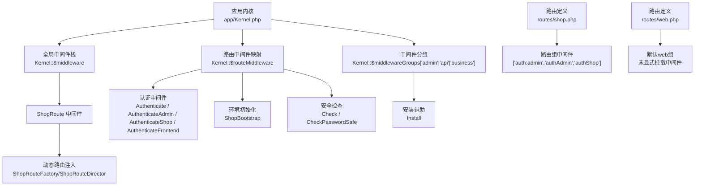
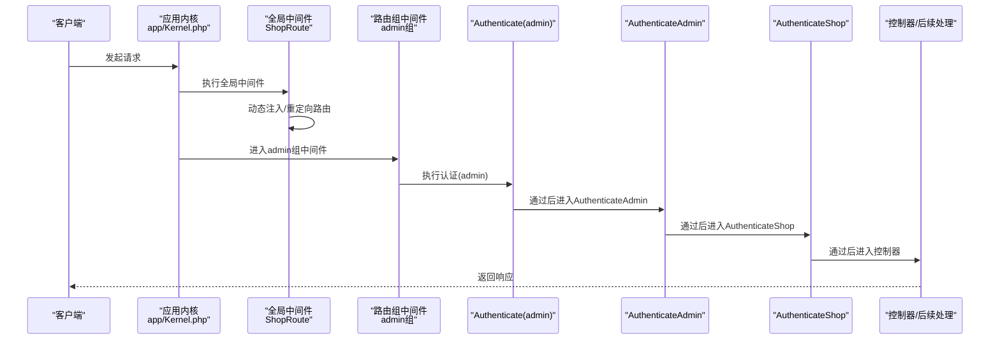
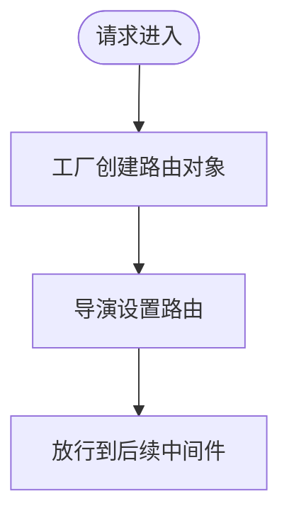
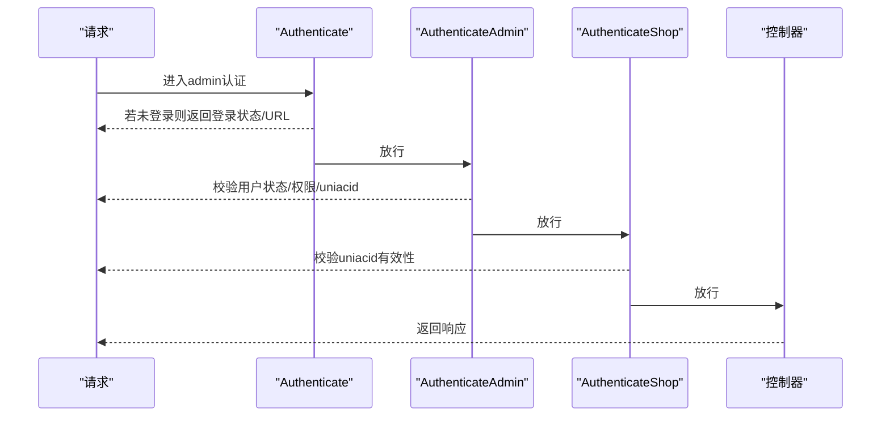
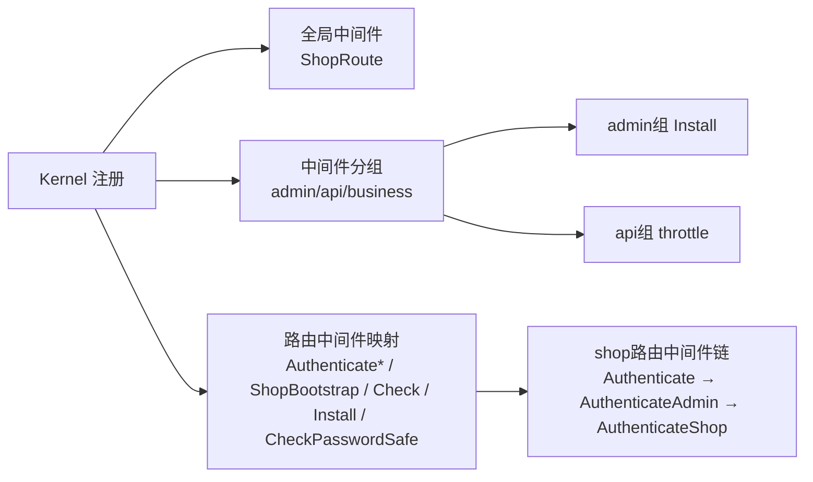

# 中间件链路

<cite>
**本文引用的文件**   
- [app/Kernel.php](file://app/Kernel.php)
- [routes/shop.php](file://routes/shop.php)
- [routes/web.php](file://routes/web.php)
- [app/common/middleware/ShopRoute.php](file://app/common/middleware/ShopRoute.php)
- [app/common/middleware/Authenticate.php](file://app/common/middleware/Authenticate.php)
- [app/common/middleware/AuthenticateAdmin.php](file://app/common/middleware/AuthenticateAdmin.php)
- [app/common/middleware/AuthenticateShop.php](file://app/common/middleware/AuthenticateShop.php)
- [app/common/middleware/ShopBootstrap.php](file://app/common/middleware/ShopBootstrap.php)
- [app/common/middleware/Check.php](file://app/common/middleware/Check.php)
- [app/common/middleware/Install.php](file://app/common/middleware/Install.php)
- [app/common/middleware/CheckPasswordSafe.php](file://app/common/middleware/CheckPasswordSafe.php)
- [app/common/middleware/AuthenticateFrontend.php](file://app/common/middleware/AuthenticateFrontend.php)
</cite>

## 目录
1. [引言](#引言)
2. [项目结构](#项目结构)
3. [核心组件](#核心组件)
4. [架构总览](#架构总览)
5. [详细组件分析](#详细组件分析)
6. [依赖关系分析](#依赖关系分析)
7. [性能考量](#性能考量)
8. [故障排查指南](#故障排查指南)
9. [结论](#结论)
10. [附录：自定义中间件开发指南](#附录自定义中间件开发指南)

## 引言
本文件聚焦芸众商城的中间件链路，系统性梳理全局中间件、路由组中间件与特定路由中间件的执行顺序与作用机制；深入解析认证中间件（含后台、前台、店铺）的身份验证、权限校验与会话管理；详解ShopBootstrap中间件如何初始化商店环境（多租户隔离、配置加载、服务绑定）；阐述限流策略与实现原理；并提供自定义中间件的开发指南与最佳实践，帮助读者理解中间件在请求处理流程中的关键作用与性能影响。

## 项目结构
围绕中间件的关键文件分布如下：
- 应用内核与中间件注册：app/Kernel.php
- 路由与中间件挂载：routes/shop.php、routes/web.php
- 中间件实现：app/common/middleware/*.php
- 前端/业务扩展中间件：business/middleware/*.php（本仓库中未发现对应文件）

图表来源
- [app/Kernel.php:19-76](file://app/Kernel.php#L19-L76)
- [routes/shop.php:2-8](file://routes/shop.php#L2-L8)
- [routes/web.php:14-16](file://routes/web.php#L14-L16)

章节来源
- [app/Kernel.php:19-76](file://app/Kernel.php#L19-L76)
- [routes/shop.php:2-8](file://routes/shop.php#L2-L8)
- [routes/web.php:14-16](file://routes/web.php#L14-L16)

## 核心组件
- 全局中间件：ShopRoute（在每次请求进入时动态注入/重定向路由）
- 路由组中间件：
  - admin组：Install（首次运行时生成插件入口文件）
  - api组：throttle（基于Laravel内置节流中间件）
  - business组：会话与绑定（用于业务模块）
- 路由中间件：
  - 认证类：Authenticate、AuthenticateAdmin、AuthenticateShop、AuthenticateFrontend
  - 环境类：ShopBootstrap
  - 安全类：Check、CheckPasswordSafe
  - 安装类：Install（已在admin组中启用）

章节来源
- [app/Kernel.php:19-76](file://app/Kernel.php#L19-L76)
- [routes/shop.php:2-8](file://routes/shop.php#L2-L8)

## 架构总览
芸众商城的中间件链路遵循“全局中间件 → 路由组中间件 → 路由中间件”的执行顺序。以shop路由为例，请求首先进入全局的ShopRoute中间件，随后进入路由组admin的Install，再依次执行路由中间件链：Authenticate（admin）、AuthenticateAdmin、AuthenticateShop。

图表来源
- [app/Kernel.php:19-76](file://app/Kernel.php#L19-L76)
- [routes/shop.php:2-8](file://routes/shop.php#L2-L8)
- [app/common/middleware/ShopRoute.php:18-26](file://app/common/middleware/ShopRoute.php#L18-L26)
- [app/common/middleware/Authenticate.php:26-44](file://app/common/middleware/Authenticate.php#L26-L44)
- [app/common/middleware/AuthenticateAdmin.php:111-153](file://app/common/middleware/AuthenticateAdmin.php#L111-L153)
- [app/common/middleware/AuthenticateShop.php:17-25](file://app/common/middleware/AuthenticateShop.php#L17-L25)

## 详细组件分析

### 全局中间件：ShopRoute
- 作用：在请求到达时，依据路径动态创建并注入/重定向路由，确保不同租户或场景下的路由可被正确解析。
- 关键点：
  - 使用工厂与导演模式进行路由装配，避免硬编码路由。
  - 在全局阶段介入，优先于路由组与路由中间件执行。

图表来源
- [app/common/middleware/ShopRoute.php:18-26](file://app/common/middleware/ShopRoute.php#L18-L26)

章节来源
- [app/common/middleware/ShopRoute.php:18-26](file://app/common/middleware/ShopRoute.php#L18-L26)

### 路由组中间件：admin组（Install）
- 作用：首次运行时检测并生成插件入口文件，保证运行环境一致性。
- 关键点：仅在admin组启用，不影响其他路由组。

章节来源
- [app/common/middleware/Install.php:15-25](file://app/common/middleware/Install.php#L15-L25)
- [app/Kernel.php:38-46](file://app/Kernel.php#L38-L46)

### 路由中间件：认证链路（admin → shop）
- 认证中间件链（shop路由）：Authenticate → AuthenticateAdmin → AuthenticateShop
- 执行要点：
  - Authenticate：基于guard判断访客状态，AJAX返回JSON，非AJAX按场景重定向或返回错误JSON。
  - AuthenticateAdmin：校验用户状态与权限，维护角色与uniacid上下文，对非管理员访问敏感接口进行拦截。
  - AuthenticateShop：校验uniacid有效性、平台状态与有效期，无效则跳回首页。

图表来源
- [app/common/middleware/Authenticate.php:26-44](file://app/common/middleware/Authenticate.php#L26-L44)
- [app/common/middleware/AuthenticateAdmin.php:111-153](file://app/common/middleware/AuthenticateAdmin.php#L111-L153)
- [app/common/middleware/AuthenticateShop.php:17-25](file://app/common/middleware/AuthenticateShop.php#L17-L25)

章节来源
- [app/common/middleware/Authenticate.php:26-44](file://app/common/middleware/Authenticate.php#L26-L44)
- [app/common/middleware/AuthenticateAdmin.php:111-153](file://app/common/middleware/AuthenticateAdmin.php#L111-L153)
- [app/common/middleware/AuthenticateShop.php:17-25](file://app/common/middleware/AuthenticateShop.php#L17-L25)
- [routes/shop.php:2-8](file://routes/shop.php#L2-L8)

### 认证中间件：AuthenticateFrontend（前台）
- 作用：前台会员登录态校验、黑名单拦截、登录跳转策略、防重复提交（Redis）。
- 关键点：
  - 依据当前店铺的会员关系策略决定是否强制登录。
  - 不同登录类型（小程序、抖音、APP等）返回不同的登录URL与scope。
  - 使用Redis对请求去重，降低重复提交风险。

章节来源
- [app/common/middleware/AuthenticateFrontend.php:28-64](file://app/common/middleware/AuthenticateFrontend.php#L28-L64)
- [app/common/middleware/AuthenticateFrontend.php:86-114](file://app/common/middleware/AuthenticateFrontend.php#L86-L114)

### 环境初始化中间件：ShopBootstrap
- 作用：在后台非超级管理员场景下，根据AppUser的角色与uniacid，设置YunShop全局上下文，并返回跳转URL或放行。
- 关键点：
  - 多租户隔离：通过uniacid绑定当前应用上下文。
  - 角色限制：仅对operator/clerk角色生效。
  - 成功时返回绝对路径URL，失败时放行至后续中间件。

章节来源
- [app/common/middleware/ShopBootstrap.php:23-38](file://app/common/middleware/ShopBootstrap.php#L23-L38)

### 安全与检查中间件
- Check：检测平台注册状态与静态资源目录可用性，必要时返回升级状态码。
- CheckPasswordSafe：强制/提醒修改密码策略，针对首次登录与长期未改密码的用户进行提示或提醒。

章节来源
- [app/common/middleware/Check.php:19-26](file://app/common/middleware/Check.php#L19-L26)
- [app/common/middleware/CheckPasswordSafe.php:19-47](file://app/common/middleware/CheckPasswordSafe.php#L19-L47)

### 限流中间件：api组
- 作用：通过内置throttle中间件限制单位时间内的请求次数，默认为每分钟60次。
- 影响：保护API免受突发流量冲击，需结合业务场景调优。

章节来源
- [app/Kernel.php:47-49](file://app/Kernel.php#L47-L49)

## 依赖关系分析
- 中间件注册集中于应用内核，路由组与路由中间件通过字符串映射到具体类。
- shop路由明确挂载了三条路由中间件，形成完整的后台认证与环境校验链。
- ShopRoute作为全局中间件，负责在请求早期注入动态路由，影响后续中间件的匹配与执行。

图表来源
- [app/Kernel.php:19-76](file://app/Kernel.php#L19-L76)
- [routes/shop.php:2-8](file://routes/shop.php#L2-L8)

章节来源
- [app/Kernel.php:19-76](file://app/Kernel.php#L19-L76)
- [routes/shop.php:2-8](file://routes/shop.php#L2-L8)

## 性能考量
- 中间件链越长，单请求开销越大。建议：
  - 将轻量检查前置（如ShopRoute、Check），耗时逻辑后置（如权限校验、数据库查询）。
  - 对高频API使用更细粒度的限流策略（如按IP/UID/接口维度）。
  - 合理缓存认证结果与权限清单，减少重复计算。
  - 使用异步任务处理非阻塞操作，避免阻塞主请求链路。

## 故障排查指南
- 登录过期/未登录：
  - 检查Authenticate中间件的AJAX与非AJAX分支，确认返回的login_status与login_url是否正确。
- 权限不足：
  - 检查AuthenticateAdmin的authApi白名单与uniacid绑定，确认用户角色与平台状态。
- 平台不可用/过期：
  - 检查AuthenticateShop对sys_app状态与有效期的判定逻辑。
- 安装/静态资源问题：
  - 检查Check中间件对平台注册与静态目录的检测逻辑。
- 密码安全提醒：
  - 检查CheckPasswordSafe对首次登录与长期未改密码的判定与提示逻辑。

章节来源
- [app/common/middleware/Authenticate.php:29-42](file://app/common/middleware/Authenticate.php#L29-L42)
- [app/common/middleware/AuthenticateAdmin.php:135-139](file://app/common/middleware/AuthenticateAdmin.php#L135-L139)
- [app/common/middleware/AuthenticateShop.php:34-46](file://app/common/middleware/AuthenticateShop.php#L34-L46)
- [app/common/middleware/Check.php:33-52](file://app/common/middleware/Check.php#L33-L52)
- [app/common/middleware/CheckPasswordSafe.php:22-44](file://app/common/middleware/CheckPasswordSafe.php#L22-L44)

## 结论
芸众商城的中间件体系以“全局 → 组 → 路由”三层链路清晰地实现了请求的统一入口、环境初始化与权限控制。通过ShopRoute的动态路由注入、Authenticate系列的多层认证与ShopBootstrap的多租户隔离，系统在保障安全性的同时具备良好的扩展性。建议在高并发场景下进一步优化中间件顺序与限流策略，并加强缓存与异步化处理以提升整体性能。

## 附录：自定义中间件开发指南
- 开发步骤
  - 创建中间件类，实现handle方法，接收$request与闭包$next。
  - 在handle中进行预处理（参数校验、日志记录、缓存命中等），必要时直接返回响应。
  - 调用$next($request)放行到下一个中间件或控制器。
  - 在app/Kernel.php的$routeMiddleware中注册映射。
- 最佳实践
  - 保持单一职责：每个中间件专注一个领域（认证、限流、日志、缓存）。
  - 明确执行顺序：将轻量检查前置，耗时逻辑后置。
  - 统一错误格式：使用统一的JSON响应结构，便于前端处理。
  - 可测试性：将复杂逻辑抽离为独立服务或工具类，便于单元测试。
  - 性能优先：避免在中间件中做昂贵的IO操作；必要时使用缓存或异步队列。
- 示例参考
  - 认证中间件：[Authenticate.php:26-44](file://app/common/middleware/Authenticate.php#L26-L44)
  - 安全检查中间件：[Check.php:19-26](file://app/common/middleware/Check.php#L19-L26)
  - 环境初始化中间件：[ShopBootstrap.php:23-38](file://app/common/middleware/ShopBootstrap.php#L23-L38)
  - 安装辅助中间件：[Install.php:15-25](file://app/common/middleware/Install.php#L15-L25)
  - 密码安全中间件：[CheckPasswordSafe.php:19-47](file://app/common/middleware/CheckPasswordSafe.php#L19-L47)