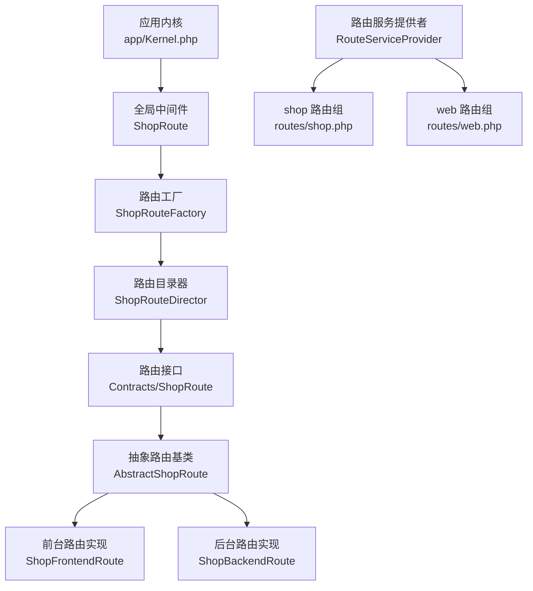
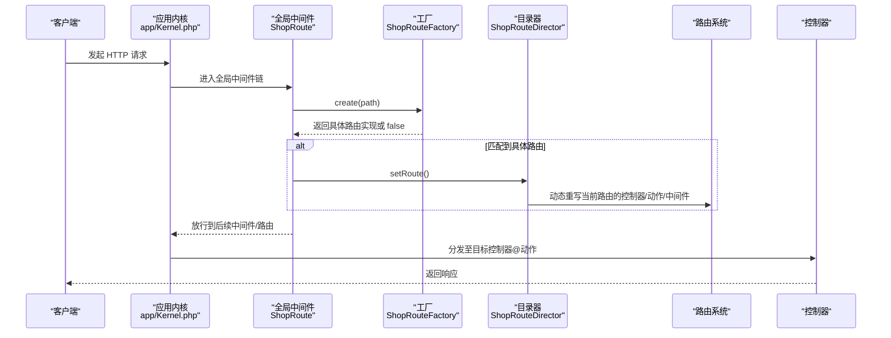
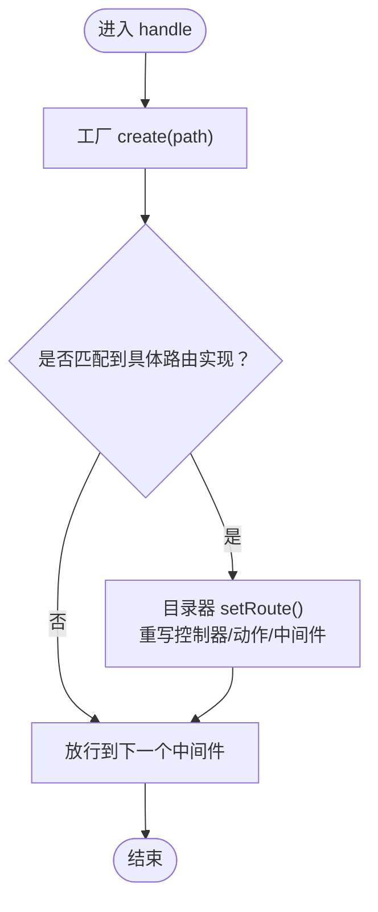
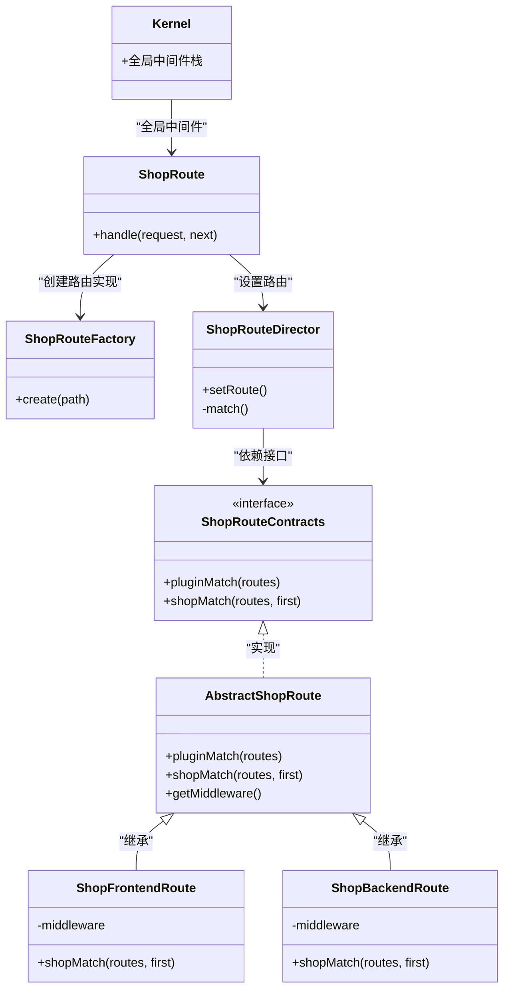

# 全局中间件

<cite>
**本文引用的文件**
- [app/Kernel.php](file://app/Kernel.php)
- [app/common/middleware/ShopRoute.php](file://app/common/middleware/ShopRoute.php)
- [app/common/route/ShopRouteFactory.php](file://app/common/route/ShopRouteFactory.php)
- [app/common/route/ShopRouteDirector.php](file://app/common/route/ShopRouteDirector.php)
- [app/common/providers/RouteServiceProvider.php](file://app/common/providers/RouteServiceProvider.php)
- [app/common/route/Contracts/ShopRoute.php](file://app/common/route/Contracts/ShopRoute.php)
- [app/common/route/AbstractShopRoute.php](file://app/common/route/AbstractShopRoute.php)
- [app/common/route/ShopFrontendRoute.php](file://app/common/route/ShopFrontendRoute.php)
- [app/common/route/ShopBackendRoute.php](file://app/common/route/ShopBackendRoute.php)
- [app/common/middleware/BasicInformation.php](file://app/common/middleware/BasicInformation.php)
- [app/common/middleware/AdminPermission.php](file://app/common/middleware/AdminPermission.php)
- [routes/shop.php](file://routes/shop.php)
- [routes/web.php](file://routes/web.php)
</cite>

## 目录
1. [引言](#引言)
2. [项目结构](#项目结构)
3. [核心组件](#核心组件)
4. [架构总览](#架构总览)
5. [详细组件分析](#详细组件分析)
6. [依赖关系分析](#依赖关系分析)
7. [性能考量](#性能考量)
8. [故障排查指南](#故障排查指南)
9. [结论](#结论)
10. [附录](#附录)

## 引言
本文件聚焦于全局中间件在系统中的关键作用与实现细节，特别是 ShopRoute 中间件如何在每次 HTTP 请求时进行路由分发、请求拦截与 URL 重写（通过动态替换控制器与中间件），以及其与应用内核、路由服务提供者、具体路由实现类之间的协作关系。文档还给出执行顺序、与其他中间件的关系、配置方法与自定义开发指南，并通过图示帮助读者快速理解整体工作流。

## 项目结构
围绕全局中间件与路由重写的相关文件组织如下：
- 应用内核：定义全局中间件栈与路由中间件映射
- 路由服务提供者：负责加载各类路由组（含 shop 路由）
- ShopRoute 中间件：在每次请求时根据路径选择具体路由实现并重写当前路由
- 路由工厂与目录：根据请求路径与路由字符串解析出控制器与动作，并合并中间件
- 抽象与具体路由实现：封装前台、后台、支付等不同域的匹配逻辑与中间件集合
- 其他中间件：如前台基础信息注入、后台权限校验等

图表来源
- [app/Kernel.php:19-23](file://app/Kernel.php#L19-L23)
- [app/common/middleware/ShopRoute.php:18-26](file://app/common/middleware/ShopRoute.php#L18-L26)
- [app/common/route/ShopRouteFactory.php:18-50](file://app/common/route/ShopRouteFactory.php#L18-L50)
- [app/common/route/ShopRouteDirector.php:26-39](file://app/common/route/ShopRouteDirector.php#L26-L39)
- [app/common/route/Contracts/ShopRoute.php:12-16](file://app/common/route/Contracts/ShopRoute.php#L12-L16)
- [app/common/route/AbstractShopRoute.php:17-60](file://app/common/route/AbstractShopRoute.php#L17-L60)
- [app/common/route/ShopFrontendRoute.php:19-64](file://app/common/route/ShopFrontendRoute.php#L19-L64)
- [app/common/route/ShopBackendRoute.php:18-59](file://app/common/route/ShopBackendRoute.php#L18-L59)
- [app/common/providers/RouteServiceProvider.php:137-146](file://app/common/providers/RouteServiceProvider.php#L137-L146)
- [routes/shop.php:1-9](file://routes/shop.php#L1-L9)
- [routes/web.php:14-16](file://routes/web.php#L14-L16)

章节来源
- [app/Kernel.php:19-23](file://app/Kernel.php#L19-L23)
- [app/common/providers/RouteServiceProvider.php:36-49](file://app/common/providers/RouteServiceProvider.php#L36-L49)

## 核心组件
- 全局中间件栈
  - 在应用内核中定义了全局中间件数组，其中包含 ShopRoute，意味着它会在每个请求进入时执行，用于根据请求路径与路由字符串动态重写当前路由。
- ShopRoute 中间件
  - 在 handle 方法中调用路由工厂创建具体路由实现，若成功则通过目录器设置路由，最终放行到下一个中间件。
- 路由工厂与目录器
  - 工厂根据请求路径与 URI 片段判断属于前台、后台、支付或微擎后台等域，并返回对应路由实现；目录器解析路由字符串，确定控制器与动作，并合并中间件。
- 抽象与具体路由实现
  - 抽象类统一提供插件与商城匹配逻辑、中间件集合；前台与后台分别实现各自的匹配策略与默认中间件。
- 路由服务提供者
  - 负责加载 shop 路由组，该组内定义了一个占位路由，实际由全局中间件在运行时重写。

章节来源
- [app/Kernel.php:19-23](file://app/Kernel.php#L19-L23)
- [app/common/middleware/ShopRoute.php:18-26](file://app/common/middleware/ShopRoute.php#L18-L26)
- [app/common/route/ShopRouteFactory.php:18-50](file://app/common/route/ShopRouteFactory.php#L18-L50)
- [app/common/route/ShopRouteDirector.php:26-39](file://app/common/route/ShopRouteDirector.php#L26-L39)
- [app/common/route/AbstractShopRoute.php:17-60](file://app/common/route/AbstractShopRoute.php#L17-L60)
- [app/common/route/ShopFrontendRoute.php:19-64](file://app/common/route/ShopFrontendRoute.php#L19-L64)
- [app/common/route/ShopBackendRoute.php:18-59](file://app/common/route/ShopBackendRoute.php#L18-L59)
- [app/common/providers/RouteServiceProvider.php:137-146](file://app/common/providers/RouteServiceProvider.php#L137-L146)

## 架构总览
下图展示了从请求进入内核到路由重写再到控制器执行的整体流程，强调全局中间件在每次请求中的介入点与职责边界。

图表来源
- [app/Kernel.php:19-23](file://app/Kernel.php#L19-L23)
- [app/common/middleware/ShopRoute.php:18-26](file://app/common/middleware/ShopRoute.php#L18-L26)
- [app/common/route/ShopRouteFactory.php:18-50](file://app/common/route/ShopRouteFactory.php#L18-L50)
- [app/common/route/ShopRouteDirector.php:26-39](file://app/common/route/ShopRouteDirector.php#L26-L39)

## 详细组件分析

### 全局中间件：ShopRoute 的实现原理
- 执行时机
  - 由于被加入全局中间件栈，ShopRoute 在每个请求进入时都会执行，确保对所有请求进行统一的路由分发与重写。
- 处理流程
  - 使用工厂根据请求路径与 URI 片段判断域类型；
  - 若匹配到具体路由实现，则通过目录器设置路由，将控制器、动作与中间件合并到当前路由；
  - 最终放行到后续中间件链。
- 与路由组的关系
  - shop 路由组本身是一个占位路由，实际的控制器与动作在运行时由全局中间件重写，从而实现“一次定义、多处复用”的路由分发模式。

图表来源
- [app/common/middleware/ShopRoute.php:18-26](file://app/common/middleware/ShopRoute.php#L18-L26)
- [app/common/route/ShopRouteFactory.php:18-50](file://app/common/route/ShopRouteFactory.php#L18-L50)
- [app/common/route/ShopRouteDirector.php:26-39](file://app/common/route/ShopRouteDirector.php#L26-L39)

章节来源
- [app/common/middleware/ShopRoute.php:18-26](file://app/common/middleware/ShopRoute.php#L18-L26)
- [routes/shop.php:1-9](file://routes/shop.php#L1-L9)

### 路由工厂：域识别与路由实现选择
- 路径与 URI 判断
  - 针对特定路径与 URI 片段（如支付、微擎后台、插件接口等）进行分支判断，返回对应的路由实现；
  - 默认情况下返回 false，表示不进行重写。
- 设计要点
  - 将“域识别”与“路由实现”解耦，便于扩展新的域类型；
  - 通过返回布尔值控制是否启用重写逻辑。

章节来源
- [app/common/route/ShopRouteFactory.php:18-50](file://app/common/route/ShopRouteFactory.php#L18-L50)

### 路由目录器：控制器与动作解析、中间件合并
- 解析规则
  - 将路由字符串按点号拆分，区分插件与商城两类匹配；
  - 若动作为空，默认回退到 index，并将动作转为驼峰形式；
- 控制器与动作确定
  - 依据命名空间与类约定，动态定位控制器类与动作方法；
- 中间件合并
  - 从具体路由实现中获取中间件集合，并与当前路由已有的中间件合并，确保权限与业务中间件叠加生效。

章节来源
- [app/common/route/ShopRouteDirector.php:26-39](file://app/common/route/ShopRouteDirector.php#L26-L39)
- [app/common/route/AbstractShopRoute.php:56-59](file://app/common/route/AbstractShopRoute.php#L56-L59)

### 抽象与具体路由实现：匹配策略与中间件集合
- 抽象类职责
  - 统一插件与商城匹配逻辑；
  - 提供中间件集合访问接口；
- 前台路由实现
  - 默认中间件包含前台基础信息注入；
  - 支持模块化控制器查找与命名规范转换。
- 后台路由实现
  - 默认中间件包含后台权限校验；
  - 与后台控制器与模块命名规范配合。

章节来源
- [app/common/route/AbstractShopRoute.php:17-60](file://app/common/route/AbstractShopRoute.php#L17-L60)
- [app/common/route/ShopFrontendRoute.php:19-64](file://app/common/route/ShopFrontendRoute.php#L19-L64)
- [app/common/route/ShopBackendRoute.php:18-59](file://app/common/route/ShopBackendRoute.php#L18-L59)

### 其他中间件：前台基础信息注入与后台权限校验
- 前台基础信息注入
  - 在响应阶段对内容进行二次处理，注入全局基础信息、页面校验状态等，提升前端渲染一致性与体验。
- 后台权限校验
  - 在执行控制器前进行权限校验，非公开控制器需满足权限条件。

章节来源
- [app/common/middleware/BasicInformation.php:47-70](file://app/common/middleware/BasicInformation.php#L47-L70)
- [app/common/middleware/AdminPermission.php:16-23](file://app/common/middleware/AdminPermission.php#L16-L23)

### 路由服务提供者与 shop 路由组
- 路由组加载
  - 通过服务提供者加载 shop 路由组，该组内定义一个占位路由；
- 全局中间件的作用
  - 实际的控制器与动作在请求到达时由全局中间件重写，实现“声明式路由组 + 运行时重写”的组合模式。

章节来源
- [app/common/providers/RouteServiceProvider.php:137-146](file://app/common/providers/RouteServiceProvider.php#L137-L146)
- [routes/shop.php:1-9](file://routes/shop.php#L1-L9)

## 依赖关系分析
- 内核与中间件
  - 内核将 ShopRoute 加入全局中间件栈，使其成为所有请求的必经环节。
- 中间件与工厂/目录器
  - ShopRoute 依赖工厂与目录器完成域识别与路由重写。
- 目录器与路由实现
  - 目录器依赖具体路由实现提供的匹配逻辑与中间件集合。
- 路由服务提供者与 shop 路由组
  - 服务提供者负责加载 shop 路由组，全局中间件在运行时对其进行重写。

图表来源
- [app/Kernel.php:19-23](file://app/Kernel.php#L19-L23)
- [app/common/middleware/ShopRoute.php:18-26](file://app/common/middleware/ShopRoute.php#L18-L26)
- [app/common/route/ShopRouteFactory.php:18-50](file://app/common/route/ShopRouteFactory.php#L18-L50)
- [app/common/route/ShopRouteDirector.php:26-39](file://app/common/route/ShopRouteDirector.php#L26-L39)
- [app/common/route/Contracts/ShopRoute.php:12-16](file://app/common/route/Contracts/ShopRoute.php#L12-L16)
- [app/common/route/AbstractShopRoute.php:17-60](file://app/common/route/AbstractShopRoute.php#L17-L60)
- [app/common/route/ShopFrontendRoute.php:19-64](file://app/common/route/ShopFrontendRoute.php#L19-L64)
- [app/common/route/ShopBackendRoute.php:18-59](file://app/common/route/ShopBackendRoute.php#L18-L59)

## 性能考量
- 全局中间件的执行成本
  - ShopRoute 在每次请求都会进行工厂与目录器操作，建议在工厂与目录器内部避免重复计算与昂贵 IO，必要时引入缓存或延迟初始化。
- 路由重写的影响
  - 目录器会修改当前路由的动作与控制器，应尽量减少不必要的重写逻辑，确保仅在确有需要时才进行重写。
- 中间件链长度
  - 全局中间件栈中每增加一个中间件都会增加一次函数调用开销，应保持中间件职责单一且必要。

## 故障排查指南
- 问题：请求未被正确重写
  - 排查点：检查工厂返回值是否为 false（可能因路径或 URI 片段不匹配）；确认 shop 路由组是否存在且可访问。
- 问题：控制器找不到或动作无效
  - 排查点：检查目录器的匹配逻辑与命名规范；确认控制器类存在且动作方法可调用；注意动作为空时的默认回退与驼峰转换。
- 问题：中间件未生效
  - 排查点：确认具体路由实现返回的中间件集合是否正确；检查目录器是否成功合并中间件。
- 问题：后台权限异常
  - 排查点：确认后台权限中间件是否正确执行；检查控制器是否标记为公开。

章节来源
- [app/common/route/ShopRouteFactory.php:18-50](file://app/common/route/ShopRouteFactory.php#L18-L50)
- [app/common/route/ShopRouteDirector.php:26-39](file://app/common/route/ShopRouteDirector.php#L26-L39)
- [app/common/middleware/AdminPermission.php:16-23](file://app/common/middleware/AdminPermission.php#L16-L23)

## 结论
全局中间件在本系统中承担了“统一路由分发与重写”的关键角色，通过与工厂、目录器、具体路由实现及路由服务提供者的协同，实现了灵活、可扩展的路由体系。开发者在新增域类型、调整匹配规则或扩展中间件时，应遵循现有职责分离与接口契约，确保全局中间件的稳定与高效。

## 附录

### 执行顺序与与其他中间件的关系
- 全局中间件位于内核的全局中间件栈中，先于路由组中间件执行；
- shop 路由组定义了占位路由，实际控制器与动作在全局中间件阶段被重写；
- 不同域（前台/后台/支付/微擎后台）由工厂与具体路由实现决定，目录器负责最终的控制器与动作解析，并合并中间件。

章节来源
- [app/Kernel.php:19-23](file://app/Kernel.php#L19-L23)
- [app/common/providers/RouteServiceProvider.php:137-146](file://app/common/providers/RouteServiceProvider.php#L137-L146)
- [routes/shop.php:1-9](file://routes/shop.php#L1-L9)

### 配置方法与自定义开发指南
- 配置全局中间件
  - 在应用内核的全局中间件数组中添加或移除中间件，确保 ShopRoute 位于合适的位置以满足路由重写需求。
- 自定义中间件
  - 若需在全局层面对请求进行拦截或增强，可在全局中间件栈中插入自定义中间件，并在 handle 中实现相应逻辑。
- 新增域类型
  - 在工厂中增加新的路径/URI 分支，返回新的路由实现；
  - 在抽象路由实现中补充匹配逻辑与默认中间件集合；
  - 在目录器中完善匹配规则（如插件与商城两类）。
- 注意事项
  - 保持中间件职责单一，避免在全局中间件中做过多业务逻辑；
  - 对昂贵操作进行缓存或延迟初始化；
  - 确保控制器命名规范与目录器解析规则一致。

章节来源
- [app/Kernel.php:19-23](file://app/Kernel.php#L19-L23)
- [app/common/route/ShopRouteFactory.php:18-50](file://app/common/route/ShopRouteFactory.php#L18-L50)
- [app/common/route/AbstractShopRoute.php:17-60](file://app/common/route/AbstractShopRoute.php#L17-L60)
- [app/common/route/ShopRouteDirector.php:26-39](file://app/common/route/ShopRouteDirector.php#L26-L39)