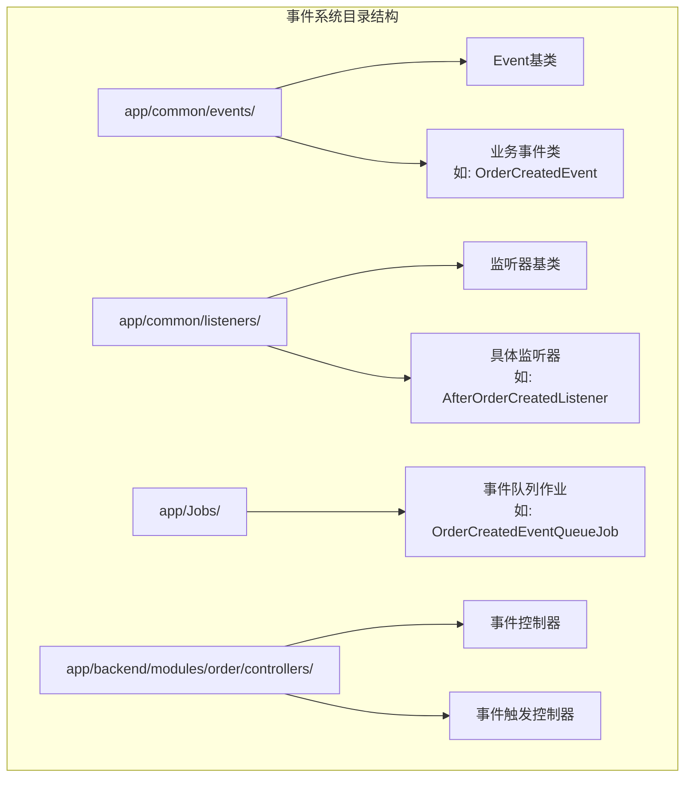
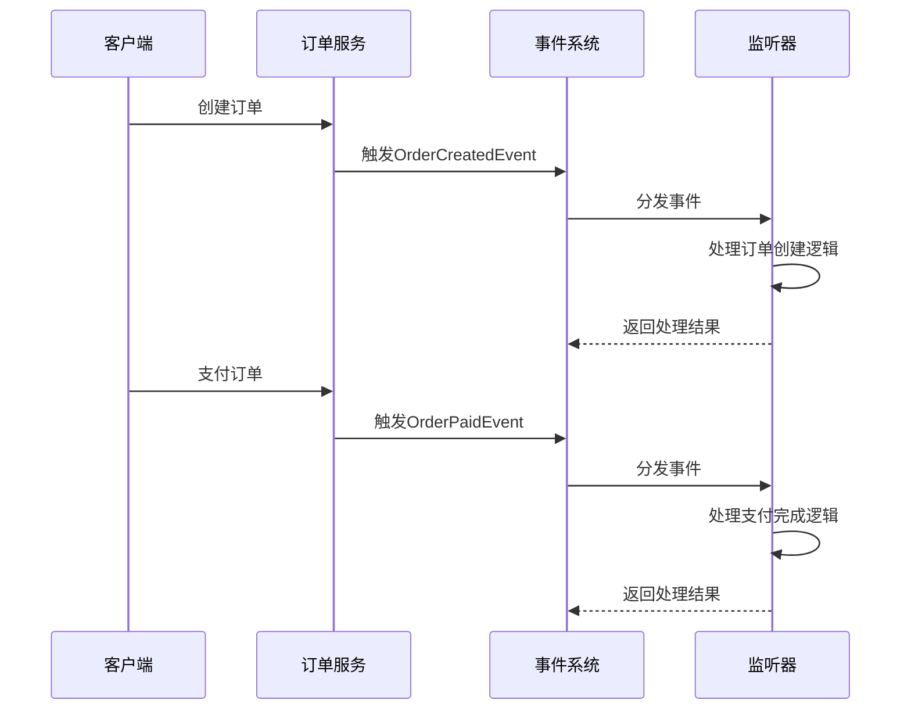
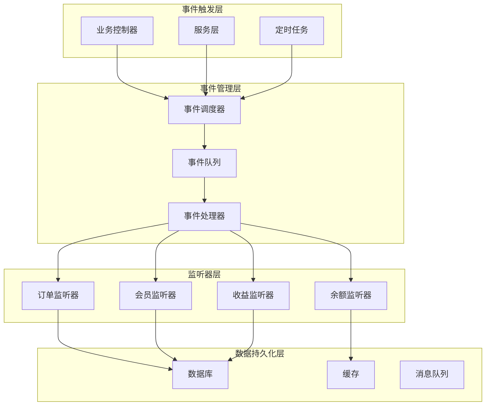
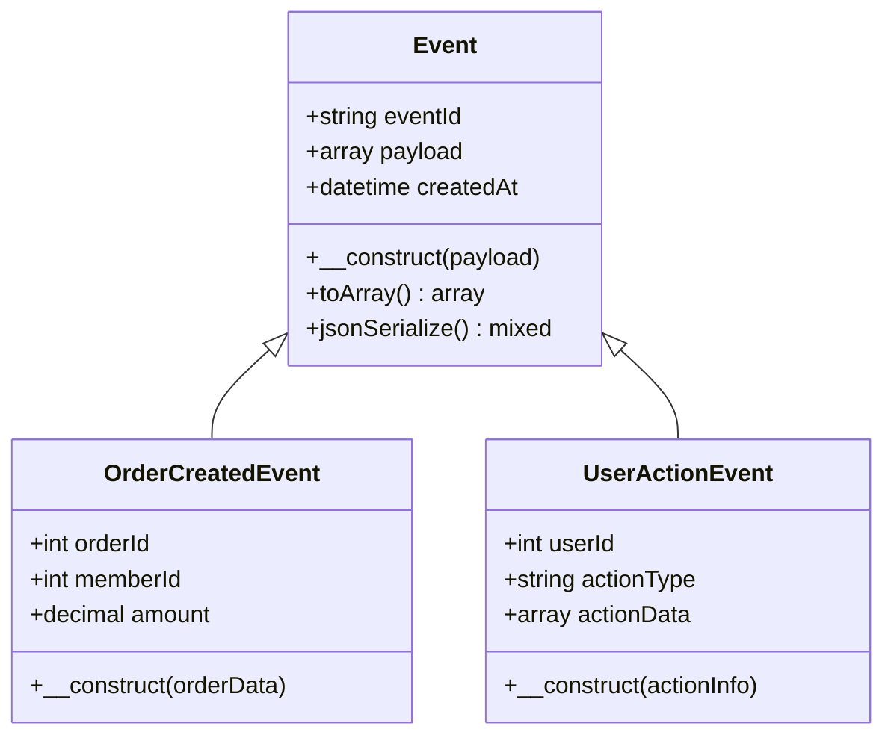
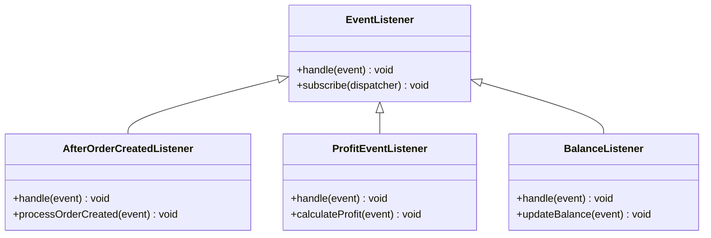
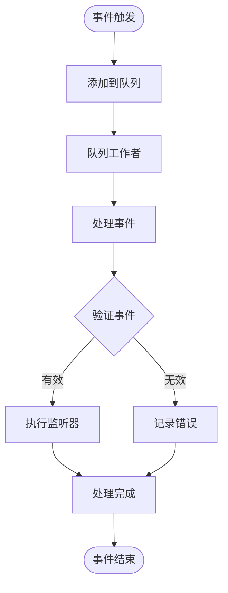
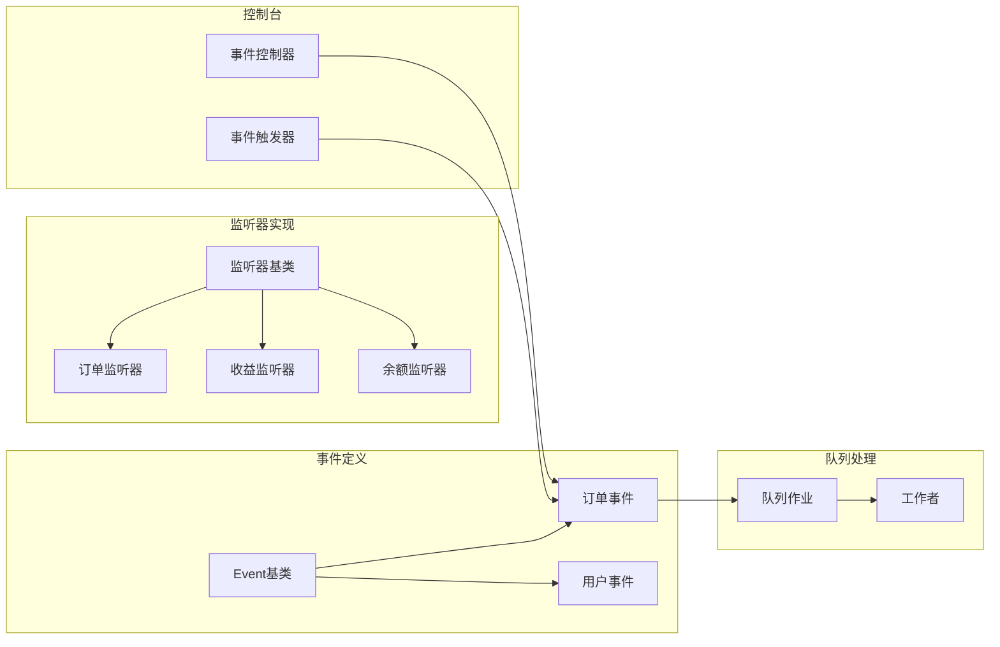

# 事件系统设计

<cite>
**本文档引用的文件**
- [Event.php](file://app/common/events/Event.php)
- [OrderCreatedEventQueueJob.php](file://app/Jobs/OrderCreatedEventQueueJob.php)
- [OrderPaidEventQueueJob.php](file://app/Jobs/OrderPaidEventQueueJob.php)
- [OrderReceivedEventQueueJob.php](file://app/Jobs/OrderReceivedEventQueueJob.php)
- [OrderSentEventQueueJob.php](file://app/Jobs/OrderSentEventQueueJob.php)
- [EventController.php](file://app/backend/modules/order/controllers/EventController.php)
- [EventFireController.php](file://app/backend/modules/order/controllers/EventFireController.php)
- [AfterOrderCreatedListener.php](file://app/common/listeners/member/AfterOrderCreatedListener.php)
- [AfterOrderPaidListener.php](file://app/common/listeners/member/AfterOrderPaidListener.php)
- [AfterOrderReceivedListener.php](file://app/common/listeners/member/AfterOrderReceivedListener.php)
- [ProfitEventListener.php](file://app/common/listeners/ProfitEventListener.php)
- [BalanceListener.php](file://app/common/listeners/balance/BalanceListener.php)
- [PointsRewardListener.php](file://app/common/listeners/balance/PointsRewardListener.php)
- [EventListener.php](file://app/common/listeners/EventListener.php)
- [Kernel.php](file://app/console/Kernel.php)
- [routes.php](file://app/http/routes.php)
</cite>

## 目录
1. [引言](#引言)
2. [项目结构](#项目结构)
3. [核心组件](#核心组件)
4. [架构概览](#架构概览)
5. [详细组件分析](#详细组件分析)
6. [依赖关系分析](#依赖关系分析)
7. [性能考虑](#性能考虑)
8. [故障排除指南](#故障排除指南)
9. [结论](#结论)

## 引言

芸众商城采用事件驱动架构来实现业务解耦和功能扩展。该事件系统基于Laravel框架构建，通过事件-监听器模式实现了订单生命周期管理、用户行为追踪、收益分配等多个核心业务场景。

事件系统的核心设计理念是通过异步事件处理来解耦业务逻辑，使得系统能够灵活地响应各种业务事件，同时保持代码的可维护性和可扩展性。

## 项目结构

芸众商城的事件系统主要分布在以下目录结构中：

**图表来源**
- [Event.php](file://app/common/events/Event.php)
- [AfterOrderCreatedListener.php](file://app/common/listeners/member/AfterOrderCreatedListener.php)
- [OrderCreatedEventQueueJob.php](file://app/Jobs/OrderCreatedEventQueueJob.php)

**章节来源**
- [Event.php](file://app/common/events/Event.php)
- [AfterOrderCreatedListener.php](file://app/common/listeners/member/AfterOrderCreatedListener.php)
- [OrderCreatedEventQueueJob.php](file://app/Jobs/OrderCreatedEventQueueJob.php)

## 核心组件

### Event基类设计

Event基类是整个事件系统的核心基础，提供了所有事件类的通用功能和接口定义。

**事件类设计原则：**
- **命名规范**：事件类采用动词短语命名，如OrderCreatedEvent、UserActionEvent
- **继承关系**：所有业务事件都继承自Event基类
- **数据封装**：事件对象封装了触发事件所需的所有业务数据

**事件生命周期管理：**
1. **事件创建**：通过构造函数接收业务参数
2. **事件发布**：通过事件调度器分发到各个监听器
3. **事件传播**：监听器按注册顺序依次执行
4. **事件处理完成**：清理资源并返回处理结果

**章节来源**
- [Event.php](file://app/common/events/Event.php)

### 订单事件系统

订单事件系统是芸众商城的核心业务事件，涵盖了订单从创建到完成的完整生命周期。

**图表来源**
- [OrderCreatedEventQueueJob.php](file://app/Jobs/OrderCreatedEventQueueJob.php)
- [OrderPaidEventQueueJob.php](file://app/Jobs/OrderPaidEventQueueJob.php)
- [AfterOrderCreatedListener.php](file://app/common/listeners/member/AfterOrderCreatedListener.php)

**章节来源**
- [OrderCreatedEventQueueJob.php](file://app/Jobs/OrderCreatedEventQueueJob.php)
- [OrderPaidEventQueueJob.php](file://app/Jobs/OrderPaidEventQueueJob.php)
- [OrderReceivedEventQueueJob.php](file://app/Jobs/OrderReceivedEventQueueJob.php)
- [OrderSentEventQueueJob.php](file://app/Jobs/OrderSentEventQueueJob.php)

## 架构概览

芸众商城的事件系统采用分层架构设计，通过事件-监听器模式实现业务解耦：

**图表来源**
- [EventController.php](file://app/backend/modules/order/controllers/EventController.php)
- [EventFireController.php](file://app/backend/modules/order/controllers/EventFireController.php)
- [Kernel.php](file://app/console/Kernel.php)

## 详细组件分析

### 事件基类分析

Event基类提供了事件系统的基础功能，包括事件标识、数据封装和生命周期管理。

**图表来源**
- [Event.php](file://app/common/events/Event.php)

**章节来源**
- [Event.php](file://app/common/events/Event.php)

### 监听器设计模式

监听器采用观察者模式实现，每个监听器专注于处理特定类型的事件。

**图表来源**
- [EventListener.php](file://app/common/listeners/EventListener.php)
- [AfterOrderCreatedListener.php](file://app/common/listeners/member/AfterOrderCreatedListener.php)
- [ProfitEventListener.php](file://app/common/listeners/ProfitEventListener.php)

**章节来源**
- [EventListener.php](file://app/common/listeners/EventListener.php)
- [AfterOrderCreatedListener.php](file://app/common/listeners/member/AfterOrderCreatedListener.php)
- [ProfitEventListener.php](file://app/common/listeners/ProfitEventListener.php)

### 队列作业处理

事件队列作业实现了事件的异步处理，提高了系统的响应性能。

**图表来源**
- [OrderCreatedEventQueueJob.php](file://app/Jobs/OrderCreatedEventQueueJob.php)
- [Kernel.php](file://app/console/Kernel.php)

**章节来源**
- [OrderCreatedEventQueueJob.php](file://app/Jobs/OrderCreatedEventQueueJob.php)
- [OrderPaidEventQueueJob.php](file://app/Jobs/OrderPaidEventQueueJob.php)
- [OrderReceivedEventQueueJob.php](file://app/Jobs/OrderReceivedEventQueueJob.php)
- [OrderSentEventQueueJob.php](file://app/Jobs/OrderSentEventQueueJob.php)

## 依赖关系分析

事件系统各组件之间的依赖关系如下：

**图表来源**
- [EventController.php](file://app/backend/modules/order/controllers/EventController.php)
- [EventFireController.php](file://app/backend/modules/order/controllers/EventFireController.php)

**章节来源**
- [EventController.php](file://app/backend/modules/order/controllers/EventController.php)
- [EventFireController.php](file://app/backend/modules/order/controllers/EventFireController.php)

## 性能考虑

### 异步处理优化

事件系统通过队列机制实现异步处理，避免阻塞主线程：

- **队列隔离**：不同类型的事件使用不同的队列处理
- **批量处理**：支持事件批处理以提高效率
- **重试机制**：失败的事件自动重试，确保数据一致性

### 内存管理

- **事件对象复用**：合理管理事件对象的生命周期
- **监听器状态管理**：避免监听器持有不必要的引用
- **资源清理**：及时释放数据库连接和文件句柄

## 故障排除指南

### 常见问题及解决方案

**事件未触发问题：**
1. 检查事件调度器配置
2. 验证监听器注册情况
3. 确认队列工作者正常运行

**监听器执行失败：**
1. 查看监听器日志输出
2. 检查监听器依赖的服务状态
3. 验证业务数据格式正确性

**队列积压问题：**
1. 增加队列工作者数量
2. 优化监听器处理逻辑
3. 调整队列优先级设置

**章节来源**
- [Kernel.php](file://app/console/Kernel.php)
- [routes.php](file://app/http/routes.php)

## 结论

芸众商城的事件系统通过精心设计的架构实现了业务解耦和功能扩展。系统采用分层设计，从事件定义到监听器实现，再到队列处理，形成了完整的事件处理链路。

**主要优势：**
- **高内聚低耦合**：事件和监听器职责明确，便于维护
- **异步处理**：提升系统响应性能和用户体验
- **可扩展性强**：新增业务功能只需添加新的事件和监听器
- **易于测试**：事件驱动架构便于单元测试和集成测试

**最佳实践建议：**
- 事件类应保持轻量级，只包含必要的业务数据
- 监听器应专注于单一职责，避免复杂的业务逻辑
- 合理使用队列机制，避免阻塞关键路径
- 建立完善的监控和日志体系，便于问题排查

通过持续优化和扩展，芸众商城的事件系统将继续为业务发展提供强有力的技术支撑。