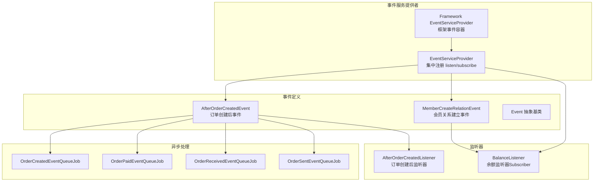
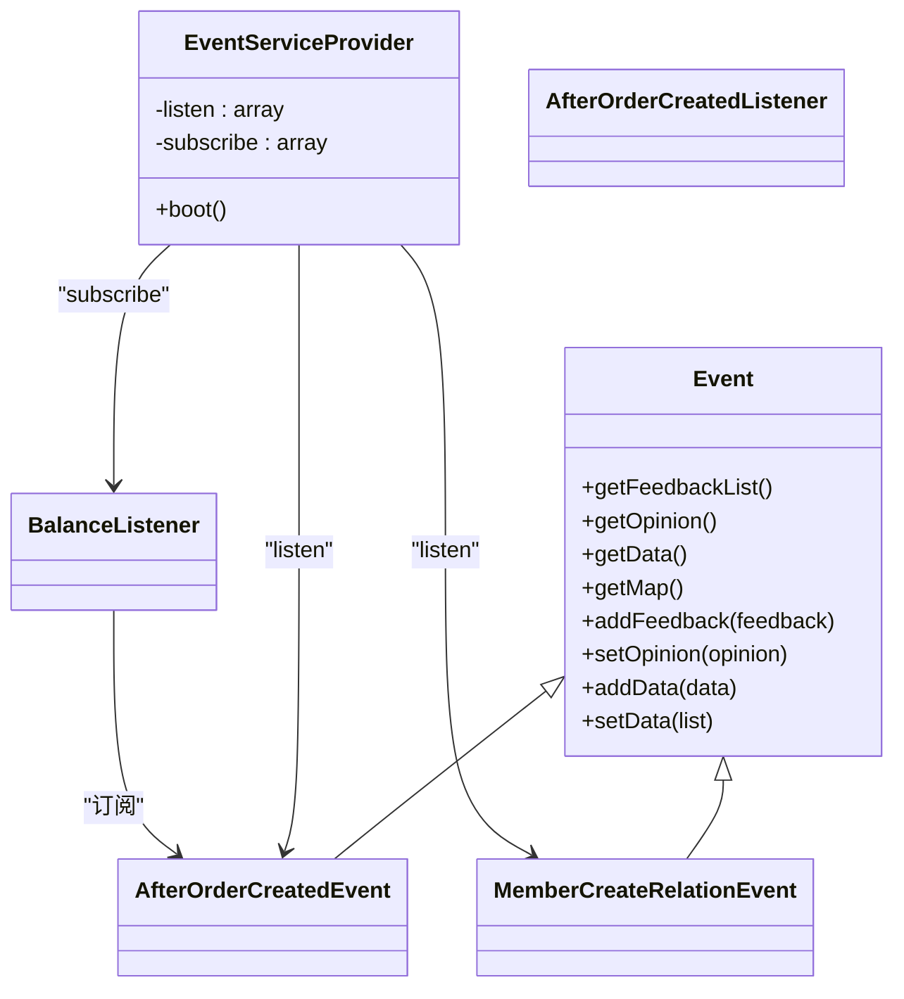
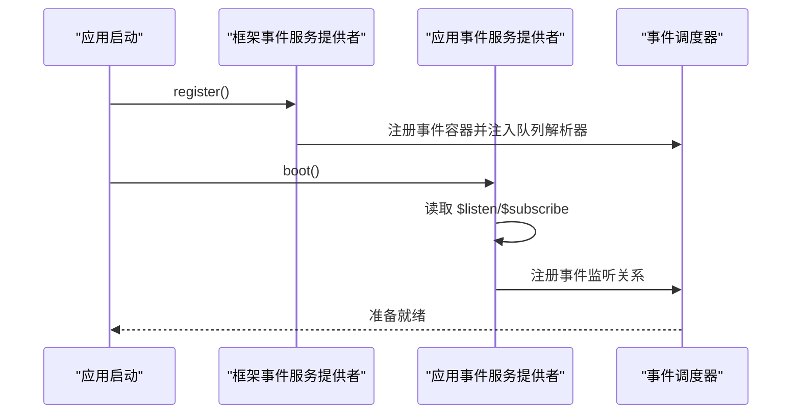
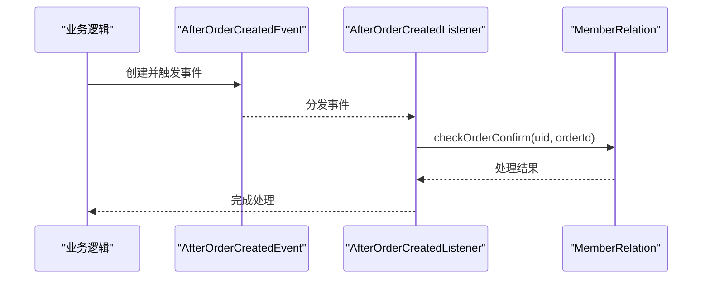
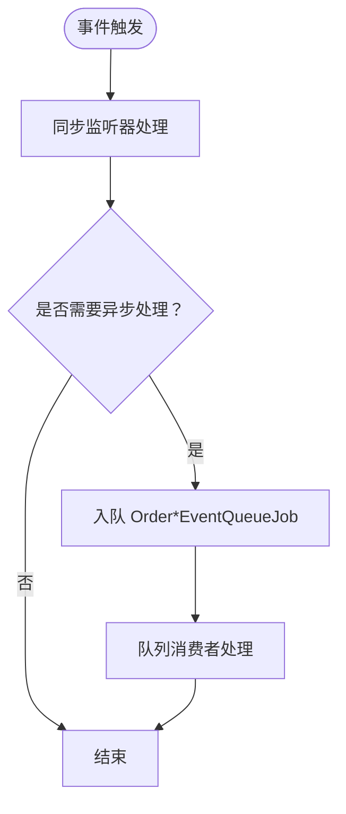
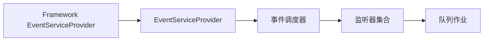

# 事件驱动架构

<cite>
**本文引用的文件**
- [app/common/providers/EventServiceProvider.php](file://app/common/providers/EventServiceProvider.php)
- [app/framework/Events/EventServiceProvider.php](file://app/framework/Events/EventServiceProvider.php)
- [app/common/events/Event.php](file://app/common/events/Event.php)
- [app/common/events/order/AfterOrderCreatedEvent.php](file://app/common/events/order/AfterOrderCreatedEvent.php)
- [app/common/events/member/MemberCreateRelationEvent.php](file://app/common/events/member/MemberCreateRelationEvent.php)
- [app/common/listeners/member/AfterOrderCreatedListener.php](file://app/common/listeners/member/AfterOrderCreatedListener.php)
- [app/common/listeners/balance/BalanceListener.php](file://app/common/listeners/balance/BalanceListener.php)
- [app/Jobs/OrderCreatedEventQueueJob.php](file://app/Jobs/OrderCreatedEventQueueJob.php)
- [app/Jobs/OrderPaidEventQueueJob.php](file://app/Jobs/OrderPaidEventQueueJob.php)
- [app/Jobs/OrderReceivedEventQueueJob.php](file://app/Jobs/OrderReceivedEventQueueJob.php)
- [app/Jobs/OrderSentEventQueueJob.php](file://app/Jobs/OrderSentEventQueueJob.php)
- [app/backend/modules/order/controllers/EventController.php](file://app/backend/modules/order/controllers/EventController.php)
- [app/backend/modules/order/controllers/EventFireController.php](file://app/backend/modules/order/controllers/EventFireController.php)
</cite>

## 目录
1. [引言](#引言)
2. [项目结构](#项目结构)
3. [核心组件](#核心组件)
4. [架构总览](#架构总览)
5. [详细组件分析](#详细组件分析)
6. [依赖分析](#依赖分析)
7. [性能考虑](#性能考虑)
8. [故障排查指南](#故障排查指南)
9. [结论](#结论)
10. [附录](#附录)

## 引言
本文件系统性梳理芸众商城的事件驱动架构，围绕事件发布、订阅、监听器执行等核心机制展开，重点解析 EventServiceProvider 如何集中管理事件与监听器映射关系，阐述 Subscriber 模式与事件聚合的设计思路，并对 200+ 事件类进行分类与组织方式说明。同时给出事件开发最佳实践（事件设计原则、监听器实现、异步处理）以及事件系统在插件化架构中的作用。

## 项目结构
事件驱动相关代码主要分布在以下区域：
- 事件定义层：app/common/events 及其子命名空间（如 order、member 等）
- 监听器实现层：app/common/listeners 及其子命名空间（按业务域分组）
- 事件服务提供者：app/common/providers/EventServiceProvider.php
- 框架事件服务提供者：app/framework/Events/EventServiceProvider.php
- 队列作业（异步事件）：app/Jobs 下以 EventQueueJob 命名的队列任务
- 控制台调试：后台订单模块下的事件控制器与事件触发控制器

**图表来源**
- [app/common/providers/EventServiceProvider.php:47-202](file://app/common/providers/EventServiceProvider.php#L47-L202)
- [app/framework/Events/EventServiceProvider.php:8-22](file://app/framework/Events/EventServiceProvider.php#L8-L22)
- [app/common/events/order/AfterOrderCreatedEvent.php:12-14](file://app/common/events/order/AfterOrderCreatedEvent.php#L12-L14)
- [app/common/events/member/MemberCreateRelationEvent.php:15-47](file://app/common/events/member/MemberCreateRelationEvent.php#L15-L47)
- [app/common/listeners/member/AfterOrderCreatedListener.php:14-22](file://app/common/listeners/member/AfterOrderCreatedListener.php#L14-L22)
- [app/common/listeners/balance/BalanceListener.php:22-32](file://app/common/listeners/balance/BalanceListener.php#L22-L32)
- [app/Jobs/OrderCreatedEventQueueJob.php](file://app/Jobs/OrderCreatedEventQueueJob.php)
- [app/Jobs/OrderPaidEventQueueJob.php](file://app/Jobs/OrderPaidEventQueueJob.php)
- [app/Jobs/OrderReceivedEventQueueJob.php](file://app/Jobs/OrderReceivedEventQueueJob.php)
- [app/Jobs/OrderSentEventQueueJob.php](file://app/Jobs/OrderSentEventQueueJob.php)

**章节来源**
- [app/common/providers/EventServiceProvider.php:47-202](file://app/common/providers/EventServiceProvider.php#L47-L202)
- [app/framework/Events/EventServiceProvider.php:8-22](file://app/framework/Events/EventServiceProvider.php#L8-L22)

## 核心组件
- 事件抽象基类：提供事件通用的数据承载能力（反馈列表、意见、数据、映射），便于监听器向事件写入上下文信息。
- 事件服务提供者：集中维护 listen 映射与 subscribe 列表，负责将事件与监听器绑定。
- 监听器：响应具体事件并执行业务逻辑；支持两种形式：直接监听（listen）与订阅者（subscribe）。
- 队列作业：将事件异步化，通过队列处理耗时或幂等性强的监听器逻辑。
- 框架事件服务提供者：重载事件容器注册，注入队列解析器，支撑异步事件。

**章节来源**
- [app/common/events/Event.php:5-73](file://app/common/events/Event.php#L5-L73)
- [app/common/providers/EventServiceProvider.php:47-202](file://app/common/providers/EventServiceProvider.php#L47-L202)
- [app/framework/Events/EventServiceProvider.php:8-22](file://app/framework/Events/EventServiceProvider.php#L8-L22)

## 架构总览
事件驱动架构采用“事件定义—事件服务提供者—监听器—异步处理”的分层设计。EventServiceProvider 将事件与监听器进行集中注册，支持两类注册方式：
- listen：一对一或多对一的事件到监听器映射
- subscribe：订阅者模式，监听器内部通过 subscribe 方法声明多个事件监听关系

**图表来源**
- [app/common/events/Event.php:5-73](file://app/common/events/Event.php#L5-L73)
- [app/common/providers/EventServiceProvider.php:47-202](file://app/common/providers/EventServiceProvider.php#L47-L202)
- [app/common/events/order/AfterOrderCreatedEvent.php:12-14](file://app/common/events/order/AfterOrderCreatedEvent.php#L12-L14)
- [app/common/events/member/MemberCreateRelationEvent.php:15-47](file://app/common/events/member/MemberCreateRelationEvent.php#L15-L47)
- [app/common/listeners/member/AfterOrderCreatedListener.php:14-22](file://app/common/listeners/member/AfterOrderCreatedListener.php#L14-L22)
- [app/common/listeners/balance/BalanceListener.php:22-32](file://app/common/listeners/balance/BalanceListener.php#L22-L32)

## 详细组件分析

### 事件服务提供者（EventServiceProvider）
- listen 映射：将具体事件类映射到一个或多个监听器类，例如订单创建后事件、支付日志事件、微信消息事件等。
- subscribe 列表：注册订阅者类，订阅者内部可声明对多种事件的监听关系，实现事件聚合与复用。
- boot 生命周期：在应用启动阶段调用父类 boot 完成注册，并在安装路径中短路避免干扰安装流程。

**图表来源**
- [app/framework/Events/EventServiceProvider.php:8-22](file://app/framework/Events/EventServiceProvider.php#L8-L22)
- [app/common/providers/EventServiceProvider.php:192-201](file://app/common/providers/EventServiceProvider.php#L192-L201)

**章节来源**
- [app/common/providers/EventServiceProvider.php:47-202](file://app/common/providers/EventServiceProvider.php#L47-L202)
- [app/framework/Events/EventServiceProvider.php:8-22](file://app/framework/Events/EventServiceProvider.php#L8-L22)

### 事件与监听器示例

#### 订单创建后事件（AfterOrderCreatedEvent）
- 事件定义：继承自订单相关事件基类，用于在订单创建完成后触发后续业务。
- 监听器：检查订单确认状态，可能联动会员关系等业务。

**图表来源**
- [app/common/events/order/AfterOrderCreatedEvent.php:12-14](file://app/common/events/order/AfterOrderCreatedEvent.php#L12-L14)
- [app/common/listeners/member/AfterOrderCreatedListener.php:14-22](file://app/common/listeners/member/AfterOrderCreatedListener.php#L14-L22)

**章节来源**
- [app/common/events/order/AfterOrderCreatedEvent.php:12-14](file://app/common/events/order/AfterOrderCreatedEvent.php#L12-L14)
- [app/common/listeners/member/AfterOrderCreatedListener.php:14-22](file://app/common/listeners/member/AfterOrderCreatedListener.php#L14-L22)

#### 会员关系建立事件（MemberCreateRelationEvent）
- 事件定义：封装会员与上级关系建立的上下文，包含 uid、parent_id、member 模型等。
- 使用场景：用于在会员关系变更时触发相关奖励、统计或通知逻辑。

**章节来源**
- [app/common/events/member/MemberCreateRelationEvent.php:15-47](file://app/common/events/member/MemberCreateRelationEvent.php#L15-L47)

#### 余额监听器（BalanceListener，订阅者模式）
- 订阅者：通过 subscribe 方法声明对多个事件的监听，如订单收货后发放余额、转账奖励积分等。
- 优势：将相关事件的监听逻辑聚合在一个类中，降低重复注册与分散管理成本。

**章节来源**
- [app/common/listeners/balance/BalanceListener.php:22-32](file://app/common/listeners/balance/BalanceListener.php#L22-L32)

### 事件聚合与分类组织
基于现有代码，事件可按业务域进行分类组织（示例，非穷举）：
- 会员事件：MemberCreateRelationEvent、MemberChangeRelationEvent、MemberNewOfflineEvent 等
- 订单事件：AfterOrderCreatedEvent、AfterOrderCreatedImmediatelyEvent、AfterOrderReceivedEvent 等
- 支付事件：PayLog、WechatProcessor、WechatMessage 等
- 财务事件：ProfitEvent、MemberBalanceChangeEvent 等
- 插件/模块事件：Coupon、Process、Status 等子模块事件

该分类方式有助于：
- 事件命名清晰、职责单一
- 监听器按域聚合，便于维护与扩展
- 在 EventServiceProvider 中集中管理，避免散落注册

**章节来源**
- [app/common/providers/EventServiceProvider.php:54-121](file://app/common/providers/EventServiceProvider.php#L54-L121)
- [app/common/events/order/AfterOrderCreatedEvent.php:12-14](file://app/common/events/order/AfterOrderCreatedEvent.php#L12-L14)
- [app/common/events/member/MemberCreateRelationEvent.php:15-47](file://app/common/events/member/MemberCreateRelationEvent.php#L15-L47)

### 异步事件与队列作业
- 队列作业：针对订单生命周期的关键事件（创建、支付、收货、发货）提供对应的队列作业，将监听器逻辑放入队列异步执行。
- 适用场景：日志写入、消息推送、外部系统通知等耗时或对外部系统依赖的操作。
- 与同步事件配合：保证核心业务快速返回，非关键链路异步化。

**图表来源**
- [app/Jobs/OrderCreatedEventQueueJob.php](file://app/Jobs/OrderCreatedEventQueueJob.php)
- [app/Jobs/OrderPaidEventQueueJob.php](file://app/Jobs/OrderPaidEventQueueJob.php)
- [app/Jobs/OrderReceivedEventQueueJob.php](file://app/Jobs/OrderReceivedEventQueueJob.php)
- [app/Jobs/OrderSentEventQueueJob.php](file://app/Jobs/OrderSentEventQueueJob.php)

**章节来源**
- [app/Jobs/OrderCreatedEventQueueJob.php](file://app/Jobs/OrderCreatedEventQueueJob.php)
- [app/Jobs/OrderPaidEventQueueJob.php](file://app/Jobs/OrderPaidEventQueueJob.php)
- [app/Jobs/OrderReceivedEventQueueJob.php](file://app/Jobs/OrderReceivedEventQueueJob.php)
- [app/Jobs/OrderSentEventQueueJob.php](file://app/Jobs/OrderSentEventQueueJob.php)

### 插件化架构中的事件系统
- 事件作为插件与主系统解耦的桥梁：插件通过事件发布业务动作，主系统通过 EventServiceProvider 统一注册与调度。
- 订阅者模式：插件可注册订阅者类，集中声明对多类事件的监听，减少主系统对插件细节的感知。
- 模块事件：如 Coupon、Process、Status 子模块事件，体现模块边界清晰与事件聚合。

**章节来源**
- [app/common/providers/EventServiceProvider.php:126-185](file://app/common/providers/EventServiceProvider.php#L126-L185)

## 依赖分析
- 事件服务提供者依赖框架事件服务提供者提供的事件容器与队列解析器，确保异步事件可用。
- 监听器依赖具体业务模型（如会员关系、订单等），并通过事件抽象基类传递上下文。
- 队列作业依赖队列系统，将监听器逻辑异步化。

**图表来源**
- [app/framework/Events/EventServiceProvider.php:8-22](file://app/framework/Events/EventServiceProvider.php#L8-L22)
- [app/common/providers/EventServiceProvider.php:47-202](file://app/common/providers/EventServiceProvider.php#L47-L202)

**章节来源**
- [app/framework/Events/EventServiceProvider.php:8-22](file://app/framework/Events/EventServiceProvider.php#L8-L22)
- [app/common/providers/EventServiceProvider.php:47-202](file://app/common/providers/EventServiceProvider.php#L47-L202)

## 性能考虑
- 异步化优先：将耗时或外部依赖强的监听器放入队列作业，避免阻塞请求。
- 监听器粒度：尽量保持监听器职责单一，便于缓存与复用。
- 事件聚合：使用订阅者模式聚合相关事件，减少重复注册与调度开销。
- 幂等性：对异步监听器进行幂等设计，避免重复处理导致副作用。

## 故障排查指南
- 事件未被触发：检查 EventServiceProvider 是否正确注册了 listen/subscribe，确认 boot 流程未被短路。
- 监听器未执行：核对监听器签名与事件类型匹配，确认监听器类可被自动加载。
- 异步监听器失败：检查队列消费者运行状态与错误日志，定位异常监听器。
- 上下文丢失：确认监听器通过事件抽象基类正确读取/写入反馈、意见、数据与映射。

**章节来源**
- [app/common/providers/EventServiceProvider.php:192-201](file://app/common/providers/EventServiceProvider.php#L192-L201)
- [app/common/events/Event.php:5-73](file://app/common/events/Event.php#L5-L73)

## 结论
芸众商城的事件驱动架构通过 EventServiceProvider 实现事件与监听器的集中管理，结合订阅者模式与队列异步化，有效实现了业务解耦与功能扩展。事件按业务域分类组织，配合插件化架构，使得系统具备良好的可维护性与可扩展性。建议在新增事件时遵循统一命名规范与职责划分，并优先采用异步处理提升整体性能与稳定性。

## 附录
- 事件开发最佳实践
  - 事件设计原则：语义明确、职责单一、无副作用
  - 监听器实现：幂等、可测试、可配置
  - 异步处理：耗时与外部依赖强的逻辑必须异步化
  - 调试工具：利用后台事件控制器与事件触发控制器进行本地验证

**章节来源**
- [app/backend/modules/order/controllers/EventController.php](file://app/backend/modules/order/controllers/EventController.php)
- [app/backend/modules/order/controllers/EventFireController.php](file://app/backend/modules/order/controllers/EventFireController.php)