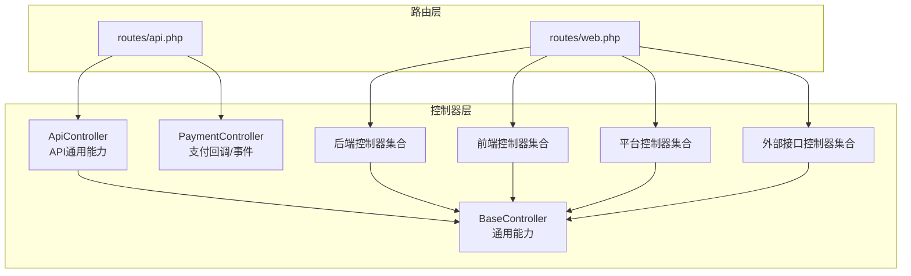
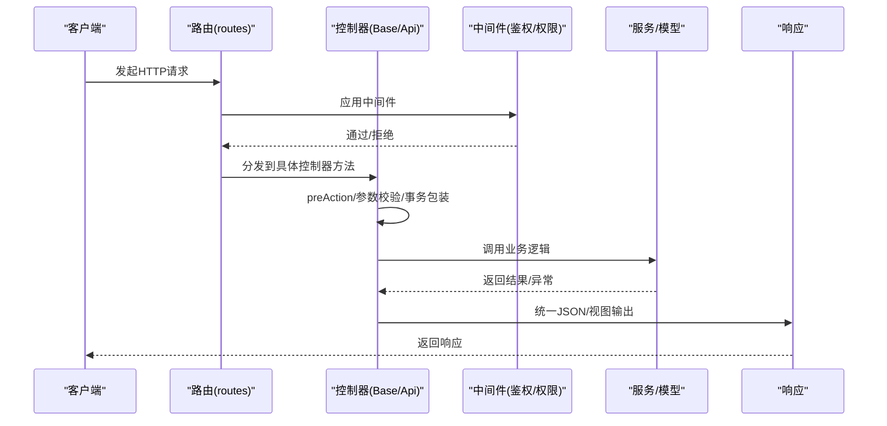
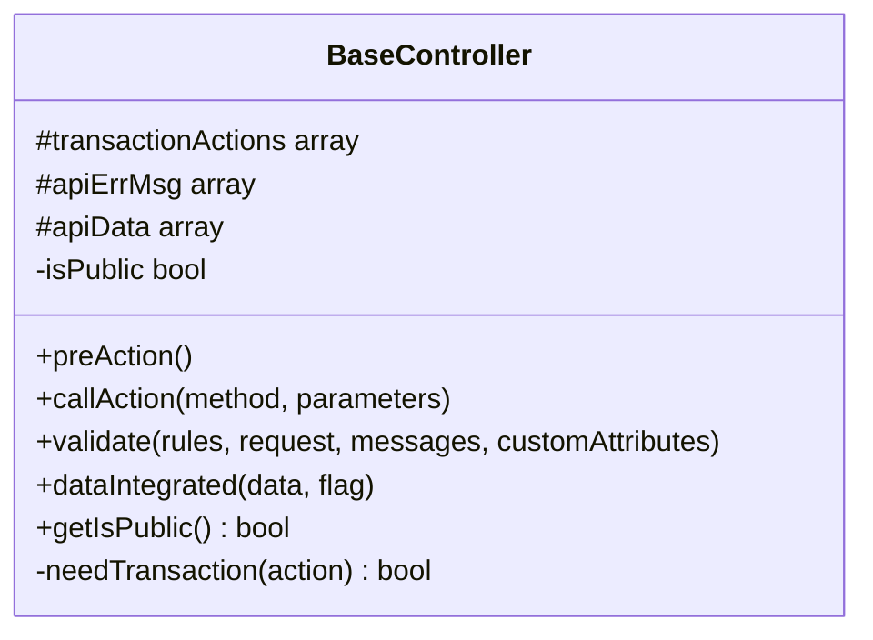
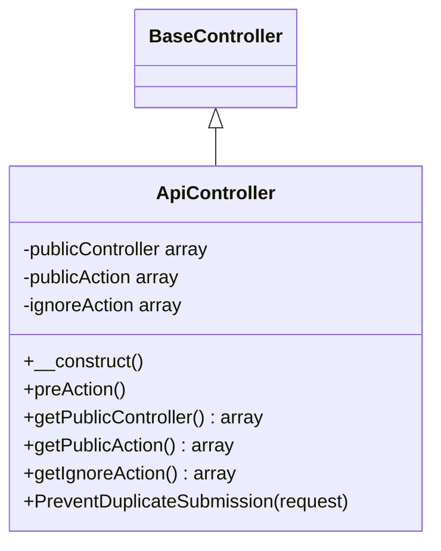
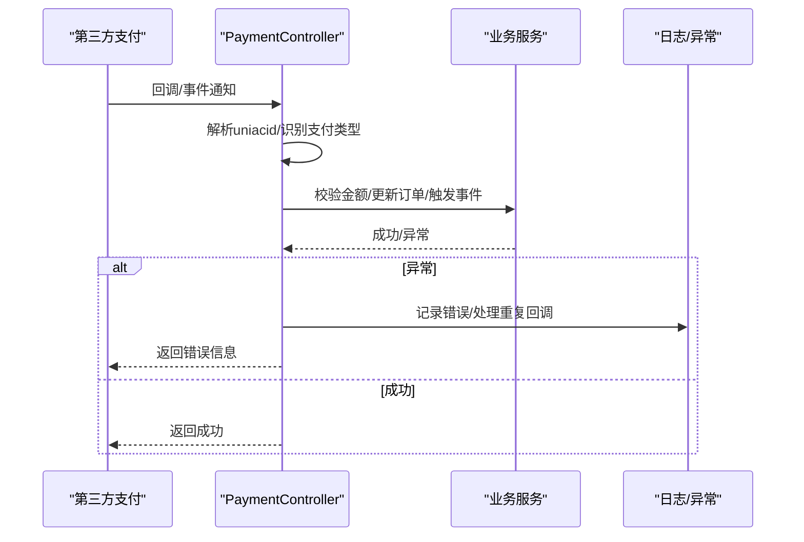
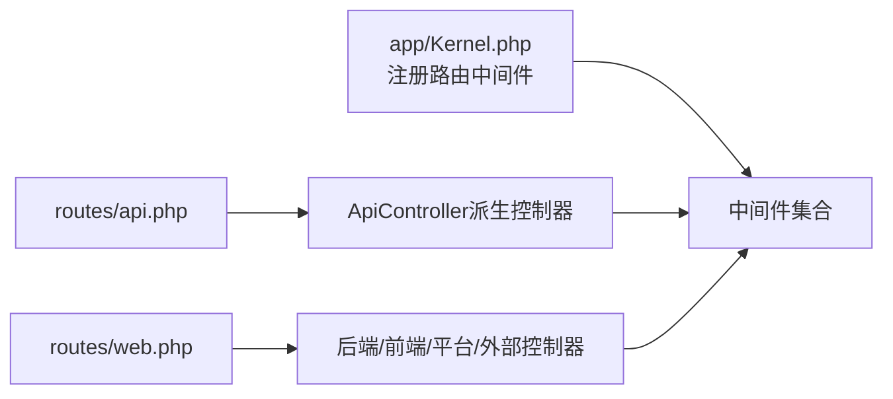

# 控制器层

<cite>
**本文引用的文件**
- [app/common/components/BaseController.php](file://app/common/components/BaseController.php)
- [app/common/components/ApiController.php](file://app/common/components/ApiController.php)
- [app/backend/controllers/IndexController.php](file://app/backend/controllers/IndexController.php)
- [app/backend/controllers/CornController.php](file://app/backend/controllers/CornController.php)
- [app/backend/controllers/NotFoundController.php](file://app/backend/controllers/NotFoundController.php)
- [app/payment/PaymentController.php](file://app/payment/PaymentController.php)
- [routes/api.php](file://routes/api.php)
- [routes/web.php](file://routes/web.php)
- [app/Kernel.php](file://app/Kernel.php)
</cite>

## 目录
1. [简介](#简介)
2. [项目结构](#项目结构)
3. [核心组件](#核心组件)
4. [架构总览](#架构总览)
5. [组件详解](#组件详解)
6. [依赖关系分析](#依赖关系分析)
7. [性能考量](#性能考量)
8. [故障排查指南](#故障排查指南)
9. [结论](#结论)
10. [附录](#附录)

## 简介
本章节概述控制器层在 MVC 架构中的职责与定位：负责接收请求、解析与验证参数、协调业务逻辑、统一响应格式，并通过中间件实现鉴权、权限与公共流程的横切。本文聚焦后端控制器、前端控制器、平台控制器与外部接口控制器的差异与适用场景；阐述 BaseController 与 ApiController 的设计理念及通用能力；解释控制器与路由系统的绑定关系、参数传递机制与错误处理策略；并给出 RESTful 设计、文件上传与批量操作等最佳实践的参考路径。

## 项目结构
控制器层分布于多模块目录，遵循按域分层的组织方式：
- 后端控制器：位于 app/backend/controllers 及各后台模块子目录，面向管理后台与运营场景。
- 前端控制器：位于 app/frontend/controllers，面向会员与前端业务。
- 平台控制器：位于 app/platform/controllers，面向平台级业务。
- 外部接口控制器：位于 app/outside/controllers，面向第三方对接。
- 支付控制器：位于 app/payment，处理支付回调与事件通知。
- 路由定义：位于 routes 目录，绑定控制器方法与访问入口。

图表来源
- [routes/api.php:1-7](file://routes/api.php#L1-L7)
- [routes/web.php:1-17](file://routes/web.php#L1-L17)
- [app/common/components/BaseController.php:1-172](file://app/common/components/BaseController.php#L1-L172)
- [app/common/components/ApiController.php:1-78](file://app/common/components/ApiController.php#L1-L78)
- [app/payment/PaymentController.php:1-337](file://app/payment/PaymentController.php#L1-L337)

章节来源
- [routes/api.php:1-7](file://routes/api.php#L1-L7)
- [routes/web.php:1-17](file://routes/web.php#L1-L17)

## 核心组件
- BaseController：提供前置钩子、事务包裹、参数校验、消息与JSON响应、权限与模板工具、登录跳转辅助等通用能力。
- ApiController：在 BaseController 基础上增加前端鉴权中间件、公开控制器/动作白名单、防重复提交等API专用能力。

章节来源
- [app/common/components/BaseController.php:1-172](file://app/common/components/BaseController.php#L1-L172)
- [app/common/components/ApiController.php:1-78](file://app/common/components/ApiController.php#L1-L78)

## 架构总览
控制器层与路由、中间件、服务层协作，形成清晰的请求处理链路：请求经路由匹配到控制器方法，前置钩子与中间件完成鉴权与环境初始化，控制器调用服务或模型处理业务，最终以统一的JSON或视图响应返回。

图表来源
- [app/common/components/BaseController.php:65-83](file://app/common/components/BaseController.php#L65-L83)
- [app/common/components/ApiController.php:30-43](file://app/common/components/ApiController.php#L30-L43)
- [app/Kernel.php:59-77](file://app/Kernel.php#L59-L77)

## 组件详解

### BaseController 设计与能力
- 前置钩子与调用封装：支持 preAction 在方法执行前运行；callAction 将目标方法包裹在事务中（当 action 列表包含该方法或通配符时）。
- 参数校验：基于框架验证工厂对请求参数进行规则校验，失败抛出应用异常。
- 统一响应：通过 Traits 提供 JSON 与消息提示能力，便于快速返回标准格式。
- 登录跳转辅助：根据客户端类型与作用域生成登录跳转链接，兼容小程序/APP/移动端等。
- 会话与环境：构造函数中初始化当前uniacid的会话上下文。

图表来源
- [app/common/components/BaseController.php:38-172](file://app/common/components/BaseController.php#L38-L172)

章节来源
- [app/common/components/BaseController.php:65-120](file://app/common/components/BaseController.php#L65-L120)
- [app/common/components/BaseController.php:96-106](file://app/common/components/BaseController.php#L96-L106)
- [app/common/components/BaseController.php:122-135](file://app/common/components/BaseController.php#L122-L135)
- [app/common/components/BaseController.php:137-169](file://app/common/components/BaseController.php#L137-L169)

### ApiController 设计与能力
- 前端鉴权中间件：默认启用前端认证中间件，确保API访问具备前端身份上下文。
- 公开接口白名单：支持控制器级别与动作级别的公开列表，便于开放部分API。
- 防重复提交：基于请求IP、路径与请求体哈希构建Redis键，3秒内去重，避免重复提交。
- 继承关系：继承 BaseController，复用其通用能力。

图表来源
- [app/common/components/ApiController.php:23-78](file://app/common/components/ApiController.php#L23-L78)
- [app/common/components/BaseController.php:38-40](file://app/common/components/BaseController.php#L38-L40)

章节来源
- [app/common/components/ApiController.php:30-77](file://app/common/components/ApiController.php#L30-L77)

### 后端控制器（管理后台）
- 典型场景：后台首页聚合、插件入口判断、权限与角色适配、跳转至不同子系统入口。
- 特点：可设置 isPublic 为 true 以允许公开访问；根据插件启用情况与用户角色动态选择入口控制器。
- 示例：后台首页控制器根据用户身份与插件状态跳转到调查问卷、门店收银、供应商或商户管理入口。

章节来源
- [app/backend/controllers/IndexController.php:24-100](file://app/backend/controllers/IndexController.php#L24-L100)
- [app/backend/controllers/IndexController.php:26](file://app/backend/controllers/IndexController.php#L26)

### 前端控制器（会员/前端业务）
- 典型场景：会员中心、前端商品、订单等业务入口。
- 特点：通常与前端鉴权中间件配合，结合 ApiController 的公开白名单策略，实现灵活的API暴露。

（本节为概念性说明，不直接分析具体文件）

### 平台控制器（平台级业务）
- 典型场景：平台配置、全局设置、跨店铺/跨商户的统一管理。
- 特点：与平台域模型与服务交互，遵循 BaseController/ApiController 的通用规范。

（本节为概念性说明，不直接分析具体文件）

### 外部接口控制器（第三方对接）
- 典型场景：外部系统回调、开放平台接入、网关转发等。
- 特点：通常需要严格的签名/鉴权与幂等控制，建议结合 ApiController 的公开白名单与防重复提交能力。

（本节为概念性说明，不直接分析具体文件）

### 支付控制器（回调与事件）
- 典型场景：支付回调、退款回调、提现回调、第三方支付事件通知。
- 能力：根据订单号前缀识别支付类型，校验金额一致性，触发相应业务事件与订单状态更新；对重复回调与订单关闭等异常情况进行分支处理。
- 安全：在初始化阶段根据回调参数解析uniacid，确保后续配置与业务在正确的账户上下文中执行。

图表来源
- [app/payment/PaymentController.php:34-66](file://app/payment/PaymentController.php#L34-L66)
- [app/payment/PaymentController.php:106-246](file://app/payment/PaymentController.php#L106-L246)
- [app/payment/PaymentController.php:252-299](file://app/payment/PaymentController.php#L252-L299)

章节来源
- [app/payment/PaymentController.php:25-66](file://app/payment/PaymentController.php#L25-L66)
- [app/payment/PaymentController.php:106-246](file://app/payment/PaymentController.php#L106-L246)
- [app/payment/PaymentController.php:252-299](file://app/payment/PaymentController.php#L252-L299)

### 调度与定时任务控制器
- 典型场景：通过安全密钥校验后触发定时任务执行。
- 能力：从配置读取密钥，校验请求参数，通过框架命令执行器触发cron任务；校验失败或密钥不匹配时记录日志并终止。

章节来源
- [app/backend/controllers/CornController.php:14-49](file://app/backend/controllers/CornController.php#L14-L49)

### 404 页面控制器
- 典型场景：兜底页面或无效路由处理。
- 能力：抛出未找到异常，交由全局异常处理器渲染友好页面。

章节来源
- [app/backend/controllers/NotFoundController.php:15-23](file://app/backend/controllers/NotFoundController.php#L15-L23)

## 依赖关系分析
- 控制器与中间件：通过 Kernel 注册的路由中间件实现鉴权与权限控制；ApiController 默认附加前端鉴权中间件。
- 控制器与路由：路由文件将URL映射到控制器方法；API路由与Web路由分别承载不同入口。
- 控制器与服务：控制器通过服务层协调业务，保持薄控制器厚服务的分层原则。

图表来源
- [app/Kernel.php:59-77](file://app/Kernel.php#L59-L77)
- [routes/api.php:1-7](file://routes/api.php#L1-L7)
- [routes/web.php:1-17](file://routes/web.php#L1-L17)

章节来源
- [app/Kernel.php:59-77](file://app/Kernel.php#L59-L77)
- [routes/api.php:1-7](file://routes/api.php#L1-L7)
- [routes/web.php:1-17](file://routes/web.php#L1-L17)

## 性能考量
- 事务包裹：BaseController 对指定动作自动开启数据库事务，减少并发写入的脏读与不一致风险，但需注意事务范围与耗时，避免长事务阻塞。
- 防重复提交：ApiController 使用Redis短时效键去重，降低重复请求带来的压力与副作用。
- 中间件链路：合理拆分中间件职责，避免在中间件中做重IO操作；必要时采用异步或缓存策略。
- 响应格式：统一JSON输出，减少序列化与格式转换成本；对大对象分页或懒加载。

（本节为通用指导，不直接分析具体文件）

## 故障排查指南
- 参数校验失败：检查控制器 validate 调用处的规则定义与请求参数是否匹配。
- 事务回滚：确认 transactionActions 是否包含目标动作；查看异常栈定位失败位置。
- 登录跳转异常：核对客户端类型与作用域参数，确保 jumpUrl 生成的登录地址正确。
- 支付回调异常：检查回调参数解析、金额校验与支付类型识别逻辑；关注重复回调与订单状态处理分支。
- 定时任务密钥：确认配置项与请求参数均符合要求；查看日志定位校验失败原因。

章节来源
- [app/common/components/BaseController.php:96-106](file://app/common/components/BaseController.php#L96-L106)
- [app/common/components/BaseController.php:116-120](file://app/common/components/BaseController.php#L116-L120)
- [app/common/components/BaseController.php:147-169](file://app/common/components/BaseController.php#L147-L169)
- [app/payment/PaymentController.php:252-299](file://app/payment/PaymentController.php#L252-L299)
- [app/backend/controllers/CornController.php:19-46](file://app/backend/controllers/CornController.php#L19-L46)

## 结论
控制器层通过 BaseController 与 ApiController 提供统一的参数校验、事务管理、响应格式与安全控制能力，结合路由与中间件实现清晰的请求处理链路。不同域的控制器（后端、前端、平台、外部接口）在职责与入口上有所区别，但共享通用基类的能力，保证了代码的一致性与可维护性。支付控制器作为特殊域，强调幂等与安全性，建议严格遵循回调与事件处理的最佳实践。

## 附录

### 控制器与路由绑定关系
- API路由：routes/api.php 承载API入口，通常与 ApiController 或其派生控制器绑定。
- Web路由：routes/web.php 承载Web入口，绑定后端、前端、平台与外部控制器。

章节来源
- [routes/api.php:1-7](file://routes/api.php#L1-L7)
- [routes/web.php:1-17](file://routes/web.php#L1-L17)

### 参数传递机制
- 请求参数：通过框架Request对象获取；BaseController.validate 默认使用当前请求。
- 中间件注入：中间件可修改请求属性或上下文，影响控制器后续处理。
- 动作参数：路由参数通过 callAction 传入控制器方法。

章节来源
- [app/common/components/BaseController.php:96-106](file://app/common/components/BaseController.php#L96-L106)
- [app/common/components/BaseController.php:70-83](file://app/common/components/BaseController.php#L70-L83)

### 错误处理策略
- 参数校验异常：抛出应用异常，交由全局异常处理器统一渲染。
- 业务异常：在支付控制器中分类处理重复回调与订单关闭等场景，记录日志并返回明确信息。
- 404兜底：NotFoundController 抛出未找到异常，便于统一处理。

章节来源
- [app/common/components/BaseController.php:96-106](file://app/common/components/BaseController.php#L96-L106)
- [app/payment/PaymentController.php:252-299](file://app/payment/PaymentController.php#L252-L299)
- [app/backend/controllers/NotFoundController.php:18-22](file://app/backend/controllers/NotFoundController.php#L18-L22)

### 最佳实践参考路径
- RESTful API设计：参考 ApiController 的公开白名单与中间件策略，结合 BaseController 的统一响应能力。
- 文件上传处理：在对应控制器中使用框架文件上传能力，结合 BaseController 的参数校验与响应格式。
- 批量操作：在控制器中循环调用服务层批处理方法，必要时开启事务包裹与分页处理。

（本节为通用指导，不直接分析具体文件）