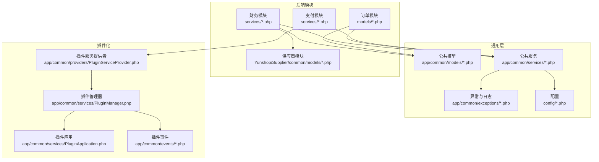
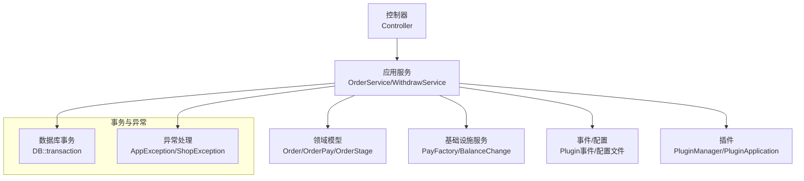
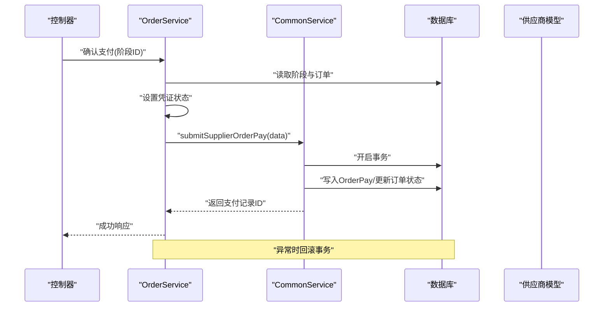
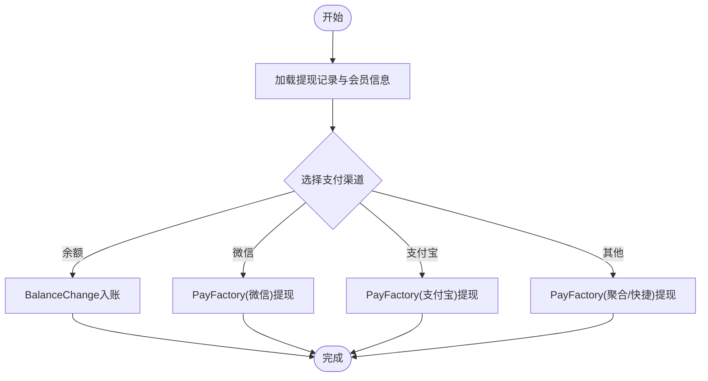
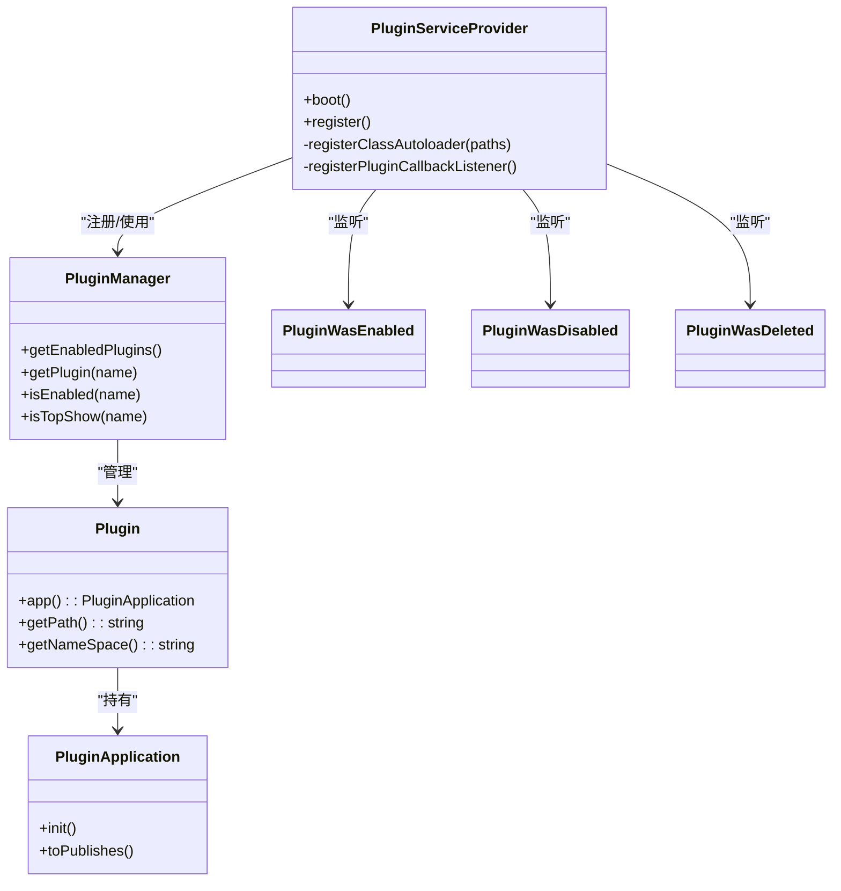
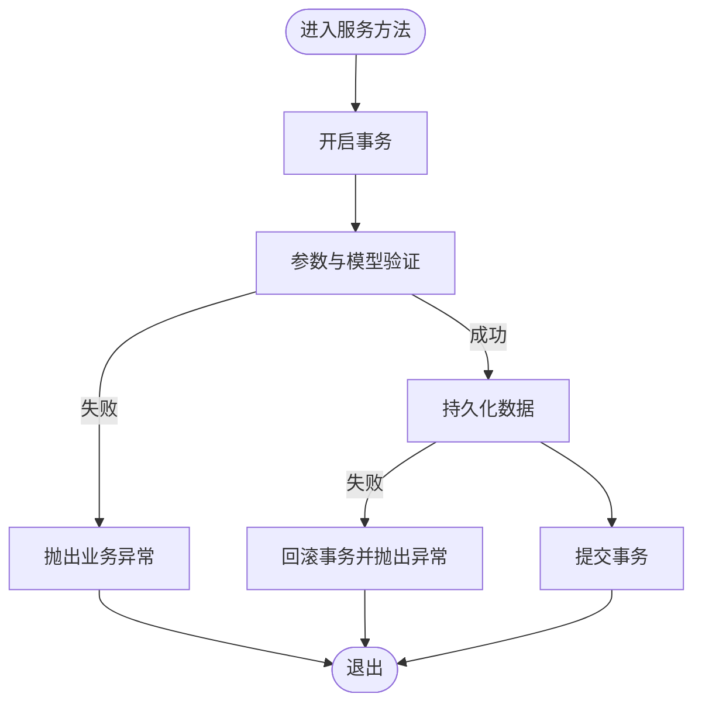
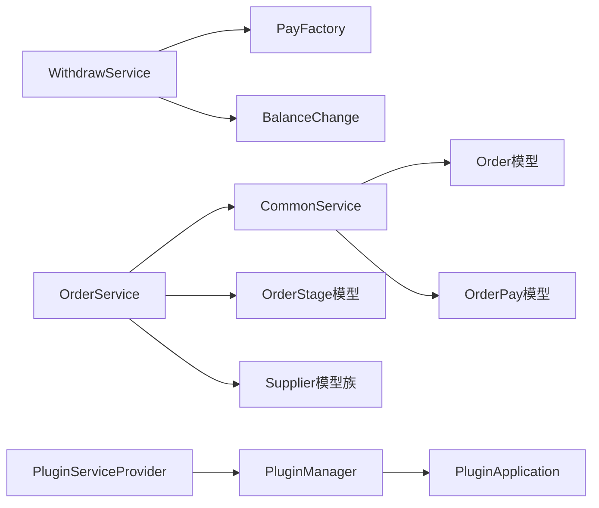

# Service层

<cite>
**本文引用的文件**
- [CommonService.php](file://app/backend/modules/finance/services/CommonService.php)
- [OrderService.php](file://app/backend/modules/finance/services/OrderService.php)
- [WithdrawService.php](file://app/backend/modules/finance/services/WithdrawService.php)
- [PluginServiceProvider.php](file://app/common/providers/PluginServiceProvider.php)
- [Plugin.php](file://app/common/services/Plugin.php)
- [PluginManager.php](file://app/common/services/PluginManager.php)
- [PluginApplication.php](file://app/common/services/PluginApplication.php)
- [PluginWasEnabled.php](file://app/common/events/PluginWasEnabled.php)
- [PluginWasDisabled.php](file://app/common/events/PluginWasDisabled.php)
- [PluginWasDeleted.php](file://app/common/events/PluginWasDeleted.php)
- [PayFactory.php](file://app/common/services/PayFactory.php)
- [BalanceChange.php](file://app/common/services/finance/BalanceChange.php)
- [Withdraw.php](file://app/common/services/finance/Withdraw.php)
- [Order.php](file://app/common/models/Order.php)
- [OrderPay.php](file://app/common/models/OrderPay.php)
- [OrderStage.php](file://app/common/models/project/OrderStage.php)
- [Supplier.php](file://Yunshop/Supplier/common/models/Supplier.php)
- [SupplierLogisticPrice.php](file://Yunshop/Supplier/common/models/SupplierLogisticPrice.php)
- [SupplierInstallPrice.php](file://Yunshop/Supplier/common/models/SupplierInstallPrice.php)
- [SupplierPayOrder.php](file://Yunshop/Supplier/common/models/SupplierPayOrder.php)
- [RemittanceAuditFlow.php](file://app/common/modules/payType/remittance/models/flows/RemittanceAuditFlow.php)
- [RemittanceAuditProcess.php](file://app/common/modules/payType/remittance/models/process/RemittanceAuditProcess.php)
- [RemittanceRecord.php](file://app/common/models/RemittanceRecord.php)
- [VueOrder.php](file://app/backend/modules/order/models/VueOrder.php)
- [OrderAddress.php](file://app/common/models/OrderAddress.php)
- [OrderGoods.php](file://app/common/models/OrderGoods.php)
- [InstallOrder.php](file://app/common/models/project/InstallOrder.php)
- [OrderPackageVolume.php](file://app/common/models/project/OrderPackageVolume.php)
- [Session.php](file://app/common/services/Session.php)
- [AppException.php](file://app/common/exceptions/AppException.php)
- [ShopException.php](file://app/common/exceptions/ShopException.php)
- [Kernel.php](file://app/Kernel.php)
- [laravel.php](file://app/laravel.php)
- [services.php](file://config/services.php)
- [logging.php](file://config/logging.php)
- [database.php](file://config/database.php)
- [queue.php](file://config/queue.php)
</cite>

## 目录
1. [引言](#引言)
2. [项目结构](#项目结构)
3. [核心组件](#核心组件)
4. [架构总览](#架构总览)
5. [详细组件分析](#详细组件分析)
6. [依赖关系分析](#依赖关系分析)
7. [性能考量](#性能考量)
8. [故障排查指南](#故障排查指南)
9. [结论](#结论)
10. [附录](#附录)

## 引言
本文件系统性梳理并阐述该代码库中Service层的设计与实现，重点覆盖以下方面：
- Service层在业务逻辑封装中的核心作用：领域服务、应用服务与基础设施服务的分类与边界
- 设计原则：单一职责、依赖倒置、接口隔离等在Service层的具体体现
- 与Controller层解耦：通过依赖注入与服务容器实现松耦合
- 插件化服务架构：Plugin类、PluginApplication类的设计与使用方式
- 横切关注点：事务管理、异常处理、日志记录
- 典型服务类实现示例：如何组织业务逻辑、处理复杂业务规则、实现数据转换

## 项目结构
Service层主要位于后端模块的services目录下，围绕财务、订单、支付等业务域进行分层封装。同时，插件化机制通过ServiceProvider注册与自动加载，为Service层提供可扩展能力。

**图表来源**
- [PluginServiceProvider.php:18-87](file://app/common/providers/PluginServiceProvider.php#L18-L87)
- [PluginManager.php](file://app/common/services/PluginManager.php)
- [PluginApplication.php](file://app/common/services/PluginApplication.php)
- [Plugin.php](file://app/common/services/Plugin.php)

**章节来源**
- [PluginServiceProvider.php:18-87](file://app/common/providers/PluginServiceProvider.php#L18-L87)

## 核心组件
- 财务领域服务
  - 订单支付与对账：CommonService、OrderService负责订单阶段支付、凭证核验、供应商结算等
  - 提现处理：WithdrawService封装多种支付渠道的提现流程
- 基础设施服务
  - 支付通道：PayFactory统一调度不同支付网关
  - 资金变动：BalanceChange封装余额增减流水
  - 会话与状态：Session、状态枚举常量等
- 插件化服务
  - PluginServiceProvider注册插件命名空间、视图与自动加载
  - PluginManager/PluginApplication协调插件生命周期与发布
  - 事件驱动：PluginWasEnabled/Disabled/Deleted监听插件状态变更

**章节来源**
- [CommonService.php:13-127](file://app/backend/modules/finance/services/CommonService.php#L13-L127)
- [OrderService.php:29-594](file://app/backend/modules/finance/services/OrderService.php#L29-L594)
- [WithdrawService.php:19-206](file://app/backend/modules/finance/services/WithdrawService.php#L19-L206)
- [PayFactory.php](file://app/common/services/PayFactory.php)
- [BalanceChange.php](file://app/common/services/finance/BalanceChange.php)
- [PluginServiceProvider.php:18-87](file://app/common/providers/PluginServiceProvider.php#L18-L87)

## 架构总览
Service层采用“领域服务+应用服务+基础设施服务”的分层模式，结合插件化机制实现功能扩展与模块解耦。控制器仅负责请求编排与参数校验，真正的业务逻辑由Service层承担；Service层通过依赖注入与事件机制与框架及插件协作。

**图表来源**
- [OrderService.php:46-102](file://app/backend/modules/finance/services/OrderService.php#L46-L102)
- [CommonService.php:46-127](file://app/backend/modules/finance/services/CommonService.php#L46-L127)
- [WithdrawService.php:44-101](file://app/backend/modules/finance/services/WithdrawService.php#L44-L101)
- [AppException.php](file://app/common/exceptions/AppException.php)
- [ShopException.php](file://app/common/exceptions/ShopException.php)

## 详细组件分析

### 订单支付与对账服务（OrderService）
- 职责边界
  - 列表检索与状态映射
  - 凭证与支付详情查询
  - 供应商结算确认/撤销
  - 物流/安装费用结算
- 关键流程
  - 状态映射：根据外部状态值映射内部状态字段
  - 支付凭证：区分直付与银行转账，联动审计流程
  - 结算确认：封装提交与撤销，确保事务一致性
- 数据转换
  - 合并订单明细、运费、安装费，计算已收款项
  - 将多对多关系数据扁平化输出

**图表来源**
- [OrderService.php:349-398](file://app/backend/modules/finance/services/OrderService.php#L349-L398)
- [CommonService.php:46-102](file://app/backend/modules/finance/services/CommonService.php#L46-L102)

**章节来源**
- [OrderService.php:29-594](file://app/backend/modules/finance/services/OrderService.php#L29-L594)
- [CommonService.php:13-127](file://app/backend/modules/finance/services/CommonService.php#L13-L127)

### 提现服务（WithdrawService）
- 多渠道支持
  - 余额入账：BalanceChange统一处理资金变动
  - 微信/支付宝/聚合支付等：PayFactory按渠道选择具体实现
- 控制流
  - 依据会员绑定的第三方账号选择最优支付通道
  - 批量/单笔提现适配不同接口
- 安全与可观测性
  - 严格校验会员身份与账户状态
  - 对外重定向或返回结果，便于前端交互

**图表来源**
- [WithdrawService.php:44-101](file://app/backend/modules/finance/services/WithdrawService.php#L44-L101)
- [PayFactory.php](file://app/common/services/PayFactory.php)

**章节来源**
- [WithdrawService.php:19-206](file://app/backend/modules/finance/services/WithdrawService.php#L19-L206)

### 插件化服务架构（Plugin体系）
- 服务提供者
  - 注册插件管理器为单例
  - 自动加载插件命名空间与视图
  - 监听插件启用/禁用/删除事件，触发发布与回调
- 插件管理器与应用
  - PluginManager维护已启用插件集合
  - PluginApplication提供插件初始化与资源发布
- 事件驱动
  - PluginWasEnabled/Disabled/Deleted事件触发对应处理

**图表来源**
- [PluginServiceProvider.php:18-87](file://app/common/providers/PluginServiceProvider.php#L18-L87)
- [PluginManager.php](file://app/common/services/PluginManager.php)
- [PluginApplication.php](file://app/common/services/PluginApplication.php)
- [Plugin.php](file://app/common/services/Plugin.php)
- [PluginWasEnabled.php](file://app/common/events/PluginWasEnabled.php)
- [PluginWasDisabled.php](file://app/common/events/PluginWasDisabled.php)
- [PluginWasDeleted.php](file://app/common/events/PluginWasDeleted.php)

**章节来源**
- [PluginServiceProvider.php:18-87](file://app/common/providers/PluginServiceProvider.php#L18-L87)

### 事务管理、异常处理与日志记录
- 事务管理
  - 使用数据库事务包裹支付写入与订单状态更新，保证一致性
- 异常处理
  - 验证失败抛出业务异常，执行失败抛出应用异常，控制器捕获并反馈
- 日志记录
  - 通过配置文件启用框架日志，结合业务关键节点记录上下文信息

**图表来源**
- [CommonService.php:46-102](file://app/backend/modules/finance/services/CommonService.php#L46-L102)
- [OrderService.php:349-398](file://app/backend/modules/finance/services/OrderService.php#L349-L398)

**章节来源**
- [CommonService.php:46-127](file://app/backend/modules/finance/services/CommonService.php#L46-L127)
- [OrderService.php:349-398](file://app/backend/modules/finance/services/OrderService.php#L349-L398)
- [AppException.php](file://app/common/exceptions/AppException.php)
- [ShopException.php](file://app/common/exceptions/ShopException.php)
- [logging.php](file://config/logging.php)

## 依赖关系分析
- Service层依赖关系
  - OrderService继承自CommonService，复用支付与撤销逻辑
  - WithdrawService依赖PayFactory与BalanceChange，实现多渠道提现
  - 插件化通过PluginServiceProvider注入到服务容器
- 外部依赖
  - 模型层：Order、OrderPay、OrderStage、Supplier系列模型
  - 支付类型：RemittanceAuditFlow/Process/Record支撑银行转账审计
  - 会话与配置：Session、配置文件

**图表来源**
- [OrderService.php](file://app/backend/modules/finance/services/OrderService.php#L29)
- [CommonService.php](file://app/backend/modules/finance/services/CommonService.php#L13)
- [WithdrawService.php](file://app/backend/modules/finance/services/WithdrawService.php#L19)
- [PluginServiceProvider.php:84-87](file://app/common/providers/PluginServiceProvider.php#L84-L87)

**章节来源**
- [OrderService.php:29-594](file://app/backend/modules/finance/services/OrderService.php#L29-L594)
- [CommonService.php:13-127](file://app/backend/modules/finance/services/CommonService.php#L13-L127)
- [WithdrawService.php:19-206](file://app/backend/modules/finance/services/WithdrawService.php#L19-L206)
- [PluginServiceProvider.php:84-87](file://app/common/providers/PluginServiceProvider.php#L84-L87)

## 性能考量
- 查询优化
  - 使用with预加载关联数据，减少N+1查询
  - 分页与索引：列表查询按时间倒序分页，必要时增加索引
- 事务范围
  - 将写入与状态更新置于同一事务，避免中间态
- 缓存与发布
  - 插件启用/禁用时触发资源发布，避免运行期动态加载开销
- 并发控制
  - 提现与支付幂等性设计，防止重复提交

## 故障排查指南
- 支付失败
  - 检查OrderPay写入是否成功与事务是否提交
  - 核对支付凭证状态与审计流程是否一致
- 提现异常
  - 确认会员绑定的第三方账号是否存在
  - 查看PayFactory返回结果与渠道回调
- 插件问题
  - 确认插件是否启用且命名空间正确
  - 触发事件后检查资源发布是否完成

**章节来源**
- [OrderService.php:349-398](file://app/backend/modules/finance/services/OrderService.php#L349-L398)
- [CommonService.php:46-102](file://app/backend/modules/finance/services/CommonService.php#L46-L102)
- [WithdrawService.php:66-86](file://app/backend/modules/finance/services/WithdrawService.php#L66-L86)
- [PluginServiceProvider.php:59-76](file://app/common/providers/PluginServiceProvider.php#L59-L76)

## 结论
Service层通过清晰的职责划分与插件化机制，实现了业务逻辑的高内聚、低耦合与可扩展性。配合事务、异常与日志等横切关注点，保障了系统的稳定性与可观测性。建议在后续迭代中持续优化查询与事务边界，完善监控指标与告警策略。

## 附录
- 依赖注入与服务容器
  - 通过服务提供者注册单例与自动加载
  - 在控制器中以app('plugins')等方式获取服务实例
- 配置参考
  - 日志、数据库、队列等配置文件用于支撑Service层运行

**章节来源**
- [PluginServiceProvider.php:84-87](file://app/common/providers/PluginServiceProvider.php#L84-L87)
- [services.php](file://config/services.php)
- [database.php](file://config/database.php)
- [queue.php](file://config/queue.php)