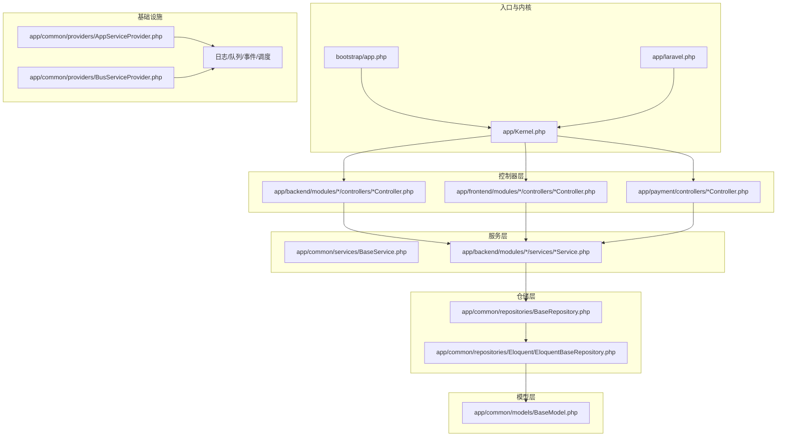
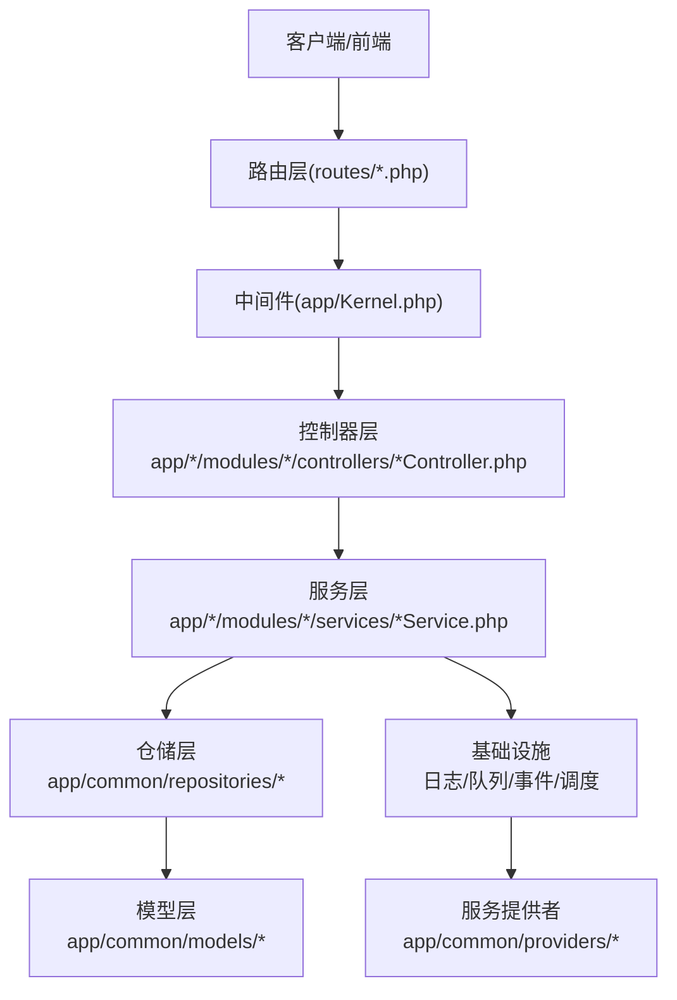
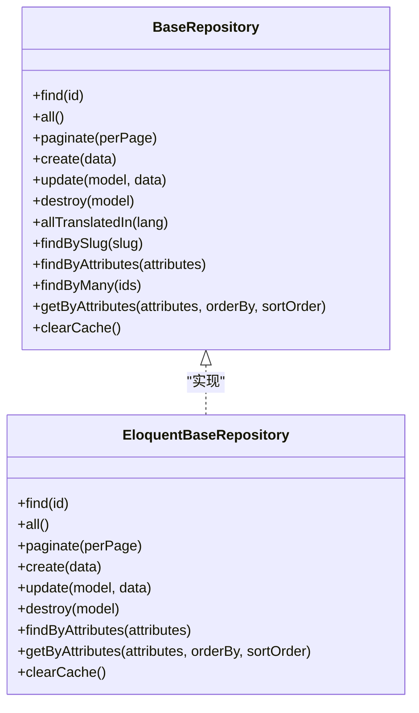
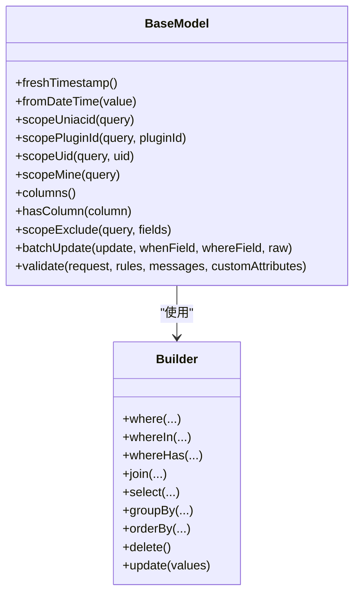
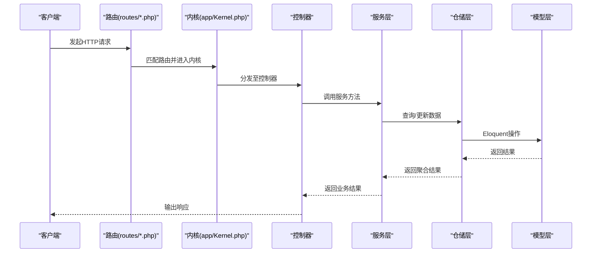
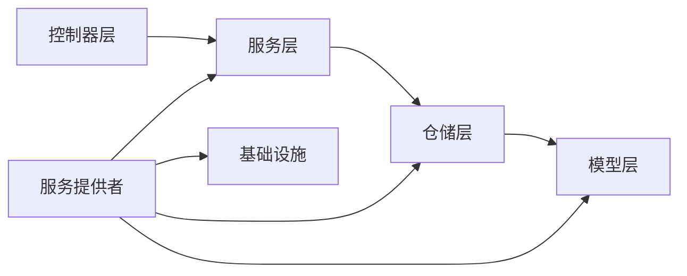

# 分层架构详解

<cite>
**本文引用的文件**
- [app/Kernel.php](file://app/Kernel.php)
- [bootstrap/app.php](file://bootstrap/app.php)
- [app/common/providers/AppServiceProvider.php](file://app/common/providers/AppServiceProvider.php)
- [app/common/providers/BusServiceProvider.php](file://app/common/providers/BusServiceProvider.php)
- [app/common/repositories/BaseRepository.php](file://app/common/repositories/BaseRepository.php)
- [app/common/models/BaseModel.php](file://app/common/models/BaseModel.php)
- [app/common/services/BaseService.php](file://app/common/services/BaseService.php)
- [app/backend/modules/goods/services/GoodsService.php](file://app/backend/modules/goods/services/GoodsService.php)
- [app/backend/modules/goods/controllers/GoodsController.php](file://app/backend/modules/goods/controllers/GoodsController.php)
- [app/common/repositories/Eloquent/EloquentBaseRepository.php](file://app/common/repositories/Eloquent/EloquentBaseRepository.php)
- [app/framework/Database/Eloquent/Builder.php](file://app/framework/Database/Eloquent/Builder.php)
- [app/framework/Bus/Dispatcher.php](file://app/framework/Bus/Dispatcher.php)
- [app/common/exceptions/Handler.php](file://app/common/exceptions/Handler.php)
- [routes/web.php](file://routes/web.php)
- [routes/api.php](file://routes/api.php)
- [app/laravel.php](file://app/laravel.php)
</cite>

## 目录
1. [引言](#引言)
2. [项目结构](#项目结构)
3. [核心组件](#核心组件)
4. [架构总览](#架构总览)
5. [详细组件分析](#详细组件分析)
6. [依赖分析](#依赖分析)
7. [性能考虑](#性能考虑)
8. [故障排查指南](#故障排查指南)
9. [结论](#结论)
10. [附录](#附录)

## 引言
本文件面向芸众商城的分层架构，系统性阐述MVC模式在项目中的落地方式：Controller层的职责边界、Service层的业务逻辑封装、Repository层的数据访问抽象、Model层的设计理念与ORM使用规范，以及Infrastructure层（日志、调度、队列、事件等）的基础设施支持。文档同时说明各层之间的依赖关系与通信机制（依赖注入、接口设计、异常处理），并给出最佳实践与插件化/模块化的实现建议。

## 项目结构
芸众商城基于Laravel框架进行二次开发，采用“多模块+多应用域”的组织方式：
- 入口与内核：通过入口脚本加载应用容器，并绑定HTTP内核、控制台内核、异常处理器等。
- 控制器层：位于各业务模块目录下，负责请求接入、参数校验、调用服务层并返回响应。
- 服务层：封装业务规则与流程编排，保证跨模块可复用与测试友好。
- 仓储层：抽象数据访问，屏蔽底层ORM细节，便于替换与扩展。
- 模型层：基于Eloquent扩展，统一时间戳、作用域、字段缓存、金额格式化等。
- 基础设施层：日志、队列、事件、调度、支付对接等支撑能力。
- 提供者与绑定：通过服务提供者注册单例与别名，实现依赖注入与解耦。

图表来源
- [bootstrap/app.php:14-48](file://bootstrap/app.php#L14-L48)
- [app/Kernel.php:19-76](file://app/Kernel.php#L19-L76)
- [app/laravel.php:45-50](file://app/laravel.php#L45-L50)
- [app/common/repositories/BaseRepository.php:9-94](file://app/common/repositories/BaseRepository.php#L9-L94)
- [app/common/repositories/Eloquent/EloquentBaseRepository.php](file://app/common/repositories/Eloquent/EloquentBaseRepository.php)
- [app/common/models/BaseModel.php:59-506](file://app/common/models/BaseModel.php#L59-L506)
- [app/common/providers/AppServiceProvider.php:112-127](file://app/common/providers/AppServiceProvider.php#L112-L127)
- [app/common/providers/BusServiceProvider.php:14-28](file://app/common/providers/BusServiceProvider.php#L14-L28)

章节来源
- [bootstrap/app.php:14-48](file://bootstrap/app.php#L14-L48)
- [app/Kernel.php:19-76](file://app/Kernel.php#L19-L76)
- [app/laravel.php:45-50](file://app/laravel.php#L45-L50)

## 核心组件
- 应用容器与内核
  - 容器在引导阶段绑定HTTP内核、控制台内核、异常处理器、请求类型别名等，确保请求生命周期与异常处理的一致性。
  - 内核定义中间件组与路由中间件，为不同域（web/admin/api/business）提供差异化安全与会话策略。
- 服务提供者
  - AppServiceProvider负责注册单例服务（站点配置、选项、日志、验证码等），并监听SQL语句准备事件以统一结果集格式。
  - BusServiceProvider重写Bus调度器绑定，确保任务派发与队列连接一致。
- 仓储接口与实现
  - BaseRepository定义通用CRUD与查询契约；EloquentBaseRepository实现具体ORM操作，屏蔽复杂查询细节。
- 模型基类
  - BaseModel扩展Eloquent，统一时间戳、作用域（uniacid、pluginId、mine等）、字段缓存、金额格式化、验证器集成与模型扩展机制。
- 服务基类
  - BaseService作为业务层抽象基类，承载事务、权限、日志、异常包装等横切关注点，便于子类专注业务编排。

章节来源
- [bootstrap/app.php:37-48](file://bootstrap/app.php#L37-L48)
- [app/Kernel.php:66-76](file://app/Kernel.php#L66-L76)
- [app/common/providers/AppServiceProvider.php:112-127](file://app/common/providers/AppServiceProvider.php#L112-L127)
- [app/common/providers/BusServiceProvider.php:14-28](file://app/common/providers/BusServiceProvider.php#L14-L28)
- [app/common/repositories/BaseRepository.php:9-94](file://app/common/repositories/BaseRepository.php#L9-L94)
- [app/common/repositories/Eloquent/EloquentBaseRepository.php](file://app/common/repositories/Eloquent/EloquentBaseRepository.php)
- [app/common/models/BaseModel.php:59-506](file://app/common/models/BaseModel.php#L59-L506)
- [app/common/services/BaseService.php](file://app/common/services/BaseService.php)

## 架构总览
芸众商城采用“控制器-服务-仓储-模型”四层架构，结合Laravel的服务提供者与依赖注入机制，形成清晰的职责边界与可扩展的模块化体系。控制器仅负责请求接入与响应输出；服务层封装业务规则；仓储层抽象数据访问；模型层承载实体与领域行为。基础设施通过服务提供者集中管理，确保日志、队列、事件、调度等能力的一致性与可替换性。

图表来源
- [routes/web.php](file://routes/web.php)
- [routes/api.php](file://routes/api.php)
- [app/Kernel.php:19-76](file://app/Kernel.php#L19-L76)
- [app/backend/modules/goods/controllers/GoodsController.php](file://app/backend/modules/goods/controllers/GoodsController.php)
- [app/backend/modules/goods/services/GoodsService.php](file://app/backend/modules/goods/services/GoodsService.php)
- [app/common/repositories/BaseRepository.php:9-94](file://app/common/repositories/BaseRepository.php#L9-L94)
- [app/common/models/BaseModel.php:59-506](file://app/common/models/BaseModel.php#L59-L506)
- [app/common/providers/AppServiceProvider.php:112-127](file://app/common/providers/AppServiceProvider.php#L112-L127)

## 详细组件分析

### 控制器层（Controller）
- 职责边界
  - 接收请求、参数校验、调用服务层执行业务、组装响应。
  - 不直接操作数据库或外部服务，避免“上帝对象”。
- 实现要点
  - 在控制器中通过依赖注入获取服务实例，保持构造函数注入或方法注入，便于单元测试。
  - 对外暴露REST风格接口，内部通过服务层编排业务流程。
- 示例参考
  - 商品模块控制器位于后端模块目录，遵循统一命名与目录结构。

章节来源
- [app/backend/modules/goods/controllers/GoodsController.php](file://app/backend/modules/goods/controllers/GoodsController.php)

### 服务层（Service）
- 职责边界
  - 封装业务规则、事务控制、权限校验、异常处理与日志记录。
  - 可组合多个仓储与工具服务，保证跨模块复用。
- 实现要点
  - 基类提供统一的事务入口、异常包装与日志埋点，子类聚焦业务编排。
  - 通过接口与依赖注入实现松耦合，便于替换与扩展。
- 示例参考
  - 商品模块服务位于后端模块目录，体现业务编排与跨仓储协作。

章节来源
- [app/common/services/BaseService.php](file://app/common/services/BaseService.php)
- [app/backend/modules/goods/services/GoodsService.php](file://app/backend/modules/goods/services/GoodsService.php)

### 仓储层（Repository）
- 职责边界
  - 抽象数据访问，屏蔽ORM差异，提供统一查询与变更接口。
  - 支持分页、批量更新、缓存清理等通用能力。
- 接口与实现
  - BaseRepository定义标准契约，EloquentBaseRepository实现具体ORM操作，支持链式查询、作用域与缓存策略。
- 设计优势
  - 降低上层对具体ORM的依赖，便于迁移与性能优化。
  - 通过接口隔离，可在测试中注入Mock仓储。

图表来源
- [app/common/repositories/BaseRepository.php:9-94](file://app/common/repositories/BaseRepository.php#L9-L94)
- [app/common/repositories/Eloquent/EloquentBaseRepository.php](file://app/common/repositories/Eloquent/EloquentBaseRepository.php)

章节来源
- [app/common/repositories/BaseRepository.php:9-94](file://app/common/repositories/BaseRepository.php#L9-L94)
- [app/common/repositories/Eloquent/EloquentBaseRepository.php](file://app/common/repositories/Eloquent/EloquentBaseRepository.php)

### 模型层（Model）
- 设计理念
  - BaseModel继承Eloquent，统一时间戳格式、作用域（uniacid、pluginId、mine等）、字段元信息缓存、金额格式化与验证器集成。
  - 支持模型扩展机制，允许插件动态注入关系与方法，增强可插拔能力。
- ORM使用规范
  - 使用自定义Builder与查询构造器，避免直接拼接SQL。
  - 批量更新采用case when组织，减少多次往返与锁竞争。
- 复杂度与性能
  - 字段缓存与作用域预置降低重复查询成本；金额格式化在保存前统一处理，避免展示层重复计算。

图表来源
- [app/common/models/BaseModel.php:59-506](file://app/common/models/BaseModel.php#L59-L506)
- [app/framework/Database/Eloquent/Builder.php](file://app/framework/Database/Eloquent/Builder.php)

章节来源
- [app/common/models/BaseModel.php:59-506](file://app/common/models/BaseModel.php#L59-L506)
- [app/framework/Database/Eloquent/Builder.php](file://app/framework/Database/Eloquent/Builder.php)

### 基础设施层（Infrastructure）
- 日志与监控
  - 通过服务提供者注册多种日志别名（trace/debug/error），统一日志输出与级别管理。
- 队列与任务
  - 通过BusServiceProvider重写调度器绑定，确保任务派发与队列连接一致。
- 事件与调度
  - 监听SQL语句准备事件，统一fetch模式；注册模板扩展与过滤钩子，便于主题与插件扩展。
- 异常处理
  - 绑定全局异常处理器，集中处理未捕获异常与业务异常，保障响应一致性。

章节来源
- [app/common/providers/AppServiceProvider.php:112-127](file://app/common/providers/AppServiceProvider.php#L112-L127)
- [app/common/providers/BusServiceProvider.php:14-28](file://app/common/providers/BusServiceProvider.php#L14-L28)
- [app/common/exceptions/Handler.php](file://app/common/exceptions/Handler.php)

### 依赖注入与通信机制
- 容器绑定
  - 在引导阶段绑定内核、异常处理器、请求类型别名与日志别名，确保运行期解析一致。
- 中间件与路由
  - 内核定义中间件组与路由中间件，按域启用不同安全策略与会话管理。
- 服务提供者
  - 注册单例与别名，实现跨模块共享与解耦；通过监听器统一处理底层事件。
- 通信流程
  - 请求经路由与中间件进入控制器，控制器调用服务层，服务层通过仓储访问模型，最终返回响应。

图表来源
- [routes/web.php](file://routes/web.php)
- [routes/api.php](file://routes/api.php)
- [app/Kernel.php:19-76](file://app/Kernel.php#L19-L76)
- [app/backend/modules/goods/controllers/GoodsController.php](file://app/backend/modules/goods/controllers/GoodsController.php)
- [app/backend/modules/goods/services/GoodsService.php](file://app/backend/modules/goods/services/GoodsService.php)
- [app/common/repositories/BaseRepository.php:9-94](file://app/common/repositories/BaseRepository.php#L9-L94)
- [app/common/models/BaseModel.php:59-506](file://app/common/models/BaseModel.php#L59-L506)

## 依赖分析
- 层间依赖
  - 控制器依赖服务层接口；服务层依赖仓储接口；仓储层依赖模型层；基础设施通过服务提供者被容器统一管理。
- 耦合与内聚
  - 通过接口隔离与依赖注入降低耦合；服务层与仓储层内聚业务与数据访问逻辑。
- 循环依赖
  - 未见明显循环依赖迹象；若出现，应通过接口与工厂重构解决。
- 外部依赖
  - 依赖Laravel框架提供的容器、事件、队列、日志等；通过服务提供者统一适配。

图表来源
- [app/common/providers/AppServiceProvider.php:112-127](file://app/common/providers/AppServiceProvider.php#L112-L127)
- [app/common/providers/BusServiceProvider.php:14-28](file://app/common/providers/BusServiceProvider.php#L14-L28)
- [app/common/repositories/BaseRepository.php:9-94](file://app/common/repositories/BaseRepository.php#L9-L94)
- [app/common/models/BaseModel.php:59-506](file://app/common/models/BaseModel.php#L59-L506)

## 性能考虑
- 查询优化
  - 使用模型字段缓存与作用域预置，减少重复查询；合理使用索引与分页。
- 批量操作
  - 采用批量更新与批量插入，减少往返次数；避免N+1查询。
- 缓存策略
  - 仓储层提供缓存清理接口，结合业务热点数据进行缓存；注意缓存失效策略。
- 日志与监控
  - 统一日志级别与输出格式，避免高频日志影响性能；对慢查询与异常进行告警。

## 故障排查指南
- 异常处理
  - 全局异常处理器集中处理未捕获异常与业务异常，确保响应一致性与可观测性。
- 日志定位
  - 通过不同日志别名（trace/debug/error）快速定位问题；结合SQL监听器查看执行计划。
- 中间件检查
  - 确认中间件组与路由中间件配置正确，避免会话与认证相关问题导致的请求失败。
- 依赖注入
  - 检查服务提供者是否正确注册单例与别名；确认容器解析顺序与优先级。

章节来源
- [app/common/exceptions/Handler.php](file://app/common/exceptions/Handler.php)
- [app/common/providers/AppServiceProvider.php:112-127](file://app/common/providers/AppServiceProvider.php#L112-L127)
- [app/Kernel.php:19-76](file://app/Kernel.php#L19-L76)

## 结论
芸众商城通过清晰的分层架构与Laravel服务提供者机制，实现了控制器-服务-仓储-模型的职责分离与依赖注入解耦。模型层统一ORM行为，仓储层抽象数据访问，服务层封装业务规则，基础设施层提供日志、队列、事件等支撑能力。该架构既满足当前业务需求，又为插件化与模块化扩展提供了良好基础。

## 附录
- 最佳实践
  - 控制器只做薄层，业务全部下沉至服务层；服务层通过接口与依赖注入实现可测试性。
  - 仓储层严格实现BaseRepository契约，避免上层感知ORM差异；必要时引入缓存与索引优化。
  - 模型层统一时间戳、作用域与金额格式化，减少重复逻辑；利用扩展机制支持插件化。
  - 基础设施通过服务提供者集中管理，确保日志、队列、事件、调度的一致性与可替换性。
- 插件化与模块化
  - 利用模型扩展机制与服务提供者注册，实现插件对核心系统的无侵入扩展。
  - 通过模块目录划分与路由分组，实现功能域隔离与独立演进。