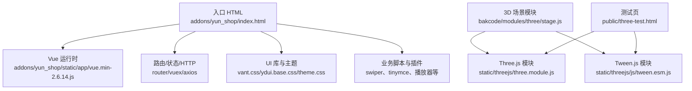
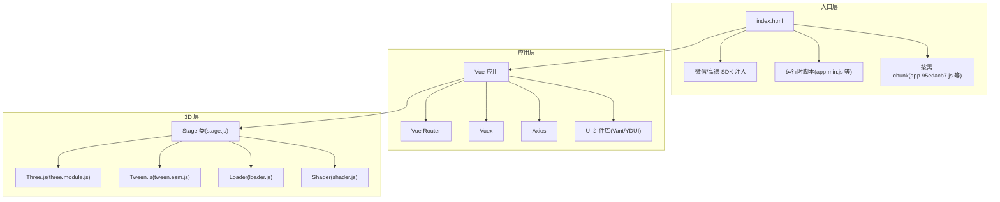
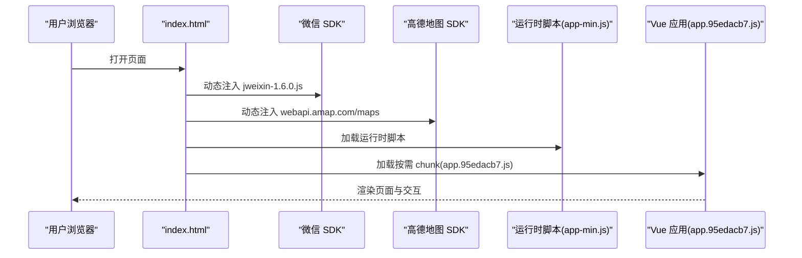
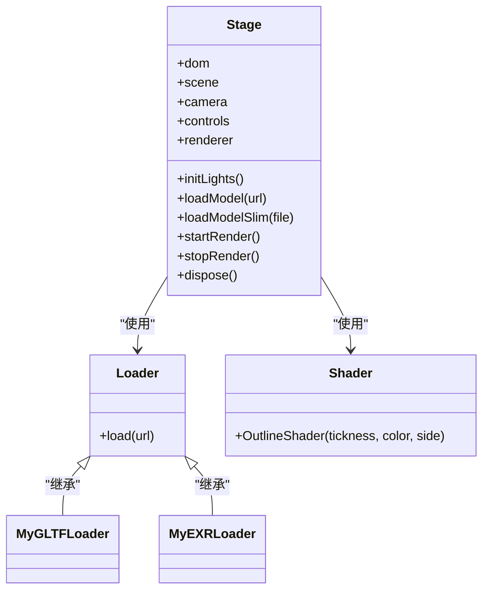
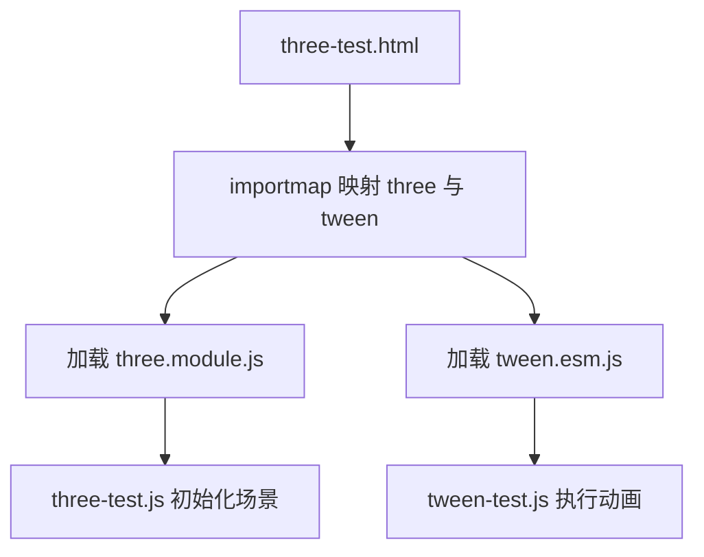
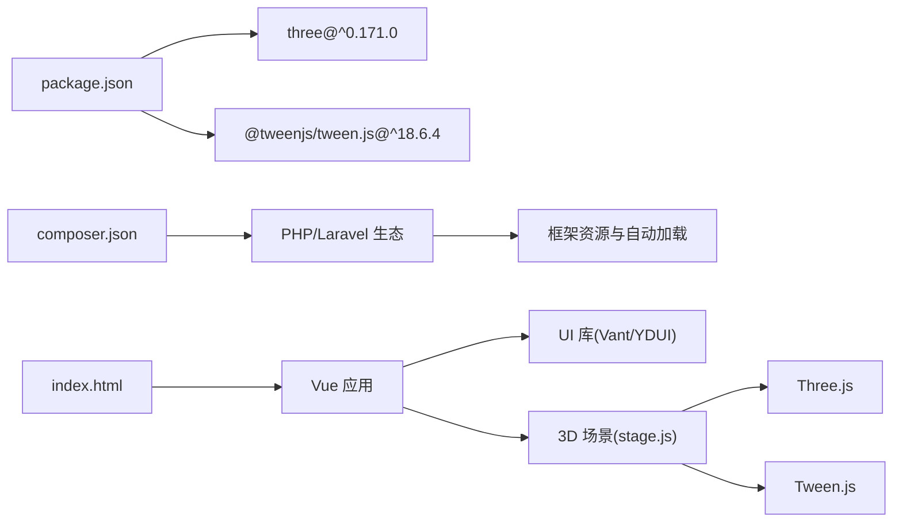

# 前端架构

<cite>
**本文引用的文件**
- [package.json](file://package.json)
- [composer.json](file://composer.json)
- [addons\yun_shop\index.html](file://addons/yun_shop/index.html)
- [addons\yun_shop\shopConfig.js](file://addons/yun_shop/shopConfig.js)
- [public\three-test.html](file://public/three-test.html)
- [bakcode\modules\three\stage.js](file://bakcode/modules/three/stage.js)
- [bakcode\modules\three\loader.js](file://bakcode/modules/three/loader.js)
- [bakcode\modules\three\shader.js](file://bakcode/modules/three/shader.js)
- [bakcode\threeStage.blade.php](file://bakcode/threeStage.blade.php)
- [addons\yun_shop\static\app\vue.min-2.6.14.js](file://addons/yun_shop/static/app/vue.min-2.6.14.js)
- [addons\yun_shop\static\app\vue-router.min.js](file://addons/yun_shop/static/app/vue-router.min.js)
- [addons\yun_shop\static\app\vuex.min.js](file://addons/yun_shop/static/app/vuex.min.js)
- [addons\yun_shop\static\app\axios.min.js](file://addons/yun_shop/static/app/axios.min.js)
- [addons\yun_shop\static\app\swiper.min.js](file://addons/yun_shop/static/app/swiper.min.js)
- [addons\yun_shop\static\app\ydui.base.css](file://addons/yun_shop/static/app/ydui.base.css)
- [addons\yun_shop\static\app\theme\theme.css](file://addons/yun_shop/static/app/theme/theme.css)
- [addons\yun_shop\static\app\vanilla-extract.css](file://addons/yun_shop/static/app/vant.css)
- [addons\yun_shop\static\framework\css\app.3e296749.css](file://addons/yun_shop/static/framework/css/app.3e296749.css)
- [addons\yun_shop\static\framework\css\chunk-008a.d4b61199.css](file://addons/yun_shop/static/framework/css/chunk-008a.d4b61199.css)
- [addons\yun_shop\static\app\mint-ui.css](file://addons/yun_shop/static/app/mint-ui.css)
- [addons\yun_shop\static\app\tinymce4.7.5\skins\lightgray\skin.min.css](file://addons/yun_shop/static/app/tinymce4.7.5/skins/lightgray/skin.min.css)
- [addons\yun_shop\static\app\tinymce4.7.5\plugins\codesample\css\prism.css](file://addons/yun_shop/static/app/tinymce4.7.5/plugins/codesample/css/prism.css)
- [addons\yun_shop\static\app\ydui.base.css](file://addons/yun_shop/static/app/ydui.base.css)
- [addons\yun_shop\static\app\ydui.px.css](file://addons/yun_shop/static/app/ydui.px.css)
- [addons\yun_shop\static\app\swiper.min.css](file://addons/yun_shop/static/app/swiper.min.css)
- [addons\yun_shop\static\app\tinymce4.7.5\skins\lightgray\content.min.css](file://addons/yun_shop/static/app/tinymce4.7.5/skins/lightgray/content.min.css)
- [addons\yun_shop\static\app\tinymce4.7.5\plugins\visualblocks\css\visualblocks.css](file://addons/yun_shop/static/app/tinymce4.7.5/plugins/visualblocks/css/visualblocks.css)
- [addons\yun_shop\static\app\tinymce4.7.5\plugins\powerpaste\css\editorcss.css](file://addons/yun_shop/static/app/tinymce4.7.5/plugins/powerpaste/css/editorcss.css)
- [addons\yun_shop\static\app\tinymce4.7.5\skins\lightgray\content.inline.min.css](file://addons/yun_shop/static/app/tinymce4.7.5/skins/lightgray/content.inline.min.css)
- [addons\yun_shop\static\app\TcPlayer-2.3.2.js](file://addons/yun_shop/static/app/TcPlayer-2.3.2.js)
- [addons\yun_shop\static\app\TcPlayer-2.4.1.js](file://addons/yun_shop/static/app/TcPlayer-2.4.1.js)
- [addons\yun_shop\static\app\YdbOnline.js](file://addons/yun_shop/static/app/YdbOnline.js)
- [addons\yun_shop\static\app\decode_common.js](file://addons/yun_shop/static/app/decode_common.js)
- [addons\yun_shop\static\app\decode_common\md5.js](file://addons/yun_shop/static/app/decode_common/md5.js)
- [addons\yun_shop\static\app\decode_common\aes.js](file://addons/yun_shop/static/app/decode_common/aes.js)
- [addons\yun_shop\static\app\decode_common\core.js](file://addons/yun_shop/static/app/decode_common/core.js)
- [addons\yun_shop\static\app\decode_common\cipher-core.js](file://addons/yun_shop/static/app/decode_common/cipher-core.js)
- [addons\yun_shop\static\app\decode_common\enc-base64.js](file://addons/yun_shop/static/app/decode_common/enc-base64.js)
- [addons\yun_shop\static\app\decode_common\locales\index.js](file://addons/yun_shop/static/app/decode_common/locales/index.js)
- [addons\yun_shop\static\app\decode_common\city.js](file://addons/yun_shop/static/app/decode_common/city.js)
- [addons\yun_shop\static\app\fixifmheight.js](file://addons/yun_shop/static/app/fixifmheight.js)
- [addons\yun_shop\static\app\flutter-hearts-zmt.js](file://addons/yun_shop/static/app/flutter-hearts-zmt.js)
- [addons\yun_shop\static\app\gov_province_city_area_id.js](file://addons/yun_shop/static/app/gov_province_city_area_id.js)
- [addons\yun_shop\static\app\wxLogin.js](file://addons/yun_shop/static/app/wxLogin.js)
- [addons\yun_shop\static\app\apps.js](file://addons/yun_shop/static/app/apps.js)
- [addons\yun_shop\static\app\recorder-core.js](file://addons/yun_shop/static/app/recorder-core.js)
- [addons\yun_shop\static\app\translate.js](file://addons/yun_shop/static/app/translate.js)
- [addons\yun_shop\static\app\js\chunk-vantUI.fab0b84a.js](file://addons/yun_shop/static/app/js/chunk-vantUI.fab0b84a.js)
- [addons\yun_shop\static\app\js\chunk-libs.538ad865.js](file://addons/yun_shop/static/app/js/chunk-libs.538ad865.js)
- [addons\yun_shop\static\app\js\styles.44f8736a.js](file://addons/yun_shop/static/app/js/styles.44f8736a.js)
- [addons\yun_shop\static\app\js\app.95edacb7.js](file://addons/yun_shop/static/app/js/app.95edacb7.js)
- [static\threejs\js\three-test.js](file://static/threejs/js/three-test.js)
- [static\threejs\js\tween-test.js](file://static/threejs/js/tween-test.js)
- [static\threejs\js\tween.esm.js](file://static/threejs/js/tween.esm.js)
- [static\threejs\three.module.js](file://static/threejs/three.module.js)
</cite>

## 目录
1. [简介](#简介)
2. [项目结构](#项目结构)
3. [核心组件](#核心组件)
4. [架构总览](#架构总览)
5. [详细组件分析](#详细组件分析)
6. [依赖关系分析](#依赖关系分析)
7. [性能考虑](#性能考虑)
8. [故障排查指南](#故障排查指南)
9. [结论](#结论)
10. [附录](#附录)

## 简介
本文件面向芸众商城前端架构，系统化梳理其前端技术栈与工程化实践，重点覆盖以下方面：
- 构建工具与打包策略：基于 Laravel Mix 的资源编译与分包策略
- 核心框架与库：Vue 2.6、Vue Router、Vuex、Axios、Swiper、Vant/YDUI 等
- 3D 可视化技术栈：Three.js 0.171.0 与 Tween.js 18.6.4 的集成与优化
- 静态资源管理：CSS、JS、图片、字体的组织与压缩策略
- 微擎前端约定与兼容性：移动端 viewport、字体缩放、第三方 SDK 注入与环境判断
- 组件化开发：Vue 组件、UI 库集成、响应式设计
- 性能优化：代码分割、懒加载、缓存策略
- 多端适配：viewport、rem 适配、设备像素比与 WebRTC/JSBridge 兼容

## 项目结构
前端资源主要分布在以下目录：
- addons/yun_shop：小程序/移动端 H5 的入口页面与静态资源（HTML、JS、CSS）
- public：测试页面与静态资源（含 Three.js 测试页）
- bakcode：3D 场景与工具模块（stage.js、loader.js、shader.js、threeStage.blade.php）
- static：通用静态资源（CSS、JS、字体、图片、Three.js 模块）

图表来源
- [addons\yun_shop\index.html:1-159](file://addons/yun_shop/index.html#L1-L159)
- [bakcode\modules\three\stage.js:1-120](file://bakcode/modules/three/stage.js#L1-L120)
- [public\three-test.html:1-57](file://public/three-test.html#L1-L57)

章节来源
- [addons\yun_shop\index.html:1-159](file://addons/yun_shop/index.html#L1-L159)
- [public\three-test.html:1-57](file://public/three-test.html#L1-L57)

## 核心组件
- Vue 生态：Vue 2.6、Vue Router、Vuex、Axios
- UI 组件库：Vant、YDUI、Element UI（由框架资源提供）
- 资源加载：Webpack Chunk 动态加载、按需引入
- 3D 场景：Stage 类封装 Three.js 场景初始化、光照、控件、渲染循环与模型加载
- 工具模块：Loader 封装 Three.js 加载器；Shader 定义描边着色器；Event 事件处理

章节来源
- [addons\yun_shop\index.html:55-159](file://addons/yun_shop/index.html#L55-L159)
- [bakcode\modules\three\stage.js:69-172](file://bakcode/modules/three/stage.js#L69-L172)
- [bakcode\modules\three\loader.js:1-48](file://bakcode/modules/three/loader.js#L1-L48)
- [bakcode\modules\three\shader.js:1-23](file://bakcode/modules/three/shader.js#L1-L23)

## 架构总览
整体前端采用“入口 HTML + Vue 应用 + 3D 场景模块”的分层架构。入口 HTML 负责注入第三方 SDK、注入高德地图与微信 SDK、注入运行时脚本与按需 chunk，并通过 Vue 初始化应用。3D 场景模块以 Stage 类为核心，负责 Three.js 场景生命周期管理、模型加载与材质贴图配置。

图表来源
- [addons\yun_shop\index.html:1-159](file://addons/yun_shop/index.html#L1-L159)
- [addons\yun_shop\static\app\js\app.95edacb7.js](file://addons/yun_shop/static/app/js/app.95edacb7.js)
- [bakcode\modules\three\stage.js:69-172](file://bakcode/modules/three/stage.js#L69-L172)
- [static\threejs\three.module.js](file://static/threejs/three.module.js)
- [static\threejs\js\tween.esm.js](file://static/threejs/js/tween.esm.js)

## 详细组件分析

### Vue 应用与运行时
- 入口 HTML 中动态注入运行时脚本与按需 chunk，支持企业微信、抖音、国电等 JSBridge 与 WebView 环境识别
- 使用 Vue 2.6、Vue Router、Vuex、Axios，结合 UI 库（Vant、YDUI）进行页面布局与交互
- 通过 shopConfig.js 注入高德地图密钥与安全配置

图表来源
- [addons\yun_shop\index.html:95-122](file://addons/yun_shop/index.html#L95-L122)
- [addons\yun_shop\index.html:67-71](file://addons/yun_shop/index.html#L67-L71)
- [addons\yun_shop\index.html:1-159](file://addons/yun_shop/index.html#L1-L159)
- [addons\yun_shop\static\app\js\app.95edacb7.js](file://addons/yun_shop/static/app/js/app.95edacb7.js)

章节来源
- [addons\yun_shop\index.html:1-159](file://addons/yun_shop/index.html#L1-L159)
- [addons\yun_shop\shopConfig.js:1-1](file://addons/yun_shop/shopConfig.js#L1-L1)

### 3D 场景模块（Stage 类）
- 场景初始化：相机、渲染器、阴影、抗锯齿、MSAA、色调映射、输出色彩空间
- 控制器：OrbitControls，限制远近距离，监听变更事件
- 模型加载：GLTFLoader，遍历模型节点设置材质、阴影、渲染顺序与贴图参数
- 导出与简化：GLTFExporter、DRACOExporter、SimplifyModifier
- 事件与辅助：Event 事件处理、Stats 性能监控、Box3 包围盒计算

图表来源
- [bakcode\modules\three\stage.js:69-172](file://bakcode/modules/three/stage.js#L69-L172)
- [bakcode\modules\three\loader.js:1-48](file://bakcode/modules/three/loader.js#L1-L48)
- [bakcode\modules\three\shader.js:1-23](file://bakcode/modules/three/shader.js#L1-L23)

章节来源
- [bakcode\modules\three\stage.js:1-800](file://bakcode/modules/three/stage.js#L1-L800)
- [bakcode\modules\three\loader.js:1-48](file://bakcode/modules/three/loader.js#L1-L48)
- [bakcode\modules\three\shader.js:1-23](file://bakcode/modules/three/shader.js#L1-L23)

### Three.js 与 Tween.js 本地导入测试
- 通过 importmap 映射 three 与 @tweenjs/tween.js 到本地模块路径
- three-test.html 同时加载 three-test.js 与 tween-test.js，验证 Three.js 与 Tween.js 的本地导入

图表来源
- [public\three-test.html:43-54](file://public/three-test.html#L43-L54)
- [static\threejs\three.module.js](file://static/threejs/three.module.js)
- [static\threejs\js\tween.esm.js](file://static/threejs/js/tween.esm.js)
- [static\threejs\js\three-test.js](file://static/threejs/js/three-test.js)
- [static\threejs\js\tween-test.js](file://static/threejs/js/tween-test.js)

章节来源
- [public\three-test.html:1-57](file://public/three-test.html#L1-L57)

### 微擎前端约定与兼容性
- viewport 与 rem 适配：根据设备宽度动态设置根元素字号，兼顾 Android 与 iOS
- 第三方 SDK 注入：根据 UA 注入微信 SDK、高德地图 SDK、JSBridge 与 Windvane
- 登录数据清理：清理 localStorage 中的登录相关字段，避免跨域或跨环境污染
- 企业微信/移动端/抖音环境识别：动态加载不同版本的微信 SDK 与特定桥接库

章节来源
- [addons\yun_shop\index.html:1-159](file://addons/yun_shop/index.html#L1-L159)

### 静态资源组织与压缩
- CSS：UI 库（Vant、YDUI）、主题（theme.css）、第三方编辑器皮肤（TinyMCE）等
- JS：Vue、Router、Vuex、Axios、Swiper、播放器、工具库（CryptoJS、MD5/AES 等）
- 图片与字体：统一放置在 static/images 与 static/fonts
- 按需 chunk：通过 webpack chunk 动态加载，减少首屏体积

章节来源
- [addons\yun_shop\static\app\vanilla-extract.css](file://addons/yun_shop/static/app/vant.css)
- [addons\yun_shop\static\app\ydui.base.css](file://addons/yun_shop/static/app/ydui.base.css)
- [addons\yun_shop\static\app\theme\theme.css](file://addons/yun_shop/static/app/theme/theme.css)
- [addons\yun_shop\static\app\swiper.min.css](file://addons/yun_shop/static/app/swiper.min.css)
- [addons\yun_shop\static\app\tinymce4.7.5\skins\lightgray\skin.min.css](file://addons/yun_shop/static/app/tinymce4.7.5/skins/lightgray/skin.min.css)
- [addons\yun_shop\static\app\js\chunk-vantUI.fab0b84a.js](file://addons/yun_shop/static/app/js/chunk-vantUI.fab0b84a.js)
- [addons\yun_shop\static\app\js\chunk-libs.538ad865.js](file://addons/yun_shop/static/app/js/chunk-libs.538ad865.js)
- [addons\yun_shop\static\app\js\styles.44f8736a.js](file://addons/yun_shop/static/app/js/styles.44f8736a.js)
- [addons\yun_shop\static\app\js\app.95edacb7.js](file://addons/yun_shop/static/app/js/app.95edacb7.js)

## 依赖关系分析
- package.json：声明 Three.js 与 Tween.js 版本
- composer.json：后端依赖与自动加载配置
- 前端依赖：Vue 生态、UI 库、工具库、3D 模块

图表来源
- [package.json:1-10](file://package.json#L1-L10)
- [composer.json:1-186](file://composer.json#L1-L186)
- [addons\yun_shop\index.html:1-159](file://addons/yun_shop/index.html#L1-L159)
- [bakcode\modules\three\stage.js:1-120](file://bakcode/modules/three/stage.js#L1-L120)

章节来源
- [package.json:1-10](file://package.json#L1-L10)
- [composer.json:1-186](file://composer.json#L1-L186)

## 性能考虑
- 代码分割：按需加载 chunk，降低首屏 JS 体积
- 懒加载：3D 场景与 UI 组件按需引入
- 渲染优化：Three.js 启用抗锯齿、阴影、MSAA；合理设置渲染器像素比；使用 physicallyCorrectLights 与 toneMapping
- 资源压缩：CSS/JS 压缩与合并，按需引入 UI 库样式
- 缓存策略：静态资源采用 CDN 与长缓存，版本化命名

## 故障排查指南
- 3D 场景无法渲染：检查 Three.js 模块是否正确加载、importmap 是否指向本地模块
- 模型加载失败：确认 GLTFLoader 加载回调与错误处理逻辑，检查模型路径与服务器跨域
- 性能异常：开启 Stats 监控，检查渲染帧率与内存占用；调整阴影贴图分辨率与抗锯齿等级
- 移动端适配问题：核对 viewport 设置与 rem 计算逻辑，确保在不同设备像素比下的清晰度

章节来源
- [bakcode\modules\three\stage.js:141-154](file://bakcode/modules/three/stage.js#L141-L154)
- [bakcode\modules\three\stage.js:455-475](file://bakcode/modules/three/stage.js#L455-L475)
- [public\three-test.html:43-54](file://public/three-test.html#L43-L54)

## 结论
芸众商城前端采用 Vue 2 + Laravel Mix 的混合架构，结合 Three.js 与 Tween.js 实现 3D 场景与动画效果。通过按需加载、资源压缩与多端适配策略，兼顾了性能与兼容性。建议后续持续优化：
- 引入现代构建工具（如 Vite）以提升开发体验与构建效率
- 逐步迁移至 Vue 3，获得更好的 Tree Shaking 与 Composition API
- 在 3D 场景中引入更精细的 LOD 与批处理策略，进一步降低渲染压力
- 增强自动化测试与性能监控体系，保障多端一致性

## 附录
- 关键文件清单与用途概览
  - addons/yun_shop/index.html：入口页面与第三方 SDK 注入
  - bakcode/modules/three/stage.js：3D 场景主控制器
  - bakcode/modules/three/loader.js：Three.js 加载器封装
  - bakcode/modules/three/shader.js：自定义着色器
  - public/three-test.html：Three.js 与 Tween.js 本地导入测试页
  - addons/yun_shop/static/app/js/*.js：按需 chunk 与运行时脚本
  - static/threejs/*：Three.js 与 Tween.js 本地模块