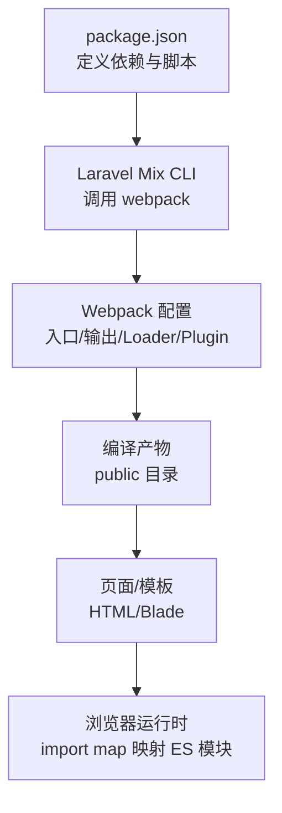
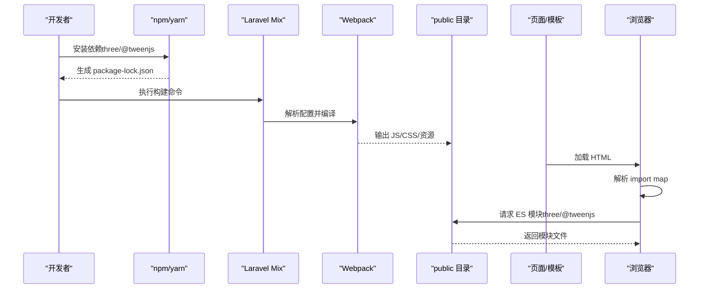
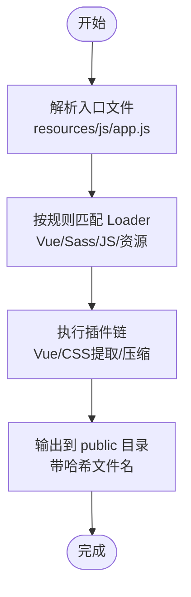
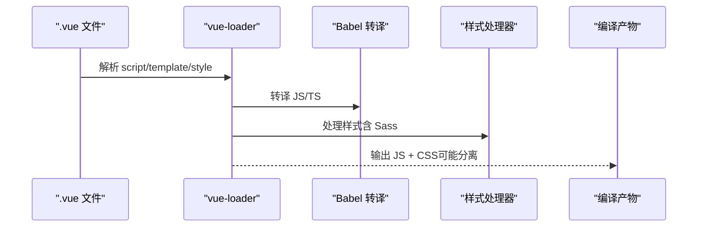
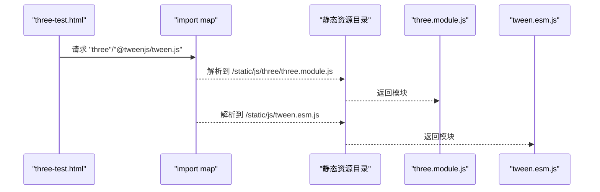
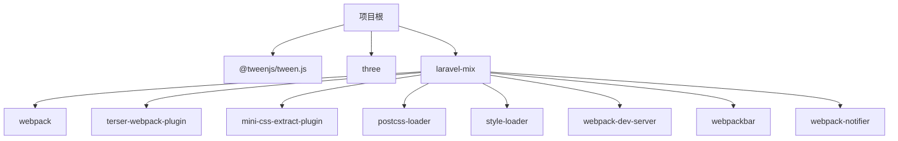

# 构建工具与打包配置

<cite>
**本文引用的文件**
- [package.json](file://package.json)
- [package-lock.json](file://package-lock.json)
- [three-test.html](file://public/three-test.html)
- [threeStage.blade.php](file://bakcode/threeStage.blade.php)
- [laravel-mix vue-stubs webpack.mix.js](file://vendor/laravel/ui/src/Presets/vue-stubs/webpack.mix.js)
</cite>

## 目录
1. [引言](#引言)
2. [项目结构](#项目结构)
3. [核心组件](#核心组件)
4. [架构总览](#架构总览)
5. [详细组件分析](#详细组件分析)
6. [依赖分析](#依赖分析)
7. [性能考虑](#性能考虑)
8. [故障排查指南](#故障排查指南)
9. [结论](#结论)
10. [附录](#附录)

## 引言
本文件面向前端与全栈工程师，系统化梳理本项目的构建工具与打包配置，重点覆盖以下方面：
- Webpack/Laravel Mix 配置结构与使用方式（入口、输出、Loader、插件）
- Vue.js 构建流程（单文件组件编译、模板编译、样式处理）
- Three.js 相关构建与运行时配置（ES 模块导入映射、polyfill、性能优化）
- 静态资源处理策略（图片、字体、CSS 提取）
- 构建优化技巧（代码分割、Tree Shaking、缓存策略）
- 开发与生产环境差异配置建议

## 项目结构
本项目采用 Laravel 生态下的前端资源管理方案，主要由以下部分构成：
- 前端依赖与构建工具：通过 npm/yarn 管理，使用 Laravel Mix（基于 Webpack）进行打包
- 资源组织：以 Laravel 的约定为主，JS/CSS/Sass 等资源位于 resources 目录，最终产物输出到 public 目录
- 运行时资源：通过 import map 将 ES 模块（如 three、@tweenjs/tween.js）指向静态目录，便于浏览器直接加载

图表来源
- [package.json:1-10](file://package.json#L1-L10)
- [laravel-mix vue-stubs webpack.mix.js:1-17](file://vendor/laravel/ui/src/Presets/vue-stubs/webpack.mix.js#L1-L17)

章节来源
- [package.json:1-10](file://package.json#L1-L10)
- [laravel-mix vue-stubs webpack.mix.js:1-17](file://vendor/laravel/ui/src/Presets/vue-stubs/webpack.mix.js#L1-L17)

## 核心组件
- 依赖与版本锁定
  - 依赖声明：three（Three.js）、@tweenjs/tween.js（动画库）
  - 开发依赖：laravel-mix（构建管线）
  - 锁定文件：package-lock.json 记录了完整依赖树与版本
- 构建入口与输出
  - Laravel Mix 示例配置展示了典型的入口 JS 与输出目录约定
  - 实际项目中，入口通常为 resources/js/app.js，输出至 public/js
- 运行时模块映射
  - 通过 HTML 中的 import map 将模块名映射到静态路径，实现 ES 模块直连加载

章节来源
- [package.json:1-10](file://package.json#L1-L10)
- [package-lock.json:1-5635](file://package-lock.json#L1-L5635)
- [laravel-mix vue-stubs webpack.mix.js:14-16](file://vendor/laravel/ui/src/Presets/vue-stubs/webpack.mix.js#L14-L16)
- [three-test.html:43-51](file://public/three-test.html#L43-L51)

## 架构总览
下图展示从资源到运行时的整体流程：npm 安装 → Laravel Mix 编译 → 输出静态资源 → 页面通过 import map 加载 ES 模块。

图表来源
- [package.json:1-10](file://package.json#L1-L10)
- [package-lock.json:1-5635](file://package-lock.json#L1-L5635)
- [three-test.html:43-51](file://public/three-test.html#L43-L51)

## 详细组件分析

### Webpack/Laravel Mix 配置结构
- 入口文件（Entry）
  - 示例入口：resources/js/app.js
  - 可扩展为多入口（如后台、前台、独立页面）
- 输出配置（Output）
  - 输出目录：public/js（示例），public/css
  - 文件命名策略：带哈希以支持长期缓存
- Loader 规则（Loaders）
  - Vue 单文件组件：.vue 文件由 vue-loader 处理
  - JavaScript：Babel 转译（presets/env），支持现代语法与 polyfill
  - 样式：先经 sass-loader，再由 mini-css-extract-plugin 或 style-loader 输出
  - 静态资源：url-loader/file-loader（小图转 base64，大图分离）
- 插件配置（Plugins）
  - Vue 插件：自动注入 Vue 模板编译能力
  - CSS 提取：mini-css-extract-plugin
  - 代码压缩：terser-webpack-plugin
  - 热更新/开发服务器：webpack-dev-server
  - 进度与通知：webpackbar、webpack-notifier

图表来源
- [laravel-mix vue-stubs webpack.mix.js:14-16](file://vendor/laravel/ui/src/Presets/vue-stubs/webpack.mix.js#L14-L16)

章节来源
- [laravel-mix vue-stubs webpack.mix.js:1-17](file://vendor/laravel/ui/src/Presets/vue-stubs/webpack.mix.js#L1-L17)

### Vue.js 构建流程
- 单文件组件（SFC）编译
  - .vue 文件由 vue-loader 解析 script/template/style
  - 模板编译：开发模式下通常保留运行时编译；生产模式建议预编译为 render 函数以减少体积
- 样式处理
  - 支持 scoped、CSS Modules、Sass 等
  - 生产环境提取 CSS 到独立文件，避免 FOUC
- 运行时集成
  - 在 Blade 或 HTML 中引入编译后的 JS，Vue 组件即可渲染

图表来源
- [laravel-mix vue-stubs webpack.mix.js:15](file://vendor/laravel/ui/src/Presets/vue-stubs/webpack.mix.js#L15)

章节来源
- [laravel-mix vue-stubs webpack.mix.js:14-16](file://vendor/laravel/ui/src/Presets/vue-stubs/webpack.mix.js#L14-L16)

### Three.js 相关构建与运行时
- 依赖与版本
  - 依赖声明：three ^0.171.0
  - 运行时通过 import map 指向静态模块路径
- ES 模块与 import map
  - HTML 中定义 import map，将模块名映射到 /static/js/three/three.module.js 与 /static/js/tween.esm.js
  - 浏览器直接加载 ES 模块，无需额外打包
- 性能优化建议
  - 使用 ES 模块直连加载可减少打包体积与二次打包成本
  - 对于复杂场景，仍可在 Laravel Mix 中按需引入特定 three/addons 子模块
  - 合理拆分业务逻辑与 Three.js 主体，结合代码分割

图表来源
- [three-test.html:43-51](file://public/three-test.html#L43-L51)

章节来源
- [three-test.html:1-57](file://public/three-test.html#L1-L57)
- [package.json:3-4](file://package.json#L3-L4)

### 静态资源处理策略
- 图片与字体
  - 小图标/小图：转 base64，减少请求数
  - 大图：分离输出，配合 CDN 与懒加载
- CSS 提取与压缩
  - 生产环境使用 mini-css-extract-plugin 提取 CSS
  - 结合 cssnano 或 PurgeCSS 清理未使用样式
- 资源指纹与缓存
  - 文件名带哈希，开启长期缓存（Cache-Control）
  - HTML 中引用带哈希的文件名，确保刷新生效

章节来源
- [package-lock.json:5597-5606](file://package-lock.json#L5597-L5606)

### 开发与生产环境差异
- 开发环境
  - Source Map：便于调试
  - 热更新：webpack-dev-server 自动刷新
  - 不进行 CSS/JS 压缩，提升编译速度
- 生产环境
  - 关闭 Source Map
  - 启用 CSS/JS 压缩与 Tree Shaking
  - 提取公共代码，启用长效缓存策略

章节来源
- [package-lock.json:5604-5613](file://package-lock.json#L5604-L5613)

## 依赖分析
- 直接依赖
  - three：Three.js 核心库
  - @tweenjs/tween.js：动画补间库
- 开发依赖
  - laravel-mix：构建管线
  - webpack、webpack-cli：打包核心
  - terser-webpack-plugin：JS 压缩
  - mini-css-extract-plugin：CSS 提取
  - postcss-loader、style-loader：样式处理
  - webpack-dev-server：开发服务器
  - webpackbar、webpack-notifier：构建可视化与通知

图表来源
- [package.json:1-10](file://package.json#L1-L10)
- [package-lock.json:5597-5613](file://package-lock.json#L5597-L5613)

章节来源
- [package.json:1-10](file://package.json#L1-L10)
- [package-lock.json:1-5635](file://package-lock.json#L1-L5635)

## 性能考虑
- 代码分割
  - 将第三方库与业务代码分离，利用浏览器缓存
  - 对异步路由与大型组件按需加载
- Tree Shaking
  - 使用 ES 模块导出，确保无副作用或正确标注
  - 配置 sideEffects: false 或白名单
- 缓存策略
  - 静态资源文件名带哈希，开启长缓存
  - HTML 不缓存或短缓存，确保能及时获取新资源
- 资源优化
  - 图片压缩（如 imagemin）、字体子集化
  - CSS 去重与最小化

## 故障排查指南
- 构建失败
  - 检查 Node 版本是否满足 Laravel Mix 与依赖要求
  - 清理 node_modules 并重新安装，核对 package-lock.json
- 样式异常
  - 确认 mini-css-extract-plugin 是否正确提取 CSS
  - 检查 PostCSS/Loader 顺序与配置
- 运行时模块加载失败
  - 核对 import map 的映射路径与静态资源目录结构
  - 确认浏览器支持 ES 模块与 import map
- 体积过大
  - 启用 Tree Shaking 与代码分割
  - 分析 bundle，识别过大的依赖（如 three/addons）

章节来源
- [package-lock.json:5619-5631](file://package-lock.json#L5619-L5631)
- [three-test.html:43-51](file://public/three-test.html#L43-L51)

## 结论
本项目以 Laravel Mix 为核心，结合 Webpack 完成前端资源的编译与打包。Three.js 与 @tweenjs/tween.js 通过 import map 直接加载，降低打包负担。建议在生产环境启用 CSS 提取、JS 压缩与长效缓存，并结合代码分割与 Tree Shaking 进一步优化性能。针对 Vue 单文件组件与样式处理，遵循预编译与提取的最佳实践，确保开发体验与运行效率兼顾。

## 附录
- 相关文件路径参考
  - 依赖与脚本：[package.json](file://package.json)
  - 依赖锁定：[package-lock.json](file://package-lock.json)
  - ES 模块运行时示例：[three-test.html](file://public/three-test.html)
  - Vue 构建示例配置：[laravel-mix vue-stubs webpack.mix.js](file://vendor/laravel/ui/src/Presets/vue-stubs/webpack.mix.js)