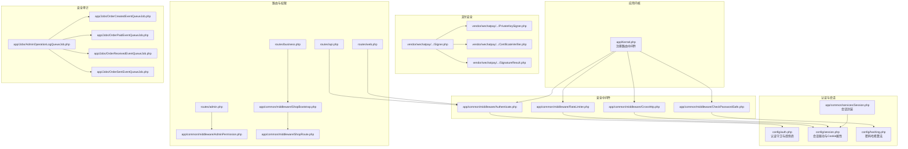
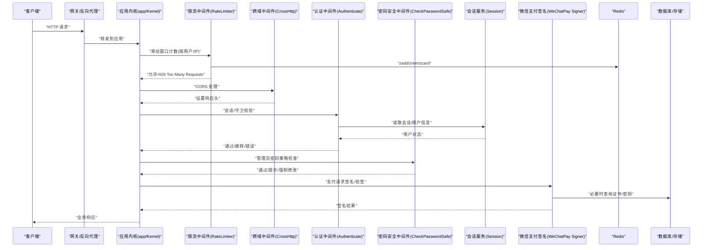
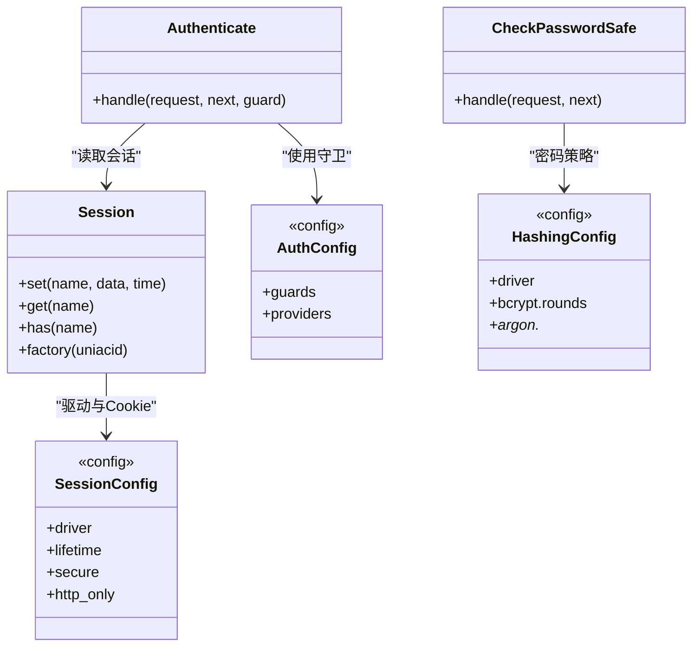
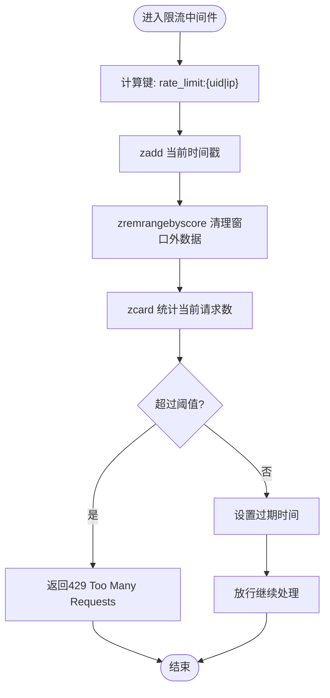
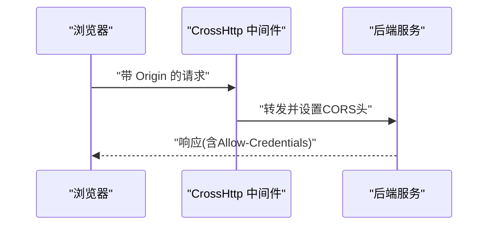
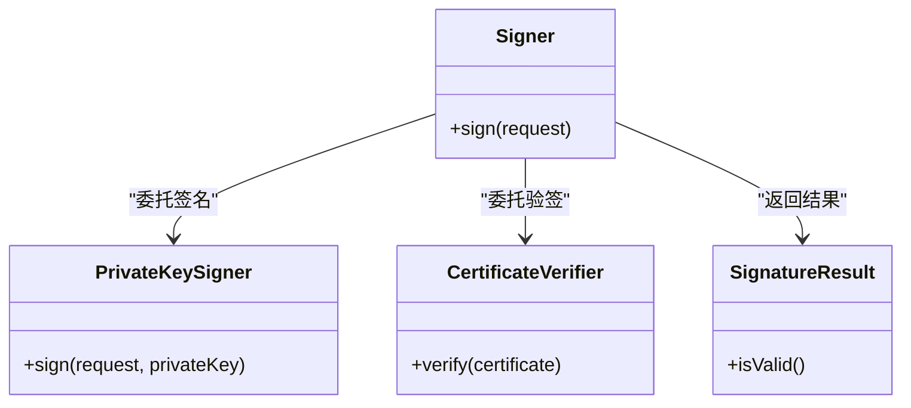
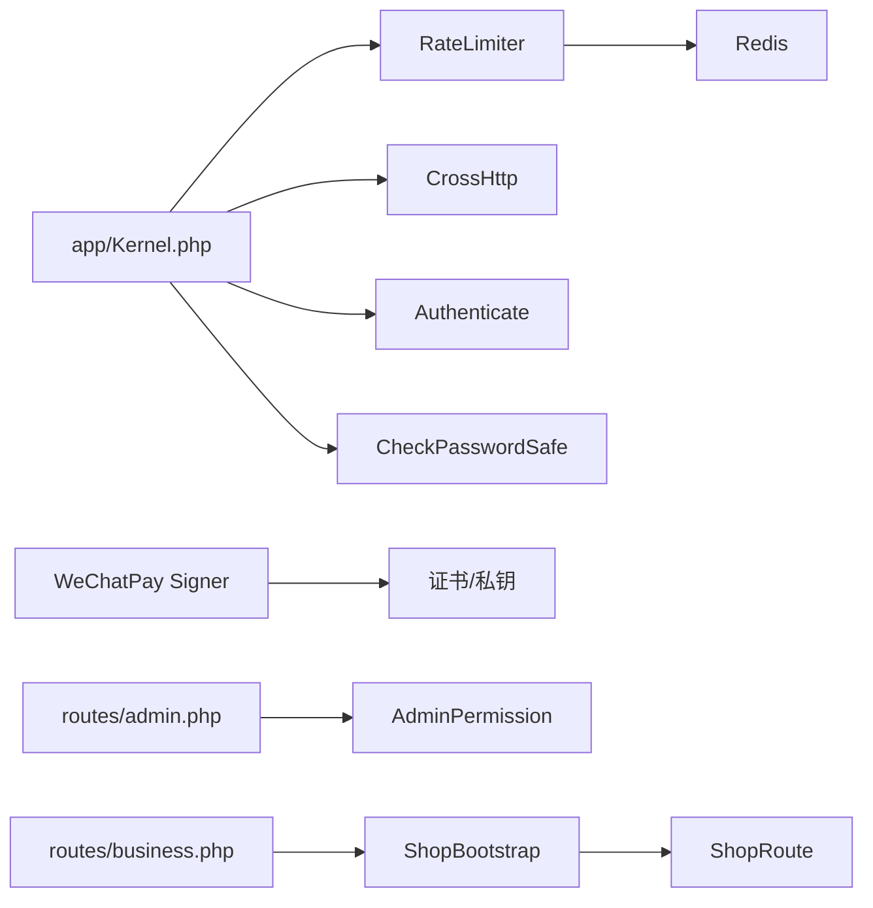

# 安全架构

<cite>
**本文引用的文件**   
- [app/common/middleware/Authenticate.php](file://app/common/middleware/Authenticate.php)
- [app/common/middleware/RateLimiter.php](file://app/common/middleware/RateLimiter.php)
- [app/common/middleware/CrossHttp.php](file://app/common/middleware/CrossHttp.php)
- [app/common/middleware/CheckPasswordSafe.php](file://app/common/middleware/CheckPasswordSafe.php)
- [app/common/services/Session.php](file://app/common/services/Session.php)
- [config/auth.php](file://config/auth.php)
- [config/session.php](file://config/session.php)
- [config/hashing.php](file://config/hashing.php)
- [app/Kernel.php](file://app/Kernel.php)
- [vendor/wechatpay/wechatpay-guzzle-middleware/src/Auth/Signer.php](file://vendor/wechatpay/wechatpay-guzzle-middleware/src/Auth/Signer.php)
- [vendor/wechatpay/wechatpay-guzzle-middleware/src/Auth/PrivateKeySigner.php](file://vendor/wechatpay/wechatpay-guzzle-middleware/src/Auth/PrivateKeySigner.php)
- [vendor/wechatpay/wechatpay-guzzle-middleware/src/Auth/CertificateVerifier.php](file://vendor/wechatpay/wechatpay-guzzle-middleware/src/Auth/CertificateVerifier.php)
- [vendor/wechatpay/wechatpay-guzzle-middleware/src/Auth/SignatureResult.php](file://vendor/wechatpay/wechatpay-guzzle-middleware/src/Auth/SignatureResult.php)
- [routes/api.php](file://routes/api.php)
- [routes/web.php](file://routes/web.php)
- [routes/admin.php](file://routes/admin.php)
- [routes/business.php](file://routes/business.php)
- [app/common/middleware/AdminPermission.php](file://app/common/middleware/AdminPermission.php)
- [app/common/middleware/ShopBootstrap.php](file://app/common/middleware/ShopBootstrap.php)
- [app/common/middleware/ShopRoute.php](file://app/common/middleware/ShopRoute.php)
- [app/outside/middleware/OutsideAccessLog.php](file://app/outside/middleware/OutsideAccessLog.php)
- [business/middleware/Business.php](file://business/middleware/Business.php)
- [business/middleware/BusinessLogin.php](file://business/middleware/BusinessLogin.php)
- [app/Jobs/AdminOperationLogQueueJob.php](file://app/Jobs/AdminOperationLogQueueJob.php)
- [app/Jobs/OrderCreatedEventQueueJob.php](file://app/Jobs/OrderCreatedEventQueueJob.php)
- [app/Jobs/OrderPaidEventQueueJob.php](file://app/Jobs/OrderPaidEventQueueJob.php)
- [app/Jobs/OrderReceivedEventQueueJob.php](file://app/Jobs/OrderReceivedEventQueueJob.php)
- [app/Jobs/OrderSentEventQueueJob.php](file://app/Jobs/OrderSentEventQueueJob.php)
- [app/Jobs/OrderMemberMonthJob.php](file://app/Jobs/OrderMemberMonthJob.php)
- [app/Jobs/MemberAddupVipJob.php](file://app/Jobs/MemberAddupVipJob.php)
- [app/Jobs/MemberLowerCountJob.php](file://app/Jobs/MemberLowerCountJob.php)
- [app/Jobs/MemberLowerGroupOrderJob.php](file://app/Jobs/MemberLowerGroupOrderJob.php)
- [app/Jobs/MemberLowerOrderJob.php](file://app/Jobs/MemberLowerOrderJob.php)
- [app/Jobs/MemberMaxRelatoinJob.php](file://app/Jobs/MemberMaxRelatoinJob.php)
- [app/Jobs/MessageJob.php](file://app/Jobs/MessageJob.php)
- [app/Jobs/MessageNoticeJob.php](file://app/Jobs/MessageNoticeJob.php)
- [app/Jobs/MiniMessageNoticeJob.php](file://app/Jobs/MiniMessageNoticeJob.php)
- [app/Jobs/OrderBonusJob.php](file://app/Jobs/OrderBonusJob.php)
- [app/Jobs/OrderBonusStatusJob.php](file://app/Jobs/OrderBonusStatusJob.php)
- [app/Jobs/OrderBonusUpdateJob.php](file://app/Jobs/OrderBonusUpdateJob.php)
- [app/Jobs/OrderCountContentJob.php](file://app/Jobs/OrderCountContentJob.php)
- [app/Jobs/OrderMemberMonthJob.php](file://app/Jobs/OrderMemberMonthJob.php)
- [app/Jobs/OrderPaidEventQueueJob.php](file://app/Jobs/OrderPaidEventQueueJob.php)
- [app/Jobs/OrderReceivedEventQueueJob.php](file://app/Jobs/OrderReceivedEventQueueJob.php)
- [app/Jobs/OrderSentEventQueueJob.php](file://app/Jobs/OrderSentEventQueueJob.php)
- [app/Jobs/PointQueueJob.php](file://app/Jobs/PointQueueJob.php)
- [app/Jobs/PointToLoveJob.php](file://app/Jobs/PointToLoveJob.php)
- [app/Jobs/SetGoodsPriceJob.php](file://app/Jobs/SetGoodsPriceJob.php)
- [app/Jobs/WithdrawBalanceAuditFreeJob.php](file://app/Jobs/WithdrawBalanceAuditFreeJob.php)
- [app/Jobs/WithdrawFreeAuditJob.php](file://app/Jobs/WithdrawFreeAuditJob.php)
- [app/Jobs/ChangeMemberRelationJob.php](file://app/Jobs/ChangeMemberRelationJob.php)
- [app/Jobs/MemberAddupVipJob.php](file://app/Jobs/MemberAddupVipJob.php)
- [app/Jobs/MemberLowerCountJob.php](file://app/Jobs/MemberLowerCountJob.php)
- [app/Jobs/MemberLowerGroupOrderJob.php](file://app/Jobs/MemberLowerGroupOrderJob.php)
- [app/Jobs/MemberLowerOrderJob.php](file://app/Jobs/MemberLowerOrderJob.php)
- [app/Jobs/MemberMaxRelatoinJob.php](file://app/Jobs/MemberMaxRelatoinJob.php)
- [app/Jobs/MessageJob.php](file://app/Jobs/MessageJob.php)
- [app/Jobs/MessageNoticeJob.php](file://app/Jobs/MessageNoticeJob.php)
- [app/Jobs/MiniMessageNoticeJob.php](file://app/Jobs/MiniMessageNoticeJob.php)
- [app/Jobs/OrderBonusJob.php](file://app/Jobs/OrderBonusJob.php)
- [app/Jobs/OrderBonusStatusJob.php](file://app/Jobs/OrderBonusStatusJob.php)
- [app/Jobs/OrderBonusUpdateJob.php](file://app/Jobs/OrderBonusUpdateJob.php)
- [app/Jobs/OrderCountContentJob.php](file://app/Jobs/OrderCountContentJob.php)
- [app/Jobs/OrderMemberMonthJob.php](file://app/Jobs/OrderMemberMonthJob.php)
- [app/Jobs/OrderPaidEventQueueJob.php](file://app/Jobs/OrderPaidEventQueueJob.php)
- [app/Jobs/OrderReceivedEventQueueJob.php](file://app/Jobs/OrderReceivedEventQueueJob.php)
- [app/Jobs/OrderSentEventQueueJob.php](file://app/Jobs/OrderSentEventQueueJob.php)
- [app/Jobs/PointQueueJob.php](file://app/Jobs/PointQueueJob.php)
- [app/Jobs/PointToLoveJob.php](file://app/Jobs/PointToLoveJob.php)
- [app/Jobs/SetGoodsPriceJob.php](file://app/Jobs/SetGoodsPriceJob.php)
- [app/Jobs/WithdrawBalanceAuditFreeJob.php](file://app/Jobs/WithdrawBalanceAuditFreeJob.php)
- [app/Jobs/WithdrawFreeAuditJob.php](file://app/Jobs/WithdrawFreeAuditJob.php)
</cite>

## 目录
1. 引言
2. 项目结构
3. 核心组件
4. 架构总览
5. 组件详解
6. 依赖关系分析
7. 性能考量
8. 故障排查指南
9. 结论
10. 附录

## 引言
本文件面向芸众商城的安全架构，系统化梳理认证体系（含会话与前端登录态）、API 限流策略（基于 Redis 的滑动窗口计数法）、跨域与 CSRF 防护、下载限流、密码安全策略、安全中间件与配置、以及安全审计与运维监控。文档以代码为依据，结合流程图与类图，帮助开发者与运维人员快速理解并落地安全实践。

## 项目结构
围绕安全的关键目录与文件：
- 中间件层：统一在 app/common/middleware 下定义认证、限流、跨域、密码安全等中间件，并在 app/Kernel.php 注册到路由管道。
- 会话与认证：通过 config/session.php、config/auth.php、config/hashing.php 以及 app/common/services/Session.php 管理会话生命周期与加密策略。
- 支付与签名：微信支付签名与验签中间件位于 vendor/wechatpay/wechatpay-guzzle-middleware。
- 路由与权限：routes/*.php 定义 API/Web/Admin/Business 等路由分组，配合中间件实现访问控制。
- 安全审计：通过队列作业记录管理员操作日志与订单事件，便于审计与追踪。

图表来源
- [app/Kernel.php:59-77](file://app/Kernel.php#L59-L77)
- [config/auth.php:38-52](file://config/auth.php#L38-L52)
- [config/session.php:19-179](file://config/session.php#L19-L179)
- [config/hashing.php:25-57](file://config/hashing.php#L25-L57)
- [app/common/services/Session.php:115-128](file://app/common/services/Session.php#L115-L128)
- [app/common/middleware/Authenticate.php:26-44](file://app/common/middleware/Authenticate.php#L26-L44)
- [app/common/middleware/RateLimiter.php:11-32](file://app/common/middleware/RateLimiter.php#L11-L32)
- [app/common/middleware/CrossHttp.php:14-31](file://app/common/middleware/CrossHttp.php#L14-L31)
- [app/common/middleware/CheckPasswordSafe.php:19-46](file://app/common/middleware/CheckPasswordSafe.php#L19-L46)
- [routes/api.php](file://routes/api.php)
- [routes/web.php](file://routes/web.php)
- [routes/admin.php](file://routes/admin.php)
- [routes/business.php](file://routes/business.php)
- [app/common/middleware/AdminPermission.php](file://app/common/middleware/AdminPermission.php)
- [app/common/middleware/ShopBootstrap.php](file://app/common/middleware/ShopBootstrap.php)
- [app/common/middleware/ShopRoute.php](file://app/common/middleware/ShopRoute.php)
- [vendor/wechatpay/wechatpay-guzzle-middleware/src/Auth/Signer.php](file://vendor/wechatpay/wechatpay-guzzle-middleware/src/Auth/Signer.php)
- [vendor/wechatpay/wechatpay-guzzle-middleware/src/Auth/PrivateKeySigner.php](file://vendor/wechatpay/wechatpay-guzzle-middleware/src/Auth/PrivateKeySigner.php)
- [vendor/wechatpay/wechatpay-guzzle-middleware/src/Auth/CertificateVerifier.php](file://vendor/wechatpay/wechatpay-guzzle-middleware/src/Auth/CertificateVerifier.php)
- [vendor/wechatpay/wechatpay-guzzle-middleware/src/Auth/SignatureResult.php](file://vendor/wechatpay/wechatpay-guzzle-middleware/src/Auth/SignatureResult.php)
- [app/Jobs/AdminOperationLogQueueJob.php](file://app/Jobs/AdminOperationLogQueueJob.php)
- [app/Jobs/OrderCreatedEventQueueJob.php](file://app/Jobs/OrderCreatedEventQueueJob.php)
- [app/Jobs/OrderPaidEventQueueJob.php](file://app/Jobs/OrderPaidEventQueueJob.php)
- [app/Jobs/OrderReceivedEventQueueJob.php](file://app/Jobs/OrderReceivedEventQueueJob.php)
- [app/Jobs/OrderSentEventQueueJob.php](file://app/Jobs/OrderSentEventQueueJob.php)

章节来源
- [app/Kernel.php:59-77](file://app/Kernel.php#L59-L77)
- [config/session.php:19-179](file://config/session.php#L19-L179)
- [config/auth.php:38-52](file://config/auth.php#L38-L52)
- [config/hashing.php:25-57](file://config/hashing.php#L25-L57)
- [app/common/services/Session.php:115-128](file://app/common/services/Session.php#L115-L128)

## 核心组件
- 认证与会话
  - 基于 Laravel Session 的多守卫认证（web、api、admin），会话生命周期与 Cookie 属性由 config/session.php 控制；密码哈希使用 config/hashing.php 指定的 bcrypt/argon。
  - app/common/services/Session.php 提供统一会话封装，支持过期时间、键空间隔离与跨uniacid校验。
- API 限流
  - app/common/middleware/RateLimiter.php 基于 Redis 有序集合实现滑动窗口计数，按用户或 IP 维度限流，默认每 60 秒最多 60 次请求。
- 跨域与 CSRF
  - app/common/middleware/CrossHttp.php 对指定来源开启 CORS 并设置 Allow-Credentials；CSRF 依赖框架默认 Token 机制与前端交互。
- 密码安全
  - app/common/middleware/CheckPasswordSafe.php 在管理员登录后强制或提醒修改密码，超期未改则触发提醒。
- 支付安全
  - 微信支付签名/验签中间件（Signer、PrivateKeySigner、CertificateVerifier、SignatureResult）确保支付请求完整性与防重放。
- 安全审计
  - 通过队列作业记录管理员操作日志与订单事件，便于审计与追踪。

章节来源
- [app/common/middleware/Authenticate.php:26-44](file://app/common/middleware/Authenticate.php#L26-L44)
- [app/common/middleware/RateLimiter.php:11-32](file://app/common/middleware/RateLimiter.php#L11-L32)
- [app/common/middleware/CrossHttp.php:14-31](file://app/common/middleware/CrossHttp.php#L14-L31)
- [app/common/middleware/CheckPasswordSafe.php:19-46](file://app/common/middleware/CheckPasswordSafe.php#L19-L46)
- [config/hashing.php:25-57](file://config/hashing.php#L25-L57)
- [vendor/wechatpay/wechatpay-guzzle-middleware/src/Auth/Signer.php](file://vendor/wechatpay/wechatpay-guzzle-middleware/src/Auth/Signer.php)
- [vendor/wechatpay/wechatpay-guzzle-middleware/src/Auth/PrivateKeySigner.php](file://vendor/wechatpay/wechatpay-guzzle-middleware/src/Auth/PrivateKeySigner.php)
- [vendor/wechatpay/wechatpay-guzzle-middleware/src/Auth/CertificateVerifier.php](file://vendor/wechatpay/wechatpay-guzzle-middleware/src/Auth/CertificateVerifier.php)
- [vendor/wechatpay/wechatpay-guzzle-middleware/src/Auth/SignatureResult.php](file://vendor/wechatpay/wechatpay-guzzle-middleware/src/Auth/SignatureResult.php)
- [app/Jobs/AdminOperationLogQueueJob.php](file://app/Jobs/AdminOperationLogQueueJob.php)
- [app/Jobs/OrderCreatedEventQueueJob.php](file://app/Jobs/OrderCreatedEventQueueJob.php)
- [app/Jobs/OrderPaidEventQueueJob.php](file://app/Jobs/OrderPaidEventQueueJob.php)
- [app/Jobs/OrderReceivedEventQueueJob.php](file://app/Jobs/OrderReceivedEventQueueJob.php)
- [app/Jobs/OrderSentEventQueueJob.php](file://app/Jobs/OrderSentEventQueueJob.php)

## 架构总览
下图展示从请求进入至响应返回的关键安全路径：认证、限流、跨域、会话、密码检查、支付签名与审计。

图表来源
- [app/Kernel.php:59-77](file://app/Kernel.php#L59-L77)
- [app/common/middleware/RateLimiter.php:11-32](file://app/common/middleware/RateLimiter.php#L11-L32)
- [app/common/middleware/CrossHttp.php:14-31](file://app/common/middleware/CrossHttp.php#L14-L31)
- [app/common/middleware/Authenticate.php:26-44](file://app/common/middleware/Authenticate.php#L26-L44)
- [app/common/middleware/CheckPasswordSafe.php:19-46](file://app/common/middleware/CheckPasswordSafe.php#L19-L46)
- [app/common/services/Session.php:47-71](file://app/common/services/Session.php#L47-L71)
- [vendor/wechatpay/wechatpay-guzzle-middleware/src/Auth/Signer.php](file://vendor/wechatpay/wechatpay-guzzle-middleware/src/Auth/Signer.php)
- [vendor/wechatpay/wechatpay-guzzle-middleware/src/Auth/PrivateKeySigner.php](file://vendor/wechatpay/wechatpay-guzzle-middleware/src/Auth/PrivateKeySigner.php)
- [vendor/wechatpay/wechatpay-guzzle-middleware/src/Auth/CertificateVerifier.php](file://vendor/wechatpay/wechatpay-guzzle-middleware/src/Auth/CertificateVerifier.php)
- [vendor/wechatpay/wechatpay-guzzle-middleware/src/Auth/SignatureResult.php](file://vendor/wechatpay/wechatpay-guzzle-middleware/src/Auth/SignatureResult.php)

## 组件详解

### 认证体系与会话管理
- 多守卫与会话
  - 守卫配置：web（session）、api（token）、admin（session）。用户来源分别对应不同模型与表。
  - 会话驱动：可选 file/redis 等；Cookie 属性受 SESSION_SECURE_COOKIE、HTTP_ONLY 等环境变量影响。
  - app/common/services/Session.php 封装了带过期时间的会话写入、读取与跨uniacid校验逻辑。
- 登录态与过期处理
  - Authenticate 中间件在守卫判定为访客时返回统一错误格式，AJAX 场景返回 JSON 并携带 login_status/login_url，非 AJAX 可重定向。
- 密码安全策略
  - CheckPasswordSafe 在管理员首次登录或超期未改时触发提示或强制修改，保障弱密码与长期未更新风险可控。

图表来源
- [app/common/middleware/Authenticate.php:26-44](file://app/common/middleware/Authenticate.php#L26-L44)
- [app/common/middleware/CheckPasswordSafe.php:19-46](file://app/common/middleware/CheckPasswordSafe.php#L19-L46)
- [app/common/services/Session.php:29-71](file://app/common/services/Session.php#L29-L71)
- [config/auth.php:38-84](file://config/auth.php#L38-L84)
- [config/session.php:19-179](file://config/session.php#L19-L179)
- [config/hashing.php:25-57](file://config/hashing.php#L25-L57)

章节来源
- [config/auth.php:38-84](file://config/auth.php#L38-L84)
- [config/session.php:19-179](file://config/session.php#L19-L179)
- [config/hashing.php:25-57](file://config/hashing.php#L25-L57)
- [app/common/services/Session.php:29-128](file://app/common/services/Session.php#L29-L128)
- [app/common/middleware/Authenticate.php:26-44](file://app/common/middleware/Authenticate.php#L26-L44)
- [app/common/middleware/CheckPasswordSafe.php:19-46](file://app/common/middleware/CheckPasswordSafe.php#L19-L46)

### API 限流实现
- 实现策略
  - 滑动窗口计数：使用 Redis 有序集合存储请求时间戳，窗口外的旧条目被清理，统计当前请求数量与阈值比较。
  - 维度：优先按用户 ID，若无则回退到 IP，形成“用户级/IP级”双轨限流。
  - 默认参数：每 60 秒最多 60 次请求，可通过中间件参数调整。
- 错误处理
  - 超限时返回统一 JSON 与 429 状态码，便于前端与网关侧处理。

图表来源
- [app/common/middleware/RateLimiter.php:11-32](file://app/common/middleware/RateLimiter.php#L11-L32)

章节来源
- [app/common/middleware/RateLimiter.php:11-32](file://app/common/middleware/RateLimiter.php#L11-L32)

### 跨域与 CSRF 防护
- 跨域（CORS）
  - CrossHttp 中间件对白名单来源设置 Access-Control-Allow-* 头，允许凭据传输，暴露授权头并允许常见方法。
- CSRF
  - 采用框架默认 Token 机制，前端在请求中携带 X-CSRF-TOKEN 或 X-XSRF-TOKEN，后端进行校验。

图表来源
- [app/common/middleware/CrossHttp.php:14-31](file://app/common/middleware/CrossHttp.php#L14-L31)

章节来源
- [app/common/middleware/CrossHttp.php:14-31](file://app/common/middleware/CrossHttp.php#L14-L31)

### 下载限流（安全考虑与实施）
- 安全考虑
  - 对大文件下载增加速率限制与配额控制，避免资源滥用与带宽耗尽。
  - 结合用户身份与 IP 维度限流，防止爬虫与暴力下载。
- 实施建议
  - 在下载控制器前置调用 RateLimiter 中间件，或自定义下载专用中间件。
  - 对敏感资源启用鉴权与白名单来源校验（CORS 白名单）。
  - 使用 CDN/对象存储签名直链与过期时间，降低服务器压力。

[本节为通用安全建议，不直接分析具体文件]

### 密码安全策略
- 加密算法
  - config/hashing.php 默认使用 bcrypt，可配置 rounds；也可选择 argon2 参数（memory/threads/time）。
- 盐值与强度
  - bcrypt/argon 自带盐值与自适应成本因子，无需额外手工加盐；建议结合业务策略定期轮换密钥材料。
- 管理员密码治理
  - CheckPasswordSafe 在管理员首次登录或超期未改时触发提示/强制修改，降低弱口令风险。

章节来源
- [config/hashing.php:25-57](file://config/hashing.php#L25-L57)
- [app/common/middleware/CheckPasswordSafe.php:19-46](file://app/common/middleware/CheckPasswordSafe.php#L19-L46)

### 安全中间件与配置
- 中间件注册
  - app/Kernel.php 将认证、限流、跨域、密码安全等中间件注册到路由管道，确保全局生效。
- 典型中间件职责
  - Authenticate：统一登录态校验与过期处理。
  - RateLimiter：滑动窗口限流。
  - CrossHttp：CORS 与凭据支持。
  - CheckPasswordSafe：管理员密码策略执行。

章节来源
- [app/Kernel.php:59-77](file://app/Kernel.php#L59-L77)
- [app/common/middleware/Authenticate.php:26-44](file://app/common/middleware/Authenticate.php#L26-L44)
- [app/common/middleware/RateLimiter.php:11-32](file://app/common/middleware/RateLimiter.php#L11-L32)
- [app/common/middleware/CrossHttp.php:14-31](file://app/common/middleware/CrossHttp.php#L14-L31)
- [app/common/middleware/CheckPasswordSafe.php:19-46](file://app/common/middleware/CheckPasswordSafe.php#L19-L46)

### 支付安全（签名与验签）
- 组件职责
  - Signer：统一签名流程。
  - PrivateKeySigner：私钥签名生成。
  - CertificateVerifier：证书链验证。
  - SignatureResult：签名结果封装。
- 应用场景
  - 在支付请求发送前完成签名，在回调/通知接收后完成验签，确保请求来源可信与内容未篡改。

图表来源
- [vendor/wechatpay/wechatpay-guzzle-middleware/src/Auth/Signer.php](file://vendor/wechatpay/wechatpay-guzzle-middleware/src/Auth/Signer.php)
- [vendor/wechatpay/wechatpay-guzzle-middleware/src/Auth/PrivateKeySigner.php](file://vendor/wechatpay/wechatpay-guzzle-middleware/src/Auth/PrivateKeySigner.php)
- [vendor/wechatpay/wechatpay-guzzle-middleware/src/Auth/CertificateVerifier.php](file://vendor/wechatpay/wechatpay-guzzle-middleware/src/Auth/CertificateVerifier.php)
- [vendor/wechatpay/wechatpay-guzzle-middleware/src/Auth/SignatureResult.php](file://vendor/wechatpay/wechatpay-guzzle-middleware/src/Auth/SignatureResult.php)

章节来源
- [vendor/wechatpay/wechatpay-guzzle-middleware/src/Auth/Signer.php](file://vendor/wechatpay/wechatpay-guzzle-middleware/src/Auth/Signer.php)
- [vendor/wechatpay/wechatpay-guzzle-middleware/src/Auth/PrivateKeySigner.php](file://vendor/wechatpay/wechatpay-guzzle-middleware/src/Auth/PrivateKeySigner.php)
- [vendor/wechatpay/wechatpay-guzzle-middleware/src/Auth/CertificateVerifier.php](file://vendor/wechatpay/wechatpay-guzzle-middleware/src/Auth/CertificateVerifier.php)
- [vendor/wechatpay/wechatpay-guzzle-middleware/src/Auth/SignatureResult.php](file://vendor/wechatpay/wechatpay-guzzle-middleware/src/Auth/SignatureResult.php)

### 安全审计、入侵检测与日志监控
- 审计与日志
  - 管理员操作日志通过队列作业异步落库，便于离线审计与溯源。
  - 订单相关事件（创建、支付、收货、发货）均配套队列作业，形成闭环审计链。
- 运维建议
  - 将审计日志接入 SIEM/日志平台，设置异常行为规则（如短时间内大量失败、异常来源、异常角色批量操作）。
  - 对高危操作（权限变更、价格修改、财务敏感字段）增加二次确认与审批流程。

章节来源
- [app/Jobs/AdminOperationLogQueueJob.php](file://app/Jobs/AdminOperationLogQueueJob.php)
- [app/Jobs/OrderCreatedEventQueueJob.php](file://app/Jobs/OrderCreatedEventQueueJob.php)
- [app/Jobs/OrderPaidEventQueueJob.php](file://app/Jobs/OrderPaidEventQueueJob.php)
- [app/Jobs/OrderReceivedEventQueueJob.php](file://app/Jobs/OrderReceivedEventQueueJob.php)
- [app/Jobs/OrderSentEventQueueJob.php](file://app/Jobs/OrderSentEventQueueJob.php)

## 依赖关系分析
- 中间件耦合
  - app/Kernel.php 将多个安全中间件串联，形成“限流 → 跨域 → 认证 → 密码安全”的处理链。
- 外部依赖
  - Redis：用于限流计数与过期控制。
  - 微信支付签名组件：用于支付请求签名与验签。
- 路由与权限
  - routes/*.php 定义不同域的路由，配合 AdminPermission、ShopBootstrap、ShopRoute 等中间件实现细粒度权限控制。

图表来源
- [app/Kernel.php:59-77](file://app/Kernel.php#L59-L77)
- [app/common/middleware/RateLimiter.php:11-32](file://app/common/middleware/RateLimiter.php#L11-L32)
- [app/common/middleware/CrossHttp.php:14-31](file://app/common/middleware/CrossHttp.php#L14-L31)
- [app/common/middleware/Authenticate.php:26-44](file://app/common/middleware/Authenticate.php#L26-L44)
- [app/common/middleware/CheckPasswordSafe.php:19-46](file://app/common/middleware/CheckPasswordSafe.php#L19-L46)
- [routes/admin.php](file://routes/admin.php)
- [routes/business.php](file://routes/business.php)
- [app/common/middleware/AdminPermission.php](file://app/common/middleware/AdminPermission.php)
- [app/common/middleware/ShopBootstrap.php](file://app/common/middleware/ShopBootstrap.php)
- [app/common/middleware/ShopRoute.php](file://app/common/middleware/ShopRoute.php)

章节来源
- [app/Kernel.php:59-77](file://app/Kernel.php#L59-L77)
- [routes/admin.php](file://routes/admin.php)
- [routes/business.php](file://routes/business.php)

## 性能考量
- 限流性能
  - Redis 有序集合操作为 O(log N)，窗口清理与计数均为高效操作；建议合理设置时间窗与阈值，避免过高的 Redis 写压力。
- 会话性能
  - 若使用 Redis 作为会话驱动，注意连接池与序列化开销；Cookie 属性 secure=httpOnly 会带来少量头部处理成本，但收益显著。
- 支付签名性能
  - 私钥签名与证书验签为 CPU 密集型，建议在网关层或专用服务中缓存证书与公钥，减少重复加载。

[本节提供通用指导，不直接分析具体文件]

## 故障排查指南
- 登录过期/跳转循环
  - 现象：AJAX 返回 login_status=1 并携带 login_url。
  - 排查：检查 Authenticate 中间件守卫配置与会话是否正确写入；确认前端是否正确处理返回码并跳转。
- 429 频繁出现
  - 现象：接口返回 429。
  - 排查：确认 RateLimiter 参数（maxRequests/timeWindow）是否合理；检查用户维度与 IP 维度是否命中；查看 Redis 键是否存在且过期时间正确。
- CORS 失败/凭据无效
  - 现象：跨域请求失败或报错。
  - 排查：确认 CrossHttp 中白名单来源是否包含当前域名；检查前端是否携带 Cookie/凭据；后端是否设置 Allow-Credentials。
- 管理员密码策略触发
  - 现象：登录后弹出修改密码提示或强制修改。
  - 排查：检查 CheckPasswordSafe 触发条件与系统设置项；确认管理员 last_change 时间是否正确更新。

章节来源
- [app/common/middleware/Authenticate.php:26-44](file://app/common/middleware/Authenticate.php#L26-L44)
- [app/common/middleware/RateLimiter.php:11-32](file://app/common/middleware/RateLimiter.php#L11-L32)
- [app/common/middleware/CrossHttp.php:14-31](file://app/common/middleware/CrossHttp.php#L14-L31)
- [app/common/middleware/CheckPasswordSafe.php:19-46](file://app/common/middleware/CheckPasswordSafe.php#L19-L46)

## 结论
芸众商城的安全架构以“会话与多守卫认证为基础，结合 Redis 限流、CORS/CSRF 防护、密码策略与支付签名/验签，辅以安全审计与日志监控”为核心设计。通过中间件统一接入与配置化管理，既保证了安全性，也兼顾了可维护性与扩展性。建议在生产环境中进一步完善下载限流、入侵检测与告警联动，并持续优化限流阈值与会话策略。

## 附录
- 路由与中间件映射参考
  - routes/api.php：API 路由，通常绑定认证与限流中间件。
  - routes/web.php：Web 路由，结合会话与 CSRF。
  - routes/admin.php：后台路由，结合 AdminPermission 与 ShopBootstrap。
  - routes/business.php：业务路由，结合 ShopRoute 与权限控制。

章节来源
- [routes/api.php](file://routes/api.php)
- [routes/web.php](file://routes/web.php)
- [routes/admin.php](file://routes/admin.php)
- [routes/business.php](file://routes/business.php)