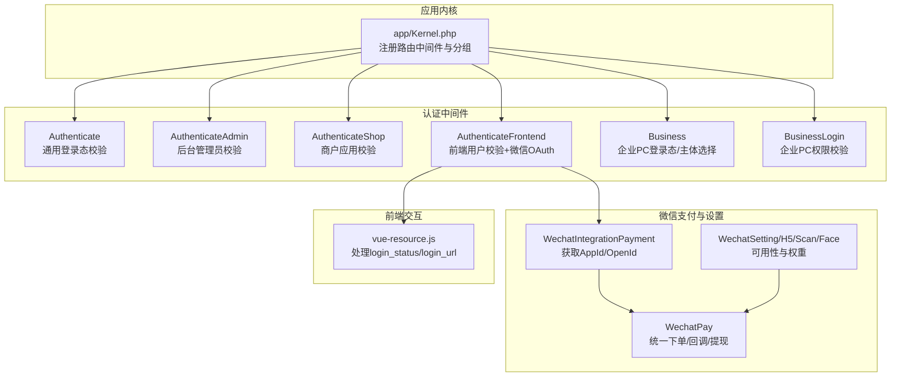
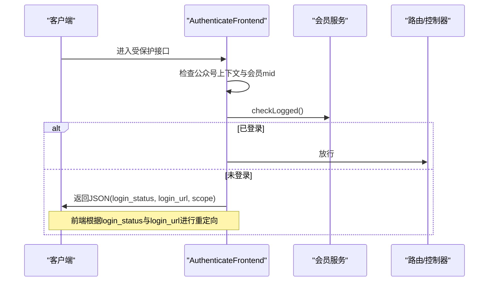
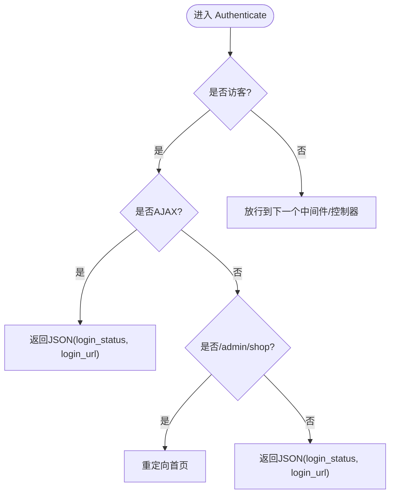
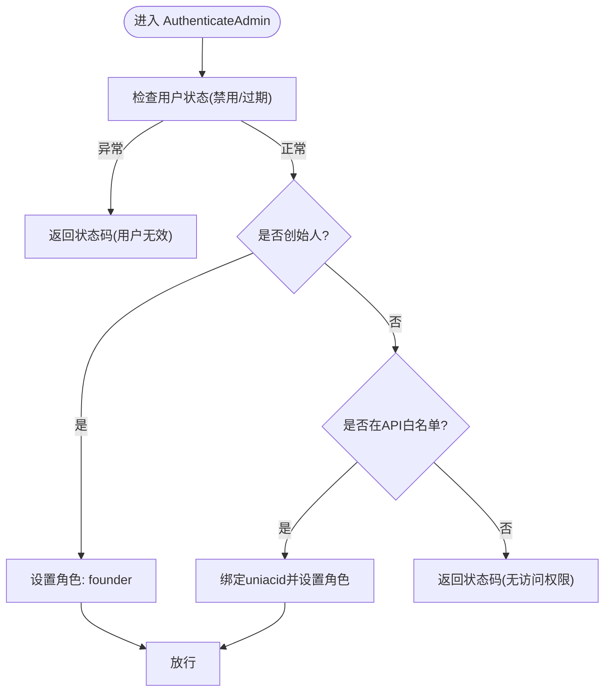
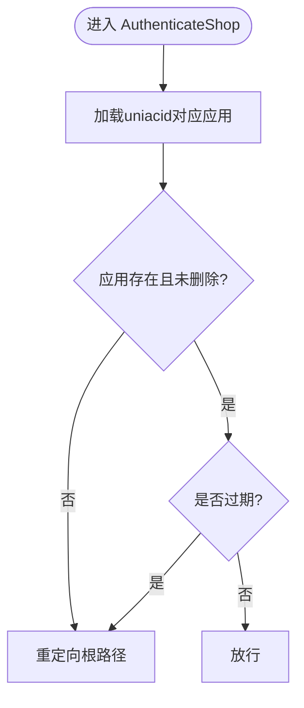
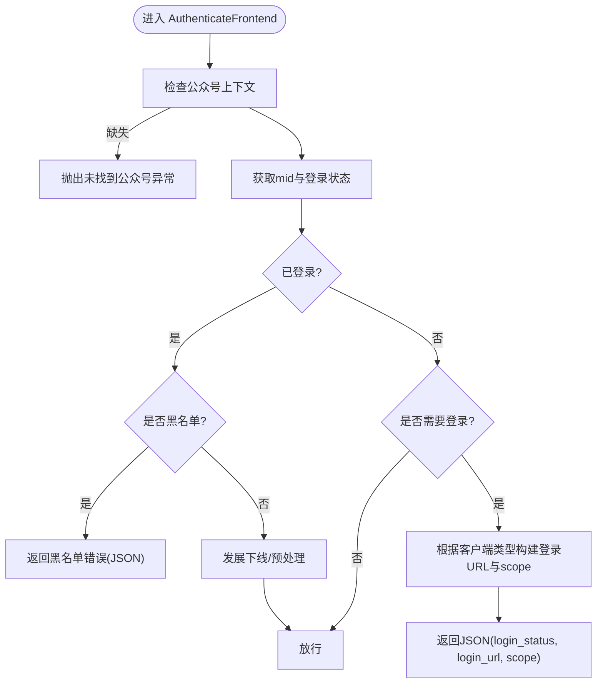
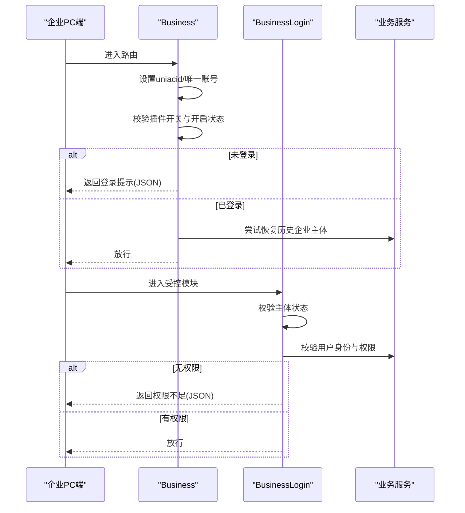
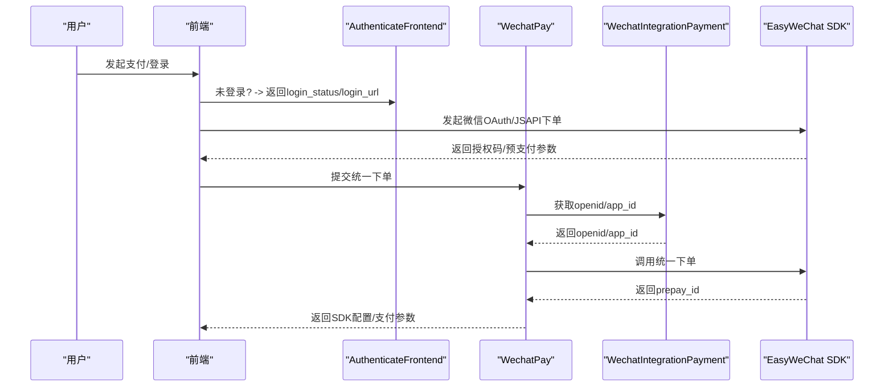
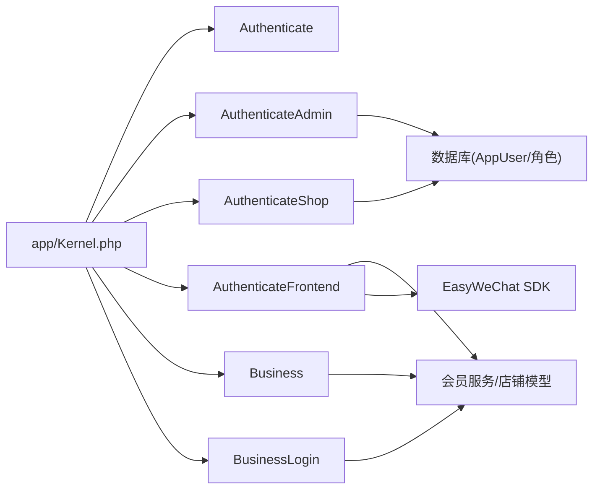

# 认证体系

<cite>
**本文引用的文件**
- [app/Kernel.php](file://app/Kernel.php)
- [app/common/middleware/Authenticate.php](file://app/common/middleware/Authenticate.php)
- [app/common/middleware/AuthenticateAdmin.php](file://app/common/middleware/AuthenticateAdmin.php)
- [app/common/middleware/AuthenticateShop.php](file://app/common/middleware/AuthenticateShop.php)
- [app/common/middleware/AuthenticateFrontend.php](file://app/common/middleware/AuthenticateFrontend.php)
- [business/middleware/Business.php](file://business/middleware/Business.php)
- [business/middleware/BusinessLogin.php](file://business/middleware/BusinessLogin.php)
- [app/common/services/WechatPay.php](file://app/common/services/WechatPay.php)
- [app/common/payment/method/integration/WechatIntegrationPayment.php](file://app/common/payment/method/integration/WechatIntegrationPayment.php)
- [app/common/payment/setting/wechat/WechatSetting.php](file://app/common/payment/setting/wechat/WechatSetting.php)
- [app/common/payment/setting/wechat/WechatH5Setting.php](file://app/common/payment/setting/wechat/WechatH5Setting.php)
- [app/common/payment/setting/wechat/WechatScanSetting.php](file://app/common/payment/setting/wechat/WechatScanSetting.php)
- [app/common/payment/setting/wechat/WechatFaceSetting.php](file://app/common/payment/setting/wechat/WechatFaceSetting.php)
- [app/backend/controllers/IndexController.php](file://app/backend/controllers/IndexController.php)
- [routes/business.php](file://routes/business.php)
- [static/yunshop/vue/js/vue-resource.js](file://static/yunshop/vue/js/vue-resource.js)
</cite>

## 目录
1. [引言](#引言)
2. [项目结构](#项目结构)
3. [核心组件](#核心组件)
4. [架构总览](#架构总览)
5. [详细组件分析](#详细组件分析)
6. [依赖分析](#依赖分析)
7. [性能考虑](#性能考虑)
8. [故障排查指南](#故障排查指南)
9. [结论](#结论)
10. [附录](#附录)

## 引言
本文件系统性梳理芸众商城的认证体系，覆盖管理台、前端用户、商户（企业）PC端三类主体的认证策略与实现；深入解析 Authenticate 中间件链路（含 JWT/会话校验、登录状态检查、重定向与错误响应），并结合 EasyWeChat 集成说明微信认证流程（OAuth 授权、用户信息获取、绑定关系建立）。同时给出认证失败处理机制、中间件配置项与使用示例、安全最佳实践及常见问题解决方案。

## 项目结构
围绕认证的关键目录与文件如下：
- 中间件注册与路由分组：在应用内核中集中注册各 guard 的路由中间件，并按 web/admin/api/business 等分组启用对应中间件栈。
- 认证中间件：
  - Authenticate：通用登录态校验，区分 AJAX 与普通请求，返回统一 JSON 或重定向。
  - AuthenticateAdmin：后台管理员登录态与权限校验，含账号状态、角色与 API 白名单控制。
  - AuthenticateShop：商户应用（uniacid）有效性校验，过期/停用拦截。
  - AuthenticateFrontend：前端用户登录态与微信 OAuth 跳转策略，支持多种客户端类型。
  - Business/BusinessLogin：企业 PC 端登录态、业务主体选择与模块权限校验。
- 支付与微信集成：
  - WechatPay 与 WechatIntegrationPayment：统一下单、回调、提现等调用微信支付能力。
  - WechatSetting 系列：按场景（公众号 JSAPI、H5、扫码、刷脸）判定可用性与权重。
- 前端交互：
  - vue-resource 对 login_status 与 login_url 的处理逻辑，用于引导前端重定向或提示。

**图表来源**
- [app/Kernel.php:66-76](file://app/Kernel.php#L66-L76)
- [app/common/middleware/Authenticate.php:26-44](file://app/common/middleware/Authenticate.php#L26-L44)
- [app/common/middleware/AuthenticateAdmin.php:111-153](file://app/common/middleware/AuthenticateAdmin.php#L111-L153)
- [app/common/middleware/AuthenticateShop.php:17-54](file://app/common/middleware/AuthenticateShop.php#L17-L54)
- [app/common/middleware/AuthenticateFrontend.php:28-113](file://app/common/middleware/AuthenticateFrontend.php#L28-L113)
- [business/middleware/Business.php:27-55](file://business/middleware/Business.php#L27-L55)
- [business/middleware/BusinessLogin.php:23-46](file://business/middleware/BusinessLogin.php#L23-L46)
- [app/common/services/WechatPay.php:78-110](file://app/common/services/WechatPay.php#L78-L110)
- [app/common/payment/method/integration/WechatIntegrationPayment.php:77-130](file://app/common/payment/method/integration/WechatIntegrationPayment.php#L77-L130)
- [app/common/payment/setting/wechat/WechatSetting.php:18-32](file://app/common/payment/setting/wechat/WechatSetting.php#L18-L32)
- [static/yunshop/vue/js/vue-resource.js:1391-1394](file://static/yunshop/vue/js/vue-resource.js#L1391-L1394)

**章节来源**
- [app/Kernel.php:30-76](file://app/Kernel.php#L30-L76)

## 核心组件
- 通用认证中间件 Authenticate
  - 功能要点：基于 Auth guard 判断访客状态；AJAX 请求返回统一 JSON 并携带 login_status 与 login_url；非 AJAX 在 admin/shop 场景重定向至首页；其余场景返回 JSON。
  - 关键行为：区分 guard 类型决定默认登录路径；对 admin 分组提供特定重定向策略。
- 后台管理员认证 AuthenticateAdmin
  - 功能要点：校验用户状态（禁用/过期）、角色与 API 白名单；对非管理员访问特定接口放行；设置全局角色与 founder 标识；异常时清理会话并返回登录状态码。
- 商户应用认证 AuthenticateShop
  - 功能要点：校验当前 uniacid 对应的应用是否存在、未被删除、未过期；任一条件不满足即跳转回站店。
- 前端用户认证 AuthenticateFrontend
  - 功能要点：检测公众号上下文；获取当前会员 mid 与登录状态；根据店铺关系策略与客户端类型决定是否跳转微信 OAuth 登录页；黑名单用户直接拒绝。
- 企业 PC 端认证 Business/BusinessLogin
  - 功能要点：校验企业 PC 端开关与开启状态；确保前端已登录且已选择企业主体；校验模块级权限路由匹配；否则返回登录或权限不足提示。

**章节来源**
- [app/common/middleware/Authenticate.php:26-44](file://app/common/middleware/Authenticate.php#L26-L44)
- [app/common/middleware/AuthenticateAdmin.php:111-234](file://app/common/middleware/AuthenticateAdmin.php#L111-L234)
- [app/common/middleware/AuthenticateShop.php:17-65](file://app/common/middleware/AuthenticateShop.php#L17-L65)
- [app/common/middleware/AuthenticateFrontend.php:28-114](file://app/common/middleware/AuthenticateFrontend.php#L28-L114)
- [business/middleware/Business.php:27-59](file://business/middleware/Business.php#L27-L59)
- [business/middleware/BusinessLogin.php:23-91](file://business/middleware/BusinessLogin.php#L23-L91)

## 架构总览
认证体系以“中间件链 + Guard + 业务服务”协同工作：
- 中间件链：按路由分组加载，逐层完成登录态、权限与业务上下文校验。
- Guard 与会话：通过 Auth guard 维护登录态；Admin 使用 admin guard；Frontend 使用默认 guard；Business 使用前端登录态与业务服务。
- 微信集成：前端登录态缺失时，依据客户端类型与场景生成微信 OAuth 登录地址；统一下单/回调/提现通过 WechatPay 与 WechatIntegrationPayment 调用 EasyWeChat SDK。

**图表来源**
- [app/common/middleware/AuthenticateFrontend.php:28-113](file://app/common/middleware/AuthenticateFrontend.php#L28-L113)
- [static/yunshop/vue/js/vue-resource.js:1391-1394](file://static/yunshop/vue/js/vue-resource.js#L1391-L1394)

## 详细组件分析

### 通用认证中间件 Authenticate
- 设计模式：职责单一的前置过滤器，集中处理登录态与错误响应格式。
- 处理流程：
  - 使用 Auth::guard($guard)->guest() 判断访客；
  - AJAX 返回统一 JSON，包含 login_status 与 login_url；
  - 非 AJAX 在 admin/shop 场景重定向首页，其他场景返回 JSON；
  - 未指定 guard 时采用默认登录路径。
- 适用场景：API 与 Web 路由均可复用，保障前后端一致的登录失败语义。

**图表来源**
- [app/common/middleware/Authenticate.php:26-44](file://app/common/middleware/Authenticate.php#L26-L44)

**章节来源**
- [app/common/middleware/Authenticate.php:26-44](file://app/common/middleware/Authenticate.php#L26-L44)

### 后台管理员认证 AuthenticateAdmin
- 校验维度：
  - 用户状态：禁用/过期；
  - 角色与 API 白名单：非 founder 需在白名单内访问；
  - AppUser 绑定与角色设置：根据 uid+uniacid 获取账户并设置全局角色；
  - 会话异常：账户不存在时清理会话并返回登录状态。
- 返回策略：统一 JSON，携带状态码与消息，便于前端/客户端处理。

**图表来源**
- [app/common/middleware/AuthenticateAdmin.php:111-234](file://app/common/middleware/AuthenticateAdmin.php#L111-L234)

**章节来源**
- [app/common/middleware/AuthenticateAdmin.php:111-234](file://app/common/middleware/AuthenticateAdmin.php#L111-L234)

### 商户应用认证 AuthenticateShop
- 校验维度：
  - 应用是否存在且未删除；
  - 有效期校验（未设置则视为永久有效）。
- 失败处理：统一重定向至站点根路径，避免继续在无效上下文中运行。

**图表来源**
- [app/common/middleware/AuthenticateShop.php:17-65](file://app/common/middleware/AuthenticateShop.php#L17-L65)

**章节来源**
- [app/common/middleware/AuthenticateShop.php:17-65](file://app/common/middleware/AuthenticateShop.php#L17-L65)

### 前端用户认证 AuthenticateFrontend
- 核心流程：
  - 校验公众号上下文；获取会员 mid 与登录状态；
  - 根据店铺关系策略（公开/需登录）与当前方法是否在忽略/公开动作列表中决定是否放行；
  - 未登录且需登录时，依据客户端类型（小程序/抖音/移动端/App等）构造登录 URL 与 scope，返回 JSON。
- 黑名单拦截：已登录但处于黑名单直接拒绝。
- 重复提交防护：可选的 Redis 去重键，防止同一请求在短时间内重复提交。

**图表来源**
- [app/common/middleware/AuthenticateFrontend.php:28-113](file://app/common/middleware/AuthenticateFrontend.php#L28-L113)

**章节来源**
- [app/common/middleware/AuthenticateFrontend.php:28-114](file://app/common/middleware/AuthenticateFrontend.php#L28-L114)

### 企业 PC 端认证 Business 与 BusinessLogin
- Business：
  - 设置全局 uniacid 与唯一账号标识；
  - 校验企业 PC 端插件开关与开启状态；
  - 若前端未登录，返回登录提示与参数；
  - 若未选择企业主体，尝试从平台日志恢复历史记录。
- BusinessLogin：
  - 校验企业主体状态（启用）；
  - 校验当前用户在该主体下的身份与权限；
  - 解析当前路由模块，与权限表匹配，不具备操作权限则拒绝。

**图表来源**
- [business/middleware/Business.php:27-59](file://business/middleware/Business.php#L27-L59)
- [business/middleware/BusinessLogin.php:23-91](file://business/middleware/BusinessLogin.php#L23-L91)

**章节来源**
- [business/middleware/Business.php:27-59](file://business/middleware/Business.php#L27-L59)
- [business/middleware/BusinessLogin.php:23-91](file://business/middleware/BusinessLogin.php#L23-L91)

### EasyWeChat 集成与微信认证流程
- 统一下单与回调：
  - WechatPay 根据支付类型设置 trade_type（APP/JSAPI），调用 EasyWeChat SDK 下单并生成 SDK 配置；
  - 回调通知与订单状态变更在服务层处理。
- OpenId 与 AppId 获取：
  - WechatIntegrationPayment 根据 type（公众号/小程序等）获取 openid 与 app_id；
  - 小程序场景读取插件配置，公众号场景读取当前uniacid 对应的公众号配置。
- 场景化设置：
  - WechatSetting/WechatH5Setting/WechatScanSetting/WechatFaceSetting 决定不同场景的可用性与优先级权重。

**图表来源**
- [app/common/services/WechatPay.php:78-110](file://app/common/services/WechatPay.php#L78-L110)
- [app/common/payment/method/integration/WechatIntegrationPayment.php:77-130](file://app/common/payment/method/integration/WechatIntegrationPayment.php#L77-L130)
- [app/common/payment/setting/wechat/WechatSetting.php:18-32](file://app/common/payment/setting/wechat/WechatSetting.php#L18-L32)
- [app/common/payment/setting/wechat/WechatH5Setting.php:18-31](file://app/common/payment/setting/wechat/WechatH5Setting.php#L18-L31)
- [app/common/payment/setting/wechat/WechatScanSetting.php:18-27](file://app/common/payment/setting/wechat/WechatScanSetting.php#L18-L27)
- [app/common/payment/setting/wechat/WechatFaceSetting.php:18-27](file://app/common/payment/setting/wechat/WechatFaceSetting.php#L18-L27)

**章节来源**
- [app/common/services/WechatPay.php:78-110](file://app/common/services/WechatPay.php#L78-L110)
- [app/common/payment/method/integration/WechatIntegrationPayment.php:77-130](file://app/common/payment/method/integration/WechatIntegrationPayment.php#L77-L130)
- [app/common/payment/setting/wechat/WechatSetting.php:18-32](file://app/common/payment/setting/wechat/WechatSetting.php#L18-L32)
- [app/common/payment/setting/wechat/WechatH5Setting.php:18-31](file://app/common/payment/setting/wechat/WechatH5Setting.php#L18-L31)
- [app/common/payment/setting/wechat/WechatScanSetting.php:18-27](file://app/common/payment/setting/wechat/WechatScanSetting.php#L18-L27)
- [app/common/payment/setting/wechat/WechatFaceSetting.php:18-27](file://app/common/payment/setting/wechat/WechatFaceSetting.php#L18-L27)

## 依赖分析
- 中间件耦合关系：
  - app/Kernel.php 注册各 guard 的中间件别名；
  - AuthenticateAdmin/Shop/Frontend/Business 独立运行，彼此无直接依赖；
  - AuthenticateFrontend 依赖会员服务与店铺模型，间接依赖 EasyWeChat 与 URL 辅助。
- 外部依赖：
  - Laravel Auth/Guard 与 Session；
  - EasyWeChat SDK（统一下单、回调、提现）；
  - Redis（前端去重）；
  - Setting/Config（支付配置、插件开关）。

**图表来源**
- [app/Kernel.php:66-76](file://app/Kernel.php#L66-L76)
- [app/common/middleware/AuthenticateFrontend.php:28-113](file://app/common/middleware/AuthenticateFrontend.php#L28-L113)
- [business/middleware/Business.php:27-59](file://business/middleware/Business.php#L27-L59)
- [business/middleware/BusinessLogin.php:23-91](file://business/middleware/BusinessLogin.php#L23-L91)

**章节来源**
- [app/Kernel.php:66-76](file://app/Kernel.php#L66-L76)

## 性能考虑
- 中间件链短路：尽早失败（如 shop 应用过期、admin 用户无效）可减少后续处理开销。
- 缓存与会话：Admin 权限校验涉及数据库查询，建议在高并发场景对角色与白名单结果做缓存。
- Redis 去重：前端重复提交防护使用短 TTL，建议结合业务实际调整过期时间。
- 微信调用：统一下单与回调尽量异步化处理，避免阻塞主请求链路。

## 故障排查指南
- 登录过期/未登录
  - 现象：AJAX 返回 login_status=1，携带 login_url；非 AJAX 在 admin/shop 重定向首页。
  - 处理：前端监听 login_status，自动跳转登录页或刷新页面。
  - 参考：[app/common/middleware/Authenticate.php:35-41](file://app/common/middleware/Authenticate.php#L35-L41)
- 前端登录态缺失
  - 现象：AuthenticateFrontend 返回 login_status 与 login_url，scope 用于引导授权。
  - 处理：根据客户端类型拼接正确登录入口，确保 i 与 mid 参数齐全。
  - 参考：[app/common/middleware/AuthenticateFrontend.php:91-111](file://app/common/middleware/AuthenticateFrontend.php#L91-L111)
- 后台管理员被禁用/过期
  - 现象：返回状态码 USER_STATUS，提示被禁用或过期。
  - 处理：联系管理员恢复或续期。
  - 参考：[app/common/middleware/AuthenticateAdmin.php:203-215](file://app/common/middleware/AuthenticateAdmin.php#L203-L215)
- 商户应用停用/过期
  - 现象：重定向根路径，无法继续访问。
  - 处理：检查应用有效期与状态。
  - 参考：[app/common/middleware/AuthenticateShop.php:40-46](file://app/common/middleware/AuthenticateShop.php#L40-L46)
- 企业 PC 权限不足
  - 现象：返回权限不足 JSON。
  - 处理：确认主体状态、用户身份与模块路由权限映射。
  - 参考：[business/middleware/BusinessLogin.php:42-44](file://business/middleware/BusinessLogin.php#L42-L44)
- 微信支付配置缺失
  - 现象：抛出“未配置公众号/证书/ApiV3密钥”等异常。
  - 处理：完善支付配置与证书上传。
  - 参考：[app/common/services/WechatPay.php:315-323](file://app/common/services/WechatPay.php#L315-L323)

**章节来源**
- [app/common/middleware/Authenticate.php:35-41](file://app/common/middleware/Authenticate.php#L35-L41)
- [app/common/middleware/AuthenticateFrontend.php:91-111](file://app/common/middleware/AuthenticateFrontend.php#L91-L111)
- [app/common/middleware/AuthenticateAdmin.php:203-215](file://app/common/middleware/AuthenticateAdmin.php#L203-L215)
- [app/common/middleware/AuthenticateShop.php:40-46](file://app/common/middleware/AuthenticateShop.php#L40-L46)
- [business/middleware/BusinessLogin.php:42-44](file://business/middleware/BusinessLogin.php#L42-L44)
- [app/common/services/WechatPay.php:315-323](file://app/common/services/WechatPay.php#L315-L323)

## 结论
芸众商城认证体系通过“中间件链 + Guard + 业务服务”的组合，实现了管理台、前端用户与企业 PC 端的差异化认证策略。Authenticate 系列中间件统一了登录失败的响应格式与重定向策略；EasyWeChat 集成保证了微信生态内的登录与支付一致性。建议在生产环境强化缓存、会话与 Redis 去重策略，完善异常监控与告警，持续优化权限与路由映射的一致性。

## 附录

### 认证中间件配置与使用示例
- 在应用内核中注册中间件别名与分组，确保路由按需加载：
  - 示例参考：[app/Kernel.php:66-76](file://app/Kernel.php#L66-L76)
- 在路由中使用中间件：
  - 管理台：authAdmin
  - 商户：authShop
  - 前端：AuthenticateFrontend
  - 企业 PC：business、businessLogin
  - 参考：[app/Kernel.php:30-56](file://app/Kernel.php#L30-L56)

**章节来源**
- [app/Kernel.php:30-76](file://app/Kernel.php#L30-L76)

### 认证失败处理机制
- 统一 JSON 字段：
  - login_status：登录状态码（0/1/-1/-2 等）；
  - login_url：登录页绝对地址；
  - scope：微信授权作用域；
  - 参考：[app/common/middleware/AuthenticateFrontend.php:105-111](file://app/common/middleware/AuthenticateFrontend.php#L105-L111)
- 前端重定向策略：
  - vue-resource 监听响应中的 login_status 与 login_url，触发跳转；
  - 参考：[static/yunshop/vue/js/vue-resource.js:1391-1394](file://static/yunshop/vue/js/vue-resource.js#L1391-L1394)

**章节来源**
- [app/common/middleware/AuthenticateFrontend.php:105-111](file://app/common/middleware/AuthenticateFrontend.php#L105-L111)
- [static/yunshop/vue/js/vue-resource.js:1391-1394](file://static/yunshop/vue/js/vue-resource.js#L1391-L1394)

### 安全最佳实践
- 严格区分 guard 与中间件组，避免跨域会话混淆；
- 对管理员与企业 PC 端增加二次校验（角色、白名单、模块权限）；
- 前端登录态缺失时仅返回必要参数，避免泄露内部路径；
- 微信支付配置必须完整（证书、密钥、AppId），并定期轮换；
- 对高频接口引入限流与 IP 黑名单策略。

### 常见问题与解决
- 为什么 admin/shop 请求总是跳首页？
  - 因为该场景下非 AJAX 会走重定向逻辑，参考：[app/common/middleware/Authenticate.php:38-41](file://app/common/middleware/Authenticate.php#L38-L41)
- 企业 PC 端提示“未开启”，如何排查？
  - 检查插件开关与开启状态，参考：[business/middleware/Business.php:41-43](file://business/middleware/Business.php#L41-L43)
- 微信支付报“未配置公众号/证书/ApiV3密钥”？
  - 按提示完善配置，参考：[app/common/services/WechatPay.php:315-323](file://app/common/services/WechatPay.php#L315-L323)