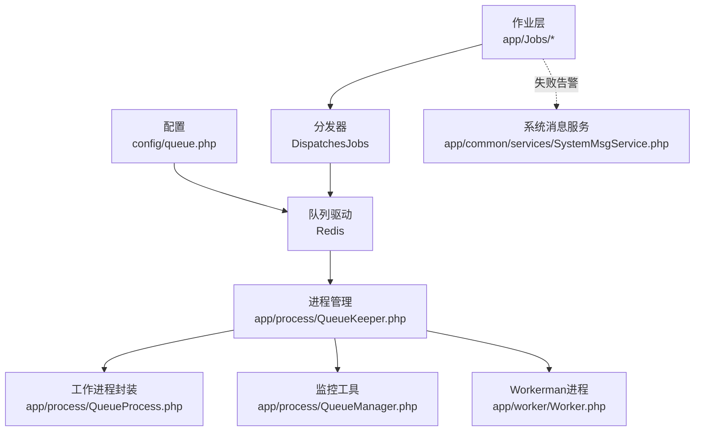
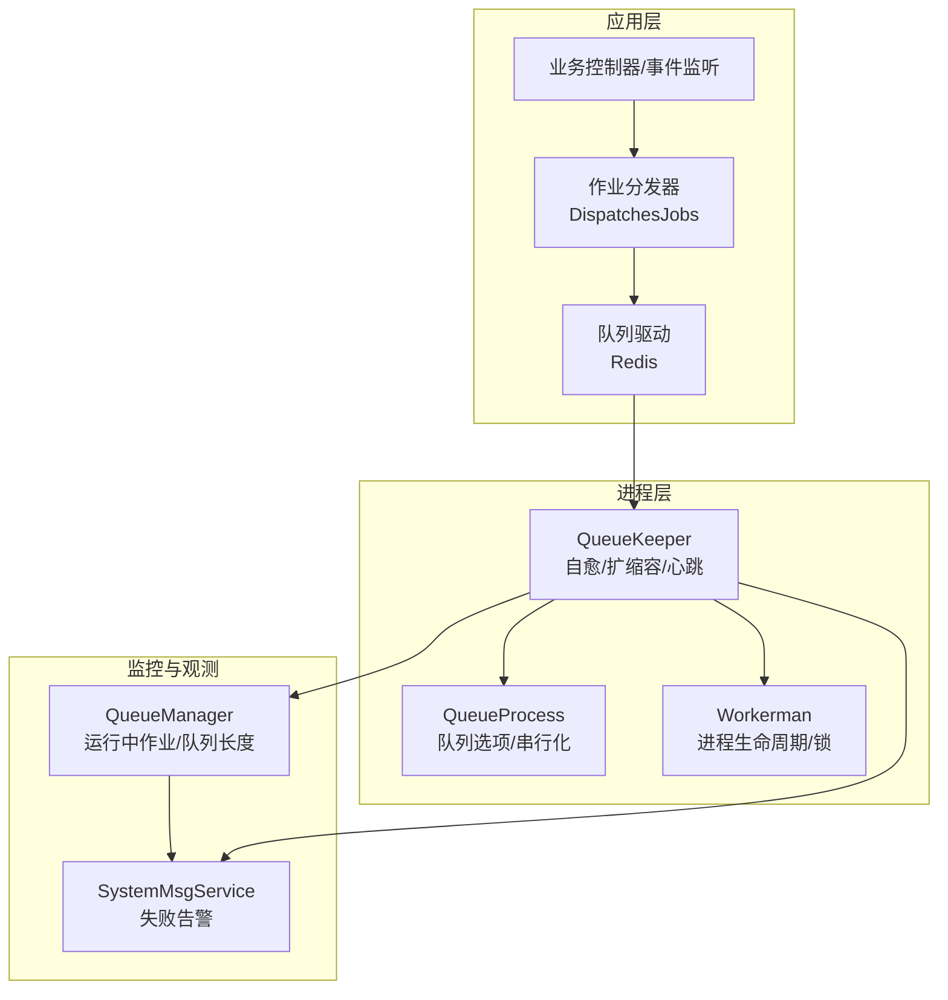
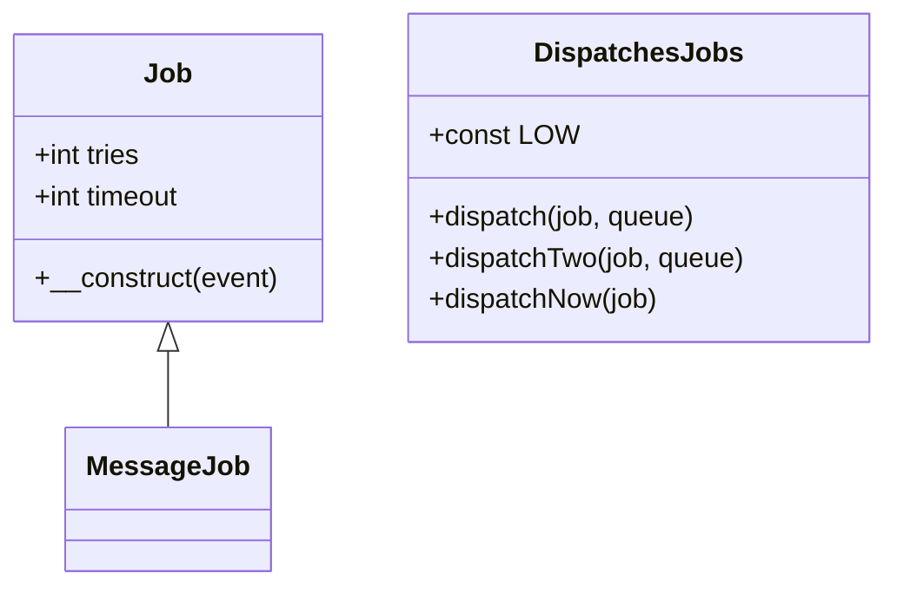
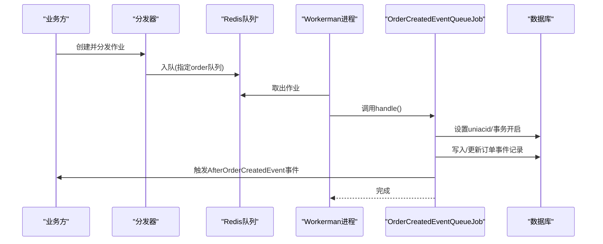
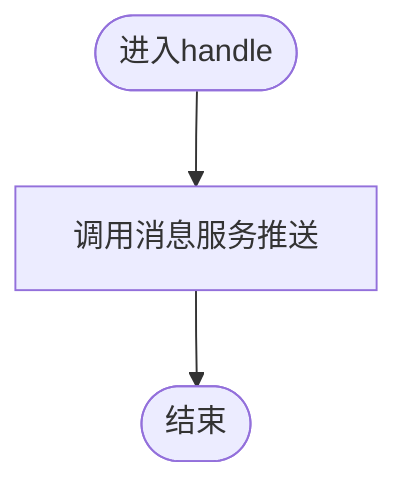
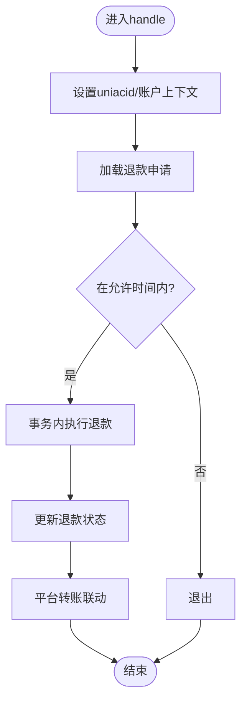
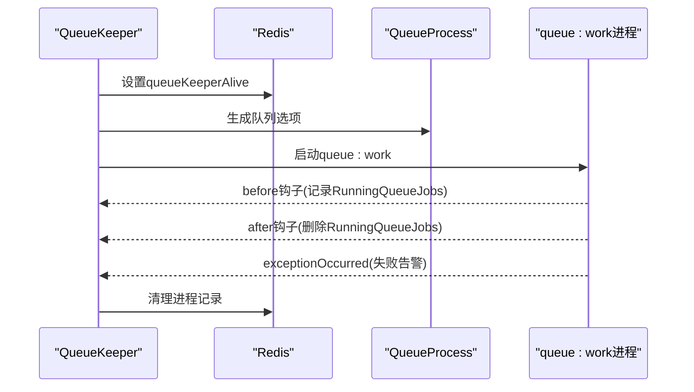
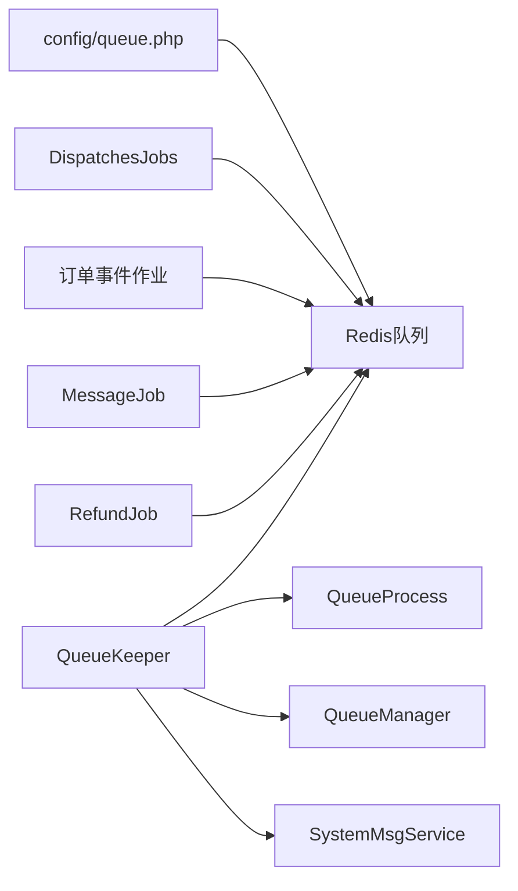

# 异步队列架构

<cite>
**本文引用的文件**   
- [app/queue.php](file://config/queue.php)
- [app/Jobs/Job.php](file://app/Jobs/Job.php)
- [app/Jobs/DispatchesJobs.php](file://app/Jobs/DispatchesJobs.php)
- [app/Jobs/MessageJob.php](file://app/Jobs/MessageJob.php)
- [app/Jobs/OrderCreatedEventQueueJob.php](file://app/Jobs/OrderCreatedEventQueueJob.php)
- [app/Jobs/OrderPaidEventQueueJob.php](file://app/Jobs/OrderPaidEventQueueJob.php)
- [app/Jobs/OrderReceivedEventQueueJob.php](file://app/Jobs/OrderReceivedEventQueueJob.php)
- [app/Jobs/OrderSentEventQueueJob.php](file://app/Jobs/OrderSentEventQueueJob.php)
- [app/Jobs/RefundJob.php](file://app/Jobs/RefundJob.php)
- [app/process/QueueKeeper.php](file://app/process/QueueKeeper.php)
- [app/process/QueueManager.php](file://app/process/QueueManager.php)
- [app/process/QueueProcess.php](file://app/process/QueueProcess.php)
- [app/worker/Worker.php](file://app/worker/Worker.php)
- [app/common/services/SystemMsgService.php](file://app/common/services/SystemMsgService.php)
</cite>

## 目录
1. [简介](#简介)
2. [项目结构](#项目结构)
3. [核心组件](#核心组件)
4. [架构总览](#架构总览)
5. [详细组件分析](#详细组件分析)
6. [依赖关系分析](#依赖关系分析)
7. [性能考量](#性能考量)
8. [故障排查指南](#故障排查指南)
9. [结论](#结论)
10. [附录](#附录)

## 简介
本文件系统性梳理芸众商城的异步队列架构，重点覆盖以下方面：
- 基础设施与设计理念：以 Redis 为队列后端、结合 Workerman 的进程模型，实现高并发、可扩展、可观测的异步处理体系。
- 组件职责划分：队列驱动配置、作业基类与分发器、订单事件作业、消息通知作业、退款作业以及进程守护与监控。
- 作业分类与实现模式：围绕订单生命周期事件、消息通知、退款结算等场景，总结67个作业的分类与通用实现套路。
- 进程管理与高可用：通过 QueueKeeper 的自愈与扩缩容策略、QueueProcess 的队列命名与串行化控制，保障稳定运行。
- 关键特性：优先级与分区（基于订单号哈希）、重试与超时、失败告警与日志、失败作业落库。
- 实践指南：作业创建、参数传递、状态监控、性能优化与故障排查。

## 项目结构
队列相关代码主要分布在以下模块：
- 配置层：队列驱动与连接配置
- 作业层：作业基类、作业分发器、各类业务作业
- 进程层：队列工作进程管理、进程守护与监控
- 工作进程层：Workerman 的进程生命周期与锁机制
- 服务层：系统消息服务用于失败告警

**图表来源**
- [config/queue.php:59-64](file://config/queue.php#L59-L64)
- [app/Jobs/DispatchesJobs.php:19-26](file://app/Jobs/DispatchesJobs.php#L19-L26)
- [app/process/QueueKeeper.php:50-95](file://app/process/QueueKeeper.php#L50-L95)
- [app/process/QueueProcess.php:26-43](file://app/process/QueueProcess.php#L26-L43)
- [app/process/QueueManager.php:11-32](file://app/process/QueueManager.php#L11-L32)
- [app/worker/Worker.php:17-32](file://app/worker/Worker.php#L17-L32)
- [app/common/services/SystemMsgService.php:155-179](file://app/common/services/SystemMsgService.php#L155-L179)

**章节来源**
- [config/queue.php:18-64](file://config/queue.php#L18-L64)
- [app/Jobs/DispatchesJobs.php:19-35](file://app/Jobs/DispatchesJobs.php#L19-L35)
- [app/process/QueueKeeper.php:50-95](file://app/process/QueueKeeper.php#L50-L95)
- [app/process/QueueProcess.php:16-43](file://app/process/QueueProcess.php#L16-L43)
- [app/process/QueueManager.php:9-32](file://app/process/QueueManager.php#L9-L32)
- [app/worker/Worker.php:17-97](file://app/worker/Worker.php#L17-L97)
- [app/common/services/SystemMsgService.php:155-179](file://app/common/services/SystemMsgService.php#L155-L179)

## 核心组件
- 队列驱动与连接
  - 默认驱动为 Redis，连接名为 default，队列名默认为 default；支持 retry_after 超时控制。
- 作业基类与分发器
  - 作业统一实现 ShouldQueue 接口，继承基类 Job，默认重试次数与超时时间可按需覆盖。
  - 分发器 DispatchesJobs 提供静态分发入口，支持按队列分类开关与队列名设置。
- 订单事件作业
  - 四类订单生命周期事件作业：创建、支付、收货、发货，均采用“按订单号哈希分区”的队列策略，确保同订单事件在同一队列顺序处理。
- 消息通知作业
  - MessageJob 继承作业基类，封装消息推送逻辑。
- 退款作业
  - RefundJob 支持有限重试与较长超时，事务内调用退款服务并进行平台转账联动。
- 进程管理与监控
  - QueueKeeper 负责队列进程的自愈、扩缩容与心跳；QueueProcess 封装队列选项与串行化；QueueManager 提供运行中作业与队列长度查询；Worker.php 提供 Workerman 的进程生命周期与分布式锁。

**章节来源**
- [config/queue.php:59-64](file://config/queue.php#L59-L64)
- [app/Jobs/Job.php:15-26](file://app/Jobs/Job.php#L15-L26)
- [app/Jobs/DispatchesJobs.php:19-35](file://app/Jobs/DispatchesJobs.php#L19-L35)
- [app/Jobs/MessageJob.php:23-32](file://app/Jobs/MessageJob.php#L23-L32)
- [app/Jobs/OrderCreatedEventQueueJob.php:37-45](file://app/Jobs/OrderCreatedEventQueueJob.php#L37-L45)
- [app/Jobs/OrderPaidEventQueueJob.php:35-43](file://app/Jobs/OrderPaidEventQueueJob.php#L35-L43)
- [app/Jobs/OrderReceivedEventQueueJob.php:36-44](file://app/Jobs/OrderReceivedEventQueueJob.php#L36-L44)
- [app/Jobs/OrderSentEventQueueJob.php:35-43](file://app/Jobs/OrderSentEventQueueJob.php#L35-L43)
- [app/Jobs/RefundJob.php:33-56](file://app/Jobs/RefundJob.php#L33-L56)
- [app/process/QueueKeeper.php:50-95](file://app/process/QueueKeeper.php#L50-L95)
- [app/process/QueueProcess.php:26-43](file://app/process/QueueProcess.php#L26-L43)
- [app/process/QueueManager.php:11-32](file://app/process/QueueManager.php#L11-L32)
- [app/worker/Worker.php:38-50](file://app/worker/Worker.php#L38-L50)

## 架构总览
整体架构由“配置—作业—分发—Redis—进程管理—监控”构成，形成闭环的异步处理链路。

**图表来源**
- [config/queue.php:59-64](file://config/queue.php#L59-L64)
- [app/Jobs/DispatchesJobs.php:19-35](file://app/Jobs/DispatchesJobs.php#L19-L35)
- [app/process/QueueKeeper.php:50-95](file://app/process/QueueKeeper.php#L50-L95)
- [app/process/QueueProcess.php:26-43](file://app/process/QueueProcess.php#L26-L43)
- [app/process/QueueManager.php:11-32](file://app/process/QueueManager.php#L11-L32)
- [app/worker/Worker.php:17-50](file://app/worker/Worker.php#L17-L50)
- [app/common/services/SystemMsgService.php:155-179](file://app/common/services/SystemMsgService.php#L155-L179)

## 详细组件分析

### 作业基类与分发器
- 作业基类 Job
  - 统一实现 ShouldQueue 接口，使用 InteractsWithQueue、Queueable、SerializesModels 特性。
  - 默认重试次数与超时时间可在具体作业中覆盖。
- 分发器 DispatchesJobs
  - 提供 dispatch/dispatchTwo/dispatchNow 方法，支持根据开关设置队列名，便于后续按队列分类管理。

**图表来源**
- [app/Jobs/Job.php:10-29](file://app/Jobs/Job.php#L10-L29)
- [app/Jobs/DispatchesJobs.php:15-46](file://app/Jobs/DispatchesJobs.php#L15-L46)
- [app/Jobs/MessageJob.php:19-34](file://app/Jobs/MessageJob.php#L19-L34)

**章节来源**
- [app/Jobs/Job.php:15-26](file://app/Jobs/Job.php#L15-L26)
- [app/Jobs/DispatchesJobs.php:19-35](file://app/Jobs/DispatchesJobs.php#L19-L35)

### 订单事件作业（四类）
- 设计要点
  - 构造函数中根据订单号对队列数取模，决定队列名，确保同一订单事件落在同一队列，避免并发冲突。
  - 事务包裹，保证数据库一致性；完成后触发对应事件。
- 典型流程（以创建事件为例）

**图表来源**
- [app/Jobs/OrderCreatedEventQueueJob.php:37-45](file://app/Jobs/OrderCreatedEventQueueJob.php#L37-L45)
- [app/Jobs/OrderCreatedEventQueueJob.php:52-82](file://app/Jobs/OrderCreatedEventQueueJob.php#L52-L82)
- [config/queue.php:59-64](file://config/queue.php#L59-L64)

**章节来源**
- [app/Jobs/OrderCreatedEventQueueJob.php:37-45](file://app/Jobs/OrderCreatedEventQueueJob.php#L37-L45)
- [app/Jobs/OrderPaidEventQueueJob.php:35-43](file://app/Jobs/OrderPaidEventQueueJob.php#L35-L43)
- [app/Jobs/OrderReceivedEventQueueJob.php:36-44](file://app/Jobs/OrderReceivedEventQueueJob.php#L36-L44)
- [app/Jobs/OrderSentEventQueueJob.php:35-43](file://app/Jobs/OrderSentEventQueueJob.php#L35-L43)

### 消息通知作业
- MessageJob
  - 继承作业基类，handle 中调用消息服务推送，参数来自构造注入的事件对象。
- 适用场景
  - 微信模板消息、短信、站内信等异步推送。

**图表来源**
- [app/Jobs/MessageJob.php:23-32](file://app/Jobs/MessageJob.php#L23-L32)

**章节来源**
- [app/Jobs/MessageJob.php:23-32](file://app/Jobs/MessageJob.php#L23-L32)

### 退款作业
- 特性
  - 有限重试与较长超时，事务内调用退款服务，成功后更新退款状态并联动平台转账。
- 关键判断
  - 支付方式过滤、时间窗口限制、状态校验等前置条件。

**图表来源**
- [app/Jobs/RefundJob.php:61-122](file://app/Jobs/RefundJob.php#L61-L122)

**章节来源**
- [app/Jobs/RefundJob.php:33-56](file://app/Jobs/RefundJob.php#L33-L56)
- [app/Jobs/RefundJob.php:61-122](file://app/Jobs/RefundJob.php#L61-L122)

### 进程管理与监控
- QueueKeeper
  - 生命周期钩子：before/after/exceptionOccurred/stopping，维护 RunningQueueJobs 哈希，记录/清理运行中的作业。
  - 自愈与扩缩容：根据配置计算总队列数、按主机均摊、检测本地进程数与阈值，动态启停队列进程。
  - 心跳：维护 queueKeeperAlive 键，用于健康检查。
- QueueProcess
  - 动态拼装 queue:work 参数，支持串行化队列（is_serial）与多索引队列命名。
- QueueManager
  - 查询运行中作业与队列长度，辅助运维与容量规划。
- Worker.php
  - Workerman 的进程生命周期与分布式锁，避免重复启动。

**图表来源**
- [app/process/QueueKeeper.php:66-93](file://app/process/QueueKeeper.php#L66-L93)
- [app/process/QueueKeeper.php:121-156](file://app/process/QueueKeeper.php#L121-L156)
- [app/process/QueueProcess.php:26-43](file://app/process/QueueProcess.php#L26-L43)
- [app/process/QueueManager.php:11-32](file://app/process/QueueManager.php#L11-L32)
- [app/worker/Worker.php:38-50](file://app/worker/Worker.php#L38-L50)

**章节来源**
- [app/process/QueueKeeper.php:50-95](file://app/process/QueueKeeper.php#L50-L95)
- [app/process/QueueKeeper.php:121-156](file://app/process/QueueKeeper.php#L121-L156)
- [app/process/QueueProcess.php:16-43](file://app/process/QueueProcess.php#L16-L43)
- [app/process/QueueManager.php:11-32](file://app/process/QueueManager.php#L11-L32)
- [app/worker/Worker.php:38-50](file://app/worker/Worker.php#L38-L50)

## 依赖关系分析
- 驱动与配置
  - 队列驱动为 Redis，连接名为 default，队列名默认为 default；失败作业记录表为 failed_jobs。
- 作业到队列
  - 通过分发器将作业推送到 Redis 队列；订单事件作业按订单号哈希分区。
- 进程到作业
  - QueueKeeper 启动多个 queue:work 子进程，每个进程消费指定队列；QueueProcess 控制队列名与串行化。
- 观测与告警
  - QueueManager 提供运行中作业与队列长度；SystemMsgService 在作业异常时写入系统消息日志。

**图表来源**
- [config/queue.php:59-64](file://config/queue.php#L59-L64)
- [app/Jobs/DispatchesJobs.php:19-35](file://app/Jobs/DispatchesJobs.php#L19-L35)
- [app/Jobs/OrderCreatedEventQueueJob.php:37-45](file://app/Jobs/OrderCreatedEventQueueJob.php#L37-L45)
- [app/Jobs/MessageJob.php:23-32](file://app/Jobs/MessageJob.php#L23-L32)
- [app/Jobs/RefundJob.php:61-122](file://app/Jobs/RefundJob.php#L61-L122)
- [app/process/QueueKeeper.php:50-95](file://app/process/QueueKeeper.php#L50-L95)
- [app/process/QueueProcess.php:26-43](file://app/process/QueueProcess.php#L26-L43)
- [app/process/QueueManager.php:11-32](file://app/process/QueueManager.php#L11-L32)
- [app/common/services/SystemMsgService.php:155-179](file://app/common/services/SystemMsgService.php#L155-L179)

**章节来源**
- [config/queue.php:79-82](file://config/queue.php#L79-L82)
- [app/Jobs/DispatchesJobs.php:19-35](file://app/Jobs/DispatchesJobs.php#L19-L35)
- [app/process/QueueKeeper.php:50-95](file://app/process/QueueKeeper.php#L50-L95)
- [app/process/QueueManager.php:22-32](file://app/process/QueueManager.php#L22-L32)
- [app/common/services/SystemMsgService.php:155-179](file://app/common/services/SystemMsgService.php#L155-L179)

## 性能考量
- 队列分区与顺序性
  - 订单事件作业按订单号哈希分区，确保同订单事件串行处理，避免跨订单并发问题。
- 重试与超时
  - 作业基类提供默认重试与超时，具体作业可覆盖；退款作业设置较短重试次数与较长超时，平衡吞吐与可靠性。
- 进程扩缩容
  - QueueKeeper 根据配置与主机数均摊队列数，动态启停进程，防止过载或资源浪费。
- 监控与容量
  - 通过 QueueManager 查询队列长度与运行中作业，辅助容量规划与瓶颈定位。

**章节来源**
- [app/Jobs/OrderCreatedEventQueueJob.php:37-45](file://app/Jobs/OrderCreatedEventQueueJob.php#L37-L45)
- [app/Jobs/RefundJob.php:33-56](file://app/Jobs/RefundJob.php#L33-L56)
- [app/process/QueueKeeper.php:121-156](file://app/process/QueueKeeper.php#L121-L156)
- [app/process/QueueManager.php:22-32](file://app/process/QueueManager.php#L22-L32)

## 故障排查指南
- 常见问题定位
  - 作业未执行：检查 Redis 队列是否存在、QueueKeeper 是否存活、queue:work 进程是否正常。
  - 作业堆积：查看队列长度与 RunningQueueJobs，确认是否有长时间运行或卡住的任务。
  - 失败告警：exceptionOccurred 钩子会写入系统消息日志，结合日志定位异常。
- 关键步骤
  - 查看队列长度与运行中作业：使用 QueueManager 的 jobCounts 与 runningJobs。
  - 检查进程健康：通过 queueKeeperAlive 与主机 PID 列表核对。
  - 复核配置：核对 queue.php 的连接与 retry_after，以及分发器的队列分类开关。

**章节来源**
- [app/process/QueueKeeper.php:66-93](file://app/process/QueueKeeper.php#L66-L93)
- [app/process/QueueKeeper.php:121-156](file://app/process/QueueKeeper.php#L121-L156)
- [app/process/QueueManager.php:11-32](file://app/process/QueueManager.php#L11-L32)
- [app/common/services/SystemMsgService.php:155-179](file://app/common/services/SystemMsgService.php#L155-L179)

## 结论
该队列架构以 Redis 为核心，结合 Workerman 的进程模型与自愈机制，实现了高可用、可观测、可扩展的异步处理能力。通过作业基类与分发器统一入口、订单事件的分区策略、以及进程层的动态扩缩容，系统在复杂业务场景下仍能保持稳定与高效。建议在实际落地中持续完善监控指标、优化重试策略与队列分区粒度，并加强异常告警与回放能力。

## 附录
- 开发实践清单
  - 新增作业：继承作业基类，定义 handle 逻辑，必要时覆盖重试与超时。
  - 参数传递：通过构造函数注入事件或参数对象，确保序列化安全。
  - 队列选择：如需强顺序，沿用订单事件的哈希分区策略；如需隔离，新增独立队列。
  - 状态监控：利用 QueueManager 查询队列长度与运行中作业，建立告警阈值。
  - 失败处理：依赖 exceptionOccurred 钩子与 SystemMsgService，保留完整日志以便回溯。