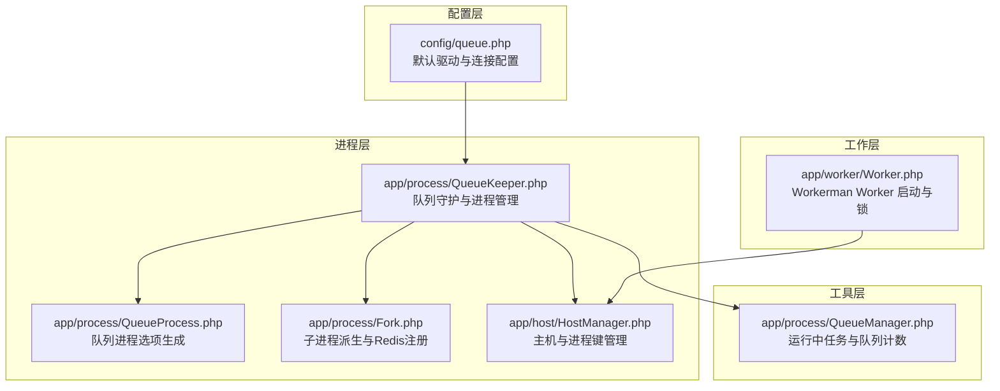
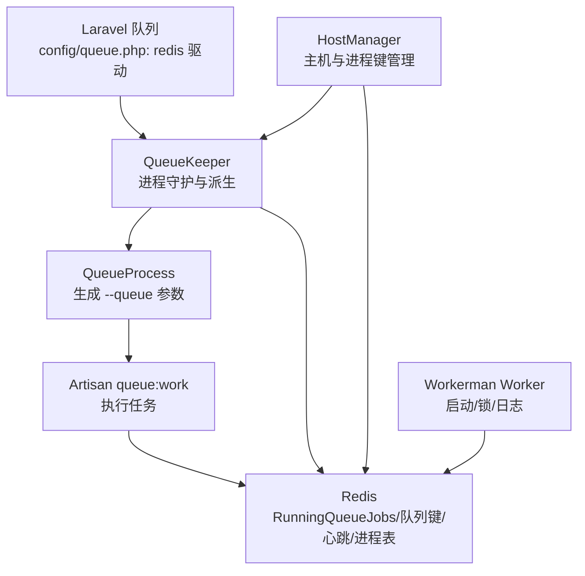
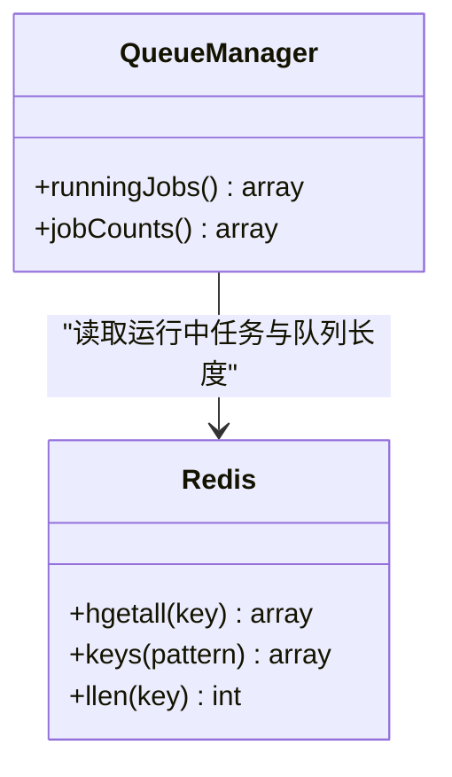
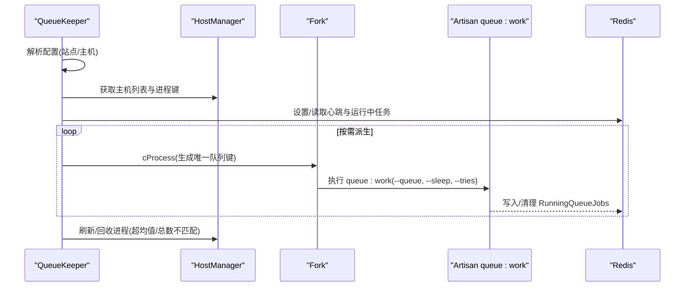
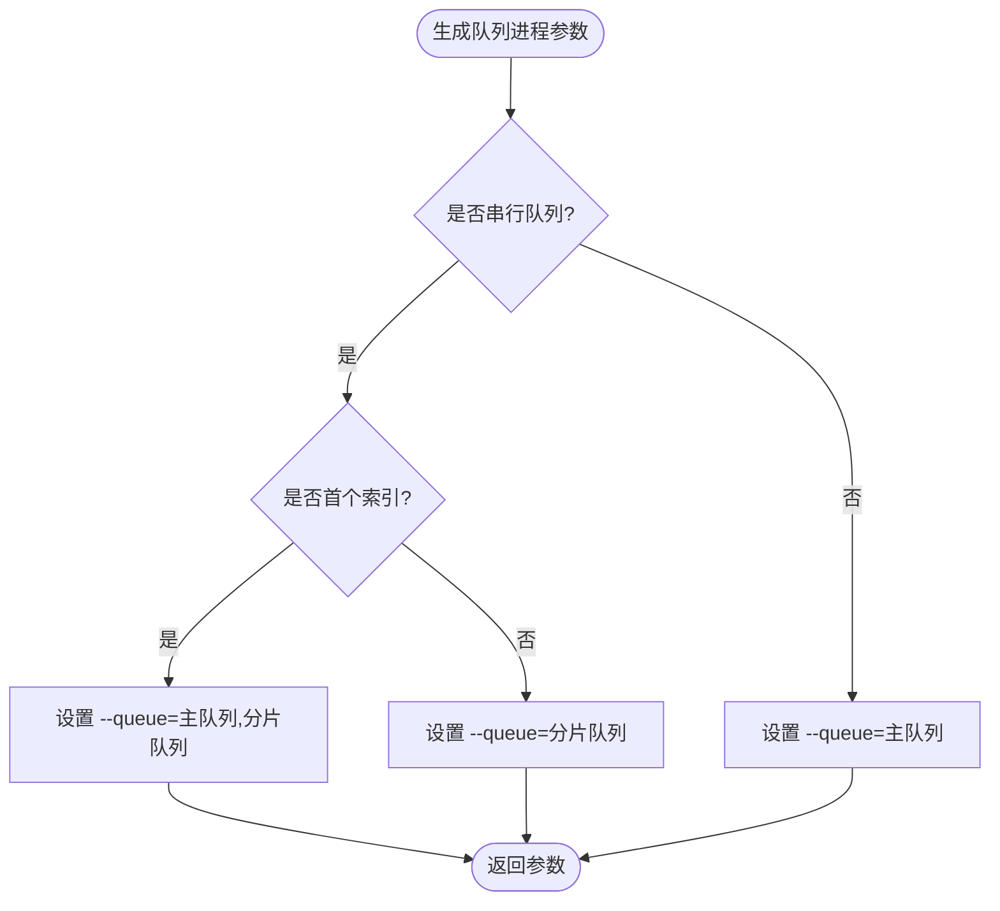
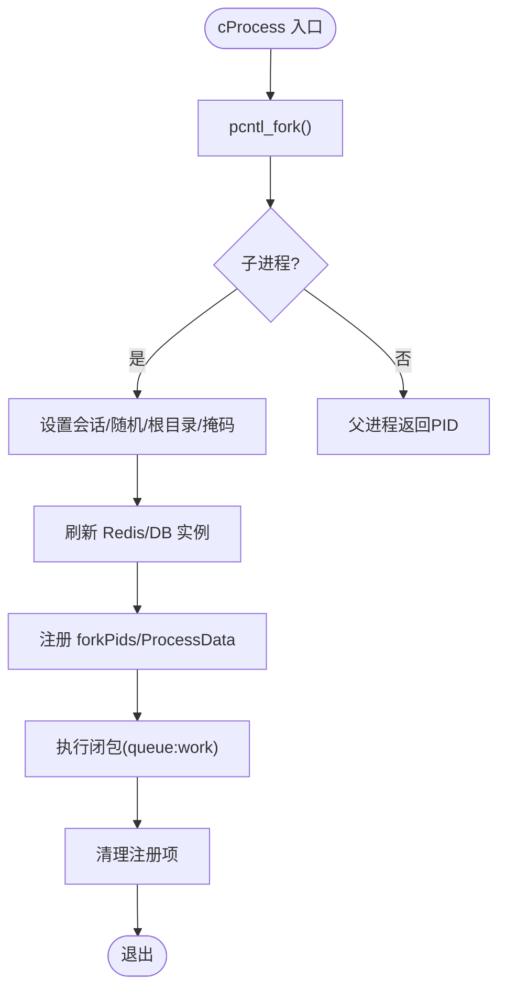
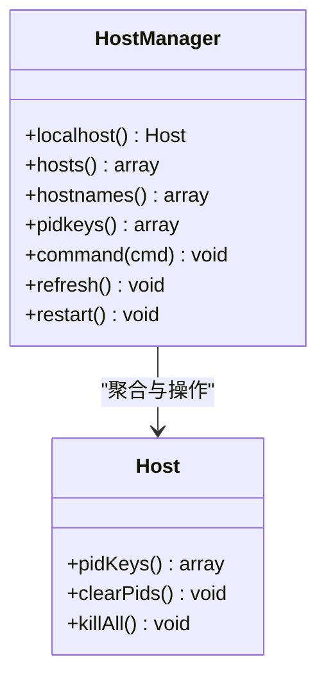
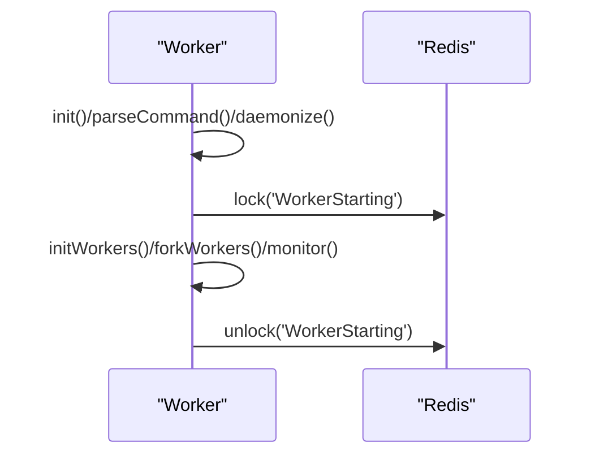
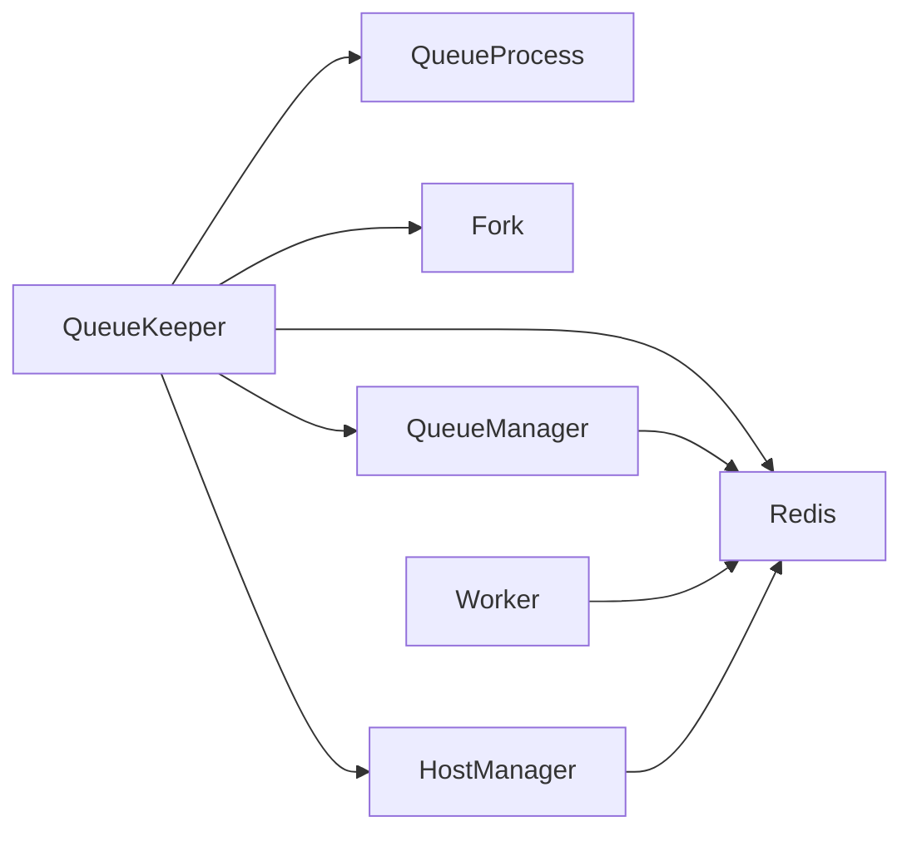

# 队列基础设施

<cite>
**本文引用的文件**
- [config/queue.php](file://config/queue.php)
- [app/process/QueueManager.php](file://app/process/QueueManager.php)
- [app/process/QueueKeeper.php](file://app/process/QueueKeeper.php)
- [app/process/QueueProcess.php](file://app/process/QueueProcess.php)
- [app/process/Fork.php](file://app/process/Fork.php)
- [app/host/HostManager.php](file://app/host/HostManager.php)
- [app/worker/Worker.php](file://app/worker/Worker.php)
</cite>

## 目录
1. [引言](#引言)
2. [项目结构](#项目结构)
3. [核心组件](#核心组件)
4. [架构总览](#架构总览)
5. [详细组件分析](#详细组件分析)
6. [依赖关系分析](#依赖关系分析)
7. [性能考量](#性能考量)
8. [故障排查指南](#故障排查指南)
9. [结论](#结论)
10. [附录](#附录)

## 引言
本文件面向“队列基础设施”的技术文档，聚焦于基于 Redis 的 Laravel 队列与 Workerman 的异步处理架构。重点覆盖以下方面：
- QueueManager 的职责与工作机制（运行中任务查询、队列长度统计）
- 队列连接配置、驱动选择与与 Laravel 队列系统的集成方式
- QueueKeeper 的进程守护机制（心跳检测、异常恢复、进程重启）
- Workerman 的 Worker 进程模型（进程池管理、消息处理循环、内存优化策略）
- 队列配置最佳实践（连接池、超时、并发控制）
- 性能调优参数与监控指标配置方法

## 项目结构
围绕队列基础设施的关键代码分布在以下模块：
- 配置层：Laravel 队列驱动与连接配置
- 进程层：队列守护与派生进程、主机与进程管理
- 工作层：Workerman Worker 的启动与锁机制
- 工具层：队列任务状态与计数查询

**图表来源**
- [config/queue.php:1-85](file://config/queue.php#L1-L85)
- [app/process/QueueKeeper.php:1-217](file://app/process/QueueKeeper.php#L1-L217)
- [app/process/QueueProcess.php:1-44](file://app/process/QueueProcess.php#L1-L44)
- [app/process/Fork.php:1-96](file://app/process/Fork.php#L1-L96)
- [app/host/HostManager.php:1-98](file://app/host/HostManager.php#L1-L98)
- [app/process/QueueManager.php:1-33](file://app/process/QueueManager.php#L1-L33)
- [app/worker/Worker.php:1-113](file://app/worker/Worker.php#L1-L113)

**章节来源**
- [config/queue.php:1-85](file://config/queue.php#L1-L85)
- [app/process/QueueKeeper.php:1-217](file://app/process/QueueKeeper.php#L1-L217)
- [app/process/QueueProcess.php:1-44](file://app/process/QueueProcess.php#L1-L44)
- [app/process/Fork.php:1-96](file://app/process/Fork.php#L1-L96)
- [app/host/HostManager.php:1-98](file://app/host/HostManager.php#L1-L98)
- [app/process/QueueManager.php:1-33](file://app/process/QueueManager.php#L1-L33)
- [app/worker/Worker.php:1-113](file://app/worker/Worker.php#L1-L113)

## 核心组件
- QueueManager：从 Redis 中读取运行中的任务哈希与队列键集合，反序列化命令并统计各队列长度，用于运维监控与可观测性。
- QueueKeeper：队列守护进程，负责根据站点配置与主机数量动态派生队列工作进程，维护心跳、异常处理、进程清理与重启。
- QueueProcess：根据队列名称、总数与序号生成 Artisan 队列工作命令的参数，支持串行队列的分片组合。
- Fork：在 CLI 环境下派生子进程，设置会话、随机种子、根目录与文件描述符，刷新 Redis/DB 连接，向 Redis 注册进程键。
- HostManager：统一管理主机列表、进程键集合、远程命令下发与主机刷新。
- Worker：Workerman Worker 的扩展，提供启动流程、Redis 锁定/解锁、日志与状态文件管理。

**章节来源**
- [app/process/QueueManager.php:1-33](file://app/process/QueueManager.php#L1-L33)
- [app/process/QueueKeeper.php:1-217](file://app/process/QueueKeeper.php#L1-L217)
- [app/process/QueueProcess.php:1-44](file://app/process/QueueProcess.php#L1-L44)
- [app/process/Fork.php:1-96](file://app/process/Fork.php#L1-L96)
- [app/host/HostManager.php:1-98](file://app/host/HostManager.php#L1-L98)
- [app/worker/Worker.php:1-113](file://app/worker/Worker.php#L1-L113)

## 架构总览
该架构以 Redis 作为队列后端与进程协调中心，结合 Laravel 队列与 Workerman 的进程模型，形成高可用、可伸缩的异步处理体系。

**图表来源**
- [config/queue.php:59-64](file://config/queue.php#L59-L64)
- [app/process/QueueKeeper.php:50-95](file://app/process/QueueKeeper.php#L50-L95)
- [app/process/QueueProcess.php:26-43](file://app/process/QueueProcess.php#L26-L43)
- [app/process/Fork.php:36-75](file://app/process/Fork.php#L36-L75)
- [app/host/HostManager.php:44-54](file://app/host/HostManager.php#L44-L54)
- [app/worker/Worker.php:17-50](file://app/worker/Worker.php#L17-L50)

## 详细组件分析

### QueueManager 组件分析
职责与机制
- 运行中任务查询：通过 Redis 哈希键聚合运行中的任务，反序列化命令对象，便于监控与排障。
- 队列长度统计：扫描以“queues:”开头的队列键，排除 reserved/delayed，统计各队列长度，辅助容量规划。

复杂度与性能
- 时间复杂度：运行中任务遍历 O(n)，队列键扫描 O(m)，其中 n 为运行中任务数，m 为队列键数；Redis 操作为 O(1)/O(k)。
- 空间复杂度：返回结果集大小与 n/m 成正比。

错误处理与边界
- 对不存在的哈希/键进行安全访问，避免异常中断。
- 排除 reserved/delayed 队列键，确保统计口径一致。

**图表来源**
- [app/process/QueueManager.php:11-32](file://app/process/QueueManager.php#L11-L32)
- [app/process/QueueManager.php:7](file://app/process/QueueManager.php#L7)

**章节来源**
- [app/process/QueueManager.php:1-33](file://app/process/QueueManager.php#L1-L33)

### QueueKeeper 组件分析
职责与机制
- 配置解析：合并站点级与主机级队列配置，按主机数量动态调整每台机器的队列总数。
- 生命周期钩子：在队列循环前校验自身 PID 与 Keeper 存活；任务开始/结束/异常分别写入/清理 Redis 记录，并记录日志。
- 心跳与自愈：定期刷新队列进程数量，维持全局目标与单机均值之间的平衡；当超过均值 1.5 倍或总数不匹配时触发刷新与回收。
- 进程派生：逐个生成唯一队列键，避免跨主机重复，使用 cProcess 派生子进程执行 queue:work。

**图表来源**
- [app/process/QueueKeeper.php:30-48](file://app/process/QueueKeeper.php#L30-L48)
- [app/process/QueueKeeper.php:60-95](file://app/process/QueueKeeper.php#L60-L95)
- [app/process/QueueKeeper.php:121-156](file://app/process/QueueKeeper.php#L121-L156)
- [app/process/QueueKeeper.php:185-214](file://app/process/QueueKeeper.php#L185-L214)
- [app/process/Fork.php:36-75](file://app/process/Fork.php#L36-L75)

**章节来源**
- [app/process/QueueKeeper.php:1-217](file://app/process/QueueKeeper.php#L1-L217)
- [app/process/Fork.php:1-96](file://app/process/Fork.php#L1-L96)
- [app/host/HostManager.php:1-98](file://app/host/HostManager.php#L1-L98)

### QueueProcess 组件分析
职责与机制
- 串行队列支持：当 isSerial 为真时，首个索引组合“主队列,分片队列”，其余仅使用分片队列，保证串行顺序。
- 默认参数：为每个队列进程注入 sleep 与 tries 等默认参数，确保稳定性与容错。

**图表来源**
- [app/process/QueueProcess.php:26-43](file://app/process/QueueProcess.php#L26-L43)

**章节来源**
- [app/process/QueueProcess.php:1-44](file://app/process/QueueProcess.php#L1-L44)

### Fork 组件分析
职责与机制
- 子进程派生：使用 pcntl_fork 创建子进程，父进程继续执行，子进程设置会话、随机种子、根目录与掩码，刷新 Redis/DB 实例，注册进程键到 Redis。
- 进程命名：通过 cli_set_process_title 或 setproctitle 设置进程标题，便于进程树识别。
- 安全退出：子进程执行闭包后清理 Redis 注册项并退出。

**图表来源**
- [app/process/Fork.php:36-75](file://app/process/Fork.php#L36-L75)

**章节来源**
- [app/process/Fork.php:1-96](file://app/process/Fork.php#L1-L96)

### HostManager 组件分析
职责与机制
- 主机发现：从 Redis 哈希中读取主机名，过滤掉无进程键的主机，得到活跃主机集合。
- 进程键聚合：汇总所有主机的进程键，用于全局统计与自愈判断。
- 远程命令：向每台主机推送命令队列，实现集中式控制。
- 刷新与重启：清空本地 PID 并终止全部队列进程，配合 QueueKeeper 的自愈逻辑。

**图表来源**
- [app/host/HostManager.php:10-98](file://app/host/HostManager.php#L10-L98)

**章节来源**
- [app/host/HostManager.php:1-98](file://app/host/HostManager.php#L1-L98)

### Worker 组件分析
职责与机制
- 启动流程：封装 Workerman 的启动步骤，包括环境检查、初始化、守护化、安装信号、保存 Master PID、fork 子进程与监控。
- Redis 锁：在启动前加锁，启动后解锁，避免多实例同时启动造成冲突。
- 日志与状态：设置 PID 文件、日志文件与状态文件路径，提供简单日志输出接口。

**图表来源**
- [app/worker/Worker.php:17-50](file://app/worker/Worker.php#L17-L50)
- [app/worker/Worker.php:38-50](file://app/worker/Worker.php#L38-L50)

**章节来源**
- [app/worker/Worker.php:1-113](file://app/worker/Worker.php#L1-L113)

## 依赖关系分析
- QueueKeeper 依赖 QueueProcess 生成参数，依赖 Fork 派生子进程，依赖 HostManager 管理主机与进程键，依赖 Redis 进行心跳与运行中任务登记。
- QueueManager 依赖 Redis 提供运行中任务与队列长度信息。
- Worker 依赖 Redis 进行启动阶段的互斥锁。
- HostManager 作为跨主机协调中心，被 QueueKeeper 与 Worker 调用。

**图表来源**
- [app/process/QueueKeeper.php:1-217](file://app/process/QueueKeeper.php#L1-L217)
- [app/process/QueueProcess.php:1-44](file://app/process/QueueProcess.php#L1-L44)
- [app/process/Fork.php:1-96](file://app/process/Fork.php#L1-L96)
- [app/host/HostManager.php:1-98](file://app/host/HostManager.php#L1-L98)
- [app/process/QueueManager.php:1-33](file://app/process/QueueManager.php#L1-L33)
- [app/worker/Worker.php:1-113](file://app/worker/Worker.php#L1-L113)

**章节来源**
- [app/process/QueueKeeper.php:1-217](file://app/process/QueueKeeper.php#L1-L217)
- [app/process/QueueManager.php:1-33](file://app/process/QueueManager.php#L1-L33)
- [app/process/QueueProcess.php:1-44](file://app/process/QueueProcess.php#L1-L44)
- [app/process/Fork.php:1-96](file://app/process/Fork.php#L1-L96)
- [app/host/HostManager.php:1-98](file://app/host/HostManager.php#L1-L98)
- [app/worker/Worker.php:1-113](file://app/worker/Worker.php#L1-L113)

## 性能考量
- 连接与并发
  - Redis 连接：建议在应用侧启用连接池与长连接复用，避免频繁创建销毁连接带来的开销。
  - 队列并发：通过 QueueKeeper 的配置项 total 控制每台机器的队列进程数，结合主机数量与业务峰值计算总并发。
  - 串行队列：对强顺序需求的队列启用串行模式，减少竞争但降低吞吐。
- 超时与重试
  - retry_after：Redis 队列的默认超时时间，应结合任务最长执行时间设置，避免僵尸任务。
  - sleep：QueueProcess 注入的 --sleep 控制轮询间隔，过小增加 CPU 占用，过大影响响应延迟。
  - tries：失败重试次数，建议与任务幂等性结合，防止无限重试。
- 内存优化
  - Worker 进程模型：Workerman 使用事件驱动与多进程，注意在任务中及时释放大对象，避免内存泄漏。
  - QueueKeeper 自愈：当单机进程数超过均值 1.5 倍时触发回收，保持资源均衡。
- 监控指标
  - 运行中任务数：通过 RunningQueueJobs 统计，结合队列长度与处理速率评估负载。
  - 心跳与存活：queueKeeperAlive 与 forkPids/ProcessData 用于判断守护与进程存活。
  - 主机分布：通过 HostManager 的进程键聚合，观察跨主机的任务分布是否均衡。

[本节为通用性能指导，无需具体文件引用]

## 故障排查指南
- 队列未启动或进程异常
  - 检查 queueKeeperAlive 是否存在，确认 QueueKeeper 是否存活。
  - 查看 Redis 中 RunningQueueJobs 是否堆积，定位卡住的任务。
  - 使用 QueueManager 的 jobCounts 与 runningJobs 辅助定位。
- 进程数量异常
  - 若存活进程数大于配置总数，触发 HostManager::refresh 清理多余进程。
  - 若低于均值，QueueKeeper 会自动派生新进程，检查派生日志与 Redis 注册项。
- 异常与告警
  - QueueKeeper 在异常发生时清理 RunningQueueJobs 并记录日志，同时通过系统消息服务上报。
  - Worker 启动阶段使用 Redis 锁避免重复启动，若锁失败需检查 Redis 可用性与权限。
- 数据库/缓存问题
  - Fork 子进程在启动时刷新 Redis/DB 实例，若出现连接异常，优先检查连接池与凭据。

**章节来源**
- [app/process/QueueKeeper.php:121-156](file://app/process/QueueKeeper.php#L121-L156)
- [app/process/QueueKeeper.php:79-88](file://app/process/QueueKeeper.php#L79-L88)
- [app/process/Fork.php:63-64](file://app/process/Fork.php#L63-L64)
- [app/worker/Worker.php:38-50](file://app/worker/Worker.php#L38-L50)

## 结论
该队列基础设施通过 Redis 与 Laravel/Workerman 的协同，实现了高可用、可伸缩的异步处理能力。QueueKeeper 负责全局调度与自愈，QueueProcess 提供灵活的参数生成，Fork 保障子进程隔离与资源刷新，HostManager 统一跨主机管理，Worker 提供稳定的进程生命周期与锁机制。配合合理的配置与监控，可在生产环境中获得稳定且高性能的队列处理体验。

[本节为总结性内容，无需具体文件引用]

## 附录

### 队列连接配置与 Laravel 集成要点
- 默认驱动：Redis 驱动，连接名为 default，队列为 default，retry_after 为 600 秒。
- 失败任务存储：失败任务写入数据库的 failed_jobs 表，便于离线重放与审计。
- 与 Artisan 集成：QueueKeeper 通过 Artisan::call("queue:work", ...) 启动任务处理，参数由 QueueProcess 生成。

**章节来源**
- [config/queue.php:59-82](file://config/queue.php#L59-L82)
- [app/process/QueueProcess.php:26-43](file://app/process/QueueProcess.php#L26-L43)
- [app/process/QueueKeeper.php:205](file://app/process/QueueKeeper.php#L205)