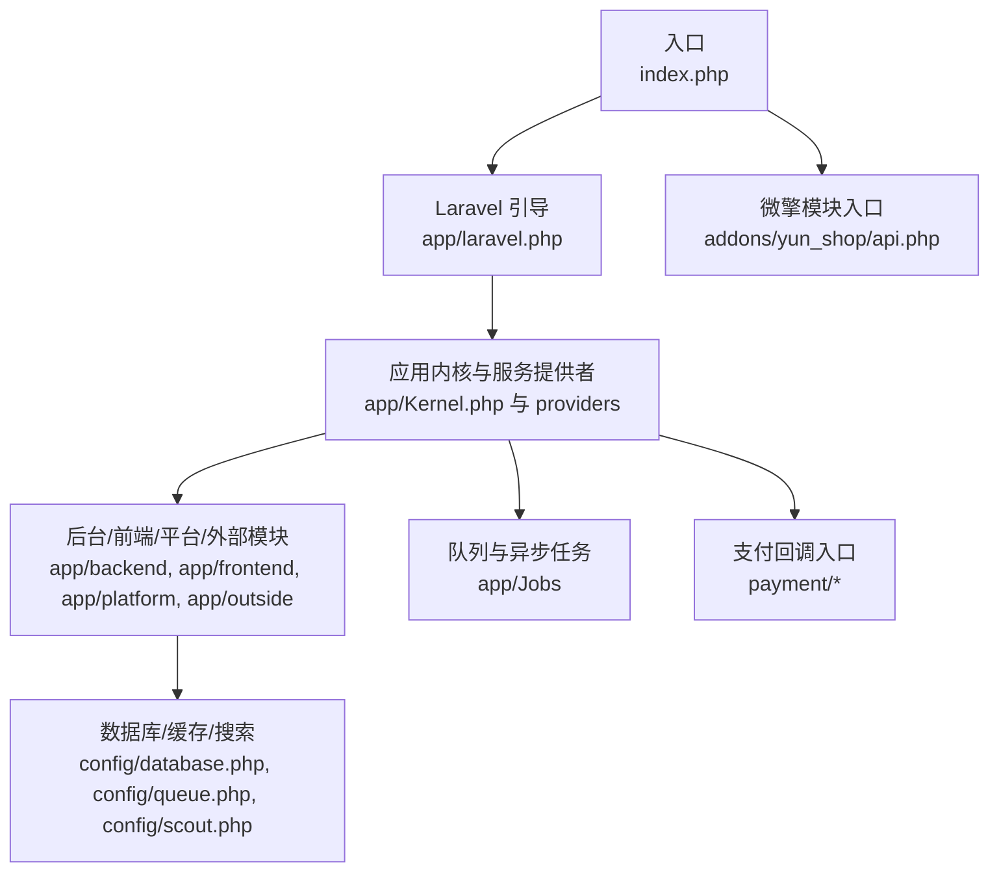
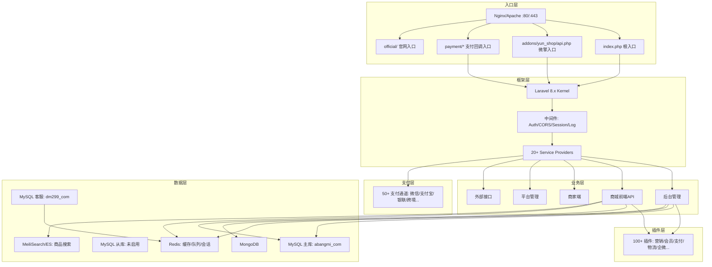
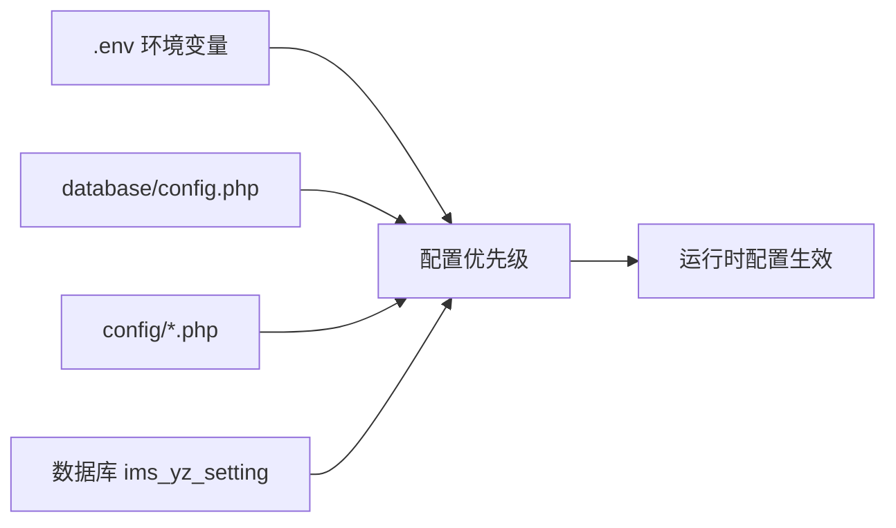

# 快速开始

<cite>
**本文引用的文件**
- [composer.json](file://composer.json)
- [index.php](file://index.php)
- [bootstrap/app.php](file://bootstrap/app.php)
- [config/app.php](file://config/app.php)
- [config/database.php](file://config/database.php)
- [config/mail.php](file://config/mail.php)
- [config/queue.php](file://config/queue.php)
- [database/config.php](file://database/config.php)
- [database/redis.php](file://database/redis.php)
- [package.json](file://package.json)
- [daemon.sh](file://daemon.sh)
- [docs/部署与配置.md](file://docs/部署与配置.md)
- [README.md](file://README.md)
</cite>

## 目录
1. [简介](#简介)
2. [项目结构](#项目结构)
3. [核心组件](#核心组件)
4. [架构总览](#架构总览)
5. [详细组件分析](#详细组件分析)
6. [依赖分析](#依赖分析)
7. [性能考虑](#性能考虑)
8. [故障排查指南](#故障排查指南)
9. [结论](#结论)
10. [附录](#附录)

## 简介
本指南面向首次接触芸众商城（abangmishop）的开发者与运维人员，目标是在最短时间内完成环境准备、安装部署、基础配置与启动验证。内容涵盖：
- 环境要求与依赖安装
- 数据库与缓存配置
- 环境变量与配置文件优先级
- 本地开发与生产部署差异
- 常见问题排查与最佳实践
- 初始配置建议与后续运维要点

## 项目结构
芸众商城采用“Laravel + 微擎兼容”的混合架构，入口统一由 index.php 分发至 Laravel 引导与微擎模块。核心目录与职责概览如下：
- 入口与多入口：index.php、api.php、shop.php、processor.php、cron.php 等
- Laravel 应用：app/（内核、公共模块、后台/前端/平台/外部模块、队列作业、框架扩展）
- 配置与数据库：config/、database/（含微擎兼容配置与迁移）
- 支付回调：payment/（50+ 支付通道回调）
- 插件与模块：addons/yun_shop/、plugins/
- 官网与静态资源：official/、static/、resources/

图表来源
- [index.php:1-15](file://index.php#L1-L15)
- [bootstrap/app.php:1-63](file://bootstrap/app.php#L1-L63)
- [config/database.php:137-304](file://config/database.php#L137-L304)
- [config/queue.php:1-85](file://config/queue.php#L1-L85)

章节来源
- [docs/部署与配置.md:229-317](file://docs/部署与配置.md#L229-L317)
- [README.md:1-3](file://README.md#L1-L3)

## 核心组件
- 应用内核与引导
  - 应用实例在 bootstrap/app.php 中创建，并绑定 HTTP/Console 内核与异常处理器。
  - 应用通过 app/laravel.php 与 app/yunshop.php 完成框架与核心业务初始化。
- 配置系统
  - config/app.php 定义应用名称、环境、时区、语言、服务提供者与别名等。
  - config/database.php 支持主库、从库、客服库、Redis、MongoDB 的集中配置，并兼容微擎 data/config.php。
  - config/mail.php、config/queue.php 提供邮件与队列驱动配置。
- 入口与路由分发
  - index.php 对根路径进行 301 跳转至官网，其余请求交由 Laravel 引导处理。

章节来源
- [bootstrap/app.php:14-63](file://bootstrap/app.php#L14-L63)
- [config/app.php:1-309](file://config/app.php#L1-L309)
- [config/database.php:137-304](file://config/database.php#L137-L304)
- [config/mail.php:1-124](file://config/mail.php#L1-L124)
- [config/queue.php:1-85](file://config/queue.php#L1-L85)
- [index.php:1-15](file://index.php#L1-L15)

## 架构总览
芸众商城整体架构由“入口层 → 框架层 → 业务层 → 插件层 → 支付层 → 数据层”构成，支持多入口与多路由分发，具备完善的队列、缓存、搜索与第三方集成能力。

图表来源
- [docs/部署与配置.md:155-228](file://docs/部署与配置.md#L155-L228)

章节来源
- [docs/部署与配置.md:155-228](file://docs/部署与配置.md#L155-L228)

## 详细组件分析

### 环境与依赖安装
- PHP 与扩展
  - PHP 版本要求：^7.4 或 ^8.0
  - 必需扩展：pdo、pdo_mysql、redis、mongodb、gd、curl、mbstring、xml、bcmath、fileinfo
- 数据库
  - MySQL 5.7+，推荐 InnoDB，字符集 utf8mb4
- 缓存与搜索引擎
  - Redis 6.0+（队列/缓存/会话）
  - MeiliSearch 1.0+ 或 Elasticsearch（商品搜索）
- Web 服务器
  - Nginx 1.18+（推荐），或 Apache
- 工具链
  - Composer 2.x、Node.js 14+（前端资源编译可选）

章节来源
- [docs/部署与配置.md:319-334](file://docs/部署与配置.md#L319-L334)
- [composer.json:5-142](file://composer.json#L5-L142)
- [package.json:1-10](file://package.json#L1-L10)

### 数据库配置
- 配置来源与优先级
  - .env 环境变量（最高优先级）
  - database/config.php（微擎兼容配置）
  - config/database.php（Laravel 配置文件，默认值）
  - 数据库表 ims_yz_setting（支付通道等业务配置）
- 主库与从库
  - 主库：host、port、database、username、password、tablepre
  - 从库：当前未启用（slave_status=false）
  - 客服库：独立 kefu 库，便于运营与客服数据隔离
- Redis/MongoDB
  - Redis：host、port、password、database、cache_database
  - MongoDB：host、port、database、username、password

章节来源
- [docs/部署与配置.md:35-101](file://docs/部署与配置.md#L35-L101)
- [config/database.php:42-134](file://config/database.php#L42-L134)
- [database/config.php:1-31](file://database/config.php#L1-L31)
- [database/redis.php:1-9](file://database/redis.php#L1-L9)

### 队列与缓存
- 队列驱动
  - 默认 redis，支持 sync、database、beanstalkd、sqs、redis
  - 失败任务记录于 failed_jobs 表
- 缓存与日志
  - 使用 Laravel 默认缓存策略，结合 Redis 与文件缓存
  - 日志按天轮转，保留7天

章节来源
- [config/queue.php:1-85](file://config/queue.php#L1-L85)
- [docs/部署与配置.md:546-582](file://docs/部署与配置.md#L546-L582)

### 邮件与第三方服务
- 邮件（SMTP）
  - 驱动 smtp，主机 exmail，端口 465，SSL 加密
  - 发件人与凭据通过 .env 注入
- 第三方服务密钥
  - 阿里云短信、高德地图、微信/支付商户密钥等通过 .env 注入
  - 微信/支付宝等支付通道的核心配置存储于数据库 ims_yz_setting

章节来源
- [config/mail.php:1-124](file://config/mail.php#L1-L124)
- [docs/部署与配置.md:119-144](file://docs/部署与配置.md#L119-L144)

### 入口与路由分发
- 入口文件与 URL 映射
  - index.php：根路径 301 跳转官网，其他路径交由 Laravel 引导
  - api.php：微擎兼容 API
  - shop.php：商城独立入口
  - processor.php：微信消息处理器
  - cron.php：定时任务触发
- 请求分发
  - Laravel 内核根据路由分发至后台、前端、插件、支付回调、外部接口

章节来源
- [docs/部署与配置.md:285-317](file://docs/部署与配置.md#L285-L317)
- [index.php:1-15](file://index.php#L1-L15)

## 依赖分析
- PHP 依赖
  - Laravel 8.83.27、Doctrine、Monolog、Maatwebsite Excel、Intervention Image、Overtrue WeChat/Socialite、Yansongda Pay、Workerman、Meilisearch、Supervisor 等
- 前端依赖
  - Three.js、Tween.js、Laravel Mix（构建工具）
- 配置优先级
  - .env > database/config.php（微擎兼容）> config/*.php > 数据库 ims_yz_setting

图表来源
- [docs/部署与配置.md:617-628](file://docs/部署与配置.md#L617-L628)
- [config/database.php:42-134](file://config/database.php#L42-L134)

章节来源
- [composer.json:144-184](file://composer.json#L144-L184)
- [docs/部署与配置.md:617-628](file://docs/部署与配置.md#L617-L628)

## 性能考虑
- 生产环境建议
  - 启用配置缓存、路由缓存、视图缓存与类映射优化
  - 使用 Redis 作为队列后端，合理设置队列并发与超时
  - 启用 MeiliSearch/Elasticsearch 并定期重建索引
  - 启用 Nginx 静态资源缓存与 Gzip 压缩
- 监控与告警
  - 关注队列堆积、Redis 内存、数据库慢查询与搜索引擎健康状态
  - 使用 Supervisor 守护队列与 Workerman 进程

章节来源
- [docs/部署与配置.md:475-517](file://docs/部署与配置.md#L475-L517)
- [docs/部署与配置.md:584-614](file://docs/部署与配置.md#L584-L614)

## 故障排查指南
- 页面 500
  - 开启 APP_DEBUG 查看详细日志；检查 storage/logs/laravel-*.log
- 搜索无结果
  - 检查 MeiliSearch 健康状态与索引重建
- 队列堆积
  - 检查 Redis 内存与 Worker 进程数；调整并发与重试策略
- 支付回调失败
  - 确认回调 URL 在支付平台配置为无需登录的 CSRF 白名单
- 下载限流异常
  - 检查 Redis 键：dl_limit_* 与 dl_blacklist:* 命名规范
- 数据库连接失败
  - 对比 database/config.php 与 .env 配置一致性

章节来源
- [docs/部署与配置.md:593-614](file://docs/部署与配置.md#L593-L614)

## 结论
通过遵循本快速开始指南，您可以在本地或生产环境中完成环境准备、依赖安装、数据库与缓存配置、环境变量设置与入口部署，并利用 Supervisor 与 Nginx 实现稳定运行。建议在上线前完成缓存优化、搜索引擎索引重建与监控体系建设，以保障系统性能与稳定性。

## 附录

### 安装与部署步骤（生产）
- 步骤1：基础环境准备
  - 安装 PHP 扩展、Composer、Redis、MySQL、MeiliSearch、Nginx
- 步骤2：部署代码
  - 复制项目至 Web 目录，执行 composer install --no-dev --optimize-autoloader
  - 如需前端资源编译：npm install && npm run prod
- 步骤3：配置环境
  - 复制 .env.example 为 .env，填写 APP_KEY、APP_URL、APP_Framework、数据库与 Redis、队列、搜索等配置
- 步骤4：数据库配置
  - 创建数据库（utf8mb4），导入迁移（谨慎用于生产）
  - 设置 storage 与 bootstrap/cache 权限
- 步骤5：Nginx 配置
  - 配置 try_files、微擎入口与支付回调入口，开启 PHP-FPM 处理
- 步骤6：启动服务
  - 清理并缓存配置，启动队列 Worker 与 Workerman（Supervisor 守护）

章节来源
- [docs/部署与配置.md:335-492](file://docs/部署与配置.md#L335-L492)

### 本地开发注意事项
- 使用 .env.local 或本地 .env 覆盖生产配置
- 关闭 APP_DEBUG 仅在开发调试时临时开启
- 使用本地 Redis/MongoDB/MeiliSearch，避免与生产冲突
- 使用 Laravel Mix 开发模式编译前端资源

章节来源
- [docs/部署与配置.md:376-407](file://docs/部署与配置.md#L376-L407)

### 环境变量与最小配置清单
- 应用与框架
  - APP_ENV、APP_KEY、APP_DEBUG、APP_URL、APP_Framework
- 数据库
  - DB_CONNECTION、DB_HOST、DB_PORT、DB_DATABASE、DB_USERNAME、DB_PASSWORD、DB_PREFIX
- 缓存与队列
  - QUEUE_DRIVER、REDIS_*、SCOUT_DRIVER、MEILISEARCH_HOST/KEY
- 搜索服务
  - SEARCH_URL

章节来源
- [docs/部署与配置.md:376-407](file://docs/部署与配置.md#L376-L407)

### 进程守护与生命周期
- 使用 Supervisor 管理队列与 Workerman
- 使用 daemon.sh 快速重启 Workerman
- 常用 Artisan 命令：down/up、config:cache、route:cache、view:cache、queue:work、shop start/restart/status

章节来源
- [docs/部署与配置.md:494-582](file://docs/部署与配置.md#L494-L582)
- [daemon.sh:1-8](file://daemon.sh#L1-L8)