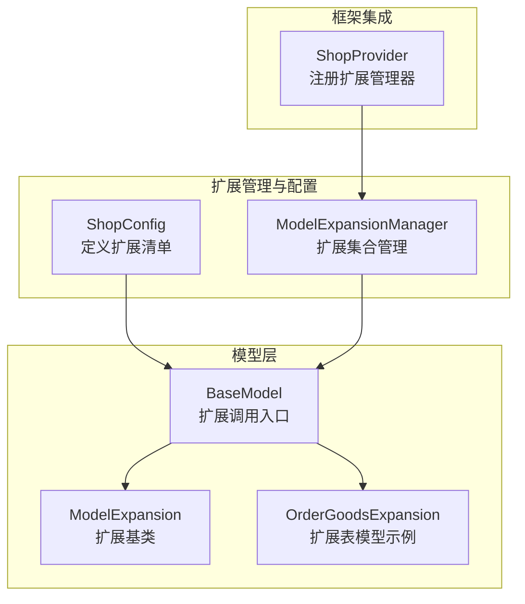
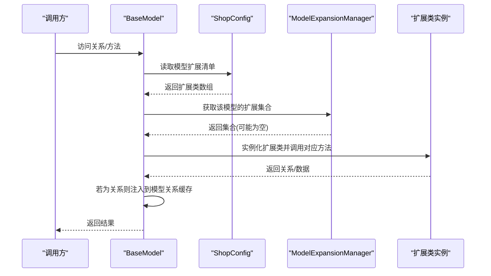
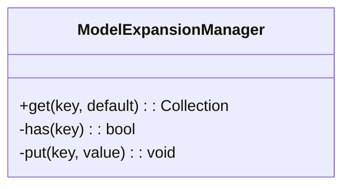
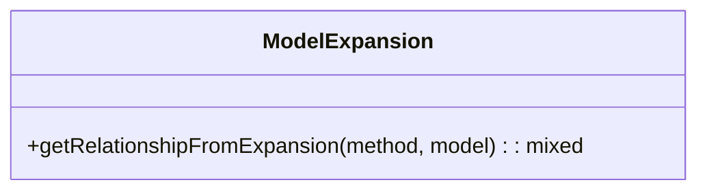
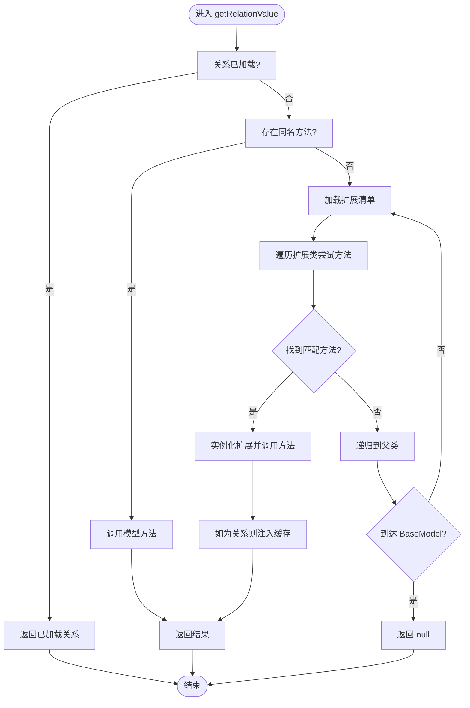
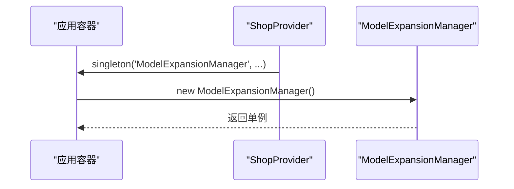
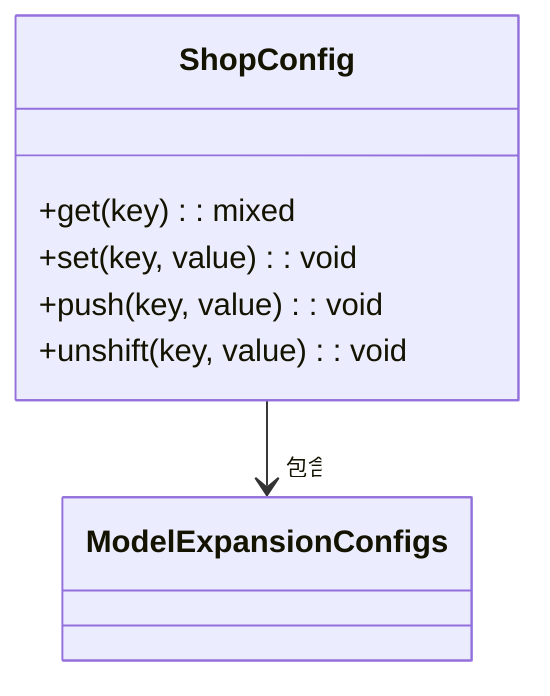
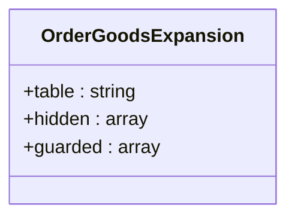
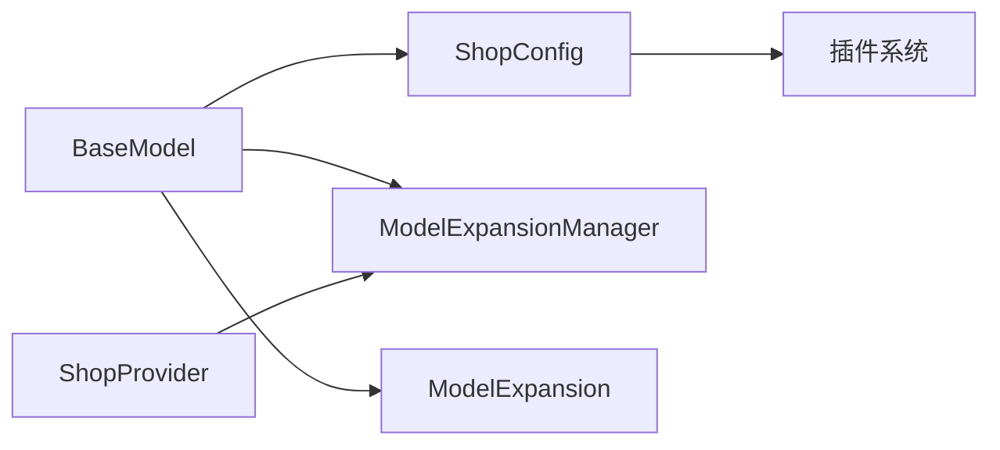

# 模型扩展机制

<cite>
**本文档引用的文件**
- [ModelExpansionManager.php](file://app/common/managers/ModelExpansionManager.php)
- [ModelExpansion.php](file://app/common/models/ModelExpansion.php)
- [BaseModel.php](file://app/common/models/BaseModel.php)
- [ShopProvider.php](file://app/common/providers/ShopProvider.php)
- [ShopConfig.php](file://app/common/modules/shop/ShopConfig.php)
- [OrderGoodsExpansion.php](file://app/common/models/orderGoods/OrderGoodsExpansion.php)
</cite>

## 目录
1. [简介](#简介)
2. [项目结构](#项目结构)
3. [核心组件](#核心组件)
4. [架构总览](#架构总览)
5. [详细组件分析](#详细组件分析)
6. [依赖关系分析](#依赖关系分析)
7. [性能考量](#性能考量)
8. [故障排查指南](#故障排查指南)
9. [结论](#结论)
10. [附录](#附录)

## 简介
本文件系统性阐述本项目的模型扩展机制，重点围绕以下目标展开：
- 解释 ModelExpansionManager 的运行时扩展原理，包括扩展点注册、集合存储、访问策略等。
- 分析 ModelExpansion 基类的设计理念与职责边界，说明如何通过继承实现模型功能的动态扩展。
- 阐述扩展机制的生命周期管理，包括扩展点的激活、加载顺序、优先级策略等。
- 提供扩展开发示例，涵盖自定义扩展类的编写、注册方式、调用流程等。
- 解释扩展机制与 Eloquent ORM 的集成方式及对查询性能的影响。
- 讨论扩展冲突处理、版本兼容性等高级主题。

## 项目结构
围绕模型扩展机制的关键文件分布如下：
- 扩展管理器：app/common/managers/ModelExpansionManager.php
- 扩展基类：app/common/models/ModelExpansion.php
- 基础模型：app/common/models/BaseModel.php（承载扩展调用入口与反射逻辑）
- 服务提供者：app/common/providers/ShopProvider.php（注册扩展管理器单例）
- 扩展配置：app/common/modules/shop/ShopConfig.php（声明各模型的扩展清单）
- 示例扩展模型：app/common/models/orderGoods/OrderGoodsExpansion.php（扩展表模型示例）

图表来源
- [ShopConfig.php:319-324](file://app/common/modules/shop/ShopConfig.php#L319-L324)
- [ModelExpansionManager.php:14-23](file://app/common/managers/ModelExpansionManager.php#L14-L23)
- [BaseModel.php:323-363](file://app/common/models/BaseModel.php#L323-L363)
- [ModelExpansion.php:15-29](file://app/common/models/ModelExpansion.php#L15-L29)
- [OrderGoodsExpansion.php:13-18](file://app/common/models/orderGoods/OrderGoodsExpansion.php#L13-L18)
- [ShopProvider.php:57-58](file://app/common/providers/ShopProvider.php#L57-L58)

章节来源
- [ModelExpansionManager.php:14-23](file://app/common/managers/ModelExpansionManager.php#L14-L23)
- [ModelExpansion.php:15-29](file://app/common/models/ModelExpansion.php#L15-L29)
- [BaseModel.php:314-363](file://app/common/models/BaseModel.php#L314-L363)
- [ShopProvider.php:57-58](file://app/common/providers/ShopProvider.php#L57-L58)
- [ShopConfig.php:319-324](file://app/common/modules/shop/ShopConfig.php#L319-L324)
- [OrderGoodsExpansion.php:13-18](file://app/common/models/orderGoods/OrderGoodsExpansion.php#L13-L18)

## 核心组件
- ModelExpansionManager：基于集合的扩展管理器，负责按模型类名组织扩展集合，并在缺失时自动初始化空集合。
- ModelExpansion：扩展基类，提供关系型扩展的统一入口方法，确保返回 Eloquent 关系对象并注入结果到模型关系缓存。
- BaseModel：扩展调用的入口与反射层，负责：
  - 在访问关系属性时，优先尝试扩展方法与关系方法；
  - 通过配置加载扩展清单；
  - 支持递归向上查找父类扩展，避免死循环。
- ShopProvider：在服务容器中注册 ModelExpansionManager 单例，确保全局可注入。
- ShopConfig：集中声明各模型的扩展类清单，支持插件扩展叠加。
- OrderGoodsExpansion：扩展表模型示例，展示扩展模型如何映射独立数据表。

章节来源
- [ModelExpansionManager.php:14-23](file://app/common/managers/ModelExpansionManager.php#L14-L23)
- [ModelExpansion.php:15-29](file://app/common/models/ModelExpansion.php#L15-L29)
- [BaseModel.php:314-363](file://app/common/models/BaseModel.php#L314-L363)
- [ShopProvider.php:57-58](file://app/common/providers/ShopProvider.php#L57-L58)
- [ShopConfig.php:319-324](file://app/common/modules/shop/ShopConfig.php#L319-L324)
- [OrderGoodsExpansion.php:13-18](file://app/common/models/orderGoods/OrderGoodsExpansion.php#L13-L18)

## 架构总览
扩展机制以“配置驱动 + 运行时反射 + Eloquent 集成”的方式工作：
- 配置阶段：ShopConfig 定义每个模型对应的扩展类数组。
- 注册阶段：ShopProvider 将 ModelExpansionManager 注册为单例。
- 运行阶段：BaseModel 在访问关系或方法时，按配置加载扩展，调用扩展类的方法；若返回关系对象，则通过 ModelExpansion 完成结果注入与缓存。

图表来源
- [BaseModel.php:314-363](file://app/common/models/BaseModel.php#L314-L363)
- [ShopConfig.php:319-324](file://app/common/modules/shop/ShopConfig.php#L319-L324)
- [ModelExpansionManager.php:16-23](file://app/common/managers/ModelExpansionManager.php#L16-L23)
- [ModelExpansion.php:17-29](file://app/common/models/ModelExpansion.php#L17-L29)

## 详细组件分析

### ModelExpansionManager：扩展集合管理
- 职责：维护“模型类名 → 扩展集合”的映射，提供安全的访问与初始化能力。
- 行为要点：
  - 未命中时自动 put 空集合，避免后续重复判断。
  - 作为扩展清单的运行时容器，供 BaseModel 读取与写入。

图表来源
- [ModelExpansionManager.php:14-23](file://app/common/managers/ModelExpansionManager.php#L14-L23)

章节来源
- [ModelExpansionManager.php:14-23](file://app/common/managers/ModelExpansionManager.php#L14-L23)

### ModelExpansion：扩展基类与关系注入
- 职责：为扩展类提供统一的关系型扩展入口，确保返回类型符合 Eloquent 关系约束，并将结果注入到模型关系缓存。
- 关键行为：
  - 校验扩展方法返回是否为 Eloquent 关系对象。
  - 使用模型的 setRelation 将结果缓存，避免重复查询。

图表来源
- [ModelExpansion.php:15-29](file://app/common/models/ModelExpansion.php#L15-L29)

章节来源
- [ModelExpansion.php:15-29](file://app/common/models/ModelExpansion.php#L15-L29)

### BaseModel：扩展调用入口与反射层
- 职责：扩展机制的核心入口，负责：
  - 在访问关系属性时，优先检查扩展方法与关系方法；
  - 通过 ShopConfig 加载扩展清单；
  - 支持递归向上查找父类扩展，避免死循环；
  - 对扩展方法与关系方法进行统一调度。
- 关键流程：
  - relationLoaded 判断 → method_exists → expansionMethod/getRelationshipFromExpansions；
  - 递归终止于 BaseModel 类本身。

图表来源
- [BaseModel.php:297-363](file://app/common/models/BaseModel.php#L297-L363)

章节来源
- [BaseModel.php:297-363](file://app/common/models/BaseModel.php#L297-L363)

### ShopProvider：扩展管理器注册
- 职责：在服务容器中注册 ModelExpansionManager 单例，确保全局可注入与共享。

图表来源
- [ShopProvider.php:57-58](file://app/common/providers/ShopProvider.php#L57-L58)

章节来源
- [ShopProvider.php:57-58](file://app/common/providers/ShopProvider.php#L57-L58)

### ShopConfig：扩展清单配置
- 职责：集中声明各模型的扩展类数组，支持插件扩展叠加。
- 关键位置：shop-foundation.model-expansions 下的模型到扩展类数组映射。

图表来源
- [ShopConfig.php:319-324](file://app/common/modules/shop/ShopConfig.php#L319-L324)

章节来源
- [ShopConfig.php:319-324](file://app/common/modules/shop/ShopConfig.php#L319-L324)

### OrderGoodsExpansion：扩展表模型示例
- 职责：演示扩展模型如何映射独立数据表，作为扩展数据的载体。
- 特点：定义表名、隐藏字段、守卫字段等。

图表来源
- [OrderGoodsExpansion.php:13-18](file://app/common/models/orderGoods/OrderGoodsExpansion.php#L13-L18)

章节来源
- [OrderGoodsExpansion.php:13-18](file://app/common/models/orderGoods/OrderGoodsExpansion.php#L13-L18)

## 依赖关系分析
- BaseModel 依赖 ShopConfig 获取扩展清单，依赖 ModelExpansionManager 存取扩展集合。
- ModelExpansion 依赖 Eloquent 的 Relation 接口，确保扩展返回关系对象。
- ShopProvider 依赖 ModelExpansionManager，将其注册为容器单例。
- ShopConfig 由插件系统动态合并，形成最终扩展清单。

图表来源
- [BaseModel.php:323-363](file://app/common/models/BaseModel.php#L323-L363)
- [ShopConfig.php:673-679](file://app/common/modules/shop/ShopConfig.php#L673-L679)
- [ShopProvider.php:57-58](file://app/common/providers/ShopProvider.php#L57-L58)

章节来源
- [BaseModel.php:323-363](file://app/common/models/BaseModel.php#L323-L363)
- [ShopConfig.php:673-679](file://app/common/modules/shop/ShopConfig.php#L673-L679)
- [ShopProvider.php:57-58](file://app/common/providers/ShopProvider.php#L57-L58)

## 性能考量
- 查询性能影响：
  - 扩展方法通常返回 Eloquent 关系对象，首次访问会触发数据库查询；ModelExpansion 会将结果注入模型关系缓存，后续访问直接返回缓存，避免重复查询。
  - BaseModel 的递归查找扩展仅在首次访问时发生，之后通过缓存命中，开销可控。
- 缓存与懒加载：
  - relationLoaded 判断与 setRelation 注入减少重复查询。
  - ModelExpansionManager 的集合初始化仅在首次访问模型类时发生。
- 复杂度分析：
  - 扩展方法查找：最坏情况下需遍历当前模型的所有扩展类，复杂度 O(N)，N 为扩展类数量。
  - 递归父类查找：最多到 BaseModel 类，复杂度 O(H)，H 为继承层级。

章节来源
- [BaseModel.php:297-363](file://app/common/models/BaseModel.php#L297-L363)
- [ModelExpansion.php:17-29](file://app/common/models/ModelExpansion.php#L17-L29)
- [ModelExpansionManager.php:16-23](file://app/common/managers/ModelExpansionManager.php#L16-L23)

## 故障排查指南
- 扩展方法未生效
  - 检查 ShopConfig 中是否正确声明了模型到扩展类的映射。
  - 确认扩展类方法名与调用一致，且返回类型为 Eloquent 关系对象。
- 关系结果未缓存
  - 确保扩展方法返回关系对象，以便 ModelExpansion 正常注入缓存。
- 递归查找异常
  - BaseModel 的递归终止条件为父类为 BaseModel，若自定义基类，请确保继承链正确。
- 插件冲突
  - 不同插件可能为同一模型提供扩展，建议在插件层面协调扩展方法命名与职责边界，避免覆盖。

章节来源
- [ShopConfig.php:319-324](file://app/common/modules/shop/ShopConfig.php#L319-L324)
- [ModelExpansion.php:17-29](file://app/common/models/ModelExpansion.php#L17-L29)
- [BaseModel.php:339-342](file://app/common/models/BaseModel.php#L339-L342)

## 结论
本项目的模型扩展机制通过“配置驱动 + 运行时反射 + Eloquent 集成”的方式，实现了对模型功能的动态扩展。其核心优势在于：
- 配置集中、插件可叠加；
- 运行时按需加载、关系结果缓存；
- 明确的扩展基类约束，保证扩展方法的一致性与可维护性。

在实际开发中，应遵循扩展方法命名规范、返回关系对象、避免重复查询，以获得最佳性能与可维护性。

## 附录

### 开发示例：自定义扩展类
- 创建扩展类
  - 继承扩展基类，提供与模型关联的方法或业务逻辑。
  - 方法返回 Eloquent 关系对象时，将自动注入到模型关系缓存。
- 注册扩展
  - 在 ShopConfig 的 shop-foundation.model-expansions 中为目标模型添加扩展类。
- 调用扩展
  - 通过 BaseModel 的关系访问或方法调用触发扩展执行，首次访问会触发数据库查询，后续访问走缓存。

章节来源
- [ModelExpansion.php:15-29](file://app/common/models/ModelExpansion.php#L15-L29)
- [ShopConfig.php:319-324](file://app/common/modules/shop/ShopConfig.php#L319-L324)
- [BaseModel.php:314-363](file://app/common/models/BaseModel.php#L314-L363)