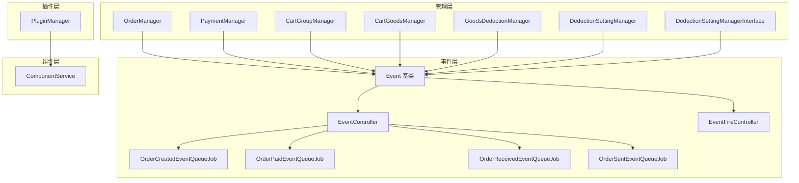
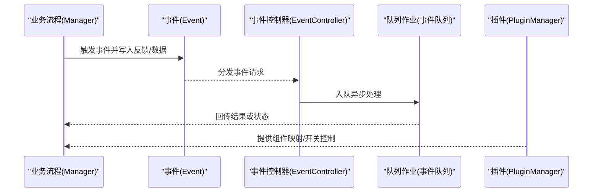
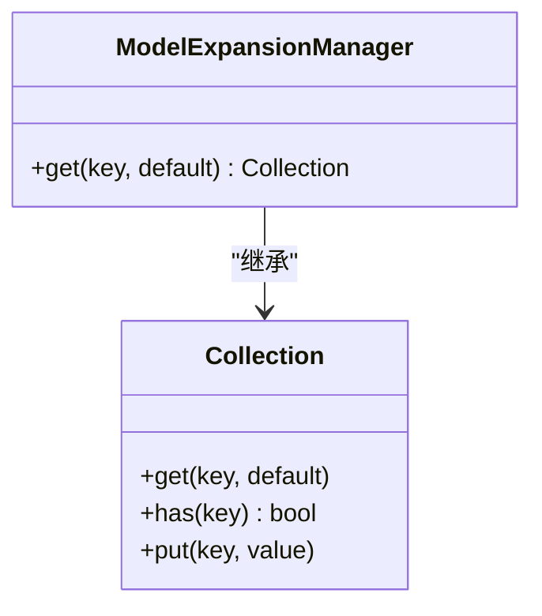
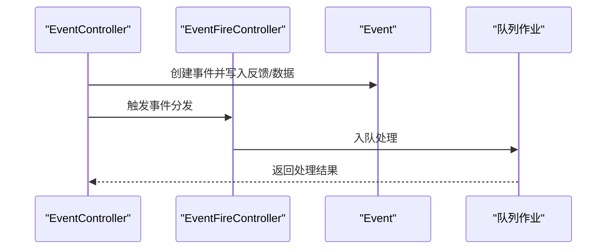
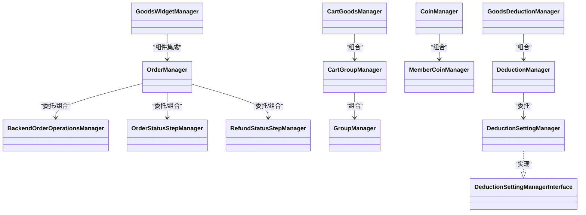
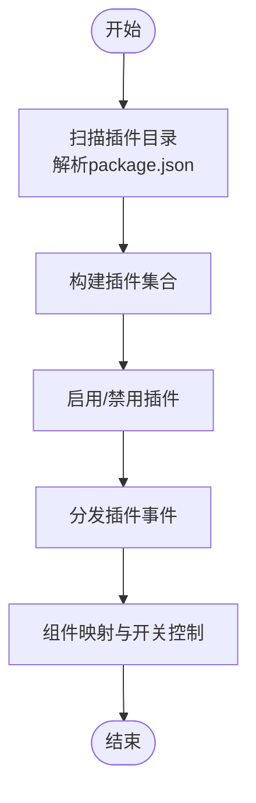
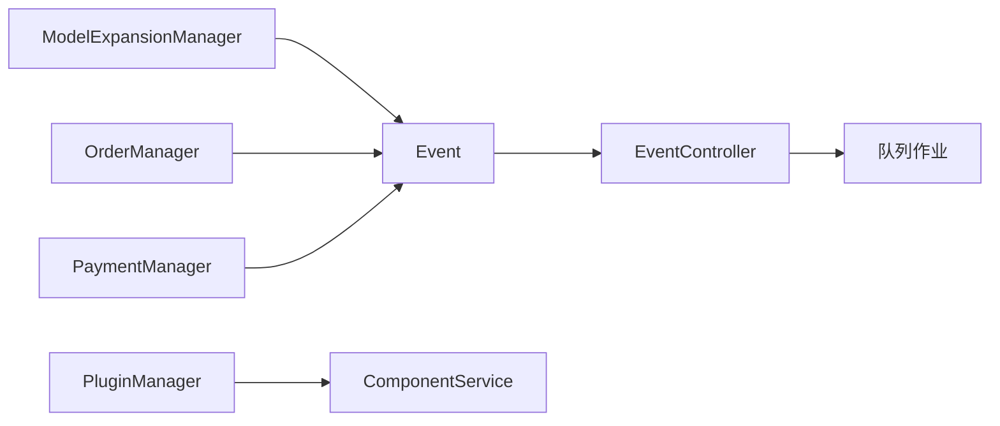

# 扩展点与定制化

<cite>
**本文引用的文件**   
- [ModelExpansionManager.php](file://app/common/managers/ModelExpansionManager.php)
- [PluginManager.php](file://app/common/services/PluginManager.php)
- [Event.php](file://app/common/events/Event.php)
- [OrderManager.php](file://app/common/modules/order/OrderManager.php)
- [PaymentManager.php](file://app/common/payment/PaymentManager.php)
- [ComponentService.php](file://app/common/services/ComponentService.php)
- [GoodsWidgetManager.php](file://app/backend/modules/goods/widget/manage/GoodsWidgetManager.php)
- [BackendOrderOperationsManager.php](file://app/backend/modules/order/services/BackendOrderOperationsManager.php)
- [OrderStatusStepManager.php](file://app/backend/modules/order/steps/OrderStatusStepManager.php)
- [RefundStatusStepManager.php](file://app/backend/modules/refund/services/steps/RefundStatusStepManager.php)
- [CartGroupManager.php](file://app/frontend/modules/cart/group/CartGroupManager.php)
- [CartGoodsManager.php](file://app/frontend/modules/cart/manager/CartGoodsManager.php)
- [GroupManager.php](file://app/frontend/modules/cart/services/GroupManager.php)
- [CoinManager.php](file://app/frontend/modules/coin/CoinManager.php)
- [MemberCoinManager.php](file://app/frontend/modules/coin/MemberCoinManager.php)
- [DeductionManager.php](file://app/frontend/modules/deduction/DeductionManager.php)
- [DeductionSettingManager.php](file://app/frontend/modules/deduction/DeductionSettingManager.php)
- [DeductionSettingManagerInterface.php](file://app/frontend/modules/deduction/DeductionSettingManagerInterface.php)
- [GoodsDeductionManager.php](file://app/frontend/modules/deduction/GoodsDeductionManager.php)
- [EventController.php](file://app/backend/modules/order/controllers/EventController.php)
- [EventFireController.php](file://app/backend/modules/order/controllers/EventFireController.php)
- [OrderCreatedEventQueueJob.php](file://app/Jobs/OrderCreatedEventQueueJob.php)
- [OrderPaidEventQueueJob.php](file://app/Jobs/OrderPaidEventQueueJob.php)
- [OrderReceivedEventQueueJob.php](file://app/Jobs/OrderReceivedEventQueueJob.php)
- [OrderSentEventQueueJob.php](file://app/Jobs/OrderSentEventQueueJob.php)
</cite>

## 目录
1. [引言](#引言)
2. [项目结构](#项目结构)
3. [核心组件](#核心组件)
4. [架构总览](#架构总览)
5. [详细组件分析](#详细组件分析)
6. [依赖关系分析](#依赖关系分析)
7. [性能考量](#性能考量)
8. [故障排查指南](#故障排查指南)
9. [结论](#结论)
10. [附录](#附录)

## 引言
本文件聚焦于“芸众商城”的扩展点与定制化机制，围绕以下主题展开：
- Model扩展机制与运行时扩展能力（ModelExpansionManager）
- Blade事件过滤器与事件系统（Event基类、事件控制器、队列作业）
- Manager模式的扩展点设计（可替换性与装饰器模式）
- 插件化定制最佳实践（PluginManager、组件映射）
- 自定义扩展开发指南（接口设计、实现规范、注册机制）
- 安全与性能影响评估

目标是帮助开发者在不修改核心代码的前提下，通过扩展点与Manager模式实现功能增强，并理解事件过滤与插件化架构的设计理念与使用方法。

## 项目结构
围绕扩展点与定制化，系统主要由以下层次构成：
- 管理层（Managers）：负责业务流程的可替换与组合，如订单、支付、购物车、抵扣等
- 事件层（Events）：统一的事件抽象与监听反馈通道
- 插件层（PluginManager）：插件发现、启用、禁用、事件分发
- 组件层（ComponentService）：前端组件与插件的映射与开关控制
- 队列层（Jobs）：事件驱动的任务异步处理

**图表来源**
- [OrderManager.php](file://app/common/modules/order/OrderManager.php)
- [PaymentManager.php](file://app/common/payment/PaymentManager.php)
- [CartGroupManager.php](file://app/frontend/modules/cart/group/CartGroupManager.php)
- [CartGoodsManager.php](file://app/frontend/modules/cart/manager/CartGoodsManager.php)
- [GoodsDeductionManager.php](file://app/frontend/modules/deduction/GoodsDeductionManager.php)
- [DeductionSettingManager.php](file://app/frontend/modules/deduction/DeductionSettingManager.php)
- [DeductionSettingManagerInterface.php](file://app/frontend/modules/deduction/DeductionSettingManagerInterface.php)
- [Event.php](file://app/common/events/Event.php)
- [EventController.php](file://app/backend/modules/order/controllers/EventController.php)
- [EventFireController.php](file://app/backend/modules/order/controllers/EventFireController.php)
- [OrderCreatedEventQueueJob.php](file://app/Jobs/OrderCreatedEventQueueJob.php)
- [OrderPaidEventQueueJob.php](file://app/Jobs/OrderPaidEventQueueJob.php)
- [OrderReceivedEventQueueJob.php](file://app/Jobs/OrderReceivedEventQueueJob.php)
- [OrderSentEventQueueJob.php](file://app/Jobs/OrderSentEventQueueJob.php)
- [PluginManager.php](file://app/common/services/PluginManager.php)
- [ComponentService.php](file://app/common/services/ComponentService.php)

**章节来源**
- [ModelExpansionManager.php](file://app/common/managers/ModelExpansionManager.php)
- [PluginManager.php](file://app/common/services/PluginManager.php)
- [Event.php](file://app/common/events/Event.php)
- [ComponentService.php](file://app/common/services/ComponentService.php)

## 核心组件
- Model扩展管理器（ModelExpansionManager）：基于集合的运行时扩展容器，默认缺失键自动初始化为空集合，便于按模型维度动态挂载扩展点。
- 事件基类（Event）：提供统一的反馈列表、意见、数据与映射存储，支持监听者向事件写入反馈与数据，供后续流程消费。
- 插件管理器（PluginManager）：负责插件目录扫描、启用/禁用、套餐式启动、事件分发、类型分类与菜单聚合。
- 组件服务（ComponentService）：维护插件与前端组件的映射关系，支持按插件名与组件名进行配置，并可带“是否启用”检查类。

**章节来源**
- [ModelExpansionManager.php](file://app/common/managers/ModelExpansionManager.php)
- [Event.php](file://app/common/events/Event.php)
- [PluginManager.php](file://app/common/services/PluginManager.php)
- [ComponentService.php](file://app/common/services/ComponentService.php)

## 架构总览
扩展点与定制化以“事件驱动 + Manager可替换 + 插件化组件映射”为核心：
- 业务流程通过Manager封装，便于替换具体实现或叠加装饰器
- 事件作为跨模块解耦的通信协议，支持同步收集反馈与异步任务派发
- 插件通过配置与开关控制组件可用性，避免硬编码耦合
- Model扩展管理器提供运行时维度扩展能力，按模型键隔离扩展集合

**图表来源**
- [Event.php](file://app/common/events/Event.php)
- [EventController.php](file://app/backend/modules/order/controllers/EventController.php)
- [OrderCreatedEventQueueJob.php](file://app/Jobs/OrderCreatedEventQueueJob.php)
- [PluginManager.php](file://app/common/services/PluginManager.php)

## 详细组件分析

### Model扩展机制与运行时扩展（ModelExpansionManager）
- 设计要点
  - 基于集合的扩展容器，键缺失时自动初始化空集合，避免重复判断
  - 支持按模型维度（键）组织扩展，便于运行时动态挂载
- 使用建议
  - 在业务流程中通过统一的扩展容器访问扩展集合
  - 为不同模型建立独立命名空间的扩展键，避免冲突
- 复杂度
  - 访问与初始化均为摊销O(1)，适合高频调用场景

**图表来源**
- [ModelExpansionManager.php](file://app/common/managers/ModelExpansionManager.php)

**章节来源**
- [ModelExpansionManager.php](file://app/common/managers/ModelExpansionManager.php)

### 事件过滤与事件系统（Event基类、事件控制器、队列作业）
- Event基类
  - 提供反馈列表、意见、数据与映射字段，监听者可写入，后续流程可读取
  - 提供存在性检测方法，便于条件分支
- 事件控制器与触发
  - 控制器接收事件请求，将事件分发至对应队列作业
  - 支持多种业务事件（如订单创建、支付、收货、发货）
- 队列作业
  - 将事件处理异步化，降低主流程阻塞
  - 可根据事件类型选择不同的处理策略与重试机制

**图表来源**
- [Event.php](file://app/common/events/Event.php)
- [EventController.php](file://app/backend/modules/order/controllers/EventController.php)
- [EventFireController.php](file://app/backend/modules/order/controllers/EventFireController.php)
- [OrderCreatedEventQueueJob.php](file://app/Jobs/OrderCreatedEventQueueJob.php)
- [OrderPaidEventQueueJob.php](file://app/Jobs/OrderPaidEventQueueJob.php)
- [OrderReceivedEventQueueJob.php](file://app/Jobs/OrderReceivedEventQueueJob.php)
- [OrderSentEventQueueJob.php](file://app/Jobs/OrderSentEventQueueJob.php)

**章节来源**
- [Event.php](file://app/common/events/Event.php)
- [EventController.php](file://app/backend/modules/order/controllers/EventController.php)
- [EventFireController.php](file://app/backend/modules/order/controllers/EventFireController.php)
- [OrderCreatedEventQueueJob.php](file://app/Jobs/OrderCreatedEventQueueJob.php)
- [OrderPaidEventQueueJob.php](file://app/Jobs/OrderPaidEventQueueJob.php)
- [OrderReceivedEventQueueJob.php](file://app/Jobs/OrderReceivedEventQueueJob.php)
- [OrderSentEventQueueJob.php](file://app/Jobs/OrderSentEventQueueJob.php)

### Manager模式的扩展点设计（可替换性与装饰器）
- 订单相关
  - 后台订单操作管理器、订单状态步骤管理器、退款状态步骤管理器
  - 商品小部件管理器：用于后台商品模块的组件化管理
- 前端业务管理器
  - 购物车组管理器、购物车商品管理器、分组管理器
  - 虚拟币与会员虚拟币管理器
  - 抵扣与抵扣设置管理器及接口约束
- 设计原则
  - 通过接口与抽象类约束实现，便于替换与装饰
  - 与事件系统结合，实现跨模块协作与异步处理

**图表来源**
- [OrderManager.php](file://app/common/modules/order/OrderManager.php)
- [BackendOrderOperationsManager.php](file://app/backend/modules/order/services/BackendOrderOperationsManager.php)
- [OrderStatusStepManager.php](file://app/backend/modules/order/steps/OrderStatusStepManager.php)
- [RefundStatusStepManager.php](file://app/backend/modules/refund/services/steps/RefundStatusStepManager.php)
- [GoodsWidgetManager.php](file://app/backend/modules/goods/widget/manage/GoodsWidgetManager.php)
- [CartGroupManager.php](file://app/frontend/modules/cart/group/CartGroupManager.php)
- [CartGoodsManager.php](file://app/frontend/modules/cart/manager/CartGoodsManager.php)
- [GroupManager.php](file://app/frontend/modules/cart/services/GroupManager.php)
- [CoinManager.php](file://app/frontend/modules/coin/CoinManager.php)
- [MemberCoinManager.php](file://app/frontend/modules/coin/MemberCoinManager.php)
- [DeductionManager.php](file://app/frontend/modules/deduction/DeductionManager.php)
- [DeductionSettingManager.php](file://app/frontend/modules/deduction/DeductionSettingManager.php)
- [DeductionSettingManagerInterface.php](file://app/frontend/modules/deduction/DeductionSettingManagerInterface.php)
- [GoodsDeductionManager.php](file://app/frontend/modules/deduction/GoodsDeductionManager.php)

**章节来源**
- [OrderManager.php](file://app/common/modules/order/OrderManager.php)
- [BackendOrderOperationsManager.php](file://app/backend/modules/order/services/BackendOrderOperationsManager.php)
- [OrderStatusStepManager.php](file://app/backend/modules/order/steps/OrderStatusStepManager.php)
- [RefundStatusStepManager.php](file://app/backend/modules/refund/services/steps/RefundStatusStepManager.php)
- [GoodsWidgetManager.php](file://app/backend/modules/goods/widget/manage/GoodsWidgetManager.php)
- [CartGroupManager.php](file://app/frontend/modules/cart/group/CartGroupManager.php)
- [CartGoodsManager.php](file://app/frontend/modules/cart/manager/CartGoodsManager.php)
- [GroupManager.php](file://app/frontend/modules/cart/services/GroupManager.php)
- [CoinManager.php](file://app/frontend/modules/coin/CoinManager.php)
- [MemberCoinManager.php](file://app/frontend/modules/coin/MemberCoinManager.php)
- [DeductionManager.php](file://app/frontend/modules/deduction/DeductionManager.php)
- [DeductionSettingManager.php](file://app/frontend/modules/deduction/DeductionSettingManager.php)
- [DeductionSettingManagerInterface.php](file://app/frontend/modules/deduction/DeductionSettingManagerInterface.php)
- [GoodsDeductionManager.php](file://app/frontend/modules/deduction/GoodsDeductionManager.php)

### 插件化定制与组件映射（PluginManager、ComponentService）
- 插件管理器
  - 扫描插件目录，解析package.json，构建插件集合
  - 提供启用/禁用、套餐启动、事件分发、类型分类与菜单聚合
- 组件服务
  - 维护插件名称与前端组件名称的映射，支持“是否启用”检查类
  - 通过配置控制组件的可用性与展示顺序

**图表来源**
- [PluginManager.php](file://app/common/services/PluginManager.php)
- [ComponentService.php](file://app/common/services/ComponentService.php)

**章节来源**
- [PluginManager.php](file://app/common/services/PluginManager.php)
- [ComponentService.php](file://app/common/services/ComponentService.php)

## 依赖关系分析
- 低耦合高内聚
  - Manager之间通过接口与事件交互，避免直接耦合
  - 事件作为跨模块契约，统一了数据与反馈的传递方式
- 运行时扩展
  - ModelExpansionManager按模型键隔离扩展集合，避免全局污染
- 插件化
  - PluginManager集中管理插件生命周期与事件，ComponentService集中管理组件映射

**图表来源**
- [ModelExpansionManager.php](file://app/common/managers/ModelExpansionManager.php)
- [Event.php](file://app/common/events/Event.php)
- [EventController.php](file://app/backend/modules/order/controllers/EventController.php)
- [PluginManager.php](file://app/common/services/PluginManager.php)
- [ComponentService.php](file://app/common/services/ComponentService.php)
- [OrderManager.php](file://app/common/modules/order/OrderManager.php)
- [PaymentManager.php](file://app/common/payment/PaymentManager.php)

**章节来源**
- [ModelExpansionManager.php](file://app/common/managers/ModelExpansionManager.php)
- [Event.php](file://app/common/events/Event.php)
- [EventController.php](file://app/backend/modules/order/controllers/EventController.php)
- [PluginManager.php](file://app/common/services/PluginManager.php)
- [ComponentService.php](file://app/common/services/ComponentService.php)
- [OrderManager.php](file://app/common/modules/order/OrderManager.php)
- [PaymentManager.php](file://app/common/payment/PaymentManager.php)

## 性能考量
- 事件异步化
  - 通过队列作业处理耗时逻辑，避免阻塞主流程
- 缓存与懒加载
  - 插件列表缓存与延迟构建，减少I/O与初始化开销
- 扩展容器
  - 默认缺失键自动初始化，避免重复判断，提升访问效率
- 建议
  - 对高频事件采用批量处理与去重策略
  - 合理拆分事件粒度，避免单次事件承载过多数据

[本节为通用指导，无需特定文件引用]

## 故障排查指南
- 事件未被消费
  - 检查事件控制器与队列作业是否正确绑定
  - 确认事件对象是否正确写入反馈/数据
- 插件启用失败
  - 查看插件目录与package.json是否存在
  - 检查启用状态持久化与事件分发是否成功
- 组件不可见
  - 核对ComponentService中的插件映射与“是否启用”检查类
  - 确认插件已启用且终端匹配

**章节来源**
- [EventController.php](file://app/backend/modules/order/controllers/EventController.php)
- [EventFireController.php](file://app/backend/modules/order/controllers/EventFireController.php)
- [OrderCreatedEventQueueJob.php](file://app/Jobs/OrderCreatedEventQueueJob.php)
- [PluginManager.php](file://app/common/services/PluginManager.php)
- [ComponentService.php](file://app/common/services/ComponentService.php)

## 结论
芸众商城通过“事件驱动 + Manager可替换 + 插件化组件映射 + 运行时扩展容器”的架构，实现了高度可定制与低耦合的扩展体系。开发者可在不侵入核心代码的前提下，利用Manager替换具体实现、通过事件收集反馈与异步处理、借助插件与组件映射实现功能扩展，并通过Model扩展管理器在运行时按模型维度挂载扩展点。该设计兼顾了灵活性、可维护性与性能。

[本节为总结性内容，无需特定文件引用]

## 附录

### 自定义扩展开发指南
- 接口设计
  - 明确职责边界，优先使用接口约束实现
  - 与事件系统配合，通过Event写入反馈与数据
- 实现规范
  - 遵循Manager模式，提供默认实现与可替换实现
  - 对外暴露统一的调用入口，内部通过委托/组合复用其他Manager
- 注册机制
  - 插件通过PluginManager注册与启用
  - 组件通过ComponentService进行映射与开关控制
- 最佳实践
  - 保持事件粒度清晰，避免跨模块强耦合
  - 使用队列异步处理耗时逻辑，确保主流程响应性
  - 对扩展点进行单元测试与集成测试，保障稳定性

**章节来源**
- [PluginManager.php](file://app/common/services/PluginManager.php)
- [ComponentService.php](file://app/common/services/ComponentService.php)
- [Event.php](file://app/common/events/Event.php)
- [OrderManager.php](file://app/common/modules/order/OrderManager.php)
- [PaymentManager.php](file://app/common/payment/PaymentManager.php)