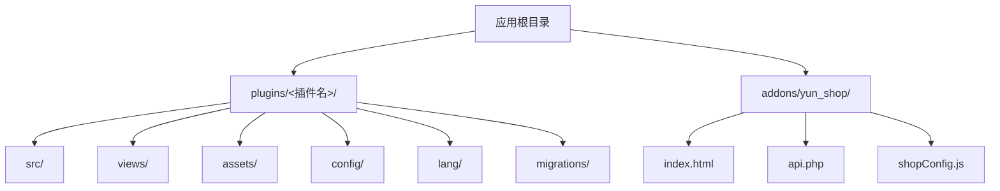
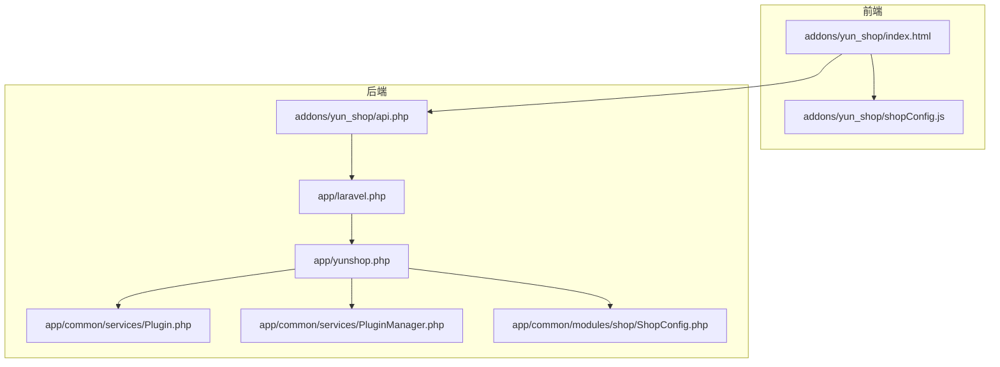
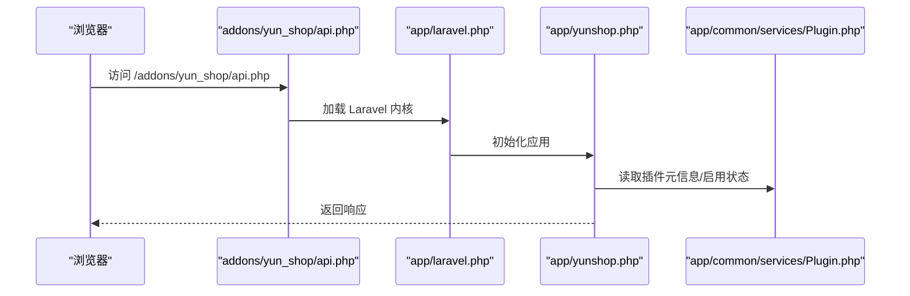
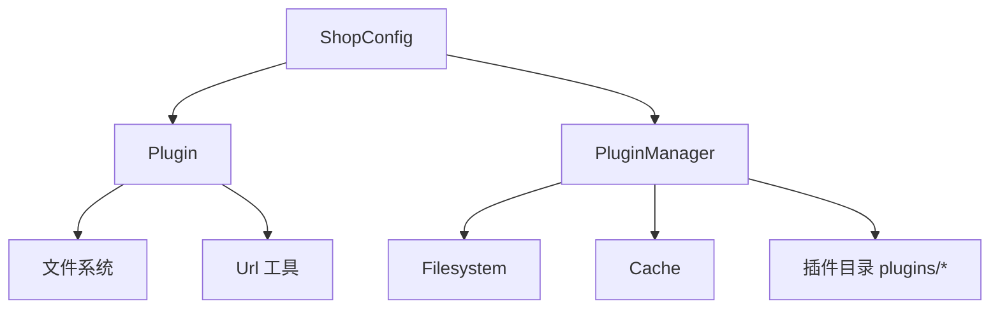

# 插件开发规范

<cite>
**本文档引用的文件**
- [addons\yun_shop\api.php](file://addons\yun_shop\api.php)
- [addons\yun_shop\index.html](file://addons\yun_shop\index.html)
- [addons\yun_shop\shopConfig.js](file://addons\yun_shop\shopConfig.js)
- [app\laravel.php](file://app\laravel.php)
- [app\yunshop.php](file://app\yunshop.php)
- [app\common\services\Plugin.php](file://app\common\services\Plugin.php)
- [app\common\services\PluginManager.php](file://app\common\services\PluginManager.php)
- [app\common\modules\shop\ShopConfig.php](file://app\common\modules\shop\ShopConfig.php)
- [.gitignore](file://.gitignore)
</cite>

## 目录
1. [引言](#引言)
2. [项目结构](#项目结构)
3. [核心组件](#核心组件)
4. [架构总览](#架构总览)
5. [详细组件分析](#详细组件分析)
6. [依赖分析](#依赖分析)
7. [性能考虑](#性能考虑)
8. [故障排查指南](#故障排查指南)
9. [结论](#结论)
10. [附录](#附录)

## 引言
本规范面向“芸众商城”插件开发者，旨在统一插件目录结构、命名约定、配置文件编写、路由注册与URL生成、数据库迁移与版本管理、国际化支持以及最佳实践与常见陷阱，确保插件可维护性、可扩展性与一致性。

## 项目结构
- 插件安装位置：插件应放置于应用根目录下的 plugins 目录中，遵循“插件名/”的目录结构。
- 标准目录职责（建议）：
  - src/：后端业务逻辑、控制器、模型、服务、中间件等PHP代码。
  - views/：模板视图文件（如 .tpl 或 Blade 视图）。
  - assets/：前端静态资源（JS/CSS/图片等），通过统一入口暴露。
  - config/：插件配置文件（如 package.json、权限与菜单配置等）。
  - lang/：国际化语言包（按语言代码分目录）。
  - migrations/：数据库迁移文件，按时间戳+描述命名。
- 插件运行入口与前端页面：
  - addons/yun_shop/ 作为插件前端入口，包含入口页 index.html 与 API 入口 api.php。
  - 前端页面通过 shopConfig.js 提供配置（如地图密钥等）。

**图表来源**
- [addons\yun_shop\api.php:1-22](file://addons\yun_shop\api.php#L1-L22)
- [addons\yun_shop\index.html:1-159](file://addons\yun_shop\index.html#L1-L159)
- [addons\yun_shop\shopConfig.js:1-1](file://addons\yun_shop\shopConfig.js#L1-L1)

**章节来源**
- [addons\yun_shop\api.php:1-22](file://addons\yun_shop\api.php#L1-L22)
- [addons\yun_shop\index.html:1-159](file://addons\yun_shop\index.html#L1-L159)
- [addons\yun_shop\shopConfig.js:1-1](file://addons\yun_shop\shopConfig.js#L1-L1)

## 核心组件
- 插件元数据与加载器
  - 插件元信息读取：通过 package.json 获取插件名称、版本、作者、描述、配置视图等。
  - 插件启用状态：通过 app('plugins') 判断插件是否启用。
  - 插件路径解析：根据插件目录与命名空间生成视图与资源路径。
- 插件管理器
  - 扫描 plugins 目录，缓存可用插件列表，支持启用/禁用状态管理。
- 商城配置聚合
  - ShopConfig 统一聚合插件提供的配置项，形成全局可用的配置树。

**章节来源**
- [app\common\services\Plugin.php:69-84](file://app\common\services\Plugin.php#L69-L84)
- [app\common\services\Plugin.php:181-201](file://app\common\services\Plugin.php#L181-L201)
- [app\common\services\PluginManager.php:59-70](file://app\common\services\PluginManager.php#L59-L70)
- [app\common\modules\shop\ShopConfig.php:673-679](file://app\common\modules\shop\ShopConfig.php#L673-L679)

## 架构总览
插件系统围绕“入口页 + API入口 + 插件元数据 + 插件管理 + 商城配置聚合”构建，前端通过 addons/yun_shop 提供统一入口，后端通过 Laravel Kernel 处理请求，并由插件管理器与 ShopConfig 协同完成插件发现、启用与配置注入。

**图表来源**
- [addons\yun_shop\index.html:1-159](file://addons\yun_shop\index.html#L1-L159)
- [addons\yun_shop\shopConfig.js:1-1](file://addons\yun_shop\shopConfig.js#L1-L1)
- [addons\yun_shop\api.php:1-22](file://addons\yun_shop\api.php#L1-L22)
- [app\laravel.php:1-50](file://app\laravel.php#L1-L50)
- [app\yunshop.php:1-621](file://app\yunshop.php#L1-L621)
- [app\common\services\Plugin.php:1-328](file://app\common\services\Plugin.php#L1-L328)
- [app\common\services\PluginManager.php:1-70](file://app\common\services\PluginManager.php#L1-L70)
- [app\common\modules\shop\ShopConfig.php:1-744](file://app\common\modules\shop\ShopConfig.php#L1-L744)

## 详细组件分析

### 插件目录与命名规范
- 插件目录
  - 建议使用小写字母与短横线组合，例如：plugins/my-plugin。
  - 根据需要建立 src/、views/、assets/、config/、lang/、migrations/ 等子目录。
- 文件命名
  - PHP 类文件采用 PSR-4 命名空间风格，类名以“驼峰式”，文件名与类名一致。
  - 控制器类以“Controller”结尾；模型类以“Model”结尾；服务类以“Service”结尾。
  - 视图文件以“.tpl”或 Blade 扩展名存放于 views/ 下。
  - 资源文件统一置于 assets/ 下，通过 Plugin::assets() 生成 URL。
- 版本与兼容
  - 使用语义化版本号（主.次.补丁），并在 package.json 中声明。
  - 依赖通过 composer.json 管理，确保运行时环境满足最低要求。

**章节来源**
- [app\common\services\Plugin.php:118-121](file://app\common\services\Plugin.php#L118-L121)
- [app\common\services\Plugin.php:181-201](file://app\common\services\Plugin.php#L181-L201)

### 插件配置文件编写
- package.json
  - 必填字段：name、version、title、description、author。
  - 可选字段：namespace（命名空间）、config（配置视图文件名）、dependencies（依赖声明）。
  - 插件可通过 getConfigView()/hasConfigView() 读取配置视图。
- 插件启用与禁用
  - 通过 app('plugins')->isEnabled($name) 查询启用状态。
  - 插件管理器扫描 plugins 目录并缓存插件列表。
- 商城配置注入
  - 插件可通过 app()->getShopConfigItems() 返回配置片段，由 ShopConfig 聚合到全局配置树。

**章节来源**
- [app\common\services\Plugin.php:69-84](file://app\common\services\Plugin.php#L69-L84)
- [app\common\services\Plugin.php:191-201](file://app\common\services\Plugin.php#L191-L201)
- [app\common\services\PluginManager.php:59-70](file://app\common\services\PluginManager.php#L59-L70)
- [app\common\modules\shop\ShopConfig.php:673-679](file://app\common\modules\shop\ShopConfig.php#L673-L679)

### 插件路由注册机制与URL生成
- 路由注册
  - 插件控制器位于 src/controllers/ 下，命名以“模块名+Controller.php”。
  - 路由解析遵循“模块.动作”的形式，支持多级模块嵌套。
  - 插件路由前缀为“plugin.{插件名}.”，控制器与动作解析由框架内置解析器处理。
- URL生成
  - 资源URL通过 Plugin::assets(relativeUri) 生成，统一前缀为“/plugins/{插件名}/...”。

**图表来源**
- [addons\yun_shop\api.php:1-22](file://addons\yun_shop\api.php#L1-L22)
- [app\laravel.php:1-50](file://app\laravel.php#L1-L50)
- [app\yunshop.php:1-621](file://app\yunshop.php#L1-L621)
- [app\common\services\Plugin.php:1-328](file://app\common\services\Plugin.php#L1-L328)

**章节来源**
- [app\yunshop.php:241-320](file://app\yunshop.php#L241-L320)
- [app\yunshop.php:333-370](file://app\yunshop.php#L333-L370)
- [app\common\services\Plugin.php:118-121](file://app\common\services\Plugin.php#L118-L121)

### 数据库迁移文件编写与版本管理
- 迁移文件命名
  - 建议使用“YYYY_MM_DD_HHMMSS_描述.php”格式，便于排序与追溯。
- 迁移位置
  - 放置于 plugins/<插件名>/migrations/ 目录下。
- 版本管理
  - 插件升级时，系统会扫描指定目录与文件集合，确保迁移顺序正确。
  - 建议在 package.json 中声明版本号，配合 ShopConfig 的插件清单进行版本比对。

**章节来源**
- [app\common\services\systemUpgrade.php:63-85](file://app\common\services\systemUpgrade.php#L63-L85)
- [app\common\modules\shop\ShopConfig.php:34-112](file://app\common\modules\shop\ShopConfig.php#L34-L112)

### 国际化支持与多语言资源管理
- 语言包目录
  - lang/ 下按语言代码分目录（如 zh-CN、en），每种语言一个 messages.php 或对应文件。
- 资源加载
  - 插件可通过 views/ 下的模板文件引用语言键值，框架负责按当前语言环境解析。
- 配置注入
  - ShopConfig 可聚合插件的语言配置，保证全局可用。

**章节来源**
- [app\common\services\Plugin.php:181-201](file://app\common\services\Plugin.php#L181-L201)
- [app\common\modules\shop\ShopConfig.php:673-679](file://app\common\modules\shop\ShopConfig.php#L673-L679)

### 最佳实践与常见陷阱
- 最佳实践
  - 将插件逻辑按职责拆分为 service、repository、job 等层次，保持控制器薄化。
  - 在 views/ 中仅放视图模板，不直接写业务逻辑。
  - 使用 assets/ 统一管理静态资源，避免硬编码路径。
  - 在 package.json 中明确 namespace 与 config 视图，便于统一管理。
  - 迁移文件必须幂等，避免重复执行导致异常。
- 常见陷阱
  - 忽略插件启用状态判断，直接调用插件功能。
  - 路由命名与控制器命名不一致，导致解析失败。
  - 迁移文件命名不规范，造成执行顺序混乱。
  - 未在 .gitignore 中排除 plugins/，导致版本控制污染。
  - 未在 ShopConfig 注入插件配置，导致全局不可用。

**章节来源**
- [.gitignore:3-3](file://.gitignore#L3-L3)
- [app\common\services\Plugin.php:235-238](file://app\common\services\Plugin.php#L235-L238)
- [app\common\modules\shop\ShopConfig.php:673-679](file://app\common\modules\shop\ShopConfig.php#L673-L679)

## 依赖分析
- 组件耦合
  - Plugin 依赖文件系统读取 package.json，依赖 Url 工具生成资源URL。
  - PluginManager 依赖 Filesystem 扫描 plugins 目录，依赖缓存与事件系统。
  - ShopConfig 依赖插件返回的配置片段，动态合并到全局配置树。
- 外部依赖
  - Laravel 内核负责请求生命周期与中间件链路。
  - addons/yun_shop 提供前端入口与API入口，桥接前后端。

**图表来源**
- [app\common\services\PluginManager.php:1-70](file://app\common\services\PluginManager.php#L1-L70)
- [app\common\services\Plugin.php:1-328](file://app\common\services\Plugin.php#L1-L328)
- [app\common\modules\shop\ShopConfig.php:1-744](file://app\common\modules\shop\ShopConfig.php#L1-L744)

**章节来源**
- [app\common\services\PluginManager.php:59-70](file://app\common\services\PluginManager.php#L59-L70)
- [app\common\services\Plugin.php:118-121](file://app\common\services\Plugin.php#L118-L121)
- [app\common\modules\shop\ShopConfig.php:673-679](file://app\common\modules\shop\ShopConfig.php#L673-L679)

## 性能考虑
- 缓存策略
  - 插件列表与 package.json 内容建议缓存，降低磁盘IO与JSON解析开销。
- 资源加载
  - 前端静态资源通过 assets/ 统一入口，避免重复请求与路径错误。
- 迁移执行
  - 迁移文件按时间戳顺序执行，建议拆分小步迁移，减少锁表时间。

## 故障排查指南
- 插件未生效
  - 检查 plugins 目录是否存在与命名是否正确。
  - 确认 package.json 存在且字段完整。
  - 使用 isEnabled() 检查插件启用状态。
- 路由无法解析
  - 核对控制器命名与文件路径是否符合“模块+Controller.php”规范。
  - 确认路由前缀与模块层级是否匹配。
- 资源404
  - 使用 Plugin::assets() 生成URL，确认 assets/ 目录存在且文件名正确。
- 迁移失败
  - 检查迁移文件命名与内容是否幂等。
  - 查看系统升级日志定位具体错误。

**章节来源**
- [app\common\services\Plugin.php:235-238](file://app\common\services\Plugin.php#L235-L238)
- [app\yunshop.php:241-320](file://app\yunshop.php#L241-L320)
- [app\common\services\systemUpgrade.php:63-85](file://app\common\services\systemUpgrade.php#L63-L85)

## 结论
通过统一的目录结构、规范化的配置文件、清晰的路由与URL生成机制、严谨的迁移与版本管理以及完善的国际化支持，芸众商城插件体系能够实现高内聚、低耦合与强扩展性。遵循本文档的规范与最佳实践，可显著提升插件开发效率与质量。

## 附录
- 前端入口与配置
  - 入口页：addons/yun_shop/index.html
  - API入口：addons/yun_shop/api.php
  - 配置：addons/yun_shop/shopConfig.js

**章节来源**
- [addons\yun_shop\index.html:1-159](file://addons\yun_shop\index.html#L1-L159)
- [addons\yun_shop\api.php:1-22](file://addons\yun_shop\api.php#L1-L22)
- [addons\yun_shop\shopConfig.js:1-1](file://addons\yun_shop\shopConfig.js#L1-L1)