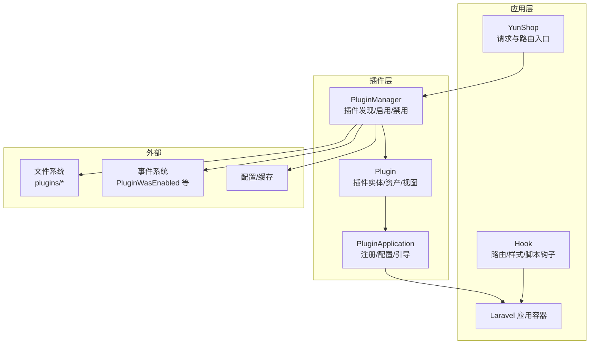
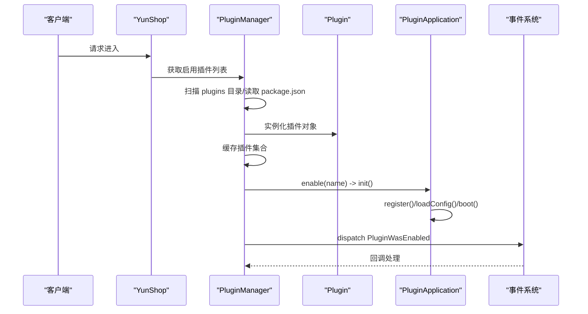
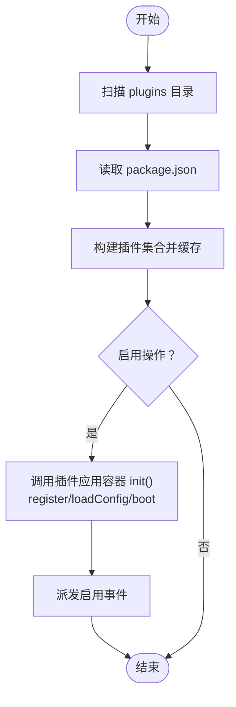
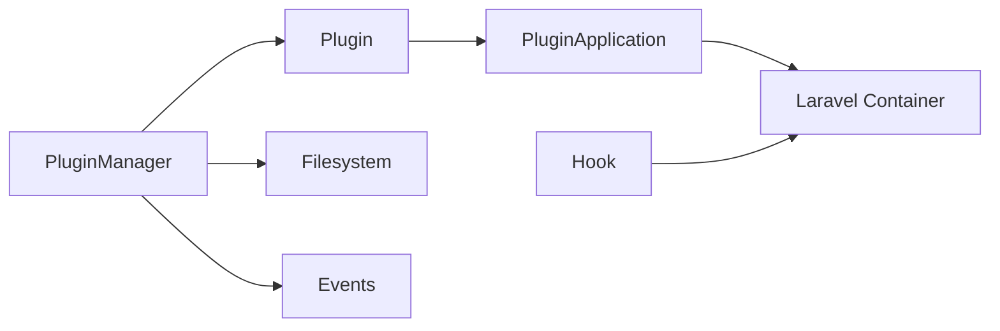

# 插件架构

<cite>
**本文引用的文件**
- [app/yunshop.php](file://app/yunshop.php)
- [bootstrap/autoload.php](file://bootstrap/autoload.php)
- [app/common/services/PluginManager.php](file://app/common/services/PluginManager.php)
- [app/common/services/Plugin.php](file://app/common/services/Plugin.php)
- [app/common/services/PluginApplication.php](file://app/common/services/PluginApplication.php)
- [app/common/services/Hook.php](file://app/common/services/Hook.php)
- [app/common/services/systemUpgrade.php](file://app/common/services/systemUpgrade.php)
- [.gitignore](file://.gitignore)
</cite>

## 目录
1. [引言](#引言)
2. [项目结构](#项目结构)
3. [核心组件](#核心组件)
4. [架构总览](#架构总览)
5. [详细组件分析](#详细组件分析)
6. [依赖分析](#依赖分析)
7. [性能考量](#性能考量)
8. [故障排查指南](#故障排查指南)
9. [结论](#结论)
10. [附录](#附录)

## 引言
本文件面向“芸众商城”的插件体系，系统化梳理插件目录规范与命名约定、SPL自动加载机制、插件生命周期管理（启用/禁用/删除）、插件间依赖与冲突处理、以及插件开发全流程指南（配置、路由、迁移、国际化）。文档以代码为依据，辅以可视化图表，帮助开发者快速理解并高效扩展插件生态。

## 项目结构
- 插件根目录位于应用根路径下的 plugins 目录，每个插件以独立子目录形式存在，遵循统一的目录结构与命名规范。
- 插件目录规范（建议）：
  - src/：后端业务代码（控制器、模型、服务、事件、监听器、中间件等）
  - views/：视图片段或 Blade 视图
  - assets/：前端静态资源（JS/CSS/图片等），通过插件资产 URL 访问
  - config/：插件配置项定义与默认值
  - lang/：多语言文案（按语言代码分目录）
  - migrations/：数据库迁移脚本
  - package.json：插件元信息（名称、版本、描述、作者、依赖等）
- 插件在仓库中的存放位置与忽略策略：
  - 根目录下对 plugins 目录进行忽略，确保插件作为可选扩展随项目部署与升级而独立管理。

章节来源
- [.gitignore:3-3](file://.gitignore#L3-L3)

## 核心组件
- 插件管理器（PluginManager）：负责扫描、加载、启用/禁用、删除插件；维护启用状态与缓存；触发事件。
- 插件实体（Plugin）：封装单个插件的元信息、路径、启用状态、视图与资产访问能力。
- 插件应用容器（PluginApplication）：为插件提供注册、配置加载、启动引导、菜单与挂件配置等扩展点。
- Hook 系统：提供路由注册、页面样式/脚本注入、国际化脚本注入等钩子能力。
- 自动加载：基于 Composer 的 SPL 自动加载，结合 Laravel 容器实现插件类的动态解析与实例化。

章节来源
- [app/common/services/PluginManager.php:59-92](file://app/common/services/PluginManager.php#L59-L92)
- [app/common/services/Plugin.php:17-67](file://app/common/services/Plugin.php#L17-L67)
- [app/common/services/PluginApplication.php:15-35](file://app/common/services/PluginApplication.php#L15-L35)
- [app/common/services/Hook.php:53-72](file://app/common/services/Hook.php#L53-L72)
- [bootstrap/autoload.php:16-16](file://bootstrap/autoload.php#L16-L16)

## 架构总览
下图展示插件系统的关键角色与交互关系，包括插件发现、启用流程、资源与事件集成。

图表来源
- [app/yunshop.php:117-126](file://app/yunshop.php#L117-L126)
- [app/common/services/PluginManager.php:59-92](file://app/common/services/PluginManager.php#L59-L92)
- [app/common/services/Plugin.php:17-67](file://app/common/services/Plugin.php#L17-L67)
- [app/common/services/PluginApplication.php:15-35](file://app/common/services/PluginApplication.php#L15-L35)
- [app/common/services/Hook.php:53-72](file://app/common/services/Hook.php#L53-L72)

## 详细组件分析

### 插件发现与启用流程
- 发现：扫描 plugins 目录，读取 package.json，构建插件集合，并缓存结果。
- 启用：持久化启用状态，调用插件应用容器初始化（注册、加载配置、引导），并派发启用事件。
- 禁用/删除：更新启用状态，清理缓存，必要时移除插件目录。

图表来源
- [app/common/services/PluginManager.php:59-92](file://app/common/services/PluginManager.php#L59-L92)
- [app/common/services/PluginManager.php:133-146](file://app/common/services/PluginManager.php#L133-L146)
- [app/common/services/PluginApplication.php:30-35](file://app/common/services/PluginApplication.php#L30-L35)

章节来源
- [app/common/services/PluginManager.php:59-92](file://app/common/services/PluginManager.php#L59-L92)
- [app/common/services/PluginManager.php:133-146](file://app/common/services/PluginManager.php#L133-L146)
- [app/common/services/PluginManager.php:245-254](file://app/common/services/PluginManager.php#L245-L254)

### 插件生命周期管理
- 启用：持久化启用标记，调用插件应用容器的初始化流程，随后派发启用事件供其他模块订阅。
- 禁用：更新启用状态，清理相关缓存。
- 删除：移除插件目录并刷新插件列表缓存。

图表来源
- [app/common/services/PluginManager.php:59-92](file://app/common/services/PluginManager.php#L59-L92)
- [app/common/services/PluginManager.php:133-146](file://app/common/services/PluginManager.php#L133-L146)
- [app/common/services/PluginApplication.php:30-35](file://app/common/services/PluginApplication.php#L30-L35)

章节来源
- [app/common/services/PluginManager.php:133-146](file://app/common/services/PluginManager.php#L133-L146)
- [app/common/services/PluginManager.php:153-169](file://app/common/services/PluginManager.php#L153-L169)
- [app/common/services/PluginManager.php:233-238](file://app/common/services/PluginManager.php#L233-L238)

### 插件目录规范与命名约定
- 推荐目录结构
  - src/：PHP 类与业务逻辑
  - views/：Blade 片段或视图
  - assets/：前端静态资源
  - config/：配置项
  - lang/：多语言
  - migrations/：数据库迁移
  - package.json：插件元信息
- 资产与视图访问
  - 插件可通过内置方法生成资产 URL 与视图路径，便于在后台或前台渲染。
- 命名约定
  - 插件目录名即插件标识（name），用于启用/禁用与路由映射。
  - 视图文件名与配置视图键需与 package.json 中的配置一致。

章节来源
- [app/common/services/Plugin.php:186-201](file://app/common/services/Plugin.php#L186-L201)
- [app/common/services/Plugin.php:118-121](file://app/common/services/Plugin.php#L118-L121)

### SPL 自动加载机制
- 自动加载入口：通过 Composer 自动生成的 autoload.php 将 vendor 目录纳入自动加载。
- 插件类解析：结合 Laravel 容器与命名空间约定，插件类可在运行时被正确解析与实例化。
- 建议
  - 在插件的 composer.json 中配置 PSR-4 命名空间映射，确保类名与文件路径一致。
  - 使用插件应用容器进行服务注册与引导，避免直接耦合全局。

章节来源
- [bootstrap/autoload.php:16-16](file://bootstrap/autoload.php#L16-L16)
- [app/common/services/PluginApplication.php:37-45](file://app/common/services/PluginApplication.php#L37-L45)

### 插件间依赖与冲突处理
- 依赖声明：在插件的 package.json 中声明依赖（如其他插件或第三方库）。
- 冲突检测：启用前检查依赖是否满足；若不满足，提示用户先启用所需依赖或回滚。
- 升级策略：系统升级时会扫描插件 migrations 目录，确保数据库结构同步。

章节来源
- [app/common/services/systemUpgrade.php:65-71](file://app/common/services/systemUpgrade.php#L65-L71)

### 插件开发完整指南
- 配置文件编写
  - 在 config/ 下定义插件配置项，使用插件应用容器加载配置。
- 路由注册
  - 使用 Hook::addRoute 注册插件路由，或在插件应用容器中集中注册。
- 数据库迁移
  - 在 migrations/ 下新增迁移文件，系统升级时会扫描并执行。
- 国际化支持
  - 在 lang/ 下按语言目录组织文案；通过 Hook 注入对应语言脚本。
- 资源发布
  - 使用插件应用容器的发布机制，将 assets 暴露至公共目录。

章节来源
- [app/common/services/Hook.php:53-59](file://app/common/services/Hook.php#L53-L59)
- [app/common/services/Hook.php:61-72](file://app/common/services/Hook.php#L61-L72)
- [app/common/services/PluginApplication.php:52-55](file://app/common/services/PluginApplication.php#L52-L55)
- [app/common/services/systemUpgrade.php:65-71](file://app/common/services/systemUpgrade.php#L65-L71)

## 依赖分析
- 组件内聚与耦合
  - PluginManager 对文件系统与缓存高度依赖，但通过接口抽象降低耦合。
  - Plugin 仅持有元信息与路径，职责清晰。
  - PluginApplication 提供扩展点，避免插件直接依赖框架细节。
- 外部依赖
  - Composer 自动加载与 Laravel 容器。
  - 事件系统用于插件启用后的回调通知。
- 循环依赖
  - 当前设计未见明显循环依赖；插件启用流程通过事件解耦。

图表来源
- [app/common/services/PluginManager.php:16-54](file://app/common/services/PluginManager.php#L16-L54)
- [app/common/services/Plugin.php:17-67](file://app/common/services/Plugin.php#L17-L67)
- [app/common/services/PluginApplication.php:15-35](file://app/common/services/PluginApplication.php#L15-L35)
- [app/common/services/Hook.php:53-72](file://app/common/services/Hook.php#L53-L72)

章节来源
- [app/common/services/PluginManager.php:16-54](file://app/common/services/PluginManager.php#L16-L54)
- [app/common/services/Plugin.php:17-67](file://app/common/services/Plugin.php#L17-L67)
- [app/common/services/PluginApplication.php:15-35](file://app/common/services/PluginApplication.php#L15-L35)
- [app/common/services/Hook.php:53-72](file://app/common/services/Hook.php#L53-L72)

## 性能考量
- 插件列表缓存：PluginManager 对插件集合进行短期缓存，减少磁盘扫描与 JSON 解析开销。
- 启用状态持久化：启用状态存储于选项表，避免每次请求都重新计算。
- 资源与视图延迟加载：通过插件实体按需访问视图与资产，避免不必要的 IO。

章节来源
- [app/common/services/PluginManager.php:61-90](file://app/common/services/PluginManager.php#L61-L90)
- [app/common/services/Plugin.php:186-201](file://app/common/services/Plugin.php#L186-L201)

## 故障排查指南
- 插件未显示
  - 检查 plugins 目录是否存在且包含 package.json。
  - 清理缓存后重试。
- 启用失败
  - 查看依赖是否满足；确认数据库选项表记录正确。
- 资源无法访问
  - 确认 assets 路径与插件资产 URL 生成逻辑一致。
- 国际化脚本未注入
  - 检查 lang 目录结构与 Hook 注入逻辑。

章节来源
- [app/common/services/PluginManager.php:61-90](file://app/common/services/PluginManager.php#L61-L90)
- [app/common/services/Plugin.php:118-121](file://app/common/services/Plugin.php#L118-L121)
- [app/common/services/Hook.php:61-72](file://app/common/services/Hook.php#L61-L72)

## 结论
芸众商城的插件架构以清晰的目录规范为基础，结合 Composer/SPL 自动加载、Laravel 容器与事件系统，实现了插件的发现、启用、引导与资源集成。通过 Hook 与插件应用容器，开发者可以在不侵入核心的情况下扩展路由、样式、脚本与国际化等功能。建议在实际开发中严格遵循目录规范与命名约定，并利用事件与缓存机制提升性能与稳定性。

## 附录
- 插件目录规范速查
  - src/：后端代码
  - views/：视图
  - assets/：静态资源
  - config/：配置
  - lang/：多语言
  - migrations/：迁移
  - package.json：元信息
- 开发最佳实践
  - 明确依赖与版本约束
  - 使用事件驱动扩展点
  - 利用缓存与延迟加载优化性能
  - 保持 assets 与视图路径一致性