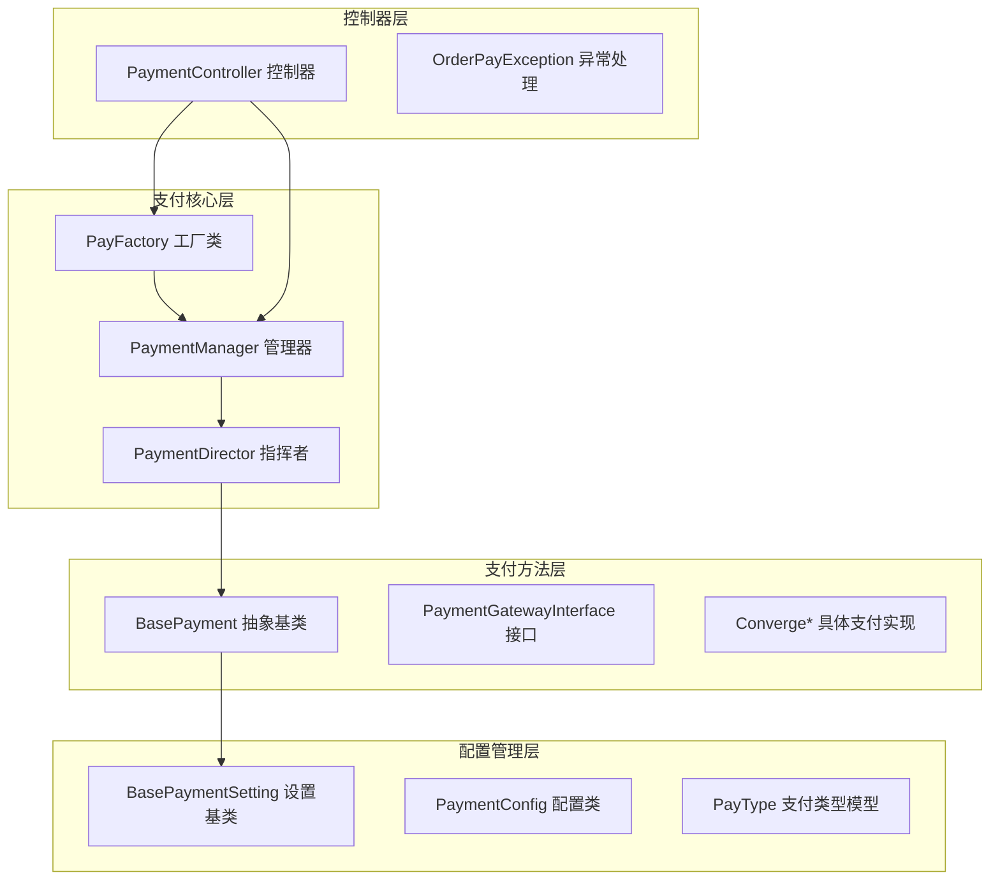
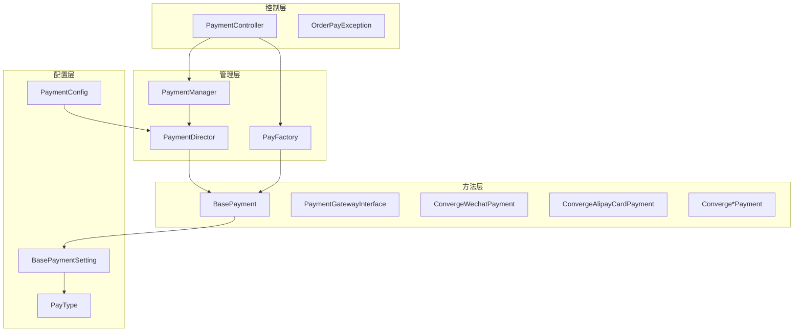
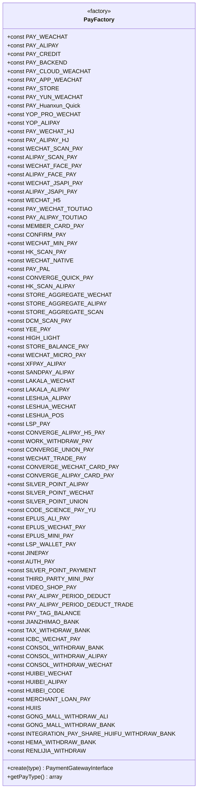
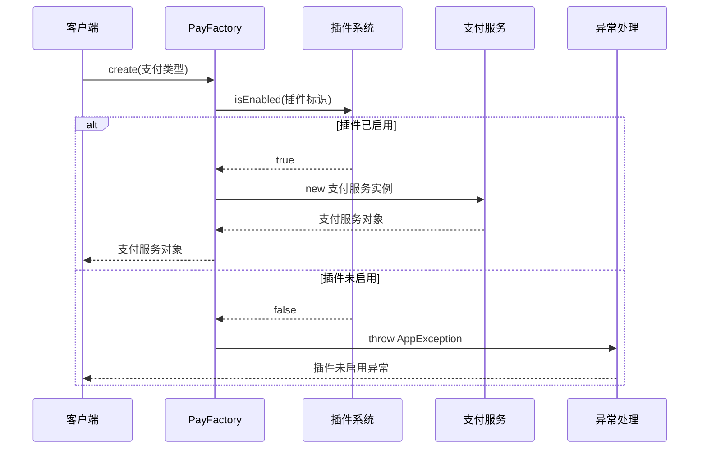
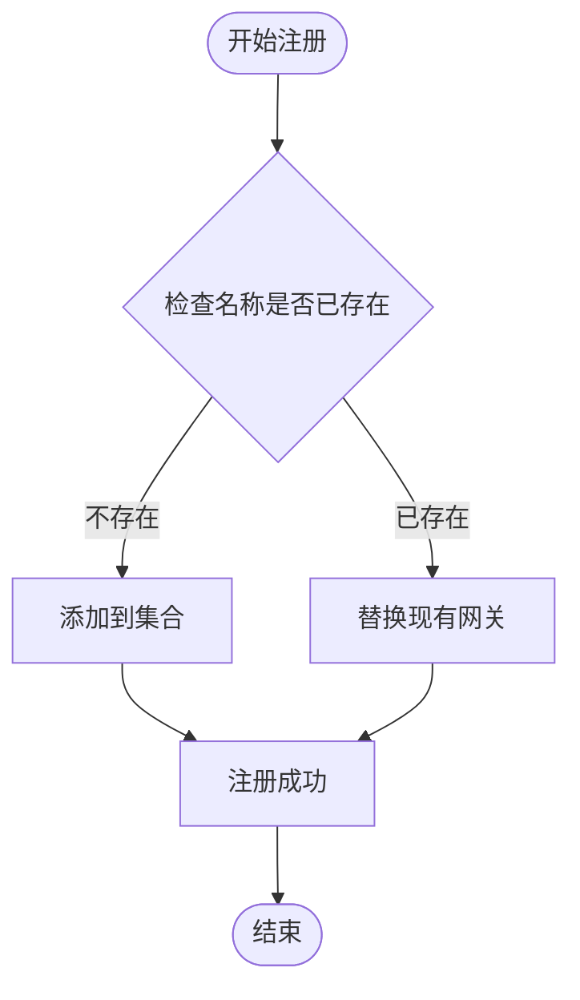
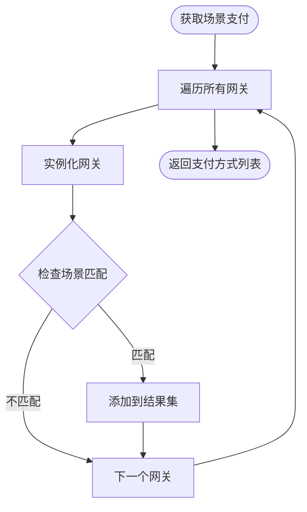
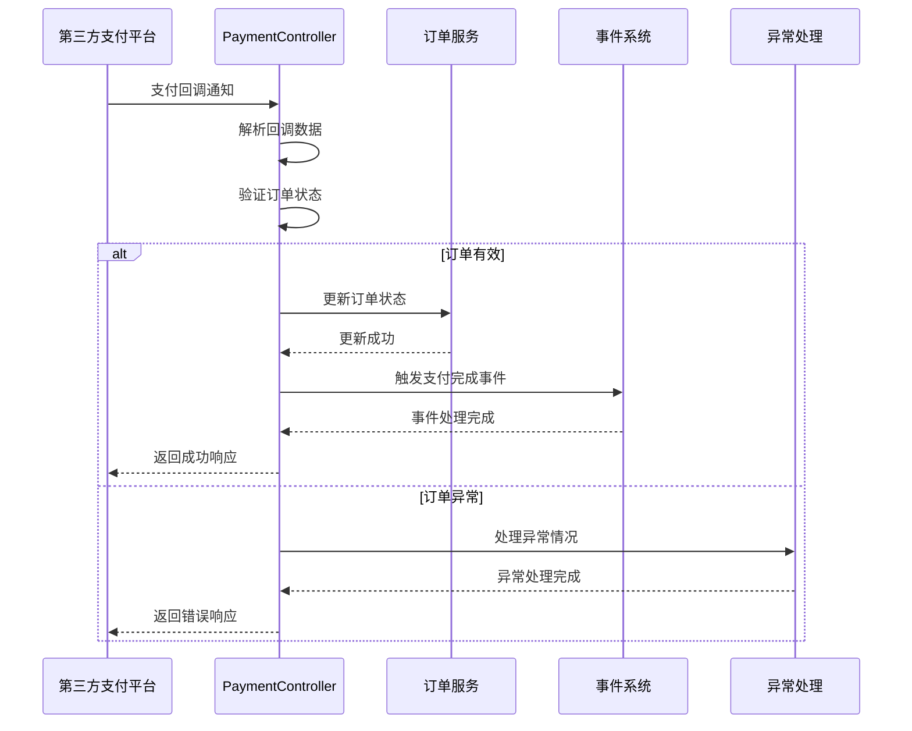
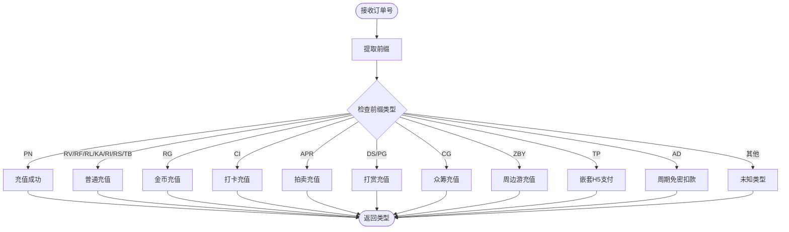
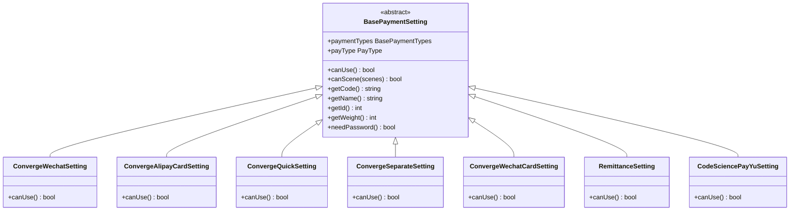
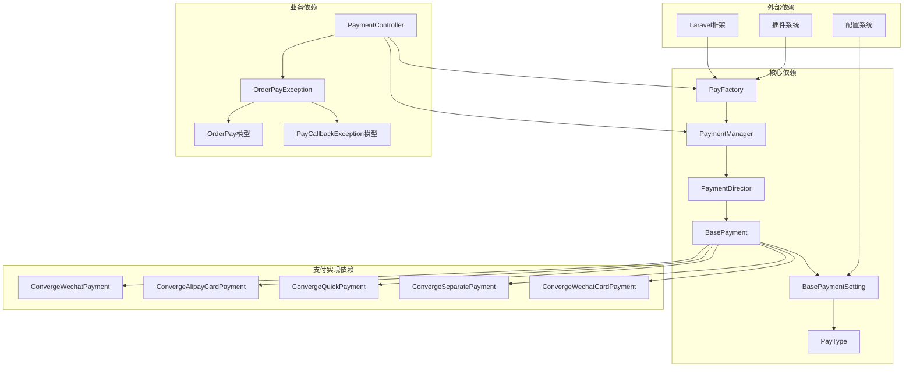

# 支付架构设计

<cite>
**本文档引用的文件**
- [PayFactory.php](file://app/common/services/PayFactory.php)
- [PaymentManager.php](file://app/common/payment/PaymentManager.php)
- [PaymentController.php](file://app/payment/PaymentController.php)
- [OrderPayException.php](file://app/payment/OrderPayException.php)
- [PayType.php](file://app/common/models/PayType.php)
- [BasePayment.php](file://app/common/payment/method/BasePayment.php)
- [PaymentGatewayInterface.php](file://app/common/payment/method/PaymentGatewayInterface.php)
- [PaymentDirector.php](file://app/common/payment/PaymentDirector.php)
- [PaymentConfig.php](file://app/common/payment/PaymentConfig.php)
- [BasePaymentSetting.php](file://app/common/payment/setting/BasePaymentSetting.php)
- [ConvergeWechatPayment.php](file://app/common/payment/method/converge/ConvergeWechatPayment.php)
- [ConvergeAlipayCardPayment.php](file://app/common/payment/method/converge/ConvergeAlipayCardPayment.php)
- [ConvergeQuickPayment.php](file://app/common/payment/method/converge/ConvergeQuickPayment.php)
- [ConvergeSeparatePayment.php](file://app/common/payment/method/converge/ConvergeSeparatePayment.php)
- [ConvergeWechatCardPayment.php](file://app/common/payment/method/converge/ConvergeWechatCardPayment.php)
- [RemittanceSetting.php](file://app/common/payment/setting/other/RemittanceSetting.php)
- [CodeSciencePayYuSetting.php](file://app/common/payment/setting/other/CodeSciencePayYuSetting.php)
</cite>

## 目录
1. [简介](#简介)
2. [项目结构](#项目结构)
3. [核心组件](#核心组件)
4. [架构概览](#架构概览)
5. [详细组件分析](#详细组件分析)
6. [依赖关系分析](#依赖关系分析)
7. [性能考虑](#性能考虑)
8. [故障排除指南](#故障排除指南)
9. [结论](#结论)

## 简介

本项目采用模块化的支付架构设计，通过工厂模式和管理器模式实现了对50+种支付通道的统一接入和管理。该架构具有高度的可扩展性和插件化特性，能够支持多种支付场景和业务需求。

支付架构的核心设计理念包括：
- **统一入口**：通过PayFactory工厂类提供统一的支付服务创建接口
- **插件化设计**：基于插件系统的支付通道扩展机制
- **标准化流程**：统一的支付处理流程和回调机制
- **安全保障**：完善的异常处理和数据验证机制
- **性能优化**：缓存策略和异步处理机制

## 项目结构

支付架构主要分布在以下目录结构中：

**图表来源**
- [PayFactory.php:1-1551](file://app/common/services/PayFactory.php#L1-L1551)
- [PaymentManager.php:1-53](file://app/common/payment/PaymentManager.php#L1-L53)
- [BasePayment.php:1-233](file://app/common/payment/method/BasePayment.php#L1-L233)

**章节来源**
- [PayFactory.php:1-1551](file://app/common/services/PayFactory.php#L1-L1551)
- [PaymentManager.php:1-53](file://app/common/payment/PaymentManager.php#L1-L53)

## 核心组件

### PayFactory 工厂模式

PayFactory采用经典的工厂模式设计，提供了统一的支付服务创建接口。该类包含超过150个支付常量定义，涵盖了微信支付、支付宝支付、银联支付等多种主流支付渠道。

**核心特性**：
- **常量定义**：统一管理所有支付类型的标识符
- **条件判断**：根据插件启用状态动态选择支付实现
- **异常处理**：插件未启用时抛出AppException异常
- **扩展性**：支持新增支付通道的无缝集成

**章节来源**
- [PayFactory.php:29-800](file://app/common/services/PayFactory.php#L29-L800)
- [PayFactory.php:1205-1550](file://app/common/services/PayFactory.php#L1205-L1550)

### PaymentManager 支付管理器

PaymentManager负责支付通道的注册、管理和查询，实现了支付网关的统一管理。

**核心功能**：
- **注册机制**：register方法用于注册支付网关
- **获取接口**：get方法返回指定名称的支付网关实例
- **场景筛选**：getScenePayments根据场景类型筛选可用支付方式
- **类型管理**：维护完整的支付类型列表

**章节来源**
- [PaymentManager.php:8-53](file://app/common/payment/PaymentManager.php#L8-L53)

### BasePayment 抽象基类

BasePayment作为所有具体支付实现的抽象基类，定义了统一的支付处理流程和接口规范。

**关键特性**：
- **接口实现**：实现PaymentGatewayInterface接口
- **日志记录**：统一的支付日志和访问记录
- **退款处理**：标准的退款流程处理
- **回调机制**：统一的支付回调处理

**章节来源**
- [BasePayment.php:29-233](file://app/common/payment/method/BasePayment.php#L29-L233)

## 架构概览

支付架构采用了分层设计，从上到下分别为控制层、管理层、方法层和配置层。

**图表来源**
- [PaymentController.php:1-337](file://app/payment/PaymentController.php#L1-L337)
- [PayFactory.php:1-1551](file://app/common/services/PayFactory.php#L1-L1551)
- [BasePayment.php:1-233](file://app/common/payment/method/BasePayment.php#L1-L233)

## 详细组件分析

### 支付工厂类 PayFactory

PayFactory是整个支付架构的核心，它通过大量的常量定义和条件分支来实现不同支付通道的选择。

#### 支付类型常量体系

支付类型常量按照功能和渠道进行了清晰的分类：

**图表来源**
- [PayFactory.php:29-480](file://app/common/services/PayFactory.php#L29-L480)

#### 插件化支付服务集成

PayFactory通过插件检测机制实现了支付服务的插件化集成：

**图表来源**
- [PayFactory.php:508-600](file://app/common/services/PayFactory.php#L508-L600)

**章节来源**
- [PayFactory.php:480-1140](file://app/common/services/PayFactory.php#L480-L1140)

### 支付管理器 PaymentManager

PaymentManager实现了支付通道的统一管理，提供了注册、获取和筛选支付方式的功能。

#### 支付网关注册机制

**图表来源**
- [PaymentManager.php:20-33](file://app/common/payment/PaymentManager.php#L20-L33)

#### 场景支付筛选逻辑

PaymentManager根据支付场景类型筛选可用的支付方式：

**图表来源**
- [PaymentManager.php:36-46](file://app/common/payment/PaymentManager.php#L36-L46)

**章节来源**
- [PaymentManager.php:8-53](file://app/common/payment/PaymentManager.php#L8-L53)

### 支付控制器 PaymentController

PaymentController负责处理支付回调和通知，实现了统一的支付结果处理机制。

#### 支付回调处理流程

**图表来源**
- [PaymentController.php:252-286](file://app/payment/PaymentController.php#L252-L286)

#### 支付类型识别机制

PaymentController通过订单号前缀识别不同的支付类型：

**图表来源**
- [PaymentController.php:307-335](file://app/payment/PaymentController.php#L307-L335)

**章节来源**
- [PaymentController.php:1-337](file://app/payment/PaymentController.php#L1-L337)

### 支付设置基类 BasePaymentSetting

BasePaymentSetting定义了支付设置的通用接口和行为规范。

#### 支付设置验证机制

**图表来源**
- [BasePaymentSetting.php:17-80](file://app/common/payment/setting/BasePaymentSetting.php#L17-L80)

**章节来源**
- [BasePaymentSetting.php:1-80](file://app/common/payment/setting/BasePaymentSetting.php#L1-L80)

## 依赖关系分析

支付架构的依赖关系体现了清晰的分层设计和解耦原则。

**图表来源**
- [PayFactory.php:1-1551](file://app/common/services/PayFactory.php#L1-L1551)
- [BasePayment.php:1-233](file://app/common/payment/method/BasePayment.php#L1-L233)

### 组件耦合度分析

**低耦合设计**：
- 支付工厂与具体支付实现通过接口解耦
- 支付管理器与支付类型通过配置解耦
- 控制器与支付实现通过服务接口解耦

**高内聚特性**：
- 每个支付实现类专注于特定的支付渠道
- 支付设置类封装了渠道特定的配置逻辑
- 日志记录和异常处理集中在基类中

**章节来源**
- [PayFactory.php:1-1551](file://app/common/services/PayFactory.php#L1-L1551)
- [BasePayment.php:1-233](file://app/common/payment/method/BasePayment.php#L1-L233)

## 性能考虑

支付架构在设计时充分考虑了性能优化和扩展性需求。

### 缓存策略

- **支付类型缓存**：PayType模型提供了支付类型的数据缓存机制
- **插件状态缓存**：插件启用状态通过app('plugins')进行缓存
- **配置数据缓存**：支付配置通过Setting系统进行缓存

### 异步处理

- **回调处理**：支付回调通过独立的控制器处理，避免阻塞主线程
- **日志记录**：支付日志采用异步写入机制
- **退款处理**：退款操作通过独立的服务进行处理

### 扩展性设计

- **插件化架构**：新的支付渠道可以通过插件形式轻松集成
- **配置驱动**：支付参数通过配置文件管理，便于调整
- **接口标准化**：统一的支付接口简化了新渠道的接入

## 故障排除指南

### 常见异常类型

#### 插件未启用异常

当尝试使用未启用的支付插件时，系统会抛出AppException异常。

**处理建议**：
1. 检查插件是否正确安装和启用
2. 验证插件配置参数是否正确
3. 查看插件版本兼容性

#### 支付回调异常

支付回调过程中可能出现各种异常情况：

**常见问题及解决方案**：
- **订单重复支付**：系统会自动识别并返回成功响应
- **订单已关闭**：系统会记录异常并触发自动退款流程
- **金额校验失败**：检查订单金额计算逻辑和汇率转换

**章节来源**
- [OrderPayException.php:1-91](file://app/payment/OrderPayException.php#L1-L91)
- [PaymentController.php:252-286](file://app/payment/PaymentController.php#L252-L286)

### 日志分析

支付系统提供了完整的日志记录机制，包括：

- **访问日志**：记录所有支付请求的访问信息
- **操作日志**：记录支付操作的详细信息
- **异常日志**：记录支付过程中的异常情况
- **退款日志**：记录退款操作的完整流程

**章节来源**
- [BasePayment.php:129-184](file://app/common/payment/method/BasePayment.php#L129-L184)

## 结论

该支付架构设计具有以下显著优势：

### 设计优势

1. **高度模块化**：通过工厂模式和管理器模式实现了清晰的职责分离
2. **强扩展性**：插件化架构支持50+种支付通道的无缝集成
3. **标准化流程**：统一的支付处理流程确保了系统的稳定性和一致性
4. **完善的安全机制**：多层次的异常处理和数据验证保障了支付安全

### 技术亮点

- **工厂模式应用**：PayFactory提供了统一的支付服务创建接口
- **配置驱动开发**：通过配置文件管理支付参数，便于维护和调整
- **事件驱动架构**：基于事件系统的支付完成通知机制
- **日志监控体系**：完整的日志记录和监控机制

### 最佳实践建议

1. **插件管理**：建立完善的插件生命周期管理机制
2. **配置管理**：制定统一的配置管理规范和版本控制策略
3. **性能监控**：建立支付系统的性能监控和告警机制
4. **安全审计**：定期进行支付安全审计和漏洞扫描

该架构为大规模支付场景提供了可靠的技术支撑，能够满足电商、金融等领域的复杂支付需求。