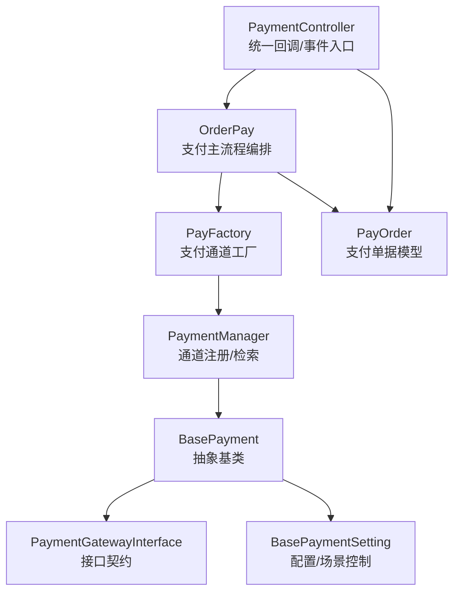
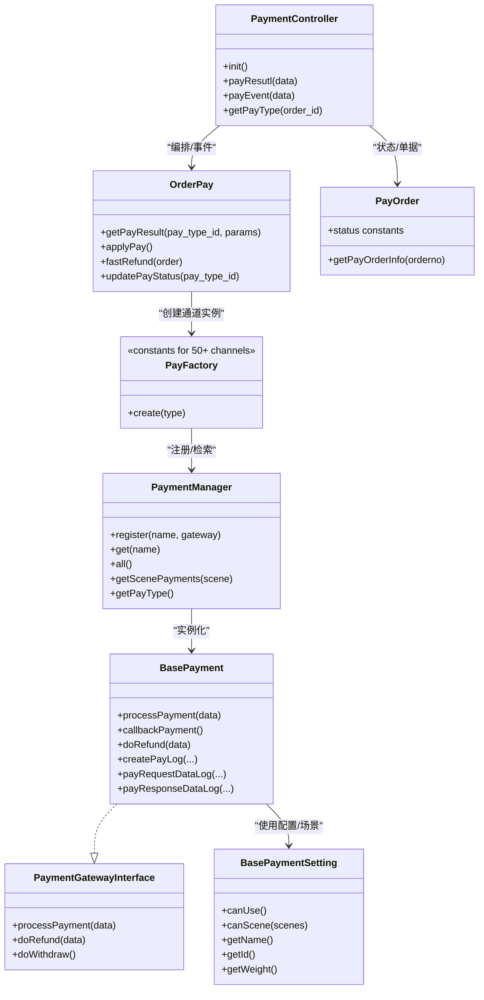
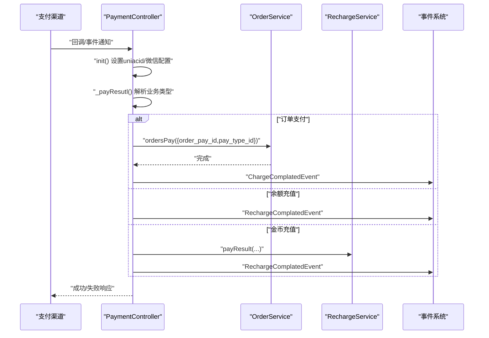
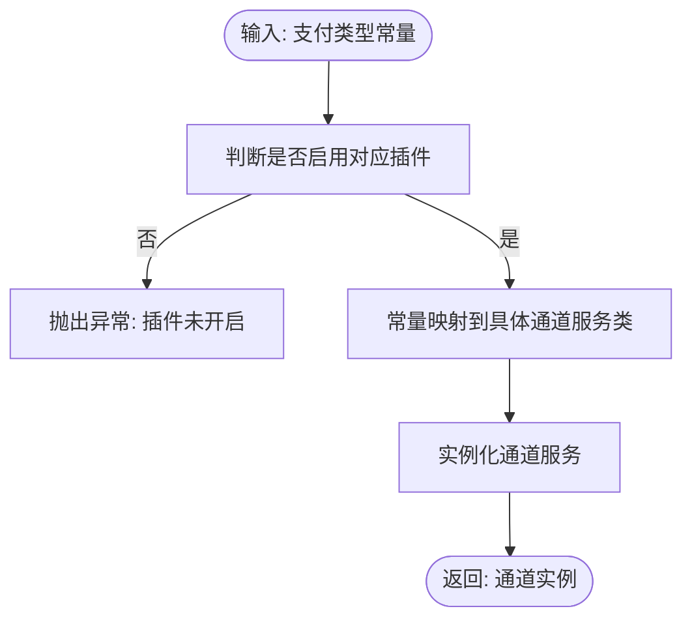
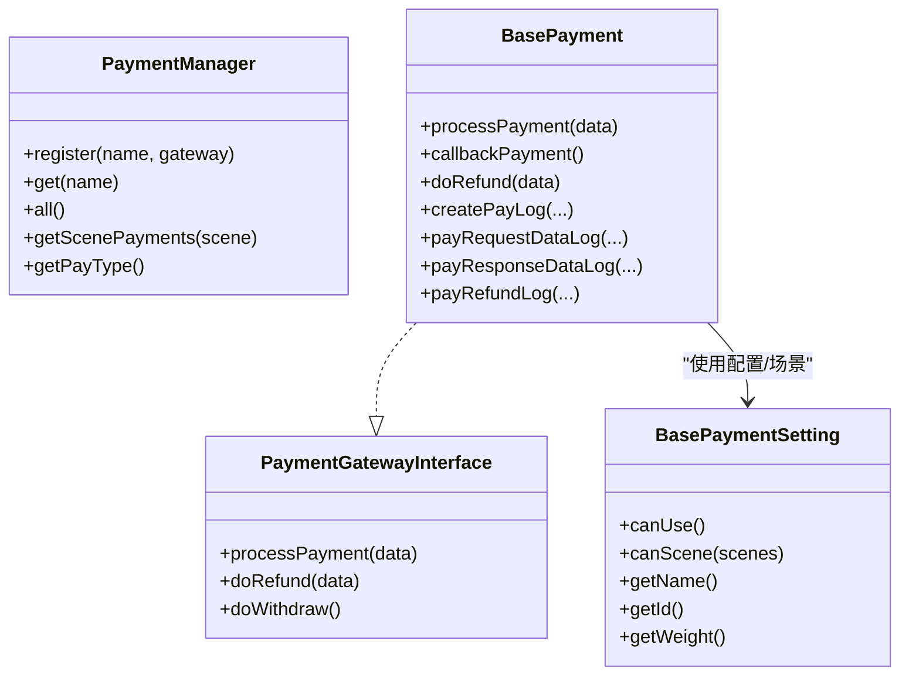
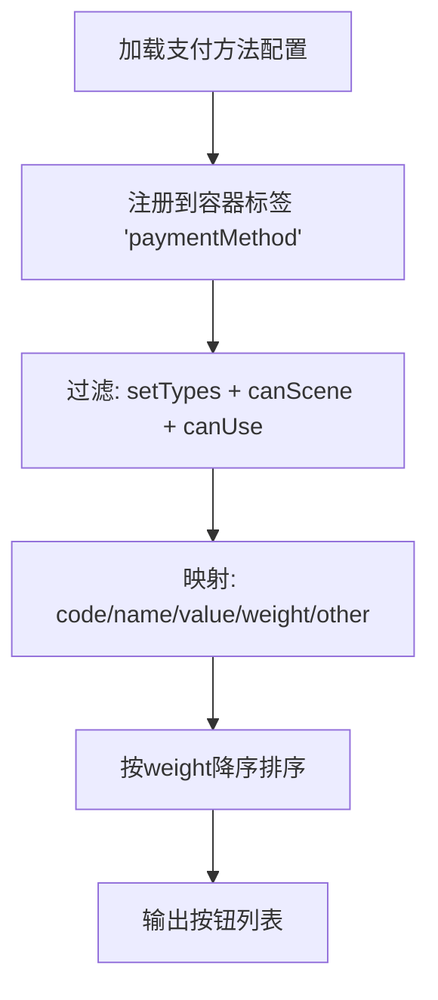
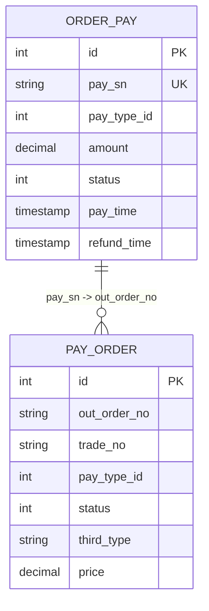
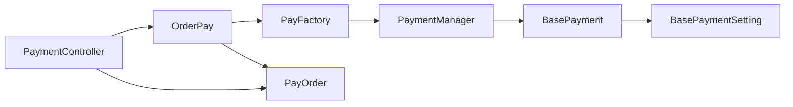
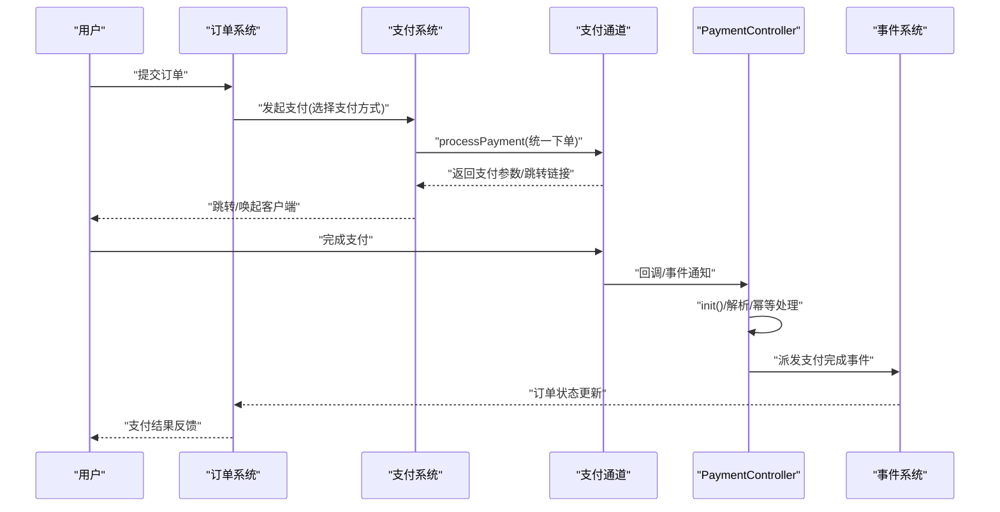

# 支付系统

<cite>
**本文引用的文件**
- [PaymentController.php](file://app/payment/PaymentController.php)
- [PayFactory.php](file://app/common/services/PayFactory.php)
- [PaymentManager.php](file://app/common/payment/PaymentManager.php)
- [PaymentDirector.php](file://app/common/payment/PaymentDirector.php)
- [BasePayment.php](file://app/common/payment/method/BasePayment.php)
- [PaymentGatewayInterface.php](file://app/common/payment/method/PaymentGatewayInterface.php)
- [BasePaymentSetting.php](file://app/common/payment/setting/BasePaymentSetting.php)
- [OrderPay.php](file://app/common/models/OrderPay.php)
- [PayOrder.php](file://app/common/models/PayOrder.php)
</cite>

## 目录
1. [简介](#简介)
2. [项目结构](#项目结构)
3. [核心组件](#核心组件)
4. [架构总览](#架构总览)
5. [详细组件分析](#详细组件分析)
6. [依赖关系分析](#依赖关系分析)
7. [性能与高可用](#性能与高可用)
8. [故障排查指南](#故障排查指南)
9. [结论](#结论)
10. [附录](#附录)

## 简介
本文件面向芸众商城支付系统，系统性梳理统一支付管理器、支付通道抽象、回调处理机制、工厂模式接入50+支付通道的关键实现，以及支付流程全生命周期、安全机制（签名与幂等）、集成开发指南与性能优化策略。目标是帮助开发者在理解现有架构的基础上，快速完成新通道接入、配置管理与异常处理。

## 项目结构
围绕支付能力，系统采用“控制器-工厂-通道抽象-配置/场景-日志/对账”分层组织：
- 控制器层：统一入口与回调处理，负责环境初始化、回调解析、事件派发与异常处理
- 工厂层：集中管理支付通道实例化与路由，支撑50+通道的统一接入
- 抽象层：定义支付网关接口与通用基类，封装日志、请求/响应数据记录、退款流程
- 配置/场景层：通过Director与Setting控制支付按钮展示与可用性
- 模型层：订单支付与支付单据的数据模型，承载状态与关联关系

图表来源
- [PaymentController.php:1-337](file://app/payment/PaymentController.php#L1-L337)
- [PayFactory.php:1-800](file://app/common/services/PayFactory.php#L1-L800)
- [PaymentManager.php:1-53](file://app/common/payment/PaymentManager.php#L1-L53)
- [BasePayment.php:1-233](file://app/common/payment/method/BasePayment.php#L1-L233)
- [BasePaymentSetting.php:1-80](file://app/common/payment/setting/BasePaymentSetting.php#L1-L80)
- [OrderPay.php:1-541](file://app/common/models/OrderPay.php#L1-L541)
- [PayOrder.php:1-81](file://app/common/models/PayOrder.php#L1-L81)

章节来源
- [PaymentController.php:1-337](file://app/payment/PaymentController.php#L1-L337)
- [PayFactory.php:1-800](file://app/common/services/PayFactory.php#L1-L800)
- [PaymentManager.php:1-53](file://app/common/payment/PaymentManager.php#L1-L53)
- [BasePayment.php:1-233](file://app/common/payment/method/BasePayment.php#L1-L233)
- [BasePaymentSetting.php:1-80](file://app/common/payment/setting/BasePaymentSetting.php#L1-L80)
- [OrderPay.php:1-541](file://app/common/models/OrderPay.php#L1-L541)
- [PayOrder.php:1-81](file://app/common/models/PayOrder.php#L1-L81)

## 核心组件
- 统一支付控制器：负责回调/事件入口、环境初始化（uniacid、微信账号配置）、回调结果解析与事件派发、异常处理与幂等保护
- 支付工厂：集中映射支付类型常量到具体通道服务，按需启用插件，屏蔽通道差异
- 支付管理器：注册/检索支付通道，按场景过滤可选通道，提供支付类型列表
- 支付抽象基类：统一流程入口、回调处理、日志与数据记录、退款流程封装
- 支付配置/场景：根据场景与开关控制支付按钮展示与可用性
- 订单支付模型：支付主流程编排、参数校验、通道选择与调用、退款适配
- 支付单据模型：支付单据状态、与订单支付关联、退款状态标记

章节来源
- [PaymentController.php:1-337](file://app/payment/PaymentController.php#L1-L337)
- [PayFactory.php:1-800](file://app/common/services/PayFactory.php#L1-L800)
- [PaymentManager.php:1-53](file://app/common/payment/PaymentManager.php#L1-L53)
- [BasePayment.php:1-233](file://app/common/payment/method/BasePayment.php#L1-L233)
- [BasePaymentSetting.php:1-80](file://app/common/payment/setting/BasePaymentSetting.php#L1-L80)
- [OrderPay.php:1-541](file://app/common/models/OrderPay.php#L1-L541)
- [PayOrder.php:1-81](file://app/common/models/PayOrder.php#L1-L81)

## 架构总览
支付系统采用“控制器-工厂-抽象基类-管理器-模型”的分层架构，结合“场景/配置”控制按钮展示与可用性，形成统一的支付接入与回调处理闭环。

图表来源
- [PaymentController.php:1-337](file://app/payment/PaymentController.php#L1-L337)
- [PayFactory.php:1-800](file://app/common/services/PayFactory.php#L1-L800)
- [PaymentManager.php:1-53](file://app/common/payment/PaymentManager.php#L1-L53)
- [BasePayment.php:1-233](file://app/common/payment/method/BasePayment.php#L1-L233)
- [PaymentGatewayInterface.php:1-12](file://app/common/payment/method/PaymentGatewayInterface.php#L1-L12)
- [BasePaymentSetting.php:1-80](file://app/common/payment/setting/BasePaymentSetting.php#L1-L80)
- [OrderPay.php:1-541](file://app/common/models/OrderPay.php#L1-L541)
- [PayOrder.php:1-81](file://app/common/models/PayOrder.php#L1-L81)

## 详细组件分析

### 统一支付控制器（PaymentController）
职责与特性
- 环境初始化：根据回调脚本名与请求参数设置uniacid，加载微信账号配置
- 回调解析：解析回调数据，识别业务类型（充值/打赏/众筹/第三方H5等），更新支付单据状态
- 事件派发：根据业务类型触发相应事件（如订单支付完成、充值完成）
- 异常处理：捕获异常，区分重复支付、订单已关闭等场景，执行幂等处理或输出错误

图表来源
- [PaymentController.php:106-246](file://app/payment/PaymentController.php#L106-L246)
- [PaymentController.php:252-299](file://app/payment/PaymentController.php#L252-L299)

章节来源
- [PaymentController.php:1-337](file://app/payment/PaymentController.php#L1-L337)

### 支付工厂（PayFactory）
职责与特性
- 常量枚举：定义50+支付类型的常量标识，覆盖微信/支付宝/余额/云收银/聚合支付/小程序/第三方H5等
- 实例化路由：根据常量映射到具体通道服务，按插件开关动态启用
- 插件解耦：通过插件启用状态与命名空间隔离，避免硬编码耦合

图表来源
- [PayFactory.php:480-800](file://app/common/services/PayFactory.php#L480-L800)

章节来源
- [PayFactory.php:1-800](file://app/common/services/PayFactory.php#L1-L800)

### 支付管理器（PaymentManager）与支付抽象基类（BasePayment）
职责与特性
- 注册/检索：以名称注册支付通道类，按名称检索并实例化
- 场景过滤：根据通道支持的场景集合筛选可选项
- 流程封装：统一processPayment入口、回调处理callbackPayment、退款流程doRefund
- 日志与数据记录：记录访问日志、支付日志、请求/响应数据、退款记录
- 配置/场景控制：委托BasePaymentSetting进行可用性与场景校验

图表来源
- [PaymentManager.php:1-53](file://app/common/payment/PaymentManager.php#L1-L53)
- [BasePayment.php:1-233](file://app/common/payment/method/BasePayment.php#L1-L233)
- [PaymentGatewayInterface.php:1-12](file://app/common/payment/method/PaymentGatewayInterface.php#L1-L12)
- [BasePaymentSetting.php:1-80](file://app/common/payment/setting/BasePaymentSetting.php#L1-L80)

章节来源
- [PaymentManager.php:1-53](file://app/common/payment/PaymentManager.php#L1-L53)
- [BasePayment.php:1-233](file://app/common/payment/method/BasePayment.php#L1-L233)
- [PaymentGatewayInterface.php:1-12](file://app/common/payment/method/PaymentGatewayInterface.php#L1-L12)
- [BasePaymentSetting.php:1-80](file://app/common/payment/setting/BasePaymentSetting.php#L1-L80)

### 支付目录器（PaymentDirector）与按钮生成
职责与特性
- 通过配置加载支付方法集合，注入到容器标签
- 过滤：仅保留具备code、可使用场景与可用性的支付方法
- 排序：按权重降序生成按钮列表，供前端渲染

图表来源
- [PaymentDirector.php:18-57](file://app/common/payment/PaymentDirector.php#L18-L57)

章节来源
- [PaymentDirector.php:1-57](file://app/common/payment/PaymentDirector.php#L1-L57)

### 订单支付模型（OrderPay）与支付单据模型（PayOrder）
职责与特性
- 订单支付模型：参数校验、事件触发、通道选择与调用、退款适配、状态更新
- 支付单据模型：支付单据状态管理、与订单支付关联、退款状态标记

图表来源
- [OrderPay.php:57-541](file://app/common/models/OrderPay.php#L57-L541)
- [PayOrder.php:24-81](file://app/common/models/PayOrder.php#L24-L81)

章节来源
- [OrderPay.php:1-541](file://app/common/models/OrderPay.php#L1-L541)
- [PayOrder.php:1-81](file://app/common/models/PayOrder.php#L1-L81)

## 依赖关系分析
- 控制器依赖：OrderPay（编排）、PayFactory（通道）、PayOrder（状态）、事件系统
- 工厂依赖：插件启用状态、命名空间映射
- 抽象基类依赖：日志模型、请求/响应数据模型、退款记录模型
- 管理器依赖：支付类型配置、通道类注册
- 模型依赖：订单/支付单据关联、状态枚举

图表来源
- [PaymentController.php:1-337](file://app/payment/PaymentController.php#L1-L337)
- [PayFactory.php:1-800](file://app/common/services/PayFactory.php#L1-L800)
- [PaymentManager.php:1-53](file://app/common/payment/PaymentManager.php#L1-L53)
- [BasePayment.php:1-233](file://app/common/payment/method/BasePayment.php#L1-L233)
- [BasePaymentSetting.php:1-80](file://app/common/payment/setting/BasePaymentSetting.php#L1-L80)
- [OrderPay.php:1-541](file://app/common/models/OrderPay.php#L1-L541)
- [PayOrder.php:1-81](file://app/common/models/PayOrder.php#L1-L81)

章节来源
- [PaymentController.php:1-337](file://app/payment/PaymentController.php#L1-L337)
- [PayFactory.php:1-800](file://app/common/services/PayFactory.php#L1-L800)
- [PaymentManager.php:1-53](file://app/common/payment/PaymentManager.php#L1-L53)
- [BasePayment.php:1-233](file://app/common/payment/method/BasePayment.php#L1-L233)
- [BasePaymentSetting.php:1-80](file://app/common/payment/setting/BasePaymentSetting.php#L1-L80)
- [OrderPay.php:1-541](file://app/common/models/OrderPay.php#L1-L541)
- [PayOrder.php:1-81](file://app/common/models/PayOrder.php#L1-L81)

## 性能与高可用
- 并发与幂等
  - 控制器对重复回调进行幂等处理，避免重复入账与重复退款
  - 订单支付模型对已关闭订单拒绝支付，防止无效交易
- 日志与可观测性
  - 统一访问日志、支付日志、请求/响应数据日志、退款记录，便于审计与追踪
- 插件化与解耦
  - 通过工厂与管理器的插件开关控制，降低耦合度，提升扩展性
- 重试与降级
  - 建议在通道调用层增加指数退避重试与熔断降级策略（建议）

[本节为通用性能讨论，无需特定文件引用]

## 故障排查指南
常见问题与定位思路
- 回调金额不一致
  - 控制器在解析回调时会比对金额，不一致将抛出异常；检查上游渠道金额单位与转换逻辑
- 重复回调导致重复入账
  - 控制器对重复支付场景返回成功；若出现异常，检查异常分支与日志
- 订单已关闭仍尝试支付
  - 订单支付模型在支付前校验订单状态，已关闭将抛出异常；确认订单状态流转
- 插件未启用导致通道不可用
  - 工厂在映射通道前检查插件启用状态；确认插件开关与命名空间正确
- 退款失败或状态不一致
  - 抽象基类记录退款请求号与状态；核对第三方退款结果与本地状态一致性

章节来源
- [PaymentController.php:141-144](file://app/payment/PaymentController.php#L141-L144)
- [OrderPay.php:245-247](file://app/common/models/OrderPay.php#L245-L247)
- [PayFactory.php:508-513](file://app/common/services/PayFactory.php#L508-L513)
- [BasePayment.php:195-205](file://app/common/payment/method/BasePayment.php#L195-L205)

## 结论
该支付系统通过“控制器-工厂-抽象基类-管理器-模型”的分层设计，实现了对50+支付通道的统一接入与回调处理。工厂模式与插件化开关确保了扩展性与解耦；抽象基类封装了流程、日志与退款，提升了复用性；控制器负责环境初始化与事件派发，保障了回调处理的一致性。配合完善的日志与状态模型，系统具备良好的可观测性与可维护性。

[本节为总结性内容，无需特定文件引用]

## 附录

### 支付流程全生命周期（从下单到结算）

图表来源
- [OrderPay.php:308-361](file://app/common/models/OrderPay.php#L308-L361)
- [PaymentController.php:106-246](file://app/payment/PaymentController.php#L106-L246)

### 新通道接入开发指南
- 在工厂中新增常量与映射
  - 在工厂中添加新的支付类型常量，并在create方法中添加映射
  - 若为插件通道，确保插件启用检查逻辑正确
- 实现通道服务类
  - 实现统一入口与回调处理（参考抽象基类）
  - 在通道类中实现processPayment/doRefund/doWithdraw
- 注册到管理器
  - 将通道类注册到管理器，或通过容器绑定
- 配置与场景控制
  - 在配置/场景层设置可用性与场景支持
- 回调与事件
  - 在控制器中完善回调解析与事件派发
- 日志与对账
  - 使用抽象基类的日志与数据记录方法，确保可审计

章节来源
- [PayFactory.php:480-800](file://app/common/services/PayFactory.php#L480-L800)
- [BasePayment.php:79-127](file://app/common/payment/method/BasePayment.php#L79-L127)
- [PaymentManager.php:20-33](file://app/common/payment/PaymentManager.php#L20-L33)
- [BasePaymentSetting.php:36-79](file://app/common/payment/setting/BasePaymentSetting.php#L36-L79)
- [PaymentController.php:106-246](file://app/payment/PaymentController.php#L106-L246)