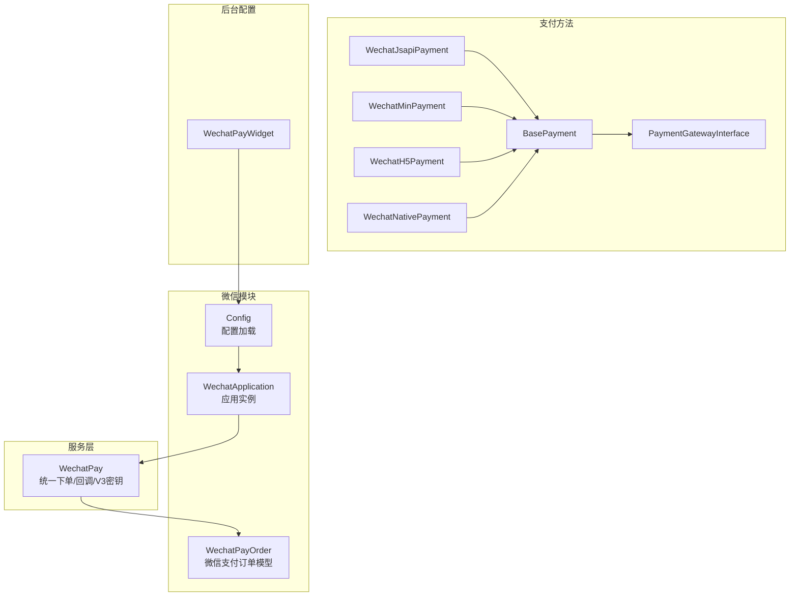
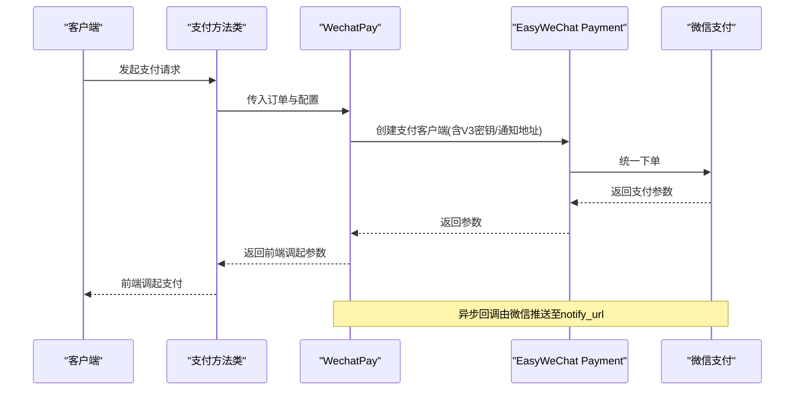
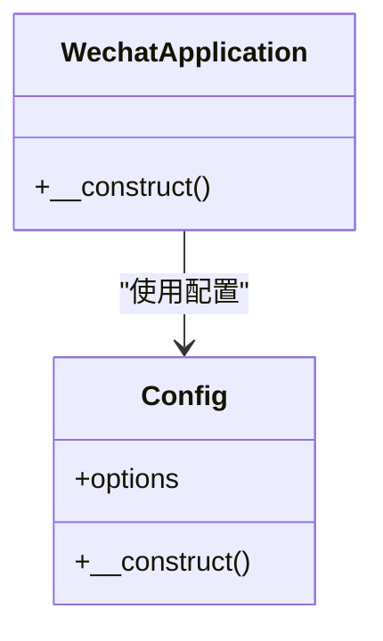
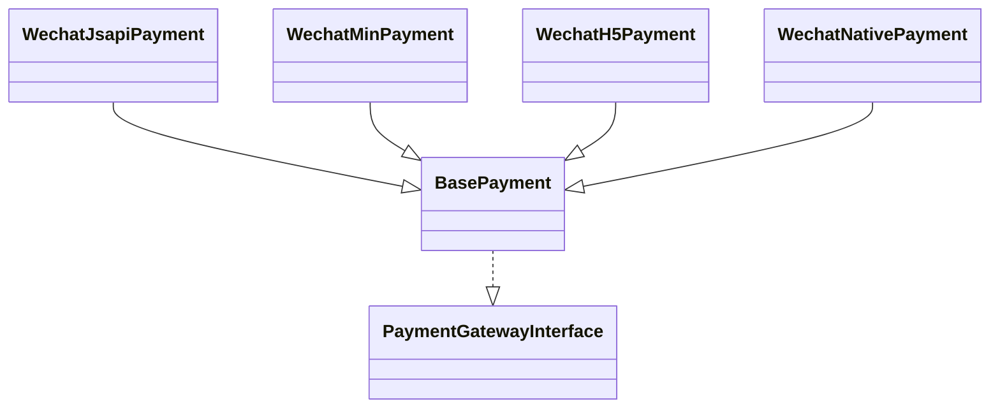
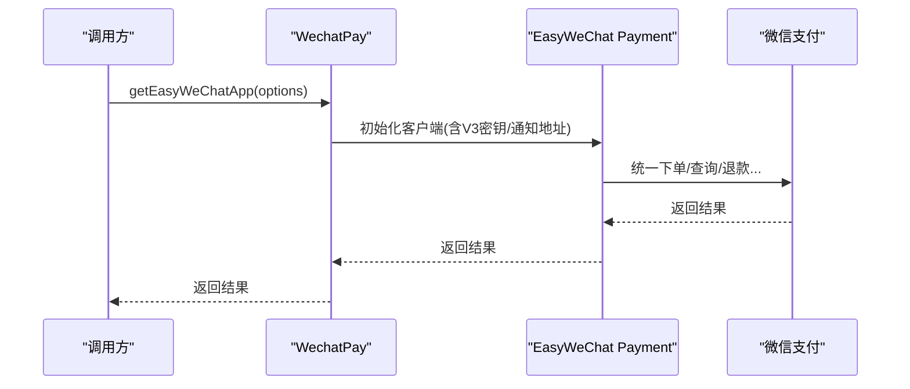
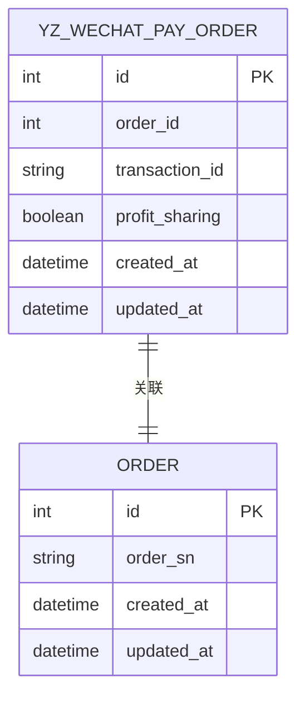
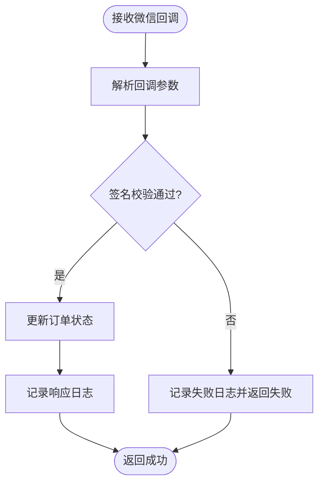
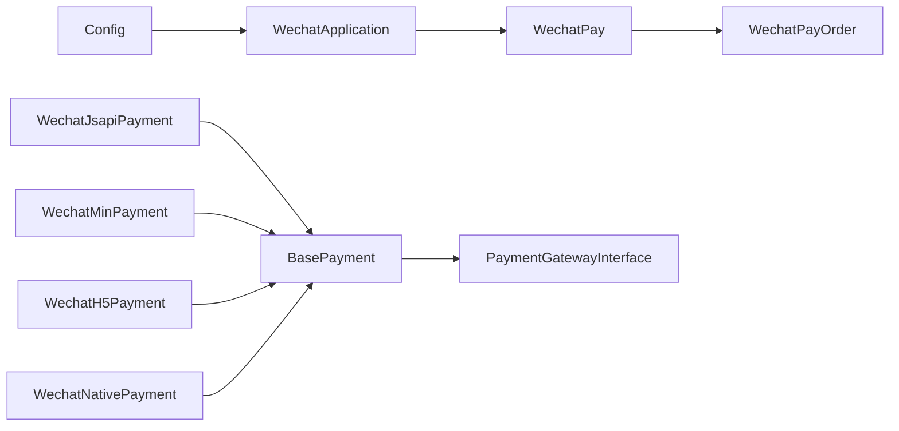

# 微信支付通道

<cite>
**本文引用的文件**
- [WechatApplication.php](file://app/common/modules/wechat/WechatApplication.php)
- [Config.php](file://app/common/modules/wechat/Config.php)
- [WechatPayOrder.php](file://app/common/modules/wechat/models/WechatPayOrder.php)
- [WechatPay.php](file://app/common/services/WechatPay.php)
- [WechatJsapiPayment.php](file://app/common/payment/method/wechat/WechatJsapiPayment.php)
- [WechatMinPayment.php](file://app/common/payment/method/wechat/WechatMinPayment.php)
- [WechatH5Payment.php](file://app/common/payment/method/wechat/WechatH5Payment.php)
- [WechatNativePayment.php](file://app/common/payment/method/wechat/WechatNativePayment.php)
- [BasePayment.php](file://app/common/payment/method/BasePayment.php)
- [PaymentGatewayInterface.php](file://app/common/payment/method/PaymentGatewayInterface.php)
- [WechatPayWidget.php](file://app/backend/modules/setting/payment/WechatPayWidget.php)
- [WechatPayOrder 表结构](file://database/migrations/2019_11_28_140147_create_ims_yz_wechat_pay_order_table.php)
</cite>

## 目录
1. [简介](#简介)
2. [项目结构](#项目结构)
3. [核心组件](#核心组件)
4. [架构总览](#架构总览)
5. [详细组件分析](#详细组件分析)
6. [依赖关系分析](#依赖关系分析)
7. [性能考量](#性能考量)
8. [故障排查指南](#故障排查指南)
9. [结论](#结论)
10. [附录](#附录)

## 简介
本文件面向“微信支付通道”的实现与使用，覆盖 JSAPI 支付、扫码支付（Native）、H5 支付、小程序支付等多种支付方式；解释回调处理机制（含 notify_url 的对接思路）、签名验证流程、订单状态更新；阐述安全机制（RSA 加密、MD5 校验、参数签名）；并给出配置管理（商户号、API 密钥、证书文件）与调试排错方法。

## 项目结构
微信支付能力在本项目中采用“模块化 + 易对接”设计：
- 应用层封装：基于 EasyWeChat 的应用实例与配置加载
- 支付入口：统一由支付方法类（如 WechatJsapiPayment、WechatMinPayment 等）承载
- 服务层：WechatPay 提供统一下单、回调解析、通知处理、V3 密钥注入等能力
- 数据模型：WechatPayOrder 对接微信支付订单表，用于查询与关联业务订单
- 后台配置：WechatPayWidget 提供后台可视化配置入口

图表来源
- [WechatApplication.php:1-17](file://app/common/modules/wechat/WechatApplication.php#L1-L17)
- [Config.php:80-106](file://app/common/modules/wechat/Config.php#L80-L106)
- [WechatPayOrder.php:22-49](file://app/common/modules/wechat/models/WechatPayOrder.php#L22-L49)
- [WechatJsapiPayment.php:17-25](file://app/common/payment/method/wechat/WechatJsapiPayment.php#L17-L25)
- [WechatMinPayment.php:17-25](file://app/common/payment/method/wechat/WechatMinPayment.php#L17-L25)
- [WechatH5Payment.php:17-25](file://app/common/payment/method/wechat/WechatH5Payment.php#L17-L25)
- [WechatNativePayment.php:17-25](file://app/common/payment/method/wechat/WechatNativePayment.php#L17-L25)
- [BasePayment.php](file://app/common/payment/method/BasePayment.php)
- [PaymentGatewayInterface.php](file://app/common/payment/method/PaymentGatewayInterface.php)
- [WechatPay.php:537-551](file://app/common/services/WechatPay.php#L537-L551)
- [WechatPayWidget.php](file://app/backend/modules/setting/payment/WechatPayWidget.php)

章节来源
- [WechatApplication.php:1-17](file://app/common/modules/wechat/WechatApplication.php#L1-L17)
- [Config.php:80-106](file://app/common/modules/wechat/Config.php#L80-L106)
- [WechatPayOrder.php:22-49](file://app/common/modules/wechat/models/WechatPayOrder.php#L22-L49)
- [WechatPay.php:537-551](file://app/common/services/WechatPay.php#L537-L551)
- [WechatJsapiPayment.php:17-25](file://app/common/payment/method/wechat/WechatJsapiPayment.php#L17-L25)
- [WechatMinPayment.php:17-25](file://app/common/payment/method/wechat/WechatMinPayment.php#L17-L25)
- [WechatH5Payment.php:17-25](file://app/common/payment/method/wechat/WechatH5Payment.php#L17-L25)
- [WechatNativePayment.php:17-25](file://app/common/payment/method/wechat/WechatNativePayment.php#L17-L25)
- [WechatPayWidget.php](file://app/backend/modules/setting/payment/WechatPayWidget.php)

## 核心组件
- WechatApplication：继承 EasyWeChat 基础应用，构造时注入微信配置选项
- Config：从系统设置读取微信 AppID、AppSecret、Token、EncodingAESKey 等参数
- WechatPay：统一封装支付对象创建、回调解析、V3 密钥注入、响应日志记录
- 支付方法类（WechatJsapiPayment、WechatMinPayment、WechatH5Payment、WechatNativePayment）：以“方法即策略”的形式接入支付网关
- WechatPayOrder：微信支付订单模型，支持按交易号、订单号、分账标记、时间范围检索，并关联业务订单
- 后台配置组件：WechatPayWidget 将配置项暴露到后台界面

章节来源
- [WechatApplication.php:10-17](file://app/common/modules/wechat/WechatApplication.php#L10-L17)
- [Config.php:80-106](file://app/common/modules/wechat/Config.php#L80-L106)
- [WechatPay.php:537-551](file://app/common/services/WechatPay.php#L537-L551)
- [WechatJsapiPayment.php:17-25](file://app/common/payment/method/wechat/WechatJsapiPayment.php#L17-L25)
- [WechatMinPayment.php:17-25](file://app/common/payment/method/wechat/WechatMinPayment.php#L17-L25)
- [WechatH5Payment.php:17-25](file://app/common/payment/method/wechat/WechatH5Payment.php#L17-L25)
- [WechatNativePayment.php:17-25](file://app/common/payment/method/wechat/WechatNativePayment.php#L17-L25)
- [WechatPayOrder.php:22-49](file://app/common/modules/wechat/models/WechatPayOrder.php#L22-L49)
- [WechatPayWidget.php](file://app/backend/modules/setting/payment/WechatPayWidget.php)

## 架构总览
微信支付通道采用“配置驱动 + 方法策略 + 服务编排”的架构：
- 配置层：Config 从 Setting 中读取微信参数，WechatApplication 负责组装 EasyWeChat 应用
- 支付层：各支付方法类通过 BasePayment 接口约定，统一对外暴露下单、回调等能力
- 服务层：WechatPay 负责与 EasyWeChat Payment 客户端交互，注入 V3 密钥、处理回调
- 数据层：WechatPayOrder 作为微信侧订单与业务订单的桥梁，支撑查询与状态追踪

图表来源
- [WechatPay.php:537-551](file://app/common/services/WechatPay.php#L537-L551)
- [WechatJsapiPayment.php:17-25](file://app/common/payment/method/wechat/WechatJsapiPayment.php#L17-L25)
- [WechatMinPayment.php:17-25](file://app/common/payment/method/wechat/WechatMinPayment.php#L17-L25)
- [WechatH5Payment.php:17-25](file://app/common/payment/method/wechat/WechatH5Payment.php#L17-L25)
- [WechatNativePayment.php:17-25](file://app/common/payment/method/wechat/WechatNativePayment.php#L17-L25)

## 详细组件分析

### WechatApplication 与 Config
- WechatApplication 在构造函数中将 Config.options 注入 EasyWeChat 应用，确保后续支付模块可直接使用已配置的 app_id、secret、token、aes_key、oauth、guzzle 等参数
- Config 从 Setting::get('plugin.wechat') 读取微信公众号/小程序相关配置，并从 Setting::get('plugin.wechat.token/aes_key') 读取安全参数

图表来源
- [WechatApplication.php:10-17](file://app/common/modules/wechat/WechatApplication.php#L10-L17)
- [Config.php:80-106](file://app/common/modules/wechat/Config.php#L80-L106)

章节来源
- [WechatApplication.php:10-17](file://app/common/modules/wechat/WechatApplication.php#L10-L17)
- [Config.php:80-106](file://app/common/modules/wechat/Config.php#L80-L106)

### 支付方法类（JSAPI/小程序/H5/扫码）
- WechatJsapiPayment：面向公众号内 JSAPI 场景
- WechatMinPayment：面向小程序场景
- WechatH5Payment：面向移动端浏览器 H5 场景
- WechatNativePayment：面向扫码支付（原生）
- 所有支付方法类均继承 BasePayment 并实现 PaymentGatewayInterface，保证统一的下单与回调接口

图表来源
- [WechatJsapiPayment.php:17-25](file://app/common/payment/method/wechat/WechatJsapiPayment.php#L17-L25)
- [WechatMinPayment.php:17-25](file://app/common/payment/method/wechat/WechatMinPayment.php#L17-L25)
- [WechatH5Payment.php:17-25](file://app/common/payment/method/wechat/WechatH5Payment.php#L17-L25)
- [WechatNativePayment.php:17-25](file://app/common/payment/method/wechat/WechatNativePayment.php#L17-L25)
- [BasePayment.php](file://app/common/payment/method/BasePayment.php)
- [PaymentGatewayInterface.php](file://app/common/payment/method/PaymentGatewayInterface.php)

章节来源
- [WechatJsapiPayment.php:17-25](file://app/common/payment/method/wechat/WechatJsapiPayment.php#L17-L25)
- [WechatMinPayment.php:17-25](file://app/common/payment/method/wechat/WechatMinPayment.php#L17-L25)
- [WechatH5Payment.php:17-25](file://app/common/payment/method/wechat/WechatH5Payment.php#L17-L25)
- [WechatNativePayment.php:17-25](file://app/common/payment/method/wechat/WechatNativePayment.php#L17-L25)
- [BasePayment.php](file://app/common/payment/method/BasePayment.php)
- [PaymentGatewayInterface.php](file://app/common/payment/method/PaymentGatewayInterface.php)

### WechatPay 服务层
- getEasyWeChatApp：根据传入的 weixin_* 参数（appid、secret、mch_id、key、cert、key、key_v3、notify_url）创建 EasyWeChat Payment 客户端
- 回调处理：结合请求参数进行签名校验与订单状态更新（具体实现位于回调处理流程中）

图表来源
- [WechatPay.php:537-551](file://app/common/services/WechatPay.php#L537-L551)

章节来源
- [WechatPay.php:537-551](file://app/common/services/WechatPay.php#L537-L551)

### WechatPayOrder 数据模型
- 表名：yz_wechat_pay_order
- 支持按 transaction_id、order_sn、profit_sharing、时间区间检索
- 关联业务订单：hasOneOrder 指向 Order

图表来源
- [WechatPayOrder.php:22-49](file://app/common/modules/wechat/models/WechatPayOrder.php#L22-L49)
- [WechatPayOrder 表结构](file://database/migrations/2019_11_28_140147_create_ims_yz_wechat_pay_order_table.php)

章节来源
- [WechatPayOrder.php:22-49](file://app/common/modules/wechat/models/WechatPayOrder.php#L22-L49)
- [WechatPayOrder 表结构](file://database/migrations/2019_11_28_140147_create_ims_yz_wechat_pay_order_table.php)

### 回调处理机制与签名验证
- 回调入口：微信支付异步通知至配置的 notify_url
- 处理流程要点：
  - 接收微信回调参数
  - 使用 EasyWeChat SDK 进行签名校验（SDK 内部完成 MD5/签名比对）
  - 解析支付结果，更新本地订单状态
  - 记录请求/响应日志，便于排查
- 本仓库中 WechatPay 的回调处理与日志记录逻辑可参考服务层实现

图表来源
- [WechatPay.php:506-519](file://app/common/services/WechatPay.php#L506-L519)

章节来源
- [WechatPay.php:506-519](file://app/common/services/WechatPay.php#L506-L519)

### 安全机制
- RSA 加密与证书：通过 key_v3（APIv3 密钥）与证书文件（cert/key）参与解密与签名，确保回调数据与敏感参数传输安全
- MD5 校验：回调参数签名由 SDK 自动完成，避免手工拼接签名带来的风险
- 参数签名：统一下单参数由 SDK 按规则生成签名，确保请求完整性

章节来源
- [WechatPay.php:537-551](file://app/common/services/WechatPay.php#L537-L551)

### 配置管理
- 配置来源：Setting::get('plugin.wechat') 与 Setting::get('plugin.wechat.token/aes_key')
- 关键字段：app_id、app_secret、token、aes_key、oauth、guzzle 等
- 后台配置：WechatPayWidget 提供可视化配置入口，便于维护敏感信息

章节来源
- [Config.php:80-106](file://app/common/modules/wechat/Config.php#L80-L106)
- [WechatPayWidget.php](file://app/backend/modules/setting/payment/WechatPayWidget.php)

## 依赖关系分析
- WechatApplication 依赖 Config 提供 options
- 支付方法类依赖 BasePayment/PaymentGatewayInterface 约定
- WechatPay 依赖 EasyWeChat Payment 客户端，负责统一下单、回调、V3 密钥注入
- WechatPayOrder 依赖业务订单模型，用于订单状态与交易号关联

图表来源
- [WechatApplication.php:10-17](file://app/common/modules/wechat/WechatApplication.php#L10-L17)
- [Config.php:80-106](file://app/common/modules/wechat/Config.php#L80-L106)
- [WechatPay.php:537-551](file://app/common/services/WechatPay.php#L537-L551)
- [WechatPayOrder.php:45-49](file://app/common/modules/wechat/models/WechatPayOrder.php#L45-L49)
- [WechatJsapiPayment.php:17-25](file://app/common/payment/method/wechat/WechatJsapiPayment.php#L17-L25)
- [WechatMinPayment.php:17-25](file://app/common/payment/method/wechat/WechatMinPayment.php#L17-L25)
- [WechatH5Payment.php:17-25](file://app/common/payment/method/wechat/WechatH5Payment.php#L17-L25)
- [WechatNativePayment.php:17-25](file://app/common/payment/method/wechat/WechatNativePayment.php#L17-L25)
- [BasePayment.php](file://app/common/payment/method/BasePayment.php)
- [PaymentGatewayInterface.php](file://app/common/payment/method/PaymentGatewayInterface.php)

章节来源
- [WechatApplication.php:10-17](file://app/common/modules/wechat/WechatApplication.php#L10-L17)
- [Config.php:80-106](file://app/common/modules/wechat/Config.php#L80-L106)
- [WechatPay.php:537-551](file://app/common/services/WechatPay.php#L537-L551)
- [WechatPayOrder.php:45-49](file://app/common/modules/wechat/models/WechatPayOrder.php#L45-L49)
- [WechatJsapiPayment.php:17-25](file://app/common/payment/method/wechat/WechatJsapiPayment.php#L17-L25)
- [WechatMinPayment.php:17-25](file://app/common/payment/method/wechat/WechatMinPayment.php#L17-L25)
- [WechatH5Payment.php:17-25](file://app/common/payment/method/wechat/WechatH5Payment.php#L17-L25)
- [WechatNativePayment.php:17-25](file://app/common/payment/method/wechat/WechatNativePayment.php#L17-L25)
- [BasePayment.php](file://app/common/payment/method/BasePayment.php)
- [PaymentGatewayInterface.php](file://app/common/payment/method/PaymentGatewayInterface.php)

## 性能考量
- 请求超时：guzzle 默认超时为 30 秒，可根据网络环境调整
- 日志级别：debug 级别有助于定位问题，但生产环境建议降低日志量
- 回调幂等：确保回调重复到达时不会重复更新订单状态
- 异步处理：大促或高并发场景建议将回调处理放入队列异步执行

## 故障排查指南
- 支付失败
  - 检查统一下单参数是否完整（appid、mch_id、key、cert/key、notify_url）
  - 核对回调日志与响应日志，确认微信返回码与描述
  - 确认证书路径与权限正确
- 回调异常
  - 确认 notify_url 可被微信外网访问
  - 校验签名流程是否由 SDK 自动完成
  - 查看回调日志，定位异常节点
- 订单状态不一致
  - 通过 WechatPayOrder(transaction_id/order_sn) 查询微信侧订单
  - 对照业务订单状态，必要时发起订单查询接口核对

章节来源
- [WechatPay.php:506-519](file://app/common/services/WechatPay.php#L506-L519)
- [WechatPay.php:537-551](file://app/common/services/WechatPay.php#L537-L551)
- [WechatPayOrder.php:27-44](file://app/common/modules/wechat/models/WechatPayOrder.php#L27-L44)

## 结论
本项目的微信支付通道以 EasyWeChat 为基础，结合模块化的支付方法类与服务层编排，实现了对多种支付场景的支持。通过配置中心集中管理敏感信息，配合严格的签名校验与日志记录，能够满足生产环境的安全与稳定性需求。建议在高并发场景下进一步完善回调异步化与监控告警体系。

## 附录
- 支付方式对照
  - JSAPI：公众号内支付
  - 小程序：小程序内支付
  - H5：移动端浏览器支付
  - Native：扫码支付
- 关键实现参考路径
  - [WechatApplication 构造与配置注入:10-17](file://app/common/modules/wechat/WechatApplication.php#L10-L17)
  - [Config 从 Setting 读取配置:80-106](file://app/common/modules/wechat/Config.php#L80-L106)
  - [WechatPay 创建支付客户端与回调处理:537-551](file://app/common/services/WechatPay.php#L537-L551)
  - [WechatPayOrder 查询与关联:27-49](file://app/common/modules/wechat/models/WechatPayOrder.php#L27-L49)
  - [支付方法类继承关系:17-25](file://app/common/payment/method/wechat/WechatJsapiPayment.php#L17-L25)