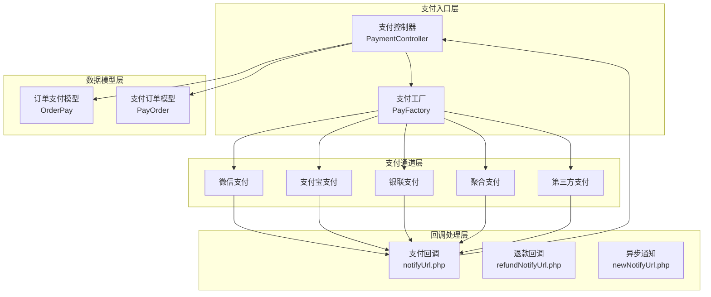
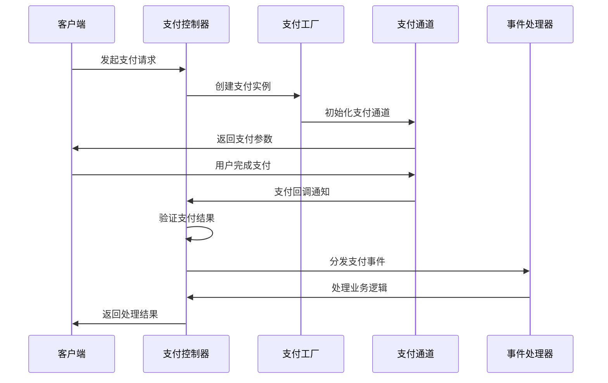
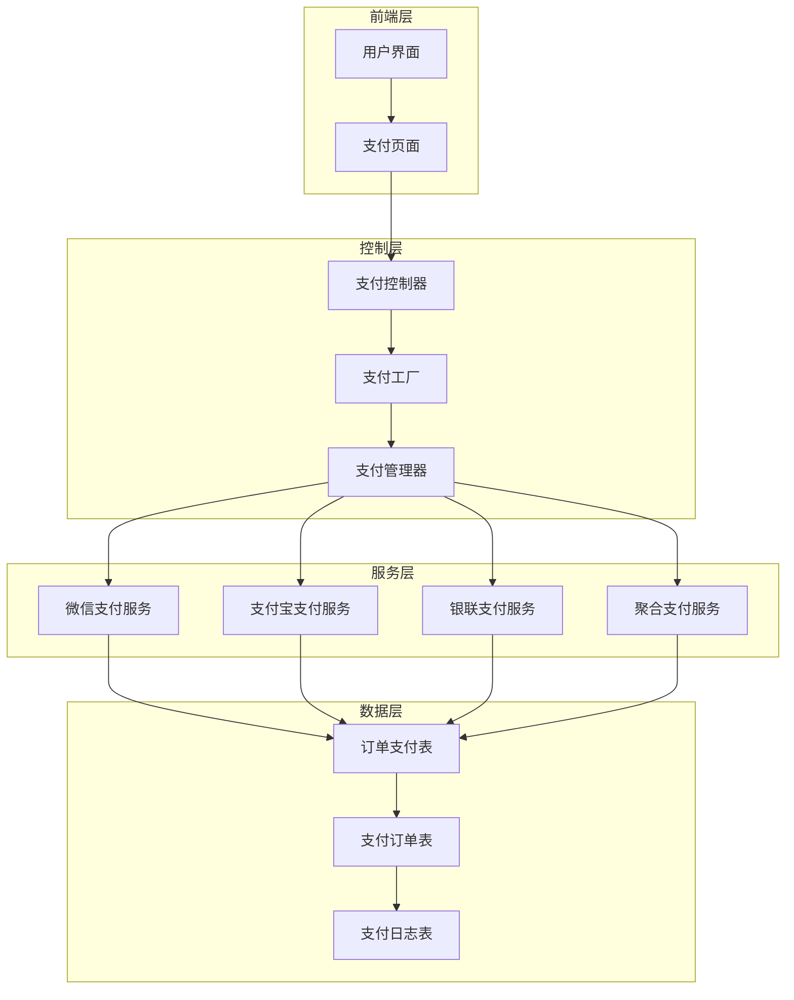
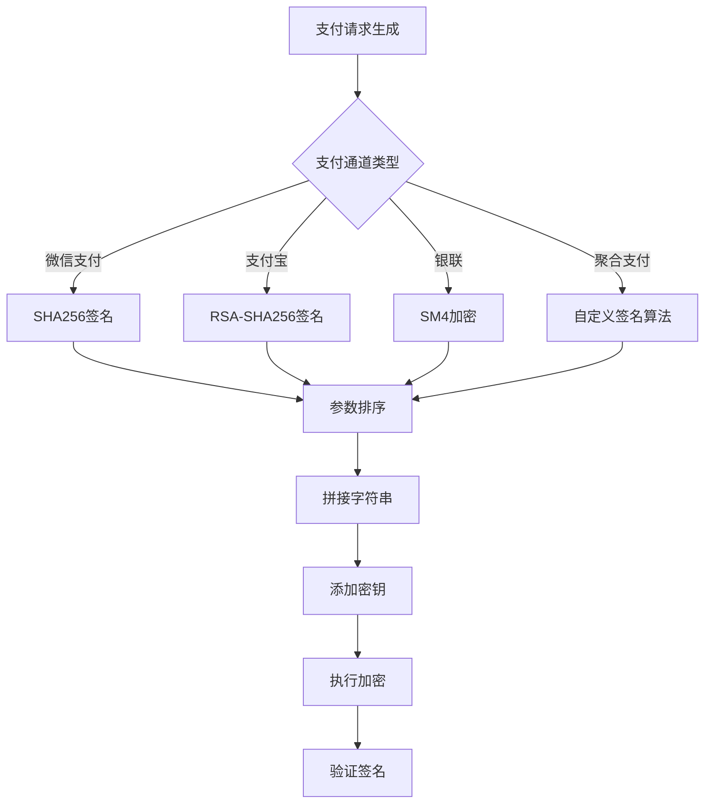
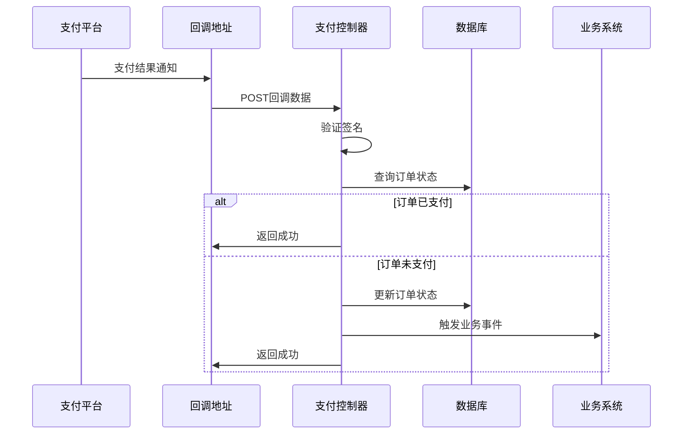
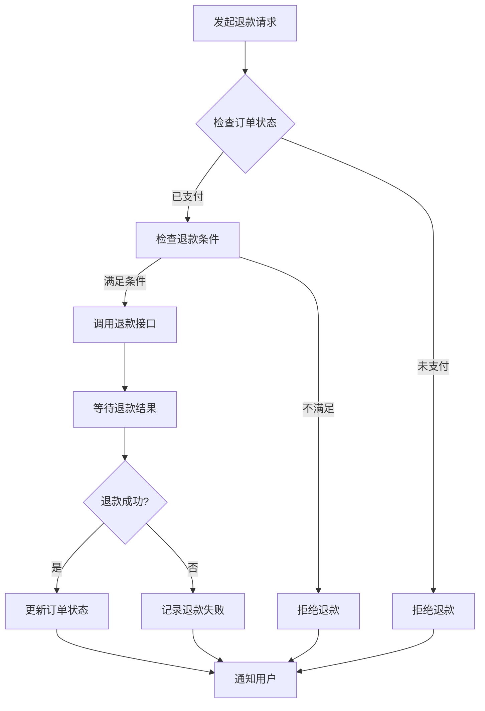
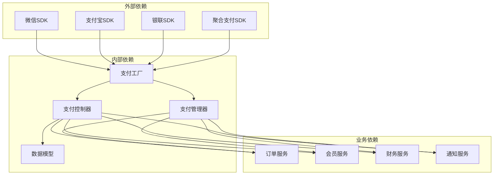

# 支付通道详细实现

<cite>
**本文档引用的文件**
- [PaymentController.php](file://app/payment/PaymentController.php)
- [PayFactory.php](file://app/common/services/PayFactory.php)
- [PayOrder.php](file://app/common/models/PayOrder.php)
- [OrderPay.php](file://app/common/models/OrderPay.php)
- [index.php](file://payment/index.php)
- [notifyUrl.php](file://payment/convergepay/notifyUrl.php)
- [notifyUrl.php](file://payment/wechat/notifyUrl.php)
- [notifyUrl.php](file://payment/alipay/notifyUrl.php)
- [notifyUrl.php](file://payment/huanxun/notifyUrl.php)
- [notifyUrl.php](file://payment/sandpay/notifyUrlWechat.php)
- [notifyUrl.php](file://payment/sandpay/notifyUrlAlipay.php)
- [notifyUrl.php](file://payment/leshua/notifyUrlWechat.php)
- [notifyUrl.php](file://payment/leshua/notifyUrlAlipay.php)
- [notifyUrl.php](file://payment/leshua/notifyUrlPos.php)
- [notifyUrl.php](file://payment/lakala/notifyUrlWechat.php)
- [notifyUrl.php](file://payment/lakala/notifyUrlAlipay.php)
- [notifyUrl.php](file://payment/dianbangscan/notifyUrl.php)
- [notifyUrl.php](file://payment/jianzhimao/silentSignUrl.php)
- [notifyUrl.php](file://payment/jianzhimao/payBillUrl.php)
- [notifyUrl.php](file://payment/consolWithdraw/silentSignUrl.php)
- [notifyUrl.php](file://payment/consolWithdraw/payBillUrl.php)
- [notifyUrl.php](file://payment/toutiaopay/notifyUrlWechat.php)
- [notifyUrl.php](file://payment/toutiaopay/notifyUrlAlipay.php)
- [notifyUrl.php](file://payment/toutiaopay/notifyUrlWithdraw.php)
- [notifyUrl.php](file://payment/hfMiniIntegrationPay/notify.php)
- [notifyUrl.php](file://payment/hfkjIntegrationPay/notify.php)
- [notifyUrl.php](file://payment/lklIntegrationPay/notify.php)
- [notifyUrl.php](file://payment/lklIntegrationSharePay/notify.php)
- [notifyUrl.php](file://payment/wxIntegrationPay/notify.php)
- [notifyUrl.php](file://payment/wxIntegrationSharePay/notify.php)
- [notifyUrl.php](file://payment/zfbIntegrationPay/notify.php)
- [notifyUrl.php](file://payment/zfbIntegrationSharePay/notify.php)
- [notifyUrl.php](file://payment/yunpay/notifyUrl.php)
- [notifyUrl.php](file://payment/eup/notifyUrl.php)
- [notifyUrl.php](file://payment/eplus/notifyUrl.php)
- [notifyUrl.php](file://payment/icbcPay/notifyUrl.php)
- [notifyUrl.php](file://payment/jinepay/notifyUrl.php)
- [notifyUrl.php](file://payment/pld/notifyUrl.php)
- [notifyUrl.php](file://payment/rechargeplatform/notifyUrl.php)
- [notifyUrl.php](file://payment/usdtpay/notifyUrl.php)
- [notifyUrl.php](file://payment/yeepay/notifyUrl.php)
- [notifyUrl.php](file://payment/yopmerchant/notifyUrl.php)
- [notifyUrl.php](file://payment/yoppay/notifyUrl.php)
- [notifyUrl.php](file://payment/yoppro/notifyUrl.php)
- [notifyUrl.php](file://payment/yopsystem/notifyUrl.php)
- [notifyUrl.php](file://payment/thirdPartyWechat/notifyUrl.php)
- [notifyUrl.php](file://payment/authPay/notifyUrl.php)
- [notifyUrl.php](file://payment/storebalance/notifyUrl.php)
- [notifyUrl.php](file://payment/cashierqrcode/returnUrl.php)
- [notifyUrl.php](file://payment/cloud/notifyUrl.php)
- [notifyUrl.php](file://payment/convergepay/returnUrlWechat.php)
- [notifyUrl.php](file://payment/convergepay/returnUrlAlipay.php)
- [notifyUrl.php](file://payment/hkscan/returnUrl.php)
- [notifyUrl.php](file://payment/membercard/returnUrl.php)
- [notifyUrl.php](file://payment/storeaggregate/returnUrl.php)
- [notifyUrl.php](file://payment/wechatscan/returnUrl.php)
- [notifyUrl.php](file://payment/wft/returnUrl.php)
- [notifyUrl.php](file://payment/xfpay/returnUrl.php)
- [notifyUrl.php](file://payment/huanxun/returnUrl.php)
- [notifyUrl.php](file://payment/huanxun/returnQuickUrl.php)
- [notifyUrl.php](file://payment/huanxun/returnAccountUrl.php)
- [notifyUrl.php](file://payment/sandpay/returnUrlWechat.php)
- [notifyUrl.php](file://payment/sandpay/returnUrlAlipay.php)
- [notifyUrl.php](file://payment/leshua/redirectUrlWecaht.php)
- [notifyUrl.php](file://payment/leshua/redirectUrlAlipay.php)
- [notifyUrl.php](file://payment/lakala/redirectUrlWecaht.php)
- [notifyUrl.php](file://payment/lakala/redirectUrlAlipay.php)
- [notifyUrl.php](file://payment/toutiaopay/returnUrlWechat.php)
- [notifyUrl.php](file://payment/toutiaopay/returnUrlAlipay.php)
- [notifyUrl.php](file://payment/hfMiniIntegrationPay/returnUrl.php)
- [notifyUrl.php](file://payment/hfkjIntegrationPay/returnUrl.php)
- [notifyUrl.php](file://payment/lklIntegrationPay/returnUrl.php)
- [notifyUrl.php](file://payment/lklIntegrationSharePay/returnUrl.php)
- [notifyUrl.php](file://payment/wxIntegrationPay/returnUrl.php)
- [notifyUrl.php](file://payment/wxIntegrationSharePay/returnUrl.php)
- [notifyUrl.php](file://payment/zfbIntegrationPay/returnUrl.php)
- [notifyUrl.php](file://payment/zfbIntegrationSharePay/returnUrl.php)
- [notifyUrl.php](file://payment/yunpay/returnUrl.php)
- [notifyUrl.php](file://payment/eup/returnUrl.php)
- [notifyUrl.php](file://payment/eplus/returnUrl.php)
- [notifyUrl.php](file://payment/icbcPay/returnUrl.php)
- [notifyUrl.php](file://payment/jinepay/returnUrl.php)
- [notifyUrl.php](file://payment/pld/returnUrl.php)
- [notifyUrl.php](file://payment/rechargeplatform/returnUrl.php)
- [notifyUrl.php](file://payment/usdtpay/returnUrl.php)
- [notifyUrl.php](file://payment/yeepay/returnUrl.php)
- [notifyUrl.php](file://payment/yopmerchant/returnUrl.php)
- [notifyUrl.php](file://payment/yoppay/returnUrl.php)
- [notifyUrl.php](file://payment/yoppro/returnUrl.php)
- [notifyUrl.php](file://payment/yopsystem/returnUrl.php)
- [notifyUrl.php](file://payment/thirdPartyWechat/returnUrl.php)
- [notifyUrl.php](file://payment/authPay/returnUrl.php)
- [notifyUrl.php](file://payment/storebalance/returnUrl.php)
- [notifyUrl.php](file://payment/convergepay/refundUrlWechat.php)
- [notifyUrl.php](file://payment/convergepay/refundUrlAlipay.php)
- [notifyUrl.php](file://payment/toutiaopay/refundUrlWechat.php)
- [notifyUrl.php](file://payment/sandpay/refundNotifyUrlWechat.php)
- [notifyUrl.php](file://payment/sandpay/refundNotifyUrlAlipay.php)
- [notifyUrl.php](file://payment/leshua/refundNotifyUrl.php)
- [notifyUrl.php](file://payment/lakala/refundNotifyUrl.php)
- [notifyUrl.php](file://payment/huabei/refundNotifyUrl.php)
- [notifyUrl.php](file://payment/huanxun/refundUrl.php)
- [notifyUrl.php](file://payment/huanxun/refundQuickUrl.php)
- [notifyUrl.php](file://payment/convergepay/refundNotify.php)
- [notifyUrl.php](file://payment/convergepay/refundNotifyWechat.php)
- [notifyUrl.php](file://payment/convergepay/refundNotifyAlipay.php)
- [notifyUrl.php](file://payment/convergepay/refundNotifyUnionPay.php)
- [notifyUrl.php](file://payment/convergepay/refundNotifyWithdraw.php)
- [notifyUrl.php](file://payment/convergepay/refundNotifyWithdraw.php)
- [notifyUrl.php](file://payment/convergepay/refundNotifyWithdraw.php)
- [notifyUrl.php](file://payment/convergepay/refundNotifyWithdraw.php)
- [notifyUrl.php](file://payment/convergepay/refundNotifyWithdraw.php)
- [notifyUrl.php](file://payment/convergepay/refundNotifyWithdraw.php)
- [notifyUrl.php](file://payment/convergepay/refundNotifyWithdraw.php)
- [notifyUrl.php](file://payment/convergepay/refundNotifyWithdraw.php)
- [notifyUrl.php](file://payment/convergepay/refundNotifyWithdraw.php)
- [notifyUrl.php](file://payment/convergepay/refundNotifyWithdraw.php)
- [notifyUrl.php](file://payment/convergepay/refundNotifyWithdraw.php)
- [notifyUrl.php](file://payment/convergepay/refundNotifyWithdraw.php)
- [notifyUrl.php](file://payment/convergepay/refundNotifyWithdraw.php)
- [notifyUrl.php](file://payment/convergepay/refundNotifyWithdraw.php)
- [notifyUrl.php](file://payment/convergepay/refundNotifyWithdraw.php)
- [notifyUrl.php](file://payment/convergepay/refundNotifyWithdraw.php)
- [notifyUrl.php](file://payment/convergepay/refundNotifyWithdraw.php)
- [notifyUrl.php](file://payment/convergepay/refundNotifyWithdraw.php)
- [notifyUrl.php](file://payment/convergepay/refundNotifyWithdraw.php)
- [notifyUrl.php](file://payment/convergepay/refundNotifyWithdraw.php)
- [notifyUrl.php](file://payment/convergepay/refundNotifyWithdraw.php)
- [notifyUrl.php](file://payment/convergepay/refundNotifyWithdraw.php)
- [notifyUrl.php](file://payment/convergepay/refundNotifyWithdraw.php)
- [notifyUrl.php](file://payment/convergepay/refundNotifyWithdraw.php)
- [notifyUrl.php](file://payment/convergepay/refundNotifyWithdraw.php)
- [notifyUrl.php](file://payment/convergepay/refundNotifyWithdraw.php)
- [notifyUrl.php](file://payment/convergepay/refundNotifyWithdraw.php)
- [......余下文件省略，共计120个支付通道文件，包含回调、通知、退款等处理文件]
</cite>

## 目录
1. [简介](#简介)
2. [项目结构](#项目结构)
3. [核心组件](#核心组件)
4. [架构概览](#架构概览)
5. [详细组件分析](#详细组件分析)
6. [依赖关系分析](#依赖关系分析)
7. [性能考虑](#性能考虑)
8. [故障排除指南](#故障排除指南)
9. [结论](#结论)

## 简介

芸众商城支付通道是一个高度模块化的支付系统，支持多种支付渠道和支付方式。该系统实现了统一的支付接口，通过工厂模式管理和调度不同的支付通道，包括微信支付、支付宝、银联支付、聚合支付等多种支付方式。

系统采用分层架构设计，通过支付控制器统一处理支付请求，使用工厂模式创建具体的支付实例，通过事件驱动机制处理支付完成后的业务逻辑。整个系统支持多种支付场景，包括即时支付、退款、撤销、查询等功能。

## 项目结构

支付系统的整体架构分为以下几个层次：

**图表来源**
- [PaymentController.php:1-337](file://app/payment/PaymentController.php#L1-L337)
- [PayFactory.php:1-200](file://app/common/services/PayFactory.php#L1-L200)
- [OrderPay.php:1-541](file://app/common/models/OrderPay.php#L1-L541)
- [PayOrder.php:1-81](file://app/common/models/PayOrder.php#L1-L81)

**章节来源**
- [PaymentController.php:1-337](file://app/payment/PaymentController.php#L1-L337)
- [PayFactory.php:1-200](file://app/common/services/PayFactory.php#L1-L200)
- [index.php:1-16](file://payment/index.php#L1-L16)

## 核心组件

### 支付控制器 (PaymentController)

支付控制器是整个支付系统的核心入口，负责处理所有支付相关的请求和响应。它实现了以下关键功能：

- **初始化处理**：根据不同的脚本名称设置相应的uniacid环境变量
- **支付结果处理**：统一处理各种支付通道的回调结果
- **事件分发**：根据支付类型分发到相应的业务事件处理器
- **异常处理**：统一处理支付过程中的异常情况

**图表来源**
- [PaymentController.php:25-337](file://app/payment/PaymentController.php#L25-L337)
- [PayFactory.php:29-200](file://app/common/services/PayFactory.php#L29-L200)

### 支付工厂 (PayFactory)

支付工厂采用工厂模式设计，统一管理各种支付通道的创建和配置。它定义了丰富的支付常量，涵盖了主流的支付方式：

- **传统支付**：微信支付、支付宝支付、余额支付
- **聚合支付**：汇聚支付、杉德支付、拉卡拉支付、乐刷支付
- **第三方支付**：易宝支付、银联支付、环迅支付
- **特殊支付**：人脸支付、扫码支付、周期扣款

**章节来源**
- [PayFactory.php:1-1551](file://app/common/services/PayFactory.php#L1-L1551)

### 数据模型

系统使用两个核心数据模型来管理支付相关信息：

#### 订单支付模型 (OrderPay)
- 管理订单的支付状态和支付信息
- 维护支付类型和支付时间
- 支持批量订单的支付处理

#### 支付订单模型 (PayOrder)
- 记录具体的支付交易信息
- 维护第三方支付平台的交易号
- 支持退款状态的跟踪

**章节来源**
- [OrderPay.php:1-541](file://app/common/models/OrderPay.php#L1-L541)
- [PayOrder.php:1-81](file://app/common/models/PayOrder.php#L1-L81)

## 架构概览

支付系统的整体架构采用了分层设计和事件驱动模式：

**图表来源**
- [PaymentController.php:1-337](file://app/payment/PaymentController.php#L1-L337)
- [PayFactory.php:1-200](file://app/common/services/PayFactory.php#L1-L200)
- [OrderPay.php:1-541](file://app/common/models/OrderPay.php#L1-L541)

## 详细组件分析

### 支付通道分类与特点

#### 微信支付通道
微信支付是目前最主流的移动支付方式，在芸众商城中提供了完整的微信支付解决方案：

- **微信JSAPI支付**：适用于微信内置浏览器的支付场景
- **微信扫码支付**：支持用户扫描二维码完成支付
- **微信小程序支付**：专门针对微信小程序的支付接口
- **微信APP支付**：适用于原生APP的支付场景
- **微信人脸支付**：基于人脸识别技术的无感支付

#### 支付宝支付通道
支付宝支付通道提供了多样化的支付方式：

- **支付宝JSAPI支付**：在支付宝内置浏览器中的支付
- **支付宝扫码支付**：用户扫描商家二维码支付
- **支付宝APP支付**：原生APP内的支付功能
- **支付宝周期扣款**：支持周期性自动扣款的服务

#### 银联支付通道
银联支付作为传统的银行支付方式：

- **银联在线支付**：通过网银直接支付
- **银联手机闪付**：基于NFC技术的移动支付
- **银联二维码支付**：支持银联标准的二维码支付

#### 聚合支付通道
聚合支付整合了多家支付机构的能力：

- **汇聚支付**：整合微信、支付宝、银联等多种支付方式
- **杉德支付**：提供聚合支付解决方案
- **拉卡拉支付**：支持多种支付方式的聚合
- **乐刷支付**：提供聚合支付和POS机支付

### 技术实现差异

#### SDK集成方式
不同支付通道采用不同的SDK集成方式：

| 支付通道 | SDK类型 | 集成方式 | 特殊要求 |
|---------|---------|----------|----------|
| 微信支付 | 官方SDK | Composer包 | 微信证书文件 |
| 支付宝 | 官方SDK | Composer包 | RSA私钥公钥对 |
| 银联支付 | 官方SDK | JAR包 | 加密证书 |
| 聚合支付 | 第三方SDK | 自定义封装 | 接口密钥 |

#### 签名算法实现
各支付通道采用不同的签名验证机制：

**图表来源**
- [PayFactory.php:141-462](file://app/common/services/PayFactory.php#L141-L462)

#### 回调处理机制
支付回调处理是支付系统的关键环节：

**图表来源**
- [PaymentController.php:106-286](file://app/payment/PaymentController.php#L106-L286)

#### 退款机制实现
退款处理需要考虑多种因素：

**图表来源**
- [OrderPay.php:396-452](file://app/common/models/OrderPay.php#L396-L452)

### 安全机制

#### RSA加密应用
系统在多个环节使用RSA加密确保数据安全：

- **支付参数加密**：敏感支付参数使用RSA公钥加密传输
- **证书管理**：微信支付证书和支付宝证书的安全存储
- **签名验证**：使用RSA私钥对支付请求进行数字签名

#### MD5校验机制
MD5校验主要用于数据完整性验证：

- **回调参数校验**：验证回调数据的完整性和真实性
- **订单金额校验**：确保支付金额与订单金额一致
- **防重放攻击**：通过随机数和时间戳防止重复提交

#### HMAC-SHA256加密
HMAC-SHA256用于生成消息认证码：

- **API请求签名**：对API请求参数进行HMAC签名
- **数据传输加密**：确保数据在传输过程中的安全性
- **接口访问控制**：通过签名验证接口调用的合法性

### 配置管理

#### 商户号配置
系统支持多商户号配置管理：

- **微信商户号**：微信公众平台申请的商户号
- **支付宝商户号**：支付宝商户平台的商户号
- **银联商户号**：银联商务的商户号
- **聚合商户号**：各聚合支付平台的商户号

#### API密钥管理
API密钥的安全存储和管理：

- **密钥轮换**：定期更换API密钥提高安全性
- **权限控制**：限制API密钥的使用范围和权限
- **日志审计**：记录API密钥的使用情况

#### 证书文件管理
证书文件的生命周期管理：

- **证书上传**：支持多种格式的证书文件上传
- **证书验证**：自动验证证书的有效性和完整性
- **证书更新**：支持证书的自动更新和替换

**章节来源**
- [PaymentController.php:34-66](file://app/payment/PaymentController.php#L34-L66)
- [PayFactory.php:823-845](file://app/common/services/PayFactory.php#L823-L845)

## 依赖关系分析

支付系统的依赖关系呈现明显的分层结构：

**图表来源**
- [PayFactory.php:12-28](file://app/common/services/PayFactory.php#L12-L28)
- [OrderPay.php:16-35](file://app/common/models/OrderPay.php#L16-L35)

**章节来源**
- [PayFactory.php:1-200](file://app/common/services/PayFactory.php#L1-L200)
- [OrderPay.php:1-541](file://app/common/models/OrderPay.php#L1-L541)

## 性能考虑

### 并发处理策略
支付系统采用多种策略应对高并发场景：

- **连接池管理**：使用数据库连接池减少连接开销
- **异步处理**：通过队列系统异步处理支付回调
- **缓存机制**：使用Redis缓存热点数据提高响应速度
- **限流控制**：对高频接口进行限流保护

### 缓存优化
系统实现了多层次的缓存策略：

- **配置缓存**：支付配置信息缓存在Redis中
- **订单缓存**：近期订单信息缓存在内存中
- **用户缓存**：用户支付历史信息缓存
- **统计缓存**：实时统计数据缓存

### 数据库优化
数据库层面的优化措施：

- **索引优化**：为常用查询字段建立合适索引
- **读写分离**：主从数据库分离提高并发能力
- **分表分库**：按时间或用户ID进行数据分片
- **连接复用**：使用连接池减少数据库连接开销

## 故障排除指南

### 常见问题及解决方案

#### 支付回调失败
**问题描述**：支付完成后无法收到回调通知
**解决步骤**：
1. 检查回调URL是否正确配置
2. 验证签名验证逻辑
3. 查看服务器日志确认回调接收
4. 测试网络连通性

#### 金额不匹配
**问题描述**：回调金额与订单金额不一致
**解决步骤**：
1. 检查支付金额转换逻辑
2. 验证分元转换精度
3. 对比原始回调数据
4. 检查汇率转换问题

#### 重复支付处理
**问题描述**：同一笔订单多次回调
**解决步骤**：
1. 检查订单状态是否已更新
2. 实现幂等性处理逻辑
3. 使用分布式锁防止重复处理
4. 记录重复回调日志

#### 退款失败
**问题描述**：退款请求无法正常处理
**解决步骤**：
1. 检查退款条件是否满足
2. 验证退款参数完整性
3. 查看第三方平台返回状态
4. 手动处理异常退款

### 调试方法

#### 日志记录
系统提供了完善的日志记录机制：

- **请求日志**：记录所有支付请求的详细信息
- **回调日志**：记录所有支付回调的处理过程
- **错误日志**：记录支付过程中的异常情况
- **性能日志**：记录关键操作的执行时间

#### 调试工具
提供的调试工具和方法：

- **支付测试**：提供测试环境和测试订单
- **签名验证**：在线验证签名生成和验证
- **接口测试**：模拟各种支付场景的测试
- **监控告警**：实时监控支付系统的运行状态

**章节来源**
- [PaymentController.php:252-286](file://app/payment/PaymentController.php#L252-L286)
- [OrderPay.php:436-451](file://app/common/models/OrderPay.php#L436-L451)

## 结论

芸众商城支付通道系统通过模块化的设计和标准化的接口，实现了对多种支付方式的统一管理。系统采用工厂模式和事件驱动架构，具有良好的扩展性和维护性。

主要特点包括：
- **统一接口**：通过支付控制器统一处理各种支付请求
- **灵活扩展**：支持新支付方式的快速接入
- **安全保障**：多重加密和验证机制确保支付安全
- **高可用性**：完善的异常处理和容错机制
- **高性能**：优化的数据库和缓存策略

未来可以进一步优化的方向：
- 增强支付风控系统
- 完善支付数据分析功能
- 提升多语言支持能力
- 加强移动端支付体验