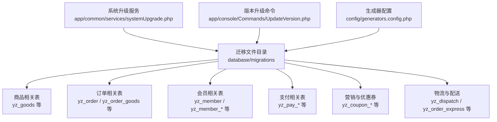
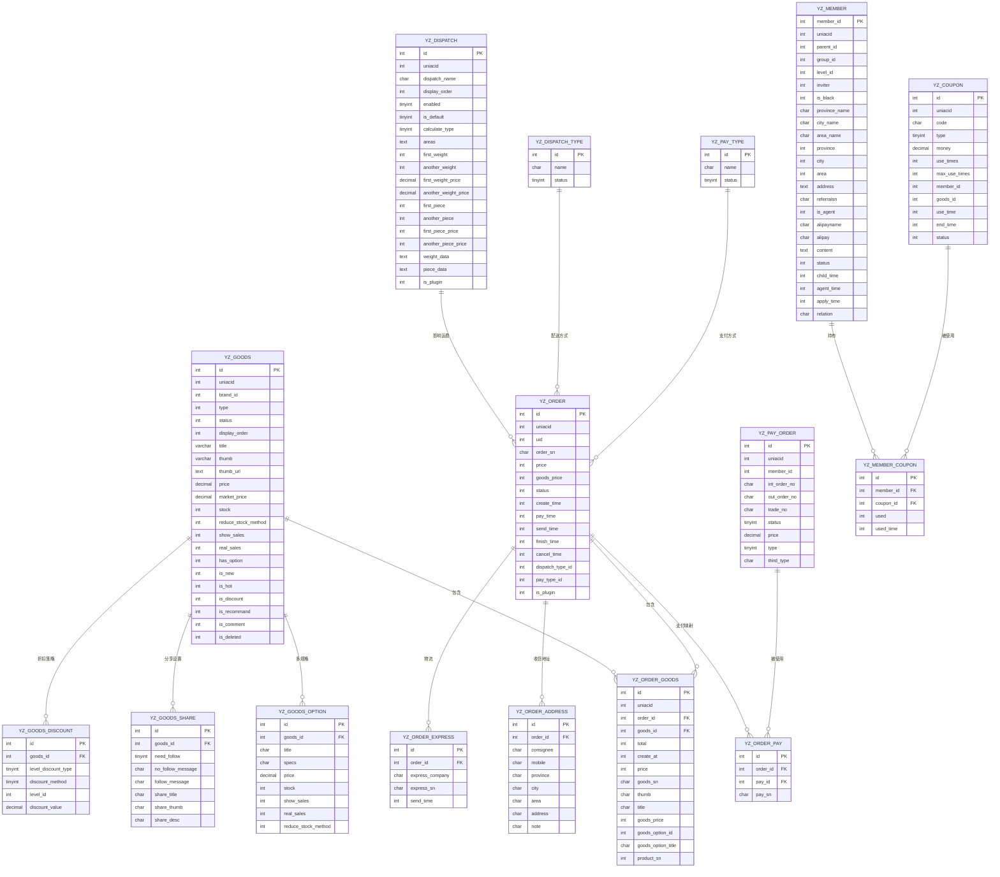
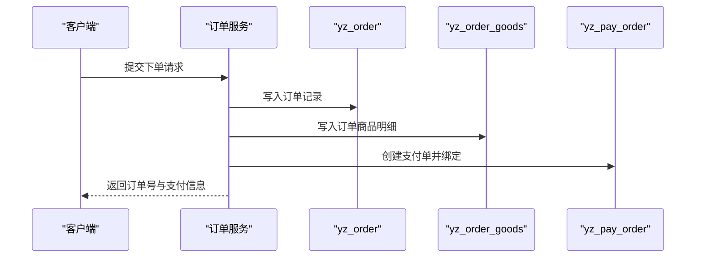
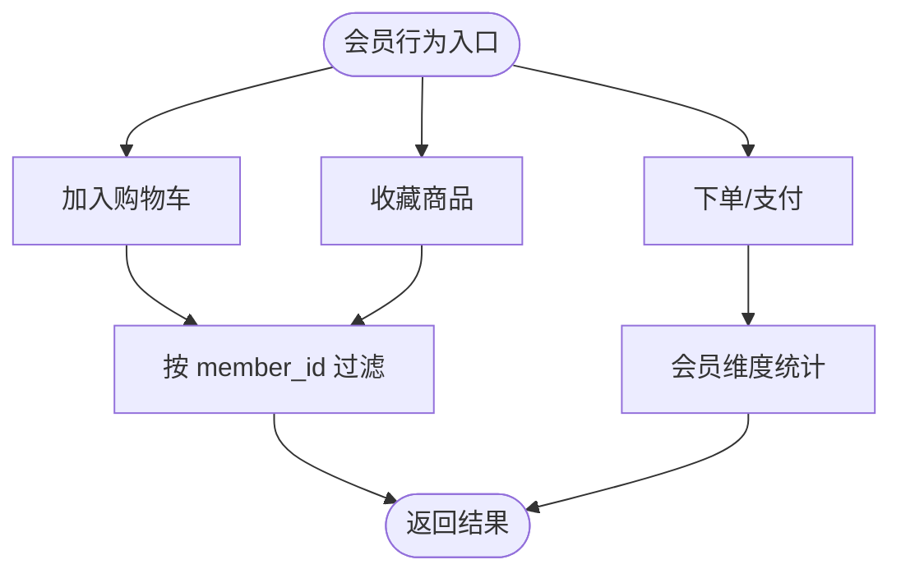
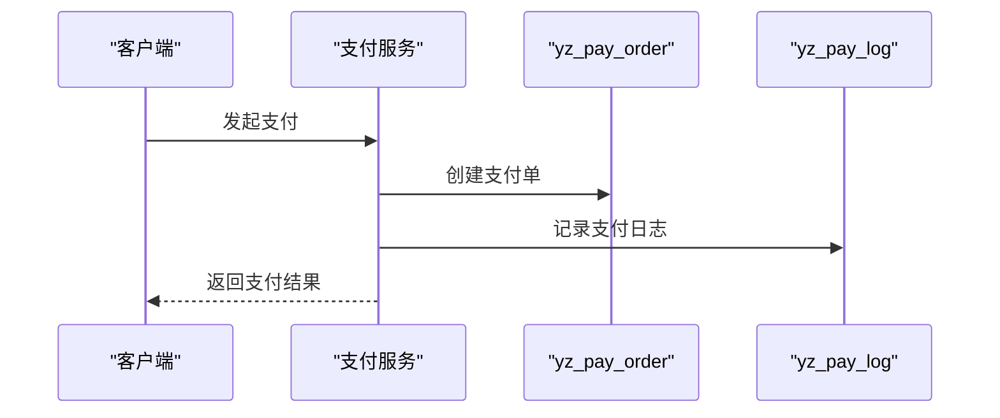
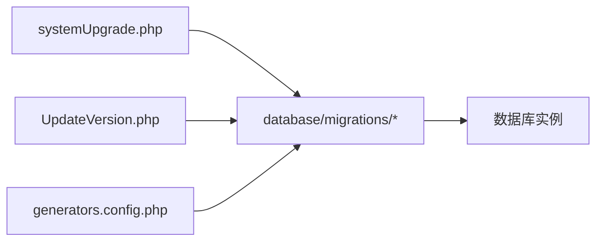

# 数据库设计

<cite>
**本文引用的文件**
- [2017_03_06_200815_create_ims_yz_goods_table.php](file://database/migrations/2017_03_06_200815_create_ims_yz_goods_table.php)
- [2017_03_10_215716_create_ims_yz_order_table.php](file://database/migrations/2017_03_10_215716_create_ims_yz_order_table.php)
- [2017_03_10_215727_create_ims_yz_order_goods_table.php](file://database/migrations/2017_03_10_215727_create_ims_yz_order_goods_table.php)
- [2017_03_07_110235_create_ims_yz_member_table.php](file://database/migrations/2017_03_07_110235_create_ims_yz_member_table.php)
- [2017_03_07_101149_create_ims_yz_member_cart_table.php](file://database/migrations/2017_03_07_101149_create_ims_yz_member_cart_table.php)
- [2017_03_07_111409_create_ims_yz_category_table.php](file://database/migrations/2017_03_07_111409_create_ims_yz_category_table.php)
- [2017_03_07_111521_create_ims_yz_brand_table.php](file://database/migrations/2017_03_07_111521_create_ims_yz_brand_table.php)
- [2017_03_07_121006_create_ims_yz_goods_share_table.php](file://database/migrations/2017_03_07_121006_create_ims_yz_goods_share_table.php)
- [2017_03_07_121308_create_ims_yz_goods_discount_table.php](file://database/migrations/2017_03_07_121308_create_ims_yz_goods_discount_table.php)
- [2017_03_07_121334_create_ims_yz_dispatch_table.php](file://database/migrations/2017_03_07_121334_create_ims_yz_dispatch_table.php)
- [2017_03_28_203149_create_ims_yz_pay_order_table.php](file://database/migrations/2017_03_28_203149_create_ims_yz_pay_order_table.php)
- [2017_03_28_152122_create_ims_yz_pay_log_table.php](file://database/migrations/2017_03_28_152122_create_ims_yz_pay_log_table.php)
- [2017_03_07_125312_create_ims_yz_address_table.php](file://database/migrations/2017_03_07_125312_create_ims_yz_address_table.php)
- [2017_05_08_180345_create_ims_yz_order_address_table.php](file://database/migrations/2017_05_08_180345_create_ims_yz_order_address_table.php)
- [2017_03_10_215359_create_ims_yz_order_express_table.php](file://database/migrations/2017_03_10_215359_create_ims_yz_order_express_table.php)
- [2017_03_10_214956_create_ims_yz_dispatch_type_table.php](file://database/migrations/2017_03_10_214956_create_ims_yz_dispatch_type_table.php)
- [2017_03_10_215802_create_ims_yz_pay_type_table.php](file://database/migrations/2017_03_10_215802_create_ims_yz_pay_type_table.php)
- [2017_03_07_101409_create_ims_yz_member_favorite_table.php](file://database/migrations/2017_03_07_101409_create_ims_yz_member_favorite_table.php)
- [2017_03_07_101409_create_ims_yz_member_group_table.php](file://database/migrations/2017_03_07_101409_create_ims_yz_member_group_table.php)
- [2017_03_07_101927_create_ims_yz_member_level_table.php](file://database/migrations/2017_03_07_101927_create_ims_yz_member_level_table.php)
- [2017_03_07_111553_create_ims_yz_comment_table.php](file://database/migrations/2017_03_07_111553_create_ims_yz_comment_table.php)
- [2017_03_07_114208_create_ims_yz_member_unique_table.php](file://database/migrations/2017_03_07_114208_create_ims_yz_member_unique_table.php)
- [2017_03_07_104438_create_ims_yz_member_app_wechat_table.php](file://database/migrations/2017_03_07_104438_create_ims_yz_member_app_wechat_table.php)
- [2017_03_07_104505_create_ims_yz_member_wechat_table.php](file://database/migrations/2017_03_07_104505_create_ims_yz_member_wechat_table.php)
- [2017_03_07_104531_create_ims_yz_member_mini_app_table.php](file://database/migrations/2017_03_07_104531_create_ims_yz_member_mini_app_table.php)
- [2017_03_07_104650_create_ims_yz_account_open_config_table.php](file://database/migrations/2017_03_07_104650_create_ims_yz_account_open_config_table.php)
- [2017_03_07_104720_create_ims_yz_member_qq_table.php](file://database/migrations/2017_03_07_104720_create_ims_yz_member_qq_table.php)
- [2017_03_07_104746_create_ims_yz_qq_config_table.php](file://database/migrations/2017_03_07_104746_create_ims_yz_qq_config_table.php)
- [2017_03_07_165530_create_ims_yz_permission_table.php](file://database/migrations/2017_03_07_165530_create_ims_yz_permission_table.php)
- [2017_03_07_170917_create_ims_yz_role_table.php](file://database/migrations/2017_03_07_170917_create_ims_yz_role_table.php)
- [2017_03_07_170931_create_ims_yz_user_role_table.php](file://database/migrations/2017_03_07_170931_create_ims_yz_user_role_table.php)
- [2017_03_08_133637_create_ims_yz_member_relation_table.php](file://database/migrations/2017_03_08_133637_create_ims_yz_member_relation_table.php)
- [2017_03_08_142918_create_ims_yz_goods_sale_table.php](file://database/migrations/2017_03_08_142918_create_ims_yz_goods_sale_table.php)
- [2017_03_08_151154_create_ims_yz_goods_option_table.php](file://database/migrations/2017_03_08_151154_create_ims_yz_goods_option_table.php)
- [2017_03_09_113554_create_ims_yz_sms_send_limit_table.php](file://database/migrations/2017_03_09_113554_create_ims_yz_sms_send_limit_table.php)
- [2017_03_09_135930_create_ims_yz_menu_table.php](file://database/migrations/2017_03_09_135930_create_ims_yz_menu_table.php)
- [2017_03_09_152739_create_ims_yz_goods_privilege_table.php](file://database/migrations/2017_03_09_152739_create_ims_yz_goods_privilege_table.php)
- [2017_03_14_222459_create_ims_yz_order_operation_log_table.php](file://database/migrations/2017_03_14_222459_create_ims_yz_order_operation_log_table.php)
- [2017_03_15_154258_create_ims_yz_order_mapping_table.php](file://database/migrations/2017_03_15_154258_create_ims_yz_order_mapping_table.php)
- [2017_03_17_172136_create_ims_yz_template_message_record_table.php](file://database/migrations/2017_03_17_172136_create_ims_yz_template_message_record_table.php)
- [2017_03_17_172136_create_ims_yz_template_message_table.php](file://database/migrations/2017_03_17_172136_create_ims_yz_template_message_table.php)
- [2017_03_28_152020_create_ims_yz_pay_access_log_table.php](file://database/migrations/2017_03_28_152020_create_ims_yz_pay_access_log_table.php)
- [2017_03_28_152158_create_ims_yz_pay_refund_order_table.php](file://database/migrations/2017_03_28_152158_create_ims_yz_pay_refund_order_table.php)
- [2017_03_28_152215_create_ims_yz_pay_request_data_table.php](file://database/migrations/2017_03_28_152215_create_ims_yz_pay_request_data_table.php)
- [2017_03_28_152224_create_ims_yz_pay_response_data_table.php](file://database/migrations/2017_03_28_152224_create_ims_yz_pay_response_data_table.php)
- [2017_03_30_103633_create_ims_yz_member_income_table.php](file://database/migrations/2017_03_30_103633_create_ims_yz_member_income_table.php)
- [2017_03_30_171219_create_ims_yz_withdraw_table.php](file://database/migrations/2017_03_30_171219_create_ims_yz_withdraw_table.php)
- [2017_04_06_145330_create_ims_yz_balance_recharge_table.php](file://database/migrations/2017_04_06_145330_create_ims_yz_balance_recharge_table.php)
- [2017_04_06_145357_create_ims_yz_balance_transfer_table.php](file://database/migrations/2017_04_06_145357_create_ims_yz_balance_transfer_table.php)
- [2017_04_07_163632_create_ims_yz_balance_table.php](file://database/migrations/2017_04_07_163632_create_ims_yz_balance_table.php)
- [2017_05_10_140639_add_ed_areaids_to_goods_sale_table.php](file://database/migrations/2017_05_10_140639_add_ed_areaids_to_goods_sale_table.php)
- [2017_05_10_164426_create_ims_yz_coupon_log_table.php](file://database/migrations/2017_05_10_164426_create_ims_yz_coupon_log_table.php)
- [2017_05_10_164426_create_ims_yz_coupon_table.php](file://database/migrations/2017_05_10_164426_create_ims_yz_coupon_table.php)
- [2017_05_10_164426_create_ims_yz_member_coupon_table.php](file://database/migrations/2017_05_10_164426_create_ims_yz_member_coupon_table.php)
- [2017_05_10_170911_add_deleted_at_to_ims_yz_member_coupon.php](file://database/migrations/2017_05_10_170911_add_deleted_at_to_ims_yz_member_coupon.php)
- [2017_05_10_183520_add_level_limit_to_ims_yz_coupon.php](file://database/migrations/2017_05_10_183520_add_level_limit_to_ims_yz_coupon.php)
- [2017_05_10_192431_create_ims_yz_order_pay_table.php](file://database/migrations/2017_05_10_192431_create_ims_yz_order_pay_table.php)
- [2017_05_12_161241_create_ims_yz_pay_withdraw_order_table.php](file://database/migrations/2017_05_12_161241_create_ims_yz_pay_withdraw_order_table.php)
- [2017_05_12_165251_delete_max_point_deduct_to_ims_yz_goods_sale_table.php](file://database/migrations/2017_05_12_165251_delete_max_point_deduct_to_ims_yz_goods_sale_table.php)
- [2017_05_12_170416_add_max_point_deduct_to_ims_yz_goods_sale_table.php](file://database/migrations/2017_05_12_170416_add_max_point_deduct_to_ims_yz_goods_sale_table.php)
- [2017_05_13_174412_delete_point_to_ims_yz_goods_sale_table.php](file://database/migrations/2017_05_13_174412_delete_point_to_ims_yz_goods_sale_table.php)
- [2017_05_13_174655_add_point_to_ims_yz_goods_sale_table.php](file://database/migrations/2017_05_13_174655_add_point_to_ims_yz_goods_sale_table.php)
- [2017_05_15_101443_add_delede_at_to_ims_yz_member_table.php](file://database/migrations/2017_05_15_101443_add_delede_at_to_ims_yz_member_table.php)
- [2017_05_15_181112_add_goods_market_price_order_goods_table.php](file://database/migrations/2017_05_15_181112_add_goods_market_price_order_goods_table.php)
- [2017_05_15_181253_add_order_pay_id_to_yz_order_table.php](file://database/migrations/2017_05_15_181253_add_order_pay_id_to_yz_order_table.php)
- [2017_05_16_125525_add_updated_at_to_ims_yz_member_unique_table.php](file://database/migrations/2017_05_16_125525_add_updated_at_to_ims_yz_member_unique_table.php)
- [2017_05_18_104602_add_note_to_yz_order_address_table.php](file://database/migrations/2017_05_18_104602_add_note_to_yz_order_address_table.php)
- [2017_05_18_171828_create_ims_yz_return_express_table.php](file://database/migrations/2017_05_18_171828_create_ims_yz_return_express_table.php)
- [2017_05_18_173923_create_ims_yz_resend_express_table.php](file://database/migrations/2017_05_18_173923_create_ims_yz_resend_express_table.php)
- [2017_05_24_105902_add_data_ims_yz_menu.php](file://database/migrations/2017_05_24_105902_add_data_ims_yz_menu.php)
- [2017_06_01_153820_add_data_to_yz_pay_type.php](file://database/migrations/2017_06_01_153820_add_data_to_yz_pay_type.php)
- [2017_06_07_181046_change_enable_time_limit_to_goods_privilege_table.php](file://database/migrations/2017_06_07_181046_change_enable_time_limit_to_goods_privilege_table.php)
- [2017_06_07_181552_add_enable_time_limit_to_goods_privilege_table.php](file://database/migrations/2017_06_07_181552_add_enable_time_limit_to_goods_privilege_table.php)
- [2017_06_09_163600_add_menu_data_to_menu.php](file://database/migrations/2017_06_09_163600_add_menu_data_to_menu.php)
- [2017_06_13_160452_create_jobs_table.php](file://database/migrations/2017_06_13_160452_create_jobs_table.php)
- [2017_06_21_174522_create_ims_yz_exhelper_express_table.php](file://database/migrations/2017_06_21_174522_create_ims_yz_exhelper_express_table.php)
- [2017_06_21_174528_create_ims_yz_exhelper_goods_table.php](file://database/migrations/2017_06_21_174528_create_ims_yz_exhelper_goods_table.php)
- [2017_06_21_174535_create_ims_yz_exhelper_order_table.php](file://database/migrations/2017_06_21_174535_create_ims_yz_exhelper_order_table.php)
- [2017_06_21_174542_create_ims_yz_exhelper_print_table.php](file://database/migrations/2017_06_21_174542_create_ims_yz_exhelper_print_table.php)
- [2017_06_21_174557_create_ims_yz_exhelper_sys_table.php](file://database/migrations/2017_06_21_174557_create_ims_yz_exhelper_sys_table.php)
- [2017_07_10_142350_add_order_sn_to_balance_transfer.php](file://database/migrations/2017_07_10_142350_add_order_sn_to_balance_transfer.php)
- [2017_07_12_103441_add_ed_full_to_goods_sale_table.php](file://database/migrations/2017_07_12_103441_add_ed_full_to_goods_sale_table.php)
- [2017_07_14_120218_create_ims_yz_goods_coupon_table.php](file://database/migrations/2017_07_14_120218_create_ims_yz_goods_coupon_table.php)
- [2017_07_14_120255_create_ims_yz_goods_coupon_queue_table.php](file://database/migrations/2017_07_14_120255_create_ims_yz_goods_coupon_queue_table.php)
- [2017_07_19_102348_add_servicetax_to_ims_yz_withdraw.php](file://database/migrations/2017_07_19_102348_add_servicetax_to_ims_yz_withdraw.php)
- [2017_07_20_114113_change_type_id_to_ims_yz_withdraw_table.php](file://database/migrations/2017_07_20_114113_change_type_id_to_ims_yz_withdraw_table.php)
- [2017_07_21_115131_add_data_to_pay_type.php](file://database/migrations/2017_07_21_115131_add_data_to_pay_type.php)
- [2017_07_25_150523_add_vip_price_to_order_goods.php](file://database/migrations/2017_07_25_150523_add_vip_price_to_order_goods.php)
- [2017_08_01_170424_update_engine_innodb_to_mc_members.php](file://database/migrations/2017_08_01_170424_update_engine_innodb_to_mc_members.php)
- [2017_08_02_095024_create_ims_yz_order_coupon_table.php](file://database/migrations/2017_08_02_095024_create_ims_yz_order_coupon_table.php)
- [2017_08_02_095151_create_ims_yz_order_deduction_table.php](file://database/migrations/2017_08_02_095151_create_ims_yz_order_deduction_table.php)
- [2017_08_02_095459_change_title_in_order_goods_table.php](file://database/migrations/2017_08_02_095459_change_title_in_order_goods_table.php)
- [2017_08_09_092854_update_field_type_to_yz_options.php](file://database/migrations/2017_08_09_092854_update_field_type_to_yz_options.php)
- [2017_08_10_100838_add_cloud_pay_to_pay_type_table.php](file://database/migrations/2017_08_10_100838_add_cloud_pay_to_pay_type_table.php)
- [2017_08_15_144630_change_display_order_to_yz_category.php](file://database/migrations/2017_08_15_144630_change_display_order_to_yz_category.php)
- [2017_08_15_150915_add_cash_pay_to_pay_type_table.php](file://database/migrations/2017_08_15_150915_add_cash_pay_to_pay_type_table.php)
- [2017_08_16_144547_create_ims_yz_order_discount_table.php](file://database/migrations/2017_08_16_144547_create_ims_yz_order_discount_table.php)
- [2017_08_16_144558_create_ims_yz_order_goods_discount_table.php](file://database/migrations/2017_08_16_144558_create_ims_yz_order_goods_discount_table.php)
- [2017_08_17_141207_create_ims_yz_order_goods_expansion_table.php](file://database/migrations/2017_08_17_141207_create_ims_yz_order_goods_expansion_table.php)
- [2017_08_23_172816_add_plugin_id_to_ims_yz_goods_table.php](file://database/migrations/2017_08_23_172816_add_plugin_id_to_ims_yz_goods_table.php)
- [2017_08_25_160823_create_ims_yz_goods_div_from_table.php](file://database/migrations/2017_08_25_160823_create_ims_yz_goods_div_from_table.php)
- [2017_09_04_133243_create_ims_yz_point_transfer_table.php](file://database/migrations/2017_09_04_133243_create_ims_yz_point_transfer_table.php)
- [2017_09_05_163810_add_enabled_to_yz_options.php](file://database/migrations/2017_09_05_163810_add_enabled_to_yz_options.php)
- [2017_09_05_182552_add_app_to_pay_type_yangming_table.php](file://database/migrations/2017_09_05_182552_add_app_to_pay_type_yangming_table.php)
- [2017_09_13_144542_add_custom_and_validity_to_yzmember_table.php](file://database/migrations/2017_09_13_144542_add_custom_and_validity_to_yzmember_table.php)
- [2017_09_18_142739_update_field_content_to_yz_goods.php](file://database/migrations/2017_09_18_142739_update_field_content_to_yz_goods.php)
- [2017_09_18_162356_create_ims_yz_admin_operation_log_table.php](file://database/migrations/2017_09_18_162356_create_ims_yz_admin_operation_log_table.php)
- [2017_09_20_152105_add_member_form_to_ims_yz_member.php](file://database/migrations/2017_09_20_152105_add_member_form_to_ims_yz_member.php)
- [2017_09_22_165036_restructure_to_yz_goods_coupon_table.php](file://database/migrations/2017_09_22_165036_restructure_to_yz_goods_coupon_table.php)
- [2017_09_25_192336_add_field_to_yz_member.php](file://database/migrations/2017_09_25_192336_add_field_to_yz_member.php)
- [2017_09_26_161953_add_comment_id_to_order_goods_table.php](file://database/migrations/2017_09_26_161953_add_comment_id_to_order_goods_table.php)
- [2017_09_27_104605_create_ims_yz_order_setting_table.php](file://database/migrations/2017_09_27_104605_create_ims_yz_order_setting_table.php)
- [2017_09_27_151108_update_field_to_yz_member.php](file://database/migrations/2017_09_27_151108_update_field_to_yz_member.php)
- [2017_09_29_160746_add_withdraw_mobile_to_yz_member.php](file://database/migrations/2017_09_29_160746_add_withdraw_mobile_to_yz_member.php)
- [2017_09_29_172128_create_ims_yz_withdraw_set_log_table.php](file://database/migrations/2017_09_29_172128_create_ims_yz_withdraw_set_log_table.php)
- [2017_09_29_181923_change_dispatch_type.php](file://database/migrations/2017_09_29_181923_change_dispatch_type.php)
- [2017_10_10_153038_create_ims_cron_job_table.php](file://database/migrations/2017_10_10_153038_create_ims_cron_job_table.php)
- [2017_10_10_153103_create_ims_cron_manager_table.php](file://database/migrations/2017_10_10_153103_create_ims_cron_manager_table.php)
- [2017_10_14_114327_add_plugin_id_to_order.php](file://database/migrations/2017_10_14_114327_add_plugin_id_to_order.php)
- [2017_10_17_184012_add_payment_amount_to_order_goods_table.php](file://database/migrations/2017_10_17_184012_add_payment_amount_to_order_goods_table.php)
- [2017_10_17_194008_create_ims_yz_order_goods_deduction_table.php](file://database/migrations/2017_10_17_194008_create_ims_yz_order_goods_deduction_table.php)
- [2017_10_17_200205_create_ims_yz_deduction_table.php](file://database/migrations/2017_10_17_200205_create_ims_yz_deduction_table.php)
- [2017_10_17_200951_create_ims_yz_virtual_coin_table.php](file://database/migrations/2017_10_17_200951_create_ims_yz_virtual_coin_table.php)
- [2017_10_19_134334_add_source_member_id_to_credit_log_table.php](file://database/migrations/2017_10_19_134334_add_source_member_id_to_credit_log_table.php)
- [2017_10_23_145507_add_uid_to_admin_log.php](file://database/migrations/2017_10_23_145507_add_uid_to_admin_log.php)
- [2017_10_23_161225_create_ims_yz_member_bank_card_table.php](file://database/migrations/2017_10_23_161225_create_ims_yz_member_bank_card_table.php)
- [2017_10_24_140051_fix_order_pay_id.php](file://database/migrations/2017_10_24_140051_fix_order_pay_id.php)
- [2017_10_24_221324_create_ims_yz_member_record_table.php](file://database/migrations/2017_10_24_221324_create_ims_yz_member_record_table.php)
- [2017_10_25_114950_add_field_to_yz_member_bank_card_table.php](file://database/migrations/2017_10_25_114950_add_field_to_yz_member_bank_card_table.php)
- [2017_10_26_100716_add_field_manual_type_to_yz_withdraw_table.php](file://database/migrations/2017_10_26_100716_add_field_manual_type_to_yz_withdraw_table.php)
- [2017_10_26_103244_add_field_wechat_to_yz_member_table.php](file://database/migrations/2017_10_26_103244_add_field_wechat_to_yz_member_table.php)
- [2017_11_01_135050_create_plugin_id_to_ims_yz_category_table.php](file://database/migrations/2017_11_01_135050_create_plugin_id_to_ims_yz_category_table.php)
- [2017_11_03_102200_remake_pay_type.php](file://database/migrations/2017_11_03_102200_remake_pay_type.php)
- [2017_11_09_150821_create_ims_yz_message_template_table.php](file://database/migrations/2017_11_09_150821_create_ims_yz_message_template_table.php)
- [2017_11_10_154004_add_virtual_sales_to_ims_yz_goods_table.php](file://database/migrations/2017_11_10_154004_add_virtual_sales_to_ims_yz_goods_table.php)
- [2017_11_13_162143_add_yunpay_to_yz_pay_type.php](file://database/migrations/2017_11_13_162143_add_yunpay_to_yz_pay_type.php)
- [2017_11_15_135050_create_uuid_to_ims_yz_member_wechat_table.php](file://database/migrations/2017_11_15_135050_create_uuid_to_ims_yz_member_wechat_table.php)
- [2017_11_23_153451_create_ims_yz_point_love_set_table.php](file://database/migrations/2017_11_23_153451_create_ims_yz_point_love_set_table.php)
- [2017_11_30_153224_update_text_yz_pay_type.php](file://database/migrations/2017_11_30_153224_update_text_yz_pay_type.php)
- [2017_12_06_085438_create_ims_yz_balance_recharge_activity_table.php](file://database/migrations/2017_12_06_085438_create_ims_yz_balance_recharge_activity_table.php)
- [2017_12_14_174340_add_is_push_to_yz_goods_sale_table.php](file://database/migrations/2017_12_14_174340_add_is_push_to_yz_goods_sale_table.php)
- [2017_12_15_145350_create_ims_yz_member_address_table.php](file://database/migrations/2017_12_15_145350_create_ims_yz_member_address_table.php)
- [2017_12_15_154004_add_street_to_ims_yz_order_address.php](file://database/migrations/2017_12_15_154004_add_street_to_ims_yz_order_address.php)
- [2018_01_04_105037_create_failed_jobs_table.php](file://database/migrations/2018_01_04_105037_create_failed_jobs_table.php)
- [2018_01_05_103916_create_ims_yz_exhelper_senduser_table.php](file://database/migrations/2018_01_05_103916_create_ims_yz_exhelper_senduser_table.php)
- [2018_01_15_151038_add_another_to_yz_pay_type_table.php](file://database/migrations/2018_01_15_151038_add_another_to_yz_pay_type_table.php)
- [2018_01_18_154451_add_field_award_balance_to_yz_goods_sale.php](file://database/migrations/2018_01_18_154451_add_field_award_balance_to_yz_goods_sale.php)
- [2018_02_26_111420_add_interests_rules_to_yz_member_level.php](file://database/migrations/2018_02_26_111420_add_interests_rules_to_yz_member_level.php)
- [2018_03_13_115937_update_field_poundage_rate_to_yz_withdraw.php](file://database/migrations/2018_03_13_115937_update_field_poundage_rate_to_yz_withdraw.php)
- [2018_03_26_165632_create_yz_search_filtering_table.php](file://database/migrations/2018_03_26_165632_create_yz_search_filtering_table.php)
- [2018_03_28_154624_create_yz_goods_limitbuy_table.php](file://database/migrations/2018_03_28_154624_create_yz_goods_limitbuy_table.php)
- [2018_03_29_170942_create_yz_goods_filtering_table.php](file://database/migrations/2018_03_29_170942_create_yz_goods_filtering_table.php)
- [2018_04_09_152739_add_ims_yz_goods_privilege_table.php](file://database/migrations/2018_04_09_152739_add_ims_yz_goods_privilege_table.php)
- [2018_04_10_141936_add_mark_to_yz_order.php](file://database/migrations/2018_04_10_141936_add_mark_to_yz_order.php)
- [2018_04_23_103334_change_become_moneycount_to_member_relation_table.php](file://database/migrations/2018_04_23_103334_change_become_moneycount_to_member_relation_table.php)
- [2018_04_25_100305_add_is_recommend_and_desc_to_yz_brand_table.php](file://database/migrations/2018_04_25_100305_add_is_recommend_and_desc_to_yz_brand_table.php)
- [2018_04_27_102921_create_yz_adv_table.php](file://database/migrations/2018_04_27_102921_create_yz_adv_table.php)
- [2018_04_28_133828_create_ims_yz_goods_return_address_table.php](file://database/migrations/2018_04_28_133828_create_ims_yz_goods_return_address_table.php)
- [2018_05_07_150312_add_is_complex_to_yz_coupon.php](file://database/migrations/2018_05_07_150312_add_is_complex_to_yz_coupon.php)
- [2018_05_10_093057_update_thumb_to_yz_goods_option.php](file://database/migrations/2018_05_10_093057_update_thumb_to_yz_goods_option.php)
- [2018_05_16_090439_add_filter_ids_to_yz_category.php](file://database/migrations/2018_05_16_090439_add_filter_ids_to_yz_category.php)
- [2018_05_17_104914_add_top_show_to_options_table.php](file://database/migrations/2018_05_17_104914_add_top_show_to_options_table.php)
- [2018_05_19_172742_add_yz_openid_to_yz_member.php](file://database/migrations/2018_05_19_172742_add_yz_openid_to_yz_member.php)
- [2018_05_22_100539_create_yz_template_message_default_table.php](file://database/migrations/2018_05_22_100539_create_yz_template_message_default_table.php)
- [2018_05_22_104148_create_yz_goods_service_table.php](file://database/migrations/2018_05_22_104148_create_yz_goods_service_table.php)
- [2018_05_22_115532_add_is_default_and_notice_type_to_message_template.php](file://database/migrations/2018_05_22_115532_add_is_default_and_notice_type_to_message_template.php)
- [2018_05_28_140403_delete_order_discount.php](file://database/migrations/2018_05_28_140403_delete_order_discount.php)
- [2018_06_08_103334_a_change_pay_time_to_order_pay_table.php](file://database/migrations/2018_06_08_103334_a_change_pay_time_to_order_pay_table.php)
- [2018_06_12_140403_create_status_flow_table.php](file://database/migrations/2018_06_12_140403_create_status_flow_table.php)
- [2018_06_13_140403_add_data_to_status_flow_table.php](file://database/migrations/2018_06_13_140403_add_data_to_status_flow_table.php)
- [2018_06_18_140403_add_remittance_audit_to_status_flow_table.php](file://database/migrations/2018_06_18_140403_add_remittance_audit_to_status_flow_table.php)
- [2018_06_26_140403_add_data_to_pay_type_table.php](file://database/migrations/2018_06_26_140403_add_data_to_pay_type_table.php)
- [2018_06_27_140403_add_note_to_process_table.php](file://database/migrations/2018_06_27_140403_add_note_to_process_table.php)
- [2018_06_29_094047_update_telephone_to_goods_return_address.php](file://database/migrations/2018_06_29_094047_update_telephone_to_goods_return_address.php)
- [2018_06_29_140403_add_is_pending_to_order_table.php](file://database/migrations/2018_06_29_140403_add_is_pending_to_order_table.php)
- [2018_06_29_140403_create_order_pending.php](file://database/migrations/2018_06_29_140403_create_order_pending.php)
- [2018_06_6_140403_create_order_pay_order.php](file://database/migrations/2018_06_6_140403_create_order_pay_order.php)
- [2018_07_04_115431_add_owner_id_to_yz_member_history.php](file://database/migrations/2018_07_04_115431_add_owner_id_to_yz_member_history.php)
- [2018_07_23_115550_add_field_to_yz_member_relation.php](file://database/migrations/2018_07_23_115550_add_field_to_yz_member_relation.php)
- [2018_07_24_103357_repair_data_to_yz_withdraw.php](file://database/migrations/2018_07_24_103357_repair_data_to_yz_withdraw.php)
- [2018_07_30_112806_create_ims_yz_member_relation_order_statistics_table.php](file://database/migrations/2018_07_30_112806_create_ims_yz_member_relation_order_statistics_table.php)
- [2018_07_30_112806_create_ims_yz_member_relation_statistics_table.php](file://database/migrations/2018_07_30_112806_create_ims_yz_member_relation_statistics_table.php)
- [2018_07_30_173303_create_yz_order_operation_tables.php](file://database/migrations/2018_07_30_173303_create_yz_order_operation_tables.php)
- [2018_08_02_091223_create_ims_yz_order_count_table.php](file://database/migrations/2018_08_02_091223_create_ims_yz_order_count_table.php)
- [2018_08_31_173303_update_cache.php](file://database/migrations/2018_08_31_173303_update_cache.php)
- [2018_09_05_173303_add_plugin_id_to_member_cart.php](file://database/migrations/2018_09_05_173303_add_plugin_id_to_member_cart.php)
- [2018_09_09_090305_modify_group_field_yz_setting.php](file://database/migrations/2018_09_09_090305_modify_group_field_yz_setting.php)
- [2018_09_10_144727_add_index_to_yz_setting_table.php](file://database/migrations/2018_09_10_144727_add_index_to_yz_setting_table.php)
- [2018_09_10_174544_add_field_uniacid_to_yz_process.php](file://database/migrations/2018_09_10_174544_add_field_uniacid_to_yz_process.php)
- [2018_09_12_091100_create_yz_goods_video_table.php](file://database/migrations/2018_09_12_091100_create_yz_goods_video_table.php)
- [2018_09_13_141314_create_yz_member_del_log_table.php](file://database/migrations/2018_09_13_141314_create_yz_member_del_log_table.php)
- [2018_09_17_173303_clear_cache.php](file://database/migrations/2018_09_17_173303_clear_cache.php)
- [2018_09_19_161655_create_ims_yz_order_plugin_bonus_table.php](file://database/migrations/2018_09_19_161655_create_ims_yz_order_plugin_bonus_table.php)
- [2018_09_27_142937_update_member_del_member_id.php](file://database/migrations/2018_09_27_142937_update_member_del_member_id.php)
- [2018_10_06_150312_add_status_to_yz_order_plugin_bonus.php](file://database/migrations/2018_10_06_150312_add_status_to_yz_order_plugin_bonus.php)
- [2018_10_12_163613_create_ims_yz_order_created_job_table.php](file://database/migrations/2018_10_12_163613_create_ims_yz_order_created_job_table.php)
- [2018_10_12_163613_create_ims_yz_order_paid_job_table.php](file://database/migrations/2018_10_12_163613_create_ims_yz_order_paid_job_table.php)
- [2018_10_12_163613_create_ims_yz_order_received_job_table.php](file://database/migrations/2018_10_12_163613_create_ims_yz_order_received_job_table.php)
- [2018_10_15_104737_create_yz_advertisement_table.php](file://database/migrations/2018_10_15_104737_create_yz_advertisement_table.php)
- [2018_10_16_182135_add_field_to_yz_balance_recharge.php](file://database/migrations/2018_10_16_182135_add_field_to_yz_balance_recharge.php)
- [2018_10_18_110120_add_invite_code_to_yz_member.php](file://database/migrations/2018_10_18_110120_add_invite_code_to_yz_member.php)
- [2018_10_19_155026_update_balance_withdraw_success_notice.php](file://database/migrations/2018_10_19_155026_update_balance_withdraw_success_notice.php)
- [2018_10_21_152934_create_ims_yz_member_parent.php](file://database/migrations/2018_10_21_152934_create_ims_yz_member_parent.php)
- [2018_10_21_152950_create_ims_yz_member_children.php](file://database/migrations/2018_10_21_152950_create_ims_yz_member_children.php)
- [2018_10_23_134514_create_ims_yz_point_recharge_table.php](file://database/migrations/2018_10_23_134514_create_ims_yz_point_recharge_table.php)
- [2018_10_23_154225_add_selfmoney_to_yz_member_relation.php](file://database/migrations/2018_10_23_154225_add_selfmoney_to_yz_member_relation.php)
- [2018_10_23_155026_update_order_express.php](file://database/migrations/2018_10_23_155026_update_order_express.php)
- [2018_10_24_103537_create_ims_yz_phone_attribution.php](file://database/migrations/2018_10_24_103537_create_ims_yz_phone_attribution.php)
- [2018_10_24_111818_create_yz_operation_log_table.php](file://database/migrations/2018_10_24_111818_create_yz_operation_log_table.php)
- [2018_10_31_114510_create_ims_yz_member_lower_count.php](file://database/migrations/2018_10_31_114510_create_ims_yz_member_lower_count.php)
- [2018_10_31_114534_create_ims_yz_member_lower_order.php](file://database/migrations/2018_10_31_114534_create_ims_yz_member_lower_order.php)
- [2018_10_31_134514_create_ims_yz_order_income_count_table.php](file://database/migrations/2018_10_31_134514_create_ims_yz_order_income_count_table.php)
- [2018_11_01_190843_create_ims_yz_order_statistics.php](file://database/migrations/2018_11_01_190843_create_ims_yz_order_statistics.php)
- [2018_11_04_154225_add_become_term_to_yz_member_relation.php](file://database/migrations/2018_11_04_154225_add_become_term_to_yz_member_relation.php)
- [2018_11_04_154225_change_become_goods_id_to_yz_member_relation.php](file://database/migrations/2018_11_04_154225_change_become_goods_id_to_yz_member_relation.php)
- [2018_11_06_154225_add_index_to_order_goods_table.php](file://database/migrations/2018_11_06_154225_add_index_to_order_goods_table.php)
- [2018_11_07_091011_insert_data_to_yz_pay_type.php](file://database/migrations/2018_11_07_091011_insert_data_to_yz_pay_type.php)
- [2018_11_20_154225_add_events_to_yz_order_job.php](file://database/migrations/2018_11_20_154225_add_events_to_yz_order_job.php)
- [2018_11_20_154225_add_fields_to_yz_order.php](file://database/migrations/2018_11_20_154225_add_fields_to_yz_order.php)
- [2018_11_20_154225_add_is_member_deleted_to_yz_member_coupon.php](file://database/migrations/2018_11_20_154225_add_is_member_deleted_to_yz_member_coupon.php)
- [2018_12_06_154225_add_index_to_member_children_table.php](file://database/migrations/2018_12_06_154225_add_index_to_member_children_table.php)
- [2018_12_17_100225_add_no_refund_to_yz_goods_and_yz_order_table.php](file://database/migrations/2018_12_17_100225_add_no_refund_to_yz_goods_and_yz_order_table.php)
- [2018_12_18_142652_create_ims_yz_pay_type_group_table.php](file://database/migrations/2018_12_18_142652_create_ims_yz_pay_type_group_table.php)
- [2018_12_18_150928_add_data_to_pay_type_group_table.php](file://database/migrations/2018_12_18_150928_add_data_to_pay_type_group_table.php)
- [2018_12_18_154705_add_field_group_to_pay_type_table.php](file://database/migrations/2018_12_18_154705_add_field_group_to_pay_type_table.php)
- [2018_12_18_160955_add_data_group_to_pay_type_table.php](file://database/migrations/2018_12_18_160955_add_data_group_to_pay_type_table.php)
- [2018_12_20_171609_create_ims_yz_category_discount.php](file://database/migrations/2018_12_20_171609_create_ims_yz_category_discount.php)
- [2018_12_22_154225_add_index_to_order_address_table.php](file://database/migrations/2018_12_22_154225_add_index_to_order_address_table.php)
- [2018_12_22_154225_add_index_to_order_table.php](file://database/migrations/2018_12_22_154225_add_index_to_order_table.php)
- [2018_12_23_171247_create_ims_yz_order_request_table.php](file://database/migrations/2018_12_23_171247_create_ims_yz_order_request_table.php)
- [2018_12_27_160955_add_upgrade_at_to_yz_member_table.php](file://database/migrations/2018_12_27_160955_add_upgrade_at_to_yz_member_table.php)
- [2018_12_29_171609_create_ims_yz_member_invitation_log_table.php](file://database/migrations/2018_12_29_171609_create_ims_yz_member_invitation_log_table.php)
- [2019_01_02_135101_add_min_point_deduct_to_goods_sale_table.php](file://database/migrations/2019_01_02_135101_add_min_point_deduct_to_goods_sale_table.php)
- [2019_01_04_173014_add_plugin_id_to_yz_coupon.php](file://database/migrations/2019_01_04_173014_add_plugin_id_to_yz_coupon.php)
- [2019_01_07_170019_create_ims_yz_exhelper_panel_table.php](file://database/migrations/2019_01_07_170019_create_ims_yz_exhelper_panel_table.php)
- [2019_01_08_111342_create_ims_yz_invite_page.php](file://database/migrations/2019_01_08_111342_create_ims_yz_invite_page.php)
- [2019_01_11_115255_add_ims_yz_invite_page.php](file://database/migrations/2019_01_11_115255_add_ims_yz_invite_page.php)
- [2019_01_12_123854_create_yz_member_month_order.php](file://database/migrations/2019_01_12_123854_create_yz_member_month_order.php)
- [2019_01_14_200916_create_ims_yz_member_goods_invite_log.php](file://database/migrations/2019_01_14_200916_create_ims_yz_member_goods_invite_log.php)
- [2019_01_15_142603_create_yz_member_month_rank.php](file://database/migrations/2019_01_15_142603_create_yz_member_month_rank.php)
- [2019_01_16_102509_add_need_address_to_yz_order_and_yz_goods_table.php](file://database/migrations/2019_01_16_102509_add_need_address_to_yz_order_and_yz_goods_table.php)
- [2019_01_18_154225_add_separate_to_yz_member_income.php](file://database/migrations/2019_01_18_154225_add_separate_to_yz_member_income.php)
- [2019_01_18_170914_add_zipcode_to_order_address.php](file://database/migrations/2019_01_18_170914_add_zipcode_to_order_address.php)
- [2019_01_21_111731_add_order_invoice.php](file://database/migrations/2019_01_21_111731_add_order_invoice.php)
- [2019_01_24_140719_add_auto_receipt_to_yz_order_table.php](file://database/migrations/2019_01_24_140719_add_auto_receipt_to_yz_order_table.php)
- [2019_01_29_144005_add_hotel_to_yz_dispatch_type_table.php](file://database/migrations/2019_01_29_144005_add_hotel_to_yz_dispatch_type_table.php)
- [2019_02_12_154823_add_ims_yz_goods_table.php](file://database/migrations/2019_02_12_154823_add_ims_yz_goods_table.php)
- [2019_02_14_091724_add_poundage_type_to_yz_withdraw.php](file://database/migrations/2019_02_14_091724_add_poundage_type_to_yz_withdraw.php)
- [2019_02_15_105631_update_order_invoice.php](file://database/migrations/2019_02_15_105631_update_order_invoice.php)
- [2019_02_18_165023_create_dispatch_classify.php](file://database/migrations/2019_02_18_165023_create_dispatch_classify.php)
- [2019_02_19_175024_create_admin_permissions_table.php](file://database/migrations/2019_02_19_175024_create_admin_permissions_table.php)
- [2019_02_19_175336_create_ims_yz_admin_users_table.php](file://database/migrations/2019_02_19_175336_create_ims_yz_admin_users_table.php)
- [2019_02_19_175501_create_ims_yz_admin_roles_table.php](file://database/migrations/2019_02_19_175501_create_ims_yz_admin_roles_table.php)
- [2019_02_19_175607_create_ims_yz_admin_role_user_table.php](file://database/migrations/2019_02_19_175607_create_ims_yz_admin_role_user_table.php)
- [2019_02_19_175733_create_ims_yz_admin_permission_role_table.php](file://database/migrations/2019_02_19_175733_create_ims_yz_admin_permission_role_table.php)
- [2019_02_27_173156_create_ims_yz_system_setting_table.php](file://database/migrations/2019_02_27_173156_create_ims_yz_system_setting_table.php)
- [2019_02_28_105711_create_table_yz_uniacid_app.php](file://database/migrations/2019_02_28_105711_create_table_yz_uniacid_app.php)
- [2019_02_28_160419_create_ims_yz_wechat_rule_table.php](file://database/migrations/2019_02_28_160419_create_ims_yz_wechat_rule_table.php)
- [2019_03_01_092840_create_ims_yz_wechat_rule_keyword_table.php](file://database/migrations/2019_03_01_092840_create_ims_yz_wechat_rule_keyword_table.php)
- [2019_03_01_164323_update_invoice_call.php](file://database/migrations/2019_03_01_164323_update_invoice_call.php)
- [2019_03_12_161739_create_yz_app_user_table.php](file://database/migrations/2019_03_12_161739_create_yz_app_user_table.php)
- [2019_03_13_155716_create_ims_yz_users_profile_table.php](file://database/migrations/2019_03_13_155716_create_ims_yz_users_profile_table.php)
- [2019_03_18_094642_create_ims_yz_core_attachment.php](file://database/migrations/2019_03_18_094642_create_ims_yz_core_attachment.php)
- [2019_03_20_093527_update_share_to_yz_goods_coupon_table.php](file://database/migrations/2019_03_20_093527_update_share_to_yz_goods_coupon_table.php)
- [2019_03_20_101716_create_yz_shopping_share_coupon_log_table.php](file://database/migrations/2019_03_20_101716_create_yz_shopping_share_coupon_log_table.php)
- [2019_03_20_101734_create_yz_shopping_share_coupon_table.php](file://database/migrations/2019_03_20_101734_create_yz_shopping_share_coupon_table.php)
- [2019_03_28_134500_add_columns_to_ims_yz_goods_sale_table.php](file://database/migrations/2019_03_28_134500_add_columns_to_ims_yz_goods_sale_table.php)
- [2019_03_28_172217_create_ims_yz_point_queue_table.php](file://database/migrations/2019_03_28_172217_create_ims_yz_point_queue_table.php)
- [2019_03_28_172223_create_ims_yz_point_queue_log_table.php](file://database/migrations/2019_03_28_172223_create_ims_yz_point_queue_log_table.php)
- [2019_04_04_160355_create_ims_yz_qrcode_table.php](file://database/migrations/2019_04_04_160355_create_ims_yz_qrcode_table.php)
- [2019_04_04_161601_create_ims_yz_qrcode_stat_table.php](file://database/migrations/2019_04_04_161601_create_ims_yz_qrcode_stat_table.php)
- [2019_04_15_145300_change_default_ed_money_to_ims_yz_goods_sale_table.php](file://database/migrations/2019_04_15_145300_change_default_ed_money_to_ims_yz_goods_sale_table.php)
- [2019_04_15_145300_update_to_ims_yz_goods_sale_table.php](file://database/migrations/2019_04_15_145300_update_to_ims_yz_goods_sale_table.php)
- [2019_04_17_115424_create_membership_infomattion_log.php](file://database/migrations/2019_04_17_115424_create_membership_infomattion_log.php)
- [2019_04_18_162734_add_share_page_deail_member_relation.php](file://database/migrations/2019_04_18_162734_add_share_page_deail_member_relation.php)
- [2019_04_23_135825_min_app_template_message.php](file://database/migrations/2019_04_23_135825_min_app_template_message.php)
- [2019_04_24_151910_add_form_id.php](file://database/migrations/2019_04_24_151910_add_form_id.php)
- [2019_04_25_143541_add_pay_count_to_yz_member_lower_order.php](file://database/migrations/2019_04_25_143541_add_pay_count_to_yz_member_lower_order.php)
- [2019_04_26_173613_create_ims_yz_order_sent_job_table.php](file://database/migrations/2019_04_26_173613_create_ims_yz_order_sent_job_table.php)
- [2019_05_05_143346_add_new_data_to_yz_membership_infomattion_log_table.php](file://database/migrations/2019_05_05_143346_add_new_data_to_yz_membership_infomattion_log_table.php)
- [2019_05_06_174029_add_poundage_to_ims_yz_point_transfer.php](file://database/migrations/2019_05_06_174029_add_poundage_to_ims_yz_point_transfer.php)
- [2019_05_06_183349_create_teamOrder.php](file://database/migrations/2019_05_06_183349_create_teamOrder.php)
- [2019_05_14_100615_update_dispatc_first_piece_price.php](file://database/migrations/2019_05_14_100615_update_dispatc_first_piece_price.php)
- [2019_05_14_114853_update_goods_dispatch_dispatc_price.php](file://database/migrations/2019_05_14_114853_update_goods_dispatch_dispatc_price.php)
- [2019_05_14_152940_add_message_template_news_link.php](file://database/migrations/2019_05_14_152940_add_message_template_news_link.php)
- [2019_05_17_153556_update_goods_dispatch_another_piece_price.php](file://database/migrations/2019_05_17_153556_update_goods_dispatch_another_piece_price.php)
- [2019_05_22_155129_create_yz_balance_covert_Love_table.php](file://database/migrations/2019_05_22_155129_create_yz_balance_covert_Love_table.php)
- [2019_05_22_174303_add_service_fee.php](file://database/migrations/2019_05_22_174303_add_service_fee.php)
- [2019_05_24_102640_create_yz_order_coupon_return.php](file://database/migrations/2019_05_24_102640_create_yz_order_coupon_return.php)
- [2019_05_24_144547_create_ims_yz_order_fee_table.php](file://database/migrations/2019_05_24_144547_create_ims_yz_order_fee_table.php)
- [2019_05_24_154225_add_fee_amount_to_yz_order.php](file://database/migrations/2019_05_24_154225_add_fee_amount_to_yz_order.php)
- [2019_05_28_143246_add_ims_yz_setting_table.php](file://database/migrations/2019_05_28_143246_add_ims_yz_setting_table.php)
- [2019_05_29_145300_change_default_discount_value_to_ims_yz_goods_discount_table.php](file://database/migrations/2019_05_29_145300_change_default_discount_value_to_ims_yz_goods_discount_table.php)
- [2019_05_30_170608_create_yz_synchronized_binder_table.php](file://database/migrations/2019_05_30_170608_create_yz_synchronized_binder_table.php)
- [2019_05_30_172348_add_token_to_yz_member_table.php](file://database/migrations/2019_05_30_172348_add_token_to_yz_member_table.php)
- [2019_06_03_163831_create_yz_api_access_token_table.php](file://database/migrations/2019_06_03_163831_create_yz_api_access_token_table.php)
- [2019_06_03_163831_create_yz_api_refresh_token_table.php](file://database/migrations/2019_06_03_163831_create_yz_api_refresh_token_table.php)
- [2019_06_06_102619_update_yz_setting_column.php](file://database/migrations/2019_06_06_102619_update_yz_setting_column.php)
- [2019_06_13_102621_create_ims_yz_order_coin_exchange_table.php](file://database/migrations/2019_06_13_102621_create_ims_yz_order_coin_exchange_table.php)
- [2019_06_13_102621_create_ims_yz_order_goods_coin_exchange_table.php](file://database/migrations/2019_06_13_102621_create_ims_yz_order_goods_coin_exchange_table.php)
- [2019_06_14_170905_add_yz_member_relation_reward_points.php](file://database/migrations/2019_06_14_170905_add_yz_member_relation_reward_points.php)
- [2019_06_16_102620_add_all_point_deduct_to_ims_yz_goods_sale_table.php](file://database/migrations/2019_06_16_102620_add_all_point_deduct_to_ims_yz_goods_sale_table.php)
- [2019_06_16_102620_add_columns_to_ims_yz_order_goods_coin_exchange_table.php](file://database/migrations/2019_06_16_102620_add_columns_to_ims_yz_order_goods_coin_exchange_table.php)
- [2019_06_16_102621_create_ims_yz_first_order_table.php](file://database/migrations/2019_06_16_102621_create_ims_yz_first_order_table.php)
- [2019_06_16_102622_add_goods_id_to_ims_yz_first_order_table.php](file://database/migrations/2019_06_16_102622_add_goods_id_to_ims_yz_first_order_table.php)
- [2019_06_18_140102_add_column_in_app_user.php](file://database/migrations/2019_06_18_140102_add_column_in_app_user.php)
- [2019_06_18_161833_update_goods_id_column_in_member_level.php](file://database/migrations/2019_06_18_161833_update_goods_id_column_in_member_level.php)
- [2019_06_21_165645_create_yz_distribution_order.php](file://database/migrations/2019_06_21_165645_create_yz_distribution_order.php)
- [2019_06_28_165200_create_yz_goods_edit_disable_table.php](file://database/migrations/2019_06_28_165200_create_yz_goods_edit_disable_table.php)
- [2019_07_01_105904_create_website_info.php](file://database/migrations/2019_07_01_105904_create_website_info.php)
- [2019_07_02_094619_add_point_love_set.php](file://database/migrations/2019_07_02_094619_add_point_love_set.php)
- [2019_07_03_153836_update_yz_member_month_order.php](file://database/migrations/2019_07_03_153836_update_yz_member_month_order.php)
- [2019_07_05_151900_remove_third_level.php](file://database/migrations/2019_07_05_151900_remove_third_level.php)
- [2019_07_10_172411_add_token_to_yz_member_min_table.php](file://database/migrations/2019_07_10_172411_add_token_to_yz_member_min_table.php)
- [2019_07_11_095300_change_time_fields_default_value_to_yz_order_refund_table.php](file://database/migrations/2019_07_11_095300_change_time_fields_default_value_to_yz_order_refund_table.php)
- [2019_07_12_113226_insert_ims_yz_setting_supervisord_table.php](file://database/migrations/2019_07_12_113226_insert_ims_yz_setting_supervisord_table.php)
- [2019_07_15_151900_remove_third_level_v2.php](file://database/migrations/2019_07_15_151900_remove_third_level_v2.php)
- [2019_07_18_140021_create_ims_yz_excel_recharge_records_table.php](file://database/migrations/2019_07_18_140021_create_ims_yz_excel_recharge_records_table.php)
- [2019_07_18_140147_create_ims_yz_excel_recharge_detail_table.php](file://database/migrations/2019_07_18_140147_create_ims_yz_excel_recharge_detail_table.php)
- [2019_07_24_134900_add_index_openid_to_yz_member_table.php](file://database/migrations/2019_07_24_134900_add_index_openid_to_yz_member_table.php)
- [2019_07_25_161833_update_order_id_in_order_income_count.php](file://database/migrations/2019_07_25_161833_update_order_id_in_order_income_count.php)
- [2019_07_29_133105_add_yz_order_pay_pay_sn_index_table.php](file://database/migrations/2019_07_29_133105_add_yz_order_pay_pay_sn_index_table.php)
- [2019_07_29_134053_add_yz_balance_serial_number_index_table.php](file://database/migrations/2019_07_29_134053_add_yz_balance_serial_number_index_table.php)
- [2019_07_29_143135_add_yz_goods_limitbuy_goods_id_index_table.php](file://database/migrations/2019_07_29_143135_add_yz_goods_limitbuy_goods_id_index_table.php)
- [2019_07_29_163143_add_yz_member_income_to_member_id_index_table.php](file://database/migrations/2019_07_29_163143_add_yz_member_income_to_member_id_index_table.php)
- [2019_07_29_170222_add__to_yz_member_min_app_to_open_id_index_table.php](file://database/migrations/2019_07_29_170222_add__to_yz_member_min_app_to_open_id_index_table.php)
- [2019_08_05_161833_drop_index_in_order_income_count.php](file://database/migrations/2019_08_05_161833_drop_index_in_order_income_count.php)
- [2019_08_09_172411_add_job_id_to_yz_member_poster_table.php](file://database/migrations/2019_08_09_172411_add_job_id_to_yz_member_poster_table.php)
- [2019_08_14_183505_add_yz_goods_table.php](file://database/migrations/2019_08_14_183505_add_yz_goods_table.php)
- [2019_08_21_170222_delete_disable_records_from_yz_options_table.php](file://database/migrations/2019_08_21_170222_delete_disable_records_from_yz_options_table.php)
- [2019_09_09_144118_update_yz_goods_title.php](file://database/migrations/2019_09_09_144118_update_yz_goods_title.php)
- [2019_09_17_160454_uodate_yz_order_conpany_number_chang.php](file://database/migrations/2019_09_17_160454_uodate_yz_order_conpany_number_chang.php)
- [2019_09_18_114104_add_introduce_to_yz_video_lecturer_table.php](file://database/migrations/2019_09_18_114104_add_introduce_to_yz_video_lecturer_table.php)
- [2019_09_18_143039_change_mobile_yz_activity_apply_order_table.php](file://database/migrations/2019_09_18_143039_change_mobile_yz_activity_apply_order_table.php)
- [2019_09_19_100159_add_thirdStatus_into_balance.php](file://database/migrations/2019_09_19_100159_add_thirdStatus_into_balance.php)
- [2019_09_19_100839_add_thirdStatus_into_point.php](file://database/migrations/2019_09_19_100839_add_thirdStatus_into_point.php)
- [2019_09_24_134310_add_scan_pay_to_yz_pay_type_table.php.php](file://database/migrations/2019_09_24_134310_add_scan_pay_to_yz_pay_type_table.php.php)
- [2019_09_25_101736_add_description_to_yz_member_level_table.php](file://database/migrations/2019_09_25_101736_add_description_to_yz_member_level_table.php)
- [2019_10_12_105633_change_incometable_type_to_member_income.php](file://database/migrations/2019_10_12_105633_change_incometable_type_to_member_income.php)
- [2019_10_14_153447_add_column_to_ims_yz_comment_table.php](file://database/migrations/2019_10_14_153447_add_column_to_ims_yz_comment_table.php)
- [2019_10_24_101736_add_team_performance_to_yz_member_level_table.php](file://database/migrations/2019_10_24_101736_add_team_performance_to_yz_member_level_table.php)
- [2019_10_30_173635_add_is_top_to_yz_uniacid_app_table.php](file://database/migrations/2019_10_30_173635_add_is_top_to_yz_uniacid_app_table.php)
- [2019_11_04_103336_create_ims_yz_member_douyin.php](file://database/migrations/2019_11_04_103336_create_ims_yz_member_douyin.php)
- [2019_11_08_171446_yz_member_mini_formid.php](file://database/migrations/2019_11_08_171446_yz_member_mini_formid.php)
- [2019_11_11_140134_change_type_to_ims_yz_withdraw.php](file://database/migrations/2019_11_11_140134_change_type_to_ims_yz_withdraw.php)
- [2019_11_11_160016_add__is_hide_yz_brand.php](file://database/migrations/2019_11_11_160016_add__is_hide_yz_brand.php)
- [2019_11_18_114016_create_ims_yz_order_deliver_table.php](file://database/migrations/2019_11_18_114016_create_ims_yz_order_deliver_table.php)
- [2019_11_20_161833__update_relation_id_yz_member_relation_table.php](file://database/migrations/2019_11_20_161833__update_relation_id_yz_member_relation_table.php)
- [2019_11_28_140147_create_ims_yz_alipay_order_settle_log_table.php](file://database/migrations/2019_11_28_140147_create_ims_yz_alipay_order_settle_log_table.php)
- [2019_11_28_140147_create_ims_yz_alipay_pay_order_table.php](file://database/migrations/2019_11_28_140147_create_ims_yz_alipay_pay_order_table.php)
- [2019_11_28_140147_create_ims_yz_wechat_pay_order_table.php](file://database/migrations/2019_11_28_140147_create_ims_yz_wechat_pay_order_table.php)
- [2019_11_28_140147_create_ims_yz_wechat_profit_sharing_log_table.php](file://database/migrations/2019_11_28_140147_create_ims_yz_wechat_profit_sharing_log_table.php)
- [2019_11_29_134310_add_jsapi_pay_to_yz_pay_type_table.php.php](file://database/migrations/2019_11_29_134310_add_jsapi_pay_to_yz_pay_type_table.php.php)
- [2019_12_04_134310_add_member_card_pay_to_yz_pay_type_table.php.php](file://database/migrations/2019_12_04_134310_add_member_card_pay_to_yz_pay_type_table.php.php)
- [2019_12_17_103639_create_yz_order_goods_coupon_table.php](file://database/migrations/2019_12_17_103639_create_yz_order_goods_coupon_table.php)
- [2019_12_19_134310_add_aljsapi_pay_to_yz_pay_type_table.php.php](file://database/migrations/2019_12_19_134310_add_aljsapi_pay_to_yz_pay_type_table.php.php)
- [2019_12_31_162947_add_remind_to_admin_users.php](file://database/migrations/2019_12_31_162947_add_remind_to_admin_users.php)
- [2020_01_07_141330_add_yz_dispatch_plugin_id.php](file://database/migrations/2020_01_07_141330_add_yz_dispatch_plugin_id.php)
- [2020_03_11_111102_update_addresaddress_add_area.php](file://database/migrations/2020_03_11_111102_update_addresaddress_add_area.php)
- [2020_03_20_152511_add_hk_scan_pay_to_yz_pay_type_table.php](file://database/migrations/2020_03_20_152511_add_hk_scan_pay_to_yz_pay_type_table.php)
- [2020_03_25_135029_add_longitude_latitude_to_member_address.php](file://database/migrations/2020_03_25_135029_add_longitude_latitude_to_member_address.php)
- [2020_03_25_141330_add_yz_dispatch_type_columns.php](file://database/migrations/2020_03_25_141330_add_yz_dispatch_type_columns.php)
- [2020_03_25_141330_add_yz_goods_dispatch_dispatch_type_ids.php](file://database/migrations/2020_03_25_141330_add_yz_goods_dispatch_dispatch_type_ids.php)
- [2020_03_26_111102_update_dispatch_type_data.php](file://database/migrations/2020_03_26_111102_update_dispatch_type_data.php)
- [2020_03_27_151714_create_yz_job_heartbeat_table.php](file://database/migrations/2020_03_27_151714_create_yz_job_heartbeat_table.php)
- [2020_03_27_151729_create_yz_cron_heartbeat_table.php](file://database/migrations/2020_03_27_151729_create_yz_cron_heartbeat_table.php)
- [2020_03_31_124038_add_room_to_yz_order_income_count_table.php](file://database/migrations/2020_03_31_124038_add_room_to_yz_order_income_count_table.php)
- [2020_04_10_160422_add_is_old_to_yz_member_table.php](file://database/migrations/2020_04_10_160422_add_is_old_to_yz_member_table.php)
- [2020_04_16_184722_create_shop_yz_member_alipay_table.php](file://database/migrations/2020_04_16_184722_create_shop_yz_member_alipay_table.php)
- [2020_04_20_140134_change_amount_to_yz_alipay_order_settle_log.php](file://database/migrations/2020_04_20_140134_change_amount_to_yz_alipay_order_settle_log.php)
- [2020_04_28_072741_create_update_auth.php](file://database/migrations/2020_04_28_072741_create_update_auth.php)
- [2020_04_30_091715_create_yz_wq_version_log_table.php](file://database/migrations/2020_04_30_091715_create_yz_wq_version_log_table.php)
- [2020_05_06_160422_add_ip_to_yz_order_request_table.php](file://database/migrations/2020_05_06_160422_add_ip_to_yz_order_request_table.php)
- [2020_05_16_150717_update_yz_message_template_data.php](file://database/migrations/2020_05_16_150717_update_yz_message_template_data.php)
- [2020_06_04_135615_create_yz_member_merge_log_table.php](file://database/migrations/2020_06_04_135615_create_yz_member_merge_log_table.php)
- [2020_06_10_134515_create_yz_official_website_theme_set.php](file://database/migrations/2020_06_10_134515_create_yz_official_website_theme_set.php)
- [2020_06_10_134613_create_yz_official_website_multiple_list.php](file://database/migrations/2020_06_10_134613_create_yz_official_website_multiple_list.php)
- [2020_06_18_092757_add_column_to_yz_slide.php](file://database/migrations/2020_06_18_092757_add_column_to_yz_slide.php)
- [2020_06_21_121256_add_small_type_to_mini_template.php](file://database/migrations/2020_06_21_121256_add_small_type_to_mini_template.php)
- [2020_06_21_123208_add_data_to_mini_template.php](file://database/migrations/2020_06_21_123208_add_data_to_mini_template.php)
- [2020_06_24_160813_add_hk_scan_alipay_to_yz_pay_type_table.php](file://database/migrations/2020_06_24_160813_add_hk_scan_alipay_to_yz_pay_type_table.php)
- [2020_06_30_110002_add_column_to_yz_category.php](file://database/migrations/2020_06_30_110002_add_column_to_yz_category.php)
- [2020_06_30_171321_create_ims_yz_sys_msg_type_table.php](file://database/migrations/2020_06_30_171321_create_ims_yz_sys_msg_type_table.php)
- [2020_06_30_172119_create_ims_yz_sys_msg_log_table.php](file://database/migrations/2020_06_30_172119_create_ims_yz_sys_msg_log_table.php)
- [2020_07_02_101453_create_yz_change_mobile_log_table.php](file://database/migrations/2020_07_02_101453_create_yz_change_mobile_log_table.php)
- [2020_07_02_111135_create_yz_member_change_log_table.php](file://database/migrations/2020_07_02_111135_create_yz_member_change_log_table.php)
- [2020_07_03_102525_upadte_official_field_size.php](file://database/migrations/2020_07_03_102525_upadte_official_field_size.php)
- [2020_07_09_151747_create_ims_yz_bind_mobile_award_point_table.php](file://database/migrations/2020_07_09_151747_create_ims_yz_bind_mobile_award_point_table.php)
- [2020_07_13_154533_create_yz_order_expediting_delivery.php](file://database/migrations/2020_07_13_154533_create_yz_order_expediting_delivery.php)
- [2020_07_14_091737_add_column_to_yz_member_level.php](file://database/migrations/2020_07_14_091737_add_column_to_yz_member_level.php)
- [2020_07_14_113210_add_relation_id_to_point_log.php](file://database/migrations/2020_07_14_113210_add_relation_id_to_point_log.php)
- [2020_07_15_150717_create_yz_goods_small_code_url.php](file://database/migrations/2020_07_15_150717_create_yz_goods_small_code_url.php)
- [2020_07_20_145308_truncate_mini_template.php](file://database/migrations/2020_07_20_145308_truncate_mini_template.php)
- [2020_07_27_145939_create_yz_order_address_update_log_table.php](file://database/migrations/2020_07_27_145939_create_yz_order_address_update_log_table.php)
- [2020_07_27_164714_add_confirm_pay_to_yz_pay_type_table.php](file://database/migrations/2020_07_27_164714_add_confirm_pay_to_yz_pay_type_table.php)
- [2020_08_03_150837_update_id_equal_4_yz_dispatch_type.php](file://database/migrations/2020_08_03_150837_update_id_equal_4_yz_dispatch_type.php)
- [2020_08_12_172252_create_yz_protocol_table.php](file://database/migrations/2020_08_12_172252_create_yz_protocol_table.php)
- [2020_08_19_151306_add_volume_to_goods.php](file://database/migrations/2020_08_19_151306_add_volume_to_goods.php)
- [2020_08_19_175555_add_volume_to_goods_option.php](file://database/migrations/2020_08_19_175555_add_volume_to_goods_option.php)
- [2020_08_21_101645_create_yz_order_service_fee_table.php](file://database/migrations/2020_08_21_101645_create_yz_order_service_fee_table.php)
- [2020_08_21_101654_update_service_fee_to_yz_order_table.php](file://database/migrations/2020_08_21_101654_update_service_fee_to_yz_order_table.php)
- [2020_08_21_105633_change_uid_to_member_coupon.php](file://database/migrations/2020_08_21_105633_change_uid_to_member_coupon.php)
- [systemUpgrade.php](file://app/common/services/systemUpgrade.php)
- [UpdateVersion.php](file://app/console/Commands/UpdateVersion.php)
- [generators.config.php](file://config/generators.config.php)
- [install.log](file://install.log)
</cite>

## 目录
1. [简介](#简介)
2. [项目结构](#项目结构)
3. [核心组件](#核心组件)
4. [架构总览](#架构总览)
5. [详细组件分析](#详细组件分析)
6. [依赖分析](#依赖分析)
7. [性能考量](#性能考量)
8. [故障排查指南](#故障排查指南)
9. [结论](#结论)
10. [附录](#附录)

## 简介
本文件面向芸众商城的数据库设计，基于仓库内665个迁移文件与核心业务模型，系统化梳理商品、订单、会员、支付等核心实体的表结构与关系，总结迁移历史与版本管理策略，并给出规范化设计、索引策略、查询优化、数据校验与业务规则、数据迁移路径与版本升级管理、以及数据安全与隐私保护的实践建议。

## 项目结构
数据库相关的核心位置集中在 database/migrations 目录，该目录包含大量以时间戳+描述命名的迁移文件，用于定义各业务表的结构、索引与注释。同时，系统升级与版本管理通过命令行工具与配置文件协同完成，确保数据库演进可追踪、可回滚、可升级。



图表来源
- [2017_03_06_200815_create_ims_yz_goods_table.php](file://database/migrations/2017_03_06_200815_create_ims_yz_goods_table.php)
- [2017_03_10_215716_create_ims_yz_order_table.php](file://database/migrations/2017_03_10_215716_create_ims_yz_order_table.php)
- [2017_03_10_215727_create_ims_yz_order_goods_table.php](file://database/migrations/2017_03_10_215727_create_ims_yz_order_goods_table.php)
- [2017_03_07_110235_create_ims_yz_member_table.php](file://database/migrations/2017_03_07_110235_create_ims_yz_member_table.php)
- [2017_03_28_203149_create_ims_yz_pay_order_table.php](file://database/migrations/2017_03_28_203149_create_ims_yz_pay_order_table.php)
- [2017_03_28_152122_create_ims_yz_pay_log_table.php](file://database/migrations/2017_03_28_152122_create_ims_yz_pay_log_table.php)
- [2017_03_07_121334_create_ims_yz_dispatch_table.php](file://database/migrations/2017_03_07_121334_create_ims_yz_dispatch_table.php)
- [2017_03_10_215359_create_ims_yz_order_express_table.php](file://database/migrations/2017_03_10_215359_create_ims_yz_order_express_table.php)
- [2017_03_10_214956_create_ims_yz_dispatch_type_table.php](file://database/migrations/2017_03_10_214956_create_ims_yz_dispatch_type_table.php)
- [2017_03_10_215802_create_ims_yz_pay_type_table.php](file://database/migrations/2017_03_10_215802_create_ims_yz_pay_type_table.php)
- [2017_05_10_164426_create_ims_yz_coupon_table.php](file://database/migrations/2017_05_10_164426_create_ims_yz_coupon_table.php)
- [2017_05_10_164426_create_ims_yz_member_coupon_table.php](file://database/migrations/2017_05_10_164426_create_ims_yz_member_coupon_table.php)
- [2017_05_10_164426_create_ims_yz_order_pay_table.php](file://database/migrations/2017_05_10_164426_create_ims_yz_order_pay_table.php)
- [systemUpgrade.php](file://app/common/services/systemUpgrade.php)
- [UpdateVersion.php](file://app/console/Commands/UpdateVersion.php)
- [generators.config.php](file://config/generators.config.php)

章节来源
- [2017_03_06_200815_create_ims_yz_goods_table.php:1-66](file://database/migrations/2017_03_06_200815_create_ims_yz_goods_table.php#L1-L66)
- [2017_03_10_215716_create_ims_yz_order_table.php:1-58](file://database/migrations/2017_03_10_215716_create_ims_yz_order_table.php#L1-L58)
- [2017_03_10_215727_create_ims_yz_order_goods_table.php:1-50](file://database/migrations/2017_03_10_215727_create_ims_yz_order_goods_table.php#L1-L50)
- [2017_03_07_110235_create_ims_yz_member_table.php:1-61](file://database/migrations/2017_03_07_110235_create_ims_yz_member_table.php#L1-L61)
- [2017_03_28_203149_create_ims_yz_pay_order_table.php:1-46](file://database/migrations/2017_03_28_203149_create_ims_yz_pay_order_table.php#L1-L46)
- [2017_03_28_152122_create_ims_yz_pay_log_table.php:1-44](file://database/migrations/2017_03_28_152122_create_ims_yz_pay_log_table.php#L1-L44)
- [2017_03_07_121334_create_ims_yz_dispatch_table.php:1-56](file://database/migrations/2017_03_07_121334_create_ims_yz_dispatch_table.php#L1-L56)
- [2017_03_10_215359_create_ims_yz_order_express_table.php](file://database/migrations/2017_03_10_215359_create_ims_yz_order_express_table.php)
- [2017_03_10_214956_create_ims_yz_dispatch_type_table.php](file://database/migrations/2017_03_10_214956_create_ims_yz_dispatch_type_table.php)
- [2017_03_10_215802_create_ims_yz_pay_type_table.php](file://database/migrations/2017_03_10_215802_create_ims_yz_pay_type_table.php)
- [2017_05_10_164426_create_ims_yz_coupon_table.php](file://database/migrations/2017_05_10_164426_create_ims_yz_coupon_table.php)
- [2017_05_10_164426_create_ims_yz_member_coupon_table.php](file://database/migrations/2017_05_10_164426_create_ims_yz_member_coupon_table.php)
- [2017_05_10_164426_create_ims_yz_order_pay_table.php](file://database/migrations/2017_05_10_164426_create_ims_yz_order_pay_table.php)
- [systemUpgrade.php:42-53](file://app/common/services/systemUpgrade.php#L42-L53)
- [UpdateVersion.php](file://app/console/Commands/UpdateVersion.php#L67)
- [generators.config.php](file://config/generators.config.php#L35)

## 核心组件
本节聚焦于商品、订单、会员、支付四大核心业务实体及其关联表，结合迁移文件中的字段定义、索引与注释，归纳表结构与职责边界。

- 商品（yz_goods）
  - 关键字段：主图、SKU、编号、市场价、现价、成本价、库存、是否启用规格、状态与排序等
  - 常见索引：uniacid、is_new、is_hot、is_discount、is_recommand、is_comment、is_deleted
  - 复杂度：单表，字段较多但逻辑清晰，支持多规格（通过 yz_goods_option）

- 订单（yz_order）与订单商品（yz_order_goods）
  - 订单表：订单号、金额、状态、时间戳、支付方式、配送方式、插件标识等
  - 订单商品表：订单ID、商品ID、数量、单价、规格ID与名称、条码等
  - 复杂度：一对多关系，订单商品表作为“中间表”承载订单与商品的关联及明细

- 会员（yz_member）与会员等级/分组（yz_member_level / yz_member_group）
  - 会员表：上下级关系、地区信息、状态、黑名单、邀请人等
  - 常见索引：member_id、uniacid
  - 复杂度：树形关系与多维度标签组合，支持分销与层级统计

- 支付（yz_pay_order / yz_pay_log / yz_order_pay）
  - 支付单表：平台ID、会员ID、支付单号、外部单号、交易号、状态、金额、类型、第三方支付方式
  - 支付日志表：操作类型、第三方类型、金额、IP、详情
  - 订单支付关联表：订单与支付单的映射
  - 复杂度：多表协作，强调幂等性与一致性

章节来源
- [2017_03_06_200815_create_ims_yz_goods_table.php:13-52](file://database/migrations/2017_03_06_200815_create_ims_yz_goods_table.php#L13-L52)
- [2017_03_10_215716_create_ims_yz_order_table.php:13-44](file://database/migrations/2017_03_10_215716_create_ims_yz_order_table.php#L13-L44)
- [2017_03_10_215727_create_ims_yz_order_goods_table.php:13-36](file://database/migrations/2017_03_10_215727_create_ims_yz_order_goods_table.php#L13-L36)
- [2017_03_07_110235_create_ims_yz_member_table.php:13-47](file://database/migrations/2017_03_07_110235_create_ims_yz_member_table.php#L13-L47)
- [2017_03_28_203149_create_ims_yz_pay_order_table.php:13-32](file://database/migrations/2017_03_28_203149_create_ims_yz_pay_order_table.php#L13-L32)
- [2017_03_28_152122_create_ims_yz_pay_log_table.php:13-30](file://database/migrations/2017_03_28_152122_create_ims_yz_pay_log_table.php#L13-L30)
- [2017_05_10_164426_create_ims_yz_order_pay_table.php](file://database/migrations/2017_05_10_164426_create_ims_yz_order_pay_table.php)

## 架构总览
从迁移文件可见，系统采用“领域驱动”的表划分策略：商品域、订单域、会员域、支付域、营销域、物流域等，彼此通过外键或业务键关联。整体呈现“订单中心+会员中心+商品中心+支付中心”的四核架构。



图表来源
- [2017_03_06_200815_create_ims_yz_goods_table.php:13-52](file://database/migrations/2017_03_06_200815_create_ims_yz_goods_table.php#L13-L52)
- [2017_03_10_215716_create_ims_yz_order_table.php:13-44](file://database/migrations/2017_03_10_215716_create_ims_yz_order_table.php#L13-L44)
- [2017_03_10_215727_create_ims_yz_order_goods_table.php:13-36](file://database/migrations/2017_03_10_215727_create_ims_yz_order_goods_table.php#L13-L36)
- [2017_03_07_110235_create_ims_yz_member_table.php:13-47](file://database/migrations/2017_03_07_110235_create_ims_yz_member_table.php#L13-L47)
- [2017_03_28_203149_create_ims_yz_pay_order_table.php:13-32](file://database/migrations/2017_03_28_203149_create_ims_yz_pay_order_table.php#L13-L32)
- [2017_03_07_121334_create_ims_yz_dispatch_table.php:13-42](file://database/migrations/2017_03_07_121334_create_ims_yz_dispatch_table.php#L13-L42)
- [2017_03_07_121006_create_ims_yz_goods_share_table.php:13-31](file://database/migrations/2017_03_07_121006_create_ims_yz_goods_share_table.php#L13-L31)
- [2017_03_07_121308_create_ims_yz_goods_discount_table.php:13-26](file://database/migrations/2017_03_07_121308_create_ims_yz_goods_discount_table.php#L13-L26)
- [2017_05_10_164426_create_ims_yz_coupon_table.php](file://database/migrations/2017_05_10_164426_create_ims_yz_coupon_table.php)
- [2017_05_10_164426_create_ims_yz_member_coupon_table.php](file://database/migrations/2017_05_10_164426_create_ims_yz_member_coupon_table.php)
- [2017_05_10_164426_create_ims_yz_order_pay_table.php](file://database/migrations/2017_05_10_164426_create_ims_yz_order_pay_table.php)
- [2017_05_08_180345_create_ims_yz_order_address_table.php](file://database/migrations/2017_05_08_180345_create_ims_yz_order_address_table.php)
- [2017_03_10_215359_create_ims_yz_order_express_table.php](file://database/migrations/2017_03_10_215359_create_ims_yz_order_express_table.php)
- [2017_03_10_214956_create_ims_yz_dispatch_type_table.php](file://database/migrations/2017_03_10_214956_create_ims_yz_dispatch_type_table.php)
- [2017_03_10_215802_create_ims_yz_pay_type_table.php](file://database/migrations/2017_03_10_215802_create_ims_yz_pay_type_table.php)

## 详细组件分析

### 商品域
- 表结构要点
  - 主表 yz_goods：统一的商品元数据与状态管理
  - 规格表 yz_goods_option：承载多规格价格与库存
  - 分享表 yz_goods_share：商品分享与关注策略
  - 折扣表 yz_goods_discount：按会员等级的折扣策略
- 关系设计
  - 一对一：商品与分享设置
  - 一对多：商品与规格、折扣策略
- 索引策略
  - 商品表：uniacid、is_new、is_hot、is_discount、is_recommand、is_comment、is_deleted 等广泛索引，便于筛选与排序
  - 规格表：goods_id 索引，支撑商品详情页的规格查询
- 查询优化
  - 列裁剪：仅取必要字段，避免 text 字段参与排序
  - 覆盖索引：在高频查询列上建立复合索引，减少回表

```mermaid
classDiagram
class 商品表_YZ_GOODS {
+id
+uniacid
+brand_id
+type
+status
+display_order
+title
+thumb
+price
+market_price
+stock
+has_option
+is_new
+is_hot
+is_discount
+is_recommand
+is_comment
+is_deleted
}
class 规格表_YZ_GOODS_OPTION {
+id
+goods_id
+title
+specs
+price
+stock
+reduce_stock_method
}
class 分享表_YZ_GOODS_SHARE {
+id
+goods_id
+need_follow
+share_title
+share_thumb
+share_desc
}
class 折扣表_YZ_GOODS_DISCOUNT {
+id
+goods_id
+level_discount_type
+discount_method
+level_id
+discount_value
}
商品表_YZ_GOODS ||--o{ 规格表_YZ_GOODS_OPTION : "多规格"
商品表_YZ_GOODS ||--o{ 分享表_YZ_GOODS_SHARE : "分享设置"
商品表_YZ_GOODS ||--o{ 折扣表_YZ_GOODS_DISCOUNT : "折扣策略"
```

图表来源
- [2017_03_06_200815_create_ims_yz_goods_table.php:13-52](file://database/migrations/2017_03_06_200815_create_ims_yz_goods_table.php#L13-L52)
- [2017_03_07_121006_create_ims_yz_goods_share_table.php:13-31](file://database/migrations/2017_03_07_121006_create_ims_yz_goods_share_table.php#L13-L31)
- [2017_03_07_121308_create_ims_yz_goods_discount_table.php:13-26](file://database/migrations/2017_03_07_121308_create_ims_yz_goods_discount_table.php#L13-L26)
- [2017_03_08_151154_create_ims_yz_goods_option_table.php](file://database/migrations/2017_03_08_151154_create_ims_yz_goods_option_table.php)

章节来源
- [2017_03_06_200815_create_ims_yz_goods_table.php:13-52](file://database/migrations/2017_03_06_200815_create_ims_yz_goods_table.php#L13-L52)
- [2017_03_07_121006_create_ims_yz_goods_share_table.php:13-31](file://database/migrations/2017_03_07_121006_create_ims_yz_goods_share_table.php#L13-L31)
- [2017_03_07_121308_create_ims_yz_goods_discount_table.php:13-26](file://database/migrations/2017_03_07_121308_create_ims_yz_goods_discount_table.php#L13-L26)
- [2017_03_08_151154_create_ims_yz_goods_option_table.php](file://database/migrations/2017_03_08_151154_create_ims_yz_goods_option_table.php)

### 订单域
- 表结构要点
  - 订单表 yz_order：订单生命周期与状态机
  - 订单商品表 yz_order_goods：订单与商品的明细与规格
  - 订单支付映射 yz_order_pay：订单与支付单的绑定
  - 订单地址 yz_order_address：收货地址与备注
  - 物流 yz_order_express：快递公司与运单号
- 关系设计
  - 一对多：订单到订单商品、订单到地址、订单到物流
  - 多对一：订单商品到商品、订单到支付单
- 索引策略
  - 订单表：uniacid、order_sn、status、pay_type_id、dispatch_type_id 等
  - 订单商品表：order_id、goods_id、goods_option_id
  - 地址/物流表：order_id
- 查询优化
  - 使用 join 时优先以订单ID过滤，减少扫描范围
  - 对高频筛选字段建立复合索引，如 (uniacid, status, created_at)



图表来源
- [2017_03_10_215716_create_ims_yz_order_table.php:13-44](file://database/migrations/2017_03_10_215716_create_ims_yz_order_table.php#L13-L44)
- [2017_03_10_215727_create_ims_yz_order_goods_table.php:13-36](file://database/migrations/2017_03_10_215727_create_ims_yz_order_goods_table.php#L13-L36)
- [2017_03_28_203149_create_ims_yz_pay_order_table.php:13-32](file://database/migrations/2017_03_28_203149_create_ims_yz_pay_order_table.php#L13-L32)
- [2017_05_10_164426_create_ims_yz_order_pay_table.php](file://database/migrations/2017_05_10_164426_create_ims_yz_order_pay_table.php)

章节来源
- [2017_03_10_215716_create_ims_yz_order_table.php:13-44](file://database/migrations/2017_03_10_215716_create_ims_yz_order_table.php#L13-L44)
- [2017_03_10_215727_create_ims_yz_order_goods_table.php:13-36](file://database/migrations/2017_03_10_215727_create_ims_yz_order_goods_table.php#L13-L36)
- [2017_05_08_180345_create_ims_yz_order_address_table.php](file://database/migrations/2017_05_08_180345_create_ims_yz_order_address_table.php)
- [2017_03_10_215359_create_ims_yz_order_express_table.php](file://database/migrations/2017_03_10_215359_create_ims_yz_order_express_table.php)
- [2017_05_10_164426_create_ims_yz_order_pay_table.php](file://database/migrations/2017_05_10_164426_create_ims_yz_order_pay_table.php)

### 会员域
- 表结构要点
  - 会员表 yz_member：上下级关系、地区、状态、黑名单、邀请人等
  - 会员等级/分组/偏好：多张扩展表支撑会员体系
  - 会员购物车 yz_member_cart：临时商品集合
  - 会员收藏 yz_member_favorite：商品收藏
- 关系设计
  - 一对一：会员与唯一标识表
  - 一对多：会员到购物车、收藏、优惠券
- 索引策略
  - 会员表：member_id、uniacid、openid 等
  - 购物车/收藏：member_id、goods_id 组合索引
- 查询优化
  - 会员画像与行为分析时，尽量使用联合索引避免排序



图表来源
- [2017_03_07_110235_create_ims_yz_member_table.php:13-47](file://database/migrations/2017_03_07_110235_create_ims_yz_member_table.php#L13-L47)
- [2017_03_07_101149_create_ims_yz_member_cart_table.php:13-30](file://database/migrations/2017_03_07_101149_create_ims_yz_member_cart_table.php#L13-L30)
- [2017_03_07_101409_create_ims_yz_member_favorite_table.php](file://database/migrations/2017_03_07_101409_create_ims_yz_member_favorite_table.php)

章节来源
- [2017_03_07_110235_create_ims_yz_member_table.php:13-47](file://database/migrations/2017_03_07_110235_create_ims_yz_member_table.php#L13-L47)
- [2017_03_07_101149_create_ims_yz_member_cart_table.php:13-30](file://database/migrations/2017_03_07_101149_create_ims_yz_member_cart_table.php#L13-L30)
- [2017_03_07_101409_create_ims_yz_member_favorite_table.php](file://database/migrations/2017_03_07_101409_create_ims_yz_member_favorite_table.php)

### 支付域
- 表结构要点
  - 支付单 yz_pay_order：支付单号、状态、金额、第三方类型
  - 支付日志 yz_pay_log：操作详情、IP、类型
  - 订单支付映射 yz_order_pay：订单与支付单的绑定
- 关系设计
  - 多对一：订单到支付单（通过映射表）
  - 一对多：支付单到日志
- 索引策略
  - 支付单：out_order_no、int_order_no、member_id、third_type
  - 日志：member_id、type、created_at
- 查询优化
  - 幂等处理：通过 out_order_no 去重
  - 异步对账：日志表支撑离线对账



图表来源
- [2017_03_28_203149_create_ims_yz_pay_order_table.php:13-32](file://database/migrations/2017_03_28_203149_create_ims_yz_pay_order_table.php#L13-L32)
- [2017_03_28_152122_create_ims_yz_pay_log_table.php:13-30](file://database/migrations/2017_03_28_152122_create_ims_yz_pay_log_table.php#L13-L30)
- [2017_05_10_164426_create_ims_yz_order_pay_table.php](file://database/migrations/2017_05_10_164426_create_ims_yz_order_pay_table.php)

章节来源
- [2017_03_28_203149_create_ims_yz_pay_order_table.php:13-32](file://database/migrations/2017_03_28_203149_create_ims_yz_pay_order_table.php#L13-L32)
- [2017_03_28_152122_create_ims_yz_pay_log_table.php:13-30](file://database/migrations/2017_03_28_152122_create_ims_yz_pay_log_table.php#L13-L30)
- [2017_05_10_164426_create_ims_yz_order_pay_table.php](file://database/migrations/2017_05_10_164426_create_ims_yz_order_pay_table.php)

### 营销与优惠券
- 表结构要点
  - 优惠券 yz_coupon：券码、类型、金额、有效期、使用次数上限
  - 会员优惠券 yz_member_coupon：会员持有的券与使用状态
- 关系设计
  - 一对多：优惠券到会员持有
- 索引策略
  - 优惠券：code、end_time、status
  - 会员券：member_id、used、use_time
- 查询优化
  - 预分配与延迟生效：通过状态与时间字段控制发放节奏

章节来源
- [2017_05_10_164426_create_ims_yz_coupon_table.php](file://database/migrations/2017_05_10_164426_create_ims_yz_coupon_table.php)
- [2017_05_10_164426_create_ims_yz_member_coupon_table.php](file://database/migrations/2017_05_10_164426_create_ims_yz_member_coupon_table.php)

### 物流与配送
- 表结构要点
  - 配送模板 yz_dispatch：按重量/件数计费
  - 配送方式 yz_dispatch_type：快递/自提/门店配送
  - 订单物流 yz_order_express：运单号与发送时间
- 关系设计
  - 一对多：配送模板到订单
  - 多对一：订单到物流
- 索引策略
  - 模板：uniacid、calculate_type
  - 物流：order_id、express_sn
- 查询优化
  - 配送费用计算前先匹配模板，再按区域与重量/件数计算

章节来源
- [2017_03_07_121334_create_ims_yz_dispatch_table.php:13-42](file://database/migrations/2017_03_07_121334_create_ims_yz_dispatch_table.php#L13-L42)
- [2017_03_10_214956_create_ims_yz_dispatch_type_table.php](file://database/migrations/2017_03_10_214956_create_ims_yz_dispatch_type_table.php)
- [2017_03_10_215359_create_ims_yz_order_express_table.php](file://database/migrations/2017_03_10_215359_create_ims_yz_order_express_table.php)

## 依赖分析
- 迁移文件组织与命名
  - 时间戳+描述的命名风格，确保执行顺序与可读性
  - 通过 Laravel 迁移机制保证版本一致性
- 升级与版本管理
  - systemUpgrade.php 扫描迁移目录并执行升级流程
  - UpdateVersion.php 命令行工具支持按版本路径执行迁移
  - generators.config.php 指定迁移目标路径，确保生成器输出到正确目录
- 可能的耦合点
  - 插件标识字段（is_plugin）贯穿多个表，需在升级时保持兼容
  - 外键约束缺失，通过业务层保证一致性



图表来源
- [systemUpgrade.php:42-53](file://app/common/services/systemUpgrade.php#L42-L53)
- [UpdateVersion.php](file://app/console/Commands/UpdateVersion.php#L67)
- [generators.config.php](file://config/generators.config.php#L35)

章节来源
- [systemUpgrade.php:42-53](file://app/common/services/systemUpgrade.php#L42-L53)
- [UpdateVersion.php](file://app/console/Commands/UpdateVersion.php#L67)
- [generators.config.php](file://config/generators.config.php#L35)

## 性能考量
- 索引策略
  - 常用筛选字段建立单列索引：uniacid、order_sn、member_id、goods_id
  - 高频组合查询建立复合索引：(uniacid, status, created_at)、(member_id, goods_id)
  - 避免过度索引导致写入性能下降
- 查询优化
  - 使用覆盖索引减少回表
  - 分页查询使用游标翻页或基于索引的 limit+offset
  - 对大字段（text/blob）避免参与排序与 join
- 缓存与异步
  - 热点数据引入缓存（如商品详情、分类）
  - 订单与会员统计采用异步任务批量更新
- 分区与归档
  - 基于时间的表（如订单、日志）可考虑分区或冷热归档

## 故障排查指南
- 常见问题定位
  - 支付幂等问题：检查支付单号唯一性与状态机
  - 订单状态不一致：核对订单表与支付映射表的时间戳字段
  - 库存超卖：核对扣减策略与事务隔离级别
- 日志与审计
  - 支付日志表记录操作详情与 IP
  - 订单操作日志表记录关键节点
- 回滚与修复
  - 使用迁移回滚与补丁迁移修复数据异常
  - 通过系统升级服务扫描并修复缺失索引或重复索引

章节来源
- [2017_03_28_152122_create_ims_yz_pay_log_table.php:13-30](file://database/migrations/2017_03_28_152122_create_ims_yz_pay_log_table.php#L13-L30)
- [2017_03_14_222459_create_ims_yz_order_operation_log_table.php](file://database/migrations/2017_03_14_222459_create_ims_yz_order_operation_log_table.php)
- [2017_05_10_164426_create_ims_yz_order_pay_table.php](file://database/migrations/2017_05_10_164426_create_ims_yz_order_pay_table.php)

## 结论
芸众商城数据库以迁移文件为“版本契约”，围绕商品、订单、会员、支付四大域构建了清晰的表结构与关系。通过合理的索引策略、查询优化与异步处理，可在高并发场景下保障性能与一致性。建议持续完善外键约束、分区与归档策略，并加强数据安全与隐私保护的制度化落地。

## 附录
- 数据安全与隐私保护
  - 最小化收集：仅采集业务必需字段
  - 加密存储：敏感字段（如银行卡号、手机号）加密
  - 访问控制：基于角色的权限控制与最小权限原则
  - 审计日志：关键操作留痕，支持追溯
- 版本升级与迁移路径
  - 严格遵循迁移命名与执行顺序
  - 使用系统升级服务与命令行工具进行可控升级
  - 对生产环境升级前进行充分测试与备份