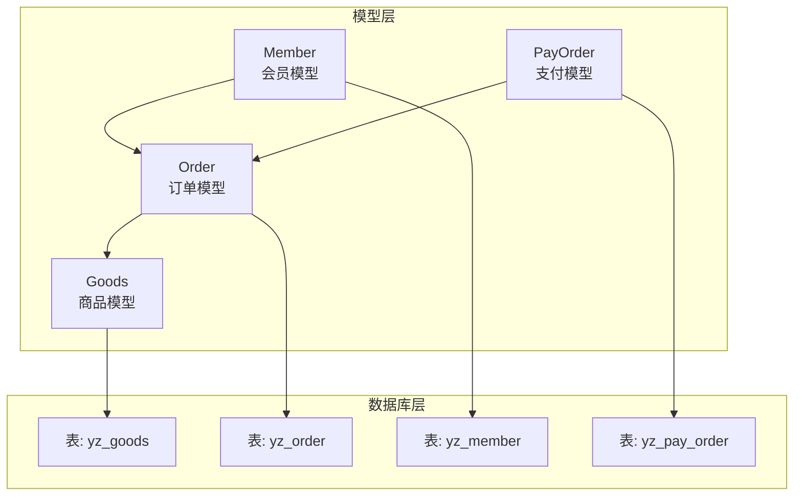
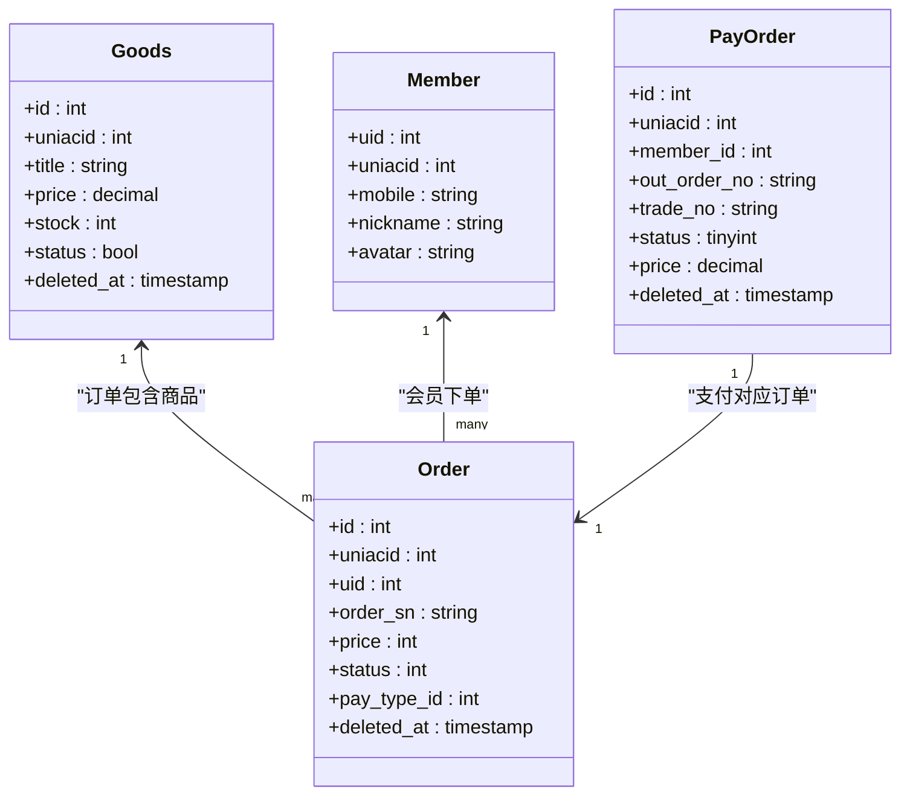
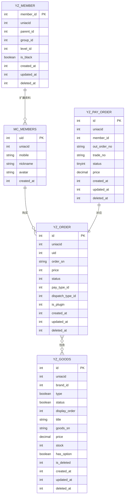
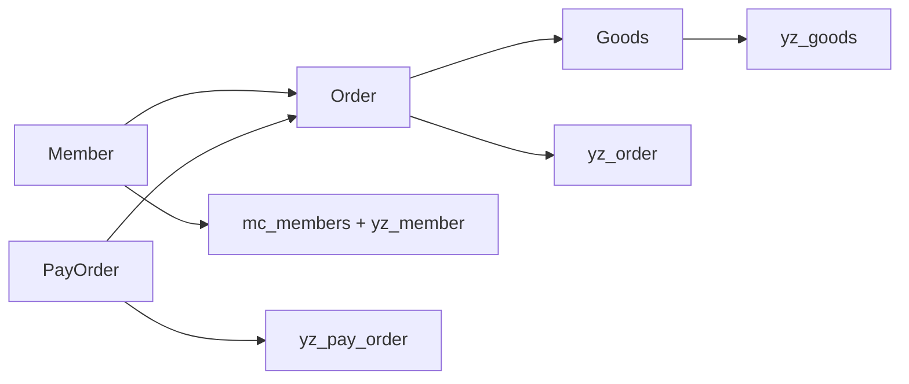

# 核心数据模型

<cite>
**本文引用的文件**
- [app/common/models/Goods.php](file://app/common/models/Goods.php)
- [app/common/models/Order.php](file://app/common/models/Order.php)
- [app/common/models/Member.php](file://app/common/models/Member.php)
- [app/common/models/PayOrder.php](file://app/common/models/PayOrder.php)
- [database/migrations/2017_03_06_200815_create_ims_yz_goods_table.php](file://database/migrations/2017_03_06_200815_create_ims_yz_goods_table.php)
- [database/migrations/2017_03_10_215716_create_ims_yz_order_table.php](file://database/migrations/2017_03_10_215716_create_ims_yz_order_table.php)
- [database/migrations/2017_03_28_203149_create_ims_yz_pay_order_table.php](file://database/migrations/2017_03_28_203149_create_ims_yz_pay_order_table.php)
- [database/migrations/2017_03_07_110235_create_ims_yz_member_table.php](file://database/migrations/2017_03_07_110235_create_ims_yz_member_table.php)
</cite>

## 目录
1. [简介](#简介)
2. [项目结构](#项目结构)
3. [核心组件](#核心组件)
4. [架构总览](#架构总览)
5. [详细组件分析](#详细组件分析)
6. [依赖分析](#依赖分析)
7. [性能考量](#性能考量)
8. [故障排查指南](#故障排查指南)
9. [结论](#结论)
10. [附录](#附录)

## 简介
本文件聚焦芸众商城的核心业务数据模型，围绕商品(Goods)、订单(Order)、会员(Member)、支付(PayOrder)四大实体，系统梳理其设计理念、字段定义、关系约束与生命周期管理，并结合数据库迁移脚本给出权威的表结构依据。同时，提供实体关系图、字段说明、索引设计、软删除策略以及典型业务场景下的使用建议与最佳实践。

## 项目结构
- 数据模型位于应用层公共目录，采用Eloquent ORM封装，统一继承基础模型类，具备软删除、搜索字段、日期字段等通用能力。
- 数据库迁移脚本定义了各核心表的字段、索引与注释，是理解字段语义与约束的权威来源。
- 模型间通过关联方法建立一对多、一对一与多对多关系，支撑订单-商品、会员-关系链、支付-订单等复杂业务。

图表来源
- [app/common/models/Goods.php](file://app/common/models/Goods.php)
- [app/common/models/Order.php](file://app/common/models/Order.php)
- [app/common/models/Member.php](file://app/common/models/Member.php)
- [app/common/models/PayOrder.php](file://app/common/models/PayOrder.php)
- [database/migrations/2017_03_06_200815_create_ims_yz_goods_table.php](file://database/migrations/2017_03_06_200815_create_ims_yz_goods_table.php)
- [database/migrations/2017_03_10_215716_create_ims_yz_order_table.php](file://database/migrations/2017_03_10_215716_create_ims_yz_order_table.php)
- [database/migrations/2017_03_28_203149_create_ims_yz_pay_order_table.php](file://database/migrations/2017_03_28_203149_create_ims_yz_pay_order_table.php)

章节来源
- [app/common/models/Goods.php](file://app/common/models/Goods.php)
- [app/common/models/Order.php](file://app/common/models/Order.php)
- [app/common/models/Member.php](file://app/common/models/Member.php)
- [app/common/models/PayOrder.php](file://app/common/models/PayOrder.php)
- [database/migrations/2017_03_06_200815_create_ims_yz_goods_table.php](file://database/migrations/2017_03_06_200815_create_ims_yz_goods_table.php)
- [database/migrations/2017_03_10_215716_create_ims_yz_order_table.php](file://database/migrations/2017_03_10_215716_create_ims_yz_order_table.php)
- [database/migrations/2017_03_28_203149_create_ims_yz_pay_order_table.php](file://database/migrations/2017_03_28_203149_create_ims_yz_pay_order_table.php)

## 核心组件
- 商品模型(Goods)
  - 表: yz_goods
  - 主键: 自增id
  - 关键字段: 品牌、状态、排序、标题、缩略图、内容、编号、条码、市场价、销售价、成本价、库存、扣库存方式、销量、重量、规格开关、各类标签位、逻辑删除标记等
  - 关系: 与规格、参数、分类、品牌、运费模板、限时购、视频、分享、广告、服务、发票等多维扩展关联
  - 约束: 多处索引(uniacid、is_new、is_hot、is_discount、is_recommand、is_comment、is_deleted)，支持软删除
- 订单模型(Order)
  - 表: yz_order
  - 主键: 自增id
  - 关键字段: 公众号标识、用户uid、订单号、应付金额、商品金额、状态、时间戳字段、删除标记、配送方式、支付方式、插件标识等
  - 关系: 与会员(购买者)、订单商品、支付、地址、快递、优惠、抵扣、发票、退款申请等强关联
  - 约束: 多处索引，支持软删除；状态常量覆盖待付款、待发货、待收货、完成、退款等
- 会员模型(Member)
  - 表: mc_members + yz_member(扩展)
  - 主键: uid
  - 关键字段: 手机、邮箱、密码、盐、分组、积分、实名、昵称、头像、性别、生日、地址、职业等
  - 关系: 与会员资料、粉丝映射、小程序、唯一识别、角色(分销/团队/区域/招商/微店/供应商)、上下级关系、优惠券等关联
  - 约束: 主键uid，搜索字段包含uid/昵称/姓名/手机；提供“排除已删除”范围查询
- 支付模型(PayOrder)
  - 表: yz_pay_order
  - 主键: 自增id
  - 关键字段: 平台ID、会员ID、内部支付单号、外部支付单号(out_order_no)、交易号、状态、金额、类型、第三方支付方式、时间戳、软删除
  - 关系: 与订单支付(OrderPay)通过out_order_no/pay_sn关联；与退款记录(PayRefundOrder)一对一
  - 约束: out_order_no建索引；状态枚举含未支付、待支付、已支付；支持“已退款”状态判定

章节来源
- [app/common/models/Goods.php](file://app/common/models/Goods.php)
- [app/common/models/Order.php](file://app/common/models/Order.php)
- [app/common/models/Member.php](file://app/common/models/Member.php)
- [app/common/models/PayOrder.php](file://app/common/models/PayOrder.php)
- [database/migrations/2017_03_06_200815_create_ims_yz_goods_table.php](file://database/migrations/2017_03_06_200815_create_ims_yz_goods_table.php)
- [database/migrations/2017_03_10_215716_create_ims_yz_order_table.php](file://database/migrations/2017_03_10_215716_create_ims_yz_order_table.php)
- [database/migrations/2017_03_28_203149_create_ims_yz_pay_order_table.php](file://database/migrations/2017_03_28_203149_create_ims_yz_pay_order_table.php)

## 架构总览
- 模型-表映射清晰，均通过Eloquent实现，具备软删除、日期字段、搜索字段、范围查询等通用特性。
- 订单-商品、会员-订单、支付-订单形成核心闭环；商品侧扩展丰富，覆盖规格、参数、分类、品牌、营销、视频等。
- 支付模型作为跨插件、跨支付渠道的统一抽象，与订单支付表形成松耦合关联。

图表来源
- [app/common/models/Goods.php](file://app/common/models/Goods.php)
- [app/common/models/Order.php](file://app/common/models/Order.php)
- [app/common/models/Member.php](file://app/common/models/Member.php)
- [app/common/models/PayOrder.php](file://app/common/models/PayOrder.php)

## 详细组件分析

### 商品模型(Goods)
- 设计理念
  - 商品为中心实体，围绕“基础信息+扩展能力+营销配置+物流模板+视频/广告/分享”构建完整商品域。
  - 通过软删除与多索引提升查询效率与数据安全。
- 字段与约束
  - 主键: id
  - 关键字段: uniacid、brand_id、type、status、display_order、title、thumb、content、goods_sn、product_sn、market_price、price、cost_price、stock、reduce_stock_method、show_sales、real_sales、weight、has_option、各类布尔标签位、is_deleted、created_at/updated_at/deleted_at
  - 索引: idx_uniacid、idx_isnew、idx_ishot、idx_isdiscount、idx_isrecommand、idx_iscomment、idx_deleted
- 关系
  - 一对多: 规格(GoodsOption)、参数(GoodsParam)、分类(GoodsCategory)
  - 一对一: 品牌(Brand)、运费模板(GoodsDispatch)、限时购(GoodsLimitBuy)、视频(GoodsVideo)、分享(GoodsShare)、广告(GoodsAdvertising)、服务(GoodsService)
  - 多对多: 店铺/供应商关联、邮费模板适用分类
- 生命周期与软删除
  - 使用软删除字段deleted_at，配合模型软删除trait，支持逻辑删除与恢复
- 最佳实践
  - 查询时优先利用索引字段(如status、has_option、is_hot等)进行过滤
  - 更新库存建议结合扣库存策略(reduce_stock_method)与事务控制

章节来源
- [app/common/models/Goods.php](file://app/common/models/Goods.php)
- [database/migrations/2017_03_06_200815_create_ims_yz_goods_table.php](file://database/migrations/2017_03_06_200815_create_ims_yz_goods_table.php)

### 订单模型(Order)
- 设计理念
  - 订单聚合支付、商品、地址、优惠、退款等全链路信息，状态机覆盖从待付款到完成/退款的关键节点。
  - 支持插件化订单与多配送方式，满足复杂业务形态。
- 字段与约束
  - 主键: id
  - 关键字段: uniacid、uid、order_sn、price、goods_price、status、create_time、finish_time、pay_time、send_time、cancel_time、is_deleted、is_member_deleted、dispatch_type_id、pay_type_id、is_plugin、deleted_at
  - 索引: 多处索引用于状态、删除标记、插件标识等
- 关系
  - 一对多: 订单商品(OrderGoods)、优惠(OrderDiscount)、抵扣(OrderDeduction)、优惠券(OrderCoupon)、运费抵扣(OrderFreightDeduction)、改价记录(OrderChangePriceLog)
  - 一对一: 收货地址(OrderAddress)、快递(Express)、支付(OrderPay)、支付方式(PayType)、退款申请(RefundApply)、发票(OrderInvoice/OrderInvoiceV2)
  - 多对一: 购买者(Member)
- 生命周期与软删除
  - 使用软删除字段deleted_at；提供多种状态范围查询(WaitPay/WaitSend/WaitReceive/Completed/Refund/Refunded/Cancelled)
- 最佳实践
  - 状态流转需严格遵循状态机；退款场景需联动RefundApply与OrderRefund相关表
  - 插件订单通过is_plugin与plugin_id区分，避免前端展示异常

章节来源
- [app/common/models/Order.php](file://app/common/models/Order.php)
- [database/migrations/2017_03_10_215716_create_ims_yz_order_table.php](file://database/migrations/2017_03_10_215716_create_ims_yz_order_table.php)

### 会员模型(Member)
- 设计理念
  - 会员为核心用户实体，承载基础资料、账户资产、社交关系、角色身份与多平台映射。
  - 提供“排除已删除”的查询范围，保障统计与运营准确性。
- 字段与约束
  - 主键: uid
  - 关键字段: uniacid、mobile、email、password、salt、groupid、credit1~6、realname、nickname、avatar、gender、生日、地址、职业等
  - 索引: 搜索字段包含uid/昵称/姓名/手机
- 关系
  - 一对多: 订单、优惠券、上下级关系(MemberParent/MemberChildren)、角色(分销/团队/区域/招商/微店/供应商)
  - 一对一: 会员资料(MemberShopInfo)、粉丝映射(McMappingFans)、小程序(MemberMiniApp)、唯一识别(MemberUnique)、银行卡(MemberBankCard)、删除日志(MemberDel)
- 生命周期与软删除
  - 通过yz_member的deleted_at与yz_member_del_log联合实现“排除已删除”查询
- 最佳实践
  - 头像与昵称脱敏处理，保护隐私
  - 分销关系链建立需确保mid与邀请码逻辑一致

章节来源
- [app/common/models/Member.php](file://app/common/models/Member.php)
- [database/migrations/2017_03_07_110235_create_ims_yz_member_table.php](file://database/migrations/2017_03_07_110235_create_ims_yz_member_table.php)

### 支付模型(PayOrder)
- 设计理念
  - 统一跨渠道、跨类型的支付入口，屏蔽具体支付方式差异，与订单支付表解耦。
- 字段与约束
  - 主键: id
  - 关键字段: uniacid、member_id、int_order_no、out_order_no、trade_no、status、price、type、third_type、created_at/updated_at/deleted_at
  - 索引: out_order_no建索引，便于按外部单号快速定位
- 关系
  - 一对多: 退款记录(PayRefundOrder)
  - 一对一: 订单支付(OrderPay)通过out_order_no/pay_sn关联
- 生命周期与软删除
  - 使用软删除字段deleted_at；状态枚举含未支付、待支付、已支付；支持“已退款”状态判定
- 最佳实践
  - 支付回调需校验out_order_no与trade_no一致性
  - 退款流程需先落退款记录再更新状态，保证幂等性

章节来源
- [app/common/models/PayOrder.php](file://app/common/models/PayOrder.php)
- [database/migrations/2017_03_28_203149_create_ims_yz_pay_order_table.php](file://database/migrations/2017_03_28_203149_create_ims_yz_pay_order_table.php)

### 关联关系与实体关系图
- 订单-商品: 通过订单商品中间表(模型OrderGoods)实现一对多
- 会员-订单: 通过uid实现一对多
- 支付-订单: 通过out_order_no/pay_sn实现一对一或一对多(拆分支付场景)

图表来源
- [database/migrations/2017_03_06_200815_create_ims_yz_goods_table.php](file://database/migrations/2017_03_06_200815_create_ims_yz_goods_table.php)
- [database/migrations/2017_03_10_215716_create_ims_yz_order_table.php](file://database/migrations/2017_03_10_215716_create_ims_yz_order_table.php)
- [database/migrations/2017_03_28_203149_create_ims_yz_pay_order_table.php](file://database/migrations/2017_03_28_203149_create_ims_yz_pay_order_table.php)
- [database/migrations/2017_03_07_110235_create_ims_yz_member_table.php](file://database/migrations/2017_03_07_110235_create_ims_yz_member_table.php)

## 依赖分析
- 模型内聚性高，职责边界清晰；通过关联方法与范围查询降低耦合。
- 外部依赖主要体现在支付工厂、事件系统、插件管理器、观察者等，但这些不影响核心模型的结构与关系。
- 数据库层面，索引策略与软删除字段构成模型稳定性的基础。

图表来源
- [app/common/models/Goods.php](file://app/common/models/Goods.php)
- [app/common/models/Order.php](file://app/common/models/Order.php)
- [app/common/models/Member.php](file://app/common/models/Member.php)
- [app/common/models/PayOrder.php](file://app/common/models/PayOrder.php)

## 性能考量
- 索引优化
  - 商品表: 对状态、标签位、删除标记建立索引，支持高频筛选
  - 订单表: 对状态、删除标记、插件标识建立索引，加速状态报表与前端列表
  - 支付表: 对外部单号(out_order_no)建立索引，提升支付回调与查询性能
- 软删除与范围查询
  - 合理使用软删除字段与范围查询，避免全表扫描
- 关联查询
  - 使用with预加载必要关联，减少N+1查询
- 写入与锁
  - 库存扣减与订单状态变更需结合事务与行级锁，防止超卖与状态错乱

## 故障排查指南
- 订单状态异常
  - 检查状态常量与范围查询是否匹配；核对事件队列与作业执行情况
- 支付回调失败
  - 校验外部单号与交易号一致性；检查退款状态是否被提前更新
- 商品库存不一致
  - 核对扣库存策略与事务边界；检查是否存在并发写入
- 会员关系链断裂
  - 校验邀请码与mid传递逻辑；确认事件触发顺序

## 结论
芸众商城的核心数据模型以商品、订单、会员、支付四者为主线，辅以丰富的扩展与索引策略，既满足标准化电商场景，又兼顾插件化与多形态业务拓展。通过软删除、范围查询与明确的关系边界，模型在可维护性与性能之间取得良好平衡。建议在实际开发中严格遵循字段约束与索引策略，完善状态机与事务控制，持续优化关联查询与支付回调流程。

## 附录
- 字段说明与索引参考
  - 商品表(yz_goods): 主键id；索引包含uniacid、is_new、is_hot、is_discount、is_recommand、is_comment、is_deleted
  - 订单表(yz_order): 主键id；常用索引包含uniacid、status、is_deleted、is_plugin
  - 支付表(yz_pay_order): 主键id；常用索引包含uniacid、member_id、out_order_no
  - 会员表(mc_members + yz_member): 主键uid；搜索字段包含uid/昵称/姓名/手机