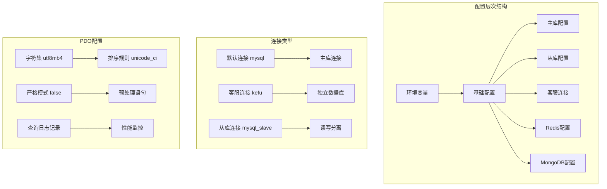
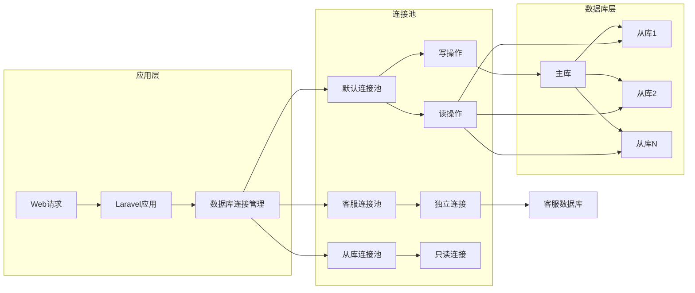
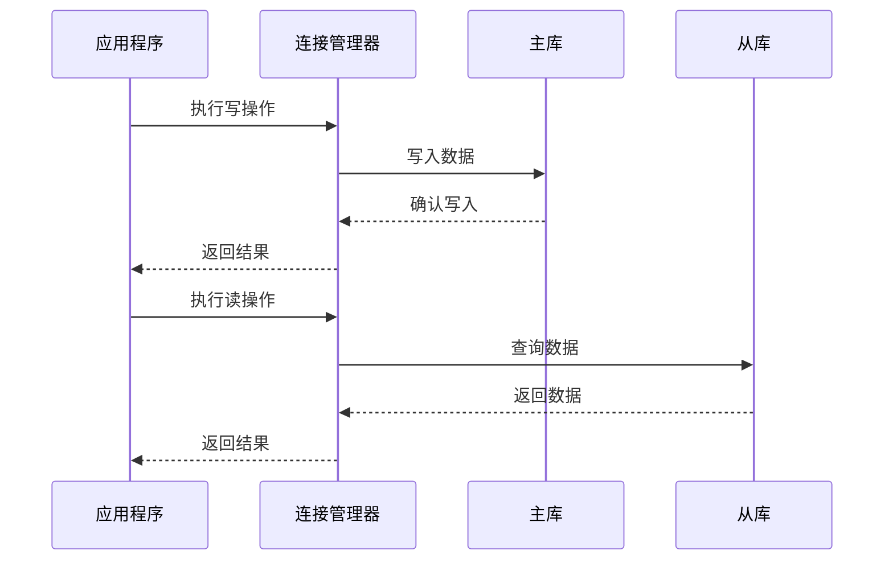
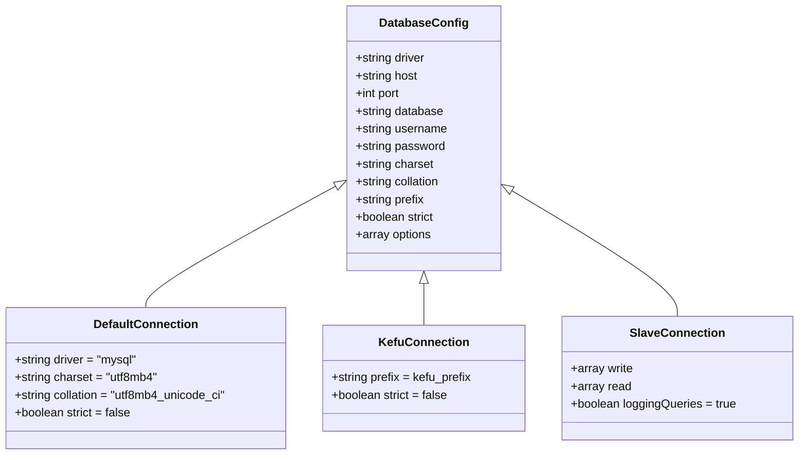
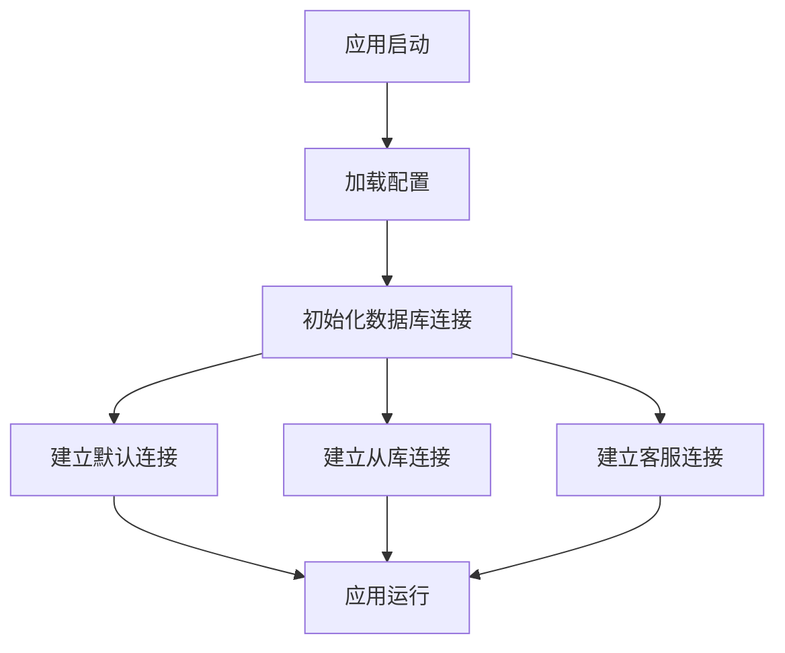
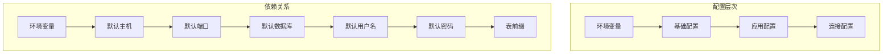
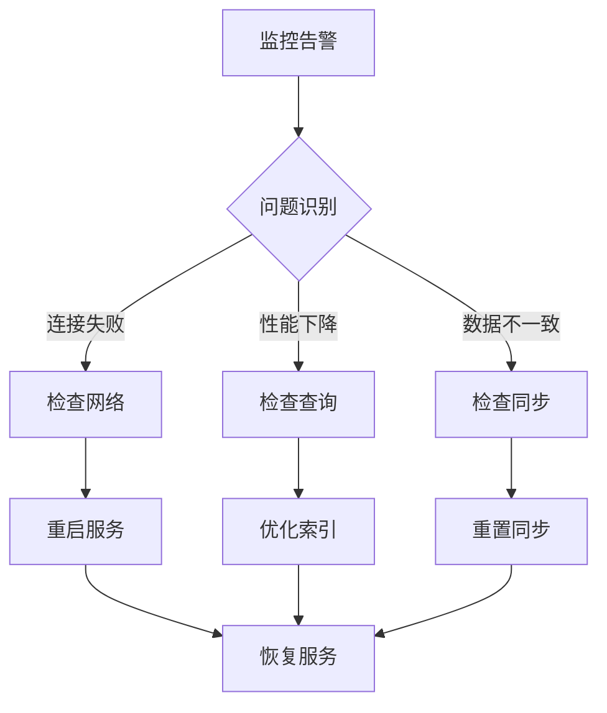

# MySQL配置与连接管理

<cite>
**本文档引用的文件**
- [config/database.php](file://config/database.php)
- [config/app.php](file://config/app.php)
- [bootstrap/app.php](file://bootstrap/app.php)
- [database/migrations](file://database/migrations)
</cite>

## 目录
1. [简介](#简介)
2. [项目结构](#项目结构)
3. [核心组件](#核心组件)
4. [架构概览](#架构概览)
5. [详细组件分析](#详细组件分析)
6. [依赖关系分析](#依赖关系分析)
7. [性能考虑](#性能考虑)
8. [故障排除指南](#故障排除指南)
9. [结论](#结论)
10. [附录](#附录)

## 简介

芸众商城采用Laravel框架构建，MySQL数据库配置与连接管理是系统的核心基础设施之一。本文档深入解析了项目的MySQL配置体系，包括主从复制配置、读写分离策略、多数据库连接支持以及PDO配置选项。同时详细说明了665个数据库迁移文件的组织结构和命名规范，并提供了连接故障转移、连接超时处理、慢查询监控等运维最佳实践。

## 项目结构

芸众商城的数据库配置主要集中在config目录下的database.php文件中，该文件采用分层配置架构，支持多种数据库连接场景：

**图表来源**
- [config/database.php:137-304](file://config/database.php#L137-L304)

**章节来源**
- [config/database.php:1-304](file://config/database.php#L1-L304)

## 核心组件

### 主数据库连接配置

系统定义了三种主要的数据库连接类型：

1. **默认连接 (mysql)**：用于主要业务逻辑
2. **客服连接 (kefu)**：独立的客服数据源
3. **从库连接 (mysql_slave)**：支持读写分离的主从架构

每种连接都包含完整的PDO配置选项，确保字符集、排序规则、严格模式等参数的一致性。

**章节来源**
- [config/database.php:181-246](file://config/database.php#L181-L246)

### 多数据库连接支持

系统支持以下连接场景：

- **默认连接**：标准业务数据库连接
- **客服连接**：独立的客服数据源，可指向不同的数据库实例
- **从库连接**：实现读写分离，主库负责写操作，从库处理读请求

**章节来源**
- [config/database.php:200-246](file://config/database.php#L200-L246)

### PDO配置选项

PDO配置包含了关键的性能优化参数：

- **字符集设置**：utf8mb4支持完整的Unicode字符
- **严格模式**：关闭严格模式以提高兼容性
- **预处理语句**：通过环境变量控制预处理语句的使用
- **查询日志记录**：启用查询日志以便性能监控

**章节来源**
- [config/database.php:188-196](file://config/database.php#L188-L196)

## 架构概览

芸众商城的数据库架构采用了经典的主从复制模式，结合Laravel的连接管理机制实现了高效的读写分离：

**图表来源**
- [config/database.php:173-258](file://config/database.php#L173-L258)

## 详细组件分析

### 主从复制配置

系统通过`mysql_slave`连接实现了完整的主从复制配置：

**图表来源**
- [config/database.php:227-246](file://config/database.php#L227-L246)

### 读写分离策略

读写分离通过Laravel的连接配置自动实现：

- **写操作**：所有写操作（INSERT、UPDATE、DELETE）路由到主库
- **读操作**：所有读操作（SELECT）路由到从库
- **连接选择**：根据SQL语句类型自动选择合适的连接

**章节来源**
- [config/database.php:229-234](file://config/database.php#L229-L234)

### 多数据库连接配置

系统支持三种不同的数据库连接配置：

**图表来源**
- [config/database.php:181-246](file://config/database.php#L181-L246)

**章节来源**
- [config/database.php:181-246](file://config/database.php#L181-L246)

### PDO配置详解

PDO配置选项提供了全面的数据库连接控制：

| 配置项 | 默认值 | 说明 |
|--------|--------|------|
| driver | mysql | 数据库驱动程序 |
| host | 环境变量 | 数据库主机地址 |
| port | 环境变量 | 数据库端口号 |
| database | 环境变量 | 数据库名称 |
| username | 环境变量 | 用户名 |
| password | 环境变量 | 密码 |
| charset | utf8mb4 | 字符集设置 |
| collation | utf8mb4_unicode_ci | 排序规则 |
| prefix | 环境变量 | 表前缀 |
| strict | false | 严格模式开关 |
| engine | null | 存储引擎 |
| loggingQueries | true | 查询日志记录 |

**章节来源**
- [config/database.php:188-196](file://config/database.php#L188-L196)

## 依赖关系分析

### 应用启动流程

**图表来源**
- [bootstrap/app.php:14-48](file://bootstrap/app.php#L14-L48)

### 配置依赖关系

系统配置采用分层依赖结构：

**图表来源**
- [config/database.php:42-134](file://config/database.php#L42-L134)

**章节来源**
- [bootstrap/app.php:14-48](file://bootstrap/app.php#L14-L48)
- [config/database.php:42-134](file://config/database.php#L42-L134)

## 性能考虑

### 连接池优化

系统通过以下方式优化数据库连接性能：

1. **连接复用**：Laravel框架自动管理连接生命周期
2. **查询缓存**：PDO配置支持查询结果缓存
3. **预处理语句**：通过环境变量控制预处理语句的使用
4. **连接超时**：合理的连接超时设置避免资源浪费

### 主从复制性能优化

- **读写分离**：将读操作分散到多个从库，提高并发处理能力
- **负载均衡**：从库之间实现负载均衡，避免单点压力
- **数据同步**：主从数据同步机制确保数据一致性

## 故障排除指南

### 常见连接问题

1. **连接超时**：检查网络连通性和防火墙设置
2. **认证失败**：验证用户名密码和权限配置
3. **字符集问题**：确认utf8mb4支持和排序规则设置
4. **主从同步延迟**：监控复制状态和网络延迟

### 运维最佳实践

**章节来源**
- [config/database.php:193-196](file://config/database.php#L193-L196)

## 结论

芸众商城的MySQL配置与连接管理体系展现了现代Web应用的最佳实践。通过Laravel的灵活配置机制，系统实现了：

1. **多层次配置管理**：支持环境变量、基础配置、应用配置的分层管理
2. **完整的主从复制**：实现了读写分离和高可用架构
3. **多数据库连接支持**：满足不同业务场景的需求
4. **全面的PDO配置**：提供了丰富的性能优化选项
5. **完善的迁移管理**：665个迁移文件体现了系统的演进历程

这套配置体系为芸众商城提供了稳定、高效、可扩展的数据库基础设施，能够满足电商应用对性能和可靠性的严格要求。

## 附录

### 迁移文件管理

系统包含665个数据库迁移文件，采用时间戳+描述的命名规范，实现了完整的数据库版本管理：

- **文件数量**：665个迁移文件
- **命名规范**：YYYY_MM_DD_HHMMSS_create_table_name.php
- **版本控制**：通过migrations表跟踪已执行的迁移
- **回滚机制**：支持迁移的逆向执行

**章节来源**
- [config/database.php:271](file://config/database.php#L271)