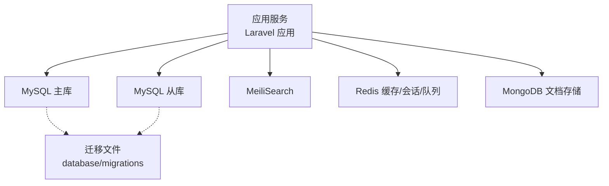
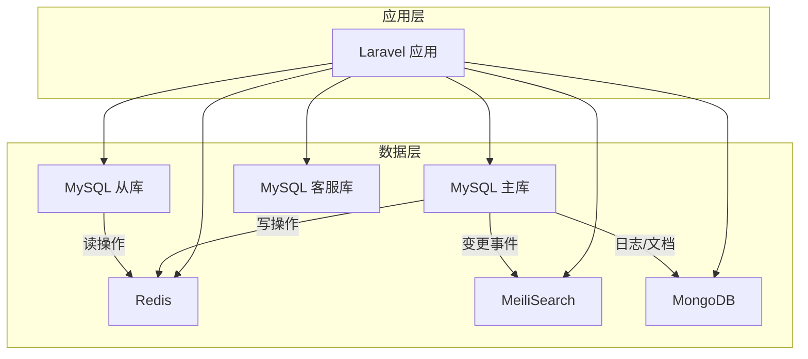
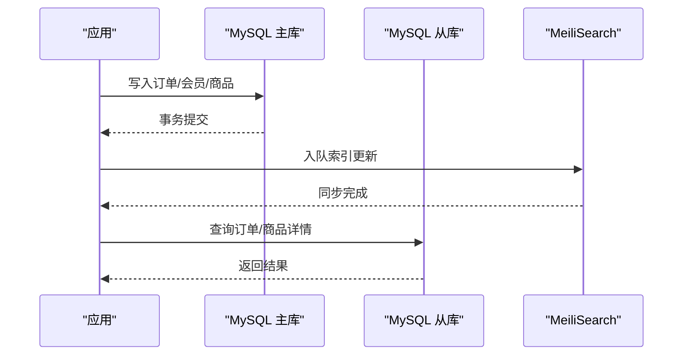
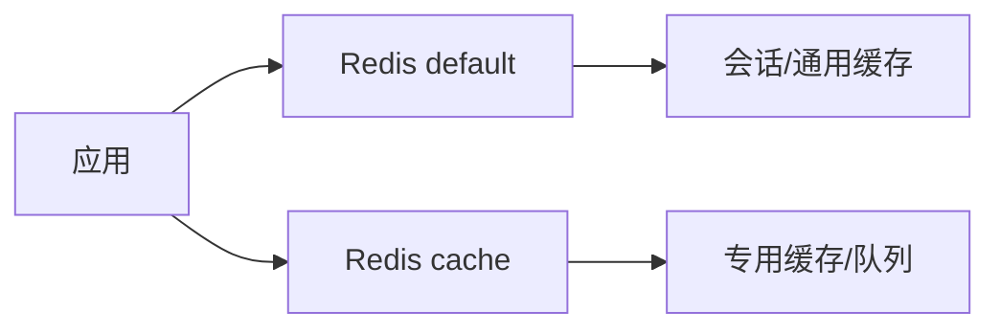
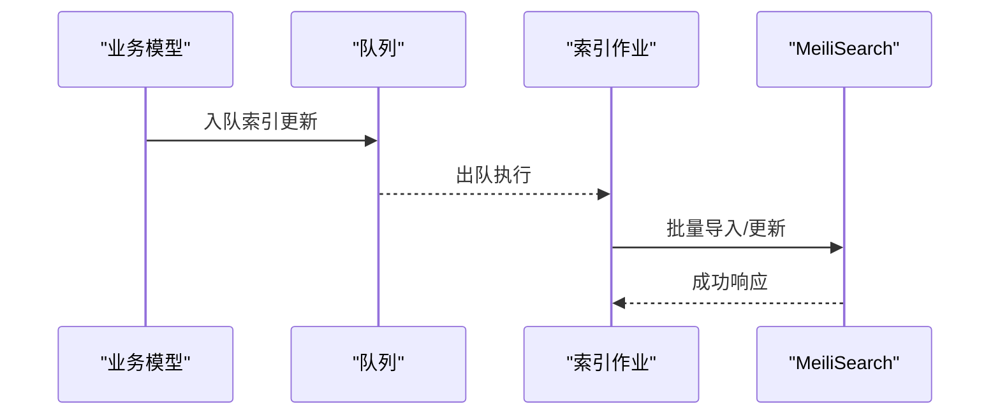
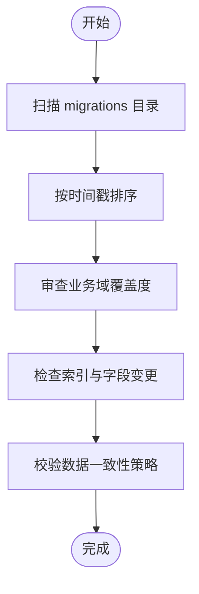
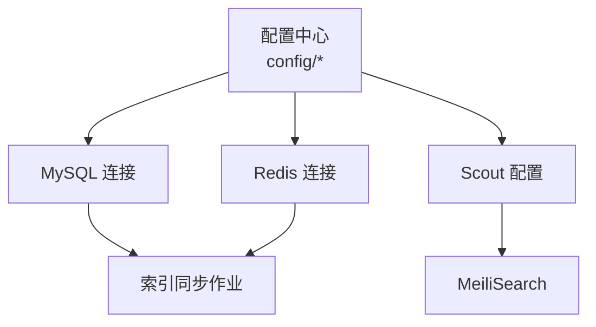

# 数据架构

<cite>
**本文引用的文件**
- [config/database.php](file://config/database.php)
- [config/cache.php](file://config/cache.php)
- [config/scout.php](file://config/scout.php)
- [database/redis.php](file://database/redis.php)
- [database/migrations](file://database/migrations)
- [app/Jobs/UpdateMeiliSearch.php](file://app/Jobs/UpdateMeiliSearch.php)
- [app/Jobs/UploadModelJob.php](file://app/Jobs/UploadModelJob.php)
- [app/Jobs/UploadModelJob.php20250716](file://app/Jobs/UploadModelJob.php20250716)
- [app/Jobs/UploadModelJob.php20251204](file://app/Jobs/UploadModelJob.php20251204)
</cite>

## 目录
1. [简介](#简介)
2. [项目结构](#项目结构)
3. [核心组件](#核心组件)
4. [架构总览](#架构总览)
5. [详细组件分析](#详细组件分析)
6. [依赖分析](#依赖分析)
7. [性能考量](#性能考量)
8. [故障排查指南](#故障排查指南)
9. [结论](#结论)
10. [附录](#附录)

## 简介
本文件面向芸众商城的数据架构，系统性梳理 MySQL 配置与连接管理（含主从读写分离、连接池与事务）、MongoDB 的集成与适用场景、Redis 多用途架构（缓存、会话、队列）、搜索引擎（MeiliSearch）集成与全文检索实现，并结合现有迁移文件组织与命名规范，给出数据库模型设计原则、索引策略、备份恢复与迁移最佳实践。

## 项目结构
围绕数据层的关键配置与实现分布如下：
- MySQL 连接与读写分离：通过配置文件集中定义主库、从库、客服库、以及“主写+从读”的复合连接。
- 缓存与会话：默认使用 Redis；缓存键前缀统一，支持多数据库实例。
- 搜索引擎：基于 Laravel Scout，默认驱动为 MeiliSearch，可配置队列异步同步。
- MongoDB：独立连接配置，便于文档型数据存储与分析。
- 迁移文件：按时间戳与业务模块组织，覆盖商品、订单、会员、支付、优惠券、任务队列等核心领域。

图表来源
- [config/database.php:181-246](file://config/database.php#L181-L246)
- [config/scout.php:18](file://config/scout.php#L18)
- [config/cache.php:75-78](file://config/cache.php#L75-L78)
- [database/redis.php:4-8](file://database/redis.php#L4-L8)

章节来源
- [config/database.php:137-304](file://config/database.php#L137-L304)
- [config/cache.php:1-96](file://config/cache.php#L1-L96)
- [config/scout.php:1-143](file://config/scout.php#L1-L143)
- [database/redis.php:1-9](file://database/redis.php#L1-L9)

## 核心组件
- MySQL 连接与读写分离
  - 默认连接 mysql 使用主库参数，支持统一表前缀与字符集设置。
  - 读写分离连接 mysql_slave 定义 write/read 列表，实现读流量分发。
  - 客服库 kefu 连接独立，避免与主业务库竞争。
- 缓存与会话
  - 默认缓存驱动由运行环境决定；生产环境优先 Redis。
  - 缓存键带统一前缀，避免多应用冲突。
- 搜索引擎
  - 默认驱动为 MeiliSearch，支持队列异步同步，提升写入吞吐。
- MongoDB
  - 单独连接配置，便于文档型数据与日志分析。
- Redis
  - 提供 default 与 cache 两个逻辑库，分别用于通用缓存与专用缓存空间。

章节来源
- [config/database.php:181-246](file://config/database.php#L181-L246)
- [config/cache.php:22](file://config/cache.php#L22)
- [config/cache.php:93](file://config/cache.php#L93)
- [config/scout.php:18](file://config/scout.php#L18)
- [database/redis.php:4-8](file://database/redis.php#L4-L8)

## 架构总览
下图展示应用与各数据组件的交互关系，以及读写分离与搜索引擎同步流程。

图表来源
- [config/database.php:181-246](file://config/database.php#L181-L246)
- [config/scout.php:18](file://config/scout.php#L18)
- [config/cache.php:75-78](file://config/cache.php#L75-L78)
- [database/redis.php:4-8](file://database/redis.php#L4-L8)

## 详细组件分析

### MySQL 配置与连接管理
- 主库与从库
  - 主库连接 mysql 使用环境变量或外部配置注入的主机、端口、库名、用户名、密码与表前缀。
  - 读写分离连接 mysql_slave 将 write 与 read 分离，读请求路由至从库，写请求路由至主库。
- 客服库 kefu
  - 独立连接，避免客服相关查询影响主业务库。
- 连接选项
  - 字符集 utf8mb4 与排序规则 utf8mb4_unicode_ci，严格模式关闭以兼容历史数据。
  - 支持 PDO 预处理语句开关与查询日志记录，便于诊断与审计。
- 事务与一致性
  - 写库事务提交后，配合搜索引擎队列异步同步，保证最终一致。

图表来源
- [config/database.php:181-246](file://config/database.php#L181-L246)
- [config/scout.php:44](file://config/scout.php#L44)

章节来源
- [config/database.php:181-246](file://config/database.php#L181-L246)

### MongoDB 集成与适用场景
- 连接配置
  - 通过配置文件注入主机、端口、数据库、用户名、密码，支持独立数据库。
- 适用场景
  - 日志与审计追踪、商品视频/富文本内容、临时分析数据、用户行为埋点等非强一致需求。
- 建议
  - 与关系型数据解耦，避免跨库事务；对热数据仍以 MySQL 为主，MongoDB 作为补充。

章节来源
- [config/database.php:249-256](file://config/database.php#L249-L256)

### Redis 架构与多用途应用
- 缓存与会话
  - 默认缓存驱动优先 Redis；键带统一前缀，避免多租户冲突。
- 队列与限流
  - 队列、广播、速率限制等均基于 Redis 实现，具备高并发与原子性保障。
- 多数据库实例
  - default 与 cache 两个逻辑库，便于隔离不同业务域的缓存与队列。

图表来源
- [config/cache.php:75-78](file://config/cache.php#L75-L78)
- [config/cache.php:93](file://config/cache.php#L93)
- [database/redis.php:4-8](file://database/redis.php#L4-L8)

章节来源
- [config/cache.php:22](file://config/cache.php#L22)
- [config/cache.php:75-78](file://config/cache.php#L75-L78)
- [config/cache.php:93](file://config/cache.php#L93)
- [database/redis.php:4-8](file://database/redis.php#L4-L8)

### 搜索引擎集成与全文检索
- 驱动选择
  - 默认驱动为 MeiliSearch，支持自定义主机与密钥。
- 同步策略
  - 可开启队列异步同步，降低写入时延；支持批量分块大小配置。
- 事件触发
  - 订单、商品等关键模型变更通过队列作业触发索引更新，确保搜索数据与业务数据一致。

图表来源
- [config/scout.php:18](file://config/scout.php#L18)
- [config/scout.php:44](file://config/scout.php#L44)
- [config/scout.php:70-73](file://config/scout.php#L70-L73)
- [app/Jobs/UpdateMeiliSearch.php](file://app/Jobs/UpdateMeiliSearch.php)

章节来源
- [config/scout.php:18](file://config/scout.php#L18)
- [config/scout.php:44](file://config/scout.php#L44)
- [config/scout.php:70-73](file://config/scout.php#L70-L73)
- [app/Jobs/UpdateMeiliSearch.php](file://app/Jobs/UpdateMeiliSearch.php)

### 迁移文件组织与命名规范
- 组织结构
  - 迁移文件位于 database/migrations，按时间戳前缀有序排列，便于版本演进与回溯。
- 命名规范
  - 文件名采用“年_月_日_时_分_秒_业务描述.php”格式，如 create_ims_yz_goods_table.php、add_order_sn_to_balance_transfer.php 等。
  - 日期部分体现演进顺序，业务描述明确表结构与字段变更意图。
- 设计思路
  - 覆盖商品、订单、会员、支付、优惠券、任务队列、广告、统计等核心领域。
  - 通过索引与字段增删改保持查询性能与数据完整性。
  - 对历史表进行兼容性处理（如引擎转换、字段类型调整、索引重建）。

图表来源
- [database/migrations](file://database/migrations)

章节来源
- [database/migrations](file://database/migrations)

### 数据模型设计原则与索引策略
- 设计原则
  - 以业务域为中心划分表结构，避免过度反范式化导致查询复杂。
  - 明确主外键关系，使用合适的数据类型与长度，统一字符集与排序规则。
  - 对高频查询字段建立索引，区分单列索引与联合索引，避免冗余索引。
- 索引策略
  - 关键查询字段（如订单号、会员标识、商品标识）建立唯一或普通索引。
  - 联合查询条件建立联合索引，遵循最左前缀原则。
  - 对历史大表进行分区或归档，减少全表扫描。
- 事务与一致性
  - 写库事务提交后，配合搜索引擎队列异步同步，保证最终一致。

章节来源
- [config/database.php:188-196](file://config/database.php#L188-L196)

### 备份、恢复与迁移最佳实践
- 备份
  - 定期对主库与从库执行逻辑备份与物理备份，保留增量日志。
  - 对 MongoDB 与 Redis 做快照或导出，确保可恢复性。
- 恢复
  - 恢复前先验证备份完整性与时间点一致性；优先在从库上验证恢复流程。
- 迁移
  - 迁移脚本需幂等，避免重复执行造成数据不一致。
  - 在低峰时段执行大表结构变更，必要时分批处理与索引重建。
  - 异步同步搜索引擎索引，避免阻塞主业务。

## 依赖分析
- 组件耦合
  - 应用通过 Laravel 配置中心统一管理数据库、缓存、搜索引擎与 Redis。
  - 读写分离依赖 Doctrine DBAL 的主从连接封装，确保读写分流。
- 外部依赖
  - MeiliSearch 作为搜索引擎，需稳定网络与资源配额。
  - Redis 提供缓存、队列与广播能力，需监控内存与持久化策略。

图表来源
- [config/database.php:137-304](file://config/database.php#L137-L304)
- [config/scout.php:18](file://config/scout.php#L18)
- [config/cache.php:75-78](file://config/cache.php#L75-L78)

章节来源
- [config/database.php:137-304](file://config/database.php#L137-L304)
- [config/scout.php:18](file://config/scout.php#L18)
- [config/cache.php:75-78](file://config/cache.php#L75-L78)

## 性能考量
- 连接与查询
  - 合理设置连接池与超时，避免长事务占用连接。
  - 对热点查询建立索引，定期分析慢查询日志。
- 缓存策略
  - 使用多级缓存（本地/分布式），合理设置过期时间与失效策略。
  - 对热点数据预热，避免缓存击穿。
- 搜索引擎
  - 控制索引同步频率与批量大小，平衡写入延迟与检索准确性。
- 存储
  - MySQL 与 MongoDB 分层存储，冷热数据分离；对大字段使用外部存储或压缩。

## 故障排查指南
- 连接失败
  - 检查数据库与 Redis 的主机、端口、认证信息是否正确。
  - 核对表前缀与字符集设置是否匹配。
- 读写异常
  - 确认读写分离配置是否生效，写库与从库状态是否正常。
- 搜索索引不同步
  - 检查队列是否运行，作业是否成功执行；查看搜索引擎健康状态。
- 缓存命中率低
  - 检查键前缀与过期策略，确认缓存键是否被意外清理。

章节来源
- [config/database.php:181-246](file://config/database.php#L181-L246)
- [config/scout.php:44](file://config/scout.php#L44)
- [config/cache.php:93](file://config/cache.php#L93)

## 结论
芸众商城采用“关系型主库 + 读写分离 + 搜索引擎 + 文档存储 + 多用途 Redis”的混合数据架构。通过规范化的迁移文件组织与严格的索引策略，兼顾了高性能与可维护性。建议持续完善异步同步机制与监控告警体系，确保在高并发场景下的稳定性与一致性。

## 附录
- 迁移文件示例路径
  - 商品与订单相关：[database/migrations](file://database/migrations)
- 搜索索引作业
  - 更新索引作业：[app/Jobs/UpdateMeiliSearch.php](file://app/Jobs/UpdateMeiliSearch.php)
  - 上传模型作业（含日期后缀）：
    - [app/Jobs/UploadModelJob.php](file://app/Jobs/UploadModelJob.php)
    - [app/Jobs/UploadModelJob.php20250716](file://app/Jobs/UploadModelJob.php20250716)
    - [app/Jobs/UploadModelJob.php20251204](file://app/Jobs/UploadModelJob.php20251204)