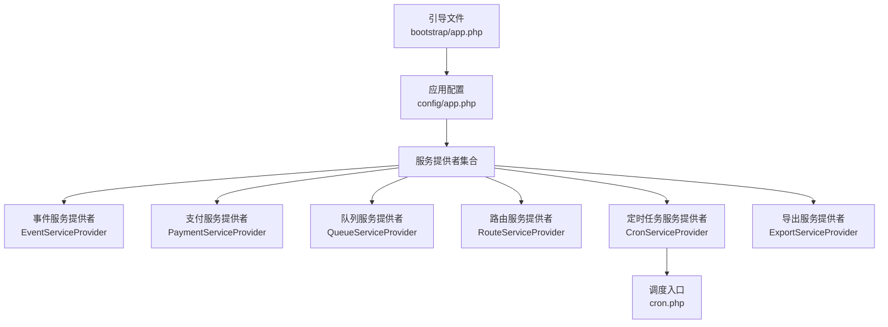
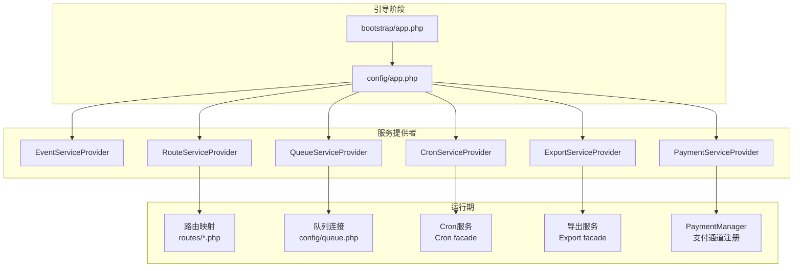
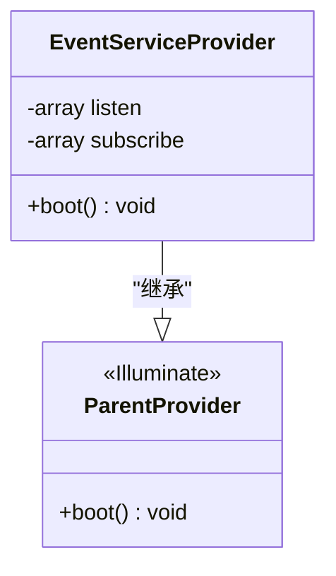
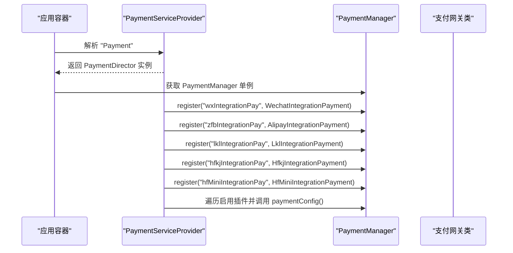
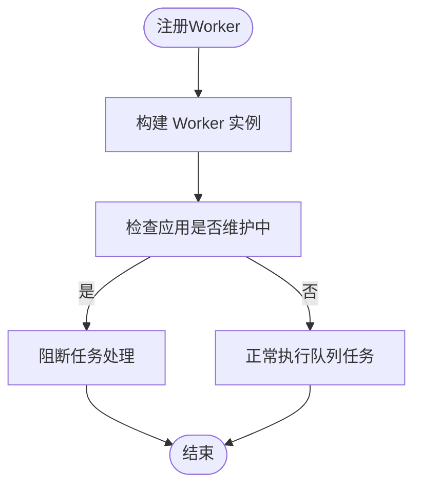
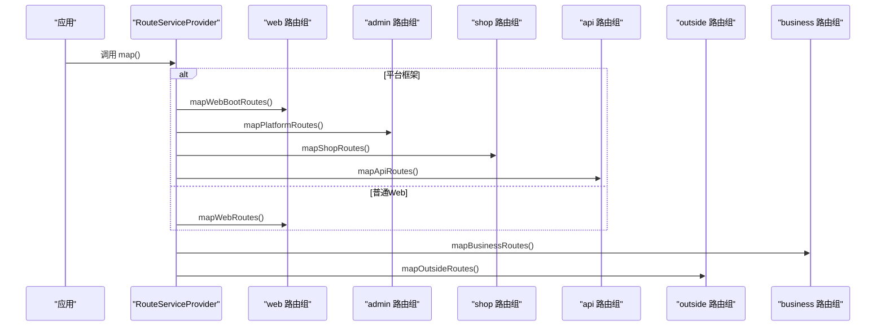
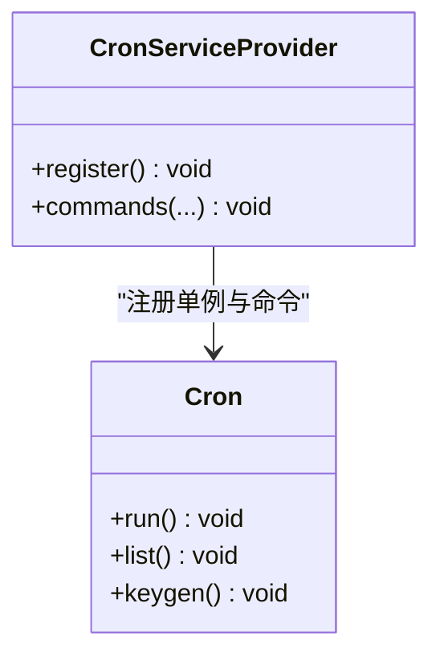
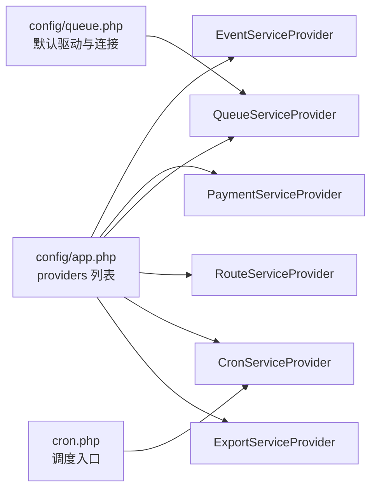

# 专用服务提供者

<cite>
**本文引用的文件**   
- [app/common/providers/EventServiceProvider.php](file://app/common/providers/EventServiceProvider.php)
- [app/common/providers/PaymentServiceProvider.php](file://app/common/providers/PaymentServiceProvider.php)
- [app/common/providers/QueueServiceProvider.php](file://app/common/providers/QueueServiceProvider.php)
- [app/common/providers/RouteServiceProvider.php](file://app/common/providers/RouteServiceProvider.php)
- [app/common/providers/CronServiceProvider.php](file://app/common/providers/CronServiceProvider.php)
- [app/common/providers/ExportServiceProvider.php](file://app/common/providers/ExportServiceProvider.php)
- [config/app.php](file://config/app.php)
- [config/queue.php](file://config/queue.php)
- [bootstrap/app.php](file://bootstrap/app.php)
- [cron.php](file://cron.php)
- [app/yunshop.php](file://app/yunshop.php)
</cite>

## 目录
1. [简介](#简介)
2. [项目结构](#项目结构)
3. [核心组件](#核心组件)
4. [架构总览](#架构总览)
5. [详细组件分析](#详细组件分析)
6. [依赖关系分析](#依赖关系分析)
7. [性能考量](#性能考量)
8. [故障排查指南](#故障排查指南)
9. [结论](#结论)
10. [附录](#附录)

## 简介
本文件面向芸众商城的专用服务提供者，系统性梳理以下专用服务提供者的职责与实现要点：
- 事件服务提供者：事件监听器映射与订阅者模式
- 支付服务提供者：支付通道注册与支付回调处理
- 队列服务提供者：队列驱动配置与Worker管理
- 路由服务提供者：路由注册与中间件绑定
- 定时任务服务提供者：定时任务管理与守护进程控制
- 导出服务提供者：数据导出服务注册

同时给出各服务提供者的配置参数与使用示例路径，帮助开发者快速理解并正确集成。

## 项目结构
芸众商城基于自研框架与Laravel扩展，通过服务提供者集中注册功能模块。核心入口与配置如下：
- 应用容器与内核绑定：在引导阶段完成容器实例化、内核与异常处理器绑定
- 服务提供者注册：在应用配置中集中声明，按需加载
- 调度入口：计划任务通过独立入口脚本启动

**图表来源**
- [bootstrap/app.php:14-52](file://bootstrap/app.php#L14-L52)
- [config/app.php:140-206](file://config/app.php#L140-L206)
- [cron.php:1-8](file://cron.php#L1-L8)

**章节来源**
- [bootstrap/app.php:14-52](file://bootstrap/app.php#L14-L52)
- [config/app.php:140-206](file://config/app.php#L140-L206)
- [cron.php:1-8](file://cron.php#L1-L8)

## 核心组件
- 事件服务提供者：负责事件到监听器的映射与订阅者类的批量注册，支持安装阶段跳过
- 支付服务提供者：以延迟提供者形式注册支付门面与支付管理器，并在启动时注册多种支付通道
- 队列服务提供者：重写Worker注册逻辑，注入维护状态判断与异常处理器
- 路由服务提供者：根据框架模式动态映射多套路由（平台、商城、业务、外部等），并绑定命名空间
- 定时任务服务提供者：基于第三方库注册Cron服务与命令，提供运行、列表与密钥生成命令
- 导出服务提供者：注册导出门面，便于插件扩展导出能力

**章节来源**
- [app/common/providers/EventServiceProvider.php:47-202](file://app/common/providers/EventServiceProvider.php#L47-L202)
- [app/common/providers/PaymentServiceProvider.php:26-62](file://app/common/providers/PaymentServiceProvider.php#L26-L62)
- [app/common/providers/QueueServiceProvider.php:10-32](file://app/common/providers/QueueServiceProvider.php#L10-L32)
- [app/common/providers/RouteServiceProvider.php:9-149](file://app/common/providers/RouteServiceProvider.php#L9-L149)
- [app/common/providers/CronServiceProvider.php:13-47](file://app/common/providers/CronServiceProvider.php#L13-L47)
- [app/common/providers/ExportServiceProvider.php:15-43](file://app/common/providers/ExportServiceProvider.php#L15-L43)

## 架构总览
下图展示专用服务提供者在应用生命周期中的作用与交互：

**图表来源**
- [bootstrap/app.php:14-52](file://bootstrap/app.php#L14-L52)
- [config/app.php:140-206](file://config/app.php#L140-L206)
- [config/queue.php:18-84](file://config/queue.php#L18-L84)
- [app/common/providers/RouteServiceProvider.php:36-146](file://app/common/providers/RouteServiceProvider.php#L36-L146)
- [app/common/providers/CronServiceProvider.php:20-45](file://app/common/providers/CronServiceProvider.php#L20-L45)
- [app/common/providers/ExportServiceProvider.php:17-20](file://app/common/providers/ExportServiceProvider.php#L17-L20)
- [app/common/providers/PaymentServiceProvider.php:30-53](file://app/common/providers/PaymentServiceProvider.php#L30-L53)

## 详细组件分析

### 事件服务提供者（EventServiceProvider）
- 事件监听器映射：集中定义事件与监听器的对应关系，覆盖订单、会员关系、支付日志、微信回调、流程状态变更等场景
- 订阅者模式：通过订阅数组批量注册多个监听者类，提升可维护性与扩展性
- 安装阶段保护：在安装路径下跳过注册，避免迁移阶段的事件干扰

**图表来源**
- [app/common/providers/EventServiceProvider.php:47-202](file://app/common/providers/EventServiceProvider.php#L47-L202)

**章节来源**
- [app/common/providers/EventServiceProvider.php:54-121](file://app/common/providers/EventServiceProvider.php#L54-L121)
- [app/common/providers/EventServiceProvider.php:126-185](file://app/common/providers/EventServiceProvider.php#L126-L185)
- [app/common/providers/EventServiceProvider.php:192-201](file://app/common/providers/EventServiceProvider.php#L192-L201)

### 支付服务提供者（PaymentServiceProvider）
- 延迟提供者：实现延迟加载，仅在解析别名或接口时初始化
- 门面与管理器：绑定“Payment”门面与PaymentManager单例
- 支付通道注册：在启动阶段注册多种集成支付方式（微信、支付宝、拉卡拉、汇付天下、华为小程序等）
- 插件扩展：遍历启用插件，调用其paymentConfig方法以注册插件专属支付通道

**图表来源**
- [app/common/providers/PaymentServiceProvider.php:30-53](file://app/common/providers/PaymentServiceProvider.php#L30-L53)

**章节来源**
- [app/common/providers/PaymentServiceProvider.php:30-60](file://app/common/providers/PaymentServiceProvider.php#L30-L60)

### 队列服务提供者（QueueServiceProvider）
- Worker重写：自定义队列Worker注册逻辑，注入维护状态检查与异常处理器
- 运行保障：在维护模式下阻断Worker继续处理任务，确保系统稳定

**图表来源**
- [app/common/providers/QueueServiceProvider.php:18-31](file://app/common/providers/QueueServiceProvider.php#L18-L31)

**章节来源**
- [app/common/providers/QueueServiceProvider.php:18-31](file://app/common/providers/QueueServiceProvider.php#L18-L31)

### 路由服务提供者（RouteServiceProvider）
- 命名空间：默认命名空间为“app”，用于控制器解析
- 动态映射：根据配置决定映射Web或平台+商城+业务+外部路由
- 平台模式：支持前缀与中间件组合，分别映射后台、商城与开放API
- 外部与业务路由：分别绑定命名空间与中间件策略

**图表来源**
- [app/common/providers/RouteServiceProvider.php:36-146](file://app/common/providers/RouteServiceProvider.php#L36-L146)

**章节来源**
- [app/common/providers/RouteServiceProvider.php:18-29](file://app/common/providers/RouteServiceProvider.php#L18-L29)
- [app/common/providers/RouteServiceProvider.php:36-146](file://app/common/providers/RouteServiceProvider.php#L36-L146)

### 定时任务服务提供者（CronServiceProvider）
- 服务注册：注册Cron单例与别名，提供Cron门面
- 命令注册：注册运行、列出与密钥生成三类命令
- 生命周期：在应用启动阶段完成别名加载与命令注册

**图表来源**
- [app/common/providers/CronServiceProvider.php:20-45](file://app/common/providers/CronServiceProvider.php#L20-L45)

**章节来源**
- [app/common/providers/CronServiceProvider.php:20-45](file://app/common/providers/CronServiceProvider.php#L20-L45)

### 导出服务提供者（ExportServiceProvider）
- 延迟提供者：实现延迟加载，仅在解析“Export”时初始化
- 门面注册：绑定“Export”门面至导出服务类
- 插件扩展：遍历启用插件，调用其paymentConfig方法以扩展导出能力

**章节来源**
- [app/common/providers/ExportServiceProvider.php:17-41](file://app/common/providers/ExportServiceProvider.php#L17-L41)

## 依赖关系分析
- 服务提供者注册顺序：在应用配置中集中声明，确保事件、路由、队列、支付、导出、定时任务等模块按约定顺序加载
- 外部依赖：
  - 队列驱动：通过配置文件指定默认驱动与连接参数
  - 计划任务：通过独立入口脚本加载框架与应用，再执行Cron命令
  - 路由映射：依赖routes目录下的具体路由文件

**图表来源**
- [config/app.php:140-206](file://config/app.php#L140-L206)
- [config/queue.php:18-84](file://config/queue.php#L18-L84)
- [cron.php:1-8](file://cron.php#L1-L8)

**章节来源**
- [config/app.php:140-206](file://config/app.php#L140-L206)
- [config/queue.php:18-84](file://config/queue.php#L18-L84)
- [cron.php:1-8](file://cron.php#L1-L8)

## 性能考量
- 事件监听器映射：建议按模块拆分监听器，避免单个提供者过于臃肿；订阅者模式有助于批量注册与解耦
- 支付通道注册：延迟提供者减少不必要的初始化成本；插件扩展应避免重复注册相同通道
- 队列Worker：维护模式下的阻断可避免在系统维护期间产生不可控副作用；合理设置retry_after与队列并发数
- 路由映射：按框架模式选择性映射，减少不必要路由扫描；命名空间与中间件组合应简洁明确
- 定时任务：命令注册与别名加载应在启动阶段完成，避免运行期频繁初始化
- 导出服务：延迟提供者与插件扩展结合，按需加载导出资源

## 故障排查指南
- 事件未触发
  - 检查事件监听器映射是否正确注册
  - 确认订阅者类是否存在且可被自动加载
  - 安装阶段可能跳过注册，需确认当前请求路径
  - 参考：[app/common/providers/EventServiceProvider.php:192-201](file://app/common/providers/EventServiceProvider.php#L192-L201)
- 支付通道无效
  - 确认PaymentManager已注册对应通道键值
  - 检查插件paymentConfig是否被调用
  - 参考：[app/common/providers/PaymentServiceProvider.php:40-52](file://app/common/providers/PaymentServiceProvider.php#L40-L52)
- 队列任务不执行
  - 检查维护模式状态与Worker注册逻辑
  - 核对队列连接配置与失败记录表
  - 参考：[app/common/providers/QueueServiceProvider.php:20-31](file://app/common/providers/QueueServiceProvider.php#L20-L31)，[config/queue.php:59-84](file://config/queue.php#L59-L84)
- 路由无法访问
  - 确认框架模式与路由映射分支
  - 检查命名空间与中间件组合
  - 参考：[app/common/providers/RouteServiceProvider.php:36-146](file://app/common/providers/RouteServiceProvider.php#L36-L146)
- 定时任务未运行
  - 使用Cron命令进行验证与调试
  - 确认调度入口脚本加载顺序
  - 参考：[app/common/providers/CronServiceProvider.php:31-45](file://app/common/providers/CronServiceProvider.php#L31-L45)，[cron.php:1-8](file://cron.php#L1-L8)
- 导出功能异常
  - 确认“Export”门面已注册
  - 检查插件paymentConfig是否扩展了导出能力
  - 参考：[app/common/providers/ExportServiceProvider.php:17-41](file://app/common/providers/ExportServiceProvider.php#L17-L41)

**章节来源**
- [app/common/providers/EventServiceProvider.php:192-201](file://app/common/providers/EventServiceProvider.php#L192-L201)
- [app/common/providers/PaymentServiceProvider.php:40-52](file://app/common/providers/PaymentServiceProvider.php#L40-L52)
- [app/common/providers/QueueServiceProvider.php:20-31](file://app/common/providers/QueueServiceProvider.php#L20-L31)
- [config/queue.php:59-84](file://config/queue.php#L59-L84)
- [app/common/providers/RouteServiceProvider.php:36-146](file://app/common/providers/RouteServiceProvider.php#L36-L146)
- [app/common/providers/CronServiceProvider.php:31-45](file://app/common/providers/CronServiceProvider.php#L31-L45)
- [cron.php:1-8](file://cron.php#L1-L8)
- [app/common/providers/ExportServiceProvider.php:17-41](file://app/common/providers/ExportServiceProvider.php#L17-L41)

## 结论
芸众商城的专用服务提供者围绕事件、支付、队列、路由、定时任务与导出六大领域，提供了清晰的职责边界与扩展点。通过延迟提供者、订阅者模式、动态路由映射与命令化定时任务，系统在保证稳定性的同时具备良好的可维护性与可扩展性。建议在实际开发中遵循以下原则：
- 将事件监听器按功能域拆分，保持提供者轻量
- 支付通道注册采用延迟提供者与插件扩展相结合
- 队列Worker与连接配置应与运维策略一致
- 路由映射遵循框架模式，减少不必要扫描
- 定时任务通过命令与入口脚本统一管理
- 导出服务按需加载，插件扩展保持幂等

## 附录

### 配置参数与使用示例

- 队列驱动与连接
  - 默认驱动：参考 [config/queue.php:18](file://config/queue.php#L18)
  - 连接配置：参考 [config/queue.php:59-64](file://config/queue.php#L59-L64)
  - 失败任务记录：参考 [config/queue.php:79-82](file://config/queue.php#L79-L82)

- 应用服务提供者注册
  - 事件服务提供者：参考 [config/app.php:176](file://config/app.php#L176)
  - 支付服务提供者：参考 [config/app.php:178](file://config/app.php#L178)
  - 队列服务提供者：参考 [config/app.php:160](file://config/app.php#L160)
  - 路由服务提供者：参考 [config/app.php:177](file://config/app.php#L177)
  - 定时任务服务提供者：参考 [config/app.php:195](file://config/app.php#L195)
  - 导出服务提供者：参考 [config/app.php:179](file://config/app.php#L179)

- 调度入口
  - 计划任务入口脚本：参考 [cron.php:1-8](file://cron.php#L1-L8)

- 应用引导
  - 容器与内核绑定：参考 [bootstrap/app.php:38-48](file://bootstrap/app.php#L38-L48)

- 路由映射
  - 动态映射与命名空间：参考 [app/common/providers/RouteServiceProvider.php:36-146](file://app/common/providers/RouteServiceProvider.php#L36-L146)

- 事件映射
  - 监听器映射与订阅者：参考 [app/common/providers/EventServiceProvider.php:54-185](file://app/common/providers/EventServiceProvider.php#L54-L185)

- 支付通道注册
  - 门面与管理器绑定：参考 [app/common/providers/PaymentServiceProvider.php:30-36](file://app/common/providers/PaymentServiceProvider.php#L30-L36)
  - 通道注册与插件扩展：参考 [app/common/providers/PaymentServiceProvider.php:40-52](file://app/common/providers/PaymentServiceProvider.php#L40-L52)

- 导出服务
  - 门面注册与插件扩展：参考 [app/common/providers/ExportServiceProvider.php:17-41](file://app/common/providers/ExportServiceProvider.php#L17-L41)