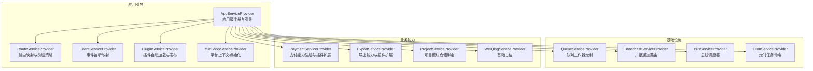
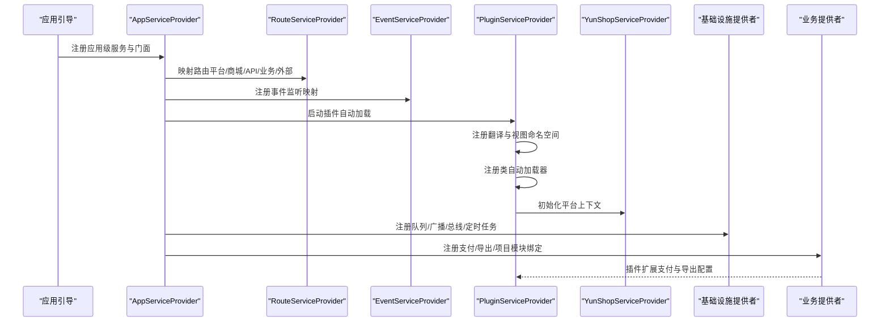
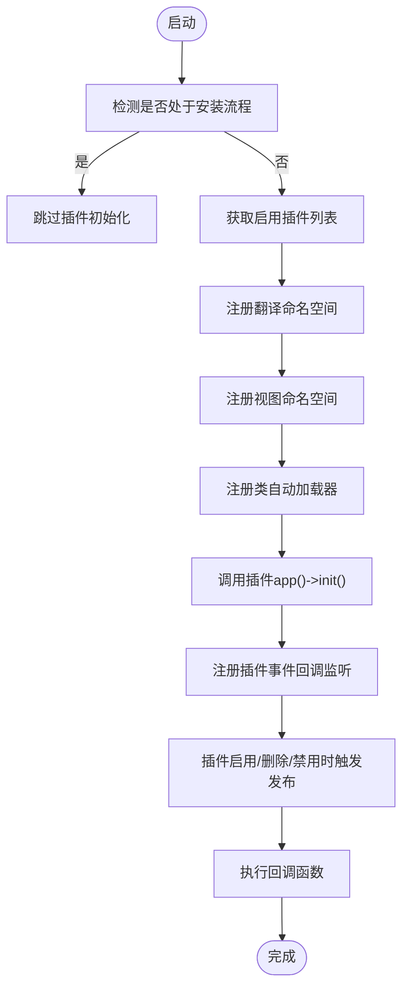
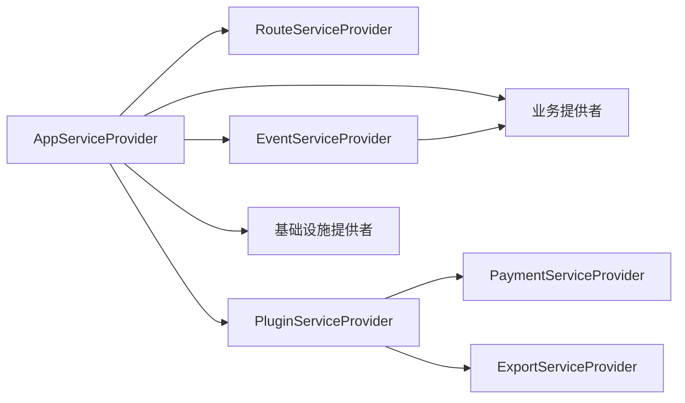

# 服务提供者体系

<cite>
**本文引用的文件**
- [AppServiceProvider.php](file://app/common/providers/AppServiceProvider.php)
- [RouteServiceProvider.php](file://app/common/providers/RouteServiceProvider.php)
- [EventServiceProvider.php](file://app/common/providers/EventServiceProvider.php)
- [PluginServiceProvider.php](file://app/common/providers/PluginServiceProvider.php)
- [YunShopServiceProvider.php](file://app/common/providers/YunShopServiceProvider.php)
- [PaymentServiceProvider.php](file://app/common/providers/PaymentServiceProvider.php)
- [ExportServiceProvider.php](file://app/common/providers/ExportServiceProvider.php)
- [QueueServiceProvider.php](file://app/common/providers/QueueServiceProvider.php)
- [BroadcastServiceProvider.php](file://app/common/providers/BroadcastServiceProvider.php)
- [BusServiceProvider.php](file://app/common/providers/BusServiceProvider.php)
- [CronServiceProvider.php](file://app/common/providers/CronServiceProvider.php)
- [WeiQingServiceProvider.php](file://app/common/providers/WeiQingServiceProvider.php)
- [ProjectServiceProvider.php](file://app/common/providers/ProjectServiceProvider.php)
</cite>

## 目录
1. [引言](#引言)
2. [项目结构](#项目结构)
3. [核心组件](#核心组件)
4. [架构总览](#架构总览)
5. [详细组件分析](#详细组件分析)
6. [依赖关系分析](#依赖关系分析)
7. [性能考量](#性能考量)
8. [故障排查指南](#故障排查指南)
9. [结论](#结论)
10. [附录：扩展指南](#附录扩展指南)

## 引言
本文件系统化梳理芸众商城的服务提供者体系，围绕14个核心ServiceProvider的设计理念与职责分工展开，重点阐释以下方面：
- ShopProvider（以YunShopServiceProvider为代表）如何在平台框架中管理核心业务组件（模型、服务、仓储等）的注册与绑定。
- PluginServiceProvider 的插件自动加载机制与生命周期管理。
- EventServiceProvider 如何集中管理事件监听器映射。
- 每个ServiceProvider的具体实现细节、配置选项与使用示例。
- 面向开发者的扩展指南，帮助快速创建自定义ServiceProvider。

## 项目结构
芸众商城采用基于Laravel的模块化架构，ServiceProvider作为应用启动与模块装配的核心入口，分布在 app/common/providers 目录下，并通过框架引导流程进行注册与装配。整体结构遵循“按功能域分层”的组织方式，便于扩展与维护。

图表来源
- [AppServiceProvider.php:1-146](file://app/common/providers/AppServiceProvider.php#L1-L146)
- [RouteServiceProvider.php:1-149](file://app/common/providers/RouteServiceProvider.php#L1-L149)
- [EventServiceProvider.php:1-204](file://app/common/providers/EventServiceProvider.php#L1-L204)
- [PluginServiceProvider.php:1-125](file://app/common/providers/PluginServiceProvider.php#L1-L125)
- [YunShopServiceProvider.php:1-77](file://app/common/providers/YunShopServiceProvider.php#L1-L77)
- [QueueServiceProvider.php:1-32](file://app/common/providers/QueueServiceProvider.php#L1-L32)
- [BroadcastServiceProvider.php:1-22](file://app/common/providers/BroadcastServiceProvider.php#L1-L22)
- [BusServiceProvider.php:1-29](file://app/common/providers/BusServiceProvider.php#L1-L29)
- [CronServiceProvider.php:1-47](file://app/common/providers/CronServiceProvider.php#L1-L47)
- [PaymentServiceProvider.php:1-62](file://app/common/providers/PaymentServiceProvider.php#L1-L62)
- [ExportServiceProvider.php:1-43](file://app/common/providers/ExportServiceProvider.php#L1-L43)
- [ProjectServiceProvider.php:1-82](file://app/common/providers/ProjectServiceProvider.php#L1-L82)
- [WeiQingServiceProvider.php:1-19](file://app/common/providers/WeiQingServiceProvider.php#L1-L19)

章节来源
- [AppServiceProvider.php:1-146](file://app/common/providers/AppServiceProvider.php#L1-L146)
- [RouteServiceProvider.php:1-149](file://app/common/providers/RouteServiceProvider.php#L1-L149)

## 核心组件
本节对14个核心ServiceProvider进行职责与设计要点的概览式说明，后续章节将逐个深入分析。

- 应用引导层
  - AppServiceProvider：安装校验、数据库PDO模式设置、Blade指令扩展、站点配置与日志门面注册、验证码门面绑定。
  - RouteServiceProvider：根据框架类型映射多套路由（平台、商城、对外API、业务、外部），并支持平台前置API。
  - EventServiceProvider：集中声明事件到监听器的映射与订阅列表，覆盖会员关系、订单、支付、状态流转、优惠券等。
  - PluginServiceProvider：插件自动加载、视图命名空间注册、翻译命名空间注册、类自动加载器注册、插件发布与回调。
  - YunShopServiceProvider：平台上下文初始化，设置全局uniacid、账户信息、远程资源地址、富文本与设置组件的唯一账号标识。

- 基础设施层
  - QueueServiceProvider：重写队列工作器，注入异常处理与维护模式判断。
  - BroadcastServiceProvider：广播路由与频道定义文件加载。
  - BusServiceProvider：自定义总线调度器，支持队列连接。
  - CronServiceProvider：注册定时任务服务、命令别名与CLI命令。

- 业务能力层
  - PaymentServiceProvider：支付门面绑定、支付管理器单例、内置支付网关注册、插件支付配置扩展。
  - ExportServiceProvider：导出门面单例、插件导出配置扩展。
  - ProjectServiceProvider：项目模块仓储接口与实现的绑定、通知服务注册。
  - WeiQingServiceProvider：基础占位，保留扩展点。

章节来源
- [AppServiceProvider.php:24-146](file://app/common/providers/AppServiceProvider.php#L24-L146)
- [RouteServiceProvider.php:36-149](file://app/common/providers/RouteServiceProvider.php#L36-L149)
- [EventServiceProvider.php:47-204](file://app/common/providers/EventServiceProvider.php#L47-L204)
- [PluginServiceProvider.php:18-125](file://app/common/providers/PluginServiceProvider.php#L18-L125)
- [YunShopServiceProvider.php:21-77](file://app/common/providers/YunShopServiceProvider.php#L21-L77)
- [QueueServiceProvider.php:10-32](file://app/common/providers/QueueServiceProvider.php#L10-L32)
- [BroadcastServiceProvider.php:8-22](file://app/common/providers/BroadcastServiceProvider.php#L8-L22)
- [BusServiceProvider.php:7-29](file://app/common/providers/BusServiceProvider.php#L7-L29)
- [CronServiceProvider.php:13-47](file://app/common/providers/CronServiceProvider.php#L13-L47)
- [PaymentServiceProvider.php:26-62](file://app/common/providers/PaymentServiceProvider.php#L26-L62)
- [ExportServiceProvider.php:15-43](file://app/common/providers/ExportServiceProvider.php#L15-L43)
- [ProjectServiceProvider.php:39-82](file://app/common/providers/ProjectServiceProvider.php#L39-L82)
- [WeiQingServiceProvider.php:16-19](file://app/common/providers/WeiQingServiceProvider.php#L16-L19)

## 架构总览
下图展示服务提供者在应用启动中的交互关系与控制流，体现从引导到装配再到业务扩展的关键节点。

图表来源
- [AppServiceProvider.php:31-130](file://app/common/providers/AppServiceProvider.php#L31-L130)
- [RouteServiceProvider.php:36-149](file://app/common/providers/RouteServiceProvider.php#L36-L149)
- [EventServiceProvider.php:192-202](file://app/common/providers/EventServiceProvider.php#L192-L202)
- [PluginServiceProvider.php:26-57](file://app/common/providers/PluginServiceProvider.php#L26-L57)
- [YunShopServiceProvider.php:24-53](file://app/common/providers/YunShopServiceProvider.php#L24-L53)
- [PaymentServiceProvider.php:30-53](file://app/common/providers/PaymentServiceProvider.php#L30-L53)
- [ExportServiceProvider.php:17-34](file://app/common/providers/ExportServiceProvider.php#L17-L34)

## 详细组件分析

### AppServiceProvider 分析
- 设计理念
  - 将应用级通用能力（站点配置、日志、验证码、Blade扩展、安装校验）集中在该提供者中，确保应用启动时一次性装配。
  - 通过PDO StatementPrepared事件统一查询返回模式，提升数据访问一致性。
- 关键职责
  - 安装校验：在平台框架下检查安装锁文件，避免未安装环境被直接访问。
  - 数据库优化：设置PDO fetch模式为关联数组，减少类型转换开销。
  - 模板扩展：为视图系统增加tpl扩展名支持，兼容历史模板。
  - 门面与仓库：注册站点设置、系统设置、选项仓库、跟踪日志等单例与绑定。
  - Blade指令：提供过滤器指令，便于模板内容钩子扩展与调试。
- 使用示例
  - 在控制器或服务中通过容器解析站点设置与选项仓库，实现配置读取与缓存。
  - 在模板中使用自定义Blade指令进行内容过滤与输出。
- 复杂度与性能
  - 注册阶段仅执行一次，无显著运行时开销；PDO设置与Blade指令注册成本极低。

章节来源
- [AppServiceProvider.php:31-130](file://app/common/providers/AppServiceProvider.php#L31-L130)
- [AppServiceProvider.php:132-142](file://app/common/providers/AppServiceProvider.php#L132-L142)

### RouteServiceProvider 分析
- 设计理念
  - 根据框架类型动态映射不同路由集合，支持平台后台、商城前台、对外API、业务通道与外部接口。
  - 通过命名空间与中间件组隔离路由作用域，降低耦合。
- 关键职责
  - 路由映射：平台框架下映射web、平台、商城、API、业务、外部路由；非平台框架仅映射web。
  - 前缀策略：平台路由带/admin前缀，API路由带/api前缀，便于统一管理。
  - 命名空间：控制器命名空间统一为app，业务与外部模块独立命名空间。
- 使用示例
  - 在后台管理页面访问/admin路径，路由自动定位至平台路由文件。
  - 在对外API场景访问/api路径，路由自动定位至API路由文件。
- 复杂度与性能
  - 路由映射为静态注册，启动时完成，运行时无额外开销。

章节来源
- [RouteServiceProvider.php:36-149](file://app/common/providers/RouteServiceProvider.php#L36-L149)

### EventServiceProvider 分析
- 设计理念
  - 将事件与监听器的关系集中声明，形成清晰的事件驱动架构，便于追踪与扩展。
  - 支持listen与subscribe两种映射方式，满足细粒度与聚合监听的不同需求。
- 关键职责
  - 事件映射：覆盖订单、会员关系、支付、状态流转、优惠券、消息等多个领域。
  - 订阅监听：统一管理提现、余额、积分、订单、商品等业务监听器。
  - 安装期保护：在安装流程中跳过事件注册，避免未初始化导致的异常。
- 使用示例
  - 触发订单创建事件后，监听器自动清理购物车、生成证书、更新会员关系等。
  - 状态变更事件通过容器类进行处理，保证逻辑解耦。
- 复杂度与性能
  - 事件映射为静态配置，运行时仅触发监听器，性能开销取决于具体监听器实现。

章节来源
- [EventServiceProvider.php:54-185](file://app/common/providers/EventServiceProvider.php#L54-L185)
- [EventServiceProvider.php:192-202](file://app/common/providers/EventServiceProvider.php#L192-L202)

### PluginServiceProvider 分析
- 设计理念
  - 插件即模块，通过自动加载器与命名空间注册实现“即插即用”，并提供生命周期回调与发布机制。
- 关键职责
  - 插件发现：从插件管理器获取启用插件列表。
  - 命名空间注册：为翻译与视图注册命名空间，支持插件本地化与模板渲染。
  - 类自动加载：基于命名空间与路径规则动态加载插件类文件。
  - 生命周期：监听插件启用/删除/禁用事件，触发发布与回调函数执行。
- 使用示例
  - 在插件根目录提供callbacks.php，定义事件到回调函数的映射，在事件发生时自动调用。
  - 通过artisan命令触发vendor:publish，将插件资源发布到主应用。
- 复杂度与性能
  - 自动加载器为全局注册，存在字符串匹配与文件存在性检查；建议插件数量较多时优化命名空间与路径。

图表来源
- [PluginServiceProvider.php:26-76](file://app/common/providers/PluginServiceProvider.php#L26-L76)
- [PluginServiceProvider.php:94-118](file://app/common/providers/PluginServiceProvider.php#L94-L118)

章节来源
- [PluginServiceProvider.php:18-125](file://app/common/providers/PluginServiceProvider.php#L18-L125)

### YunShopServiceProvider 分析
- 设计理念
  - 在平台框架下为全局上下文注入uniacid、账户信息与资源地址，确保富文本、设置等组件在多账号场景下的正确性。
- 关键职责
  - 上下文初始化：从请求或Cookie中解析uniacid，设置全局$_W数组。
  - 远程资源：根据系统设置选择本地或云存储URL，统一附件访问地址。
  - 组件绑定：为Setting与RichText组件设置唯一账号标识，保障多租户隔离。
- 使用示例
  - 在后台或微信API场景下，通过全局变量与组件绑定实现多账号资源访问。
- 复杂度与性能
  - 初始化逻辑简单，仅在平台框架且特定请求类型下执行，开销可忽略。

章节来源
- [YunShopServiceProvider.php:24-73](file://app/common/providers/YunShopServiceProvider.php#L24-L73)

### 其他基础设施与业务提供者
- QueueServiceProvider
  - 重写队列工作器，注入异常处理与维护模式判断，增强队列执行的健壮性。
- BroadcastServiceProvider
  - 加载广播路由与频道定义，简化实时通信接入。
- BusServiceProvider
  - 提供自定义调度器，支持队列连接，便于任务编排。
- CronServiceProvider
  - 注册定时任务服务与CLI命令，提供run/list/keygen等操作。
- PaymentServiceProvider
  - 绑定支付门面与管理器，注册内置支付网关，并允许插件扩展支付配置。
- ExportServiceProvider
  - 单例化导出服务，并允许插件扩展导出配置。
- ProjectServiceProvider
  - 绑定项目模块的多个仓储接口与实现，注册通知服务。
- WeiQingServiceProvider
  - 基础占位提供者，保留扩展点。

章节来源
- [QueueServiceProvider.php:18-31](file://app/common/providers/QueueServiceProvider.php#L18-L31)
- [BroadcastServiceProvider.php:15-20](file://app/common/providers/BroadcastServiceProvider.php#L15-L20)
- [BusServiceProvider.php:14-28](file://app/common/providers/BusServiceProvider.php#L14-L28)
- [CronServiceProvider.php:20-45](file://app/common/providers/CronServiceProvider.php#L20-L45)
- [PaymentServiceProvider.php:30-60](file://app/common/providers/PaymentServiceProvider.php#L30-L60)
- [ExportServiceProvider.php:17-41](file://app/common/providers/ExportServiceProvider.php#L17-L41)
- [ProjectServiceProvider.php:43-80](file://app/common/providers/ProjectServiceProvider.php#L43-L80)
- [WeiQingServiceProvider.php:16-19](file://app/common/providers/WeiQingServiceProvider.php#L16-L19)

## 依赖关系分析
- 组件耦合
  - AppServiceProvider 作为中枢，向上游提供应用级门面与仓库，向下游协调路由、事件、插件与基础设施。
  - PluginServiceProvider 与 PaymentServiceProvider/ExportServiceProvider 存在运行时协作：插件可通过回调扩展支付与导出配置。
  - EventServiceProvider 与各业务模块（会员、订单、财务等）通过监听器建立松耦合联系。
- 外部依赖
  - Laravel框架提供的容器、事件系统、队列、广播、定时任务等。
  - 第三方包如定时任务库、图像处理库、EasyWeChat等（在其他位置引入）。

图表来源
- [AppServiceProvider.php:31-130](file://app/common/providers/AppServiceProvider.php#L31-L130)
- [PluginServiceProvider.php:26-57](file://app/common/providers/PluginServiceProvider.php#L26-L57)
- [PaymentServiceProvider.php:30-53](file://app/common/providers/PaymentServiceProvider.php#L30-L53)
- [ExportServiceProvider.php:17-34](file://app/common/providers/ExportServiceProvider.php#L17-L34)

## 性能考量
- 启动阶段优化
  - 将昂贵操作（如插件扫描、视图与语言包注册）限制在非安装流程，避免重复执行。
  - 使用单例与延迟提供者（如支付与导出）减少容器压力。
- 运行时优化
  - 事件监听器应避免阻塞操作，必要时异步化或拆分为多个监听器。
  - 插件自动加载器应尽量减少文件系统IO，合理组织命名空间与路径。
- 数据访问
  - 统一PDO fetch模式可减少类型转换成本，提升数据读取效率。

## 故障排查指南
- 安装流程异常
  - 若未安装但访问受保护路径，AppServiceProvider会直接响应并终止，检查安装锁文件是否存在以及请求路径是否命中安装流程。
- 路由无法访问
  - 确认框架类型与路由前缀（平台/admin、API/api），检查对应路由文件是否正确加载。
- 事件未生效
  - 检查EventServiceProvider是否在安装流程外执行，确认事件与监听器映射是否正确。
- 插件未加载
  - 检查PluginServiceProvider是否跳过安装流程，确认插件命名空间与路径是否正确，自动加载器是否注册。
- 队列执行失败
  - 检查QueueServiceProvider的工作器实例与异常处理配置，确认维护模式状态。

章节来源
- [AppServiceProvider.php:132-142](file://app/common/providers/AppServiceProvider.php#L132-L142)
- [RouteServiceProvider.php:36-49](file://app/common/providers/RouteServiceProvider.php#L36-L49)
- [EventServiceProvider.php:192-202](file://app/common/providers/EventServiceProvider.php#L192-L202)
- [PluginServiceProvider.php:26-57](file://app/common/providers/PluginServiceProvider.php#L26-L57)
- [QueueServiceProvider.php:18-31](file://app/common/providers/QueueServiceProvider.php#L18-L31)

## 结论
芸众商城的服务提供者体系以AppServiceProvider为核心枢纽，结合Route、Event、Plugin等提供者，构建了可扩展、可维护的模块化架构。通过明确的职责划分与生命周期管理，系统在启动阶段完成关键能力装配，在运行阶段通过事件与插件机制实现灵活扩展。建议在新增模块时遵循现有模式，优先考虑延迟提供、命名空间与路径规范、以及事件驱动的解耦策略。

## 附录：扩展指南
- 创建自定义ServiceProvider
  - 继承 Illuminate\Support\ServiceProvider 或相应基类，实现 register 与 boot 方法。
  - 在 register 中绑定接口与实现、单例与门面；在 boot 中注册路由、事件、视图、语言包等。
  - 如需延迟加载，实现 DeferrableProvider 接口并返回 provides 列表。
- 插件扩展接入
  - 在插件根目录提供 callbacks.php，定义事件到回调函数的映射。
  - 在插件app()->init()中注册支付或导出配置，确保与主应用协同。
- 最佳实践
  - 将安装期保护逻辑加入 boot，避免未初始化导致的异常。
  - 使用单例与延迟提供者降低容器压力。
  - 事件监听器应保持单一职责，必要时拆分为多个监听器。
  - 插件命名空间与路径应清晰，避免冲突与重复扫描。