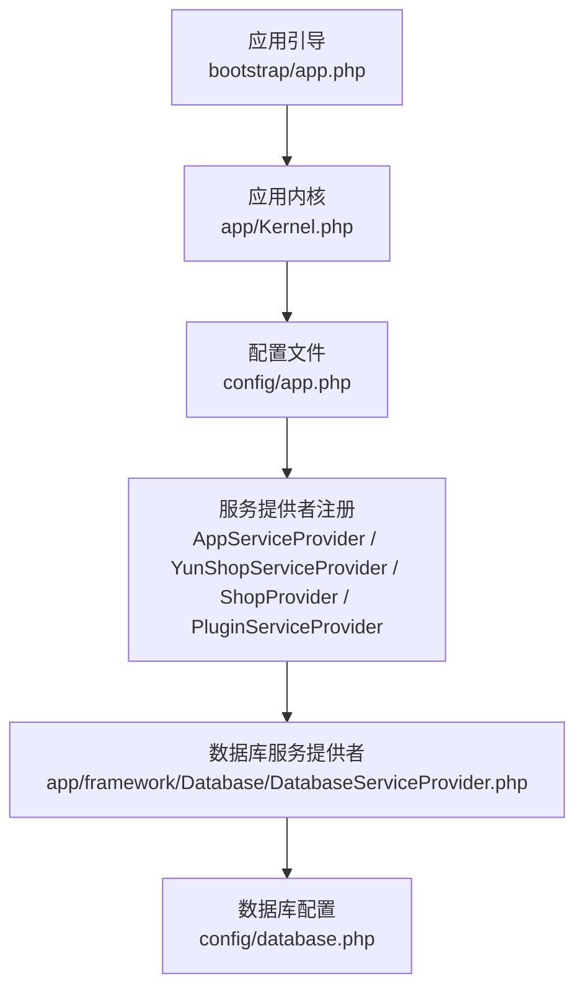
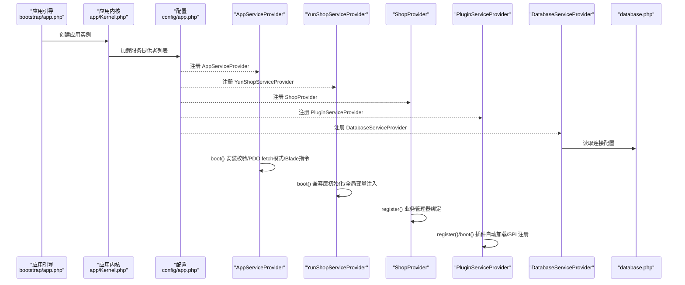
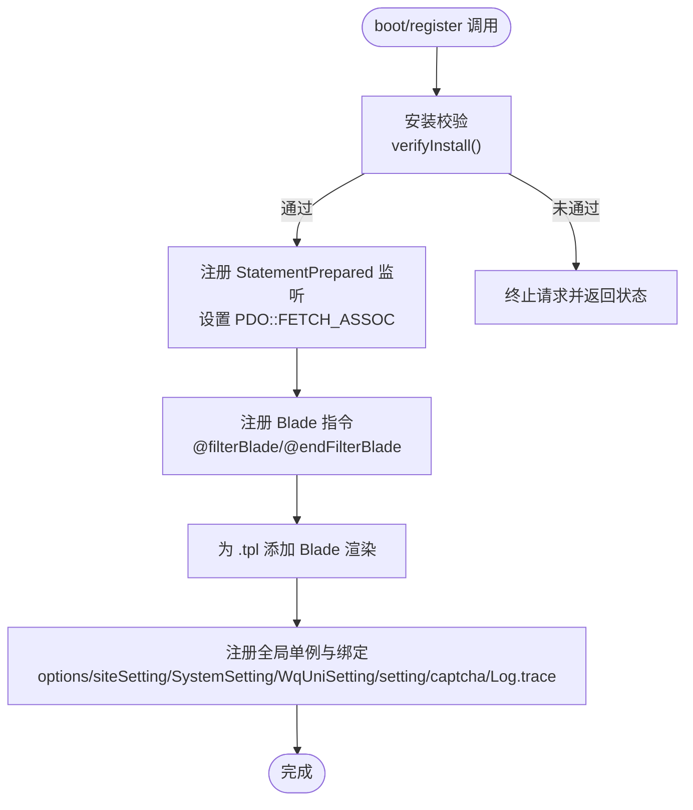
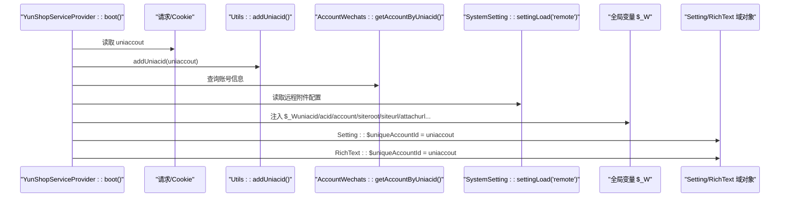
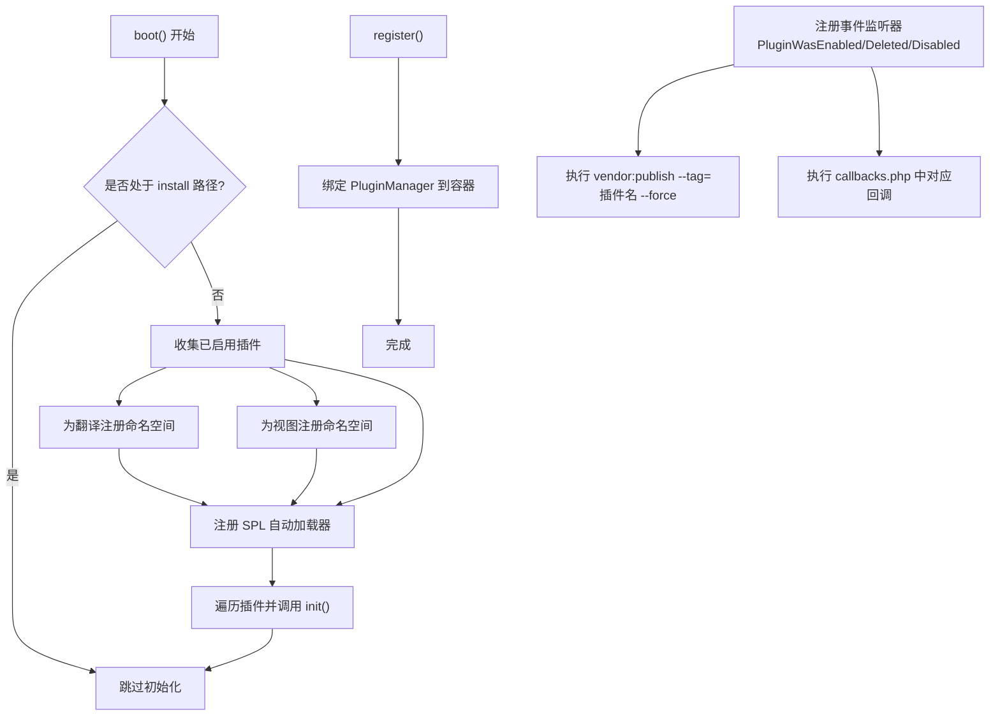
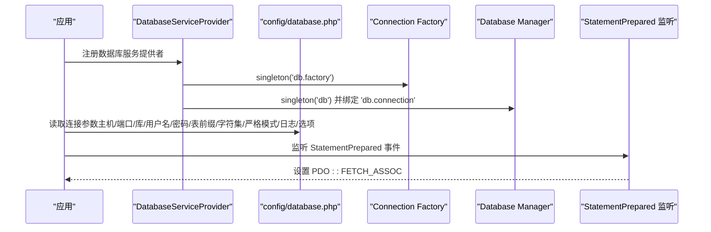
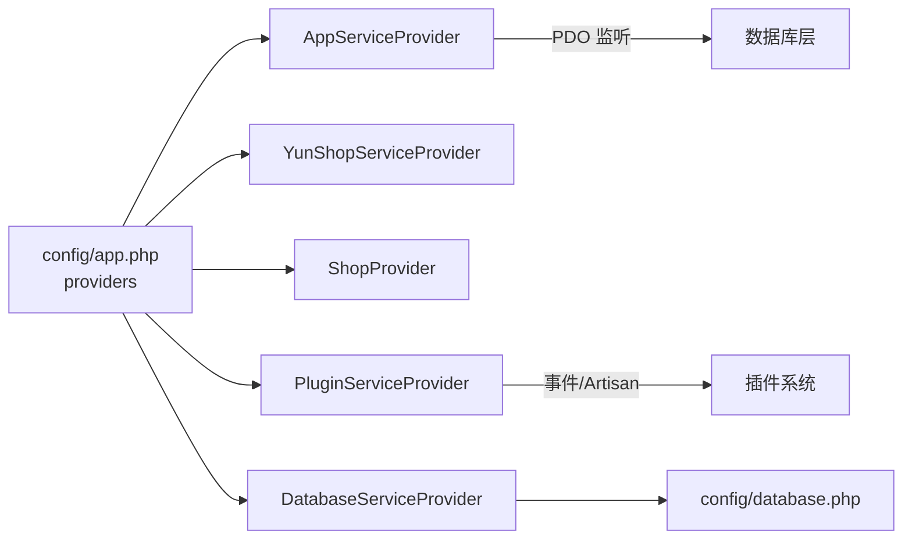

# 核心服务提供者

<cite>
**本文引用的文件**
- [AppServiceProvider.php](file://app/common/providers/AppServiceProvider.php)
- [YunShopServiceProvider.php](file://app/common/providers/YunShopServiceProvider.php)
- [ShopProvider.php](file://app/common/providers/ShopProvider.php)
- [PluginServiceProvider.php](file://app/common/providers/PluginServiceProvider.php)
- [DatabaseServiceProvider.php](file://app/framework/Database/DatabaseServiceProvider.php)
- [app.php（应用引导）](file://bootstrap/app.php)
- [app.php（配置）](file://config/app.php)
- [database.php（数据库配置）](file://config/database.php)
- [Kernel.php](file://app/Kernel.php)
</cite>

## 目录
1. [简介](#简介)
2. [项目结构](#项目结构)
3. [核心组件](#核心组件)
4. [架构总览](#架构总览)
5. [详细组件分析](#详细组件分析)
6. [依赖关系分析](#依赖关系分析)
7. [性能考量](#性能考量)
8. [故障排查指南](#故障排查指南)
9. [结论](#结论)

## 简介
本文件聚焦芸众商城的核心服务提供者，围绕以下目标展开：
- 深入解析 AppServiceProvider 的 PDO 设置与数据库连接配置
- 解释 YunShopServiceProvider 如何实现“微擎兼容层”与全局工具类注册
- 阐述 ShopProvider 作为核心业务管理器的职责：模型、服务、仓储的注册绑定机制
- 说明 PluginServiceProvider 的插件自动加载机制、SPL 注册与生命周期管理
- 提供每个核心服务提供者的具体实现代码示例与配置选项路径

## 项目结构
核心服务提供者位于应用的公共提供者目录，并在应用配置中集中注册。数据库连接由框架提供的 DatabaseServiceProvider 负责，结合自定义配置完成连接工厂与管理器的绑定。

图表来源
- [app.php（应用引导）:1-63](file://bootstrap/app.php#L1-L63)
- [app.php（配置）:140-206](file://config/app.php#L140-L206)
- [DatabaseServiceProvider.php:10-42](file://app/framework/Database/DatabaseServiceProvider.php#L10-L42)
- [database.php（数据库配置）:137-304](file://config/database.php#L137-L304)

章节来源
- [app.php（应用引导）:1-63](file://bootstrap/app.php#L1-L63)
- [app.php（配置）:140-206](file://config/app.php#L140-L206)

## 核心组件
- AppServiceProvider：负责安装校验、PDO 结果集模式、Blade 指令扩展、视图扩展、以及若干全局单例与绑定（如 setting、captcha、日志等）
- YunShopServiceProvider：实现“微擎兼容层”，注入全局变量、设置账户信息与附件地址、并同步设置域对象
- ShopProvider：核心业务管理器，注册大量业务级单例与容器绑定（如订单、商品、物流、支付、会员中心等）
- PluginServiceProvider：插件自动加载、SPL 自动加载器注册、事件驱动的发布与回调执行
- DatabaseServiceProvider：重写数据库服务提供者，注册连接工厂与数据库管理器，确保模型与连接按需创建

章节来源
- [AppServiceProvider.php:24-146](file://app/common/providers/AppServiceProvider.php#L24-L146)
- [YunShopServiceProvider.php:21-77](file://app/common/providers/YunShopServiceProvider.php#L21-L77)
- [ShopProvider.php:35-127](file://app/common/providers/ShopProvider.php#L35-L127)
- [PluginServiceProvider.php:18-125](file://app/common/providers/PluginServiceProvider.php#L18-L125)
- [DatabaseServiceProvider.php:10-42](file://app/framework/Database/DatabaseServiceProvider.php#L10-L42)

## 架构总览
下图展示核心服务提供者与数据库层的交互关系，以及应用启动时的关键调用链。

图表来源
- [app.php（应用引导）:14-48](file://bootstrap/app.php#L14-L48)
- [app.php（配置）:140-206](file://config/app.php#L140-L206)
- [AppServiceProvider.php:31-75](file://app/common/providers/AppServiceProvider.php#L31-L75)
- [YunShopServiceProvider.php:24-53](file://app/common/providers/YunShopServiceProvider.php#L24-L53)
- [ShopProvider.php:37-122](file://app/common/providers/ShopProvider.php#L37-L122)
- [PluginServiceProvider.php:26-57](file://app/common/providers/PluginServiceProvider.php#L26-L57)
- [DatabaseServiceProvider.php:17-42](file://app/framework/Database/DatabaseServiceProvider.php#L17-L42)
- [database.php（数据库配置）:137-304](file://config/database.php#L137-L304)

## 详细组件分析

### AppServiceProvider 分析
- 安装校验：在 boot 阶段检查平台框架与安装锁状态，必要时中断请求并返回状态码
- PDO 结果集模式：通过监听 StatementPrepared 事件，统一将查询结果集模式设为关联数组，提升数据处理一致性
- Blade 扩展：新增模板过滤指令，便于在 Blade 中进行内容过滤与调试
- 视图扩展：为 .tpl 后缀添加 Blade 渲染支持
- 全局绑定与单例：
  - 配置项仓库与站点设置相关单例
  - setting 门面绑定到 Setting 实例
  - captcha 绑定到 Captcha 类
  - 日志门面绑定 TraceLog 实例
- 注册阶段：根据环境可选择性注册额外服务（注释掉的 SQL 监听与 IDE 辅助）

图表来源
- [AppServiceProvider.php:31-75](file://app/common/providers/AppServiceProvider.php#L31-L75)
- [AppServiceProvider.php:82-130](file://app/common/providers/AppServiceProvider.php#L82-L130)

章节来源
- [AppServiceProvider.php:24-146](file://app/common/providers/AppServiceProvider.php#L24-L146)

### YunShopServiceProvider 分析（微擎兼容层）
- 兼容层启用条件：仅在非平台框架或处于 Web/微信 API 场景时生效；否则直接同步当前 uniaccout 到 Setting 与 RichText 域对象
- 全局变量注入：从请求或 Cookie 获取 uniaccout，注入全局 $_W，包含账号、站点根路径、附件地址等
- 远程附件配置：根据系统设置 remote 类型动态决定附件 URL
- Setting 与 RichText 域对象同步：将当前 uniaccout 写入 Setting::$uniqueAccountId 与 RichText::$uniqueAccountId

图表来源
- [YunShopServiceProvider.php:24-53](file://app/common/providers/YunShopServiceProvider.php#L24-L53)
- [YunShopServiceProvider.php:55-73](file://app/common/providers/YunShopServiceProvider.php#L55-L73)

章节来源
- [YunShopServiceProvider.php:21-77](file://app/common/providers/YunShopServiceProvider.php#L21-L77)

### ShopProvider 分析（核心业务管理器）
- 单例注册与绑定：
  - SettingCache、ModelExpansionManager、CoinManager、DeductionManager、GoodsManager、OrderManager
  - GoodsWidgetContainer、CartContainer、StatusContainer
  - express（快递鸟）、logistics（物流）、sms（短信）、GoodsDetail、MemberCenter、BusinessMsgNotice、ShopAsset、WithdrawButton
- 依赖来源：
  - Setting、SiteSetting、Supervisor（基于站点设置）
  - 多个前端模块的管理器与容器（如商品、订单、支付、会员中心等）
- 作用：为商城核心业务提供统一的业务级管理器与服务容器，屏蔽上层对底层实现细节的感知

```mermaid
classDiagram
class ShopProvider {
+register()
+boot()
}
class SettingCache
class ModelExpansionManager
class CoinManager
class DeductionManager
class GoodsManager
class OrderManager
class GoodsWidgetContainer
class CartContainer
class StatusContainer
class Express
class Logistics
class SmsService
class GoodsDetailManager
class MemberCenterManage
class BusinessNoticeManager
class ShopAsset
class WithdrawButtonManager
ShopProvider --> SettingCache : "singleton"
ShopProvider --> ModelExpansionManager : "singleton"
ShopProvider --> CoinManager : "singleton"
ShopProvider --> DeductionManager : "singleton"
ShopProvider --> GoodsManager : "singleton"
ShopProvider --> OrderManager : "singleton"
ShopProvider --> GoodsWidgetContainer : "singleton"
ShopProvider --> CartContainer : "singleton"
ShopProvider --> StatusContainer : "singleton"
ShopProvider --> Express : "singleton"
ShopProvider --> Logistics : "singleton"
ShopProvider --> SmsService : "singleton"
ShopProvider --> GoodsDetailManager : "singleton"
ShopProvider --> MemberCenterManage : "singleton"
ShopProvider --> BusinessNoticeManager : "singleton"
ShopProvider --> ShopAsset : "singleton"
ShopProvider --> WithdrawButtonManager : "singleton"
```

图表来源
- [ShopProvider.php:37-122](file://app/common/providers/ShopProvider.php#L37-L122)

章节来源
- [ShopProvider.php:35-127](file://app/common/providers/ShopProvider.php#L35-L127)

### PluginServiceProvider 分析（插件自动加载与生命周期）
- 启动阶段（boot）：
  - 忽略安装流程
  - 注册插件事件监听器：启用/删除/禁用插件时触发 vendor:publish 与回调函数执行
  - 收集已启用插件，为翻译与视图注册命名空间
  - 注册类自动加载器（SPL），按命名空间映射到插件 src 目录
  - 调用每个插件的 app()->init() 初始化
- 注册阶段（register）：
  - 将 PluginManager 绑定到容器，作为插件管理入口
- SPL 自动加载：
  - 仅处理以特定前缀开头的类名
  - 在已注册的插件路径中解析真实文件路径并包含
- 生命周期：
  - 通过事件驱动的发布与回调，保证插件状态变更后的资源同步与初始化

图表来源
- [PluginServiceProvider.php:26-57](file://app/common/providers/PluginServiceProvider.php#L26-L57)
- [PluginServiceProvider.php:84-87](file://app/common/providers/PluginServiceProvider.php#L84-L87)
- [PluginServiceProvider.php:94-118](file://app/common/providers/PluginServiceProvider.php#L94-L118)

章节来源
- [PluginServiceProvider.php:18-125](file://app/common/providers/PluginServiceProvider.php#L18-L125)

### 数据库连接与 PDO 设置（AppServiceProvider + DatabaseServiceProvider + database.php）
- PDO 结果集模式：AppServiceProvider 监听 StatementPrepared 事件，统一设置为关联数组，避免混合模式带来的解析问题
- 连接工厂与管理器：DatabaseServiceProvider 重写注册逻辑，向容器注册 db.factory 与 db 管理器，并绑定 db.connection
- 连接配置来源：
  - 默认连接 mysql，支持主从分离（write/read）
  - kefu 连接用于客服相关数据源
  - mongodb 连接（可选）
  - Redis 连接（默认与缓存库）
- 关键配置项：
  - fetch：PDO 返回模式（默认关联数组）
  - strict：关闭严格模式
  - loggingQueries：开启查询日志记录
  - options：PDO::ATTR_EMULATE_PREPARES 可配置
  - 表前缀、字符集、排序规则等

图表来源
- [DatabaseServiceProvider.php:17-42](file://app/framework/Database/DatabaseServiceProvider.php#L17-L42)
- [database.php（数据库配置）:137-304](file://config/database.php#L137-L304)
- [AppServiceProvider.php:37-39](file://app/common/providers/AppServiceProvider.php#L37-L39)

章节来源
- [AppServiceProvider.php:31-39](file://app/common/providers/AppServiceProvider.php#L31-L39)
- [DatabaseServiceProvider.php:17-42](file://app/framework/Database/DatabaseServiceProvider.php#L17-L42)
- [database.php（数据库配置）:137-304](file://config/database.php#L137-L304)

## 依赖关系分析
- 服务提供者注册顺序：由 config/app.php 的 providers 数组控制，AppServiceProvider、YunShopServiceProvider、ShopProvider、PluginServiceProvider 依次注册
- 应用引导：bootstrap/app.php 创建应用实例并绑定内核、异常处理器等
- 数据库层：DatabaseServiceProvider 与 config/database.php 协作，提供连接工厂与管理器
- 插件系统：PluginServiceProvider 依赖事件系统与 Artisan 命令，实现插件生命周期管理

图表来源
- [app.php（配置）:140-206](file://config/app.php#L140-L206)
- [DatabaseServiceProvider.php:17-42](file://app/framework/Database/DatabaseServiceProvider.php#L17-L42)
- [database.php（数据库配置）:137-304](file://config/database.php#L137-L304)
- [PluginServiceProvider.php:59-76](file://app/common/providers/PluginServiceProvider.php#L59-L76)

章节来源
- [app.php（配置）:140-206](file://config/app.php#L140-L206)
- [app.php（应用引导）:14-48](file://bootstrap/app.php#L14-L48)

## 性能考量
- PDO 结果集模式统一：减少因不同查询返回模式导致的二次转换开销
- 连接工厂按需创建：DatabaseServiceProvider 通过工厂与管理器解耦，避免无谓的连接初始化
- 插件自动加载：SPL 注册仅匹配特定命名空间，降低类解析成本
- 查询日志：loggingQueries 开启有助于定位慢查询，但生产环境建议谨慎使用

## 故障排查指南
- 安装锁相关问题：若未正确生成安装锁且访问非安装路由，AppServiceProvider 会直接返回状态码并中断请求
- PDO 结果集异常：确认 StatementPrepared 监听是否生效，以及 fetch 配置是否符合预期
- 插件加载失败：检查 PluginServiceProvider 的 SPL 自动加载器是否注册成功，插件命名空间与路径映射是否正确
- 数据库连接异常：核对 config/database.php 中的连接参数与环境变量，确认主从配置与表前缀设置

章节来源
- [AppServiceProvider.php:132-142](file://app/common/providers/AppServiceProvider.php#L132-L142)
- [database.php（数据库配置）:193-196](file://config/database.php#L193-L196)
- [PluginServiceProvider.php:94-118](file://app/common/providers/PluginServiceProvider.php#L94-L118)

## 结论
本文系统梳理了芸众商城四大核心服务提供者及其与数据库层的协作关系。AppServiceProvider 通过 PDO 监听与 Blade 扩展保障运行稳定性；YunShopServiceProvider 提供微擎兼容层与全局上下文；ShopProvider 将业务能力以管理器形式集中注册；PluginServiceProvider 则以事件与 SPL 机制实现插件化扩展。配合 DatabaseServiceProvider 与 config/database.php 的连接配置，整体形成高内聚、低耦合的服务体系。