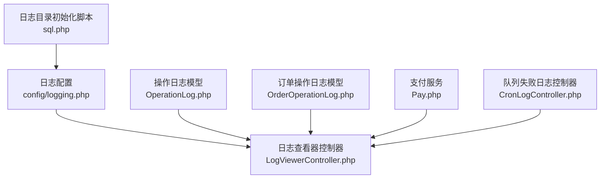
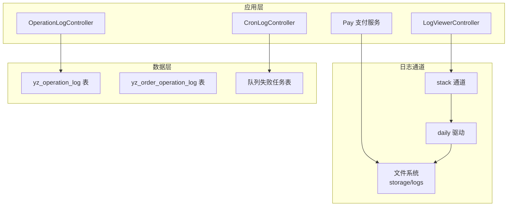
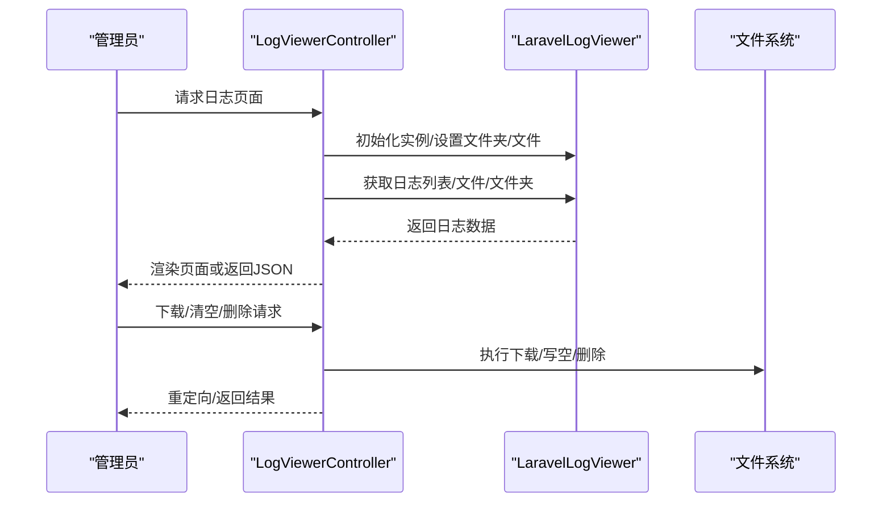
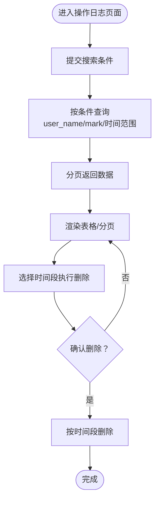
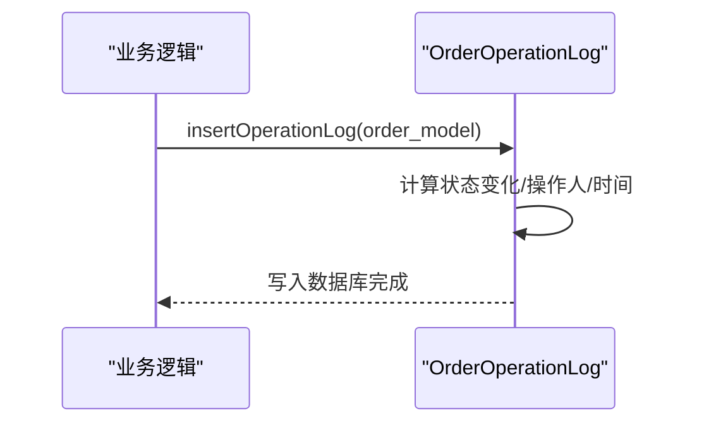
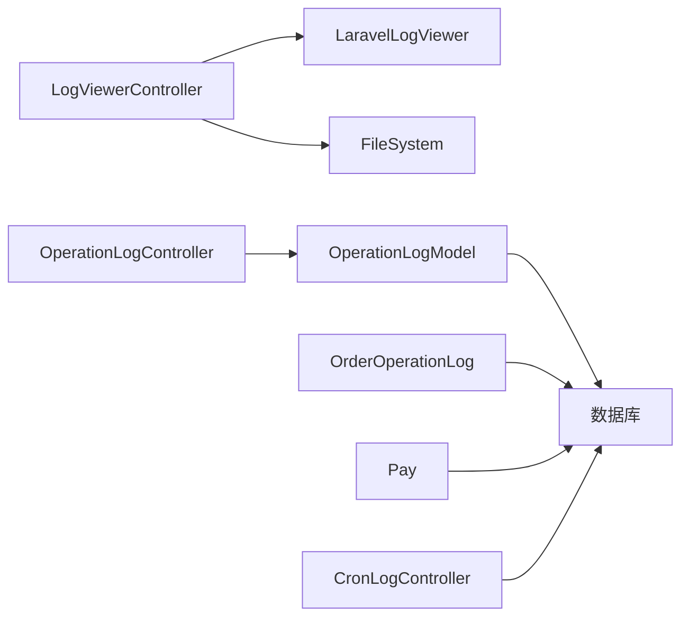

# 日志系统扩展

<cite>
**本文引用的文件**
- [config/logging.php](file://config/logging.php)
- [app/backend/modules/developer/controllers/LogViewerController.php](file://app/backend/modules/developer/controllers/LogViewerController.php)
- [app/common/models/OperationLog.php](file://app/common/models/OperationLog.php)
- [app/backend/modules/order/models/OrderOperationLog.php](file://app/backend/modules/order/models/OrderOperationLog.php)
- [app/common/services/Pay.php](file://app/common/services/Pay.php)
- [database/migrations/2017_03_14_222459_create_ims_yz_order_operation_log_table.php](file://database/migrations/2017_03_14_222459_create_ims_yz_order_operation_log_table.php)
- [sql.php](file://sql.php)
- [app/backend/modules/setting/controllers/CronLogController.php](file://app/backend/modules/setting/controllers/CronLogController.php)
- [app/backend/modules/setting/controllers/OperationLogController.php](file://app/backend/modules/setting/controllers/OperationLogController.php)
</cite>

## 目录
1. [简介](#简介)
2. [项目结构](#项目结构)
3. [核心组件](#核心组件)
4. [架构总览](#架构总览)
5. [详细组件分析](#详细组件分析)
6. [依赖分析](#依赖分析)
7. [性能考虑](#性能考虑)
8. [故障排查指南](#故障排查指南)
9. [结论](#结论)
10. [附录](#附录)

## 简介
本文件面向芸众商城的日志系统扩展，系统性梳理并说明其日志体系与使用方式。当前仓库中并未发现名为“BaseLog”的抽象基类或“ErrorLog”、“DebugLog”、“SlowApiLog”等具体日志类型的直接实现。因此，本文以现有可验证的代码为依据，重点阐述：
- 基于框架默认日志通道（daily）的文件日志组织与轮转策略
- 后台日志查看器（LaravelLogViewer）的集成与使用
- 运维侧的业务日志（操作日志、订单状态变更日志、支付访问日志等）
- 队列失败日志的查看与重试
- 日志目录初始化脚本与存储位置

由于“SlowApiLog”等特定日志类型在当前仓库中未发现实现，本文不对其设计进行推断，仅基于已存在文件给出可落地的实践建议。

## 项目结构
围绕日志功能的相关文件分布如下：
- 日志通道配置：config/logging.php
- 日志查看器：app/backend/modules/developer/controllers/LogViewerController.php
- 操作日志模型与控制器：app/common/models/OperationLog.php、app/backend/modules/setting/controllers/OperationLogController.php
- 订单状态变更日志：app/backend/modules/order/models/OrderOperationLog.php 及对应迁移
- 支付访问/支付日志：app/common/services/Pay.php
- 队列失败日志查看：app/backend/modules/setting/controllers/CronLogController.php
- 日志目录初始化：sql.php

图表来源
- [config/logging.php:1-87](file://config/logging.php#L1-L87)
- [app/backend/modules/developer/controllers/LogViewerController.php:1-145](file://app/backend/modules/developer/controllers/LogViewerController.php#L1-L145)
- [app/common/models/OperationLog.php:1-119](file://app/common/models/OperationLog.php#L1-L119)
- [app/backend/modules/order/models/OrderOperationLog.php:1-26](file://app/backend/modules/order/models/OrderOperationLog.php#L1-L26)
- [app/common/services/Pay.php:318-355](file://app/common/services/Pay.php#L318-L355)
- [app/backend/modules/setting/controllers/CronLogController.php:1-43](file://app/backend/modules/setting/controllers/CronLogController.php#L1-L43)
- [sql.php:1-47](file://sql.php#L1-L47)

章节来源
- [config/logging.php:1-87](file://config/logging.php#L1-L87)
- [app/backend/modules/developer/controllers/LogViewerController.php:1-145](file://app/backend/modules/developer/controllers/LogViewerController.php#L1-L145)
- [app/common/models/OperationLog.php:1-119](file://app/common/models/OperationLog.php#L1-L119)
- [app/backend/modules/order/models/OrderOperationLog.php:1-26](file://app/backend/modules/order/models/OrderOperationLog.php#L1-L26)
- [app/common/services/Pay.php:318-355](file://app/common/services/Pay.php#L318-L355)
- [app/backend/modules/setting/controllers/CronLogController.php:1-43](file://app/backend/modules/setting/controllers/CronLogController.php#L1-L43)
- [sql.php:1-47](file://sql.php#L1-L47)

## 核心组件
- 日志通道与轮转
  - 默认通道为 stack，内部委托 daily 驱动，日志路径位于 storage/logs/laravel.log，并按天切割保留 7 天。
- 日志查看器
  - 提供后台页面浏览、下载、清空、批量删除日志文件的能力，支持按文件夹/文件筛选。
- 操作日志
  - 数据库存储于 yz_operation_log 表，支持按用户、备注、时间范围检索与软删除。
- 订单状态变更日志
  - 记录订单状态变更前后值、操作人与时间，便于审计与回溯。
- 支付访问/支付日志
  - 记录支付请求来源、方法、IP、输入参数等，便于支付链路追踪。
- 队列失败日志
  - 展示失败任务列表，支持按任务 ID 或全部重试。

章节来源
- [config/logging.php:41-58](file://config/logging.php#L41-L58)
- [app/backend/modules/developer/controllers/LogViewerController.php:38-107](file://app/backend/modules/developer/controllers/LogViewerController.php#L38-L107)
- [app/common/models/OperationLog.php:14-45](file://app/common/models/OperationLog.php#L14-L45)
- [app/backend/modules/order/models/OrderOperationLog.php:13-24](file://app/backend/modules/order/models/OrderOperationLog.php#L13-L24)
- [app/common/services/Pay.php:323-355](file://app/common/services/Pay.php#L323-L355)
- [app/backend/modules/setting/controllers/CronLogController.php:13-40](file://app/backend/modules/setting/controllers/CronLogController.php#L13-L40)

## 架构总览
下图展示日志系统在系统中的交互关系与数据流向：

图表来源
- [config/logging.php:41-58](file://config/logging.php#L41-L58)
- [app/backend/modules/developer/controllers/LogViewerController.php:38-76](file://app/backend/modules/developer/controllers/LogViewerController.php#L38-L76)
- [app/backend/modules/setting/controllers/OperationLogController.php:18-40](file://app/backend/modules/setting/controllers/OperationLogController.php#L18-L40)
- [app/backend/modules/setting/controllers/CronLogController.php:13-24](file://app/backend/modules/setting/controllers/CronLogController.php#L13-L24)
- [app/common/services/Pay.php:323-355](file://app/common/services/Pay.php#L323-L355)
- [database/migrations/2017_03_14_222459_create_ims_yz_order_operation_log_table.php:14-27](file://database/migrations/2017_03_14_222459_create_ims_yz_order_operation_log_table.php#L14-L27)

## 详细组件分析

### 日志通道与轮转策略
- 通道配置
  - default 使用 stack，内部 channels 指向 daily。
  - daily 驱动将日志写入 storage/logs/laravel.log，并按天切割。
  - days 设置为 7，表示最多保留最近 7 天的日志文件。
- 存储位置
  - 文件路径由 storage_path('logs/laravel.log') 组合生成。
- 适用场景
  - 适用于常规业务日志、框架运行日志与错误日志的统一归档。

章节来源
- [config/logging.php:24](file://config/logging.php#L24)
- [config/logging.php:41-58](file://config/logging.php#L41-L58)

### 日志查看器（LogViewerController）
- 功能要点
  - 支持按文件夹/文件过滤、下载、清空、批量删除。
  - 自动检测日志是否为标准格式（带 level/context 字段）。
  - 返回 JSON 时输出结构化数据，渲染页面时输出视图。
- 使用建议
  - 在生产环境谨慎开启批量删除与清空，建议先下载备份。
  - 结合文件夹/文件筛选定位问题日志，避免全量扫描。

图表来源
- [app/backend/modules/developer/controllers/LogViewerController.php:38-107](file://app/backend/modules/developer/controllers/LogViewerController.php#L38-L107)

章节来源
- [app/backend/modules/developer/controllers/LogViewerController.php:15-76](file://app/backend/modules/developer/controllers/LogViewerController.php#L15-L76)

### 操作日志（OperationLog）
- 数据模型
  - 表名：yz_operation_log
  - 支持按 user_name、mark、created_at 范围检索。
  - 提供软删除能力，支持按时间段批量删除。
- 控制器
  - 支持 AJAX 分页获取列表，支持按条件搜索。
  - 提供按时间段删除操作日志的功能。

图表来源
- [app/common/models/OperationLog.php:27-51](file://app/common/models/OperationLog.php#L27-L51)
- [app/backend/modules/setting/controllers/OperationLogController.php:18-57](file://app/backend/modules/setting/controllers/OperationLogController.php#L18-L57)

章节来源
- [app/common/models/OperationLog.php:14-119](file://app/common/models/OperationLog.php#L14-L119)
- [app/backend/modules/setting/controllers/OperationLogController.php:16-57](file://app/backend/modules/setting/controllers/OperationLogController.php#L16-L57)

### 订单状态变更日志（OrderOperationLog）
- 数据模型
  - 记录订单状态变更前后的值、操作人与时间。
  - 对应迁移创建 yz_order_operation_log 表并添加中文注释。
- 使用场景
  - 审计订单流转过程，定位状态异常或重复操作。

图表来源
- [app/backend/modules/order/models/OrderOperationLog.php:13-24](file://app/backend/modules/order/models/OrderOperationLog.php#L13-L24)
- [database/migrations/2017_03_14_222459_create_ims_yz_order_operation_log_table.php:14-27](file://database/migrations/2017_03_14_222459_create_ims_yz_order_operation_log_table.php#L14-L27)

章节来源
- [app/backend/modules/order/models/OrderOperationLog.php:11-25](file://app/backend/modules/order/models/OrderOperationLog.php#L11-L25)
- [database/migrations/2017_03_14_222459_create_ims_yz_order_operation_log_table.php:6-43](file://database/migrations/2017_03_14_222459_create_ims_yz_order_operation_log_table.php#L6-L43)

### 支付访问/支付日志（Pay）
- 支付访问日志
  - 记录请求 URL、HTTP 方法、客户端 IP、原始输入参数等。
- 支付日志
  - 记录支付类型、第三方类型、金额、操作、会员 ID、IP 等。
- 使用建议
  - 仅在必要时开启访问日志记录，避免敏感信息泄露。
  - 对输入参数进行脱敏处理后再入库。

章节来源
- [app/common/services/Pay.php:323-355](file://app/common/services/Pay.php#L323-L355)

### 队列失败日志（CronLogController）
- 功能
  - 列出失败队列任务，支持按任务 ID 或全部重试。
- 使用建议
  - 定期巡检失败任务，及时重试或人工干预。
  - 结合业务监控告警，快速定位异常。

章节来源
- [app/backend/modules/setting/controllers/CronLogController.php:11-43](file://app/backend/modules/setting/controllers/CronLogController.php#L11-L43)

### 日志目录初始化（sql.php）
- 功能
  - 在安装/部署阶段创建日志所需的基础目录（如 error、debug 子目录）。
- 注意事项
  - 确保 Web/进程用户对 storage/logs 具备写权限。
  - 若采用平台模式与插件模式，路径会有所不同，需按实际环境调整。

章节来源
- [sql.php:1-24](file://sql.php#L1-L24)

## 依赖分析
- 组件耦合
  - LogViewerController 依赖 LaravelLogViewer 库与文件系统。
  - 操作日志与订单日志依赖数据库表结构。
  - 支付日志依赖框架请求输入流与数据库写入。
- 外部依赖
  - Monolog（通过 daily 驱动间接使用）。
  - LaravelLogViewer（后台日志查看器）。
- 潜在风险
  - 日志文件过多导致磁盘占用膨胀，需结合 days 与清理策略。
  - 访问日志记录敏感参数，需配合脱敏与最小化原则。

图表来源
- [app/backend/modules/developer/controllers/LogViewerController.php:12-32](file://app/backend/modules/developer/controllers/LogViewerController.php#L12-L32)
- [app/backend/modules/setting/controllers/OperationLogController.php:13-30](file://app/backend/modules/setting/controllers/OperationLogController.php#L13-L30)
- [app/backend/modules/order/models/OrderOperationLog.php:11-24](file://app/backend/modules/order/models/OrderOperationLog.php#L11-L24)
- [app/common/services/Pay.php:323-355](file://app/common/services/Pay.php#L323-L355)
- [app/backend/modules/setting/controllers/CronLogController.php:16-39](file://app/backend/modules/setting/controllers/CronLogController.php#L16-L39)

## 性能考虑
- 日志轮转
  - daily 驱动按天切割，days=7，建议结合磁盘容量规划与日志压缩策略。
- IO 压力
  - 高并发场景下，建议将高频日志输出到独立卷或异步写入。
- 查询性能
  - 操作日志与订单日志建议建立合适的索引（如 created_at、user_name、order_id），避免全表扫描。
- 访问日志
  - 输入参数过大时，注意截断与脱敏，避免日志体积膨胀。

## 故障排查指南
- 无法查看日志文件
  - 检查 storage/logs 是否存在且具备写权限。
  - 若使用插件模式，请确认路径指向 addons/yun_shop/storage/logs。
- 日志文件缺失
  - 确认 default 通道为 stack，daily 驱动正常启用。
  - 检查 days 配置是否过短导致文件被清理。
- 日志查看器显示非标准格式
  - 非框架标准日志格式不会显示 level/context，属于正常现象。
- 操作日志无法删除
  - 确认传入的时间范围参数合法，检查软删除是否生效。
- 队列失败任务堆积
  - 使用“全部重试”或按 ID 重试，关注失败原因并修复。

章节来源
- [config/logging.php:41-58](file://config/logging.php#L41-L58)
- [app/backend/modules/developer/controllers/LogViewerController.php:68-76](file://app/backend/modules/developer/controllers/LogViewerController.php#L68-L76)
- [app/backend/modules/setting/controllers/OperationLogController.php:42-57](file://app/backend/modules/setting/controllers/OperationLogController.php#L42-L57)
- [app/backend/modules/setting/controllers/CronLogController.php:26-40](file://app/backend/modules/setting/controllers/CronLogController.php#L26-L40)

## 结论
芸众商城当前的日志体系以框架默认的 daily 通道为基础，辅以后台日志查看器与多类业务日志（操作日志、订单状态变更日志、支付日志、队列失败日志）。该方案简单可靠，适合中小规模业务。若需引入“SlowApiLog”等更细粒度的日志类型，可在现有 daily 通道基础上增加自定义处理器或业务埋点，同时配套完善的数据模型与可视化界面。

## 附录
- 最佳实践清单
  - 明确日志级别与通道分离（业务日志 vs 错误日志）。
  - 对敏感字段进行脱敏与最小化采集。
  - 定期清理过期日志，保留合理周期。
  - 为关键表建立索引，提升日志查询效率。
  - 使用日志查看器进行集中化管理，避免直接 SSH 登录服务器。