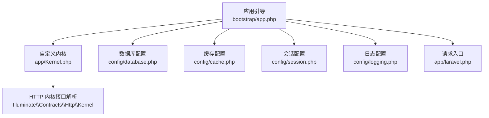
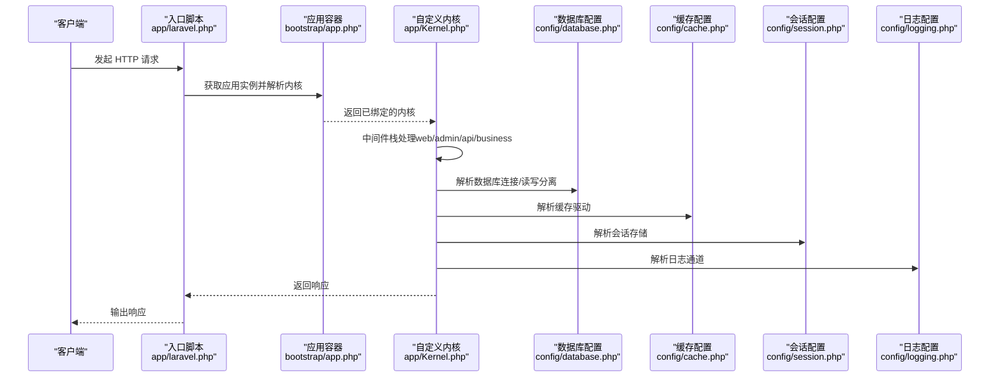
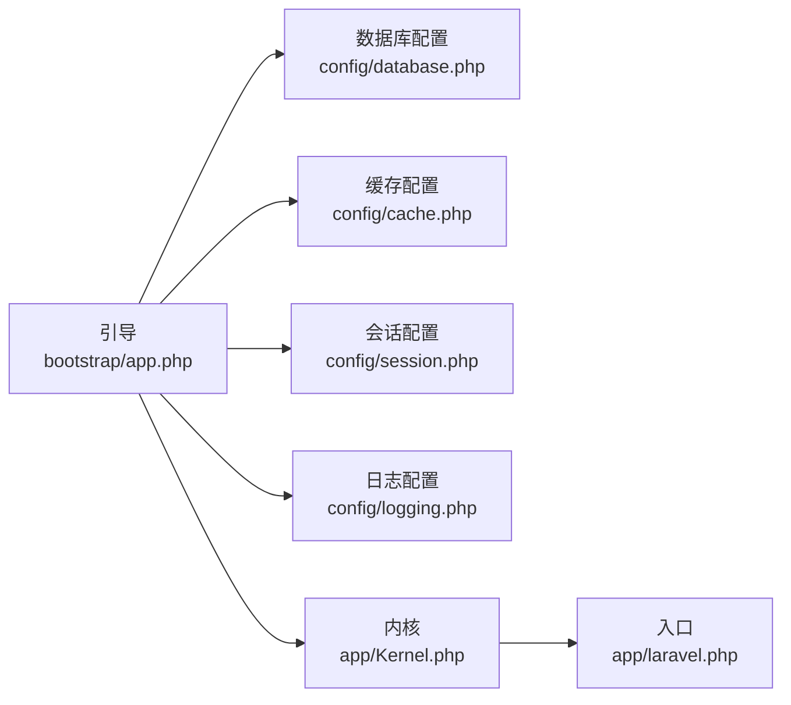

# 核心框架扩展

<cite>
**本文引用的文件**
- [app/Kernel.php](file://app/Kernel.php)
- [bootstrap/app.php](file://bootstrap/app.php)
- [config/database.php](file://config/database.php)
- [config/logging.php](file://config/logging.php)
- [config/cache.php](file://config/cache.php)
- [config/session.php](file://config/session.php)
- [app/laravel.php](file://app/laravel.php)
</cite>

## 目录
1. [简介](#简介)
2. [项目结构](#项目结构)
3. [核心组件](#核心组件)
4. [架构总览](#架构总览)
5. [详细组件分析](#详细组件分析)
6. [依赖关系分析](#依赖关系分析)
7. [性能考量](#性能考量)
8. [故障排查指南](#故障排查指南)
9. [结论](#结论)
10. [附录](#附录)

## 简介
本文件面向芸众商城的核心框架扩展，围绕自定义 Application 类、服务容器绑定、事件系统扩展、日志系统定制（调试日志、错误日志、慢查询日志）、数据库扩展（连接池、读写分离、事务处理）以及 Redis 扩展（缓存、会话存储、消息队列）进行系统化说明。文档以“可操作”为目标，提供架构图、流程图与配置要点，帮助开发者快速理解并正确使用这些扩展能力。

## 项目结构
围绕核心扩展的关键位置如下：
- 自定义内核与中间件：app/Kernel.php
- 应用实例与服务容器绑定：bootstrap/app.php
- 数据库与缓存/会话/日志配置：config/database.php、config/cache.php、config/session.php、config/logging.php
- 请求入口与内核调度：app/laravel.php

图表来源
- [bootstrap/app.php:14-48](file://bootstrap/app.php#L14-L48)
- [app/Kernel.php:10-76](file://app/Kernel.php#L10-L76)
- [config/database.php:137-304](file://config/database.php#L137-L304)
- [config/cache.php:8-95](file://config/cache.php#L8-L95)
- [config/session.php:3-179](file://config/session.php#L3-L179)
- [config/logging.php:11-87](file://config/logging.php#L11-L87)
- [app/laravel.php:45-50](file://app/laravel.php#L45-L50)

章节来源
- [bootstrap/app.php:14-48](file://bootstrap/app.php#L14-L48)
- [app/Kernel.php:10-76](file://app/Kernel.php#L10-L76)
- [config/database.php:137-304](file://config/database.php#L137-L304)
- [config/cache.php:8-95](file://config/cache.php#L8-L95)
- [config/session.php:3-179](file://config/session.php#L3-L179)
- [config/logging.php:11-87](file://config/logging.php#L11-L87)
- [app/laravel.php:45-50](file://app/laravel.php#L45-L50)

## 核心组件
- 自定义 Application 与服务容器绑定
  - 在引导文件中实例化自定义 Application，并通过单例绑定多种“日志门面”（trace/debug/error），以及 HTTP/Console 内核、异常处理器、Bus 分发器等。
  - 绑定示例路径参考：[bootstrap/app.php:28-48](file://bootstrap/app.php#L28-L48)。
- 自定义内核与中间件栈
  - 定义全局中间件、路由组中间件（web/admin/api/business）与路由级中间件（如认证、业务登录等），为不同入口提供差异化处理。
  - 参考路径：[app/Kernel.php:19-76](file://app/Kernel.php#L19-L76)。
- 配置层（数据库/缓存/会话/日志）
  - 数据库：默认连接、主从分离、MongoDB、Redis/MongoDB 外部配置合并、PDO 选项与查询日志开关。
  - 缓存：默认驱动根据安装状态切换至 Redis，键前缀统一。
  - 会话：驱动、生命周期、Cookie 属性、数据库/Redis 存储等。
  - 日志：Monolog 驱动、通道堆叠、按天滚动等。
  - 参考路径：
    - [config/database.php:137-304](file://config/database.php#L137-L304)
    - [config/cache.php:8-95](file://config/cache.php#L8-L95)
    - [config/session.php:3-179](file://config/session.php#L3-L179)
    - [config/logging.php:11-87](file://config/logging.php#L11-L87)

章节来源
- [bootstrap/app.php:28-48](file://bootstrap/app.php#L28-L48)
- [app/Kernel.php:19-76](file://app/Kernel.php#L19-L76)
- [config/database.php:137-304](file://config/database.php#L137-L304)
- [config/cache.php:8-95](file://config/cache.php#L8-L95)
- [config/session.php:3-179](file://config/session.php#L3-L179)
- [config/logging.php:11-87](file://config/logging.php#L11-L87)

## 架构总览
下图展示从请求进入至响应返回的端到端流程，以及核心扩展在其中的位置：

图表来源
- [app/laravel.php:45-50](file://app/laravel.php#L45-L50)
- [bootstrap/app.php:38-48](file://bootstrap/app.php#L38-L48)
- [app/Kernel.php:19-76](file://app/Kernel.php#L19-L76)
- [config/database.php:137-304](file://config/database.php#L137-L304)
- [config/cache.php:8-95](file://config/cache.php#L8-L95)
- [config/session.php:3-179](file://config/session.php#L3-L179)
- [config/logging.php:11-87](file://config/logging.php#L11-L87)

## 详细组件分析

### 自定义 Application 与服务容器扩展
- 单例绑定
  - trace/debug/error 三类日志门面分别绑定到 TraceLog、DebugLog、ErrorLog 实现，便于在业务中按需调用。
  - 同时绑定 HTTP/Console 内核、异常处理器、Bus 分发器，确保框架核心行为可控。
  - 参考路径：[bootstrap/app.php:28-52](file://bootstrap/app.php#L28-L52)。
- 作用
  - 将自定义日志实现注入容器，使上层可通过容器解析或门面方式使用。
  - 通过绑定自定义内核与异常处理器，统一请求生命周期与错误处理策略。

章节来源
- [bootstrap/app.php:28-52](file://bootstrap/app.php#L28-L52)

### 自定义内核与中间件体系
- 全局中间件
  - 包含站点路由中间件等，贯穿所有请求。
  - 参考路径：[app/Kernel.php:19-23](file://app/Kernel.php#L19-L23)。
- 路由组中间件
  - web/admin/api/business：针对不同入口启用差异化的安全、会话、认证等处理。
  - 参考路径：[app/Kernel.php:30-56](file://app/Kernel.php#L30-L56)。
- 路由级中间件
  - 提供认证、管理员认证、店铺认证、业务登录等细粒度控制。
  - 参考路径：[app/Kernel.php:66-76](file://app/Kernel.php#L66-L76)。

章节来源
- [app/Kernel.php:19-76](file://app/Kernel.php#L19-L76)

### 日志系统定制化实现
- 门面绑定
  - 通过容器单例绑定 trace/debug/error 三种日志门面，分别对应不同的日志实现类。
  - 参考路径：[bootstrap/app.php:28-36](file://bootstrap/app.php#L28-L36)。
- 通道与级别
  - 默认通道为 stack，内部使用 daily 滚动日志；也可选择 single、slack、stderr、syslog、errorlog 等。
  - 参考路径：[config/logging.php:41-85](file://config/logging.php#L41-L85)。
- 使用建议
  - 调试日志：用于开发期与问题定位，建议在非生产环境开启较低级别。
  - 错误日志：集中捕获异常与致命错误，配合 stack 通道落盘。
  - 慢查询日志：结合数据库层的查询日志开关与自定义追踪门面，记录耗时 SQL 与上下文。

章节来源
- [bootstrap/app.php:28-36](file://bootstrap/app.php#L28-L36)
- [config/logging.php:41-85](file://config/logging.php#L41-L85)

### 数据库扩展：连接池、读写分离与事务
- 连接配置
  - 默认 mysql 连接、kefu 连接、pgsql 连接、mongodb 连接；默认 fetch 模式为关联数组。
  - 参考路径：[config/database.php:173-256](file://config/database.php#L173-L256)。
- 读写分离
  - 通过 mysql_slave 连接定义 write/read 主从主机列表，实现读流量分发。
  - 参考路径：[config/database.php:227-246](file://config/database.php#L227-L246)。
- 查询日志与慢查询
  - mysql 与 mysql_slave 均开启 loggingQueries，便于收集 SQL 与耗时信息。
  - 结合自定义 trace/debug/error 日志门面，可将慢查询与异常 SQL 记录到专用日志。
  - 参考路径：[config/database.php:193](file://config/database.php#L193)、[config/database.php:244](file://config/database.php#L244)。
- 事务处理
  - 基于 PDO 的事务语义，结合框架事务 API（如 DB::beginTransaction/commit/rollback）实现一致性保障。
  - 建议在业务层对关键流程包裹事务，并在异常时回滚，同时记录错误日志。

章节来源
- [config/database.php:173-256](file://config/database.php#L173-L256)
- [config/database.php:227-246](file://config/database.php#L227-L246)
- [config/database.php:193](file://config/database.php#L193)
- [config/database.php:244](file://config/database.php#L244)

### Redis 扩展：缓存、会话存储与消息队列
- 缓存
  - 默认缓存驱动根据安装状态自动切换为 redis，键前缀统一为 yunshop，避免多应用冲突。
  - 参考路径：[config/cache.php:22](file://config/cache.php#L22)、[config/cache.php:93](file://config/cache.php#L93)。
- 会话存储
  - 支持 file、cookie、database、apc、memcached、redis、array 等驱动；可按部署场景选择持久化方案。
  - 参考路径：[config/session.php:19](file://config/session.php#L19)、[config/session.php:73](file://config/session.php#L73)。
- 消息队列
  - Redis 可作为队列后端（如基于列表的简单队列），结合任务调度与进程守护实现异步处理。
  - 建议：为不同优先级的任务划分不同队列名称，配合重试与死信队列策略。

章节来源
- [config/cache.php:22](file://config/cache.php#L22)
- [config/cache.php:93](file://config/cache.php#L93)
- [config/session.php:19](file://config/session.php#L19)
- [config/session.php:73](file://config/session.php#L73)

### 事件系统扩展
- 事件与监听
  - 项目包含大量事件与监听器目录，可在业务中定义领域事件与监听器，实现关注点分离。
  - 建议：为订单、支付、会员等核心流程建立事件-监听器链路，保证业务逻辑解耦。
- 与容器集成
  - 事件系统通常通过服务容器解析监听器，确保依赖注入与生命周期管理一致。

章节来源
- [app/common/events](file://app/common/events)（目录存在）
- [app/common/listeners](file://app/common/listeners)（目录存在）

## 依赖关系分析
- 引导层依赖
  - bootstrap/app.php 依赖自定义 Application、内核、异常处理器、日志门面等。
- 配置层依赖
  - config/database.php 为数据库连接、读写分离、外部配置合并提供依据。
  - config/cache.php 与 config/session.php 分别决定缓存与会话的存储形态。
  - config/logging.php 决定日志输出与归档策略。
- 运行时依赖
  - app/Kernel.php 的中间件组与路由中间件影响请求处理路径。
  - app/laravel.php 作为入口，负责请求捕获、内核处理与响应发送。

图表来源
- [bootstrap/app.php:14-48](file://bootstrap/app.php#L14-L48)
- [config/database.php:137-304](file://config/database.php#L137-L304)
- [config/cache.php:8-95](file://config/cache.php#L8-L95)
- [config/session.php:3-179](file://config/session.php#L3-L179)
- [config/logging.php:11-87](file://config/logging.php#L11-L87)
- [app/Kernel.php:10-76](file://app/Kernel.php#L10-L76)
- [app/laravel.php:45-50](file://app/laravel.php#L45-L50)

章节来源
- [bootstrap/app.php:14-48](file://bootstrap/app.php#L14-L48)
- [config/database.php:137-304](file://config/database.php#L137-L304)
- [config/cache.php:8-95](file://config/cache.php#L8-L95)
- [config/session.php:3-179](file://config/session.php#L3-L179)
- [config/logging.php:11-87](file://config/logging.php#L11-L87)
- [app/Kernel.php:10-76](file://app/Kernel.php#L10-L76)
- [app/laravel.php:45-50](file://app/laravel.php#L45-L50)

## 性能考量
- 数据库
  - 开启查询日志有助于定位慢查询，但生产环境应谨慎评估日志开销。
  - 读写分离可显著降低主库压力，建议将只读查询路由至从库。
- 缓存
  - Redis 缓存可大幅降低数据库访问频率，建议对热点数据设置合理过期时间与键命名规范。
- 日志
  - daily 滚动与按级别过滤可减少磁盘占用，建议在高并发场景限制高频 debug 日志。
- 会话
  - Redis 会话适合分布式部署，注意连接池与序列化策略，避免大对象频繁序列化带来的 CPU 开销。

## 故障排查指南
- 请求无法进入内核
  - 检查入口脚本是否正确解析内核与请求对象。
  - 参考路径：[app/laravel.php:45-50](file://app/laravel.php#L45-L50)。
- 中间件异常
  - 核对 app/Kernel.php 中各组中间件顺序与依赖，逐步排除问题。
  - 参考路径：[app/Kernel.php:30-56](file://app/Kernel.php#L30-L56)。
- 数据库连接失败
  - 校验 config/database.php 中主机、端口、账号、密码与表前缀，确认网络连通性。
  - 参考路径：[config/database.php:181-212](file://config/database.php#L181-L212)。
- 缓存/会话不可用
  - 检查 config/cache.php 与 config/session.php 的驱动与连接参数，确认 Redis/Memcached 可达。
  - 参考路径：[config/cache.php:75-78](file://config/cache.php#L75-L78)、[config/session.php:73](file://config/session.php#L73)。
- 日志不落盘
  - 检查 config/logging.php 的通道与文件权限，确认 storage/logs 可写。
  - 参考路径：[config/logging.php:41-85](file://config/logging.php#L41-L85)。

章节来源
- [app/laravel.php:45-50](file://app/laravel.php#L45-L50)
- [app/Kernel.php:30-56](file://app/Kernel.php#L30-L56)
- [config/database.php:181-212](file://config/database.php#L181-L212)
- [config/cache.php:75-78](file://config/cache.php#L75-L78)
- [config/session.php:73](file://config/session.php#L73)
- [config/logging.php:41-85](file://config/logging.php#L41-L85)

## 结论
芸众商城核心框架通过自定义 Application 与内核、服务容器绑定与配置层扩展，实现了对日志、数据库、缓存、会话与事件系统的深度定制。开发者可据此在保持框架一致性的同时，灵活扩展业务所需的日志分级、慢查询追踪、读写分离、缓存与会话策略以及事件驱动架构。

## 附录
- 配置项速查
  - 数据库默认连接、主从分离、查询日志开关：[config/database.php:155](file://config/database.php#L155)、[config/database.php:227-246](file://config/database.php#L227-L246)、[config/database.php:193](file://config/database.php#L193)、[config/database.php:244](file://config/database.php#L244)
  - 缓存默认驱动与键前缀：[config/cache.php:22](file://config/cache.php#L22)、[config/cache.php:93](file://config/cache.php#L93)
  - 会话驱动与连接：[config/session.php:19](file://config/session.php#L19)、[config/session.php:73](file://config/session.php#L73)
  - 日志默认通道与通道堆叠：[config/logging.php:24](file://config/logging.php#L24)、[config/logging.php:42-44](file://config/logging.php#L42-L44)