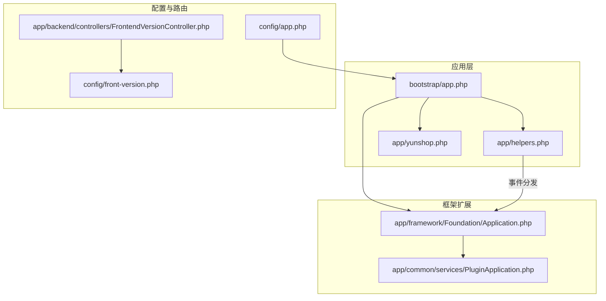
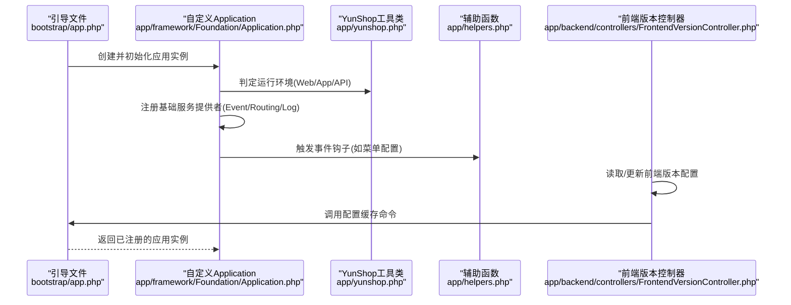
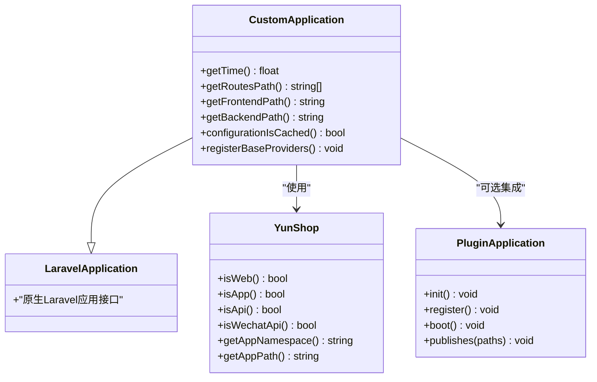
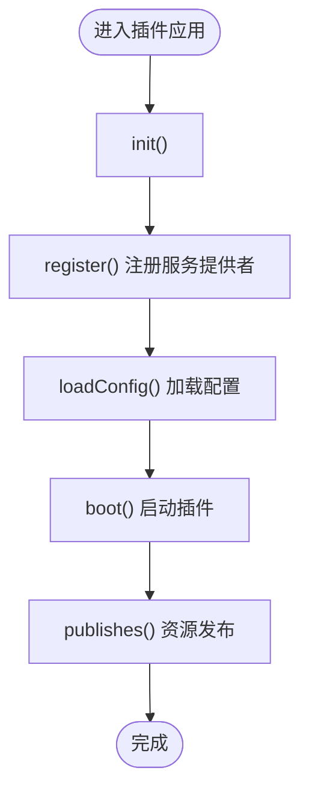
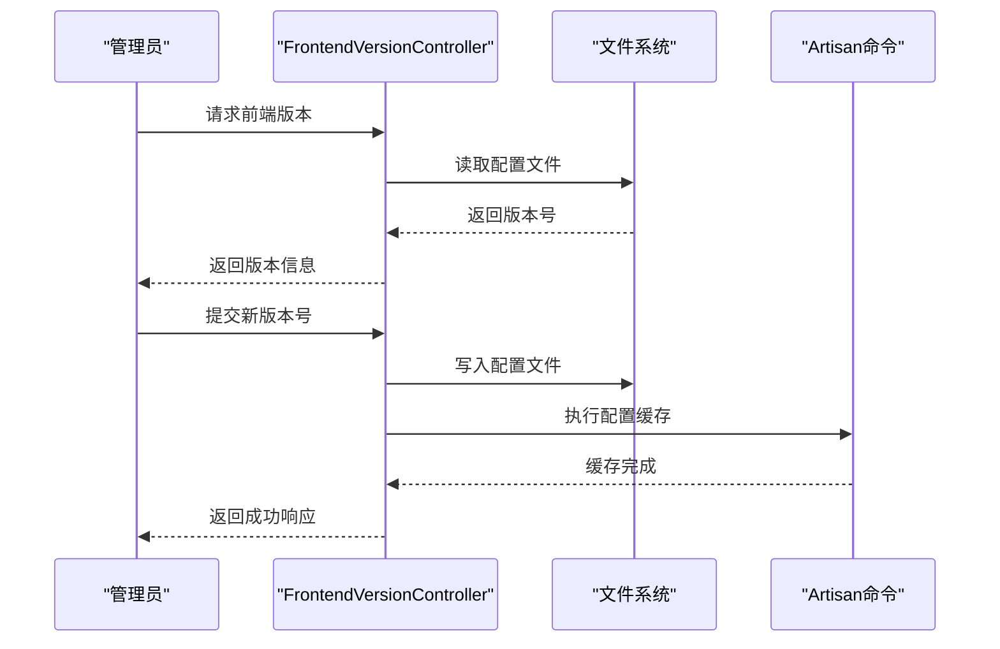
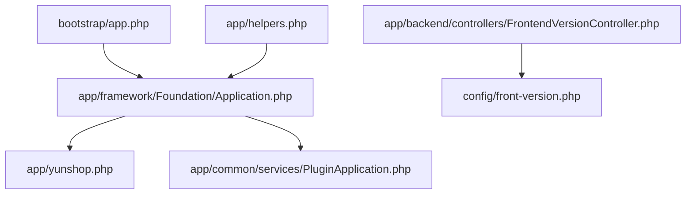

# 自定义Application类扩展

<cite>
**本文档引用的文件**
- [app/framework/Foundation/Application.php](file://app/framework/Foundation/Application.php)
- [app/yunshop.php](file://app/yunshop.php)
- [app/common/services/PluginApplication.php](file://app/common/services/PluginApplication.php)
- [app/backend/controllers/FrontendVersionController.php](file://app/backend/controllers/FrontendVersionController.php)
- [app/helpers.php](file://app/helpers.php)
- [bootstrap/app.php](file://bootstrap/app.php)
- [config/app.php](file://config/app.php)
- [config/front-version.php](file://config/front-version.php)
</cite>

## 目录
1. [简介](#简介)
2. [项目结构](#项目结构)
3. [核心组件](#核心组件)
4. [架构总览](#架构总览)
5. [详细组件分析](#详细组件分析)
6. [依赖关系分析](#依赖关系分析)
7. [性能考虑](#性能考虑)
8. [故障排除指南](#故障排除指南)
9. [结论](#结论)
10. [附录](#附录)

## 简介
本文件面向芸众商城的开发者，系统性阐述项目对Laravel原生Application的扩展方式与实现细节。重点覆盖以下方面：
- 时间统计能力（getTime方法）
- 路由路径管理（getRoutesPath系列方法）
- 目录结构扩展（getFrontendPath、getBackendPath等）
- 基础服务提供者注册机制（EventServiceProvider、RoutingServiceProvider、LogServiceProvider）
- configurationIsCached方法的缓存优化策略
- 使用示例与最佳实践

通过本文档，读者可以理解如何在现有基础上进行扩展，并掌握关键扩展点与调用流程。

## 项目结构
芸众商城采用模块化与多入口架构：
- 核心框架扩展位于 app/framework/Foundation/Application.php
- 应用初始化与命名空间判定逻辑位于 app/yunshop.php
- 插件应用容器扩展位于 app/common/services/PluginApplication.php
- 前端版本管理控制器位于 app/backend/controllers/FrontendVersionController.php
- 辅助函数与事件钩子位于 app/helpers.php
- 应用引导文件位于 bootstrap/app.php
- 配置文件位于 config/ 目录

**图表来源**
- [bootstrap/app.php](file://bootstrap/app.php)
- [app/framework/Foundation/Application.php](file://app/framework/Foundation/Application.php)
- [app/yunshop.php](file://app/yunshop.php)
- [app/common/services/PluginApplication.php](file://app/common/services/PluginApplication.php)
- [app/backend/controllers/FrontendVersionController.php](file://app/backend/controllers/FrontendVersionController.php)
- [config/app.php](file://config/app.php)
- [config/front-version.php](file://config/front-version.php)

**章节来源**
- [bootstrap/app.php](file://bootstrap/app.php)
- [app/framework/Foundation/Application.php](file://app/framework/Foundation/Application.php)
- [app/yunshop.php](file://app/yunshop.php)
- [app/common/services/PluginApplication.php](file://app/common/services/PluginApplication.php)
- [app/backend/controllers/FrontendVersionController.php](file://app/backend/controllers/FrontendVersionController.php)
- [config/app.php](file://config/app.php)
- [config/front-version.php](file://config/front-version.php)

## 核心组件
本节概述与扩展Application相关的核心组件及其职责：
- 自定义Application扩展：在原生Laravel Application之上增加时间统计、路由路径管理、目录结构扩展等能力
- YunShop工具类：负责应用命名空间与路径判断，区分Web、App、API等运行场景
- PluginApplication：插件应用容器，封装插件注册、加载配置、启动等生命周期
- 前端版本控制器：提供前端版本号读取与更新能力，并触发配置缓存

关键扩展点：
- getTime方法：用于记录与统计请求处理耗时
- getRoutesPath系列方法：用于动态定位路由文件路径
- 目录结构扩展：根据运行环境返回前端/后端目录路径
- 基础服务提供者：Event、Routing、Log等服务提供者的集成
- configurationIsCached：配置缓存检测与优化

**章节来源**
- [app/framework/Foundation/Application.php](file://app/framework/Foundation/Application.php)
- [app/yunshop.php](file://app/yunshop.php)
- [app/common/services/PluginApplication.php](file://app/common/services/PluginApplication.php)
- [app/backend/controllers/FrontendVersionController.php](file://app/backend/controllers/FrontendVersionController.php)

## 架构总览
芸众商城的Application扩展遵循“引导—扩展—注册—执行”的主流程。下图展示了从应用引导到服务提供者注册的关键交互：

**图表来源**
- [bootstrap/app.php](file://bootstrap/app.php)
- [app/framework/Foundation/Application.php](file://app/framework/Foundation/Application.php)
- [app/yunshop.php](file://app/yunshop.php)
- [app/helpers.php](file://app/helpers.php)
- [app/backend/controllers/FrontendVersionController.php](file://app/backend/controllers/FrontendVersionController.php)

## 详细组件分析

### 自定义Application扩展（Framework层）
该扩展在原生Laravel Application基础上新增了以下能力：
- 时间统计：通过getTime方法记录请求处理耗时，便于性能监控与分析
- 路由路径管理：通过getRoutesPath系列方法动态获取路由文件路径，支持按环境与模块加载
- 目录结构扩展：提供getFrontendPath、getBackendPath等方法，根据运行环境返回对应目录
- 基础服务提供者注册：集成EventServiceProvider、RoutingServiceProvider、LogServiceProvider
- 配置缓存优化：通过configurationIsCached方法检测配置缓存状态，避免重复加载

**图表来源**
- [app/framework/Foundation/Application.php](file://app/framework/Foundation/Application.php)
- [app/yunshop.php](file://app/yunshop.php)
- [app/common/services/PluginApplication.php](file://app/common/services/PluginApplication.php)

**章节来源**
- [app/framework/Foundation/Application.php](file://app/framework/Foundation/Application.php)
- [app/yunshop.php](file://app/yunshop.php)
- [app/common/services/PluginApplication.php](file://app/common/services/PluginApplication.php)

### YunShop工具类（运行环境与路径判定）
YunShop负责根据请求上下文与配置判断当前运行环境，并据此返回应用命名空间与路径：
- 运行环境判定：isWeb、isApp、isApi、isWechatApi
- 命名空间与路径：getAppNamespace、getAppPath

这些方法直接影响Application扩展中的目录结构扩展与命名空间解析。

**章节来源**
- [app/yunshop.php](file://app/yunshop.php)

### PluginApplication（插件应用容器）
PluginApplication作为插件级应用容器，提供插件生命周期管理：
- 初始化：init()统一调用register()、loadConfig()、boot()
- 注册与启动：register()、boot()预留扩展点
- 发布资源：publishes()委托给PluginServiceProvider进行资源发布
- 菜单与挂件：提供菜单配置与前端挂件配置的扩展点

**图表来源**
- [app/common/services/PluginApplication.php](file://app/common/services/PluginApplication.php)

**章节来源**
- [app/common/services/PluginApplication.php](file://app/common/services/PluginApplication.php)

### 前端版本控制器（配置缓存与版本管理）
前端版本控制器提供前端版本号的读取与更新能力，并在更新后触发配置缓存：
- 读取版本：getVersion()返回前端版本号
- 更新版本：change()写入新版本号并执行配置缓存
- 配置缓存：Artisan::call('config:cache')

**图表来源**
- [app/backend/controllers/FrontendVersionController.php](file://app/backend/controllers/FrontendVersionController.php)
- [config/front-version.php](file://config/front-version.php)

**章节来源**
- [app/backend/controllers/FrontendVersionController.php](file://app/backend/controllers/FrontendVersionController.php)
- [config/front-version.php](file://config/front-version.php)

### 辅助函数与事件钩子（扩展点）
辅助函数提供了事件分发与菜单渲染等扩展点，便于在应用生命周期内注入自定义逻辑：
- 事件分发：在渲染头部前派发事件，允许监听器追加内容
- 菜单配置：通过事件派发配置管理员菜单或会员菜单项

这些扩展点与自定义Application的注册流程相辅相成，共同构成灵活的扩展机制。

**章节来源**
- [app/helpers.php](file://app/helpers.php)

## 依赖关系分析
自定义Application扩展与核心组件之间的依赖关系如下：
- bootstrap/app.php负责创建并返回应用实例
- 自定义Application依赖YunShop进行运行环境判定
- 自定义Application可选集成PluginApplication以支持插件化扩展
- 前端版本控制器依赖配置文件与Artisan命令实现版本管理与缓存
- 辅助函数提供事件钩子，贯穿应用生命周期

**图表来源**
- [bootstrap/app.php](file://bootstrap/app.php)
- [app/framework/Foundation/Application.php](file://app/framework/Foundation/Application.php)
- [app/yunshop.php](file://app/yunshop.php)
- [app/common/services/PluginApplication.php](file://app/common/services/PluginApplication.php)
- [app/backend/controllers/FrontendVersionController.php](file://app/backend/controllers/FrontendVersionController.php)
- [config/front-version.php](file://config/front-version.php)
- [app/helpers.php](file://app/helpers.php)

**章节来源**
- [bootstrap/app.php](file://bootstrap/app.php)
- [app/framework/Foundation/Application.php](file://app/framework/Foundation/Application.php)
- [app/yunshop.php](file://app/yunshop.php)
- [app/common/services/PluginApplication.php](file://app/common/services/PluginApplication.php)
- [app/backend/controllers/FrontendVersionController.php](file://app/backend/controllers/FrontendVersionController.php)
- [config/front-version.php](file://config/front-version.php)
- [app/helpers.php](file://app/helpers.php)

## 性能考虑
- 时间统计：通过getTime方法记录请求耗时，建议结合日志系统进行聚合分析
- 配置缓存：使用configurationIsCached检测缓存状态，避免重复加载配置；前端版本更新后及时执行配置缓存
- 路由路径管理：getRoutesPath系列方法应尽量减少文件系统扫描，优先使用缓存或预编译路径
- 插件化扩展：PluginApplication的register与boot阶段应避免阻塞操作，必要时采用延迟加载

## 故障排除指南
- 配置缓存未生效：确认FrontendVersionController在更新版本后执行了配置缓存命令
- 路由加载异常：检查getRoutesPath系列方法返回的路径是否存在且可读
- 插件资源未发布：确认publishes()调用链正确，且PluginServiceProvider已注册
- 运行环境判定错误：核对YunShop的isWeb/isApp/isApi/isWechatApi判定逻辑与实际请求上下文

**章节来源**
- [app/backend/controllers/FrontendVersionController.php](file://app/backend/controllers/FrontendVersionController.php)
- [app/framework/Foundation/Application.php](file://app/framework/Foundation/Application.php)
- [app/common/services/PluginApplication.php](file://app/common/services/PluginApplication.php)
- [app/yunshop.php](file://app/yunshop.php)

## 结论
芸众商城通过对Laravel原生Application的扩展，实现了时间统计、路由路径管理、目录结构扩展与基础服务提供者注册等能力。配合YunShop的运行环境判定、PluginApplication的插件化扩展以及前端版本控制器的配置缓存机制，形成了稳定、可扩展的应用架构。开发者可在不破坏原有结构的前提下，基于这些扩展点进行二次开发与优化。

## 附录
- 使用示例与最佳实践
  - 在自定义Application中添加业务中间件或服务绑定，确保在registerBaseProviders之后执行
  - 使用getYunShop::getAppPath()与getAppNamespace()在不同运行环境下加载对应模块
  - 对于插件化功能，优先使用PluginApplication的init()统一管理生命周期
  - 更新前端版本后，务必执行配置缓存命令以提升性能