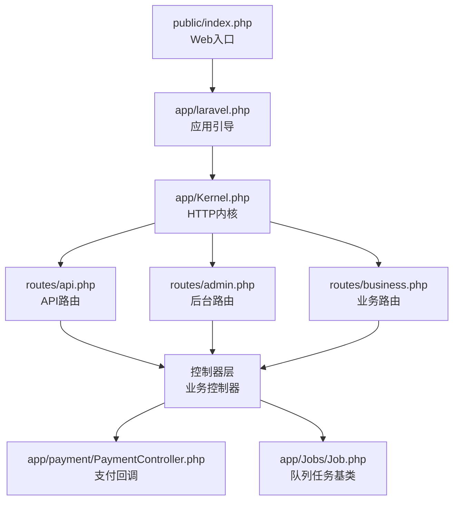
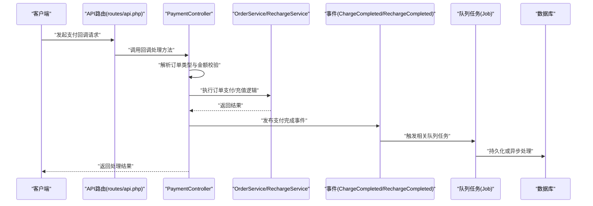
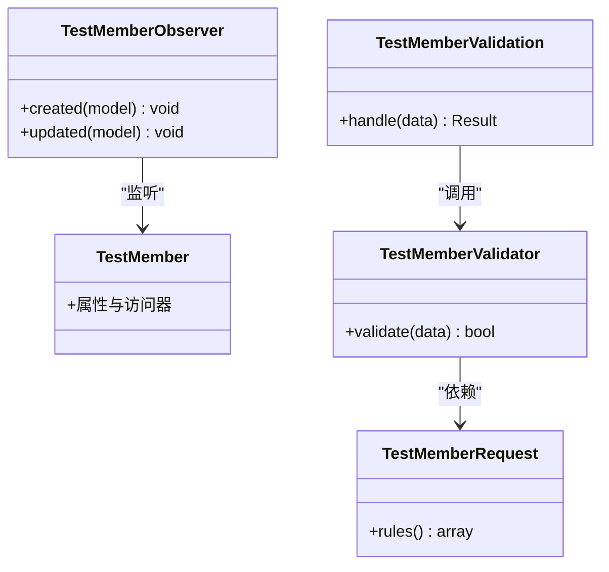
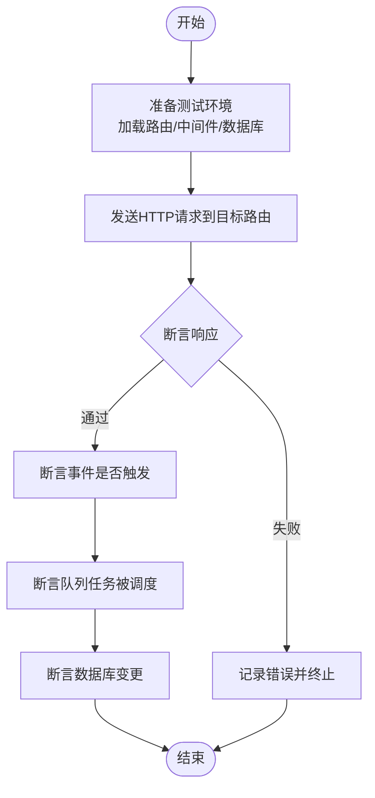
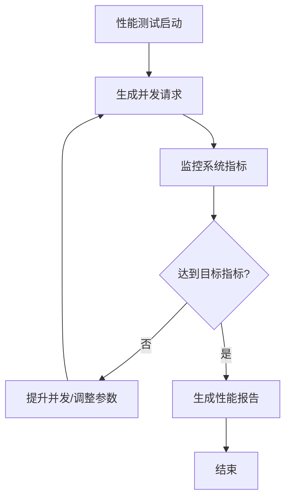
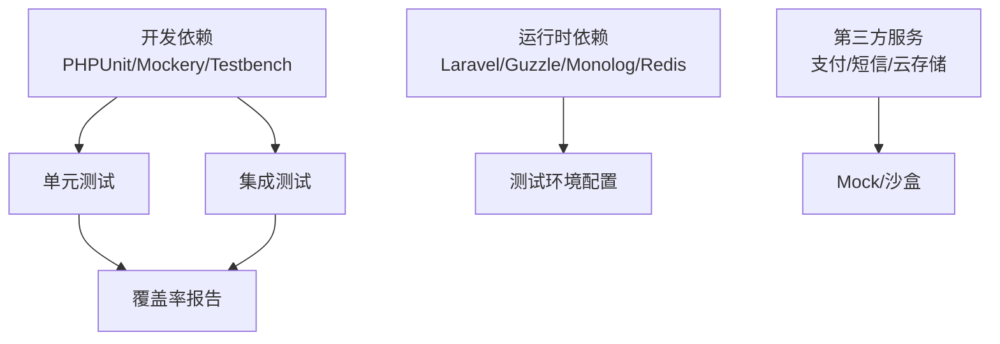

# 测试策略

<cite>
**本文引用的文件**
- [composer.json](file://composer.json)
- [composer.lock](file://composer.lock)
- [app\laravel.php](file://app\laravel.php)
- [app\Kernel.php](file://app\Kernel.php)
- [routes\api.php](file://routes\api.php)
- [routes\admin.php](file://routes\admin.php)
- [routes\business.php](file://routes\business.php)
- [app\payment\PaymentController.php](file://app\payment\PaymentController.php)
- [app\Jobs\Job.php](file://app\Jobs\Job.php)
- [app\common\services\mews\captcha\tests\Captcha\CaptchaTest.php](file://app\common\services\mews\captcha\tests\Captcha\CaptchaTest.php)
- [app\common\services\mews\captcha\phpunit.xml](file://app\common\services\mews\captcha\phpunit.xml)
- [app\backend\modules\member\models\TestMember.php](file://app\backend\modules\member\models\TestMember.php)
- [app\backend\modules\member\models\TestMemberValidator.php](file://app\backend\modules\member\models\TestMemberValidator.php)
- [app\backend\modules\member\services\TestMemberValidation.php](file://app\backend\modules\member\services\TestMemberValidation.php)
- [app\common\models\TestMember.php](file://app\common\models\TestMember.php)
- [app\common\models\TestMemberCart.php](file://app\common\models\TestMemberCart.php)
- [app\common\requests\TestMemberRequest.php](file://app\common\requests\TestMemberRequest.php)
- [app\common\observers\TestMemberObserver.php](file://app\common\observers\TestMemberObserver.php)
- [app\common\events\TestFailEvent.php](file://app\common\events\TestFailEvent.php)
- [config\database.php](file://config\database.php)
- [database\migrations](file://database\migrations)
- [database\seeders](file://database\seeders)
- [public\index.php](file://public\index.php)
- [.gitignore](file://.gitignore)
</cite>

## 目录
1. [简介](#简介)
2. [项目结构](#项目结构)
3. [核心组件](#核心组件)
4. [架构总览](#架构总览)
5. [详细组件分析](#详细组件分析)
6. [依赖分析](#依赖分析)
7. [性能考虑](#性能考虑)
8. [故障排查指南](#故障排查指南)
9. [结论](#结论)
10. [附录](#附录)

## 简介
本测试策略文档面向“芸众商城”项目，旨在建立系统化、可执行的测试体系，覆盖单元测试、集成测试与性能测试，并给出工具选型、持续集成与自动化测试配置建议，以及测试覆盖率与质量保障流程要求。文档基于仓库现有代码与依赖进行分析，结合Laravel生态与PHP测试实践，提出可落地的测试方案。

## 项目结构
- 框架与入口
  - 使用Laravel 8作为核心框架，通过应用引导文件启动。
  - 公共入口位于 public/index.php，应用引导位于 app/laravel.php。
- 路由与控制器
  - API路由集中在 routes/api.php；后台管理路由在 routes/admin.php；业务路由在 routes/business.php。
- 支付与队列
  - 支付回调控制器位于 app/payment/PaymentController.php。
  - 队列任务基类为 app/Jobs/Job.php，定义重试次数与超时。
- 测试与依赖
  - composer.json 中声明了开发期依赖：PHPUnit、Mockery、Orchestra Testbench Core 等。
  - 存在部分测试样例与phpunit.xml配置示例（如mews/captcha包内）。

**图表来源**
- [public\index.php](file://public\index.php)
- [app\laravel.php](file://app\laravel.php)
- [app\Kernel.php](file://app\Kernel.php)
- [routes\api.php](file://routes\api.php)
- [routes\admin.php](file://routes\admin.php)
- [routes\business.php](file://routes\business.php)
- [app\payment\PaymentController.php](file://app\payment\PaymentController.php)
- [app\Jobs\Job.php](file://app\Jobs\Job.php)

**章节来源**
- [app\laravel.php:1-32](file://app\laravel.php#L1-L32)
- [composer.json:144-164](file://composer.json#L144-L164)
- [routes\api.php](file://routes\api.php)
- [routes\admin.php:230-266](file://routes\admin.php#L230-L266)
- [routes\business.php:176-478](file://routes\business.php#L176-L478)
- [app\payment\PaymentController.php:1-337](file://app\payment\PaymentController.php#L1-L337)
- [app\Jobs\Job.php:1-30](file://app\Jobs\Job.php#L1-L30)

## 核心组件
- 单元测试基础
  - PHPUnit 与 Mockery 已在开发依赖中声明，支持断言与Mock对象。
  - Orchestra Testbench Core 提供Laravel测试环境搭建能力。
- 集成测试基础
  - 路由集中、控制器清晰，便于构造HTTP请求进行集成测试。
  - 支付回调控制器具备明确的业务分支与事件触发点，适合模拟第三方回调场景。
- 性能测试基础
  - 队列任务基类定义了重试与超时，为并发与压力测试提供参考。
  - 数据库迁移与填充器存在，便于构建稳定测试数据集。

**章节来源**
- [composer.lock:2732-2758](file://composer.lock#L2732-L2758)
- [app\payment\PaymentController.php:106-246](file://app\payment\PaymentController.php#L106-L246)
- [app\Jobs\Job.php:15-17](file://app\Jobs\Job.php#L15-L17)

## 架构总览
下图展示从HTTP请求到支付回调处理的关键路径，以及与队列任务的关系，便于设计集成测试与性能测试场景。

**图表来源**
- [routes\api.php](file://routes\api.php)
- [app\payment\PaymentController.php:252-299](file://app\payment\PaymentController.php#L252-L299)
- [app\Jobs\Job.php:10-26](file://app\Jobs\Job.php#L10-L26)

## 详细组件分析

### 单元测试设计与实现
- 设计理念
  - 面向接口与契约编程，优先对模型、服务、验证器与观察者进行隔离测试。
  - 使用Mockery对依赖进行Mock，确保测试可重复且快速。
- 测试用例编写
  - 建议以“Given-When-Then”结构组织，覆盖正常路径与边界条件。
  - 对于模型与验证器，重点覆盖字段规则、转换与序列化。
- Mock对象使用
  - 对外部服务（如支付网关、短信服务）使用Mock对象替换，避免真实网络调用。
  - 对数据库访问使用内存数据库或测试专用连接，确保隔离性。
- 断言策略
  - 使用PHPUnit断言验证返回值、抛出异常、事件触发与日志输出。
  - 对金额计算与比例运算使用高精度断言，避免浮点误差。
- 示例参考
  - mews/captcha 包内存在PHPUnit测试样例与phpunit.xml配置，可作为模板参考。

**图表来源**
- [app\backend\modules\member\models\TestMember.php:12-21](file://app\backend\modules\member\models\TestMember.php#L12-L21)
- [app\backend\modules\member\models\TestMemberValidator.php](file://app\backend\modules\member\models\TestMemberValidator.php)
- [app\backend\modules\member\services\TestMemberValidation.php](file://app\backend\modules\member\services\TestMemberValidation.php)
- [app\common\models\TestMember.php](file://app\common\models\TestMember.php)
- [app\common\models\TestMemberCart.php](file://app\common\models\TestMemberCart.php)
- [app\common\requests\TestMemberRequest.php](file://app\common\requests\TestMemberRequest.php)
- [app\common\observers\TestMemberObserver.php](file://app\common\observers\TestMemberObserver.php)

**章节来源**
- [app\common\services\mews\captcha\tests\Captcha\CaptchaTest.php:1-14](file://app\common\services\mews\captcha\tests\Captcha\CaptchaTest.php#L1-L14)
- [app\common\services\mews\captcha\phpunit.xml](file://app\common\services\mews\captcha\phpunit.xml)
- [app\backend\modules\member\models\TestMember.php:12-21](file://app\backend\modules\member\models\TestMember.php#L12-L21)
- [app\backend\modules\member\models\TestMemberValidator.php](file://app\backend\modules\member\models\TestMemberValidator.php)
- [app\backend\modules\member\services\TestMemberValidation.php](file://app\backend\modules\member\services\TestMemberValidation.php)
- [app\common\models\TestMember.php](file://app\common\models\TestMember.php)
- [app\common\models\TestMemberCart.php](file://app\common\models\TestMemberCart.php)
- [app\common\requests\TestMemberRequest.php](file://app\common\requests\TestMemberRequest.php)
- [app\common\observers\TestMemberObserver.php](file://app\common\observers\TestMemberObserver.php)

### 集成测试设计与实现
- 覆盖范围
  - API测试：针对 routes/api.php 中的接口进行请求/响应验证。
  - 后台管理测试：针对 routes/admin.php 的管理接口进行权限与业务逻辑验证。
  - 业务路由测试：针对 routes/business.php 的业务接口进行流程验证。
  - 支付回调测试：针对 app/payment/PaymentController.php 的回调处理进行场景覆盖（含金额校验、事件触发、异常分支）。
- 实施方法
  - 使用Laravel测试工具链（如TestResponse、AssertableJson）进行断言。
  - 构造测试数据（迁移+工厂），确保数据库一致性。
  - 对第三方服务（支付、短信、云存储）使用Mock或沙盒环境。
- 关键流程示意

**图表来源**
- [routes\api.php](file://routes\api.php)
- [routes\admin.php:230-266](file://routes\admin.php#L230-L266)
- [routes\business.php:176-478](file://routes\business.php#L176-L478)
- [app\payment\PaymentController.php:252-299](file://app\payment\PaymentController.php#L252-L299)

**章节来源**
- [routes\api.php](file://routes\api.php)
- [routes\admin.php:230-266](file://routes\admin.php#L230-L266)
- [routes\business.php:176-478](file://routes\business.php#L176-L478)
- [app\payment\PaymentController.php:106-246](file://app\payment\PaymentController.php#L106-L246)

### 性能测试设计与实施
- 指标与场景
  - 响应时间：API平均/95分位/99分位响应时间。
  - 并发用户数：同时在线用户数与事务吞吐量。
  - 错误率：支付回调与订单处理的错误率。
  - 资源占用：CPU、内存、数据库连接池使用情况。
- 场景设计
  - 负载测试：逐步增加并发，观察系统瓶颈。
  - 压力测试：超过峰值容量，验证系统降级与保护机制。
  - 并发测试：多用户同时下单、支付、退款，验证锁与幂等。
- 参考工具
  - Apache Bench（ab）、wrk、JMeter（可选）。
  - Laravel自身队列任务的重试与超时配置可用于并发场景验证。

**图表来源**
- [app\Jobs\Job.php:15-17](file://app\Jobs\Job.php#L15-L17)

**章节来源**
- [app\Jobs\Job.php:15-17](file://app\Jobs\Job.php#L15-L17)

### 测试工具与框架选择建议
- 单元测试
  - PHPUnit：官方测试框架，版本兼容性良好。
  - Mockery：用于Mock对象与桩，提高测试隔离度。
  - Orchestra Testbench Core：提供Laravel测试环境与辅助工具。
- 集成测试
  - Laravel Dusk（可选）：浏览器级端到端测试。
  - Pest（可选）：更简洁的语法，适合快速编写测试。
- 性能测试
  - 自研脚本 + ab/wrk：轻量高效。
  - JMeter：复杂场景与报表需求。
- 第三方服务测试
  - 使用Mock或沙盒环境（如支付网关沙盒、短信服务商测试账号）。

**章节来源**
- [composer.lock:2732-2758](file://composer.lock#L2732-L2758)

### 持续集成与自动化测试
- CI流水线建议
  - 触发条件：push、PR、定时任务。
  - 步骤：安装依赖、迁移数据库、运行单元测试、运行集成测试、生成覆盖率报告、缓存制品。
- 覆盖率与质量门禁
  - 覆盖率阈值：建议函数/行/分支不低于80%。
  - 质量门禁：失败即阻断合并。
- 环境与缓存
  - 使用独立测试数据库，避免污染主库。
  - 缓存Composer与Node依赖，加速CI速度。

**章节来源**
- [composer.json:160-164](file://composer.json#L160-L164)
- [.gitignore:1-6](file://.gitignore#L1-6)

## 依赖分析
- 开发依赖
  - PHPUnit、Mockery、Orchestra Testbench Core 等，满足单元与集成测试需求。
- 运行时依赖
  - Laravel 8、Guzzle、Monolog、Redis、Elasticsearch/Meilisearch等，影响测试环境配置与隔离策略。
- 外部服务
  - 支付、短信、云存储等第三方服务需Mock或使用沙盒。

**图表来源**
- [composer.json:5-137](file://composer.json#L5-L137)
- [composer.lock:2732-2758](file://composer.lock#L2732-L2758)

**章节来源**
- [composer.json:5-137](file://composer.json#L5-L137)
- [composer.lock:2732-2758](file://composer.lock#L2732-L2758)

## 性能考虑
- 队列与并发
  - 队列任务基类定义了重试次数与超时，有助于在高并发场景下稳定处理。
- 数据库与索引
  - 使用迁移与索引优化，减少慢查询对性能的影响。
- 缓存与搜索引擎
  - 结合Meilisearch/Elasticsearch配置，优化检索性能。

**章节来源**
- [app\Jobs\Job.php:15-17](file://app\Jobs\Job.php#L15-L17)
- [config\database.php](file://config\database.php)
- [database\migrations](file://database\migrations)

## 故障排查指南
- 支付回调异常
  - 核查回调参数解析、金额校验与事件触发逻辑。
  - 关注异常分支与日志输出，定位具体失败原因。
- 队列任务失败
  - 检查重试次数与超时设置，确认任务是否被正确入队。
- 数据库问题
  - 使用测试专用数据库，确保迁移与种子数据一致。
- 日志与环境
  - 检查 .env 与 .gitignore 配置，避免敏感信息泄露。

**章节来源**
- [app\payment\PaymentController.php:252-299](file://app\payment\PaymentController.php#L252-L299)
- [app\Jobs\Job.php:15-17](file://app\Jobs\Job.php#L15-L17)
- [.gitignore:1-6](file://.gitignore#L1-6)

## 结论
本测试策略以Laravel生态为基础，结合项目现有路由、控制器与队列任务，提出了覆盖单元、集成与性能的测试方案。通过Mock与沙盒环境隔离外部依赖，借助PHPUnit与Orchestra Testbench实现高质量测试；配合CI流水线与覆盖率门禁，确保代码质量与交付稳定性。

## 附录
- 测试用例清单（建议）
  - 模型与验证器：字段规则、序列化、转换。
  - 服务层：业务流程、异常处理、事件发布。
  - 控制器：路由匹配、参数校验、响应断言。
  - 支付回调：多种订单类型、金额校验、异常分支。
  - 队列任务：重试、超时、幂等与数据库一致性。
- 覆盖率与质量门禁
  - 函数/行/分支覆盖率不低于80%，失败阻断合并。