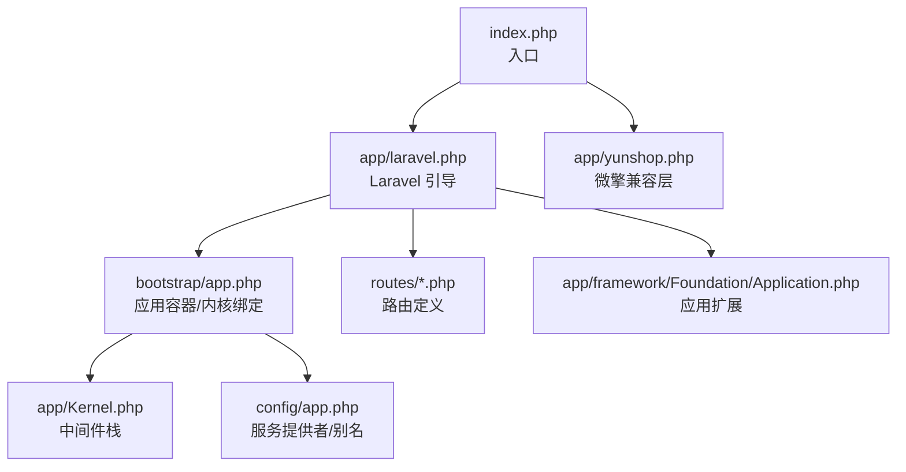
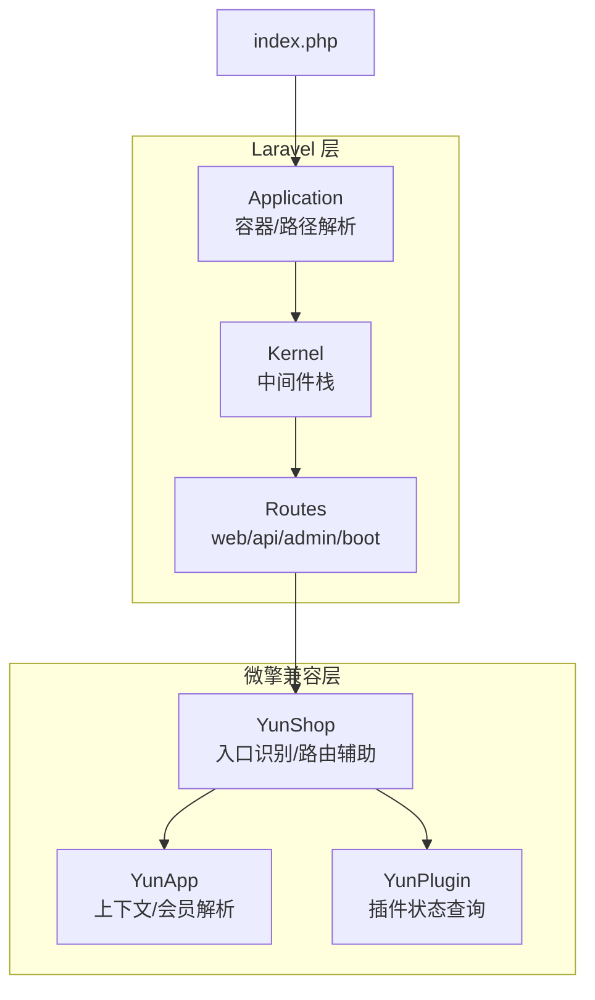
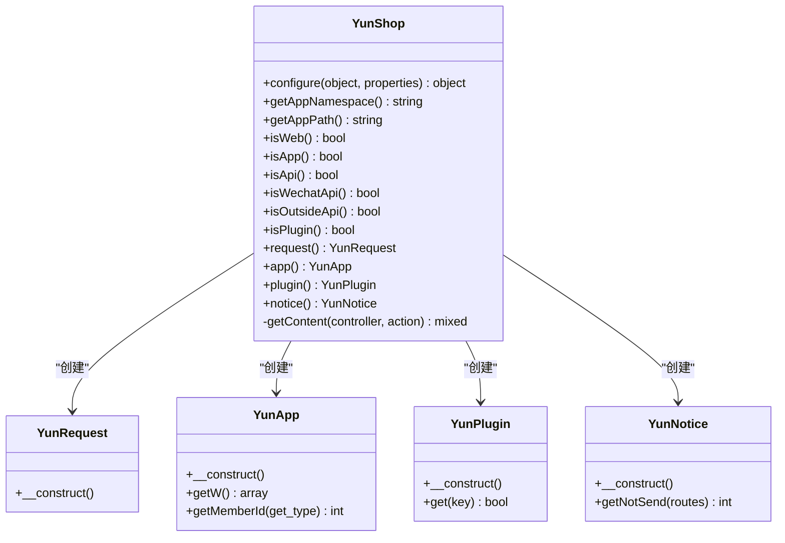
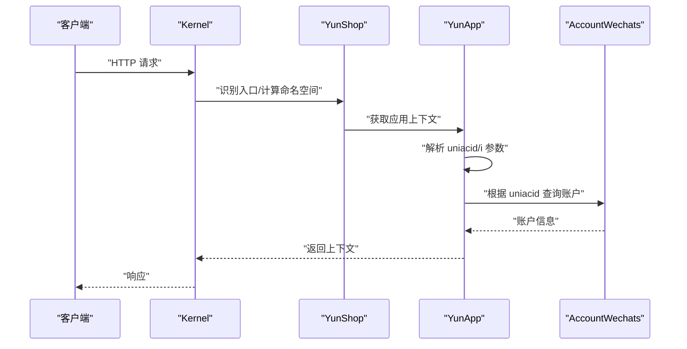
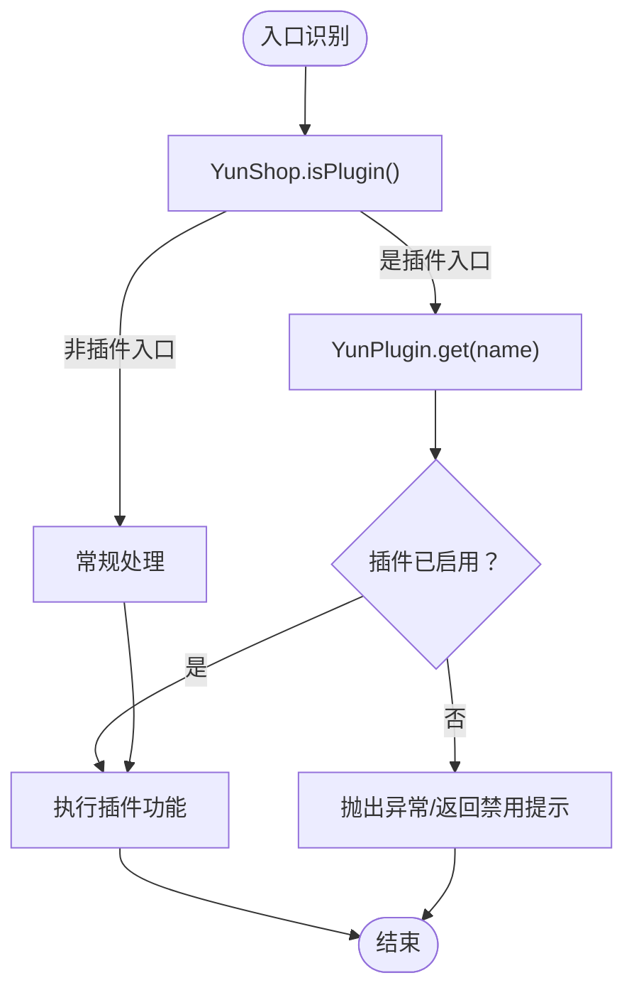
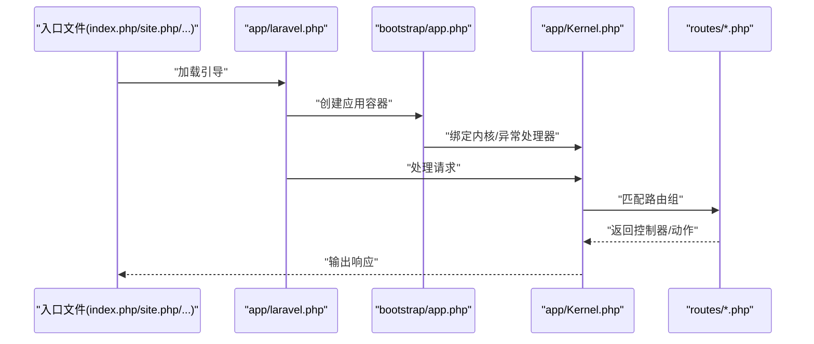
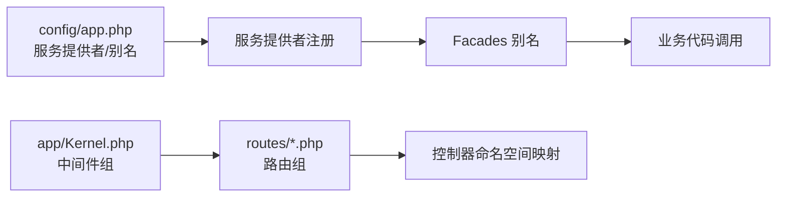

# 整体架构概览

<cite>
**本文档引用的文件**
- [app/yunshop.php](file://app/yunshop.php)
- [app/Kernel.php](file://app/Kernel.php)
- [bootstrap/app.php](file://bootstrap/app.php)
- [index.php](file://index.php)
- [routes/boot.php](file://routes/boot.php)
- [app/framework/Foundation/Application.php](file://app/framework/Foundation/Application.php)
- [app/laravel.php](file://app/laravel.php)
- [config/app.php](file://config/app.php)
- [routes/web.php](file://routes/web.php)
- [routes/api.php](file://routes/api.php)
- [routes/admin.php](file://routes/admin.php)
- [config/APP_Framework.php](file://config/APP_Framework.php)
- [site.php](file://site.php)
- [shop.php](file://shop.php)
- [api.php](file://api.php)
</cite>

## 目录
1. [引言](#引言)
2. [项目结构](#项目结构)
3. [核心组件](#核心组件)
4. [架构总览](#架构总览)
5. [详细组件分析](#详细组件分析)
6. [依赖分析](#依赖分析)
7. [性能考虑](#性能考虑)
8. [故障排查指南](#故障排查指南)
9. [结论](#结论)
10. [附录](#附录)

## 引言
本文件面向芸众商城的整体架构，重点说明系统如何在 Laravel 框架之上集成微擎（WeEngine）兼容层，形成“多入口分发”的统一运行时；并阐述 YunShop 全局工具类、YunApp 应用上下文、YunPlugin 插件管理器三者之间的职责边界与协作关系。文档同时解释模块化设计理念（命名空间与目录结构）、技术选型考量（为何采用微擎作为底层框架、如何实现多端统一管理），并通过架构图与组件交互图帮助开发者快速把握系统全貌。

## 项目结构
从入口到运行时的关键路径如下：
- Web 请求进入 index.php 或微擎入口（site.php、shop.php、api.php）
- 统一加载 Laravel 引导流程 app/laravel.php 与微擎兼容层 app/yunshop.php
- Laravel 引导：bootstrap/app.php 注册内核、异常处理器、服务提供者等
- 路由与中间件：routes/*.php 定义不同入口的路由组，Kernel.php 定义中间件栈
- 应用容器：app/framework/Foundation/Application.php 扩展 Laravel 基础应用，提供路径解析与缓存判断能力

图表来源
- [index.php:1-15](file://index.php#L1-L15)
- [app/laravel.php:1-50](file://app/laravel.php#L1-L50)
- [bootstrap/app.php:1-63](file://bootstrap/app.php#L1-L63)
- [app/Kernel.php:1-78](file://app/Kernel.php#L1-L78)
- [config/app.php:1-309](file://config/app.php#L1-L309)
- [routes/web.php:1-17](file://routes/web.php#L1-L17)
- [routes/api.php:1-7](file://routes/api.php#L1-L7)
- [routes/admin.php:1-267](file://routes/admin.php#L1-L267)
- [app/framework/Foundation/Application.php:1-99](file://app/framework/Foundation/Application.php#L1-L99)

章节来源
- [index.php:1-15](file://index.php#L1-L15)
- [app/laravel.php:1-50](file://app/laravel.php#L1-L50)
- [bootstrap/app.php:1-63](file://bootstrap/app.php#L1-L63)
- [app/Kernel.php:1-78](file://app/Kernel.php#L1-L78)
- [config/app.php:1-309](file://config/app.php#L1-L309)
- [routes/web.php:1-17](file://routes/web.php#L1-L17)
- [routes/api.php:1-7](file://routes/api.php#L1-L7)
- [routes/admin.php:1-267](file://routes/admin.php#L1-L267)
- [app/framework/Foundation/Application.php:1-99](file://app/framework/Foundation/Application.php#L1-L99)

## 核心组件
- YunShop 全局工具类
  - 提供请求类型识别（后台/前端/App/API/微信/外部/支付/插件等）
  - 提供路由解析辅助（命名空间推断、控制器/模块定位）
  - 提供应用上下文、插件管理器、通知器的懒加载入口
- YunApp 应用上下文
  - 封装当前站点上下文（uniacid、acid、account 等）
  - 提供会员身份解析（支持多种渠道 token/min_token/会话）
- YunPlugin 插件管理器
  - 提供插件启用状态查询的门面式访问
- Kernel 中间件栈
  - 定义 web/admin/api/business 等中间件组与路由中间件
- Application 应用容器
  - 扩展 Laravel 基础应用，提供路径解析、路由数据目录、缓存判断等能力

章节来源
- [app/yunshop.php:16-406](file://app/yunshop.php#L16-L406)
- [app/yunshop.php:489-564](file://app/yunshop.php#L489-L564)
- [app/yunshop.php:566-590](file://app/yunshop.php#L566-L590)
- [app/Kernel.php:1-78](file://app/Kernel.php#L1-L78)
- [app/framework/Foundation/Application.php:15-99](file://app/framework/Foundation/Application.php#L15-L99)

## 架构总览
芸众商城采用“Laravel + 微擎兼容层”的双层架构：
- 上层：Laravel 核心（容器、路由、中间件、服务提供者）
- 下层：微擎兼容层（YunShop/YunApp/YunPlugin 等），负责多入口识别、上下文注入、插件启用状态查询等

多入口分发机制：
- Web 管理端：routes/admin.php 定义后台路由组，配合 Kernel 的 admin 中间件组
- API 端：routes/api.php/routes/boot.php 定义 API 路由组，配合 Kernel 的 api 中间件组
- Frontend 端：routes/web.php 定义前端路由组，配合 Kernel 的 web 中间件组
- 微擎模块入口：site.php/shop.php/api.php 通过 include app/laravel.php 与 app/yunshop.php 实现与 Laravel 的桥接

图表来源
- [app/Kernel.php:1-78](file://app/Kernel.php#L1-L78)
- [app/framework/Foundation/Application.php:15-99](file://app/framework/Foundation/Application.php#L15-L99)
- [routes/web.php:1-17](file://routes/web.php#L1-L17)
- [routes/api.php:1-7](file://routes/api.php#L1-L7)
- [routes/admin.php:1-267](file://routes/admin.php#L1-L267)
- [routes/boot.php:1-5](file://routes/boot.php#L1-L5)
- [app/yunshop.php:16-406](file://app/yunshop.php#L16-L406)
- [app/yunshop.php:489-564](file://app/yunshop.php#L489-L564)
- [app/yunshop.php:566-590](file://app/yunshop.php#L566-L590)

## 详细组件分析

### YunShop 全局工具类
- 职责
  - 识别请求来源（后台、App、API、微信、外部、支付、插件）
  - 计算应用命名空间与物理路径（backend/frontend）
  - 提供路由解析辅助（控制器/模块定位、版本化路由）
  - 通过管道执行控制器动作（结合中间件）
- 设计要点
  - 使用静态属性缓存 Request/App/Plugin/Notice 单例，避免重复构造
  - 通过 isWeb/isApp/isApi/isWechatApi/isOutsideApi/isPlugin 等方法实现多入口分流
  - 与 Kernel 的中间件栈配合，确保请求按入口进入正确的处理链路

图表来源
- [app/yunshop.php:16-406](file://app/yunshop.php#L16-L406)
- [app/yunshop.php:475-482](file://app/yunshop.php#L475-L482)
- [app/yunshop.php:489-564](file://app/yunshop.php#L489-L564)
- [app/yunshop.php:566-590](file://app/yunshop.php#L566-L590)
- [app/yunshop.php:592-620](file://app/yunshop.php#L592-L620)

章节来源
- [app/yunshop.php:16-406](file://app/yunshop.php#L16-L406)
- [app/yunshop.php:475-482](file://app/yunshop.php#L475-L482)
- [app/yunshop.php:489-564](file://app/yunshop.php#L489-L564)
- [app/yunshop.php:566-590](file://app/yunshop.php#L566-L590)
- [app/yunshop.php:592-620](file://app/yunshop.php#L592-L620)

### YunApp 应用上下文
- 职责
  - 提供当前站点上下文（uniacid、acid、account）
  - 在非 Web/非微信 API 场景下，基于请求参数 i 或默认值构建上下文
  - 通过多种渠道解析会员身份（token/min_token/会话），支持 POS/直播/聚合等场景
- 设计要点
  - 与微擎全局变量 $_W 对接，保证在微擎环境下与原生逻辑一致
  - 通过 AccountWechats 模型获取账户信息，确保上下文一致性

图表来源
- [app/Kernel.php:1-78](file://app/Kernel.php#L1-L78)
- [app/yunshop.php:489-564](file://app/yunshop.php#L489-L564)
- [app/yunshop.php:500-510](file://app/yunshop.php#L500-L510)

章节来源
- [app/yunshop.php:489-564](file://app/yunshop.php#L489-L564)
- [app/yunshop.php:500-510](file://app/yunshop.php#L500-L510)

### YunPlugin 插件管理器
- 职责
  - 提供插件启用状态查询的门面式访问（app('plugins')->isEnabled(...)）
  - 与 YunShop 的 isPlugin/isWechatApi 等入口识别配合，决定路由与业务分支
- 设计要点
  - 以门面形式暴露 isEnabled，简化调用方对插件状态的感知

图表来源
- [app/yunshop.php:117-126](file://app/yunshop.php#L117-L126)
- [app/yunshop.php:579-588](file://app/yunshop.php#L579-L588)

章节来源
- [app/yunshop.php:117-126](file://app/yunshop.php#L117-L126)
- [app/yunshop.php:579-588](file://app/yunshop.php#L579-L588)

### 多入口分发机制
- Web 管理端
  - 路由：routes/admin.php
  - 中间件：admin 组（安装、会话、认证、安全校验等）
- API 端
  - 路由：routes/api.php、routes/boot.php
  - 中间件：api 组（节流等）
- Frontend 端
  - 路由：routes/web.php
  - 中间件：web 组（可选 Cookie/CSRF 等）
- 微擎模块入口
  - site.php/shop.php/api.php 通过 include app/laravel.php 与 app/yunshop.php，实现与 Laravel 的桥接

图表来源
- [index.php:1-15](file://index.php#L1-L15)
- [site.php:1-17](file://site.php#L1-L17)
- [shop.php:1-7](file://shop.php#L1-L7)
- [api.php:1-22](file://api.php#L1-L22)
- [app/laravel.php:1-50](file://app/laravel.php#L1-L50)
- [bootstrap/app.php:1-63](file://bootstrap/app.php#L1-L63)
- [app/Kernel.php:1-78](file://app/Kernel.php#L1-L78)
- [routes/admin.php:1-267](file://routes/admin.php#L1-L267)
- [routes/api.php:1-7](file://routes/api.php#L1-L7)
- [routes/web.php:1-17](file://routes/web.php#L1-L17)
- [routes/boot.php:1-5](file://routes/boot.php#L1-L5)

章节来源
- [index.php:1-15](file://index.php#L1-L15)
- [site.php:1-17](file://site.php#L1-L17)
- [shop.php:1-7](file://shop.php#L1-L7)
- [api.php:1-22](file://api.php#L1-L22)
- [app/laravel.php:1-50](file://app/laravel.php#L1-L50)
- [bootstrap/app.php:1-63](file://bootstrap/app.php#L1-L63)
- [app/Kernel.php:1-78](file://app/Kernel.php#L1-L78)
- [routes/admin.php:1-267](file://routes/admin.php#L1-L267)
- [routes/api.php:1-7](file://routes/api.php#L1-L7)
- [routes/web.php:1-17](file://routes/web.php#L1-L17)
- [routes/boot.php:1-5](file://routes/boot.php#L1-L5)

## 依赖分析
- 服务提供者与别名
  - config/app.php 中注册了大量服务提供者（数据库、队列、Redis、Excel、短信、邮件等），以及自定义的商城、插件、支付、导出等 Provider
  - 通过别名 Facade 简化调用（如 Setting、Option、Excel、QrCode、PhpSms、wechat 等）
- 中间件依赖
  - Kernel.php 定义了 web/admin/api/business 等中间件组，并在 routes/*.php 中按需应用
- 路由与命名空间
  - routes/admin.php 使用 platform/controllers 命名空间
  - routes/web.php 使用 frontend/modules/web/controllers 命名空间
  - routes/api.php/routes/boot.php 使用 frontend/modules/wechat/controllers 命名空间

图表来源
- [config/app.php:140-276](file://config/app.php#L140-L276)
- [app/Kernel.php:30-76](file://app/Kernel.php#L30-L76)
- [routes/admin.php:2-46](file://routes/admin.php#L2-L46)
- [routes/web.php:12-16](file://routes/web.php#L12-L16)
- [routes/api.php:1-7](file://routes/api.php#L1-L7)
- [routes/boot.php:1-5](file://routes/boot.php#L1-L5)

章节来源
- [config/app.php:140-276](file://config/app.php#L140-L276)
- [app/Kernel.php:30-76](file://app/Kernel.php#L30-L76)
- [routes/admin.php:2-46](file://routes/admin.php#L2-L46)
- [routes/web.php:12-16](file://routes/web.php#L12-L16)
- [routes/api.php:1-7](file://routes/api.php#L1-L7)
- [routes/boot.php:1-5](file://routes/boot.php#L1-L5)

## 性能考虑
- 路由与配置缓存
  - Application 提供 configurationIsCached 判断，建议生产环境开启配置缓存以减少 I/O
- 中间件链路
  - 不同入口的中间件组应尽量精简，避免不必要的鉴权/会话初始化
- 插件启用状态查询
  - YunPlugin 通过门面访问 isEnabled，建议在高频路径中缓存结果，降低数据库查询次数
- 日志与追踪
  - bootstrap/app.php 注册了 Trace/Debug/Error 三种日志服务，建议按环境配置日志级别与输出目标

章节来源
- [app/framework/Foundation/Application.php:92-99](file://app/framework/Foundation/Application.php#L92-L99)
- [bootstrap/app.php:28-36](file://bootstrap/app.php#L28-L36)

## 故障排查指南
- 入口识别异常
  - 若 isWeb/isApp/isApi/isWechatApi/isOutsideApi/isPlugin 返回不符合预期，检查请求 URI 与微擎配置项（如 APP_Framework、isWeb、webPath 等）
- 上下文缺失
  - YunApp.getW 依赖请求参数 i 或默认值，若未传入或解析失败，会导致 account 为空；请确认前端传参与 config/app.php 默认值
- 插件未生效
  - YunPlugin.get(name) 依赖插件启用状态存储；若插件未启用，将返回 false；可通过平台控制台启用或检查选项表
- 路由解析错误
  - YunShop.findRouteFile 会根据命名规则定位控制器/模块；若路径不存在或命名不规范，将抛出异常；请检查命名空间与文件结构

章节来源
- [config/APP_Framework.php:1-2](file://config/APP_Framework.php#L1-L2)
- [config/app.php:290-308](file://config/app.php#L290-L308)
- [app/yunshop.php:489-564](file://app/yunshop.php#L489-L564)
- [app/yunshop.php:566-590](file://app/yunshop.php#L566-L590)
- [app/yunshop.php:333-370](file://app/yunshop.php#L333-L370)

## 结论
芸众商城通过“Laravel + 微擎兼容层”的架构，在保持与微擎生态兼容的同时，利用 Laravel 的现代化特性（容器、中间件、服务提供者、路由）实现了清晰的多入口分发与模块化组织。YunShop、YunApp、YunPlugin 三者分别承担入口识别、上下文注入与插件状态查询的职责，彼此解耦且协作紧密。该架构既满足了多端统一管理的需求，也为后续扩展与维护提供了良好的基础。

## 附录
- 技术选型说明
  - 采用微擎作为底层框架的原因：历史兼容性、模块化生态、与微信生态的深度集成
  - 多端统一管理：通过统一入口与命名空间/目录结构，将后台、前台、API、微信等入口收敛至同一套路由与中间件体系
- 关键文件清单
  - 入口：index.php、site.php、shop.php、api.php
  - 引导：app/laravel.php、bootstrap/app.php
  - 核心：app/yunshop.php、app/Kernel.php、app/framework/Foundation/Application.php
  - 路由：routes/web.php、routes/api.php、routes/admin.php、routes/boot.php
  - 配置：config/app.php、config/APP_Framework.php