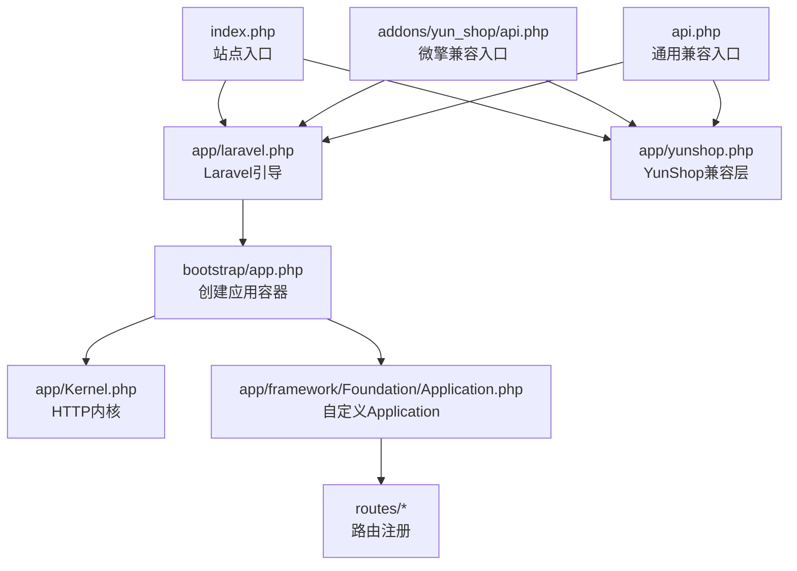
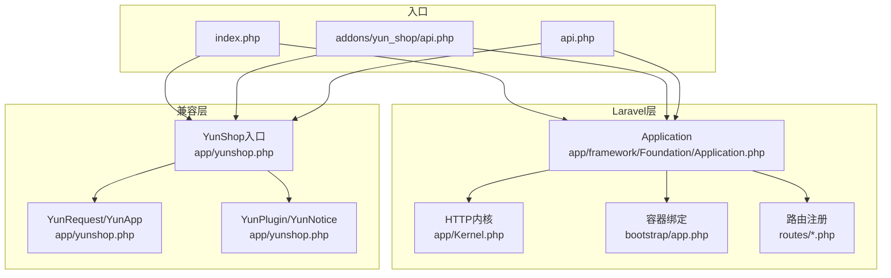
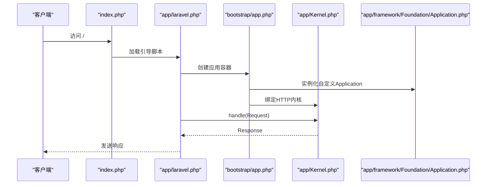
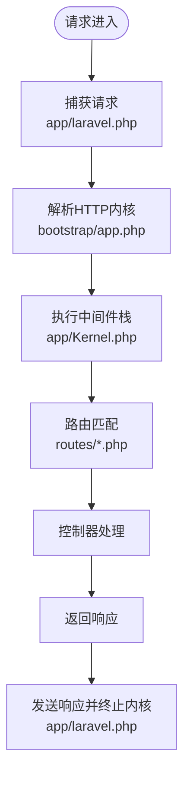
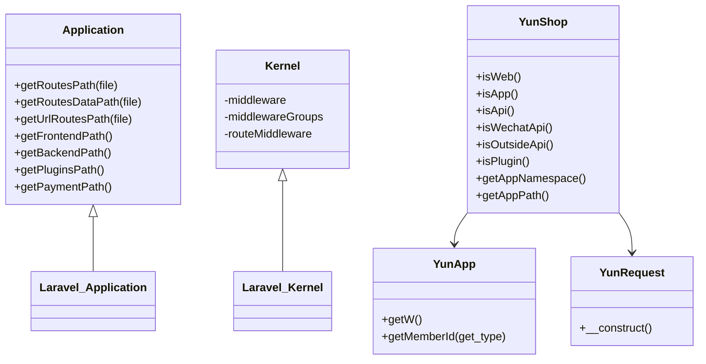
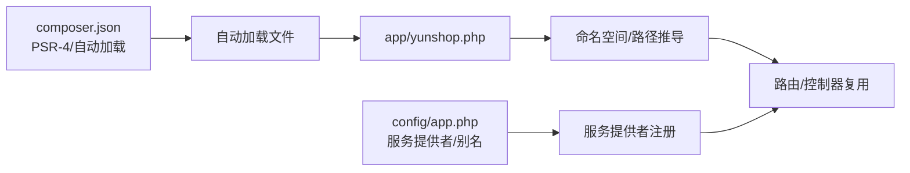
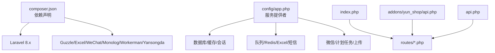

# 系统架构设计

<cite>
**本文引用的文件列表**
- [app/Kernel.php](file://app/Kernel.php)
- [bootstrap/app.php](file://bootstrap/app.php)
- [index.php](file://index.php)
- [app/laravel.php](file://app/laravel.php)
- [app/yunshop.php](file://app/yunshop.php)
- [app/framework/Foundation/Application.php](file://app/framework/Foundation/Application.php)
- [routes/web.php](file://routes/web.php)
- [routes/api.php](file://routes/api.php)
- [routes/shop.php](file://routes/shop.php)
- [routes/boot.php](file://routes/boot.php)
- [config/app.php](file://config/app.php)
- [addons/yun_shop/api.php](file://addons/yun_shop/api.php)
- [api.php](file://api.php)
- [composer.json](file://composer.json)
</cite>

## 目录
1. [引言](#引言)
2. [项目结构](#项目结构)
3. [核心组件](#核心组件)
4. [架构总览](#架构总览)
5. [详细组件分析](#详细组件分析)
6. [依赖分析](#依赖分析)
7. [性能考量](#性能考量)
8. [故障排查指南](#故障排查指南)
9. [结论](#结论)
10. [附录](#附录)

## 引言
本设计文档面向芸众商城（YunShop）系统，聚焦于整体架构模式、核心设计原则与系统边界，系统采用“Laravel 框架 + 微擎兼容层”的混合架构：以 Laravel 为核心运行时，通过自定义 Application 与兼容入口适配微擎生态，实现多入口分发与统一请求生命周期管理。文档同时阐述核心类设计理念、Laravel 与微擎兼容层的集成方式、自定义 Application 的扩展点，并给出系统上下文图与组件关系图，帮助开发者快速理解模块协作关系与扩展路径。

## 项目结构
- 入口与启动
  - Web 入口：index.php 作为站点主入口，负责首页重定向与加载 Laravel 与 YunShop 兼容层。
  - Laravel 入口：app/laravel.php 负责引导 Composer 自动加载、创建应用实例、调用内核处理请求并发送响应。
  - 微擎兼容入口：addons/yun_shop/api.php 与根目录 api.php 根据环境变量判断是否处于微擎框架下，决定是否引入微擎引导文件，再统一加载 Laravel 与 YunShop。
- 应用容器与内核
  - bootstrap/app.php 创建自定义 Application 实例，绑定日志、异常处理器、HTTP/Console 内核等关键服务。
  - app/Kernel.php 扩展 Laravel 内核，定义全局中间件栈、路由中间件组与路由级中间件映射。
- 路由与命名空间
  - routes/*.php 提供不同维度的路由注册（web、api、shop、boot），配合 app/framework/Foundation/Application.php 的路径约定，支持前端/后端/插件模块化组织。
- 配置与自动加载
  - config/app.php 定义服务提供者、别名、应用参数与微擎相关配置项；composer.json 定义 PSR-4 命名空间与自动加载文件。

**图表来源**
- [index.php:1-15](file://index.php#L1-L15)
- [app/laravel.php:1-50](file://app/laravel.php#L1-L50)
- [app/yunshop.php:1-621](file://app/yunshop.php#L1-L621)
- [addons/yun_shop/api.php:1-22](file://addons/yun_shop/api.php#L1-L22)
- [api.php:1-22](file://api.php#L1-L22)
- [bootstrap/app.php:1-63](file://bootstrap/app.php#L1-L63)
- [app/Kernel.php:1-78](file://app/Kernel.php#L1-L78)
- [app/framework/Foundation/Application.php:1-99](file://app/framework/Foundation/Application.php#L1-L99)

**章节来源**
- [index.php:1-15](file://index.php#L1-L15)
- [app/laravel.php:1-50](file://app/laravel.php#L1-L50)
- [addons/yun_shop/api.php:1-22](file://addons/yun_shop/api.php#L1-L22)
- [api.php:1-22](file://api.php#L1-L22)
- [bootstrap/app.php:1-63](file://bootstrap/app.php#L1-L63)
- [app/Kernel.php:1-78](file://app/Kernel.php#L1-L78)
- [app/framework/Foundation/Application.php:1-99](file://app/framework/Foundation/Application.php#L1-L99)
- [routes/web.php:1-17](file://routes/web.php#L1-L17)
- [routes/api.php:1-7](file://routes/api.php#L1-L7)
- [routes/shop.php:1-9](file://routes/shop.php#L1-L9)
- [routes/boot.php:1-5](file://routes/boot.php#L1-L5)
- [config/app.php:1-309](file://config/app.php#L1-L309)
- [composer.json:1-186](file://composer.json#L1-L186)

## 核心组件
- 自定义 Application（app/framework/Foundation/Application.php）
  - 继承 Laravel 原生 Application，重写基础服务提供者注册顺序，新增路由数据路径与模块路径约定，便于前端/后端/插件模块化组织。
  - 提供 getRoutesPath、getRoutesDataPath、getUrlRoutesPath、getFrontendPath、getBackendPath、getPluginsPath、getPaymentPath 等方法，支撑多入口与模块化路由加载。
- HTTP 内核（app/Kernel.php）
  - 定义全局中间件栈（如维护模式检查、自定义 ShopRoute 中间件）。
  - 定义路由中间件组（web/admin/api/business），以及路由级中间件映射（auth/authAdmin/authShop 等）。
- 兼容层入口（app/yunshop.php）
  - 提供 YunShop 类，用于识别请求来源（后台 web、移动端 app、API、微信 API、外部接口、插件等），并根据来源动态确定应用命名空间与路径。
  - 提供 YunApp/YunRequest/YunPlugin/YunNotice 等轻量包装类，简化微擎上下文读取与请求参数解析。
- 应用容器与绑定（bootstrap/app.php）
  - 创建自定义 Application 实例，绑定日志门面实现、异常处理器、HTTP/Console 内核、Illuminate Bus Dispatcher 等。
  - 将 app/framework/Http/Request 绑定到容器，确保请求对象一致性。
- 路由与命名空间（routes/*.php + config/app.php）
  - routes/*.php 提供不同入口的路由注册；config/app.php 定义服务提供者与别名，PSR-4 命名空间指向 app/ 与 business/，并声明自动加载文件（app/yunshop.php 与 app/helpers.php）。

**章节来源**
- [app/framework/Foundation/Application.php:1-99](file://app/framework/Foundation/Application.php#L1-L99)
- [app/Kernel.php:1-78](file://app/Kernel.php#L1-L78)
- [app/yunshop.php:1-621](file://app/yunshop.php#L1-L621)
- [bootstrap/app.php:1-63](file://bootstrap/app.php#L1-L63)
- [routes/web.php:1-17](file://routes/web.php#L1-L17)
- [routes/api.php:1-7](file://routes/api.php#L1-L7)
- [routes/shop.php:1-9](file://routes/shop.php#L1-L9)
- [routes/boot.php:1-5](file://routes/boot.php#L1-L5)
- [config/app.php:140-206](file://config/app.php#L140-L206)
- [composer.json:144-159](file://composer.json#L144-L159)

## 架构总览
系统采用“Laravel 运行时 + 微擎兼容层”的双层架构：
- 上层：Laravel 核心（容器、内核、路由、中间件、服务提供者）。
- 下层：YunShop 兼容层（入口识别、命名空间推导、请求封装、插件检测等），在不破坏 Laravel 生命周期的前提下，复用微擎生态能力。

**图表来源**
- [app/framework/Foundation/Application.php:1-99](file://app/framework/Foundation/Application.php#L1-L99)
- [app/Kernel.php:1-78](file://app/Kernel.php#L1-L78)
- [bootstrap/app.php:1-63](file://bootstrap/app.php#L1-L63)
- [routes/web.php:1-17](file://routes/web.php#L1-L17)
- [routes/api.php:1-7](file://routes/api.php#L1-L7)
- [routes/shop.php:1-9](file://routes/shop.php#L1-L9)
- [routes/boot.php:1-5](file://routes/boot.php#L1-L5)
- [app/yunshop.php:1-621](file://app/yunshop.php#L1-L621)
- [index.php:1-15](file://index.php#L1-L15)
- [addons/yun_shop/api.php:1-22](file://addons/yun_shop/api.php#L1-L22)
- [api.php:1-22](file://api.php#L1-L22)

## 详细组件分析

### 入口与多入口分发机制
- 主入口 index.php
  - 对根路径进行 301 重定向至官方地址，随后加载 app/laravel.php 与 app/yunshop.php，完成 Laravel 与兼容层初始化。
- 微擎兼容入口 addons/yun_shop/api.php 与 api.php
  - 通过读取 .env 判断是否处于 YunShop 框架模式，若非微擎模式则引入微擎引导文件，再统一加载 Laravel 与 YunShop。
- 请求生命周期
  - app/laravel.php 通过容器解析 HTTP 内核，捕获请求并交由内核处理，最终发送响应并终止内核。

**图表来源**
- [index.php:1-15](file://index.php#L1-L15)
- [app/laravel.php:1-50](file://app/laravel.php#L1-L50)
- [bootstrap/app.php:1-63](file://bootstrap/app.php#L1-L63)
- [app/Kernel.php:1-78](file://app/Kernel.php#L1-L78)
- [app/framework/Foundation/Application.php:1-99](file://app/framework/Foundation/Application.php#L1-L99)

**章节来源**
- [index.php:1-15](file://index.php#L1-L15)
- [app/laravel.php:1-50](file://app/laravel.php#L1-L50)
- [addons/yun_shop/api.php:1-22](file://addons/yun_shop/api.php#L1-L22)
- [api.php:1-22](file://api.php#L1-L22)

### 请求生命周期管理
- 请求捕获与内核处理
  - app/laravel.php 使用 app/framework/Http/Request::capture() 获取请求，交由 HTTP 内核处理，随后发送响应并调用 terminate。
- 中间件与路由
  - app/Kernel.php 定义全局中间件与路由中间件组，结合 routes/*.php 的路由注册，形成完整的请求处理链路。
- 日志与异常
  - bootstrap/app.php 绑定 Trace/Debug/Error 日志实现与异常处理器，确保错误与调试信息可追踪。

**图表来源**
- [app/laravel.php:45-50](file://app/laravel.php#L45-L50)
- [bootstrap/app.php:37-48](file://bootstrap/app.php#L37-L48)
- [app/Kernel.php:19-76](file://app/Kernel.php#L19-L76)
- [routes/web.php:14-16](file://routes/web.php#L14-L16)
- [routes/api.php:2-4](file://routes/api.php#L2-L4)
- [routes/shop.php:2-8](file://routes/shop.php#L2-L8)
- [routes/boot.php:2-4](file://routes/boot.php#L2-L4)

**章节来源**
- [app/laravel.php:45-50](file://app/laravel.php#L45-L50)
- [bootstrap/app.php:28-48](file://bootstrap/app.php#L28-L48)
- [app/Kernel.php:19-76](file://app/Kernel.php#L19-L76)

### 核心类设计理念
- Application（自定义）
  - 设计要点：继承原生 Application，仅在基础服务提供者注册与路径约定上做最小改动，保证与 Laravel 生态兼容；新增模块路径方法，便于前端/后端/插件模块化组织。
- Kernel（扩展）
  - 设计要点：集中管理全局中间件与路由中间件组，路由级中间件映射清晰，便于按入口维度（web/admin/api/business）隔离权限与安全策略。
- YunShop（兼容层）
  - 设计要点：通过 isWeb/isApp/isApi/isWechatApi/isOutsideApi/isPlugin 等方法识别入口类型，动态推导命名空间与路径；YunApp/YunRequest/YunPlugin/YunNotice 提供轻量封装，降低微擎上下文接入成本。

**图表来源**
- [app/framework/Foundation/Application.php:43-79](file://app/framework/Foundation/Application.php#L43-L79)
- [app/Kernel.php:19-76](file://app/Kernel.php#L19-L76)
- [app/yunshop.php:74-126](file://app/yunshop.php#L74-L126)
- [app/yunshop.php:494-564](file://app/yunshop.php#L494-L564)
- [app/yunshop.php:475-482](file://app/yunshop.php#L475-L482)

**章节来源**
- [app/framework/Foundation/Application.php:1-99](file://app/framework/Foundation/Application.php#L1-L99)
- [app/Kernel.php:1-78](file://app/Kernel.php#L1-L78)
- [app/yunshop.php:1-621](file://app/yunshop.php#L1-L621)

### Laravel 与微擎兼容层集成
- 入口识别与路径推导
  - app/yunshop.php 通过请求上下文判断当前入口类型，动态拼接命名空间与模块路径，使同一套 Laravel 路由与控制器可在不同入口复用。
- 服务提供者与别名
  - config/app.php 注册大量服务提供者与别名，覆盖数据库、缓存、队列、Redis、Excel、短信、微信等第三方能力；composer.json 的 PSR-4 与自动加载文件确保命名空间与工具函数可用。
- 兼容入口差异
  - addons/yun_shop/api.php 与 api.php 在微擎模式下会引入微擎引导文件，再统一加载 Laravel 与 YunShop，保证微擎生态下的兼容性。

**图表来源**
- [config/app.php:140-206](file://config/app.php#L140-L206)
- [composer.json:144-159](file://composer.json#L144-L159)
- [app/yunshop.php:43-65](file://app/yunshop.php#L43-L65)

**章节来源**
- [app/yunshop.php:43-65](file://app/yunshop.php#L43-L65)
- [config/app.php:140-206](file://config/app.php#L140-L206)
- [composer.json:144-159](file://composer.json#L144-L159)

### 自定义 Application 的扩展点
- 路径约定扩展
  - 可在 app/framework/Foundation/Application.php 中新增路径方法或调整现有路径逻辑，以适配新的模块化组织方式。
- 服务提供者扩展
  - 在 config/app.php 的 providers 数组中添加自定义服务提供者，或在 bootstrap/app.php 中进行容器绑定，满足业务扩展需求。
- 路由数据与 URL 路由
  - 通过 getRoutesDataPath 与 getUrlRoutesPath 提供的数据与 URL 路由目录，可将路由元数据与 URL 规则集中管理，提升可维护性。

**章节来源**
- [app/framework/Foundation/Application.php:43-79](file://app/framework/Foundation/Application.php#L43-L79)
- [config/app.php:140-206](file://config/app.php#L140-L206)
- [bootstrap/app.php:37-48](file://bootstrap/app.php#L37-L48)

## 依赖分析
- 第三方依赖
  - composer.json 明确列出 Laravel 8.x、Guzzle、Maatwebsite Excel、Overtrue WeChat/Laravel-Pinyin、Monolog、Workerman、Yansongda Pay 等依赖，支撑支付、导出、微信、日志、MQTT/WebSocket 等能力。
- 服务提供者依赖
  - config/app.php 注册数据库、Redis、队列、Excel、短信、微信、计划任务等服务提供者，形成完整的基础设施层。
- 入口与路由耦合
  - 入口文件（index.php、addons/yun_shop/api.php、api.php）与路由文件（routes/*.php）存在显式耦合：入口需确保正确加载 Laravel 与兼容层，路由需与命名空间/路径约定一致。

**图表来源**
- [composer.json:5-142](file://composer.json#L5-L142)
- [config/app.php:140-206](file://config/app.php#L140-L206)
- [index.php:1-15](file://index.php#L1-L15)
- [addons/yun_shop/api.php:1-22](file://addons/yun_shop/api.php#L1-L22)
- [api.php:1-22](file://api.php#L1-L22)

**章节来源**
- [composer.json:5-142](file://composer.json#L5-L142)
- [config/app.php:140-206](file://config/app.php#L140-L206)

## 性能考量
- 中间件与路由
  - app/Kernel.php 的中间件组与路由级中间件映射应尽量精简，避免在高频入口（如 API）增加不必要的处理步骤。
- 路由数据与 URL 路由
  - 利用 app/framework/Foundation/Application.php 的数据与 URL 路由目录，将路由元数据与 URL 规则集中管理，减少运行时计算开销。
- 日志与异常
  - bootstrap/app.php 绑定的 Trace/Debug/Error 日志实现应在生产环境谨慎使用，避免频繁 IO 影响性能。
- 自动加载与服务提供者
  - config/app.php 中的服务提供者数量较多，建议按需启用与延迟加载，减少启动时间。

[本节为通用性能指导，无需特定文件引用]

## 故障排查指南
- 入口加载失败
  - 检查 index.php、addons/yun_shop/api.php、api.php 是否正确引入 app/laravel.php 与 app/yunshop.php；确认 .env 中 APP_Framework 配置与实际部署环境一致。
- 路由无法匹配
  - 核对 routes/*.php 的路由注册与 app/yunshop.php 的命名空间/路径推导是否一致；确认入口识别方法（isWeb/isApp/isApi 等）返回值符合预期。
- 中间件异常
  - 检查 app/Kernel.php 的中间件组与路由级中间件映射，确认在对应入口（web/admin/api/business）下中间件顺序与职责划分合理。
- 日志与异常
  - 检查 bootstrap/app.php 中的日志绑定与异常处理器绑定，确认日志输出路径与级别配置正确。

**章节来源**
- [index.php:1-15](file://index.php#L1-L15)
- [addons/yun_shop/api.php:1-22](file://addons/yun_shop/api.php#L1-L22)
- [api.php:1-22](file://api.php#L1-L22)
- [app/Kernel.php:19-76](file://app/Kernel.php#L19-L76)
- [bootstrap/app.php:28-48](file://bootstrap/app.php#L28-L48)

## 结论
芸众商城通过“Laravel 运行时 + 微擎兼容层”的混合架构，在保持 Laravel 生态优势的同时，充分利用微擎生态能力，实现了多入口分发与统一请求生命周期管理。自定义 Application 与 Kernel 提供了良好的扩展点，配合 config/app.php 与 composer.json 的依赖与服务提供者配置，形成了稳定、可扩展且易于维护的系统架构。建议在后续演进中持续优化中间件链路、路由数据管理与服务提供者按需加载，以进一步提升性能与可维护性。

## 附录
- 关键配置项参考
  - config/app.php 中的 providers、aliases、APP_Framework、webPath、extendDir 等字段，是理解系统边界与扩展点的关键。
- 自动加载与命名空间
  - composer.json 的 PSR-4 与 files/classmap 配置，确保 app/yunshop.php 与 app/helpers.php 能被正确加载。

**章节来源**
- [config/app.php:140-206](file://config/app.php#L140-L206)
- [composer.json:144-159](file://composer.json#L144-L159)