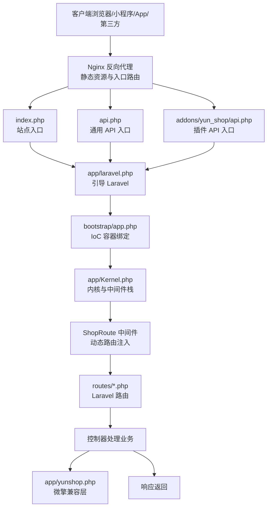
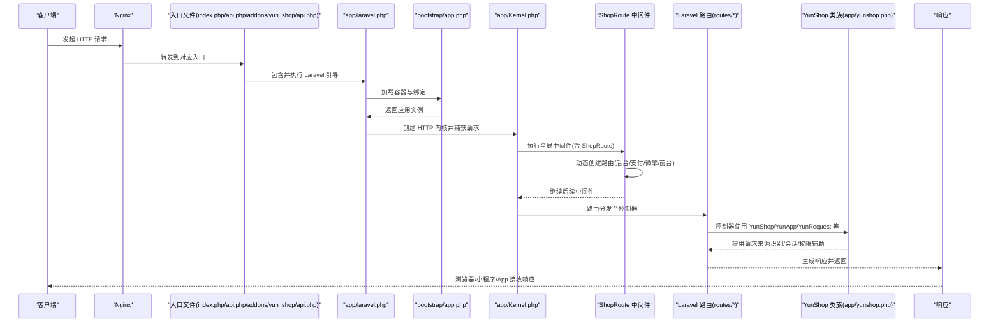
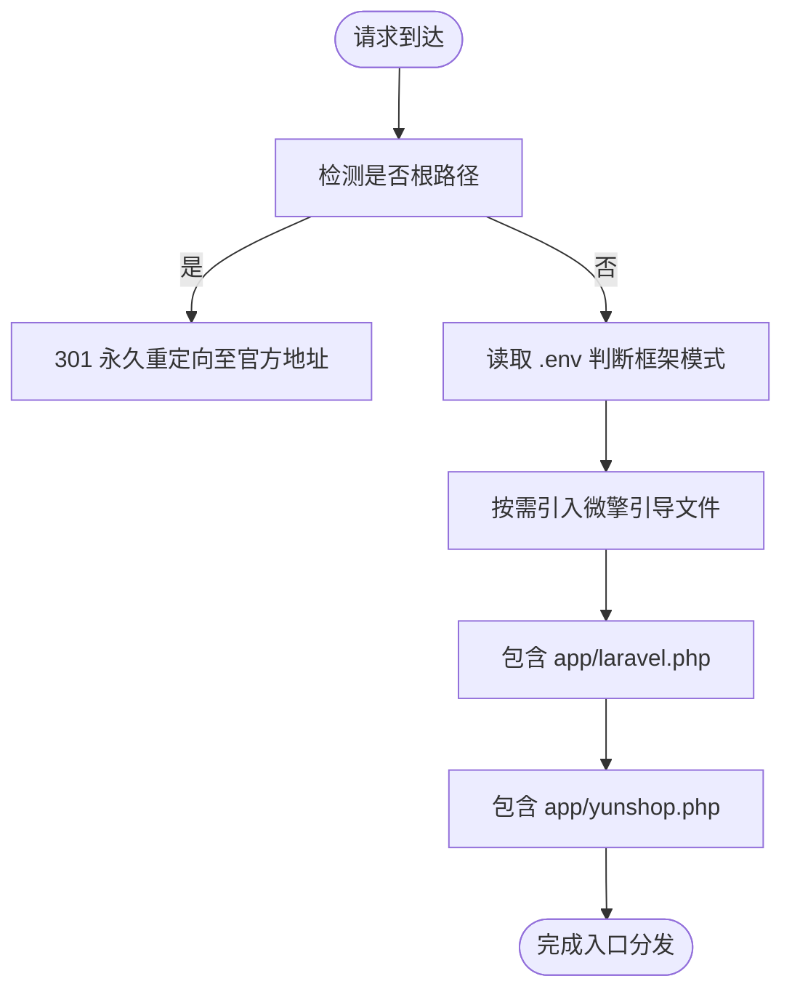
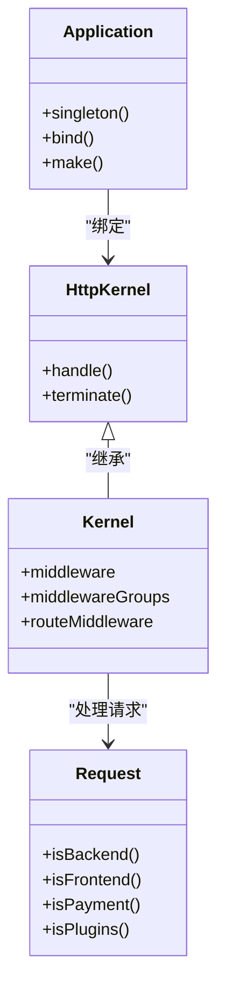
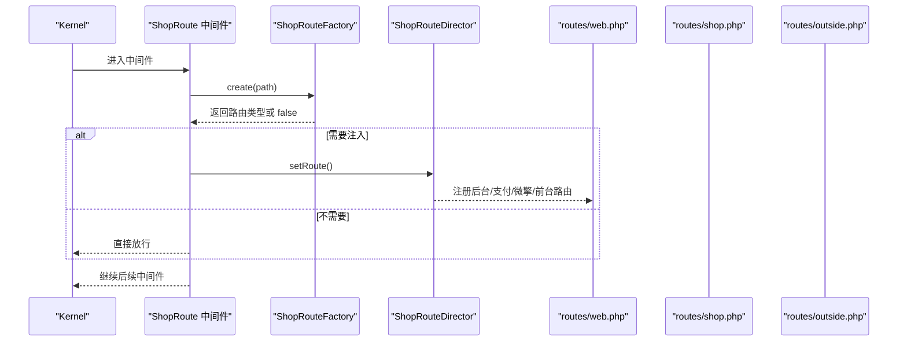
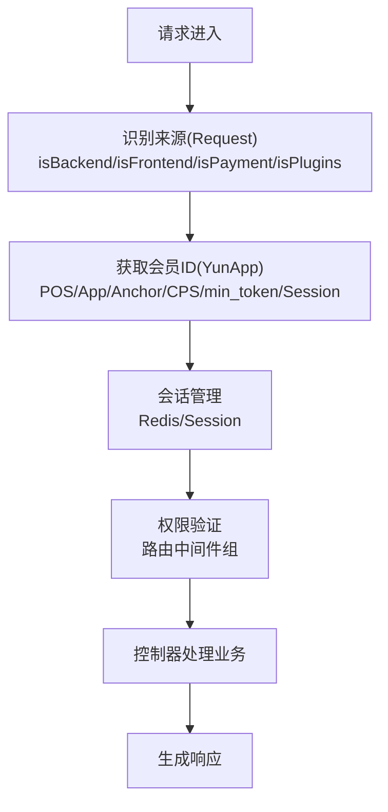
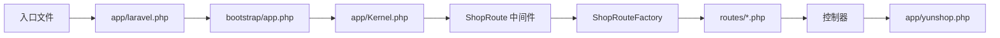

# 请求生命周期

<cite>
**本文引用的文件**   
- [index.php](file://index.php)
- [app/laravel.php](file://app/laravel.php)
- [bootstrap/app.php](file://bootstrap/app.php)
- [app/Kernel.php](file://app/Kernel.php)
- [app/framework/Http/Request.php](file://app/framework/Http/Request.php)
- [app/common/middleware/ShopRoute.php](file://app/common/middleware/ShopRoute.php)
- [app/common/route/ShopRouteFactory.php](file://app/common/route/ShopRouteFactory.php)
- [routes/web.php](file://routes/web.php)
- [routes/shop.php](file://routes/shop.php)
- [routes/outside.php](file://routes/outside.php)
- [app/yunshop.php](file://app/yunshop.php)
- [addons/yun_shop/api.php](file://addons/yun_shop/api.php)
- [api.php](file://api.php)
</cite>

## 目录
1. [引言](#引言)
2. [项目结构](#项目结构)
3. [核心组件](#核心组件)
4. [架构总览](#架构总览)
5. [详细组件分析](#详细组件分析)
6. [依赖关系分析](#依赖关系分析)
7. [性能考量](#性能考量)
8. [故障排查指南](#故障排查指南)
9. [结论](#结论)
10. [附录](#附录)

## 引言
本文件面向芸众商城（基于 Laravel 的多入口系统），系统性梳理“请求从进入 Nginx 到最终响应返回”的完整生命周期，重点覆盖：
- 入口文件与多入口分发机制
- Laravel 内核调度与中间件链路
- 路由分发与微擎兼容层协作
- 请求参数解析、会话管理、权限验证、异常处理
- 时序图与流程图，帮助读者快速定位问题与优化路径

## 项目结构
芸众商城采用“多入口 + 微擎兼容层 + Laravel 内核”的混合架构：
- Nginx 将不同路径映射到不同入口：站点首页、支付模块、插件 API、外部开放接口等
- 入口文件统一加载 Laravel 应用与微擎兼容层（YunShop）
- Laravel 内核负责全局中间件栈、路由注册与响应发送
- 微擎兼容层通过 YunShop 类族识别请求来源（后台、前台、App、微信、支付、插件等），并提供请求对象、应用上下文、会话与权限辅助

图表来源
- [index.php:1-15](file://index.php#L1-L15)
- [api.php:1-22](file://api.php#L1-L22)
- [addons/yun_shop/api.php:1-22](file://addons/yun_shop/api.php#L1-L22)
- [app/laravel.php:1-50](file://app/laravel.php#L1-L50)
- [bootstrap/app.php:1-63](file://bootstrap/app.php#L1-L63)
- [app/Kernel.php:1-78](file://app/Kernel.php#L1-L78)
- [app/common/middleware/ShopRoute.php:1-28](file://app/common/middleware/ShopRoute.php#L1-L28)
- [routes/web.php:1-17](file://routes/web.php#L1-L17)
- [routes/shop.php:1-9](file://routes/shop.php#L1-L9)
- [routes/outside.php:1-41](file://routes/outside.php#L1-L41)
- [app/yunshop.php:1-621](file://app/yunshop.php#L1-L621)

章节来源
- [index.php:1-15](file://index.php#L1-L15)
- [api.php:1-22](file://api.php#L1-L22)
- [addons/yun_shop/api.php:1-22](file://addons/yun_shop/api.php#L1-L22)
- [app/laravel.php:1-50](file://app/laravel.php#L1-L50)
- [bootstrap/app.php:1-63](file://bootstrap/app.php#L1-L63)
- [app/Kernel.php:1-78](file://app/Kernel.php#L1-L78)
- [app/common/middleware/ShopRoute.php:1-28](file://app/common/middleware/ShopRoute.php#L1-L28)
- [app/common/route/ShopRouteFactory.php:1-51](file://app/common/route/ShopRouteFactory.php#L1-L51)
- [routes/web.php:1-17](file://routes/web.php#L1-L17)
- [routes/shop.php:1-9](file://routes/shop.php#L1-L9)
- [routes/outside.php:1-41](file://routes/outside.php#L1-L41)
- [app/yunshop.php:1-621](file://app/yunshop.php#L1-L621)

## 核心组件
- 入口与多入口分发
  - index.php：首页重定向与统一引入 Laravel 与 YunShop
  - api.php：通用 API 入口，支持微擎环境变量判断与框架引导
  - addons/yun_shop/api.php：插件 API 入口，与 api.php 类似但路径扩展
- Laravel 引导与内核
  - app/laravel.php：加载 Composer 自动加载器、引导应用、调用内核处理请求、发送响应
  - bootstrap/app.php：创建应用实例、绑定内核、控制台内核、异常处理器、请求别名
  - app/Kernel.php：定义全局中间件栈、路由组中间件、路由级中间件
- 请求对象与识别
  - app/framework/Http/Request.php：识别后台/前端/支付/插件/Cron 等场景，提供 HTTPS/Host 规则
- 路由与微擎兼容层
  - app/common/middleware/ShopRoute.php：动态注入路由（后台、支付、微擎后台、前台）
  - app/common/route/ShopRouteFactory.php：根据路径与请求 URI 分派具体路由类型
  - routes/web.php、routes/shop.php、routes/outside.php：Laravel 路由注册
  - app/yunshop.php：YunShop 类族（YunShop、YunApp、YunRequest、YunPlugin、YunNotice 等）提供请求来源识别、路由定位、会话与权限辅助

章节来源
- [index.php:1-15](file://index.php#L1-L15)
- [api.php:1-22](file://api.php#L1-L22)
- [addons/yun_shop/api.php:1-22](file://addons/yun_shop/api.php#L1-L22)
- [app/laravel.php:1-50](file://app/laravel.php#L1-L50)
- [bootstrap/app.php:1-63](file://bootstrap/app.php#L1-L63)
- [app/Kernel.php:1-78](file://app/Kernel.php#L1-L78)
- [app/framework/Http/Request.php:1-111](file://app/framework/Http/Request.php#L1-L111)
- [app/common/middleware/ShopRoute.php:1-28](file://app/common/middleware/ShopRoute.php#L1-L28)
- [app/common/route/ShopRouteFactory.php:1-51](file://app/common/route/ShopRouteFactory.php#L1-L51)
- [routes/web.php:1-17](file://routes/web.php#L1-L17)
- [routes/shop.php:1-9](file://routes/shop.php#L1-L9)
- [routes/outside.php:1-41](file://routes/outside.php#L1-L41)
- [app/yunshop.php:1-621](file://app/yunshop.php#L1-L621)

## 架构总览
下图展示从 Nginx 到响应的关键交互与职责划分：

图表来源
- [index.php:1-15](file://index.php#L1-L15)
- [api.php:1-22](file://api.php#L1-L22)
- [addons/yun_shop/api.php:1-22](file://addons/yun_shop/api.php#L1-L22)
- [app/laravel.php:1-50](file://app/laravel.php#L1-L50)
- [bootstrap/app.php:1-63](file://bootstrap/app.php#L1-L63)
- [app/Kernel.php:1-78](file://app/Kernel.php#L1-L78)
- [app/common/middleware/ShopRoute.php:1-28](file://app/common/middleware/ShopRoute.php#L1-L28)
- [app/common/route/ShopRouteFactory.php:1-51](file://app/common/route/ShopRouteFactory.php#L1-L51)
- [routes/web.php:1-17](file://routes/web.php#L1-L17)
- [routes/shop.php:1-9](file://routes/shop.php#L1-L9)
- [routes/outside.php:1-41](file://routes/outside.php#L1-L41)
- [app/yunshop.php:1-621](file://app/yunshop.php#L1-L621)

## 详细组件分析

### 入口与多入口分发
- index.php
  - 对根路径进行 301 永久重定向，并包含官方入口与 YunShop
  - 作为站点主入口，统一引入 Laravel 与 YunShop
- api.php 与 addons/yun_shop/api.php
  - 读取 .env 并判断是否为云商店框架模式
  - 在非云商店模式下引入微擎引导文件
  - 统一包含 app/laravel.php 与 app/yunshop.php，完成 Laravel 引导与微擎兼容层初始化

图表来源
- [index.php:1-15](file://index.php#L1-L15)
- [api.php:1-22](file://api.php#L1-L22)
- [addons/yun_shop/api.php:1-22](file://addons/yun_shop/api.php#L1-L22)

章节来源
- [index.php:1-15](file://index.php#L1-L15)
- [api.php:1-22](file://api.php#L1-L22)
- [addons/yun_shop/api.php:1-22](file://addons/yun_shop/api.php#L1-L22)

### Laravel 引导与内核
- app/laravel.php
  - 加载 Composer 自动加载器
  - 引导应用实例，创建 HTTP 内核，捕获请求并交由内核处理，发送响应并终止内核
- bootstrap/app.php
  - 创建应用实例，绑定日志门面、HTTP/Console 内核、异常处理器
  - 绑定自定义请求类，便于后续识别与扩展
- app/Kernel.php
  - 全局中间件：维护模式检查、ShopRoute
  - 中间件组：web/admin/api/business
  - 路由中间件：认证、权限、业务登录等

图表来源
- [bootstrap/app.php:1-63](file://bootstrap/app.php#L1-L63)
- [app/Kernel.php:1-78](file://app/Kernel.php#L1-L78)
- [app/laravel.php:1-50](file://app/laravel.php#L1-L50)
- [app/framework/Http/Request.php:1-111](file://app/framework/Http/Request.php#L1-L111)

章节来源
- [app/laravel.php:1-50](file://app/laravel.php#L1-L50)
- [bootstrap/app.php:1-63](file://bootstrap/app.php#L1-L63)
- [app/Kernel.php:1-78](file://app/Kernel.php#L1-L78)
- [app/framework/Http/Request.php:1-111](file://app/framework/Http/Request.php#L1-L111)

### 路由与微擎兼容层协作
- app/common/middleware/ShopRoute.php
  - 在 handle 中创建 ShopRouteFactory，依据请求路径与 URI 判定路由类型
  - 通过 ShopRouteDirector 注入相应路由（后台、支付、微擎后台、前台）
- app/common/route/ShopRouteFactory.php
  - 根据路径与请求 URI 返回具体路由实现或 false
  - 例如：admin/shop -> 后台路由；/ 且包含 /payment/ -> 支付路由；/ 且包含 /web/index.php -> 微擎后台路由；默认前台路由
- routes/web.php、routes/shop.php、routes/outside.php
  - web.php：微擎路由占位
  - shop.php：后台路由组，结合中间件链
  - outside.php：对外开放接口路由组（会员、商品、订单、优惠券、资产）

图表来源
- [app/common/middleware/ShopRoute.php:1-28](file://app/common/middleware/ShopRoute.php#L1-L28)
- [app/common/route/ShopRouteFactory.php:1-51](file://app/common/route/ShopRouteFactory.php#L1-L51)
- [routes/web.php:1-17](file://routes/web.php#L1-L17)
- [routes/shop.php:1-9](file://routes/shop.php#L1-L9)
- [routes/outside.php:1-41](file://routes/outside.php#L1-L41)

章节来源
- [app/common/middleware/ShopRoute.php:1-28](file://app/common/middleware/ShopRoute.php#L1-L28)
- [app/common/route/ShopRouteFactory.php:1-51](file://app/common/route/ShopRouteFactory.php#L1-L51)
- [routes/web.php:1-17](file://routes/web.php#L1-L17)
- [routes/shop.php:1-9](file://routes/shop.php#L1-L9)
- [routes/outside.php:1-41](file://routes/outside.php#L1-L41)

### 请求参数解析、会话管理与权限验证
- 请求来源识别
  - app/framework/Http/Request.php 提供 isBackend/isFrontend/isPayment/isPlugins/isCron 等方法，用于区分请求场景
- 会话与用户标识
  - app/yunshop.php 中的 YunApp::getMemberId 优先从 POS 场景、App 类型、Anchor/CPS 场景、min_token、Session 获取会员 ID
  - 使用 Redis 读取会话键值并反序列化提取会员信息
- 权限与认证
  - app/Kernel.php 定义了多种路由中间件（如 Authenticate、AuthenticateAdmin、AuthenticateShop、AuthenticateFrontend 等）
  - routes/shop.php 使用 auth:admin、authAdmin、authShop 中间件组，确保后台访问安全

图表来源
- [app/framework/Http/Request.php:1-111](file://app/framework/Http/Request.php#L1-L111)
- [app/yunshop.php:490-564](file://app/yunshop.php#L490-L564)
- [app/Kernel.php:66-76](file://app/Kernel.php#L66-L76)
- [routes/shop.php:2-8](file://routes/shop.php#L2-L8)

章节来源
- [app/framework/Http/Request.php:1-111](file://app/framework/Http/Request.php#L1-L111)
- [app/yunshop.php:490-564](file://app/yunshop.php#L490-L564)
- [app/Kernel.php:66-76](file://app/Kernel.php#L66-L76)
- [routes/shop.php:2-8](file://routes/shop.php#L2-L8)

### 异常处理
- bootstrap/app.php 将异常处理器绑定为 app/common/exceptions/Handler
- Laravel 默认异常处理机制会在内核 terminate 阶段统一处理未捕获异常并输出响应

章节来源
- [bootstrap/app.php:46-48](file://bootstrap/app.php#L46-L48)
- [app/laravel.php:49](file://app/laravel.php#L49)

## 依赖关系分析
- 入口文件依赖 Laravel 引导与 YunShop
- Laravel 引导依赖容器绑定与内核
- 内核依赖中间件栈与路由
- ShopRoute 中间件依赖路由工厂与路由导演
- 控制器依赖 YunShop 类族提供的上下文与会话

图表来源
- [index.php:1-15](file://index.php#L1-L15)
- [api.php:1-22](file://api.php#L1-L22)
- [addons/yun_shop/api.php:1-22](file://addons/yun_shop/api.php#L1-L22)
- [app/laravel.php:1-50](file://app/laravel.php#L1-L50)
- [bootstrap/app.php:1-63](file://bootstrap/app.php#L1-L63)
- [app/Kernel.php:1-78](file://app/Kernel.php#L1-L78)
- [app/common/middleware/ShopRoute.php:1-28](file://app/common/middleware/ShopRoute.php#L1-L28)
- [app/common/route/ShopRouteFactory.php:1-51](file://app/common/route/ShopRouteFactory.php#L1-L51)
- [routes/web.php:1-17](file://routes/web.php#L1-L17)
- [routes/shop.php:1-9](file://routes/shop.php#L1-L9)
- [routes/outside.php:1-41](file://routes/outside.php#L1-L41)
- [app/yunshop.php:1-621](file://app/yunshop.php#L1-L621)

章节来源
- [index.php:1-15](file://index.php#L1-L15)
- [api.php:1-22](file://api.php#L1-L22)
- [addons/yun_shop/api.php:1-22](file://addons/yun_shop/api.php#L1-L22)
- [app/laravel.php:1-50](file://app/laravel.php#L1-L50)
- [bootstrap/app.php:1-63](file://bootstrap/app.php#L1-L63)
- [app/Kernel.php:1-78](file://app/Kernel.php#L1-L78)
- [app/common/middleware/ShopRoute.php:1-28](file://app/common/middleware/ShopRoute.php#L1-L28)
- [app/common/route/ShopRouteFactory.php:1-51](file://app/common/route/ShopRouteFactory.php#L1-L51)
- [routes/web.php:1-17](file://routes/web.php#L1-L17)
- [routes/shop.php:1-9](file://routes/shop.php#L1-L9)
- [routes/outside.php:1-41](file://routes/outside.php#L1-L41)
- [app/yunshop.php:1-621](file://app/yunshop.php#L1-L621)

## 性能考量
- 中间件链路尽量轻量：ShopRoute 仅在必要时注入路由，避免重复注册
- 会话读取：min_token 与 Redis 读取应配合缓存策略，减少序列化与反序列化开销
- HTTPS/Host 规则查询：尽量缓存站点设置，避免每次请求都访问数据库
- 路由注册：后台/支付/微擎/前台路由按需注入，避免不必要的路由扫描

## 故障排查指南
- 入口文件无法加载
  - 检查 .env 是否存在且包含 APP_Framework 标识
  - 确认微擎引导文件路径正确（非云商店模式才需要）
- 路由不生效
  - 检查 ShopRouteFactory 的路径与 URI 判定条件
  - 确认 ShopRouteDirector 已成功 setRoute
- 会话与权限异常
  - 核对 min_token 与 Redis 键空间
  - 检查路由中间件组配置与控制器权限注解
- HTTPS/Host 异常
  - 检查站点设置表与 getScheme/getHost 逻辑

章节来源
- [api.php:1-22](file://api.php#L1-L22)
- [addons/yun_shop/api.php:1-22](file://addons/yun_shop/api.php#L1-L22)
- [app/common/route/ShopRouteFactory.php:18-50](file://app/common/route/ShopRouteFactory.php#L18-L50)
- [app/common/middleware/ShopRoute.php:18-26](file://app/common/middleware/ShopRoute.php#L18-L26)
- [app/yunshop.php:517-561](file://app/yunshop.php#L517-L561)
- [app/Kernel.php:66-76](file://app/Kernel.php#L66-L76)
- [app/framework/Http/Request.php:72-100](file://app/framework/Http/Request.php#L72-L100)

## 结论
芸众商城通过“多入口 + 微擎兼容层 + Laravel 内核”的组合，在保持历史兼容的同时实现了现代化的请求处理能力。YunShop 类在请求生命周期中承担了请求来源识别、会话与权限辅助的关键角色；ShopRoute 中间件与工厂模式实现了灵活的动态路由注入。建议在生产环境中关注中间件链路与会话读取的性能，并持续优化路由注册与异常处理策略。

## 附录
- 关键文件清单
  - 入口：index.php、api.php、addons/yun_shop/api.php
  - 引导：app/laravel.php、bootstrap/app.php
  - 内核：app/Kernel.php
  - 请求识别：app/framework/Http/Request.php
  - 路由注入：app/common/middleware/ShopRoute.php、app/common/route/ShopRouteFactory.php
  - 路由注册：routes/web.php、routes/shop.php、routes/outside.php
  - 兼容层：app/yunshop.php