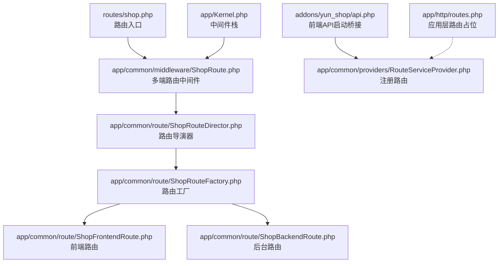
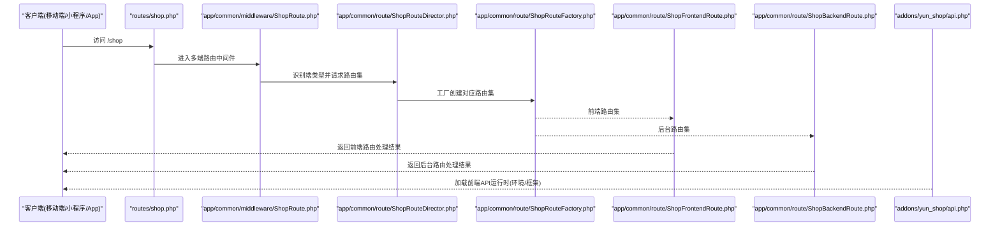
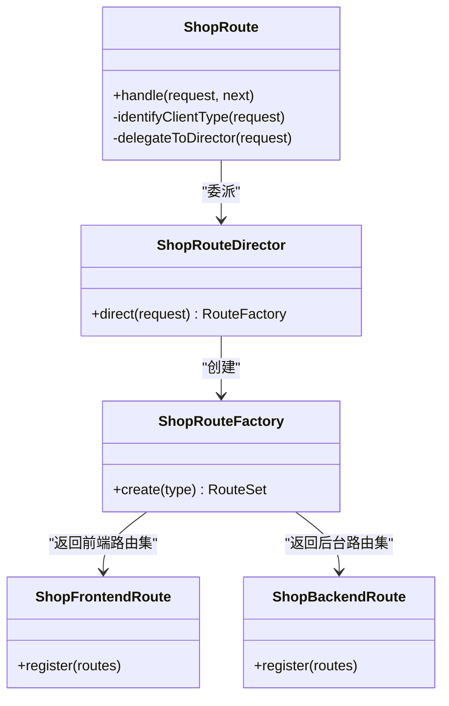
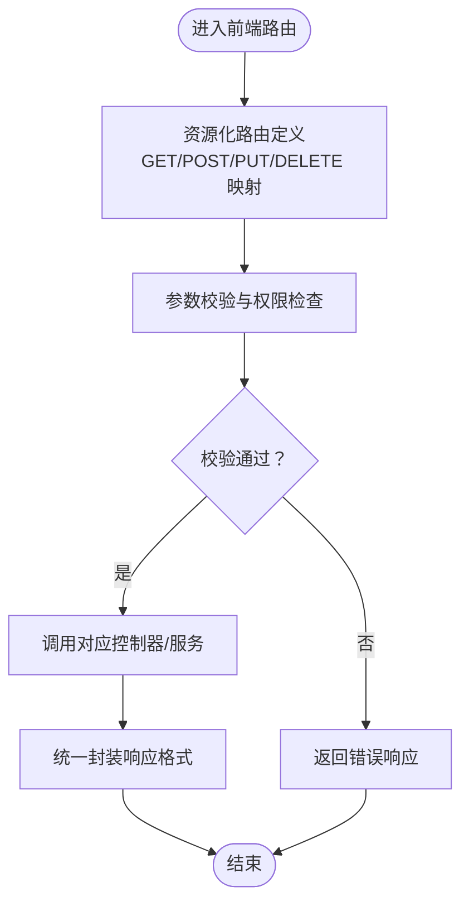
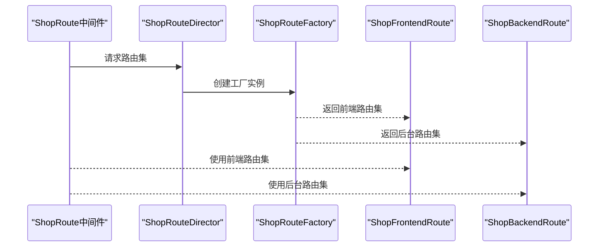
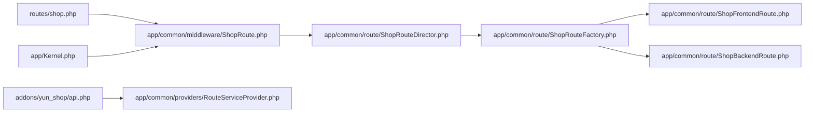

# 前端商城路由

<cite>
**本文引用的文件**
- [routes/shop.php](file://routes/shop.php)
- [addons/yun_shop/api.php](file://addons/yun_shop/api.php)
- [addons/yun_shop/shopConfig.js](file://addons/yun_shop/shopConfig.js)
- [app/common/middleware/ShopRoute.php](file://app/common/middleware/ShopRoute.php)
- [app/common/route/ShopFrontendRoute.php](file://app/common/route/ShopFrontendRoute.php)
- [app/common/route/ShopBackendRoute.php](file://app/common/route/ShopBackendRoute.php)
- [app/common/route/ShopRouteDirector.php](file://app/common/route/ShopRouteDirector.php)
- [app/common/route/ShopRouteFactory.php](file://app/common/route/ShopRouteFactory.php)
- [app/common/route/AbstractShopRoute.php](file://app/common/route/AbstractShopRoute.php)
- [app/common/route/Contracts/ShopRoute.php](file://app/common/route/Contracts/ShopRoute.php)
- [app/Kernel.php](file://app/Kernel.php)
- [app/common/providers/RouteServiceProvider.php](file://app/common/providers/RouteServiceProvider.php)
- [app/http/routes.php](file://app/http/routes.php)
</cite>

## 目录
1. [引言](#引言)
2. [项目结构](#项目结构)
3. [核心组件](#核心组件)
4. [架构总览](#架构总览)
5. [详细组件分析](#详细组件分析)
6. [依赖分析](#依赖分析)
7. [性能考虑](#性能考虑)
8. [故障排查指南](#故障排查指南)
9. [结论](#结论)
10. [附录](#附录)

## 引言
本文件面向芸众商城前端路由体系，聚焦 shop.php 路由入口的设计理念与多端（移动端、小程序、App 等）统一路由管理策略。文档从路由组织、前后端映射、RESTful 应用实践、参数校验与中间件、响应格式标准化等方面进行系统化梳理，并提供扩展与多端适配的开发指南。

## 项目结构
围绕前端商城路由的关键位置如下：
- 路由入口与分发：routes/shop.php
- 多端路由工厂与调度：app/common/route/* 与 app/common/middleware/ShopRoute.php
- 前端 API 启动桥接：addons/yun_shop/api.php
- 配置与环境：addons/yun_shop/shopConfig.js
- 中间件注册：app/Kernel.php
- 路由服务提供者：app/common/providers/RouteServiceProvider.php
- 应用层路由占位：app/http/routes.php

图表来源
- [routes/shop.php:1-9](file://routes/shop.php#L1-L9)
- [app/common/middleware/ShopRoute.php](file://app/common/middleware/ShopRoute.php)
- [app/common/route/ShopRouteDirector.php](file://app/common/route/ShopRouteDirector.php)
- [app/common/route/ShopRouteFactory.php](file://app/common/route/ShopRouteFactory.php)
- [app/common/route/ShopFrontendRoute.php](file://app/common/route/ShopFrontendRoute.php)
- [app/common/route/ShopBackendRoute.php](file://app/common/route/ShopBackendRoute.php)
- [addons/yun_shop/api.php:1-22](file://addons/yun_shop/api.php#L1-L22)
- [app/common/providers/RouteServiceProvider.php](file://app/common/providers/RouteServiceProvider.php)
- [app/Kernel.php:21](file://app/Kernel.php#L21)
- [app/http/routes.php:1-12](file://app/http/routes.php#L1-L12)

章节来源
- [routes/shop.php:1-9](file://routes/shop.php#L1-L9)
- [addons/yun_shop/api.php:1-22](file://addons/yun_shop/api.php#L1-L22)
- [app/Kernel.php:21](file://app/Kernel.php#L21)
- [app/common/providers/RouteServiceProvider.php](file://app/common/providers/RouteServiceProvider.php)
- [app/http/routes.php:1-12](file://app/http/routes.php#L1-L12)

## 核心组件
- 多端路由中间件：负责识别请求来源（移动端/小程序/App），并委派到对应路由集合。
- 路由导演器与工厂：根据上下文选择合适的路由集，解耦不同端点的路由定义。
- 前端/后台路由实现：分别承载前端业务路由与后台管理路由。
- 前端 API 启动桥接：在 addons/yun_shop 下加载框架与应用，确保路由与服务可用。
- 中间件注册：通过 Kernel 将多端路由中间件纳入全局处理链。

章节来源
- [app/common/middleware/ShopRoute.php](file://app/common/middleware/ShopRoute.php)
- [app/common/route/ShopRouteDirector.php](file://app/common/route/ShopRouteDirector.php)
- [app/common/route/ShopRouteFactory.php](file://app/common/route/ShopRouteFactory.php)
- [app/common/route/ShopFrontendRoute.php](file://app/common/route/ShopFrontendRoute.php)
- [app/common/route/ShopBackendRoute.php](file://app/common/route/ShopBackendRoute.php)
- [addons/yun_shop/api.php:1-22](file://addons/yun_shop/api.php#L1-L22)
- [app/Kernel.php:21](file://app/Kernel.php#L21)

## 架构总览
下图展示了从入口到多端路由分发的整体流程，以及前端 API 的启动桥接路径。

图表来源
- [routes/shop.php:1-9](file://routes/shop.php#L1-L9)
- [app/common/middleware/ShopRoute.php](file://app/common/middleware/ShopRoute.php)
- [app/common/route/ShopRouteDirector.php](file://app/common/route/ShopRouteDirector.php)
- [app/common/route/ShopRouteFactory.php](file://app/common/route/ShopRouteFactory.php)
- [app/common/route/ShopFrontendRoute.php](file://app/common/route/ShopFrontendRoute.php)
- [app/common/route/ShopBackendRoute.php](file://app/common/route/ShopBackendRoute.php)
- [addons/yun_shop/api.php:1-22](file://addons/yun_shop/api.php#L1-L22)

## 详细组件分析

### 组件A：多端路由中间件（ShopRoute）
职责
- 在进入具体路由前，解析请求来源（如移动端、小程序、App），并决定后续路由分发策略。
- 与路由导演器协作，将请求委派给对应的路由工厂与路由集。

关键行为
- 参数来源识别与上下文注入
- 与路由导演器/工厂的交互协议
- 与前端/后台路由集的衔接

图表来源
- [app/common/middleware/ShopRoute.php](file://app/common/middleware/ShopRoute.php)
- [app/common/route/ShopRouteDirector.php](file://app/common/route/ShopRouteDirector.php)
- [app/common/route/ShopRouteFactory.php](file://app/common/route/ShopRouteFactory.php)
- [app/common/route/ShopFrontendRoute.php](file://app/common/route/ShopFrontendRoute.php)
- [app/common/route/ShopBackendRoute.php](file://app/common/route/ShopBackendRoute.php)

章节来源
- [app/common/middleware/ShopRoute.php](file://app/common/middleware/ShopRoute.php)
- [app/common/route/ShopRouteDirector.php](file://app/common/route/ShopRouteDirector.php)
- [app/common/route/ShopRouteFactory.php](file://app/common/route/ShopRouteFactory.php)
- [app/common/route/ShopFrontendRoute.php](file://app/common/route/ShopFrontendRoute.php)
- [app/common/route/ShopBackendRoute.php](file://app/common/route/ShopBackendRoute.php)

### 组件B：前端路由组织（ShopFrontendRoute）
职责
- 定义前端核心业务模块的路由集合，覆盖商品展示、购物车、订单处理、会员中心等。
- 与控制器/服务层对接，保证 RESTful 风格的资源化访问。

典型模块
- 商品模块：列表、详情、分类、搜索、评价
- 购物车模块：增删改查、结算
- 订单模块：下单、支付、物流、售后
- 会员模块：资料、等级、优惠券、账户流水

处理逻辑
- 资源化命名与 HTTP 方法映射
- 参数校验与权限控制
- 统一响应格式封装

图表来源
- [app/common/route/ShopFrontendRoute.php](file://app/common/route/ShopFrontendRoute.php)

章节来源
- [app/common/route/ShopFrontendRoute.php](file://app/common/route/ShopFrontendRoute.php)

### 组件C：后台路由组织（ShopBackendRoute）
职责
- 提供后台管理所需的路由集合，用于运营与管理操作。
- 与后台控制器/模型对接，遵循后台权限与审计要求。

章节来源
- [app/common/route/ShopBackendRoute.php](file://app/common/route/ShopBackendRoute.php)

### 组件D：路由导演器与工厂（ShopRouteDirector / ShopRouteFactory）
职责
- 导演器根据请求上下文选择合适的路由工厂
- 工厂创建并返回对应端的路由集（前端或后台）

图表来源
- [app/common/route/ShopRouteDirector.php](file://app/common/route/ShopRouteDirector.php)
- [app/common/route/ShopRouteFactory.php](file://app/common/route/ShopRouteFactory.php)
- [app/common/route/ShopFrontendRoute.php](file://app/common/route/ShopFrontendRoute.php)
- [app/common/route/ShopBackendRoute.php](file://app/common/route/ShopBackendRoute.php)

章节来源
- [app/common/route/ShopRouteDirector.php](file://app/common/route/ShopRouteDirector.php)
- [app/common/route/ShopRouteFactory.php](file://app/common/route/ShopRouteFactory.php)
- [app/common/route/ShopFrontendRoute.php](file://app/common/route/ShopFrontendRoute.php)
- [app/common/route/ShopBackendRoute.php](file://app/common/route/ShopBackendRoute.php)

### 组件E：前端API启动桥接（addons/yun_shop/api.php）
职责
- 在 addons/yun_shop 下加载框架与应用，确保前端路由与服务可用。
- 支持不同部署形态下的环境检测与引导。

章节来源
- [addons/yun_shop/api.php:1-22](file://addons/yun_shop/api.php#L1-L22)

### 组件F：入口路由（routes/shop.php）
职责
- 作为多端路由的统一入口，配合中间件完成端类型识别与路由委派。
- 若未满足特定条件则重定向至首页。

章节来源
- [routes/shop.php:1-9](file://routes/shop.php#L1-L9)

## 依赖分析
- 入口依赖：routes/shop.php 依赖多端路由中间件
- 中间件依赖：ShopRoute 依赖导演器与工厂
- 工厂依赖：根据端类型返回前端或后台路由集
- 前端路由依赖：ShopFrontendRoute 依赖控制器/服务层
- 启动桥接：addons/yun_shop/api.php 依赖框架与应用引导文件

图表来源
- [routes/shop.php:1-9](file://routes/shop.php#L1-L9)
- [app/common/middleware/ShopRoute.php](file://app/common/middleware/ShopRoute.php)
- [app/common/route/ShopRouteDirector.php](file://app/common/route/ShopRouteDirector.php)
- [app/common/route/ShopRouteFactory.php](file://app/common/route/ShopRouteFactory.php)
- [app/common/route/ShopFrontendRoute.php](file://app/common/route/ShopFrontendRoute.php)
- [app/common/route/ShopBackendRoute.php](file://app/common/route/ShopBackendRoute.php)
- [addons/yun_shop/api.php:1-22](file://addons/yun_shop/api.php#L1-L22)
- [app/common/providers/RouteServiceProvider.php](file://app/common/providers/RouteServiceProvider.php)
- [app/Kernel.php:21](file://app/Kernel.php#L21)

章节来源
- [routes/shop.php:1-9](file://routes/shop.php#L1-L9)
- [app/common/middleware/ShopRoute.php](file://app/common/middleware/ShopRoute.php)
- [app/common/route/ShopRouteDirector.php](file://app/common/route/ShopRouteDirector.php)
- [app/common/route/ShopRouteFactory.php](file://app/common/route/ShopRouteFactory.php)
- [app/common/route/ShopFrontendRoute.php](file://app/common/route/ShopFrontendRoute.php)
- [app/common/route/ShopBackendRoute.php](file://app/common/route/ShopBackendRoute.php)
- [addons/yun_shop/api.php:1-22](file://addons/yun_shop/api.php#L1-L22)
- [app/common/providers/RouteServiceProvider.php](file://app/common/providers/RouteServiceProvider.php)
- [app/Kernel.php:21](file://app/Kernel.php#L21)

## 性能考虑
- 路由缓存：建议在生产环境启用路由缓存以减少启动开销。
- 中间件链路：保持中间件数量精简，避免重复解析端类型。
- 路由分组：按模块与端类型分组，降低匹配复杂度。
- 响应序列化：统一封装响应格式，减少前端解析成本。

## 故障排查指南
常见问题与定位
- 路由不生效：检查入口路由是否正确加载，确认中间件是否注册。
- 端类型识别失败：核对中间件的端类型识别逻辑与请求头/参数。
- 前端API不可用：确认 addons/yun_shop/api.php 的环境检测与引导路径。
- 权限与校验异常：核查参数校验规则与权限中间件顺序。

章节来源
- [routes/shop.php:1-9](file://routes/shop.php#L1-L9)
- [app/common/middleware/ShopRoute.php](file://app/common/middleware/ShopRoute.php)
- [addons/yun_shop/api.php:1-22](file://addons/yun_shop/api.php#L1-L22)

## 结论
本路由体系通过“入口路由 + 多端中间件 + 路由导演器/工厂 + 前后端路由集”的分层设计，实现了移动端、小程序、App 等多端的统一管理与灵活扩展。结合 RESTful 设计与统一响应格式，既保证了接口一致性，也为后续功能迭代提供了清晰的扩展路径。

## 附录

### 开发指南：扩展前端路由
- 新增模块路由：在前端路由集中新增资源化路由定义，遵循 GET/POST/PUT/DELETE 映射。
- 参数校验：在控制器或专用校验层中实现参数校验与权限检查。
- 响应格式：使用统一响应封装，确保字段一致与错误码规范。
- 中间件应用：在需要的地方挂载权限与校验中间件，保持中间件链路清晰。

章节来源
- [app/common/route/ShopFrontendRoute.php](file://app/common/route/ShopFrontendRoute.php)

### 多端适配要点
- 端类型识别：在中间件中完善端类型判断逻辑，支持新端接入。
- 路由差异化：必要时在工厂层引入端特有路由集，避免过度耦合。
- 配置管理：通过配置文件或环境变量区分不同端的差异点（如域名、鉴权方式）。

章节来源
- [app/common/middleware/ShopRoute.php](file://app/common/middleware/ShopRoute.php)
- [app/common/route/ShopRouteFactory.php](file://app/common/route/ShopRouteFactory.php)