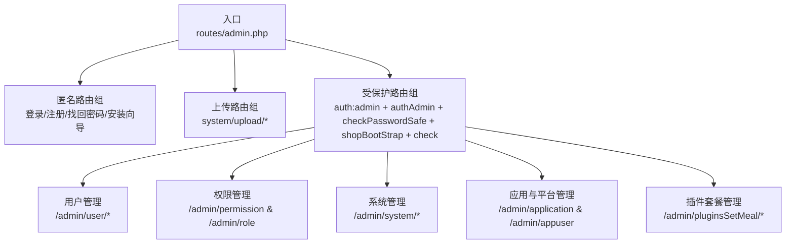
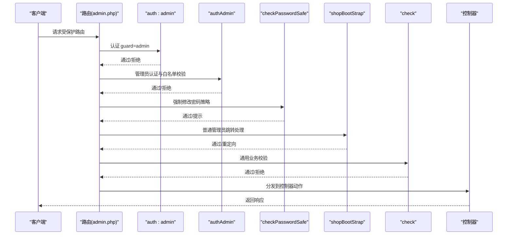
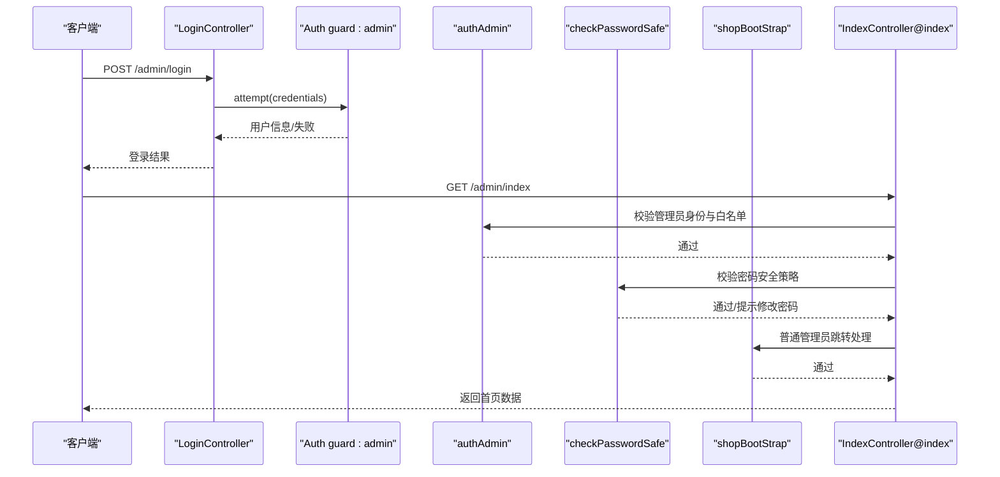
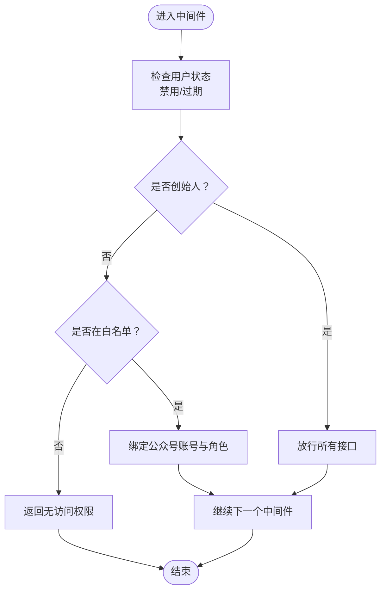
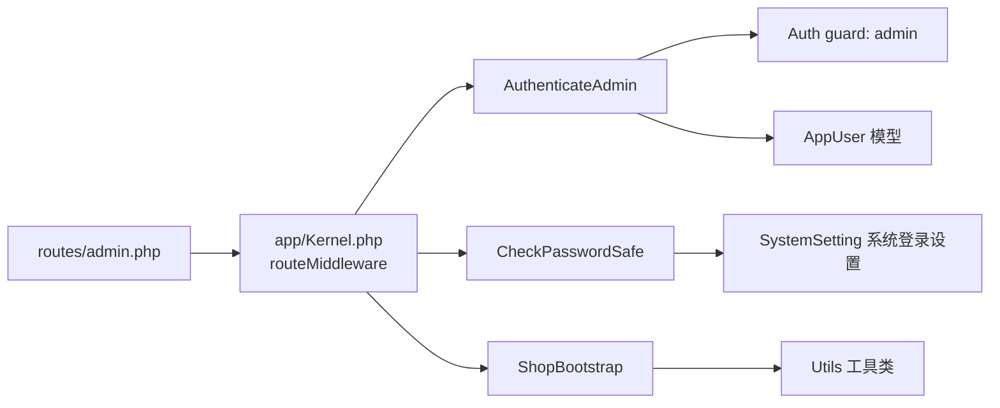

# 管理后台路由

<cite>
**本文引用的文件**
- [routes/admin.php](file://routes/admin.php)
- [app/Kernel.php](file://app/Kernel.php)
- [app/common/middleware/AuthenticateAdmin.php](file://app/common/middleware/AuthenticateAdmin.php)
- [app/common/middleware/CheckPasswordSafe.php](file://app/common/middleware/CheckPasswordSafe.php)
- [app/common/middleware/ShopBootstrap.php](file://app/common/middleware/ShopBootstrap.php)
- [app/platform/modules/user/controllers/AdminUserController.php](file://app/platform/modules/user/controllers/AdminUserController.php)
- [routes/web.php](file://routes/web.php)
</cite>

## 目录
1. [简介](#简介)
2. [项目结构](#项目结构)
3. [核心组件](#核心组件)
4. [架构总览](#架构总览)
5. [详细组件分析](#详细组件分析)
6. [依赖关系分析](#依赖关系分析)
7. [性能考量](#性能考量)
8. [故障排查指南](#故障排查指南)
9. [结论](#结论)
10. [附录：扩展与自定义开发指南](#附录扩展与自定义开发指南)

## 简介
本文件面向芸众商城管理后台的路由体系，围绕 admin.php 路由文件展开，系统性说明以下内容：
- 路由分组与命名规范：认证路由组、权限控制路由组、系统管理路由组等的组织方式
- 登录认证流程与权限验证机制：中间件链路、白名单机制、角色判定
- 中间件应用策略：auth:admin、authAdmin、checkPasswordSafe、shopBootStrap、check 的职责与顺序
- 功能模块路由组织：用户管理、权限管理、系统设置等模块的路由命名与 RESTful 设计原则
- 路由参数绑定与控制器映射：路径参数、请求方法与控制器动作的对应关系
- 扩展与自定义开发指南：如何基于现有中间件与命名规范进行二次开发

## 项目结构
管理后台路由主要集中在 routes/admin.php，配合全局内核 Kernel.php 注册的中间件组与路由中间件，形成“登录/注册/找回密码”、“上传”、“受保护业务模块”的三层路由组织。

图表来源
- [routes/admin.php:1-267](file://routes/admin.php#L1-L267)

章节来源
- [routes/admin.php:1-267](file://routes/admin.php#L1-L267)
- [routes/web.php:1-17](file://routes/web.php#L1-L17)

## 核心组件
- 路由分组与命名
  - 匿名路由组：登录、注册、验证码、找回密码、安装向导等，统一 namespace 为 platform\controllers
  - 上传路由组：system/upload 前缀，namespace 为 platform\modules\system\controllers
  - 受保护路由组：以 middleware 组合包裹，覆盖用户管理、权限管理、系统管理、应用与平台管理、插件套餐管理等模块
- 中间件组合
  - auth:admin：基于 Laravel 默认认证 guard=admin 的通用认证
  - authAdmin：管理员认证与权限白名单校验，区分创始人与普通管理员
  - checkPasswordSafe：强制修改密码策略与到期提醒
  - shopBootStrap：普通管理员自动跳转到其所属公众号的首页
  - check：通用业务校验中间件（具体逻辑在中间件内部实现）
- 控制器映射
  - 采用控制器@动作的方式，结合路由命名，便于前后端统一调用与菜单渲染

章节来源
- [routes/admin.php:1-267](file://routes/admin.php#L1-L267)
- [app/Kernel.php:66-76](file://app/Kernel.php#L66-L76)

## 架构总览
管理后台路由采用“前缀+命名空间+中间件组”的组织方式，确保：
- 明确的访问边界：匿名路由仅限于登录/注册/找回密码；受保护路由需通过多层中间件校验
- 清晰的功能域划分：用户、权限、系统、应用与平台、插件套餐等模块独立命名空间
- 可扩展的中间件链：按需插入新的中间件，不影响既有路由

图表来源
- [routes/admin.php:57-248](file://routes/admin.php#L57-L248)
- [app/common/middleware/AuthenticateAdmin.php:111-153](file://app/common/middleware/AuthenticateAdmin.php#L111-L153)
- [app/common/middleware/CheckPasswordSafe.php:19-47](file://app/common/middleware/CheckPasswordSafe.php#L19-L47)
- [app/common/middleware/ShopBootstrap.php:23-38](file://app/common/middleware/ShopBootstrap.php#L23-L38)

## 详细组件分析

### 认证与登录流程
- 登录/登出/注册/验证码/找回密码等路由位于匿名路由组，统一映射至 platform\controllers 下的 LoginController、RegisterController、ResetpwdController 等
- 登录成功后，后续访问受保护路由需通过 auth:admin 与 authAdmin 中间件链
- 首次登录或密码超过有效期时，checkPasswordSafe 中间件会触发强制修改密码流程

图表来源
- [routes/admin.php:2-46](file://routes/admin.php#L2-L46)
- [app/common/middleware/AuthenticateAdmin.php:111-153](file://app/common/middleware/AuthenticateAdmin.php#L111-L153)
- [app/common/middleware/CheckPasswordSafe.php:19-47](file://app/common/middleware/CheckPasswordSafe.php#L19-L47)
- [app/common/middleware/ShopBootstrap.php:23-38](file://app/common/middleware/ShopBootstrap.php#L23-L38)

章节来源
- [routes/admin.php:2-46](file://routes/admin.php#L2-L46)
- [app/common/middleware/AuthenticateAdmin.php:111-153](file://app/common/middleware/AuthenticateAdmin.php#L111-L153)
- [app/common/middleware/CheckPasswordSafe.php:19-47](file://app/common/middleware/CheckPasswordSafe.php#L19-L47)
- [app/common/middleware/ShopBootstrap.php:23-38](file://app/common/middleware/ShopBootstrap.php#L23-L38)

### 权限控制与白名单机制
- 白名单接口集合由 authAdmin 中间件维护，覆盖首页、应用相关、上传相关、用户自身信息修改等常用接口
- 非白名单接口要求普通管理员具备公众号账号并完成角色判定，否则返回“无访问权限”
- 创始人(uid=1)不受白名单限制，可访问更多接口

图表来源
- [app/common/middleware/AuthenticateAdmin.php:45-80](file://app/common/middleware/AuthenticateAdmin.php#L45-L80)
- [app/common/middleware/AuthenticateAdmin.php:129-150](file://app/common/middleware/AuthenticateAdmin.php#L129-L150)

章节来源
- [app/common/middleware/AuthenticateAdmin.php:45-80](file://app/common/middleware/AuthenticateAdmin.php#L45-L80)
- [app/common/middleware/AuthenticateAdmin.php:129-150](file://app/common/middleware/AuthenticateAdmin.php#L129-L150)

### 系统管理路由组
- system/upload 路由组：提供图片/视频/音频上传、远程抓取、列表与删除等能力
- system 路由组：站点设置、附件设置（本地/远程）、短信设置、登录设置、站点注册、更新检查与下载、企业版下载等

章节来源
- [routes/admin.php:48-141](file://routes/admin.php#L48-L141)

### 用户管理模块
- 用户列表、创建、编辑、状态变更、密码修改、手机号修改、验证码发送、应用与店员列表等
- 路由采用 RESTful 风格，结合命名空间与前缀，清晰表达资源与动作

章节来源
- [routes/admin.php:144-185](file://routes/admin.php#L144-L185)
- [app/platform/modules/user/controllers/AdminUserController.php:41-200](file://app/platform/modules/user/controllers/AdminUserController.php#L41-L200)

### 权限与角色管理模块
- 权限管理：支持树形权限的增删改查与层级展示
- 角色管理：支持角色的增删改查与关联权限

章节来源
- [routes/admin.php:64-83](file://routes/admin.php#L64-L83)

### 应用与平台管理模块
- 应用管理：应用列表、更新、启停、置顶、详情、新增、权限检测、删除与回收站、基础设置、消息获取、图片上传与本地列表
- 平台用户管理：平台用户列表、新增、删除、搜索会员

章节来源
- [routes/admin.php:207-247](file://routes/admin.php#L207-L247)

### 插件套餐管理模块
- 插件套餐：列表、新增、授权、获取套餐、使用记录、编辑、删除、显示状态切换

章节来源
- [routes/admin.php:188-205](file://routes/admin.php#L188-L205)

### 批量导入与工具接口
- Python 客户端批量导入商品 API：提交、进度查询
- Python 导入工具 API：健康检查、文件上传、商品导入、商品校验

章节来源
- [routes/admin.php:255-266](file://routes/admin.php#L255-L266)

## 依赖关系分析
- 路由到中间件
  - admin.php 中的受保护路由组统一应用 middleware 组合，顺序为：auth:admin → authAdmin → checkPasswordSafe → shopBootStrap → check
- 中间件到服务
  - authAdmin 依赖认证 guard=admin 的用户信息、公众号账号与角色判定
  - checkPasswordSafe 依赖系统登录设置与用户最近一次修改密码时间
  - shopBootStrap 依赖 AppUser 与 Utils 工具类，用于公众号上下文注入与跳转

图表来源
- [app/Kernel.php:66-76](file://app/Kernel.php#L66-L76)
- [app/common/middleware/AuthenticateAdmin.php:111-153](file://app/common/middleware/AuthenticateAdmin.php#L111-L153)
- [app/common/middleware/CheckPasswordSafe.php:19-47](file://app/common/middleware/CheckPasswordSafe.php#L19-L47)
- [app/common/middleware/ShopBootstrap.php:23-38](file://app/common/middleware/ShopBootstrap.php#L23-L38)

章节来源
- [app/Kernel.php:66-76](file://app/Kernel.php#L66-L76)
- [app/common/middleware/AuthenticateAdmin.php:111-153](file://app/common/middleware/AuthenticateAdmin.php#L111-L153)
- [app/common/middleware/CheckPasswordSafe.php:19-47](file://app/common/middleware/CheckPasswordSafe.php#L19-L47)
- [app/common/middleware/ShopBootstrap.php:23-38](file://app/common/middleware/ShopBootstrap.php#L23-L38)

## 性能考量
- 中间件链顺序影响请求耗时：将轻量判断前置（如白名单），复杂判断靠后（如公众号账号绑定）
- 白名单命中可减少数据库查询与角色判定开销
- 对频繁调用的接口（如验证码、登录页数据）应考虑缓存与限流策略

## 故障排查指南
- 无访问权限
  - 检查当前路由是否在 authAdmin 白名单中；普通管理员需绑定公众号账号并具备相应角色
- 密码安全策略触发
  - 确认系统登录设置中“强制修改密码”与“到期提醒”配置；检查用户最近一次修改密码时间
- 普通管理员跳转异常
  - 检查 AppUser 是否存在且角色为 operator/clerk；确认 Utils::addUniacid 与 Url::absoluteWeb 的上下文注入
- 登录失败或会话异常
  - 检查 guard:admin 的认证状态；确认 session 与 cookie 配置；核对 authAdmin.relogin 流程

章节来源
- [app/common/middleware/AuthenticateAdmin.php:135-150](file://app/common/middleware/AuthenticateAdmin.php#L135-L150)
- [app/common/middleware/CheckPasswordSafe.php:19-47](file://app/common/middleware/CheckPasswordSafe.php#L19-L47)
- [app/common/middleware/ShopBootstrap.php:23-38](file://app/common/middleware/ShopBootstrap.php#L23-L38)

## 结论
管理后台路由以 admin.php 为核心，通过“匿名路由组 + 上传路由组 + 受保护路由组”的三层结构，结合多层中间件实现了完善的认证与权限控制。遵循命名空间与前缀的模块化组织，既满足了功能域划分，也为后续扩展提供了清晰的边界与可维护性。

## 附录：扩展与自定义开发指南
- 新增模块路由
  - 在 routes/admin.php 中新增命名空间与前缀的路由组，避免与现有命名冲突
  - 将新模块控制器置于对应命名空间下，保持控制器职责单一
- 新增中间件
  - 在 app/Kernel.php 的 routeMiddleware 中注册新中间件，并在受保护路由组中按需启用
  - 注意中间件执行顺序，将轻量判断前置，复杂逻辑靠后
- 路由命名规范
  - 使用 admin.{module}.{action} 的命名风格，便于前端菜单与权限系统统一解析
  - 资源型接口遵循 RESTful 命名：index、create、store、edit、update、destroy、show
- 参数绑定与控制器映射
  - 对需要参数的路由，明确路径参数名称并在控制器中接收
  - 对于批量操作与列表查询，统一使用请求参数与分页参数，保证前后端一致

章节来源
- [routes/admin.php:57-248](file://routes/admin.php#L57-L248)
- [app/Kernel.php:66-76](file://app/Kernel.php#L66-L76)