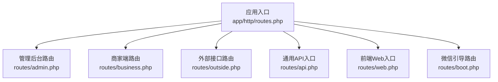
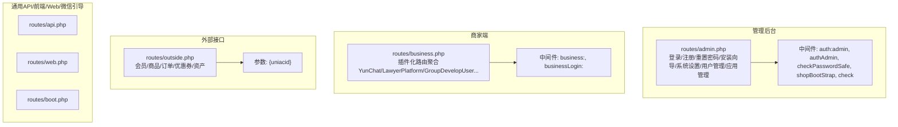
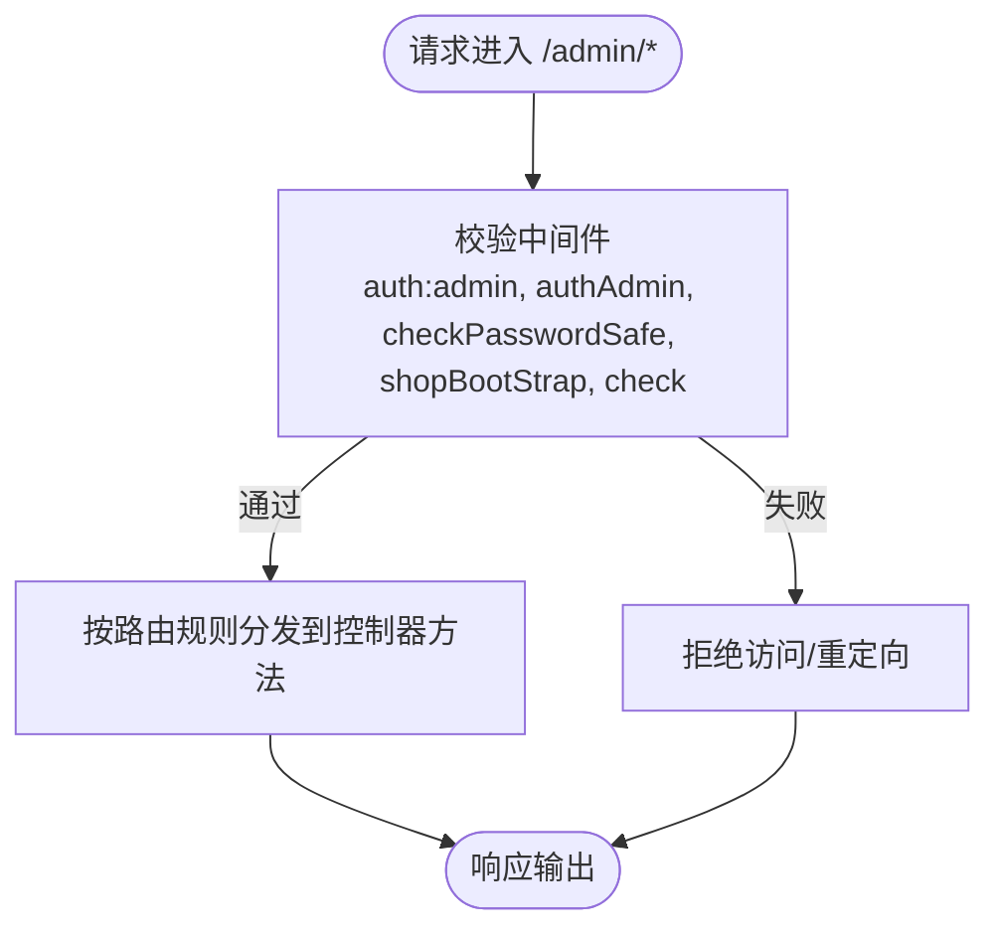
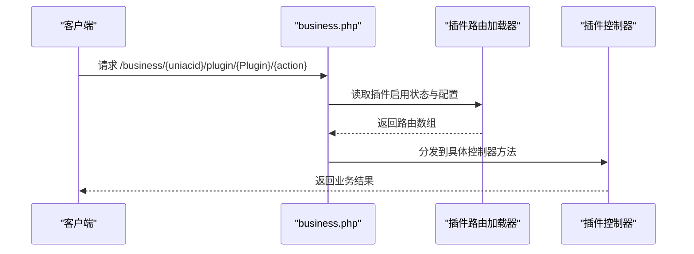
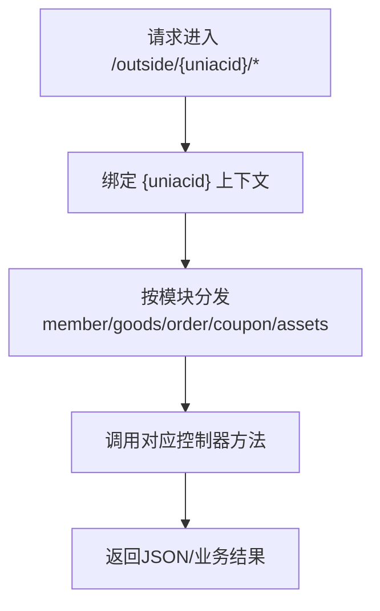
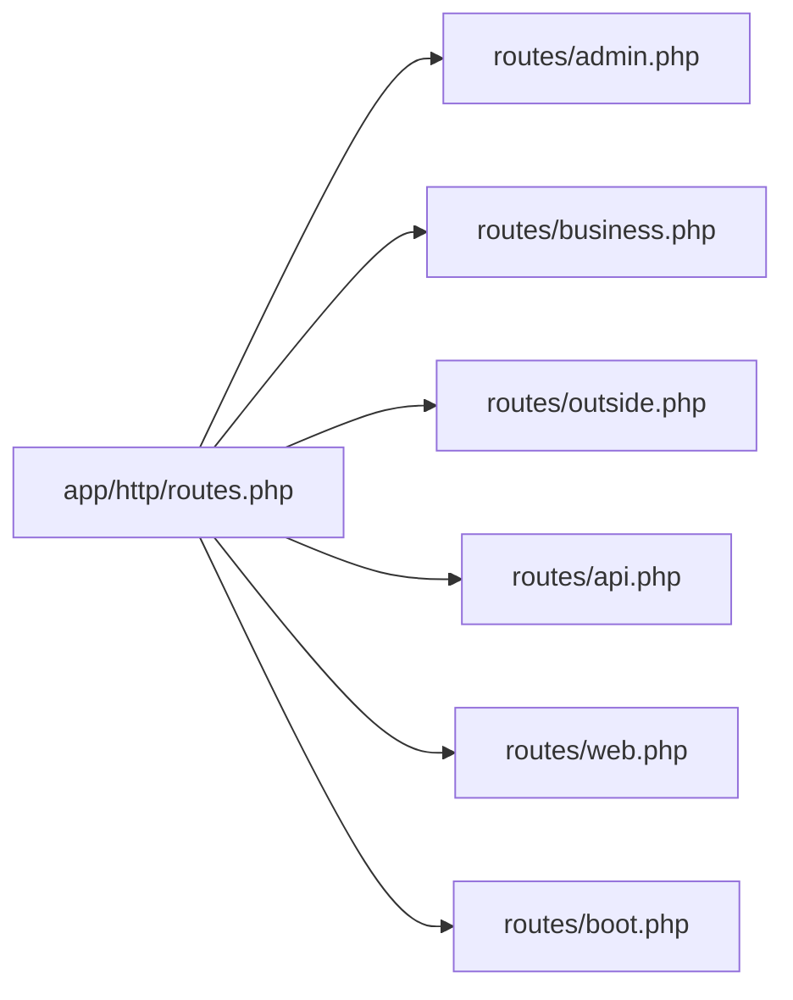

# 路由体系

<cite>
**本文引用的文件**   
- [routes/admin.php](file://routes/admin.php)
- [routes/api.php](file://routes/api.php)
- [routes/outside.php](file://routes/outside.php)
- [routes/shop.php](file://routes/shop.php)
- [routes/business.php](file://routes/business.php)
- [routes/web.php](file://routes/web.php)
- [routes/boot.php](file://routes/boot.php)
- [app/http/routes.php](file://app/http/routes.php)
</cite>

## 目录
1. [引言](#引言)
2. [项目结构](#项目结构)
3. [核心组件](#核心组件)
4. [架构总览](#架构总览)
5. [详细组件分析](#详细组件分析)
6. [依赖关系分析](#依赖关系分析)
7. [性能与安全](#性能与安全)
8. [故障排查指南](#故障排查指南)
9. [结论](#结论)
10. [附录：URL命名约定与REST实践](#附录url命名约定与rest实践)

## 引言
本文件系统化梳理芸众商城的路由体系，围绕多入口分发策略展开，覆盖管理后台、前端Web、商家端（business）、外部接口（outside）以及通用API入口，并对路由参数绑定、中间件应用、控制器映射、缓存与性能优化、安全防护、扩展与自定义进行深入解析。同时总结RESTful设计原则在项目中的落地方式，帮助开发者快速理解并高效扩展路由系统。

## 项目结构
路由文件按入口维度划分，集中于 routes 目录：
- 管理后台路由：routes/admin.php
- 商家端路由：routes/business.php
- 外部接口路由：routes/outside.php
- 通用API入口：routes/api.php
- 前端Web入口：routes/web.php
- 微信相关引导路由：routes/boot.php
- 应用级路由汇总：app/http/routes.php（注释说明用途）

**图表来源**
- [app/http/routes.php:1-12](file://app/http/routes.php#L1-L12)
- [routes/admin.php:1-259](file://routes/admin.php#L1-L259)
- [routes/business.php:1-554](file://routes/business.php#L1-L554)
- [routes/outside.php:1-41](file://routes/outside.php#L1-L41)
- [routes/api.php:1-7](file://routes/api.php#L1-L7)
- [routes/web.php:1-17](file://routes/web.php#L1-L17)
- [routes/boot.php:1-5](file://routes/boot.php#L1-L5)

**章节来源**
- [routes/admin.php:1-259](file://routes/admin.php#L1-L259)
- [routes/business.php:1-554](file://routes/business.php#L1-L554)
- [routes/outside.php:1-41](file://routes/outside.php#L1-L41)
- [routes/api.php:1-7](file://routes/api.php#L1-L7)
- [routes/web.php:1-17](file://routes/web.php#L1-L17)
- [routes/boot.php:1-5](file://routes/boot.php#L1-L5)
- [app/http/routes.php:1-12](file://app/http/routes.php#L1-L12)

## 核心组件
- 多入口分发
  - 管理后台：集中于 routes/admin.php，采用命名空间与前缀组合，配合多层中间件保护敏感操作。
  - 商家端：集中于 routes/business.php，通过插件化路由聚合，支持动态加载插件业务路由。
  - 外部接口：集中于 routes/outside.php，面向第三方对接，提供会员、商品、订单、优惠券、资产等基础能力。
  - 通用API入口：routes/api.php 提供占位路由，便于统一接入与转发。
  - 前端Web入口：routes/web.php 提供站点根路径占位。
  - 微信引导：routes/boot.php 提供微信相关引导入口。
- 中间件体系
  - 管理后台：auth:admin、authAdmin、checkPasswordSafe、shopBootStrap、check 等，确保登录态、权限与安全校验。
  - 商家端：business:、businessLogin: 等，隔离商家域访问控制。
  - 商户外部接口：outside/{uniacid} 组合参数，限定调用方归属。
- 控制器映射
  - 所有路由最终映射至对应命名空间下的控制器方法，如 platform/modules/*、business/modules/*、outside/controllers 等。
- 参数绑定与前缀
  - 使用 {uniacid} 动态参数绑定，贯穿多个入口，用于区分商户上下文。
  - 使用 prefix 对模块进行分组，提升可维护性与可读性。

**章节来源**
- [routes/admin.php:57-248](file://routes/admin.php#L57-L248)
- [routes/business.php:13-466](file://routes/business.php#L13-L466)
- [routes/outside.php:6-39](file://routes/outside.php#L6-L39)

## 架构总览
下图展示多入口路由的总体交互关系与关键中间件：

**图表来源**
- [routes/admin.php:1-259](file://routes/admin.php#L1-L259)
- [routes/business.php:1-554](file://routes/business.php#L1-L554)
- [routes/outside.php:1-41](file://routes/outside.php#L1-L41)
- [routes/api.php:1-7](file://routes/api.php#L1-L7)
- [routes/web.php:1-17](file://routes/web.php#L1-L17)
- [routes/boot.php:1-5](file://routes/boot.php#L1-L5)

## 详细组件分析

### 管理后台路由（routes/admin.php）
- 设计要点
  - 使用 namespace 将控制器归类到 platform/controllers，避免控制器散乱。
  - 使用 middleware 分组对敏感操作进行统一保护。
  - 使用 prefix 对上传、系统设置、用户管理等模块进行分组。
- 关键流程
  - 登录/注册/重置密码/安装向导等公开流程置于无中间件或低门槛中间件组。
  - 系统设置、用户管理、应用管理等置于高安全中间件组。
- URL命名约定
  - 采用 admin.* 命名空间，如 admin.login、admin.permission.*、admin.role.* 等，清晰表达模块与动作。
- 参数绑定
  - 无动态参数绑定，路径固定。
- 中间件应用
  - auth:admin、authAdmin、checkPasswordSafe、shopBootStrap、check 等，确保后台安全。
- 控制器映射
  - LoginController、RegisterController、ResetpwdController、IndexController、UploadController、SiteController、AdminUserController 等。

**图表来源**
- [routes/admin.php:57-248](file://routes/admin.php#L57-L248)

**章节来源**
- [routes/admin.php:1-259](file://routes/admin.php#L1-L259)

### 商家端路由（routes/business.php）
- 设计要点
  - 采用插件化聚合，通过前缀 $base_route = BASE_ROUTE . '/{uniacid}/plugin/' 统一入口。
  - 支持动态加载插件路由，依据插件配置注入业务路由。
  - 管理端与前端回调路由分离，分别置于 admin 与 frontend 命名空间。
- 关键流程
  - 插件路由加载：遍历插件启用状态与配置，动态拼接路由。
  - 管理端路由：企业信息、管理员、部门、员工、消息通知、应用中心等。
  - 前端回调：企业微信回调。
- URL命名约定
  - 以 business.{uniacid}.plugin.{插件名}.{资源}.{动作} 的形式组织，例如 YunChat、LawyerPlatform、GroupDevelopUser 等。
- 参数绑定
  - {uniacid} 动态绑定，贯穿所有插件路由与管理端路由。
- 中间件应用
  - business:、businessLogin:，确保商家域访问控制。
- 控制器映射
  - GroupController、EmployeeController、ChatController、SetController、LawyerController、GroupChatController、PosterController 等。

**图表来源**
- [routes/business.php:13-466](file://routes/business.php#L13-L466)

**章节来源**
- [routes/business.php:1-554](file://routes/business.php#L1-L554)

### 外部接口路由（routes/outside.php）
- 设计要点
  - 面向第三方对接，提供会员、商品、订单、优惠券、资产等基础能力。
  - 通过 {uniacid} 绑定商户上下文，确保调用方归属。
- 关键流程
  - 会员：查询/详情/更新/创建。
  - 商品：列表/索引。
  - 订单：购买/创建/列表/分页。
  - 优惠券：列表/发放/领取。
  - 资产：积分/余额变动。
- URL命名约定
  - 采用 outside.{uniacid}.{模块}.{资源}.{动作} 的形式，如 member/info/query、goods/goods/index、order/create 等。
- 参数绑定
  - {uniacid} 动态绑定。
- 中间件应用
  - 该路由文件未显式声明中间件，但通常由上游网关或服务层进行鉴权与限流。
- 控制器映射
  - IndexController、AddressController、InfoController、GoodsController、BuyController、CreateController、ListController、CouponController、SendOrReceiveController、AssetsController 等。

**图表来源**
- [routes/outside.php:6-39](file://routes/outside.php#L6-L39)

**章节来源**
- [routes/outside.php:1-41](file://routes/outside.php#L1-L41)

### 通用API入口（routes/api.php）
- 设计要点
  - 当前为占位路由，便于统一接入与后续扩展。
- URL命名约定
  - 采用 api.* 命名空间，便于未来扩展。
- 参数绑定
  - 无动态参数绑定。
- 中间件应用
  - 可在后续扩展中引入统一鉴权与限流中间件。
- 控制器映射
  - 无实际映射，仅占位。

**章节来源**
- [routes/api.php:1-7](file://routes/api.php#L1-L7)

### 前端Web入口（routes/web.php）
- 设计要点
  - 提供站点根路径占位，便于前端静态资源与SPA路由接管。
- URL命名约定
  - 采用 web.* 命名空间，便于识别。
- 参数绑定
  - 无动态参数绑定。
- 中间件应用
  - 无显式中间件，遵循框架默认行为。
- 控制器映射
  - 无实际映射，仅占位。

**章节来源**
- [routes/web.php:1-17](file://routes/web.php#L1-L17)

### 微信引导路由（routes/boot.php）
- 设计要点
  - 提供微信相关引导入口，便于微信平台验证与回调。
- URL命名约定
  - 采用 wechat.* 命名空间，便于识别。
- 参数绑定
  - 无动态参数绑定。
- 中间件应用
  - 无显式中间件。
- 控制器映射
  - frontend\modules\wechat\controllers\IndexController@index。

**章节来源**
- [routes/boot.php:1-5](file://routes/boot.php#L1-L5)

## 依赖关系分析
- 入口依赖
  - app/http/routes.php 注释说明应用级路由注册位置，当前文件主要为注释说明。
- 模块耦合
  - 管理后台与商家端均依赖中间件栈，确保安全与权限控制。
  - 外部接口路由与内部模块解耦，通过控制器方法暴露能力。
- 插件化依赖
  - 商家端通过插件配置动态注入路由，降低硬编码耦合度。

**图表来源**
- [app/http/routes.php:1-12](file://app/http/routes.php#L1-L12)
- [routes/admin.php:1-259](file://routes/admin.php#L1-L259)
- [routes/business.php:1-554](file://routes/business.php#L1-L554)
- [routes/outside.php:1-41](file://routes/outside.php#L1-L41)
- [routes/api.php:1-7](file://routes/api.php#L1-L7)
- [routes/web.php:1-17](file://routes/web.php#L1-L17)
- [routes/boot.php:1-5](file://routes/boot.php#L1-L5)

**章节来源**
- [app/http/routes.php:1-12](file://app/http/routes.php#L1-L12)
- [routes/admin.php:1-259](file://routes/admin.php#L1-L259)
- [routes/business.php:1-554](file://routes/business.php#L1-L554)
- [routes/outside.php:1-41](file://routes/outside.php#L1-L41)
- [routes/api.php:1-7](file://routes/api.php#L1-L7)
- [routes/web.php:1-17](file://routes/web.php#L1-L17)
- [routes/boot.php:1-5](file://routes/boot.php#L1-L5)

## 性能与安全
- 路由缓存
  - 在生产环境中建议启用路由缓存，减少每次请求的路由解析开销。
- 中间件链路
  - 管理后台与商家端均采用多层中间件，建议对中间件执行顺序进行评估，避免重复校验与冗余I/O。
- 参数绑定与前缀
  - 使用 {uniacid} 与 prefix 可显著提升路由可维护性，建议保持一致的命名规范。
- 安全防护
  - 管理后台与商家端中间件栈应结合鉴权、防暴力破解、IP白名单、请求频率限制等策略。
  - 外部接口建议在网关层统一鉴权与限流，避免直接暴露业务路由。

[本节为通用指导，不直接分析具体文件，故无“章节来源”]

## 故障排查指南
- 登录/权限问题
  - 检查管理后台中间件链是否正确加载，确认 auth:admin、authAdmin、checkPasswordSafe、shopBootStrap、check 是否生效。
- 插件路由未生效
  - 检查插件启用状态与配置项，确认插件路由是否被正确注入。
- 外部接口调用失败
  - 核对 {uniacid} 参数是否正确传递，确认控制器方法是否存在且签名匹配。
- 路由未命中
  - 检查路由前缀与命名空间是否一致，确认控制器方法是否正确映射。

**章节来源**
- [routes/admin.php:57-248](file://routes/admin.php#L57-L248)
- [routes/business.php:13-466](file://routes/business.php#L13-L466)
- [routes/outside.php:6-39](file://routes/outside.php#L6-L39)

## 结论
芸众商城的路由体系通过多入口分发策略实现了后台、商家端、外部接口与通用API的清晰边界；借助中间件栈与插件化路由聚合，既保证了安全性与可维护性，又提供了良好的扩展性。建议在生产环境启用路由缓存，并完善网关层的安全与限流策略，持续优化中间件链路与参数绑定规范。

[本节为总结性内容，不直接分析具体文件，故无“章节来源”]

## 附录：URL命名约定与REST实践
- URL命名约定
  - 管理后台：admin.{动作} 或 admin.{模块}.{动作}
  - 商家端：business.{uniacid}.plugin.{插件}.{资源}.{动作}
  - 外部接口：outside.{uniacid}.{模块}.{资源}.{动作}
  - 通用API：api.{动作}
  - 前端Web：web.{动作}
  - 微信引导：wechat.{动作}
- REST实践
  - 资源化：将会员、商品、订单、优惠券、资产等抽象为资源，使用标准HTTP动词表达操作。
  - 统一响应：对外部接口统一返回结构，便于第三方集成。
  - 参数绑定：使用 {uniacid} 明确租户上下文，避免跨租户数据泄露。
  - 前缀分组：使用 prefix 对模块进行分组，提升可读性与可维护性。

[本节为通用指导，不直接分析具体文件，故无“章节来源”]