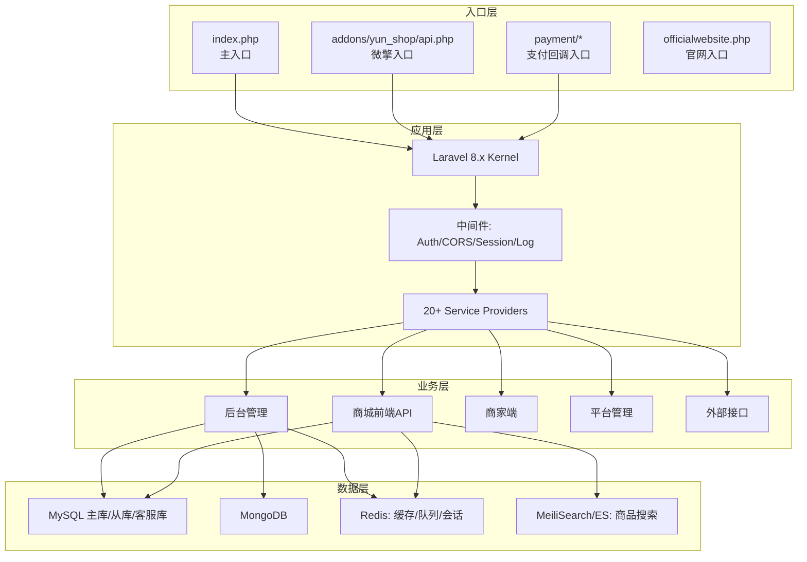
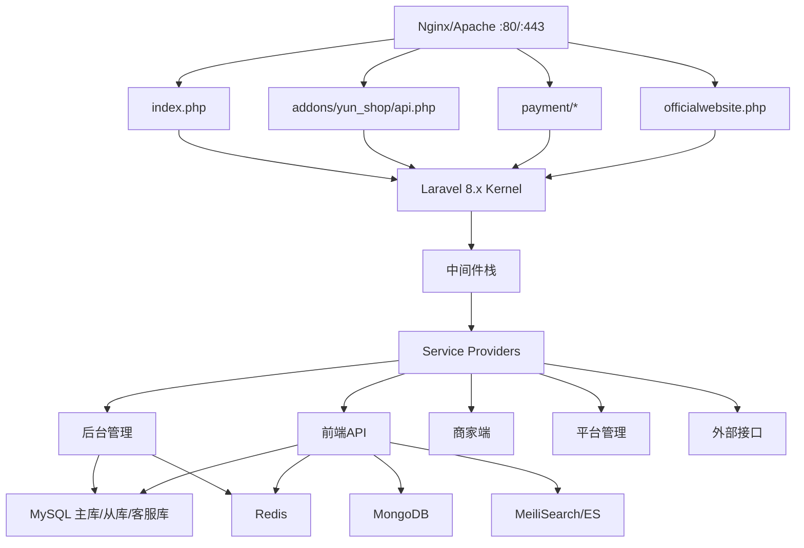
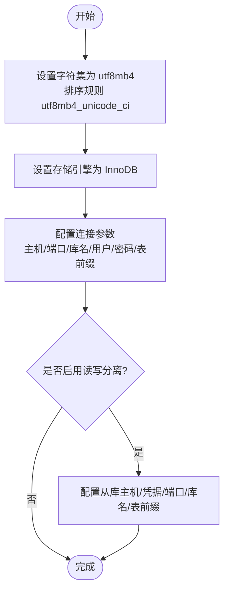
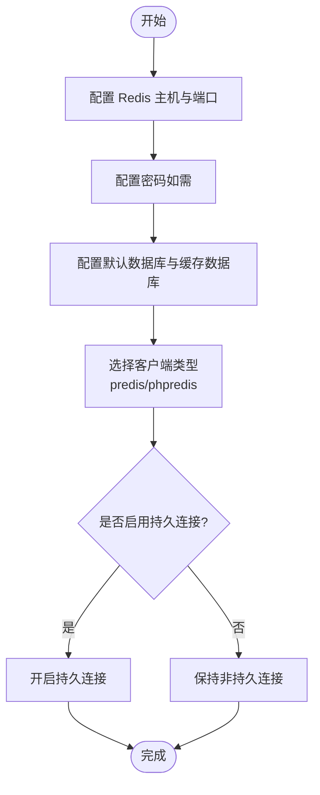
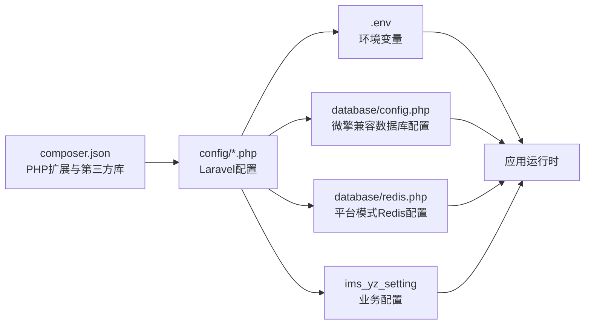

# 环境要求与服务器配置

<cite>
**本文引用的文件**
- [composer.json](file://composer.json)
- [config/app.php](file://config/app.php)
- [config/database.php](file://config/database.php)
- [config/cache.php](file://config/cache.php)
- [config/queue.php](file://config/queue.php)
- [config/scout.php](file://config/scout.php)
- [config/services.php](file://config/services.php)
- [docs/部署与配置.md](file://docs/部署与配置.md)
- [database/config.php](file://database/config.php)
- [database/redis.php](file://database/redis.php)
</cite>

## 目录
1. [简介](#简介)
2. [项目结构](#项目结构)
3. [核心组件](#核心组件)
4. [架构总览](#架构总览)
5. [详细组件分析](#详细组件分析)
6. [依赖关系分析](#依赖关系分析)
7. [性能考虑](#性能考虑)
8. [故障排查指南](#故障排查指南)
9. [结论](#结论)
10. [附录](#附录)

## 简介
本文件面向芸众商城（abangmishop）的部署与运维团队，提供完整的环境要求与服务器配置说明。内容涵盖操作系统与PHP版本要求、必需/可选扩展、数据库与搜索引擎配置、Redis与MongoDB配置要点，并给出CentOS与Ubuntu的安装命令与Nginx配置示例，帮助快速搭建稳定可靠的生产环境。

## 项目结构
- 项目采用 Laravel 8.x + 微擎（WeEngine）混合架构，入口文件多样，包含主入口、微擎入口、支付回调入口、官方入口等。
- 配置加载遵循优先级：.env > database/config.php（微擎兼容）> database/redis.php（平台模式）> config/*.php > 数据库 ims_yz_setting。

**图表来源**
- [docs/部署与配置.md:155-227](file://docs/部署与配置.md#L155-L227)

**章节来源**
- [docs/部署与配置.md:219-316](file://docs/部署与配置.md#L219-L316)

## 核心组件
- 操作系统与PHP版本
  - 操作系统：CentOS 7+/Ubuntu 18.04+/Windows Server（推荐Linux）
  - PHP版本：7.4+（同时支持^8.0），需满足扩展要求
- 必需PHP扩展：pdo、pdo_mysql、redis、mongodb、gd、curl、mbstring、xml、bcmath、fileinfo
- 数据库：MySQL 5.7+，InnoDB引擎，utf8mb4字符集
- 缓存与队列：Redis 6.0+（用于缓存、队列、会话）
- 可选组件：MongoDB 4.0+、MeiliSearch 1.0+、Nginx 1.18+
- 搜索引擎：默认驱动为meilisearch，支持Algolia/Elasticsearch

**章节来源**
- [docs/部署与配置.md:321-333](file://docs/部署与配置.md#L321-L333)
- [composer.json:5-142](file://composer.json#L5-L142)
- [config/database.php:181-197](file://config/database.php#L181-L197)
- [config/scout.php:18-140](file://config/scout.php#L18-L140)

## 架构总览
芸众商城采用“多入口 + Laravel + 微擎兼容”的混合架构，数据层包含MySQL主/从/客服库、MongoDB、Redis与MeiliSearch，业务通过后台、前端API、商家端、平台管理与外部接口访问。

**图表来源**
- [docs/部署与配置.md:155-227](file://docs/部署与配置.md#L155-L227)

## 详细组件分析

### 操作系统与PHP版本要求
- 操作系统：CentOS 7+/Ubuntu 18.04+/Windows Server（Linux推荐）
- PHP版本：7.4+（同时支持^8.0）
- 必需扩展：pdo、pdo_mysql、redis、mongodb、gd、curl、mbstring、xml、bcmath、fileinfo
- Composer：2.x
- Node.js：14+（前端资源编译可选）

**章节来源**
- [docs/部署与配置.md:321-333](file://docs/部署与配置.md#L321-L333)
- [composer.json:5-142](file://composer.json#L5-L142)

### 数据库配置要求（MySQL 5.7+）
- 字符集与排序规则：utf8mb4、utf8mb4_unicode_ci
- 引擎：InnoDB
- 连接参数：主机、端口、数据库名、用户名、密码、表前缀
- 读写分离：当前未启用（slave_status=false）
- 客服库：独立数据库与表前缀

**图表来源**
- [config/database.php:181-197](file://config/database.php#L181-L197)
- [database/config.php:4-30](file://database/config.php#L4-L30)

**章节来源**
- [config/database.php:181-197](file://config/database.php#L181-L197)
- [database/config.php:4-30](file://database/config.php#L4-L30)

### Redis 6.0+ 配置要点
- 连接参数：主机、端口、密码、默认数据库、缓存数据库
- 客户端：predis（默认）
- 持久连接：可选（当前示例为关闭）
- 驱动选择：根据部署环境可切换phpredis（需相应扩展）
- 缓存与队列：默认使用Redis作为缓存与队列后端

**图表来源**
- [config/database.php:284-302](file://config/database.php#L284-L302)
- [config/cache.php:75-78](file://config/cache.php#L75-L78)
- [config/queue.php:59-64](file://config/queue.php#L59-L64)
- [database/redis.php:4-8](file://database/redis.php#L4-L8)

**章节来源**
- [config/database.php:25-31](file://config/database.php#L25-L31)
- [config/database.php:284-302](file://config/database.php#L284-L302)
- [config/cache.php:75-78](file://config/cache.php#L75-L78)
- [config/queue.php:59-64](file://config/queue.php#L59-L64)
- [database/redis.php:4-8](file://database/redis.php#L4-L8)

### MongoDB 4.0+ 配置要点
- 连接参数：主机、端口、用户名、密码、数据库名
- 默认数据库名可继承MySQL主库库名
- 仅在需要相关功能时启用

**章节来源**
- [config/database.php:249-256](file://config/database.php#L249-L256)
- [database/config.php:4-30](file://database/config.php#L4-L30)

### 搜索引擎配置（MeiliSearch 1.0+）
- 默认驱动：meilisearch
- 连接参数：host、key（可选）
- 支持队列同步与软删除策略
- 可选：Algolia/Elasticsearch

**章节来源**
- [config/scout.php:18-140](file://config/scout.php#L18-L140)
- [docs/部署与配置.md:93-101](file://docs/部署与配置.md#L93-L101)

### Nginx 1.18+ 配置要点
- 主路由：try_files回退至index.php
- 微擎入口：/addons/ 路由到微擎入口
- 支付回调：/payment/ 直接访问对应入口
- PHP处理：FastCGI指向php-fpm
- 静态资源：30天缓存与immutable头
- 安全：禁止访问敏感文件与目录

**章节来源**
- [docs/部署与配置.md:427-473](file://docs/部署与配置.md#L427-L473)

### 安装命令与配置示例（CentOS 7+/Ubuntu 18.04+）
- 安装PHP扩展与基础组件
  - CentOS示例：安装php74及其扩展、Composer、Redis
  - Ubuntu示例：apt安装对应包
- 部署代码与依赖
  - 复制项目到Web目录，执行composer install（生产环境建议--no-dev）
  - 前端依赖可选：npm install && npm run prod
- 配置环境
  - 复制.env.example为.env，编辑必要配置（数据库、Redis、队列、搜索）
- 数据库初始化
  - 创建数据库（utf8mb4_unicode_ci），导入迁移（谨慎用于生产）
- Nginx配置与服务启动
  - 配置站点与入口路由，重启Nginx
  - 启动队列Worker与Workerman进程（Supervisor守护）

**章节来源**
- [docs/部署与配置.md:335-492](file://docs/部署与配置.md#L335-L492)

## 依赖关系分析
- PHP扩展依赖：composer.json声明了pdo、pdo_mysql、redis、mongodb、gd、curl、mbstring、xml、bcmath、fileinfo等扩展需求
- 搜索引擎：laravel/scout与meilisearch/meilisearch-php
- 队列与缓存：默认使用Redis
- 配置优先级：.env > database/config.php（微擎兼容）> database/redis.php（平台模式）> config/*.php > 数据库ims_yz_setting

**图表来源**
- [composer.json:5-142](file://composer.json#L5-L142)
- [config/database.php:42-134](file://config/database.php#L42-L134)
- [docs/部署与配置.md:617-627](file://docs/部署与配置.md#L617-L627)

**章节来源**
- [composer.json:5-142](file://composer.json#L5-L142)
- [docs/部署与配置.md:617-627](file://docs/部署与配置.md#L617-L627)

## 性能考虑
- 使用Redis作为缓存与队列后端，建议启用持久连接以降低TCP握手开销
- 启用队列Worker并配合Supervisor进行进程守护，避免单点故障
- 生产环境开启配置缓存、路由缓存与视图缓存，减少启动时I/O
- 搜索索引建议使用队列异步同步，避免阻塞主业务线程
- Nginx静态资源缓存与CDN结合，提升前端资源加载速度

## 故障排查指南
- 页面500错误：查看Laravel日志与开启APP_DEBUG定位问题
- 搜索无结果：检查MeiliSearch健康状态与索引同步
- 队列堆积：监控Redis内存与Worker进程数量，调整并发
- 支付回调失败：确认回调URL在支付平台白名单中，检查日志
- 下载限流异常：检查Redis键命名规范与TTL
- 数据库连接失败：核对database/config.php与.env配置一致性

**章节来源**
- [docs/部署与配置.md:593-614](file://docs/部署与配置.md#L593-L614)

## 结论
芸众商城的生产环境应优先满足操作系统与PHP版本要求，严格配置MySQL字符集与引擎、Redis连接参数与持久化策略，并按需启用MongoDB与MeiliSearch。通过合理的Nginx路由与Supervisor守护，可实现高可用与高性能的线上服务。

## 附录
- 配置优先级说明：.env > database/config.php（微擎兼容）> database/redis.php（平台模式）> config/*.php > 数据库ims_yz_setting
- 常用运维命令：维护模式、缓存清理、队列管理、迁移与搜索索引重建、Workerman进程管理

**章节来源**
- [docs/部署与配置.md:617-627](file://docs/部署与配置.md#L617-L627)
- [docs/部署与配置.md:546-582](file://docs/部署与配置.md#L546-L582)