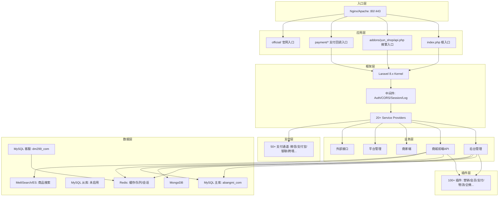
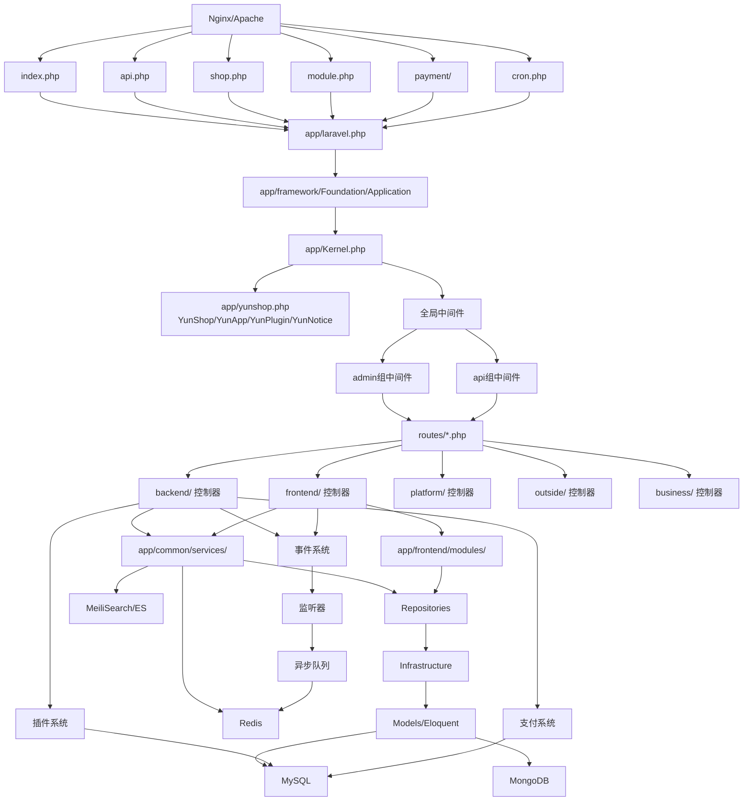
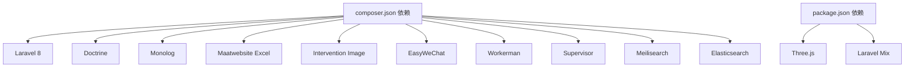

# 运维部署指南

<cite>
**本文引用的文件**
- [composer.json](file://composer.json)
- [config/app.php](file://config/app.php)
- [config/database.php](file://config/database.php)
- [config/cache.php](file://config/cache.php)
- [config/queue.php](file://config/queue.php)
- [config/logging.php](file://config/logging.php)
- [index.php](file://index.php)
- [bootstrap/app.php](file://bootstrap/app.php)
- [daemon.sh](file://daemon.sh)
- [cron.php](file://cron.php)
- [processor.php](file://processor.php)
- [package.json](file://package.json)
- [docs/部署与配置文档.md](file://docs/部署与配置文档.md)
- [docs/架构设计文档.md](file://docs/架构设计文档.md)
- [app/Kernel.php](file://app/Kernel.php)
</cite>

## 目录
1. [简介](#简介)
2. [项目结构](#项目结构)
3. [核心组件](#核心组件)
4. [架构总览](#架构总览)
5. [详细组件分析](#详细组件分析)
6. [依赖分析](#依赖分析)
7. [性能考虑](#性能考虑)
8. [故障排查指南](#故障排查指南)
9. [备份与恢复](#备份与恢复)
10. [运维自动化脚本](#运维自动化脚本)
11. [结论](#结论)

## 简介
本指南面向芸众商城（abangmishop）的运维团队，提供从服务器环境准备、代码部署、数据库初始化、配置文件设置到服务启动与监控告警、故障排查、备份恢复以及运维自动化脚本使用的全流程说明。系统基于 Laravel 8 + 微擎（WeEngine）构建，具备多入口、插件化、支付通道丰富、事件驱动与异步队列等特性。

## 项目结构
- 入口层：Nginx/Apache 负责反向代理与静态资源分发，多入口文件（index.php、api.php、shop.php、cron.php、processor.php 等）分发至框架层。
- 框架层：Laravel Kernel、自定义 Application、中间件与服务提供者体系。
- 业务层：后台管理、前端 API、商家端、平台管理、外部接口。
- 插件层：100+ 插件，统一命名空间与自动加载机制。
- 支付层：50+ 支付通道，独立回调入口。
- 数据层：MySQL 主库、可选从库、客服库、MongoDB、Redis、MeiliSearch/ES。

图表来源
- [docs/部署与配置文档.md](file://docs/部署与配置文档.md)
- [docs/架构设计文档.md](file://docs/架构设计文档.md)

章节来源
- [docs/部署与配置文档.md](file://docs/部署与配置文档.md)
- [docs/架构设计文档.md](file://docs/架构设计文档.md)

## 核心组件
- 应用内核与中间件：全局中间件、路由组中间件、路由级中间件，保障维护模式、会话、认证与限流等横切关注点。
- 服务提供者体系：14 个核心 Provider 负责注册业务 Manager、插件自动加载、事件监听、路由与队列等。
- 配置优先级：.env > database/config.php（微擎兼容）> database/redis.php（平台模式）> config/*.php > 数据库 ims_yz_setting。
- 日志与监控：Monolog 驱动的日志通道，结合 Laravel 日志、微信日志、队列日志与 Nginx 访问/错误日志形成多维监控。
- 队列与进程：Redis 队列 + Supervisor 守护 Worker；Workerman MQTT 长连接通过 artisan shop 管理。

章节来源
- [app/Kernel.php](file://app/Kernel.php)
- [config/app.php](file://config/app.php)
- [config/database.php](file://config/database.php)
- [config/cache.php](file://config/cache.php)
- [config/queue.php](file://config/queue.php)
- [config/logging.php](file://config/logging.php)
- [docs/部署与配置文档.md](file://docs/部署与配置文档.md)

## 架构总览
系统采用“多入口 + Laravel + 微擎兼容”的混合架构，入口文件根据 URL 分发到不同路由与控制器，业务通过服务层解耦，仓储层对接多种数据源，事件驱动与异步队列贯穿订单、支付、营销等关键链路。

图表来源
- [docs/架构设计文档.md](file://docs/架构设计文档.md)
- [app/Kernel.php](file://app/Kernel.php)

章节来源
- [docs/架构设计文档.md](file://docs/架构设计文档.md)
- [app/Kernel.php](file://app/Kernel.php)

## 详细组件分析

### 服务器配置要求
- 操作系统：CentOS 7+/Ubuntu 18.04+（推荐 Linux）
- PHP：7.4+（需扩展：pdo、pdo_mysql、redis、mongodb、gd、curl、mbstring、xml、bcmath、fileinfo）
- 数据库：MySQL 5.7+（InnoDB、utf8mb4）、可选 MongoDB 4.0+、Redis 6.0+、MeiliSearch 1.0+
- Web：Nginx 1.18+（推荐）
- 工具：Composer 2.x、Node.js 14+（前端资源编译可选）

章节来源
- [docs/部署与配置文档.md](file://docs/部署与配置文档.md)

### 环境准备与部署步骤
- 基础环境准备（示例：CentOS）
  - 安装 PHP 扩展与 Composer、Redis
- 部署代码
  - 复制项目到 Web 目录，安装 PHP 依赖（生产环境使用 --no-dev 与优化自动加载）
  - 前端依赖安装与编译（可选）
- 配置环境
  - 复制 .env.example 为 .env，编辑最小配置（APP_*、DB_*、REDIS_*、QUEUE_DRIVER、SCOUT_DRIVER、SEARCH_URL）
- 数据库配置
  - 创建数据库，导入迁移（生产环境谨慎使用）
  - 设置 storage 与 bootstrap/cache 目录权限
- Nginx 配置
  - 主路由、微擎入口、支付回调入口、PHP-FPM 处理、静态资源缓存、敏感文件禁止访问
- 启动服务
  - 清理与缓存配置、路由、视图
  - 启动队列 Worker（Supervisor 守护）
  - 启动 Workerman（MQTT 长连接）
  - 或使用守护脚本一键启停

章节来源
- [docs/部署与配置文档.md](file://docs/部署与配置文档.md)

### 配置文件与优先级
- 配置加载优先级（从高到低）：.env > database/config.php（微擎兼容）> database/redis.php（平台模式）> config/*.php > 数据库 ims_yz_setting
- 关键配置项
  - 应用：APP_ENV、APP_DEBUG、APP_URL、APP_KEY、APP_Framework、IS_WEB、ROOT_PATH、EXTEND_DIR
  - 数据库：DB_CONNECTION、DB_HOST、DB_PORT、DB_DATABASE、DB_USERNAME、DB_PASSWORD、DB_PREFIX、DB2_*（客服库）
  - Redis：REDIS_HOST、REDIS_PASSWORD、REDIS_PORT、REDIS_DEFAULT_DATABASE、REDIS_CACHE_DATABASE、REDIS_PERSISTENT
  - 队列：QUEUE_DRIVER（redis）
  - 搜索：SCOUT_DRIVER（meilisearch）、MEILISEARCH_HOST、MEILISEARCH_KEY、SEARCH_URL
  - 日志：LOG_CHANNEL、slack webhook、stderr/syslog/errorlog

章节来源
- [docs/部署与配置文档.md](file://docs/部署与配置文档.md)
- [config/app.php](file://config/app.php)
- [config/database.php](file://config/database.php)
- [config/cache.php](file://config/cache.php)
- [config/queue.php](file://config/queue.php)
- [config/logging.php](file://config/logging.php)

### 入口与路由分发
- 入口文件与典型 URL
  - index.php：/（根路径 301 跳转官网）、/admin/*、/business/*、/outside/*
  - api.php：/addons/yun_shop/api.php（微擎兼容）
  - shop.php：/shop.php（商城独立入口）
  - cron.php：/cron.php（定时任务）
  - processor.php：/processor.php（微信消息处理器）
- 路由分发策略
  - 根据 config('app.framework') 选择平台模式或微擎模式加载不同路由
  - URL 命名约定：/admin/*、/admin/shop/*、/business/{uniacid}/*、/outside/{uniacid}/*、/app/{module}.{controller}.{action}

章节来源
- [docs/部署与配置文档.md](file://docs/部署与配置文档.md)
- [index.php](file://index.php)
- [cron.php](file://cron.php)
- [processor.php](file://processor.php)

### 队列与进程管理
- 队列驱动：redis，默认队列 default，重试时间 600 秒
- Supervisor 配置示例：4 个进程守护队列 Worker，输出日志路径
- Workerman：通过 artisan shop start/stop/restart/status 管理 MQTT 长连接
- 守护脚本：daemon.sh 用于一键启停

章节来源
- [docs/部署与配置文档.md](file://docs/部署与配置文档.md)
- [config/queue.php](file://config/queue.php)
- [daemon.sh](file://daemon.sh)

### 支付回调与安全
- 支付回调白名单：微信、支付宝、聚合支付、PayPal 等通道的 notifyUrl.php 需在支付平台配置为无需登录的 CSRF 白名单
- 回调流程：接收通知 → 签名校验 → 解析数据 → 查找订单 → 更新状态 → 触发事件 → 返回成功标识

章节来源
- [docs/部署与配置文档.md](file://docs/部署与配置文档.md)

## 依赖分析
- PHP 依赖：Laravel 8、Doctrine、Monolog、Maatwebsite Excel、Intervention Image、EasyWeChat、Workerman、Supervisor、Meilisearch、Elasticsearch 等
- 前端依赖：Three.js、Tween.js、Laravel Mix（可选）
- Composer 自动加载：app/yunshop.php、app/helpers.php 作为全局文件加载

图表来源
- [composer.json](file://composer.json)
- [package.json](file://package.json)

章节来源
- [composer.json](file://composer.json)
- [package.json](file://package.json)

## 性能考虑
- 缓存策略：文件缓存（开发）或 Redis 缓存（生产），键前缀统一为 yunshop
- 数据库：PDO 默认 FETCH_ASSOC，减少对象转换开销；可选读写分离（当前未启用）
- 搜索：MeiliSearch/ES 双引擎，合理设置索引与查询策略
- 队列：Worker 数量与超时时间需结合业务峰值调整
- 静态资源：Nginx 缓存与 immutable 策略提升前端加载性能

章节来源
- [config/cache.php](file://config/cache.php)
- [config/database.php](file://config/database.php)
- [docs/部署与配置文档.md](file://docs/部署与配置文档.md)

## 故障排查指南
- 页面 500：查看 Laravel 日志（storage/logs/）、开启 APP_DEBUG 获取详细错误
- 搜索无结果：检查 MeiliSearch 服务健康状态
- 队列堆积：检查 Redis 内存与 Worker 进程数，必要时扩容或优化 Job
- 支付回调失败：确认回调 URL 在支付平台白名单、日志与签名验证
- 下载限流异常：检查 Redis 中 dl_limit_* 与 dl_blacklist:* 键
- 数据库连接失败：核对 database/config.php 与 .env 配置一致性
- 进程异常：查看 Supervisor 输出日志与 Workerman 状态

章节来源
- [docs/部署与配置文档.md](file://docs/部署与配置文档.md)
- [config/logging.php](file://config/logging.php)

## 备份与恢复
- 数据库备份
  - MySQL 主库与客服库定期快照与增量备份
  - 迁移与种子数据备份（database/migrations 与 database/seeders）
- 配置备份
  - .env、config/*.php、database/config.php、database/redis.php
- 应急恢复
  - 代码回滚与依赖安装（composer install --no-dev）
  - 数据库回滚迁移或导入备份
  - 重启服务与队列 Worker、Workerman

章节来源
- [docs/部署与配置文档.md](file://docs/部署与配置文档.md)

## 运维自动化脚本
- 守护脚本：daemon.sh 一键启停 Workerman
- Supervisor 配置：定义队列 Worker 与 Workerman 进程守护
- 常用运维命令：down/up、缓存清理、队列管理、迁移、搜索索引导入、Workerman 状态

章节来源
- [daemon.sh](file://daemon.sh)
- [docs/部署与配置文档.md](file://docs/部署与配置文档.md)

## 结论
本指南提供了芸众商城从环境准备到部署上线、从监控告警到故障排查与备份恢复的完整运维路径，并结合系统多入口、插件化、事件驱动与异步队列等特性给出针对性建议。建议在生产环境中严格遵循配置优先级、启用 Redis 缓存与队列、完善日志与监控、定期演练备份与恢复流程，确保系统稳定与业务连续性。