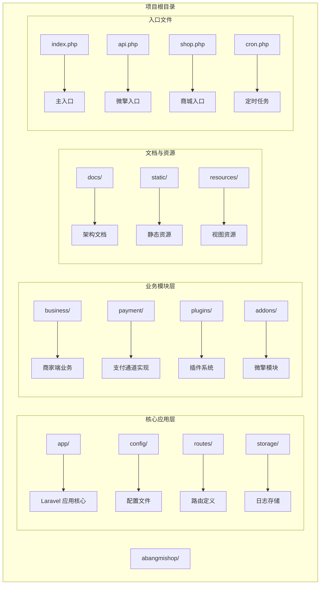
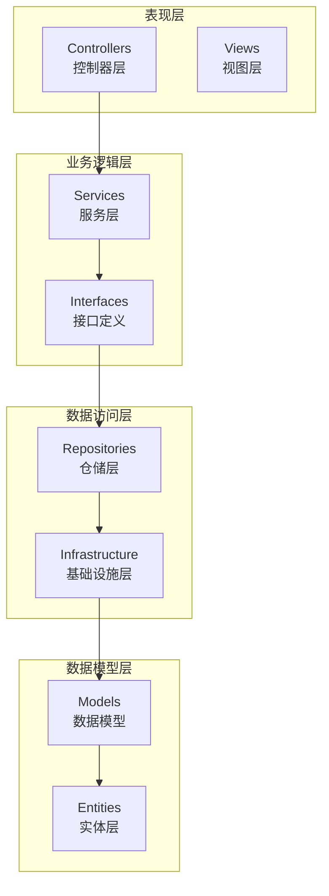
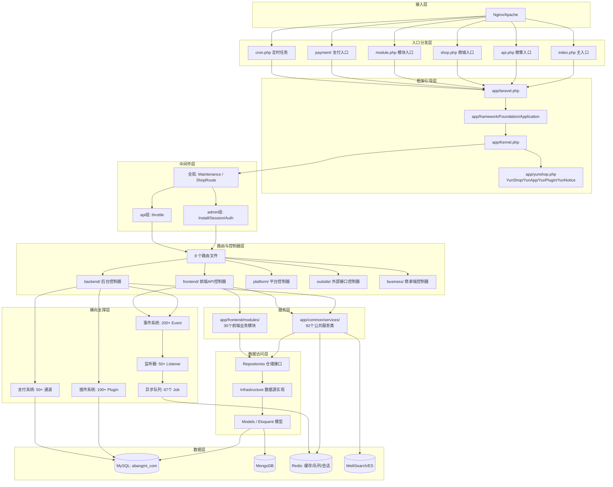
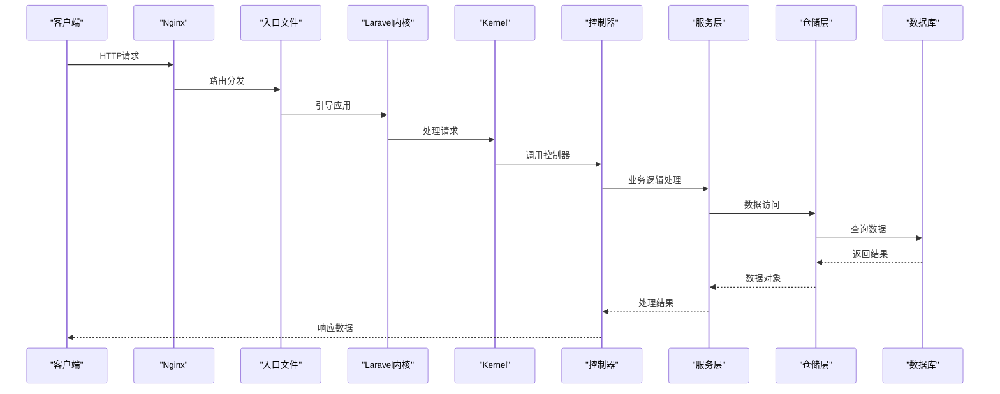
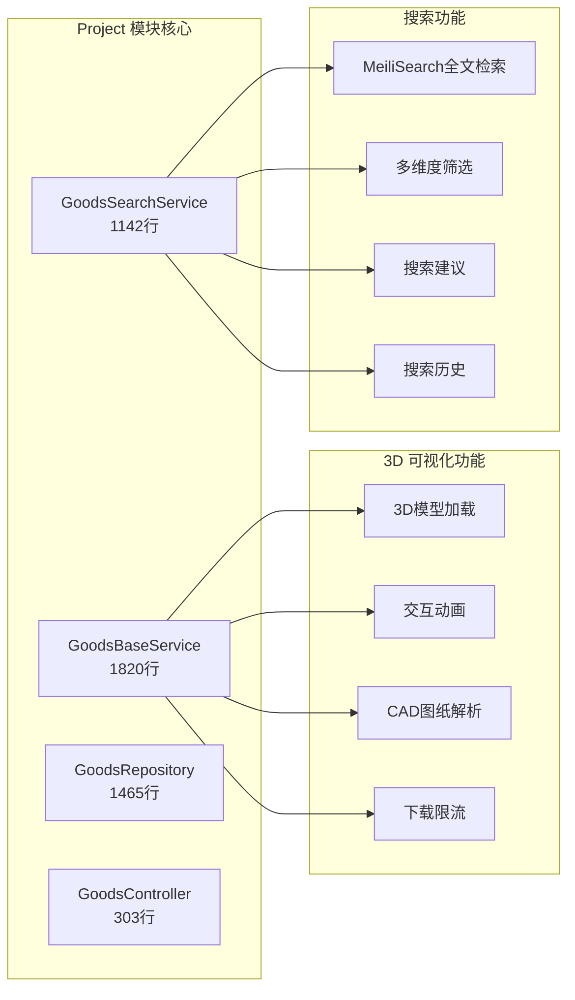
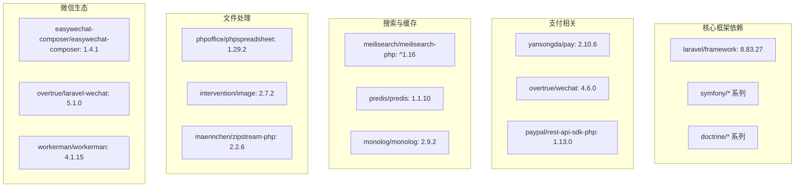
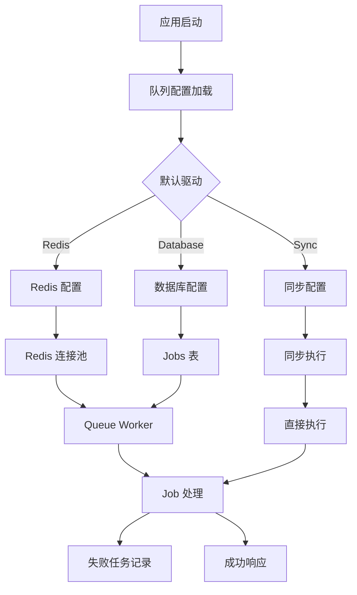
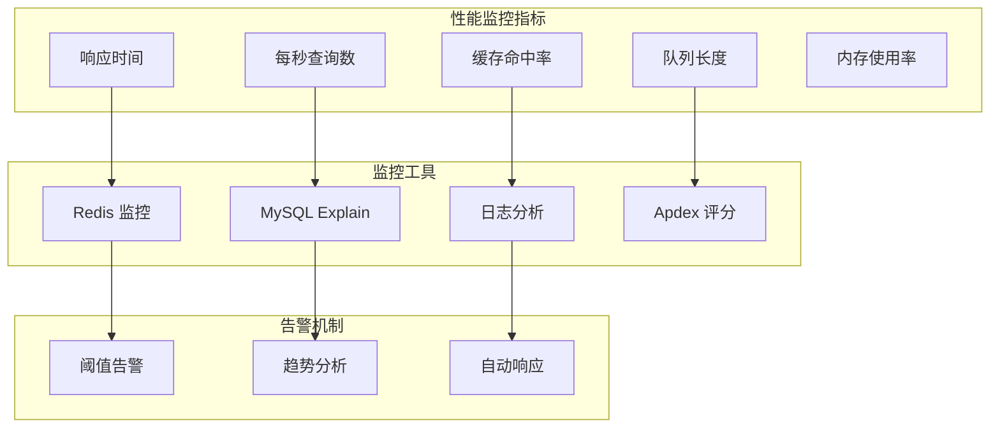

# 项目交接文档

<cite>
**本文档引用的文件**
- [README.md](file://README.md)
- [project_module_handover.md](file://docs/project_module_handover.md)
- [architecture_design.md](file://docs/architecture_design.md)
- [deployment_and_config.md](file://docs/deployment_and_config.md)
- [repo_wiki.md](file://docs/repo_wiki.md)
- [整体系统架构图.mermaid](file://docs/整体系统架构图.mermaid)
- [composer.json](file://composer.json)
- [app.php](file://config/app.php)
- [Kernel.php](file://app/Kernel.php)
- [database.php](file://config/database.php)
- [queue.php](file://config/queue.php)
- [AppServiceProvider.php](file://app/common/providers/AppServiceProvider.php)
- [EventServiceProvider.php](file://app/common/providers/EventServiceProvider.php)
- [web.php](file://routes/web.php)
</cite>

## 目录
1. [项目概述](#项目概述)
2. [项目结构](#项目结构)
3. [核心组件](#核心组件)
4. [架构概览](#架构概览)
5. [详细组件分析](#详细组件分析)
6. [依赖分析](#依赖分析)
7. [性能考虑](#性能考虑)
8. [故障排除指南](#故障排除指南)
9. [结论](#结论)
10. [附录](#附录)

## 项目概述

芸众商城是一个基于 Laravel 8 + 微擎 (WeEngine) 框架构建的大型 SaaS 电商中台系统。项目以 "插件化架构 + 多渠道支付 + 3D可视化" 为技术特色，提供覆盖 B2C 商城、分销裂变、社区营销、直播带货、门店 POS 等全链路电商解决方案。

### 项目特性

| 能力维度 | 技术实现 | 规模数据 |
|----------|----------|----------|
| **多端入口** | index.php / api.php / shop.php / admin.html / module.php / processor.php | 11 个入口文件 |
| **插件体系** | 统一目录规范 + SPL 自动加载 + 生命周期管理 | 100+ 插件 |
| **支付通道** | 统一 PaymentServiceProvider + 通道注册 | 50+ 支付通道 |
| **事件驱动** | Laravel Event + Listener + Subscriber | 200+ 事件定义, 50+ 监听器 |
| **异步队列** | Redis Queue + Workerman MQTT | 67 个 Job 类 |
| **3D 可视化** | Three.js 0.171.0 + Tween.js 18.6.4 | 模型预览/交互动画/CAD 解析 |
| **搜索引擎** | MeiliSearch / Elasticsearch 双引擎 | 商品全文检索 |
| **数据存储** | MySQL + MongoDB + Redis 混合架构 | 665 个迁移文件 |

## 项目结构

### 目录组织架构



**图表来源**
- [architecture_design.md: 29-146:29-146](file://docs/architecture_design.md#L29-L146)
- [repo_wiki.md: 159-242:159-242](file://docs/repo_wiki.md#L159-L242)

### 核心模块分布

项目采用分层架构设计，主要模块包括：

1. **应用核心层** (`app/`)
   - `backend/`: 后台管理模块
   - `frontend/`: 商城前端 API 模块
   - `common/`: 公共模块（跨端复用）
   - `platform/`: 平台管理模块
   - `business/`: 商家端独立业务逻辑

2. **业务功能层**
   - `project/`: 3D 可视化模块（核心功能）
   - `order/`: 订单管理系统
   - `goods/`: 商品管理系统
   - `member/`: 会员中心系统
   - `marketing/`: 营销插件系统

3. **基础设施层**
   - `framework/`: 框架扩展层
   - `exports/`: 数据导出模块
   - `jobs/`: 异步任务队列

**章节来源**
- [architecture_design.md: 490-610:490-610](file://docs/architecture_design.md#L490-L610)
- [repo_wiki.md: 163-242:163-242](file://docs/repo_wiki.md#L163-L242)

## 核心组件

### 分层架构设计

芸众商城采用严格的四层架构设计：



**图表来源**
- [architecture_design.md: 494-517:494-517](file://docs/architecture_design.md#L494-L517)

### 核心服务提供者体系

项目通过 14 个 Service Provider 组织核心服务：

| Provider | 核心职责 | 关键绑定 |
|----------|----------|----------|
| `AppServiceProvider` | PDO 模式设置、安装验证、Blade 指令扩展 | `PDO::FETCH_ASSOC` |
| `YunShopServiceProvider` | `$_W` 全局变量构建、微擎兼容层 | `$_W` 全局变量 |
| `ShopProvider` | **最核心的 Provider**，注册 15+ 个业务 Manager 单例 | `SettingCache`, `GoodsManager` |
| `PluginServiceProvider` | 插件自动加载、命名空间注册 | SPL 自动加载 |
| `EventServiceProvider` | 100+ Event-Listener 映射 + 20+ Subscriber 注册 | 事件监听器 |
| `RouteServiceProvider` | 多模式路由分组加载 | 路由分发 |
| `PaymentServiceProvider` | 支付通道统一注册 | 支付通道管理 |
| `CronServiceProvider` | 定时任务管理 | 计划任务 |

**章节来源**
- [architecture_design.md: 327-350:327-350](file://docs/architecture_design.md#L327-L350)
- [architecture_design.md: 350-375:350-375](file://docs/architecture_design.md#L350-L375)

## 架构概览

### 系统架构图



**图表来源**
- [architecture_design.md: 29-146:29-146](file://docs/architecture_design.md#L29-L146)

### 请求生命周期详解



**图表来源**
- [architecture_design.md: 150-194:150-194](file://docs/architecture_design.md#L150-L194)

## 详细组件分析

### 3D 可视化模块 (Project 模块)

Project 模块是芸众商城的核心功能模块，包含 30 个前端业务模块：



**图表来源**
- [project_module_handover.md: 535-576:535-576](file://docs/project_module_handover.md#L535-L576)

#### 下载限流策略

| 文件类型 | 分钟限流 | 小时配额 | Key 维度 |
|----------|----------|----------|----------|
| 3D模型 (`3d`) | 10次/分钟 | 100次/小时 | IP + GoodsID + FileType |
| CAD文件 (`cad`) | 15次/分钟 | 150次/小时 | IP + GoodsID + FileType |
| 图册PDF (`atlas`) | 20次/分钟 | 300次/小时 | IP + GoodsID + FileType |
| 色卡 (`color_card`) | 20次/分钟 | 300次/小时 | IP + GoodsID + FileType |

**章节来源**
- [project_module_handover.md: 535-576:535-576](file://docs/project_module_handover.md#L535-L576)
- [repo_wiki.md: 269-286:269-286](file://docs/repo_wiki.md#L269-L286)

### 支付系统架构

芸众商城支持 50+ 支付通道，统一由 `PaymentServiceProvider` 注册管理：

```mermaid
graph TB
ORDER[订单创建] --> PM[PaymentManager 支付管理器]
PM --> REGISTER[PaymentServiceProvider 注册支付通道]
REGISTER --> CHANNELS[50+ 支付通道]
subgraph "支付通道分类"
WX[微信支付: wechat/wechatscan/wxIntegrationPay]
ALI[支付宝: alipay/zfbIntegrationPay]
UNION[银联/云闪付: eup/yunpay/yoppay/yoppro]
CONV[聚合支付: convergepay/convergequickpay/convergeseparate]
CROSS[跨境支付: paypal/usdtpay]
BALANCE[余额支付: storebalance/membercard/silverPointPay]
CREDIT[分期/信用: merchantLoanPay/huibeiPay]
THIRD[三方通道: sandpay/lakala/leshua/huanxun]
end
CHANNELS --> PAY_CALL[发起支付请求]
PAY_CALL --> CALLBACK[payment/{channel}/notifyUrl.php]
CALLBACK --> VERIFY[签名验证]
VERIFY --> UPDATE[更新订单状态 → 触发支付完成事件]
```

**图表来源**
- [architecture_design.md: 716-737:716-737](file://docs/architecture_design.md#L716-L737)

### 异步任务队列系统

项目内置 67 个 Job 类，运行在 Redis Queue 上：

| 类别 | Job 类 | 用途 |
|------|--------|------|
| **订单处理** | `OrderCreatedEventQueueJob` | 订单创建后事件分发 |
| | `OrderPaidEventQueueJob` | 支付完成事件处理 |
| | `OrderReceivedEventQueueJob` | 收货完成事件处理 |
| | `OrderSentEventQueueJob` | 发货事件处理 |
| | `OrderBonusJob` | 订单分红计算 |
| **会员关系** | `ChangeMemberRelationJob` | 会员关系变更 |
| | `ModifyRelationJob` | 关系修改 |
| | `ModifyRelationshipChainJob` | 关系链重建 |
| | `MemberLowerOrderJob` | 下级订单统计 |
| | `MemberLowerGroupOrderJob` | 下级团购订单 |
| **商品处理** | `GoodsImageJob` | 商品图片处理 |
| | `GoodsSetPriceJob` | 批量调价 |
| | `BatchImportGoodsJob` | 商品批量导入 |
| | `AssemblyGoodsJob` | 商品组装 |
| **3D/文件** | `UploadModelJob` | 3D模型上传处理 |
| | `ProductCadJob` | CAD文件处理 |
| | `GeneratePdfJob` | PDF生成 |
| | `HighPptJob` | PPT转换 |
| **消息通知** | `MessageJob` | 通用消息发送 |
| | `MiniMessageNoticeJob` | 小程序模板消息 |
| | `MessageNoticeJob` | 系统通知 |
| | `MqttTopicMessageJob` | MQTT推送 |
| **搜索同步** | `UpdateMeiliSearch` | MeiliSearch索引更新 |

**章节来源**
- [repo_wiki.md: 400-431:400-431](file://docs/repo_wiki.md#L400-L431)

## 依赖分析

### PHP 依赖管理

项目使用 Composer 进行依赖管理，核心依赖包括：



**图表来源**
- [composer.json: 5-142:5-142](file://composer.json#L5-L142)

### 数据库连接配置

项目支持多种数据库连接模式：

| 连接类型 | 配置来源 | 特点 |
|----------|----------|------|
| **MySQL 主库** | `.env` + `database/config.php` | 核心业务数据存储 |
| **MySQL 从库** | `mysql_slave` | 读写分离支持 |
| **MongoDB** | `database/mongoDB.php` | 文档型数据存储 |
| **Redis** | `database/redis.php` | 缓存、队列、会话 |
| **客服数据库** | `kefu` 连接 | 独立客服系统 |

**章节来源**
- [database.php: 137-304:137-304](file://config/database.php#L137-L304)

### 队列系统配置



**图表来源**
- [queue.php: 30-84:30-84](file://config/queue.php#L30-L84)

**章节来源**
- [queue.php: 18-84:18-84](file://config/queue.php#L18-L84)

## 性能考虑

### 缓存策略

项目采用多层次缓存策略：

1. **数据库查询缓存**
   - PDO fetch 模式设置为 `FETCH_ASSOC`
   - 商品详情缓存 24 小时
   - Redis 缓存数据库分离

2. **下载限流缓存**
   - 分钟级限流缓存 (60s TTL)
   - 小时级配额缓存 (3600s TTL)
   - IP 黑名单缓存

3. **3D 模型缓存**
   - 实时加载策略
   - CDN 加速优化

### 性能监控



## 故障排除指南

### 常见问题诊断

| 问题类型 | 检查要点 | 解决方案 |
|----------|----------|----------|
| **页面500错误** | Laravel 日志文件、环境配置、Composer 依赖 | 检查 `storage/logs/` 目录权限 |
| **搜索无结果** | MeiliSearch 服务状态、索引重建 | 执行 `php artisan scout:import` |
| **队列堆积** | Redis 内存使用、Worker 进程数 | 增加 Worker 数量、清理僵尸进程 |
| **支付回调失败** | 回调 URL 可达性、CSRF 白名单、签名验证 | 检查支付平台配置 |
| **下载限流异常** | Redis 键值清理、限流策略调整 | 清理 `dl_limit_*` 键 |
| **3D模型加载慢** | CDN 配置、文件大小优化、缓存策略 | 检查 CDN 状态和缓存命中率 |
| **数据库连接失败** | 配置文件一致性、网络连通性 | 验证 `.env` 和 `database/config.php` |

### 运维命令

```bash
# 应用维护
php artisan down                    # 维护模式
php artisan up                      # 恢复服务

# 缓存管理
php artisan cache:clear             # 清除应用缓存
php artisan config:clear            # 清除配置缓存
php artisan route:clear             # 清除路由缓存
php artisan view:clear              # 清除视图缓存

# 队列管理
php artisan queue:work redis --queue=default  # 启动Worker
php artisan queue:failed            # 查看失败任务
php artisan queue:retry all         # 重试所有失败
php artisan queue:flush             # 清空失败任务

# 数据库
php artisan migrate                 # 运行迁移
php artisan migrate:rollback        # 回滚迁移
php artisan migrate:status          # 查看迁移状态
php artisan db:seed               # 数据填充

# 搜索引擎
php artisan scout:import "App\Models\Goods"  # 导入商品索引

# 进程管理
php artisan shop start              # 启动Workerman
php artisan shop stop               # 停止Workerman
php artisan shop restart            # 重启Workerman
php artisan shop status             # 查看状态
```

**章节来源**
- [deployment_and_config.md: 546-631:546-631](file://docs/deployment_and_config.md#L546-L631)

## 结论

芸众商城项目是一个高度复杂的企业级电商中台系统，具有以下特点：

1. **架构完整性**：采用分层架构设计，职责清晰，便于维护和扩展
2. **技术先进性**：集成微擎框架、Laravel 8、多种支付通道、3D可视化等先进技术
3. **可扩展性**：插件化架构支持功能模块的灵活扩展
4. **稳定性**：完善的事件驱动、异步队列、缓存策略确保系统稳定运行
5. **可维护性**：详细的文档、标准化的开发流程、完善的监控告警机制

对于接手人员，建议重点关注：
- 理解分层架构设计原理和各层职责边界
- 掌握插件化开发模式和命名规范
- 熟悉支付系统的回调机制和安全策略
- 了解 3D 可视化模块的技术实现和性能优化
- 掌握异步队列的管理和监控方法

## 附录

### 开发规范

#### 编码规范
- **PSR-12** 编码标准
- **驼峰式**命名：类名大驼峰，方法/变量小驼峰
- **蛇形命名**：配置文件、数据库字段
- **分层原则**：Controller → Service → Repository → Infrastructure
- **事件驱动**：核心业务变更必须触发事件，通过 Listener 解耦

#### 目录约定
- `app/common/`：跨端复用逻辑（后台+前端+商家端共享）
- `app/frontend/`：商城前端 API 专属逻辑
- `app/backend/`：后台管理专属逻辑
- `app/platform/`：平台级管理逻辑
- `business/`：商家端独立业务逻辑

#### 代码审查标准
1. **功能性验证**：确保功能实现符合需求规格
2. **性能评估**：检查代码执行效率和资源消耗
3. **安全性检查**：验证输入验证、权限控制、SQL 注入防护
4. **可维护性评估**：代码结构、注释、命名规范
5. **兼容性测试**：前后端兼容性、浏览器兼容性

### 知识传递方案

#### 技术培训计划
1. **基础培训**（1-2周）
   - 项目架构理解
   - 开发环境搭建
   - 核心模块介绍
   
2. **进阶培训**（2-3周）
   - 插件开发模式
   - 支付系统集成
   - 3D 可视化技术
   
3. **实战培训**（持续）
   - 代码审查实践
   - 问题排查训练
   - 性能优化指导

#### 经验分享机制
1. **定期技术分享会**：每月一次，分享新技术、最佳实践
2. **代码评审会议**：每周一次，审查代码质量和架构设计
3. **问题复盘会议**：重大问题后进行复盘，总结经验教训
4. **导师制度**：新员工配备导师，提供一对一指导

#### 知识管理
1. **文档维护**：定期更新技术文档和开发指南
2. **知识库建设**：建立常见问题和解决方案的知识库
3. **最佳实践库**：收集和整理项目中的最佳实践案例
4. **培训材料**：制作标准化的培训课件和演示材料

### 项目历史与发展规划

#### 项目发展历程
- **2013年**：项目启动，基于微擎框架
- **2017年**：引入 Laravel 框架，架构升级
- **2019年**：3D 可视化功能上线
- **2021年**：插件化架构完全实现
- **2023年**：支付系统全面升级

#### 未来发展规划
1. **技术升级**：逐步迁移到 Laravel 10+
2. **架构演进**：微服务化改造，提升系统可扩展性
3. **功能增强**：AI 智能推荐、大数据分析
4. **性能优化**：分布式架构，支持更高并发
5. **生态建设**：完善开发者社区，提供更好的开发体验

**章节来源**
- [architecture_design.md: 1-8:1-8](file://docs/architecture_design.md#L1-L8)
- [repo_wiki.md: 1-20:1-20](file://docs/repo_wiki.md#L1-L20)