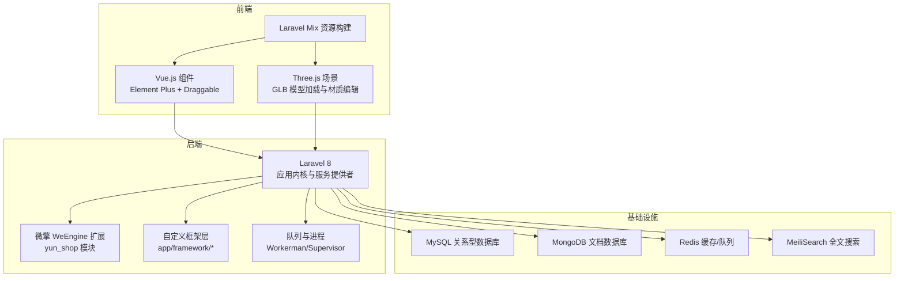
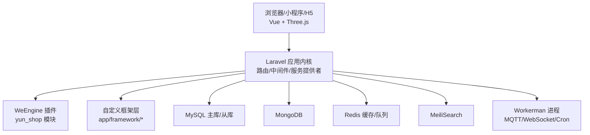
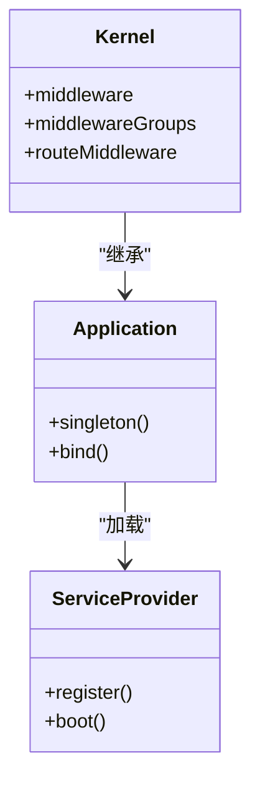
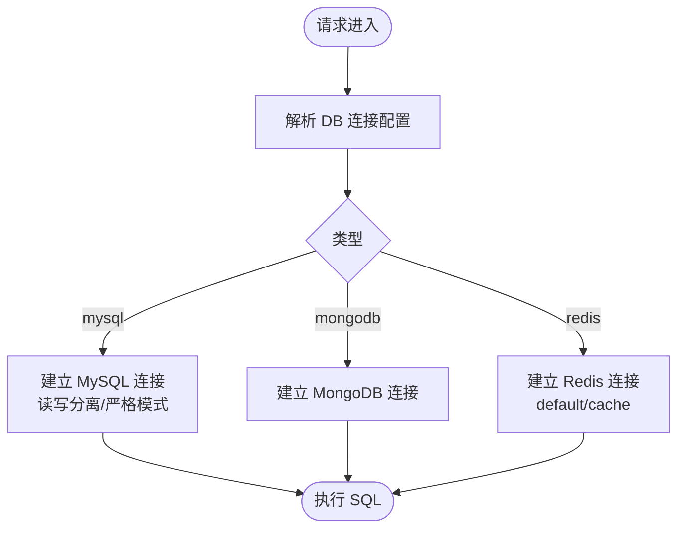
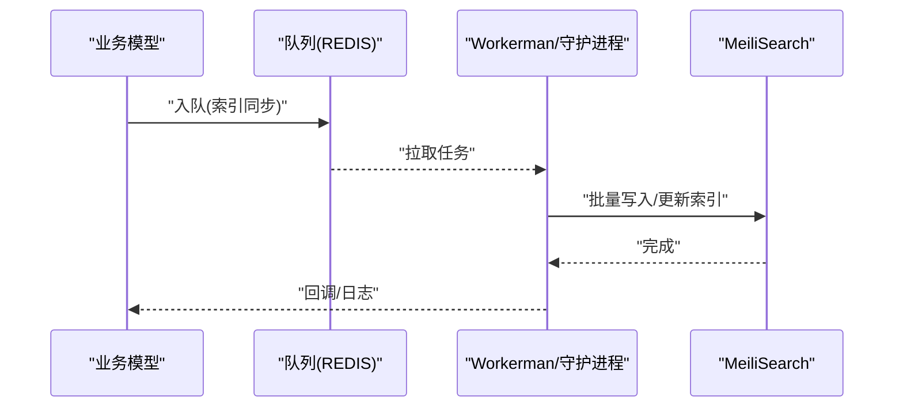
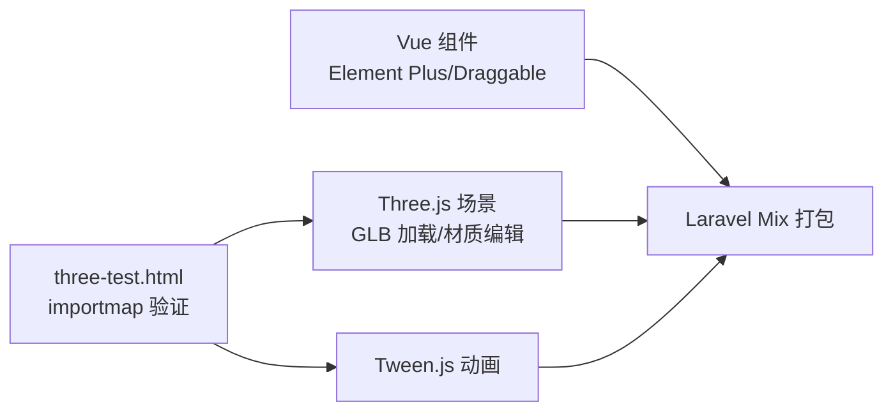
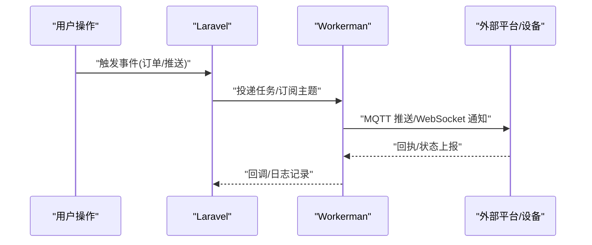
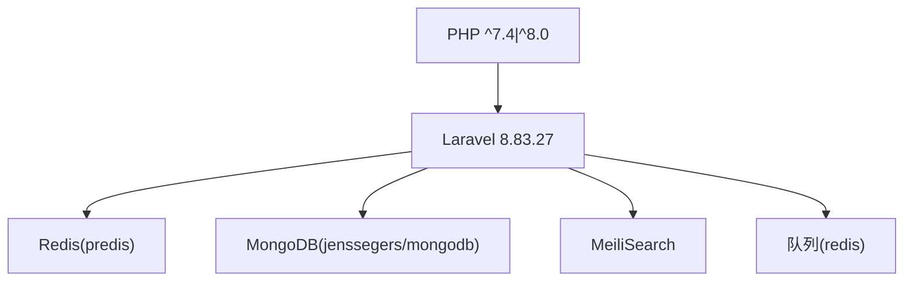

# 技术栈概览

<cite>
**本文档引用的文件**
- [composer.json](file://composer.json)
- [package.json](file://package.json)
- [bootstrap/app.php](file://bootstrap/app.php)
- [config/app.php](file://config/app.php)
- [config/database.php](file://config/database.php)
- [config/queue.php](file://config/queue.php)
- [config/scout.php](file://config/scout.php)
- [config/services.php](file://config/services.php)
- [config/cache.php](file://config/cache.php)
- [app/Kernel.php](file://app/Kernel.php)
- [bakcode/threeStage.blade.php](file://bakcode/threeStage.blade.php)
- [public/three-test.html](file://public/three-test.html)
</cite>

## 目录
1. [引言](#引言)
2. [项目结构](#项目结构)
3. [核心组件](#核心组件)
4. [架构总览](#架构总览)
5. [详细组件分析](#详细组件分析)
6. [依赖关系分析](#依赖关系分析)
7. [性能考虑](#性能考虑)
8. [故障排查指南](#故障排查指南)
9. [结论](#结论)
10. [附录](#附录)

## 引言
本文件面向芸众商城项目，提供全面的技术栈概览与架构说明。重点覆盖后端技术（Laravel 8、微擎 WeEngine 扩展、PHP 8.0+）、前端技术（Vue.js、Three.js、Workerman）、数据库与缓存（MySQL、MongoDB、Redis）、搜索引擎与消息队列等基础设施，并解释各组件的协同机制、版本兼容性与升级路径建议。

## 项目结构
项目采用典型的 Laravel 应用分层组织方式，结合微擎插件化扩展与自研框架层，形成“Laravel 核心 + WeEngine 插件 + 自定义框架层”的混合架构。前端资源通过 Laravel Mix 构建，同时保留独立的 Three.js 场景测试页面用于验证本地模块导入。

**图表来源**
- [config/app.php:140-206](file://config/app.php#L140-L206)
- [config/database.php:173-258](file://config/database.php#L173-L258)
- [config/queue.php:30-66](file://config/queue.php#L30-L66)
- [config/scout.php:18-140](file://config/scout.php#L18-L140)
- [package.json:1-10](file://package.json#L1-L10)

**章节来源**
- [config/app.php:1-309](file://config/app.php#L1-L309)
- [config/database.php:1-304](file://config/database.php#L1-L304)
- [config/queue.php:1-85](file://config/queue.php#L1-L85)
- [config/scout.php:1-143](file://config/scout.php#L1-L143)
- [package.json:1-10](file://package.json#L1-L10)

## 核心组件
- 后端框架与容器
  - Laravel 8.83.27：提供路由、中间件、服务容器、事件系统、队列、缓存、日志等基础能力。
  - 自定义框架层：位于 app/framework，扩展了 Bus、Database、Redis、Log 等子系统。
  - 应用内核：app/Kernel.php 定义全局中间件与路由中间件组，支持安装态、后台、业务域等场景。
- 微擎 WeEngine 扩展
  - 项目以 yun_shop 作为微擎模块名，集成在 addons/yun_shop 下，配合 Laravel 运行。
  - config/app.php 中声明 module_name 与相关服务提供者，确保与 WeEngine 生态兼容。
- 前端技术栈
  - Vue.js：Element Plus + Draggable 实现交互界面；三阶段模型编辑器基于 Vue 组件化开发。
  - Three.js：GLB 模型加载、材质编辑、动画与渲染；tween.js 提供缓动动画支持。
  - Laravel Mix：统一资源打包与热更新。
- 数据与缓存
  - MySQL：主数据库，支持读写分离与多库连接。
  - MongoDB：文档型数据存储，用于非结构化或日志类数据。
  - Redis：缓存与队列，区分 default 与 cache 两个逻辑库。
- 搜索引擎
  - MeiliSearch：全文检索驱动，支持索引同步与队列异步更新。
- 消息队列
  - Redis 队列：默认驱动，支持失败任务记录。
- 进程与实时通信
  - Workerman：MQTT、WebSocket、定时任务守护进程等。
  - Supervisor：进程守护与自动重启。

**章节来源**
- [composer.json:5-142](file://composer.json#L5-L142)
- [config/app.php:140-206](file://config/app.php#L140-L206)
- [config/database.php:173-258](file://config/database.php#L173-L258)
- [config/queue.php:18-66](file://config/queue.php#L18-L66)
- [config/scout.php:18-140](file://config/scout.php#L18-L140)
- [package.json:1-10](file://package.json#L1-L10)

## 架构总览
下图展示了芸众商城的整体技术架构：Laravel 作为核心运行时，WeEngine 作为插件化扩展入口，前端通过 Vue/Three.js 与后端交互，数据层由 MySQL/MongoDB/Redis 共同支撑，搜索引擎与消息队列贯穿业务流程。

**图表来源**
- [config/app.php:140-206](file://config/app.php#L140-L206)
- [config/database.php:173-258](file://config/database.php#L173-L258)
- [config/queue.php:18-66](file://config/queue.php#L18-L66)
- [config/scout.php:18-140](file://config/scout.php#L18-L140)
- [app/Kernel.php:19-77](file://app/Kernel.php#L19-L77)

## 详细组件分析

### 后端框架与容器
- 服务提供者与别名
  - config/app.php 中注册了大量第三方与内部服务提供者，如 Excel、短信、支付、计划任务、导出等，确保功能模块化与按需加载。
  - 自定义 Log 门面绑定到 app/framework/Log 下的 Trace/Debug/Error 实现，便于统一追踪与调试。
- 应用内核
  - app/Kernel.php 定义了 web/admin/api/business 等中间件组，以及 auth 系列路由中间件，满足不同域的鉴权与引导需求。
- 自定义框架层
  - bootstrap/app.php 将自定义 Request、Bus Dispatcher 等绑定到容器，体现项目对 Laravel 的深度定制。

**图表来源**
- [app/Kernel.php:10-77](file://app/Kernel.php#L10-L77)
- [bootstrap/app.php:14-52](file://bootstrap/app.php#L14-L52)
- [config/app.php:140-206](file://config/app.php#L140-L206)

**章节来源**
- [app/Kernel.php:1-78](file://app/Kernel.php#L1-L78)
- [bootstrap/app.php:1-63](file://bootstrap/app.php#L1-L63)
- [config/app.php:140-206](file://config/app.php#L140-L206)

### 数据库与缓存
- MySQL
  - 支持默认连接、客服库、读写分离与 mongodb 连接配置；严格关闭严格模式，字符集 utf8mb4，collation utf8mb4_unicode_ci。
- MongoDB
  - 通过 jenssegers/mongodb 与 mongodb/mongodb 驱动，支持文档型数据存储。
- Redis
  - 默认 client 为 predis，区分 default 与 cache 两个逻辑库；支持持久化选项。

**图表来源**
- [config/database.php:173-258](file://config/database.php#L173-L258)

**章节来源**
- [config/database.php:1-304](file://config/database.php#L1-L304)

### 搜索引擎与队列
- MeiliSearch
  - 默认驱动为 meilisearch，支持索引前缀、队列异步同步、软删除策略等配置。
- 队列
  - 默认驱动为 redis，支持失败任务记录表；可结合 Workerman/Cron 进行后台处理。

**图表来源**
- [config/scout.php:18-140](file://config/scout.php#L18-L140)
- [config/queue.php:18-66](file://config/queue.php#L18-L66)

**章节来源**
- [config/scout.php:1-143](file://config/scout.php#L1-L143)
- [config/queue.php:1-85](file://config/queue.php#L1-L85)

### 前端技术栈与 Three.js 场景
- Vue.js 与 Element Plus
  - 三阶段模型编辑器采用 Vue 组件化开发，Element Plus 提供 UI 控件，Draggable 支持拖拽排序。
- Three.js 与 Tween.js
  - 通过 importmap 将 three 与 @tweenjs/tween.js 映射到静态目录，three-test.html 用于本地验证模块导入。
- 资源构建
  - package.json 依赖 laravel-mix，统一管理前端资源打包与开发服务器。

**图表来源**
- [package.json:1-10](file://package.json#L1-L10)
- [bakcode/threeStage.blade.php:1-800](file://bakcode/threeStage.blade.php#L1-L800)
- [public/three-test.html:1-57](file://public/three-test.html#L1-L57)

**章节来源**
- [package.json:1-10](file://package.json#L1-L10)
- [bakcode/threeStage.blade.php:1-800](file://bakcode/threeStage.blade.php#L1-L800)
- [public/three-test.html:1-57](file://public/three-test.html#L1-L57)

### 进程与实时通信
- Workerman
  - 通过 workerman/workerman 与 workerman/mqtt 提供 MQTT/WebSocket/定时任务守护能力。
- Supervisor
  - 通过 supervisorphp/supervisor 提供进程守护与自动重启，保证后台任务稳定运行。

**图表来源**
- [composer.json:132-133](file://composer.json#L132-L133)
- [config/queue.php:18-66](file://config/queue.php#L18-L66)

**章节来源**
- [composer.json:132-133](file://composer.json#L132-L133)
- [config/queue.php:1-85](file://config/queue.php#L1-L85)

## 依赖关系分析
- 第三方依赖与版本
  - Laravel 8.83.27，PHP ^7.4|^8.0，符合项目要求的 PHP 8.0+ 迁移目标。
  - Redis 使用 predis 客户端，MongoDB 使用 jenssegers/mongodb + mongodb/mongodb。
  - 搜索引擎采用 MeiliSearch，队列默认 Redis。
- 服务提供者与门面
  - config/app.php 中集中注册第三方与内部服务提供者，统一通过门面对外暴露。

**图表来源**
- [composer.json:5-142](file://composer.json#L5-L142)
- [config/database.php:284-302](file://config/database.php#L284-L302)
- [config/scout.php:18-140](file://config/scout.php#L18-L140)
- [config/queue.php:18-66](file://config/queue.php#L18-L66)

**章节来源**
- [composer.json:1-186](file://composer.json#L1-L186)
- [config/database.php:284-302](file://config/database.php#L284-L302)
- [config/scout.php:18-140](file://config/scout.php#L18-L140)
- [config/queue.php:18-66](file://config/queue.php#L18-L66)

## 性能考虑
- 缓存策略
  - config/cache.php 在安装锁存在或非平台框架时默认启用 Redis 缓存，避免文件缓存的 IO 开销。
- 队列与异步
  - 使用 Redis 队列承载耗时任务，结合 Workerman 处理实时通信，降低请求延迟。
- 搜索性能
  - MeiliSearch 适合中小规模全文检索，建议结合队列异步同步，避免写入高峰阻塞。
- 数据库优化
  - MySQL 关闭严格模式，适配历史数据；读写分离与索引优化可进一步提升吞吐。

[本节为通用性能建议，无需特定文件引用]

## 故障排查指南
- 日志与异常
  - 自定义 Log 门面绑定到 app/framework/Log，便于追踪 Trace/Debug/Error 日志。
  - 异常处理器绑定到 app/common/exceptions/Handler，统一处理未捕获异常。
- 队列失败
  - failed_jobs 表记录失败任务，便于重试与定位问题。
- 缓存与搜索引擎
  - 若缓存异常，检查 CACHE_DRIVER 与 Redis 连接；若搜索无结果，确认 MeiliSearch 可达且索引同步队列正常。

**章节来源**
- [bootstrap/app.php:28-48](file://bootstrap/app.php#L28-L48)
- [config/queue.php:79-82](file://config/queue.php#L79-L82)
- [config/cache.php:22-78](file://config/cache.php#L22-L78)
- [config/scout.php:18-140](file://config/scout.php#L18-L140)

## 结论
芸众商城采用“Laravel + WeEngine 插件 + 自定义框架层”的混合架构，结合 Vue/Three.js 前端与 Workerman 实时能力，形成前后端分离、数据与缓存多层支撑的完整技术体系。通过 Redis、MeiliSearch、MongoDB 等基础设施，项目实现了高性能、可扩展与易维护的电商解决方案。建议在后续版本中持续关注 Laravel 与 PHP 的升级路径，保持生态兼容性与安全性。

## 附录

### 版本兼容性与升级路径
- PHP 与 Laravel
  - 当前依赖 PHP ^7.4|^8.0，建议逐步迁移至 PHP 8.1+，并升级 Laravel 至 10.x 以获得长期支持。
- Redis
  - 使用 predis 客户端，未来可评估迁移到 phpredis 以提升性能。
- MeiliSearch
  - 采用官方 PHP SDK，建议定期升级至最新版本以获取新特性与安全修复。
- Workerman
  - 当前版本 4.1.15，建议关注官方变更并在测试环境验证后再上线。

**章节来源**
- [composer.json:6-142](file://composer.json#L6-L142)
- [config/database.php:284-302](file://config/database.php#L284-L302)
- [config/scout.php:18-140](file://config/scout.php#L18-L140)
- [composer.json:132-133](file://composer.json#L132-L133)