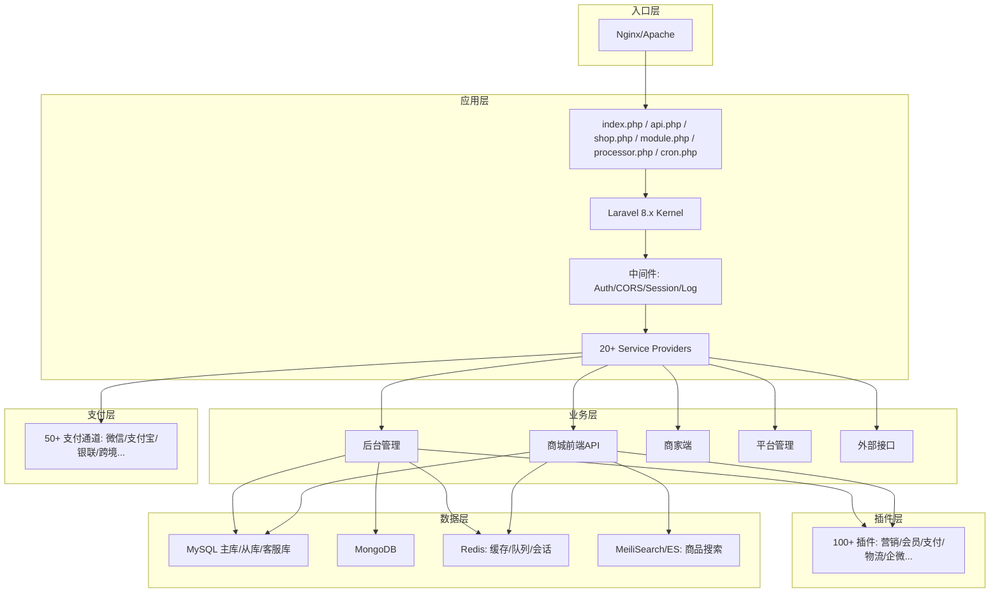

# 项目介绍与定位

<cite>
**本文引用的文件**
- [README.md](file://README.md)
- [架构设计文档](file://docs/architecture_design.md)
- [仓库Wiki](file://docs/repo_wiki.md)
- [部署与配置文档](file://docs/deployment_and_config.md)
- [应用配置(app.php)](file://config/app.php)
- [版本配置(version.php)](file://config/version.php)
- [芸众引导(yunshop.php)](file://app/yunshop.php)
- [支付工厂(PayFactory.php)](file://app/common/services/PayFactory.php)
- [路由(business.php)](file://routes/business.php)
</cite>

## 目录
1. [简介](#简介)
2. [项目定位与价值主张](#项目定位与价值主张)
3. [目标用户与适用场景](#目标用户与适用场景)
4. [核心能力与技术特色](#核心能力与技术特色)
5. [商业模式与竞争优势](#商业模式与竞争优势)
6. [架构概览与数据流](#架构概览与数据流)
7. [实施与落地建议](#实施与落地建议)
8. [结语](#结语)

## 简介
芸众商城是一个基于 Laravel 8 + 微擎（WeEngine）构建的大型 SaaS 电商中台系统，以“插件化架构 + 多渠道支付 + 3D可视化”为核心技术特色，提供覆盖 B2C 商城、分销裂变、社区营销、直播带货、门店 POS 等全链路电商解决方案。项目具备成熟的多入口体系、完善的插件生态、统一的支付中台以及丰富的业务模块，适合中大型企业与平台型组织快速搭建标准化电商中台。

- 项目定位：SaaS 电商中台系统，强调“统一入口、统一能力、统一治理”的多端一体化运营。
- 技术特色：多入口分发、插件化扩展、支付通道统一接入、事件驱动与异步队列、3D可视化与CAD解析、搜索引擎双引擎支持。
- 版本信息：主版本 2.3.359，后台 2.1.874，前端 2.2.988，商家端 1.1.113。

**章节来源**
- [README.md:1-3](file://README.md#L1-L3)
- [架构设计文档:12-28](file://docs/architecture_design.md#L12-L28)
- [版本配置(version.php):11](file://config/version.php#L11)

## 项目定位与价值主张
芸众商城的价值在于为企业提供“可插拔、可扩展、可治理”的电商中台能力，帮助企业在多终端、多渠道、多业务形态下实现统一管理与高效协同。其核心价值主张体现在：

- 多端统一管理：通过统一入口与路由分发，实现后台、前端、商家端、平台端的统一运营与数据互通。
- 插件化生态：100+ 插件覆盖营销、会员、支付、物流、企微、门店 POS 等领域，按需启用，降低耦合与升级成本。
- 支付中台：统一接入 50+ 支付通道，支持微信、支付宝、银联、跨境、余额、聚合支付等，统一风控与对账。
- 事件驱动与异步：通过事件与队列解耦核心业务，提升系统稳定性与扩展性。
- 3D可视化与CAD解析：为工业品/建材/家具等品类提供 3D 模型在线预览与 CAD 图纸解析能力，增强用户体验与转化效率。

这些能力共同构成“统一入口 + 统一能力 + 统一治理”的中台优势，满足企业从单一电商到多业态融合的演进需求。

**章节来源**
- [架构设计文档:12-28](file://docs/architecture_design.md#L12-L28)
- [仓库Wiki:332-361](file://docs/repo_wiki.md#L332-L361)
- [部署与配置文档:159-227](file://docs/deployment_and_config.md#L159-L227)

## 目标用户与适用场景
- 目标用户
  - 中大型制造/商贸企业：需要统一管理多渠道销售与多终端运营。
  - 平台型组织：需要标准化中台能力，向下赋能多商家/多门店。
  - 工业品/建材/家具/家装等强视觉/强模型类目：需要 3D 模型与 CAD 解析能力。
  - 需要灵活营销与分销体系的企业：通过插件化生态快速上线拼团、分销、直播等营销活动。

- 适用场景
  - 多端统一运营：后台管理、前端商城、商家端、平台端统一入口与数据。
  - 多渠道接入：小程序、H5、APP、PC、直播、门店 POS 等多入口统一治理。
  - 多支付通道：统一接入微信、支付宝、银联、跨境、余额、聚合支付等。
  - 多业务模块：营销活动、会员体系、订单履约、财务结算、客服与数据分析等。

**章节来源**
- [仓库Wiki:332-361](file://docs/repo_wiki.md#L332-L361)
- [部署与配置文档:301-316](file://docs/deployment_and_config.md#L301-L316)

## 核心能力与技术特色
- 多入口与路由分发
  - 多入口文件：index.php、api.php、shop.php、module.php、processor.php、cron.php 等，分别承载 Web、微擎、商城、模块、消息、定时任务等场景。
  - 路由分发：根据 APP_Framework 配置选择平台模式或微擎模式，支持后台、前端、商家端、外部接口等多路由域。
- 插件化架构
  - 统一目录规范与命名空间，SPL 自动加载，生命周期管理（启用/禁用/删除）。
  - 100+ 插件覆盖营销、会员、支付、物流、企微、门店 POS 等。
- 支付中台
  - 统一 PaymentServiceProvider 注册 50+ 支付通道，支持微信、支付宝、银联、跨境、余额、聚合支付等。
  - 支付回调独立入口，CSRF 白名单，签名验证与幂等处理。
- 事件驱动与异步队列
  - 200+ 事件与 50+ 监听器，67 个 Job 类，Redis Queue + Workerman MQTT。
- 3D 可视化与 CAD 解析
  - Three.js 与 Tween.js 实现 3D 模型在线预览与交互动画。
  - 支持 DWG 文件解析，提供下载限流与黑/白名单策略。
- 搜索引擎与数据存储
  - 支持 MeiliSearch 与 Elasticsearch 双引擎，MySQL + MongoDB + Redis 混合存储。

**章节来源**
- [架构设计文档:196-217](file://docs/architecture_design.md#L196-L217)
- [架构设计文档:375-391](file://docs/architecture_design.md#L375-L391)
- [仓库Wiki:363-397](file://docs/repo_wiki.md#L363-L397)
- [部署与配置文档:159-227](file://docs/deployment_and_config.md#L159-L227)

## 商业模式与竞争优势
- 商业模式
  - SaaS 订阅：提供标准化中台能力，按租户/插件/功能模块收费，支持多租户隔离与独立域名。
  - 插件市场：通过插件生态实现二次开发与增值，平台与开发者分成。
  - 定制化服务：针对行业与规模提供定制化开发与实施服务，形成持续收入。
  - 数据与运营：通过统一数据中台与运营工具，提供数据分析与运营建议服务。

- 竞争优势
  - 技术成熟度：100+ 插件、50+ 支付通道、事件驱动与异步队列，具备高扩展性与稳定性。
  - 行业适配：3D 可视化与 CAD 解析能力，适合工业品/建材/家具等强视觉类目。
  - 多端统一：统一入口与路由分发，降低多端管理成本。
  - 生态开放：插件化与支付中台开放性强，便于第三方接入与二次开发。

**章节来源**
- [仓库Wiki:332-361](file://docs/repo_wiki.md#L332-L361)
- [部署与配置文档:159-227](file://docs/deployment_and_config.md#L159-L227)

## 架构概览与数据流
芸众商城采用“多入口 + 框架层 + 业务层 + 插件层 + 支付层 + 数据层”的分层架构，请求从 Nginx/Apache 进入，经入口文件分发到 Laravel 核心，再由中间件与路由进入控制器，调用服务层、仓储层与基础设施层，最终访问数据库、缓存与搜索引擎。插件与支付通道通过统一的服务提供者注册，事件与队列贯穿整个流程。

**图表来源**
- [部署与配置文档:159-227](file://docs/deployment_and_config.md#L159-L227)

**章节来源**
- [部署与配置文档:159-227](file://docs/deployment_and_config.md#L159-L227)

## 实施与落地建议
- 环境与部署
  - 建议使用平台模式（APP_Framework=platform），通过 .env 配置数据库、Redis、搜索引擎等，确保与微擎模式的差异可控。
  - 使用 Nginx 配置多入口路由，确保 /addons/、/payment/ 等路径正确转发。
  - 启动队列 Worker 与 Workerman（MQTT），并使用 Supervisor 守护进程。

- 插件与支付
  - 按需启用插件，避免不必要的耦合；通过 Setting 与插件配置项控制开关。
  - 支付通道统一接入，确保回调 URL 在支付平台配置为 CSRF 白名单，并做好签名验证与幂等处理。

- 数据与缓存
  - 合理利用 Redis 缓存策略（如商品详情缓存 24 小时），结合下载限流与黑名单机制保障资源安全。
  - 搜索引擎可选择 MeiliSearch 或 Elasticsearch，按业务规模与复杂度评估。

- 运维与监控
  - 建立日志与告警机制，关注 Laravel 日志、队列失败、支付回调、搜索服务状态等关键指标。
  - 定期清理缓存与索引，保持系统性能稳定。

**章节来源**
- [部署与配置文档:319-517](file://docs/deployment_and_config.md#L319-L517)
- [部署与配置文档:546-632](file://docs/deployment_and_config.md#L546-L632)

## 结语
芸众商城作为 SaaS 电商中台系统，凭借“多端统一管理 + 插件化生态 + 支付中台 + 事件驱动 + 3D可视化”的技术特色，能够有效解决传统电商系统在多渠道割裂、扩展困难、支付分散、体验不足等方面的痛点。对于希望实现多端一体化运营、灵活扩展与高效治理的企业而言，芸众商城提供了标准化、可扩展、可治理的中台能力，是值得优先考虑的解决方案。