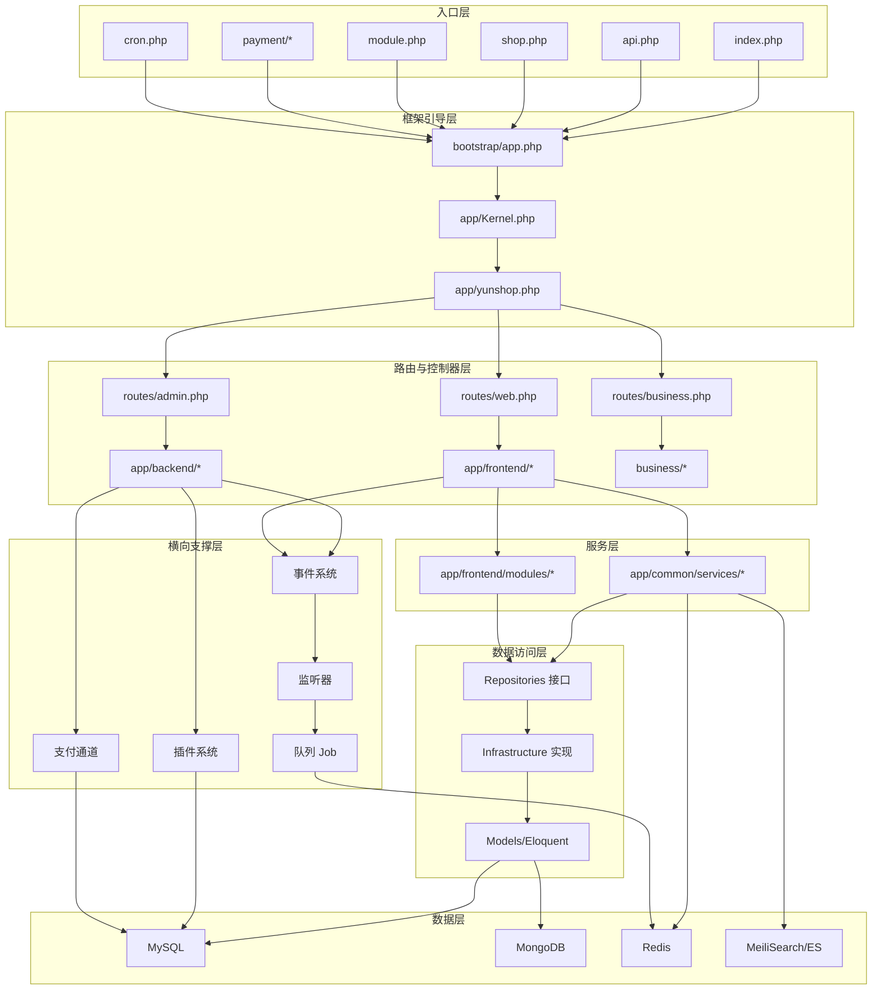
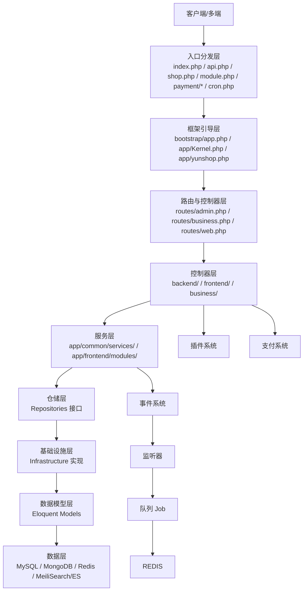
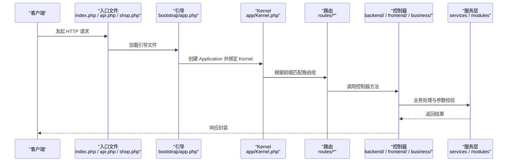
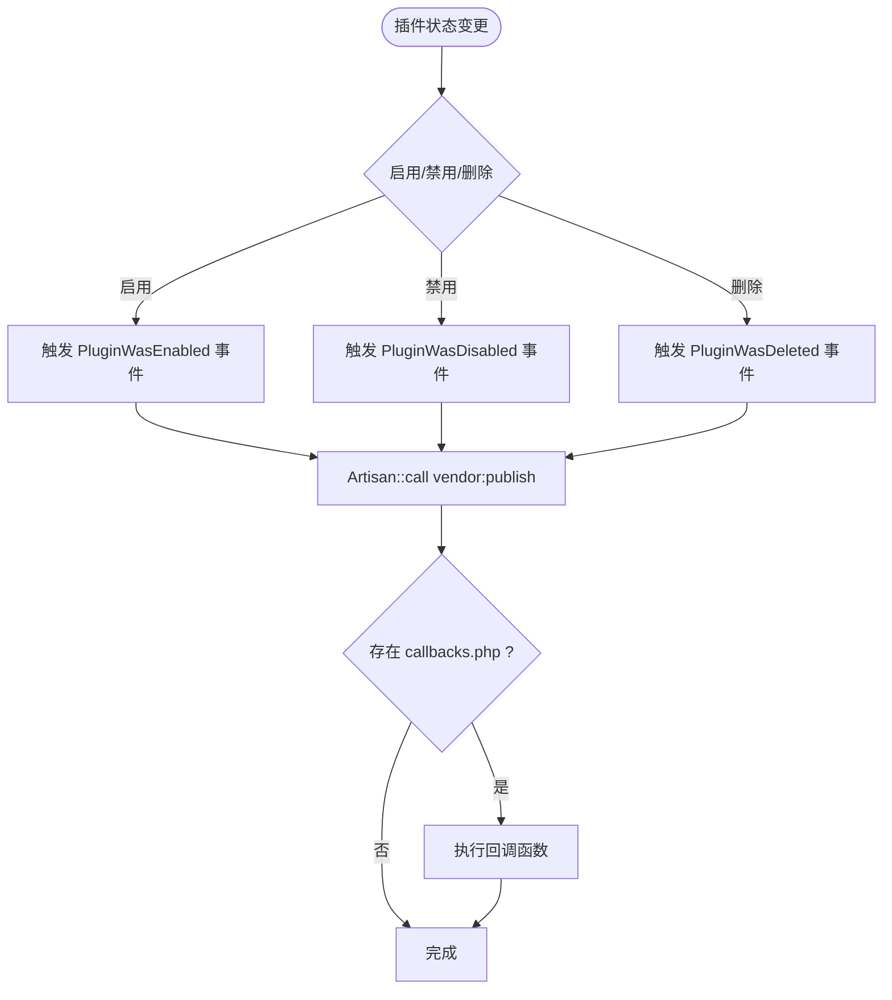
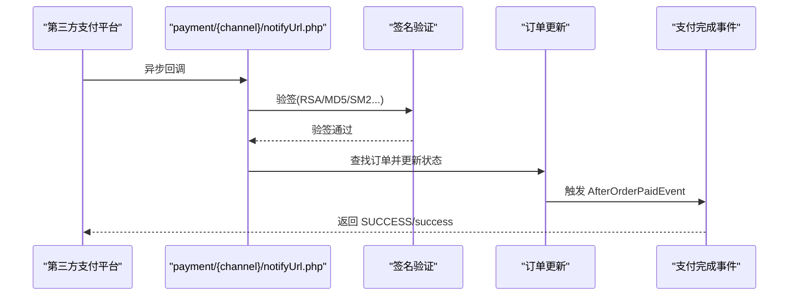
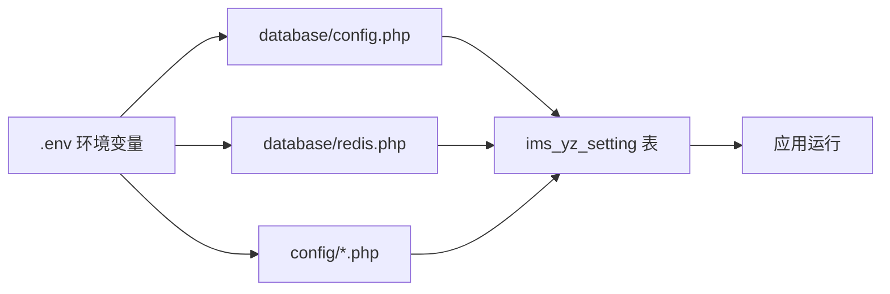

# 项目概述

<cite>
**本文引用的文件**
- [README.md](file://README.md)
- [架构设计文档](file://docs/architecture_design.md)
- [部署与配置文档](file://docs/deployment_and_config.md)
- [项目模块交接文档](file://docs/project_module_handover.md)
- [app/yunshop.php](file://app/yunshop.php)
- [composer.json](file://composer.json)
- [config/app.php](file://config/app.php)
- [app/common/providers/ShopProvider.php](file://app/common/providers/ShopProvider.php)
- [app/common/providers/PluginServiceProvider.php](file://app/common/providers/PluginServiceProvider.php)
- [app/Kernel.php](file://app/Kernel.php)
- [bootstrap/app.php](file://bootstrap/app.php)
- [routes/admin.php](file://routes/admin.php)
- [routes/business.php](file://routes/business.php)
- [routes/web.php](file://routes/web.php)
</cite>

## 目录
1. [简介](#简介)
2. [项目结构](#项目结构)
3. [核心组件](#核心组件)
4. [架构总览](#架构总览)
5. [详细组件分析](#详细组件分析)
6. [依赖分析](#依赖分析)
7. [性能考量](#性能考量)
8. [故障排查指南](#故障排查指南)
9. [结论](#结论)
10. [附录](#附录)

## 简介
芸众商城是一个基于 Laravel 8 + 微擎（WeEngine）的大型 SaaS 电商中台系统，以“插件化架构 + 多渠道支付 + 3D可视化”为核心技术特色，覆盖 B2C 商城、分销裂变、社区营销、直播带货、门店 POS 等全链路电商解决方案。项目通过统一的入口分发、多入口路由、事件驱动与插件化生态，实现多端统一管理与高扩展性。

- 项目定位与价值主张
  - SaaS 电商中台：统一平台、多租户、多端协同
  - 多端统一管理：后台管理、商家端、前端商城、外部接口统一入口
  - 插件化生态：100+ 插件，覆盖营销、会员、支付、物流、企业微信等
  - 支付中台：50+ 支付通道，统一接入与回调处理
  - 3D 可视化：Three.js 驱动的商品 3D 模型预览与交互

- 项目背景与发展历程
  - 项目长期演进，形成成熟的多入口、多路由、多业务域分层架构
  - 通过 Service Provider 体系、事件系统、插件自动加载与生命周期管理，持续增强扩展性与稳定性

- 应用场景
  - 多品牌多门店的统一运营
  - 营销活动的灵活组合与快速上线
  - 供应链与支付通道的标准化接入
  - 3D 商品展示与客户体验提升

- 快速开始
  - 环境要求：PHP 7.4+/8.0、MySQL、Redis、MeiliSearch、Nginx、Composer
  - 部署要点：APP_Framework=platform 模式、.env 配置、数据库迁移、Nginx 路由、队列与 Workerman 进程守护
  - 常用命令：缓存清理、队列启动、搜索索引导入、进程状态查看

**章节来源**
- [README.md:1-3](file://README.md#L1-L3)
- [架构设计文档:10-28](file://docs/architecture_design.md#L10-L28)
- [部署与配置文档:9-18](file://docs/deployment_and_config.md#L9-L18)
- [部署与配置文档:319-334](file://docs/deployment_and_config.md#L319-L334)

## 项目结构
项目采用“多入口 + 多路由 + 分层架构”的组织方式，入口文件负责请求分发，路由文件定义不同域的控制器，服务层承载业务逻辑，仓储层解耦数据访问，插件系统提供生态扩展。

**图表来源**
- [架构设计文档:29-146](file://docs/architecture_design.md#L29-L146)
- [部署与配置文档:229-283](file://docs/deployment_and_config.md#L229-L283)

**章节来源**
- [架构设计文档:29-146](file://docs/architecture_design.md#L29-L146)
- [部署与配置文档:229-283](file://docs/deployment_and_config.md#L229-L283)

## 核心组件
- 入口与引导
  - 多入口文件：index.php、api.php、shop.php、module.php、payment/*、cron.php 等，分别承担 Web、微擎、支付回调、定时任务等职责
  - 引导文件：bootstrap/app.php 创建 Application，绑定 Kernel、Console Kernel、异常处理器
  - 核心类：app/yunshop.php 定义 YunShop/YunApp/YunPlugin/YunNotice 等全局工具与上下文

- 中间件与路由
  - Kernel 定义全局中间件（维护模式、ShopRoute）与路由中间件组（web/admin/api/business）
  - 路由文件：routes/admin.php、routes/business.php、routes/web.php 等，分别承载后台、商家端、前端 API 的路由

- 服务提供者与 IoC
  - 14 个 ServiceProvider 负责注册服务、中间件、路由、事件监听等
  - ShopProvider 注册 SettingCache、GoodsManager、OrderManager、CartContainer、StatusContainer、物流与短信等核心业务容器
  - PluginServiceProvider 实现插件自动加载、命名空间注册、生命周期回调

- 事件与队列
  - 事件驱动：EventServiceProvider 绑定 100+ 事件与监听器
  - 队列：Redis Queue + Workerman MQTT，67 个 Job 类支撑异步处理

- 插件系统
  - 统一目录规范与 SPL 自动加载，插件启用/禁用/删除时触发事件并发布静态资源
  - 插件分类覆盖营销、会员、商品、内容、企业微信、运营工具、交易支付、配送物流、门店 POS、小程序/App、第三方对接等

- 支付系统
  - PaymentServiceProvider 统一注册 50+ 支付通道，回调入口独立，支持微信、支付宝、银联/云闪付、聚合支付、跨境支付、余额/储值、分期/信用、三方通道等
  - 支付安全：CSRF 白名单、签名验证、幂等处理、日志记录、金额校验

**章节来源**
- [app/yunshop.php:16-621](file://app/yunshop.php#L16-L621)
- [app/Kernel.php:10-78](file://app/Kernel.php#L10-L78)
- [bootstrap/app.php:14-63](file://bootstrap/app.php#L14-L63)
- [app/common/providers/ShopProvider.php:35-127](file://app/common/providers/ShopProvider.php#L35-L127)
- [app/common/providers/PluginServiceProvider.php:18-125](file://app/common/providers/PluginServiceProvider.php#L18-L125)
- [架构设计文档:327-392](file://docs/architecture_design.md#L327-L392)
- [架构设计文档:790-792](file://docs/architecture_design.md#L790-L792)
- [架构设计文档:9.1-9.5:716-787](file://docs/architecture_design.md#L716-L787)

## 架构总览
芸众商城采用“多入口 + 多路由 + 分层架构 + 插件化 + 支付中台”的整体设计，通过统一入口分发请求至 Laravel Kernel，再由路由与控制器进入服务层，最终通过仓储层访问数据源。事件系统贯穿业务流程，插件与支付通道作为横向支撑能力，Redis、MySQL、MongoDB、MeiliSearch/ES 构成数据层。

**图表来源**
- [架构设计文档:10-146](file://docs/architecture_design.md#L10-L146)
- [部署与配置文档:155-227](file://docs/deployment_and_config.md#L155-L227)

**章节来源**
- [架构设计文档:10-146](file://docs/architecture_design.md#L10-L146)
- [部署与配置文档:155-227](file://docs/deployment_and_config.md#L155-L227)

## 详细组件分析

### 组件A：多入口与路由体系
- 入口分发机制
  - 入口文件：index.php、api.php、shop.php、module.php、payment/*、cron.php 等
  - 路由分发：RouteServiceProvider 根据 config('app.framework') 选择平台模式或微擎模式加载路由
  - URL 命名约定：后台 /admin/*、商家端 /business/{uniacid}/*、外部接口 /outside/{uniacid}/*、前端 API /app/{module}.{controller}.{action}

- 路由文件与中间件组
  - routes/admin.php：后台登录、安装向导、系统设置、权限与用户管理、应用管理、插件套餐等
  - routes/business.php：100+ 插件路由，覆盖客户管理、企业微信、POS 收银、外呼电销、商机管理等
  - routes/web.php：微擎兼容路由与通用 Web 路由

**图表来源**
- [架构设计文档:150-194](file://docs/architecture_design.md#L150-L194)
- [routes/admin.php:1-259](file://routes/admin.php#L1-L259)
- [routes/business.php:1-554](file://routes/business.php#L1-L554)
- [routes/web.php:1-17](file://routes/web.php#L1-L17)

**章节来源**
- [架构设计文档:196-217](file://docs/architecture_design.md#L196-L217)
- [routes/admin.php:1-259](file://routes/admin.php#L1-L259)
- [routes/business.php:1-554](file://routes/business.php#L1-L554)
- [routes/web.php:1-17](file://routes/web.php#L1-L17)

### 组件B：插件化架构
- 插件目录规范
  - plugins/{plugin-name}/src、views、assets、config、lang、migrations、plugin.json、callbacks.php
- 自动加载与生命周期
  - PluginServiceProvider 使用 SPL 自动注册插件命名空间与类加载
  - 插件启用/禁用/删除时触发事件，执行 vendor:publish 并回调 callbacks.php

**图表来源**
- [架构设计文档:664-678](file://docs/architecture_design.md#L664-L678)
- [app/common/providers/PluginServiceProvider.php:59-76](file://app/common/providers/PluginServiceProvider.php#L59-L76)

**章节来源**
- [架构设计文档:612-710](file://docs/architecture_design.md#L612-L710)
- [app/common/providers/PluginServiceProvider.php:18-125](file://app/common/providers/PluginServiceProvider.php#L18-L125)

### 组件C：支付中台
- 支付通道目录结构
  - payment/{channel}/notifyUrl.php、refundNotifyUrl.php、lib/、config.php
- 回调流程
  - 第三方异步通知 → payment/{channel}/notifyUrl.php 接收 → 签名校验 → 查找订单 → 更新状态 → 触发支付完成事件

**图表来源**
- [架构设计文档:751-762](file://docs/architecture_design.md#L751-L762)

**章节来源**
- [架构设计文档:712-787](file://docs/architecture_design.md#L712-L787)

### 组件D：3D 可视化与商品模块（Project 模块）
- 模块职责
  - 商品详情、搜索、CAD 解析、规格树、推荐、空间管理、订单与发票、PPT 方案书等
- 分层架构
  - Controller → Service → Repository → Infrastructure → Model，严格解耦数据访问
- API 接口示例
  - 商品：conditions/search/previewList、getGoodsInfo/getGoodsOption/getComment/click、updateUnitPrice/updateOption/analysis/analysisV2、getCadProgress/getBatchProgress/refreshRecommendGoods/refreshRecommendGoodsV3
  - 搜索：search/search_goods_category/search_goods_model/search_fuzzy/getSearchData/delete/reindexAll/updateData
  - 项目：createProject/editProject/updateProject/detail/getList/getListV2/getMyProject/getActiveProject/switchActiveProject/getUserProject/copyProject/delete/realDelete/restore/updateStatus/updatePrice
  - 空间：addSpace/add3DSpace/createSpace/editSpace/delSpace/delGoods/updateNum/getProductList/getProductListV2/moveCartItem/copySpace/customized/test
  - 订单：preOrder/createOrder/verifyBeforeOrder/submitOrderSuccess/getList/detail/delete/recycle/getRecycleOrder/getAddress/getOrderGoods/getDrawList/batchConfirm/getProductSchedule/getAfterSalesOrder/getAfterSalesOrderDetail/getLogisticsTrack/getInstallTrack/getRemittanceResult/confirmSign/cancelConfirm/setExtraAmount/changePrice/getPickupPoint/deliveryBill/getPayVoucher
  - 会员/供应商：storeUserProfile/getMemberInfo/getIndustry/updatePwd/sendCode/applyContact/verifyRealName/verifyCompany/getRealNameStatus/getCompanyStatus/applyStepOne/applyStepTwo/applyStepThree/applySupplier/applyAccountVerify/amountVerify/improveShop/getApplyStatus/cancelApply/revalidation/updateContacts/checkUser/getFollowSupplier/getFollowCase/getFollowCaseLable/generateQrCode/handleCallback/bindStatus/checkAuthStatus/unbind/getNotifice/setRead/getUnRead/getMapSet
  - 品牌/供应商：conditions/search/detail/getBrandGoods/getBrandOther/follow/getServiceUrl
  - 行业案例：getList/getCaseLable/detail/toggleFavorite
  - 项目报备：applyFor/getList/detail/edit/cancel/getRecommendBrand/searchBrand/getSearchData/upload
  - 投标：applyFor/getList/detail/cancelApply/getRecommendBrand/searchBrand/getBidInformation
  - 上门测量：reqDoor/getList/getDetail/getProjectList/getProjectService/getServiceFee/getDoorFee/addAmount/acceptanceCheck/getAfterSales
  - 工厂考察：applyFor/getList/getApplyData/detail/delete/cancelApply
  - 云设计：designList/saveDesign/getDesignDetail/getPublicDesignDetail/duplicateDesign/renameDesign/deleteDesign/designRecycleList/restoreDesign/deleteDesignReal/seriesGoods/relatedProducts/uploadDwg/getSearchCategory/getSearchPlace/getMyCollect/checkOverlap/getRecommendIndustry/getIssueOptions/submitIssue/getGoodsStatus/getPublicGoodsStatus
  - 发票：storeTitle/updateTitle/destroyTitle/setDefault/getTitleList/apply/updateApply/getList/getDetail/revoke/getNotInvoice
  - 报价模板：saveTemplate/getTemplate/updateData
  - PPT 方案书：getTemplate/generatePpt/export/savePpt/delete

**章节来源**
- [项目模块交接文档:9-118](file://docs/project_module_handover.md#L9-L118)
- [项目模块交接文档:144-800](file://docs/project_module_handover.md#L144-L800)

## 依赖分析
- 技术栈与依赖
  - 框架：Laravel 8.83.27 + 微擎（WeEngine）
  - 数据库：MySQL（ims_ 前缀）、MongoDB、Redis
  - 搜索：MeiliSearch / Elasticsearch
  - 中间件与队列：Workerman、MQTT、Redis Queue
  - 第三方集成：微信、支付宝、企业微信、短信、OSS/COS/OBS、直播等

- 配置优先级
  - .env（最高）→ database/config.php（微擎模式）→ database/redis.php（平台模式）→ config/*.php → 数据库 ims_yz_setting（业务配置）

**图表来源**
- [部署与配置文档:617-627](file://docs/deployment_and_config.md#L617-L627)

**章节来源**
- [composer.json:1-186](file://composer.json#L1-L186)
- [config/app.php:140-206](file://config/app.php#L140-L206)
- [部署与配置文档:617-627](file://docs/deployment_and_config.md#L617-L627)

## 性能考量
- 数据库查询优化
  - PDO::FETCH_ASSOC 默认提取模式，减少对象转换开销
  - Repository/Infrastructure 解耦，便于缓存与分页策略实施
- 缓存与搜索
  - 商品详情缓存 24 小时，3D 模型数据实时加载
  - MeiliSearch/ES 双引擎支持全文检索与多维筛选
- 队列与异步
  - Redis Queue + Workerman MQTT，67 个 Job 类支撑异步处理
  - 下载限流与黑名单策略，避免资源滥用
- 3D 可视化
  - Three.js 0.171.0 + Tween.js 18.64，模型预览与交互动画优化

[本节为通用指导，不直接分析具体文件]

## 故障排查指南
- 常见问题与检查项
  - 页面 500：查看 Laravel 日志、开启 APP_DEBUG 定位错误
  - 搜索无结果：检查 MeiliSearch 服务健康状态
  - 队列堆积：监控 Redis 内存与 Worker 进程数
  - 支付回调失败：确认回调 URL 在支付平台配置为 CSRF 白名单、检查日志
  - 下载限流异常：检查 Redis keys（dl_limit_*、dl_blacklist:*）
  - 3D 模型加载慢：检查 CDN、文件大小与 Redis 缓存命中率
  - 数据库连接失败：核对 database/config.php 与 .env 配置一致性

- 运维命令
  - 应用维护：down/up
  - 缓存管理：cache:clear、config:clear、route:clear、view:clear、optimize:clear
  - 队列管理：queue:work、queue:failed、queue:retry all、queue:flush
  - 数据库：migrate、migrate:rollback、migrate:status、db:seed
  - 搜索：scout:import "App\Models\Goods"
  - 进程管理：shop start/stop/restart/status

**章节来源**
- [部署与配置文档:593-632](file://docs/deployment_and_config.md#L593-L632)

## 结论
芸众商城通过“多入口 + 多路由 + 分层架构 + 插件化 + 支付中台”的设计，实现了 SaaS 电商中台的高扩展性与多端统一管理。其核心能力包括：
- 多端统一入口与路由分发
- 100+ 插件的生态扩展
- 50+ 支付通道的统一接入与安全回调
- 事件驱动与队列异步处理
- 3D 可视化与商品搜索优化

该架构在保证系统稳定性的同时，提供了灵活的业务组合与快速迭代能力，适合多品牌、多门店、多渠道的电商运营场景。

[本节为总结性内容，不直接分析具体文件]

## 附录
- 快速开始清单
  - 环境准备：PHP 7.4+/8.0、MySQL、Redis、MeiliSearch、Nginx、Composer
  - 部署步骤：复制 .env、安装依赖、数据库迁移、Nginx 配置、启动队列与 Workerman
  - 常用命令：缓存清理、队列启动、搜索索引导入、进程状态查看

**章节来源**
- [部署与配置文档:319-493](file://docs/deployment_and_config.md#L319-L493)